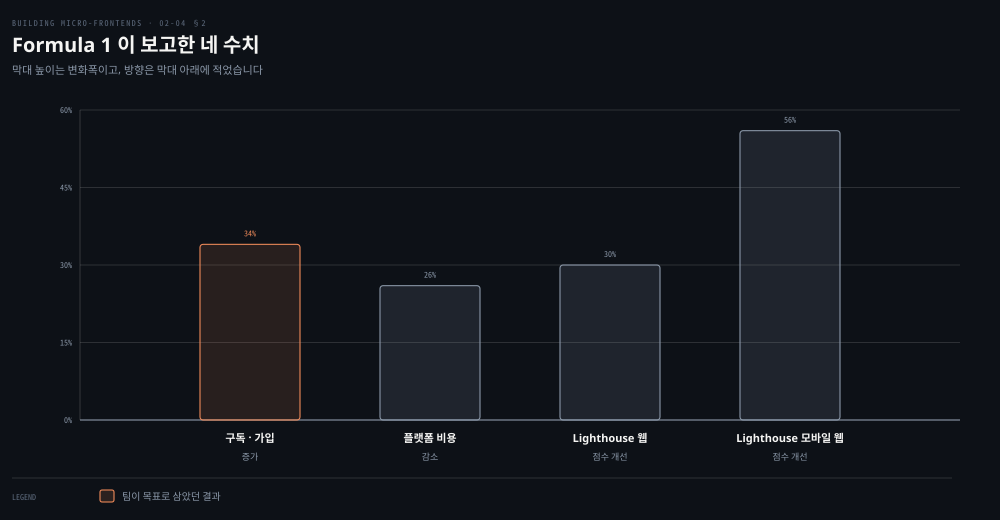

# 여덟 회사가 고른 길

---

> 2장은 결정 프레임워크를 세운 뒤 그 결정을 실제로 내린 조직들을 보여 주며 닫습니다. 여덟 회사가 저마다 다른 자리를 골랐고, 그 차이가 프레임워크가 강제하지 않는 것이 무엇인지 알려 줍니다.

## 핵심 요약

> 이 편 전체가 매달린 하나의 생각은 **여덟 조직이 같은 프레임워크 안에서 서로 다른 조합을 골랐고, 그 다양성 자체가 마이크로 프론트엔드에 정답 구성이 없다는 증거**라는 것입니다.
>
> 저자는 마이크로 프론트엔드가 프론트엔드 아키텍처 생태계에서 꽤 새로운 접근이지만 중대형 조직에서 10년간 쓰여 왔다고 적습니다.
>
> 수치가 남은 사례는 하나뿐입니다. Formula 1이 모놀리식에서 옮긴 뒤 구독·가입 34% 증가와 플랫폼 비용 26% 절감, Lighthouse 점수 개선을 보고했습니다.
>
> 나머지 일곱은 접근의 다양성을 보여 줍니다. 서버 사이드 렌더링 조합을 쓴 곳이 있고, 완전히 클라이언트 사이드로 간 곳이 있으며, 레지스트리에서 HTML 조각을 받아 어느 템플릿에나 심는 곳도 있습니다.
>
> 브라우저 밖으로도 나갑니다. 저자는 성공적인 소프트웨어가 브라우저뿐 아니라 데스크톱 애플리케이션과 콘솔과 스마트TV에서도 돌고 있다고 마무리합니다.

## 학습 목표

이 내용을 읽고 나면:

1. Formula 1이 마이그레이션 뒤 보고한 네 수치를 재현하고 그 방향이 서로 다름을 설명할 수 있습니다.
2. 여덟 조직이 각각 어떤 조합·기술을 골랐는지 구분해 말할 수 있습니다.
3. Module Federation을 채택한 조직들이 그것으로 무엇을 풀었는지 댈 수 있습니다.
4. 사례들이 공통으로 노린 것이 무엇인지 한 문장으로 말할 수 있습니다.
5. 2장 전체가 다룬 네 결정과 경계 검증 도구를 요약할 수 있습니다.

## 1. 사례를 어떤 눈으로 볼 것인가

> 사례는 따라 할 구성이 아니라, 프레임워크가 무엇을 강제하지 않는지 보여 주는 대조군입니다.

### 풀려는 문제

사례 목록을 읽을 때 가장 하기 쉬운 일이 "그럼 우리도 저렇게 하자"입니다. Netflix가 Module Federation을 썼다면 우리도 쓰면 될 것 같습니다.

그런데 이 읽기는 2장 전체를 무효로 만듭니다. 앞의 세 편이 세운 것은 조직의 요구와 팀 역량에 맞춰 넷을 고르라는 프레임워크였는데, 사례를 복사하면 그 고르는 일을 건너뛰기 때문입니다.

### 다르게 읽는 법

저자가 사례를 배치한 자리가 힌트입니다. 결정 프레임워크를 다 세운 **뒤**에 옵니다. 그러니 사례는 정답 목록이 아니라 **같은 프레임워크가 얼마나 다른 답을 허용하는지 보여 주는 대조군**으로 읽는 편이 맞습니다.

읽을 때 물을 것도 그래서 달라집니다. "무엇을 썼는가"가 아니라 "어떤 제약이 그 선택을 만들었는가"입니다. 아래 표의 오른쪽 열이 그 제약입니다.

### 읽어내기 — 10년의 실적

저자가 먼저 짚는 사실이 하나 있습니다. 마이크로 프론트엔드는 프론트엔드 아키텍처 생태계에서 꽤 새로운 접근이지만 **중대형 조직에서 10년간 쓰여 왔습니다.**

이 문장이 사례 절의 전제입니다. 검증되지 않은 실험을 소개하는 것이 아니라, 이미 규모에서 돌고 있는 구성들을 늘어놓는 것입니다.

## 2. Formula 1 — 수치가 남은 사례

> 이 장의 여덟 사례 가운데 마이그레이션 전후를 수치로 밝힌 곳은 F1 하나입니다.

### 풀려는 문제

마이크로 프론트엔드를 제안할 때 가장 답하기 어려운 질문이 "그래서 얼마나 좋아지느냐"입니다.

앞의 세 편에는 이 답이 없었습니다. 원칙과 결정 프레임워크는 무엇을 지킬지 말해 주지만 얼마나 벌지는 말해 주지 않기 때문입니다.

### F1이 보고한 것

F1의 디지털 기술 팀은 F1 웹사이트와 앱을 담당하며 웹 트래픽과 콘텐츠 소비와 구독을 늘리는 것을 목표로 삼았습니다. 사용자가 빠른 로딩을 기대한다는 문제에 부딪혀 마이크로 프론트엔드로 웹사이트 성능과 확장성을 개선하려 했습니다. 이 내용은 F1 디지털 기술 팀의 디지털 솔루션 아키텍트인 Ivan Rigoni가 AWS re:Invent 2024에서 설명했습니다.

모놀리식 아키텍처에서 마이크로 프론트엔드 기반 시스템으로 옮긴 뒤 보고한 값이 위 도식의 넷입니다. 구독과 가입이 34% 늘었습니다. 플랫폼 비용은 26% 줄었습니다. Lighthouse 성능 점수는 웹에서 30%, 모바일 웹에서 56% 개선됐습니다.

숫자 밖의 변화도 함께 적혀 있습니다.

- 독립적인 테스트와 배포가 가능해졌습니다.
- 변경을 더 빨리 전달하게 됐습니다.
- 디자인 시스템과 완전히 통합됐습니다.
- 캐싱 정책을 더 세밀하게 가져갈 수 있게 됐습니다.

옮긴 방식도 눈여겨볼 만합니다. F1은 교살자 무화과 패턴을 쓰는 시험과 학습 중심의 반복 접근을 택했습니다. 기능을 점진적으로 새 아키텍처로 옮기면서, 재사용할 컴포넌트는 별도 시스템으로 추출해 F1 TV와 F1 Fantasy 같은 다른 도메인이 쓰게 했습니다.

### 읽어내기 — 수치를 인용할 때의 조건

앞의 질문에 부분적인 답이 생깁니다. 다만 이 수치를 그대로 옮겨 쓰기 전에 붙일 조건이 있습니다.

**네 수치의 방향이 서로 다릅니다.** 구독은 늘어서 좋고 비용은 줄어서 좋고 Lighthouse는 점수가 올라서 좋습니다. 하나의 "34%~56% 개선"으로 뭉뚱그리면 틀린 인용이 됩니다.

그리고 이것은 한 조직의 값입니다. 저자는 다른 일곱 사례에는 수치를 붙이지 않았습니다. 마이크로 프론트엔드의 일반적인 기대 효과가 아니라 **F1이 자기 조건에서 얻은 결과**로 읽어야 합니다.

## 3. 나머지 일곱이 고른 길

> 일곱 조직이 서로 다른 조합을 골랐습니다. 각 선택 뒤에는 그 조직만의 제약이 있습니다.

### 풀려는 문제

F1 하나만 보면 마이크로 프론트엔드가 성능 최적화 기법처럼 보입니다.

그런데 나머지 사례들은 성능을 목표로 삼지 않았습니다. 무엇을 노렸는지가 조직마다 다르고, 그 차이가 기술 선택을 갈랐습니다.

### 일곱의 선택

| 조직 | 무엇을 노렸나 | 어떻게 했나 |
|---|---|---|
| Zalando | 원문이 이 회사의 목표는 밝히지 않음 | Tailor.js를 Interface Framework로 교체. 조각보다 컴포넌트와 GraphQL에 더 초점 |
| Dunelm | 여러 팀이 함께 일하기 | 서버 사이드 렌더링 조합. AWS 위 서버리스. Next.js에서 React.js로 단순화하는 중 |
| Netflix | 도구에 흩어진 패턴의 중복 제거 | 내부 프레임워크 Lattice. Module Federation으로 의존성 관리와 런타임 로딩 해결 |
| PayPal | 여러 팀이 하나의 결제 경험을 만들기 | 웹 애플리케이션 전체가 마이크로 프론트엔드 아키텍처. 접근을 커뮤니티에 공유 |
| BMW | 여러 포털을 오가는 사용자의 인지 부하 감소 | B2B 포털 하나로 통합. Angular 셸에 어떤 프레임워크든 Module Federation으로 런타임 로딩 |
| OpenTable | 소통 오버헤드 없이 전 세계로 팀 확장 | OpenComponents. 레지스트리가 컴포넌트를 HTML 조각으로 노출, 어느 템플릿에나 임베드 |
| DAZN | 웹 밖의 다수 디바이스까지 | 완전 클라이언트 사이드. bootstrap이라는 에이전트가 도메인이 바뀔 때마다 SPA를 런타임에 교체 |

몇 곳은 저자가 배경을 더 답니다.

Dunelm은 Next.js로 시작했지만 그 프레임워크를 주로 라우팅에만 쓰고 나머지 기능은 별로 쓰지 않는다는 것을 깨달아 React.js로 더 단순한 구현으로 옮겨 가는 중입니다. 이야기는 저자의 "Micro-frontends in the Trenches" 시리즈에서 프린시펄 엔지니어 Warren Fitzpatrick이 들려줍니다.

Netflix의 Lattice는 수익·성장 부서에서 나왔습니다. 여러 도구에 같은 설계 패턴과 아키텍처가 흩어져 있어 팀 사이에 노력이 중복될 여지를 발견한 것이 출발점이었습니다. 해법에는 마이크로 프론트엔드의 유연성과 프레임워크의 적응성이 함께 필요했고, 그래야 이해관계자들이 도구를 효과적으로 개선할 수 있었습니다.

OpenComponents의 방식은 저자가 흥미롭다고 밝힌 접근입니다. Docker 레지스트리와 비슷한 레지스트리가 데이터와 UI를 포함한 가용 컴포넌트를 모읍니다. 그것을 HTML 조각으로 노출하므로 어떤 HTML 템플릿에나 심을 수 있습니다. Skyscanner를 비롯한 대형 조직이 채택했고 오픈소스로 공개돼 있습니다.

따라오는 이점이 셋입니다.

- 팀 독립성을 얻습니다.
- 다른 팀이 만든 컴포넌트를 재사용해 여러 페이지를 빠르게 조합합니다.
- 서버와 클라이언트 가운데 어디서 렌더링할지 고를 수 있습니다.

OpenTable 팀원들은 이 프로젝트 덕에 큰 소통 오버헤드 없이 전 세계로 팀을 확장할 수 있었다고 말했습니다. 미국에서 개발한 부분을 호주에서 다시 쓸 수 있었던 것이 상당한 경쟁 우위였습니다.

DAZN은 라이브·주문형 스포츠 플랫폼이며 SPA와 컴포넌트의 조합을 bootstrap이라는 클라이언트 사이드 에이전트가 오케스트레이션합니다. 웹뿐 아니라 여러 스마트TV와 셋톱박스와 콘솔을 함께 노립니다. 완전히 클라이언트 사이드이며, 비디오 플랫폼을 탐색하는 동안 오케스트레이터가 늘 살아 있다가 비즈니스 도메인이 바뀔 때마다 런타임에 다른 SPA를 불러옵니다. 첫날부터 플랫폼 제작을 지켜본 DAZN의 디스팅귀시드 엔지니어 Max Gallo가 그 이유를 같은 시리즈의 한 회차에서 공유합니다.

저자는 이 밖에도 New Relic과 Starbucks와 Amazon과 Microsoft를 포함해 더 많은 회사가 이 패러다임을 받아들이고 있다고 덧붙입니다.

### 읽어내기 — 갈린 것과 갈리지 않은 것

일곱을 겹쳐 보면 갈린 축과 갈리지 않은 축이 드러납니다.

갈린 것은 **조합 위치와 기술**입니다. Dunelm은 서버 사이드로 갔고 DAZN은 완전히 클라이언트 사이드로 갔습니다. Netflix와 BMW는 Module Federation을 골랐고 OpenTable은 자체 레지스트리를 만들었습니다.

갈리지 않은 것은 **왜 했는가**입니다. 원문이 목표를 밝힌 곳은 전부 여러 팀이 서로를 덜 기다리게 하려는 쪽을 가리킵니다. Netflix의 중복 제거도, BMW의 인지 부하 감소도, OpenTable의 전 세계 팀 확장도 같은 목표의 다른 표현입니다. Zalando는 저자가 개별 목표를 적지 않아 여기서 뺐습니다. 절 도입의 일반 서술이 그 자리를 대신할 수는 없습니다. 1장에서 저자가 마이크로 프론트엔드의 정의에 팀 자율성을 넣은 이유가 사례에서 확인됩니다.

## 2장 마무리

저자가 정리한 2장의 내용은 셋입니다.

- 마이크로 프론트엔드 애플리케이션을 설계하는 서로 다른 고수준 아키텍처를 살폈습니다.
- 내려야 할 핵심 결정을 깊이 팠습니다.
- 경계를 정한 뒤 그것을 시험하는 휴리스틱을 소개했습니다.

마지막으로 많은 조직이 이미 운영에서 이 아키텍처를 쓰고 있으며, 성공적인 소프트웨어가 브라우저 안뿐 아니라 데스크톱 애플리케이션과 콘솔과 스마트TV 같은 다른 최종 사용처에서도 돌고 있다는 사실을 확인했습니다. 다음 장에서 저자는 마이크로 프론트엔드를 기술적으로 어떻게 개발하는지를 실제 예제와 함께 다루겠다고 예고합니다.

> **노트의 읽기**: 저자는 네 결정을 부를 때 자리마다 낱말이 조금씩 다릅니다. 세 자리를 그대로 옮기면 이렇습니다.
>
> - 프레임워크를 소개하는 본문과 그 요약: 정의 · 조합 · **라우팅** · 통신
> - 이 장의 마무리: 정의 · 조합 · **오케스트레이션** · 통신
> - 서문의 2장 소개: **식별** · 조합 · **오케스트레이션** · 통신
>
> 가리키는 대상은 같습니다. 이 노트는 프레임워크 절의 낱말인 정의와 라우팅으로 통일했습니다.

## 적용 관점

> 아래는 백엔드 개발자가 이미 가진 판단 기준과 이 절을 잇는 노트의 읽기입니다. 책이 백엔드 독자를 향해 쓴 대목이 아닙니다.

F1이 쓴 교살자 무화과 패턴은 백엔드의 레거시 대체에서 이미 익숙합니다. 새 시스템이 기존 시스템 앞에 서서 기능을 하나씩 가져가고, 다 가져가면 옛 시스템을 걷어내는 방식입니다. 프론트엔드에서도 같은 절차가 성립한다는 것이 이 사례의 값입니다.

사례를 인용할 때의 규율도 그대로 옮겨집니다. 여덟 곳 가운데 수치를 밝힌 곳은 하나뿐이고, 그 하나도 네 수치의 방향이 다릅니다. 도입을 제안하는 자리에서 "마이크로 프론트엔드를 쓰면 성능이 30% 좋아집니다"라고 말하면 근거가 없는 주장이 됩니다. 말할 수 있는 것은 "F1이 자기 조건에서 이 값을 보고했습니다"까지입니다.

조직마다 답이 갈렸다는 사실도 판단 기준이 됩니다. 서비스 분리를 논의할 때 다른 회사의 구성을 근거로 삼는 일이 잦은데, 이 장은 그 근거가 약하다는 것을 여덟 개의 반례로 보여 줍니다. 물어야 할 것은 그 회사가 무엇을 썼는지가 아니라 어떤 제약이 그 선택을 만들었는지입니다.

## 면접 대비

### 한 줄 정의

마이크로 프론트엔드는 중대형 조직에서 10년간 운영에 쓰여 온 아키텍처이며, 조직마다 조합 위치와 기술은 다르지만 여러 팀이 서로를 덜 기다리게 한다는 목표는 같습니다.

### 핵심 포인트 세 가지

1. Formula 1은 모놀리식에서 옮긴 뒤 구독·가입 34% 증가, 플랫폼 비용 26% 절감, Lighthouse 점수 개선을 보고했으며 교살자 무화과 패턴으로 점진 마이그레이션했습니다.
2. 여덟 조직의 조합 위치와 기술은 갈렸지만 목표는 갈리지 않았습니다. 전부 팀 자율성을 노렸습니다.
3. 마이크로 프론트엔드는 브라우저 밖으로도 나갑니다. 데스크톱 애플리케이션과 콘솔과 스마트TV에서도 운영 중입니다.

### 자주 묻는 질문

Q: Module Federation을 쓴 조직은 그것으로 무엇을 풀었나요?
A: Netflix는 의존성 관리와 마이크로 프론트엔드의 런타임 로딩을 풀었습니다. BMW는 Angular 셸 안에 어떤 프레임워크나 자바스크립트 라이브러리든 런타임에 싣고 외부 의존을 관리하는 데 썼습니다.

Q: 브라우저가 아닌 환경의 사례가 있나요?
A: DAZN입니다. 웹뿐 아니라 여러 스마트TV와 셋톱박스와 콘솔을 함께 노리며, 오케스트레이터가 비즈니스 도메인이 바뀔 때마다 런타임에 다른 SPA를 불러옵니다.

Q: 사례의 수치를 도입 근거로 써도 되나요?
A: 조건을 붙여야 합니다. 여덟 사례 중 수치를 밝힌 곳은 F1 하나이고, 그 네 수치도 증가·감소·점수 개선으로 방향이 서로 다릅니다. 한 조직이 자기 조건에서 얻은 결과로 인용해야 합니다.

## 핵심 개념 체크리스트

- [ ] F1의 네 수치와 각각의 방향을 구분해 말할 수 있는가?
- [ ] F1이 마이그레이션에 쓴 패턴의 이름과 방식을 아는가?
- [ ] 서버 사이드 조합을 고른 조직과 완전 클라이언트 사이드를 고른 조직을 각각 댈 수 있는가?
- [ ] OpenComponents가 컴포넌트를 어떤 형태로 노출하는지 설명할 수 있는가?
- [ ] 여덟 사례에서 갈린 축과 갈리지 않은 축을 나눠 말할 수 있는가?
- [ ] 2장이 다룬 네 결정과 경계 검증 도구를 요약할 수 있는가?

## 관련 문서

- [합치고 잇고 주고받기](02-03.합치고%20잇고%20주고받기.md) — 이 사례들이 실제로 고른 조합·라우팅·통신
- [네 기둥과 첫 기둥 — 무엇을 하나로 볼 것인가](02-01.네%20기둥과%20첫%20기둥%20—%20무엇을%20하나로%20볼%20것인가.md) — 사례를 읽는 틀이 되는 결정 프레임워크
- [일곱 원칙과 프론트엔드로의 번역](01-02.일곱%20원칙과%20프론트엔드로의%20번역.md) — 사례가 공통으로 노린 팀 자율성의 근거
- [Building Micro-Frontends 정독 인덱스](README.md) — 장별 목표와 진행 상태

## 참고 자료

- 《Building Micro-Frontends, Second Edition》(Luca Mezzalira, O'Reilly, 2026) ISBN 978-1-098-17078-3
  - 다룬 범위: Micro-Frontends in Practice · Summary
- "Micro-frontends in the Trenches" — 저자가 Dunelm·DAZN 사례의 출처로 밝힌 자기 인터뷰 시리즈
- AWS re:Invent 2024 — F1 사례의 발표 자리
