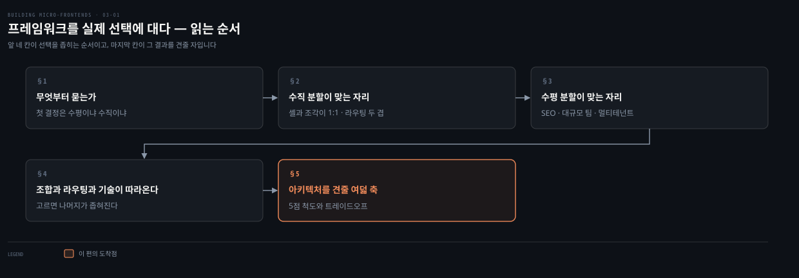
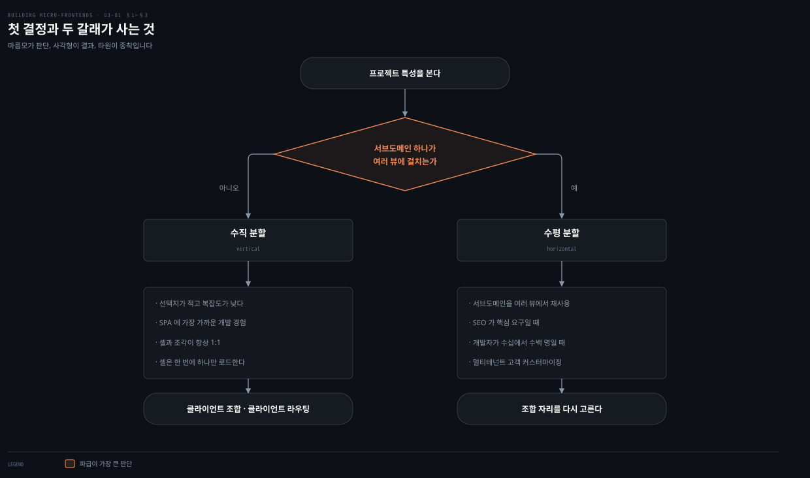
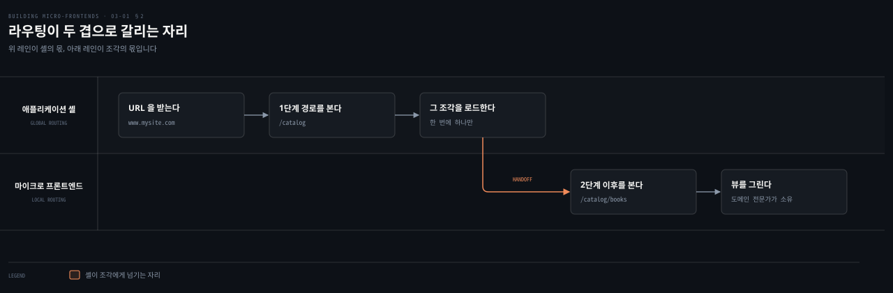

# 프레임워크를 실제 선택에 대다

---

> 2장이 네 결정을 세웠다면 3장은 그 결정을 실제 프로젝트에 댑니다. 이 편은 첫 결정에서 기술 선택까지 좁혀 가는 순서를 밟고, 뒤 편들이 아키텍처를 견줄 때 쓸 여덟 축을 세웁니다.

## 핵심 요약

> 이 편 전체가 매달린 하나의 생각은 **수평이냐 수직이냐가 첫 결정이고 그 하나가 조합과 라우팅과 쓸 수 있는 기술까지 차례로 좁히므로, 아키텍처 선택은 병렬 비교가 아니라 순차 축소**라는 것입니다.
>
> 수직 분할은 선택지가 적습니다. 셸과 조각이 항상 1:1이고 셸은 한 번에 하나만 불러옵니다. 라우팅은 두 겹으로 갈려 1단계 URL은 셸이, 2단계 이후는 조각이 소유합니다.
>
> 수평 분할은 서브도메인 하나가 여러 뷰에 걸칠 때 고릅니다. 저자가 든 조건은 SEO가 핵심 요구일 때, 개발자가 수십에서 수백 명일 때, 멀티테넌트에 고객 커스터마이징이 있을 때입니다.
>
> 통신은 프레임워크의 네 기둥 가운데 이 장에서 빠집니다. 수평 분할에서 상태 공유가 안티패턴이라 선택할 것이 없기 때문입니다.
>
> 마지막으로 아키텍처를 견줄 여덟 축과 5점 척도를 세웁니다. 모든 축이 동시에 만점일 수는 없습니다. 축들이 서로를 당기기 때문입니다.

## 학습 목표

이 내용을 읽고 나면:

1. 아키텍처 선택이 왜 병렬 비교가 아니라 순차 축소인지 설명할 수 있습니다.
2. 수직 분할에서 전역 라우팅과 지역 라우팅이 어떻게 갈리는지 URL 예로 말할 수 있습니다.
3. 애플리케이션 셸이 지켜야 할 제약과 그 이유를 댈 수 있습니다.
4. 조합 자리 셋을 고르는 기준을 프로젝트 조건으로 구분할 수 있습니다.
5. 아키텍처 특성 여덟 축의 이름과 5점 척도의 뜻을 재현할 수 있습니다.

아래는 이 문서를 읽는 순서로 이은 지도입니다. 앞 네 칸이 선택을 좁히는 순서이고 색이 붙은 마지막 칸이 그 결과를 견줄 자입니다.

## 1. 무엇부터 묻는가

> 저자는 아키텍처를 나열해 놓고 고르게 하지 않습니다. 질문 하나를 먼저 던지고 그 답으로 나머지를 좁힙니다.

### 풀려는 문제

2장에서 네 결정을 배웠습니다. 그런데 실제 프로젝트 앞에 서면 그 넷이 동시에 밀려옵니다. 조합을 먼저 정할지 라우팅을 먼저 정할지조차 정해지지 않습니다.

이 상태에서 흔히 하는 일이 아키텍처 목록을 펴 놓고 비교표를 만드는 것입니다. 그러면 비교 항목이 수십 개가 되고, 어느 항목에 가중치를 둘지가 다시 논쟁이 됩니다.

### 첫 결정 하나

저자는 순서를 못 박습니다. **첫 결정은 수평 분할이냐 수직 분할이냐입니다.**

이 결정이 먼저인 이유는 나머지를 구속하기 때문입니다. 위 도식이 그 구조입니다. 수직으로 가면 조합과 라우팅이 사실상 클라이언트 사이드로 정해지고, 수평으로 가면 조합 자리를 다시 골라야 합니다.

### 읽어내기 — 비교가 아니라 축소다

앞의 막힘이 여기서 풀립니다. **아키텍처 선택은 후보를 늘어놓고 점수를 매기는 일이 아니라 질문 하나씩으로 후보를 줄여 가는 일입니다.**

그래서 비교표는 마지막에 옵니다. 이 편의 §5에서 세울 여덟 축은 후보를 고르는 도구가 아니라, 이미 좁혀진 후보 사이에서 무엇을 포기할지 정하는 도구입니다.

## 2. 수직 분할이 맞는 자리

> 수직 분할의 강점은 기술이 아니라 익숙함입니다. 그 익숙함이 셸의 제약과 라우팅 분담에서 나옵니다.

### 풀려는 문제

"SPA 개발자에게 익숙하다"는 말은 선택 근거처럼 들리지 않습니다. 익숙하다는 이유로 아키텍처를 고르면 그것이 편의인지 판단인지 구분이 안 되기 때문입니다.

그래서 물어야 할 것은 무엇이 익숙한가입니다. 익숙함이 어디서 나오는지를 알아야 그것을 근거로 쓸지 정할 수 있습니다.

### 선택지가 적다는 것의 뜻

저자는 수직 분할이 선택지가 적고 복잡도가 낮다고 적습니다. 단일 페이지 애플리케이션을 써 온 프론트엔드 개발자에게 익숙할 가능성이 크기 때문입니다.

맞는 자리도 함께 듭니다. 일관된 사용자 인터페이스 진화와 여러 뷰에 걸친 매끄러운 사용자 경험이 필요한 프로젝트입니다. 수직 분할이 SPA에 가장 가까운 개발 경험을 주므로, 개발자가 익숙한 도구와 모범 사례와 패턴을 그대로 쓸 수 있습니다.

구조적 제약도 하나 있습니다. **마이크로 프론트엔드와 애플리케이션 셸의 관계는 언제나 1:1입니다.** 그래서 셸은 한 번에 조각 하나만 불러옵니다.

### 라우팅이 두 겹으로 갈린다

수직 분할에는 클라이언트 사이드 라우팅을 씁니다. 그 라우팅이 보통 두 부분으로 나뉩니다.

- **전역 라우팅** — 서로 다른 조각을 불러오는 데 쓰이며 애플리케이션 셸이 다룹니다.
- **지역 라우팅** — 같은 조각 안의 뷰 사이 이동이며 조각 스스로가 다룹니다.

지역 라우팅을 조각이 갖는 이유가 소유권에 있습니다. 그 조각을 맡은 팀이 해당 비즈니스 도메인의 주제 전문가이므로, 그 안에 담긴 뷰의 구현과 진화를 온전히 통제하게 됩니다.

저자가 주는 기준선이 구체적입니다. 1단계 URL은 애플리케이션 셸에서 정의하고 2단계 이후는 조각이 정의합니다. `www.mysite.com/catalog`가 셸의 몫이고 `www.mysite.com/catalog/books`가 조각의 몫입니다. 요즘 라우터 라이브러리 대부분이 이 개념을 쉽게 구현하게 해 줍니다.

### 셸이 지켜야 할 제약

셸은 진입점으로 HTML이나 자바스크립트를 불러옵니다. 그래서 각 조각의 진입점도 이 두 형식 가운데 하나가 됩니다.

여기에 저자가 못 박는 제약이 둘 있습니다.

- 셸은 다른 조각들과 **비즈니스 도메인 로직을 공유하지 않아야** 합니다.
- 셸은 **기술 중립**이어야 합니다. 앞으로의 시스템 진화를 허용하기 위해서이며, 그래서 셸을 만들 때 특정 UI 프레임워크에 기대지 않는 편이 좋습니다.

이 제약이 값을 합니다. 셸 코드베이스가 아주 안정적으로 유지되고, 의도치 않은 복잡도가 여러 팀에 번지는 것을 막습니다.

셸은 사용자 세션 내내 존재합니다. 웹 애플리케이션을 오케스트레이션하고, 조각이 완전히 마운트되거나 언마운트될 때 반응할 수 있도록 생명주기 API를 노출하는 책임이 있기 때문입니다.

### 읽어내기 — 익숙함은 제약에서 나온다

앞의 질문에 답이 생깁니다. **수직 분할이 익숙한 것은 셸이 하는 일을 최소로 묶어 두었기 때문입니다.** 셸이 도메인 로직을 갖지 않고 프레임워크에 기대지 않으므로, 조각 안쪽은 팀이 늘 쓰던 SPA 그대로입니다.

그러니 "익숙하다"는 근거는 편의가 아닙니다. 셸이 얇게 유지되는 한 팀이 배울 것이 적다는 구조적 사실입니다. 반대로 셸에 도메인 로직이 들어가기 시작하면 이 근거는 사라집니다.

조각끼리 토큰이나 사용자 설정 같은 정보를 나눠야 할 때는 2장의 수단을 그대로 씁니다. 휘발성 데이터에는 쿼리 스트링을, 토큰이나 설정처럼 더 오래 사는 데이터에는 쿠키나 웹 스토리지나 웹 워커를 씁니다.

## 3. 수평 분할이 맞는 자리

> 수평 분할을 고르는 근거는 화면 생김새가 아니라 재사용의 필요입니다.

### 풀려는 문제

수직 분할이 단순하다면 왜 굳이 수평을 고를까요. 조율 비용이 늘고 거버넌스가 필요하다는 것을 2장에서 이미 봤습니다.

단순함을 버리는 데는 이유가 있어야 합니다. 그 이유가 무엇인지가 정해져야 이 선택이 취향이 아니게 됩니다.

### 저자가 든 조건

저자의 답은 하나입니다. **비즈니스 서브도메인 하나가 여러 뷰에 걸쳐 나타나야 할 때**입니다. 그때는 그 서브도메인의 재사용성이 핵심이 됩니다.

특히 다음 상황에서 그렇습니다.

- SEO가 핵심 요구사항일 때
- 프론트엔드 애플리케이션에 수십, 어쩌면 수백 명의 개발자가 함께 붙어야 할 때
- 소프트웨어의 특정 부분에 고객별 커스터마이징이 있는 멀티테넌트 프로젝트일 때

### 읽어내기 — 재사용이 조율 비용을 산다

앞의 질문에 답이 생깁니다. **수평 분할이 사는 것은 재사용이고, 그 값으로 내는 것이 조율입니다.**

세 조건이 전부 재사용과 이어집니다. SEO는 같은 조각이 여러 페이지에 나타나야 검색 엔진이 색인할 표면이 넓어집니다. 개발자가 수백 명이면 뷰 단위로 나눠도 한 뷰에 여러 팀이 붙습니다. 멀티테넌트는 고객마다 특정 부분만 갈아 끼워야 하므로 그 부분이 독립된 조각이어야 합니다.

바꿔 말하면 이 셋 가운데 어느 것도 해당하지 않는데 수평으로 가면 조율 비용만 사는 셈입니다.

## 4. 조합과 라우팅과 기술이 따라온다

> 첫 결정 다음의 선택들은 독립적이지 않습니다. 앞의 선택이 뒤의 후보를 하나씩 지웁니다.

### 풀려는 문제

수평 분할로 정했다면 다음은 조합 자리입니다. 그런데 조합과 라우팅과 기술을 각각 따로 고르려 하면 조합이 안 맞는 짝이 나옵니다.

2장에서 조합표로 이 축소를 봤지만 그때는 표였습니다. 실제 프로젝트에서 어떤 조건이 어느 자리를 가리키는지는 아직 정해지지 않았습니다.

### 조합 자리를 고르는 조건

저자가 조건을 붙여 셋을 가릅니다.

| 조합 자리 | 고르는 조건 | 붙는 제약 |
|---|---|---|
| 클라이언트 사이드 | 팀이 프론트엔드 생태계에 더 익숙할 때. 트래픽이 많고 스파이크가 클 때 | CDN으로 조각을 캐시할 수 있어 프론트엔드 계층의 확장 문제를 피함 |
| 엣지 사이드 | 정적 콘텐츠에 트래픽이 많을 때 | 확장을 CDN 제공자에 위임. 개발 경험이 더 복잡하고 모든 CDN이 지원하지는 않음 |
| 서버 사이드 | 색인이 중요한 사이트. 뛰어난 성능 지표가 필요한 사이트 | 출력에 대한 통제가 가장 큼 |

저자가 예로 든 것이 구체적입니다. 엣지 사이드는 개인화 콘텐츠가 없는 온라인 카탈로그가 좋은 후보이고, 서버 사이드는 뉴스 사이트나 이커머스 플랫폼이 해당하며 PayPal과 American Express가 서버 사이드 조합을 씁니다.

### 라우팅이 조합을 따른다

기술적으로는 어떤 조합에도 어떤 라우팅이든 붙일 수 있습니다. 다만 보통은 고른 조합 패턴에 딸린 라우팅 전략을 씁니다.

- 클라이언트 조합이면 대개 라우팅도 클라이언트 수준에서 일어납니다. 다만 엣지에서 계산 로직을 써서 카나리 릴리스로 셸 코드를 어지럽히지 않게 하거나, 검색 엔진 크롤러에 서버 사이드 렌더링을 활용한 최적화 버전을 내줘 색인과 페이지 속도 순위를 올릴 수 있습니다.
- 엣지 조합이면 뷰마다 HTML 페이지가 하나씩 딸립니다. 사용자가 새 페이지를 불러올 때마다 CDN이 여러 조각을 가져와 최종 뷰를 만듭니다.
- 서버 라우팅이면 애플리케이션 서버가 어떤 HTML 템플릿이 어느 라우트에 딸렸는지 알고 있어, 라우팅과 조합이 전부 서버 쪽에서 일어납니다.

### 기술까지 좁혀진다

조합 선택은 기술 해법의 후보도 줄입니다.

| 조합 | 쓸 수 있는 기술 |
|---|---|
| 클라이언트 조합 + 클라이언트 라우팅 | 셸이 같은 뷰에 여러 조각을 로드. Webpack Module Federation 플러그인, iframe, 웹 컴포넌트 |
| 엣지 조합 | 현재로서는 Edge Side Includes가 유일 |
| 서버 조합 | 서버 사이드 인클루드 또는 여러 SSR 프레임워크. SSR이 구현에 더 큰 유연성과 통제를 줌 |

엣지 쪽에는 저자가 단서를 답니다. 클라우드 제공자가 엣지 서비스에 연산과 저장 자원을 넓히면서 이 상황이 앞으로 바뀔 조짐이 보인다는 것입니다.

최근 추세도 하나 짚습니다. 수평 분할과 SSR을 함께 쓰는 사례가 늘고 있습니다. 헤더와 푸터를 페이지 콘텐츠와 따로 불러오는 형태입니다. Next.js나 Astro 같은 프레임워크를 쓰는 작업에서 흔합니다. 한 팀이 페이지 묶음을 맡고 다른 팀이 헤더와 푸터 같은 애플리케이션 셸을 관리합니다.

### 읽어내기 — 통신은 왜 빠져 있나

네 기둥 가운데 통신이 이 장의 선택 순서에서 빠집니다. 저자가 이유를 밝힙니다. **수평 분할에서는 조각 사이의 상태 공유를 피해야 하고, 그것이 안티패턴으로 여겨지기 때문**입니다.

고를 것이 없으니 결정도 없습니다. 대신 2장의 기법을 그대로 씁니다. 이벤트 에미터나 커스텀 이벤트, 또는 발행·구독 패턴을 쓰는 반응형 스트림으로 조각을 결합에서 떼어 놓고 독립성을 지킵니다. 서로 다른 뷰 사이에서는 휘발성 데이터에 쿼리 스트링을, 사용자 토큰이나 로컬 설정 같은 지속 데이터에 웹 스토리지나 쿠키를 씁니다.

> 저자가 곁들인 옵서버 패턴의 정의는 이렇습니다. 발행·구독 패턴으로도 불리며, 객체 사이에 일대다 관계를 정의하는 행위 디자인 패턴입니다. 한 객체가 상태를 바꾸면 그에 의존하는 모든 객체가 자동으로 통지받고 갱신됩니다. 이 일대다 관계를 유지하는 객체를 주체 또는 발행자라 하고, 그에 의존하는 객체들을 관찰자 또는 구독자라 합니다.

상태 공유를 피하라는 경고에는 저자의 실무 경험이 붙습니다. 그는 여러 회사가 여기서 회복하는 것을 도와야 했다고 적습니다. **문제는 상태를 공유하는 행위 자체가 아니라 소유권과 유지보수의 장기 과제**에 있습니다. 공유 상태를 바꾸면 모든 조각과 그 담당 팀이 동시에 갱신되고 테스트되고 배포돼야 하므로 테스트와 배포 조율이 점점 어려워집니다. 그래서 상태는 각 조각 안에 남아 한 팀이 유지해야 하고, 나머지와의 소통은 고른 발행·구독 패턴으로 합니다.

## 5. 아키텍처를 견줄 여덟 축

> 뒤 편들이 아키텍처마다 점수표로 닫는데, 그 표의 축이 여기서 정의됩니다.

### 풀려는 문제

후보가 좁혀졌다고 결정이 끝나지는 않습니다. 남은 후보 사이에서 무엇을 포기할지 정해야 합니다.

이때 "성능이 좋은 쪽"이나 "단순한 쪽" 같은 말로는 비교가 안 됩니다. 무엇을 성능으로 보고 무엇을 단순함으로 볼지가 사람마다 다르기 때문입니다.

### 여덟 축의 뜻

그래서 저자가 축을 먼저 정의합니다. 각 아키텍처의 기술적 구현을 도전 과제와 이점 양쪽에서 살핀 뒤 이 특성들로 평가합니다.

| 축 | 무엇을 재는가 |
|---|---|
| 배포성 | 조각을 어떤 환경에 배포하는 일의 신뢰성과 수월함 |
| 모듈성 | 조각을 더하거나 빼는 수월함, 그리고 조각이 품은 공유 컴포넌트와 통합하는 수월함 |
| 단순함 | 이해하거나 해내는 수월함. 단순한 소프트웨어는 대개 따져 보고 다루기 쉬움 |
| 테스트 용이성 | 주어진 테스트 맥락에서 소프트웨어 산출물이 테스트를 얼마나 뒷받침하는가 |
| 성능 | 건강한 사이트의 필수 지표인 웹 바이탈이 말하는 사용자 경험 품질을 얼마나 충족하는가 |
| 개발자 경험 | 클라이언트 라이브러리·SDK·프레임워크·오픈소스·도구·API·기술·서비스를 쓸 때 개발자가 겪는 경험 |
| 확장성 | 프로세스·네트워크·소프트웨어·조직이 자라고 늘어난 수요를 감당하는 능력 |
| 조율 | 공통 목표를 좇아 하나의 행동을 내도록 구성원의 노력을 통합하고 동기화하는 일 |

점수는 5점 척도입니다. 1점은 그 특성이 잘 뒷받침되지 않는다는 뜻이고, 5점은 그 특성이 해당 아키텍처 패턴에서 가장 강한 특징 가운데 하나라는 뜻입니다.

### 읽어내기 — 만점표는 나오지 않는다

앞의 어려움이 여기서 정리됩니다. 점수는 어느 특성이 그 접근에서 빛나는지를 가리킵니다. 그리고 저자가 곧바로 못 박습니다. **한 아키텍처에서 모든 특성이 완벽하게 나오는 일은 거의 불가능합니다. 특성들이 서로를 당기기 때문입니다.**

그래서 역할이 정해집니다. 만들어야 할 애플리케이션에 가장 알맞은 트레이드오프를 찾는 일입니다. 점수 방식을 쓰기로 한 것도 그래서입니다.

트레이드오프의 성격도 저자가 넓힙니다. 기술적인 것만이 아니라 비즈니스 요구사항과 조직 구조에도 영향받습니다. 현대 아키텍처는 최종 결과에 여러 힘이 기여한다는 것을 인정하며, 기술적 측면만이 전부가 아닙니다. 그러므로 사회기술적 측면을 셈에 넣고 우리가 일하는 맥락에 최적화해야 합니다. 존재하지 않는 완벽한 아키텍처를 찾거나, 다른 맥락의 아키텍처를 우리 맥락에 맞는지 따져 보지 않고 빌려 오는 일은 피해야 합니다.

사례 연구를 읽을 때도 같은 주의가 필요합니다. 그 회사들이 어떻게 일하는지와 우리 회사의 맥락을 견줘 봐야 합니다. 사례는 흔히 한 회사가 특정 문제를 어떻게 풀었는지에 집중하는데, 그것이 우리 과제나 목표와 겹칠 수도 있고 아닐 수도 있습니다. 겹치는지 알아내는 일은 읽는 사람의 몫입니다.

## 적용 관점

> 아래는 백엔드 개발자가 이미 가진 판단 기준과 이 절을 잇는 노트의 읽기입니다. 책이 백엔드 독자를 향해 쓴 대목이 아닙니다.

여덟 축은 백엔드에서 쓰는 품질 속성 목록과 겹칩니다. 배포성·테스트 용이성·성능·확장성은 그대로이고, 모듈성과 조율이 분산 프론트엔드에서 특히 무겁게 다뤄집니다. 품질 속성으로 설계를 판단하는 절차 자체의 기준은 [아키텍트의 관점과 품질 속성 트레이드오프](../../01_foundation/01-03.아키텍트의%20관점과%20품질%20속성%20트레이드오프.md)가 갖고 있습니다.

셸의 두 제약은 공유 커널을 얇게 유지하는 규율과 같은 자리입니다. 여러 서비스가 함께 쓰는 모듈에 도메인 로직이 들어가는 순간 그 모듈은 아무도 못 고치는 자산이 됩니다. 저자가 셸에 도메인 로직을 넣지 말고 프레임워크에도 기대지 말라고 한 이유가 같습니다.

라우팅 두 겹은 API 게이트웨이와 서비스 내부 라우팅의 분담과 닮았습니다. 게이트웨이가 어느 서비스로 보낼지만 정하고 그 안의 경로는 서비스가 정하는 구조입니다. 저자가 준 "1단계는 셸, 2단계 이후는 조각" 기준선이 그 경계를 URL로 못 박은 것입니다.

## 면접 대비

### 한 줄 정의

마이크로 프론트엔드 아키텍처 선택이란 수평이냐 수직이냐라는 첫 결정으로 시작해 조합·라우팅·기술 후보를 차례로 좁혀 가는 순차 축소이며, 남은 후보 사이의 판단은 여덟 가지 아키텍처 특성으로 합니다.

### 핵심 포인트 세 가지

1. 첫 결정은 수평이냐 수직이냐이고, 그 하나가 조합과 라우팅과 쓸 수 있는 기술까지 차례로 좁힙니다.
2. 수직 분할에서 셸과 조각은 항상 1:1이며, 1단계 URL은 셸이 2단계 이후는 조각이 소유합니다.
3. 네 기둥 중 통신은 이 장의 선택 순서에서 빠집니다. 수평 분할에서 상태 공유가 안티패턴이라 고를 것이 없기 때문입니다.

### 자주 묻는 질문

Q: 애플리케이션 셸에 UI 프레임워크를 써도 되나요?
A: 저자는 기대지 말라고 합니다. 셸이 기술 중립이어야 앞으로의 시스템 진화가 가능하고, 셸 코드베이스가 안정적으로 유지돼 의도치 않은 복잡도가 여러 팀에 번지지 않습니다.

Q: 상태 공유가 왜 안티패턴인가요?
A: 공유하는 행위 자체가 아니라 소유권과 유지보수의 장기 과제 때문입니다. 공유 상태를 바꾸면 모든 조각과 담당 팀이 동시에 갱신·테스트·배포돼야 해서 원치 않는 결합이 생깁니다.

Q: 아키텍처 특성 점수로 최고 아키텍처를 고를 수 있나요?
A: 없습니다. 특성들이 서로를 당기므로 한 아키텍처에서 모든 축이 완벽할 수 없습니다. 점수는 만들어야 할 애플리케이션에 가장 알맞은 트레이드오프를 찾는 도구입니다.

## 핵심 개념 체크리스트

- [ ] 첫 결정이 무엇이고 왜 먼저인지 설명할 수 있는가?
- [ ] 전역 라우팅과 지역 라우팅의 경계를 URL 예로 말할 수 있는가?
- [ ] 애플리케이션 셸의 두 제약과 그것이 사는 값을 댈 수 있는가?
- [ ] 수평 분할을 고르는 세 조건을 재현할 수 있는가?
- [ ] 조합 자리 셋과 각각을 고르는 조건을 짝지을 수 있는가?
- [ ] 여덟 축의 이름을 대고 5점 척도의 뜻을 말할 수 있는가?

## 관련 문서

- [수직 분할 — 앱 셸과 조각을 잇는 다섯 기법](03-02.수직%20분할%20—%20앱%20셸과%20조각을%20잇는%20다섯%20기법.md) — 이 편이 고른 수직 분할을 실제로 구현하는 방법
- [합치고 잇고 주고받기](02-03.합치고%20잇고%20주고받기.md) — 이 편이 조건을 붙이는 조합·라우팅·통신의 정의
- [경계를 어디에 긋고 어떻게 확인하는가](02-02.경계를%20어디에%20긋고%20어떻게%20확인하는가.md) — 첫 결정 이전에 정해야 할 경계
- [아키텍트의 관점과 품질 속성 트레이드오프](../../01_foundation/01-03.아키텍트의%20관점과%20품질%20속성%20트레이드오프.md) — 품질 속성으로 설계를 판단하는 절차
- [Building Micro-Frontends 정독 인덱스](README.md) — 장별 목표와 진행 상태

## 참고 자료

- 《Building Micro-Frontends, Second Edition》(Luca Mezzalira, O'Reilly, 2026) ISBN 978-1-098-17078-3
  - 다룬 범위: Chapter 3 도입부 · Application of the Micro-Frontend Decision Framework · Architecture Analysis · Architecture and Trade-Offs
