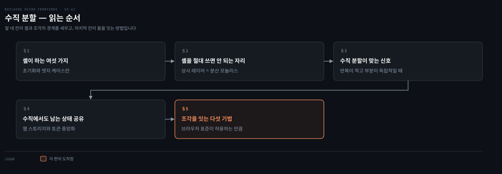
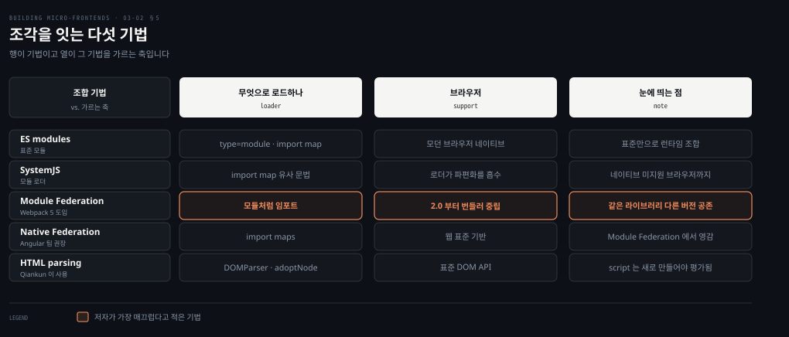
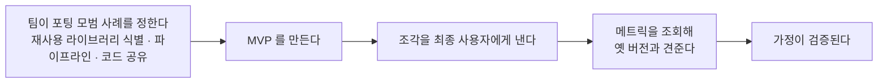

# 수직 분할 — 앱 셸과 조각을 잇는 다섯 기법

---

> 수직 분할을 골랐다면 다음은 애플리케이션 셸입니다. 이 편은 셸이 무엇을 해야 하고 무엇을 하면 안 되는지를 가른 뒤, 셸과 조각을 실제로 잇는 다섯 기법을 견줍니다.

## 핵심 요약

> 이 편이 매달린 하나의 생각은 **셸이 하는 일을 초기화와 엣지 케이스로 묶어 두는 한 수직 분할은 SPA만큼 다루기 쉽고, 그 선을 넘는 순간 분산 모놀리스가 된다**는 것입니다.

셸은 앱을 요청할 때 가장 먼저 내려받는 지속적 부분입니다. 세션을 처음부터 끝까지 인도하며 사용자가 요청한 엔드포인트에 따라 조각을 싣고 내립니다. 저자가 셸에 두라고 한 일은 여섯입니다. 초기 사용자 상태와 전역 설정과 라우트 설정, 관측과 마케팅 라이브러리, 조각 로드 실패 처리, 그리고 공유 라이브러리 로딩입니다.

반대로 절대 하면 안 되는 일도 못 박습니다. 세션 동안 조각과 상시 주고받는 레이어로 쓰는 것입니다. 그러면 논리적 결합이 생겨 모든 조각을 함께 테스트하고 재배포하게 됩니다. 조각을 잇는 기법은 다섯입니다. ES 모듈과 SystemJS와 Module Federation과 Native Federation과 HTML 파싱이며, 수직 분할은 클라이언트에서만 조합하므로 브라우저 표준이 허용하는 범위에서 고릅니다.


## 학습 목표

이 내용을 읽고 나면:

1. 애플리케이션 셸이 맡아야 할 여섯 가지를 재현하고 각각이 왜 셸의 몫인지 설명할 수 있습니다.
2. 셸을 공유 레이어로 쓰면 무엇이 무너지는지 인과로 말할 수 있습니다.
3. 수직 분할이 맞는다는 신호를 애플리케이션의 성질로 판별할 수 있습니다.
4. 수직 분할에서도 남는 상태 공유 문제와 두 가지 처방을 댈 수 있습니다.
5. 클라이언트 조합 기법 다섯을 구분하고 각각이 무엇으로 조각을 싣는지 말할 수 있습니다.

아래는 이 문서를 읽는 순서로 이은 지도입니다. 앞 네 칸이 셸과 조각의 경계를 세우고 색이 붙은 마지막 칸이 둘을 잇는 방법입니다.




## 1. 셸이 하는 여섯 가지

> 셸을 얇게 두라는 말은 아무것도 하지 말라는 뜻이 아닙니다. 저자는 셸에만 둘 수 있는 일을 여섯으로 꼽습니다.

### 풀려는 문제

앞 편에서 셸에 도메인 로직을 넣지 말고 프레임워크에도 기대지 말라고 배웠습니다. 그러면 셸에는 무엇이 남을까요.

이 질문에 답이 없으면 두 방향으로 잘못 갑니다. 셸을 너무 비워 두면 조각마다 같은 초기화 코드를 중복하게 되고, 아무 기준 없이 채우면 앞 편이 경고한 결합이 생깁니다.

### 셸에만 둘 수 있는 일

저자가 조각을 셸 안에서 불러오는 주된 이유로 여섯을 듭니다.

| 셸이 하는 일 | 왜 셸의 몫인가 |
|---|---|
| 초기 사용자 상태 처리 | 딥링크로 인증 라우트에 왔는데 토큰이 무효면 로그인이나 랜딩으로 돌려보냅니다. **최초 로드에만 필요**하고, 그 뒤로는 인증 영역의 각 조각이 스스로 인증 유지나 리다이렉트를 관리합니다 |
| 전역 설정 조회 | 세션 전체에 쓰이는 정보를 담은 설정 파일을 먼저 가져옵니다. 국가별로 경험이 다른 애플리케이션이라면 사용자의 국가 같은 것입니다 |
| 라우트와 딸린 조각 조회 | 라우트 설정을 런타임에 불러오면 셸을 여러 번 배포하지 않고도 라우팅 시스템을 통제할 수 있습니다 |
| 로깅·관측성·마케팅 라이브러리 설정 | 이 라이브러리들은 대개 애플리케이션 전체에 적용되므로 셸 안에서 인스턴스화하는 편이 낫습니다 |
| 조각 로드 실패 처리 | 네트워크 문제나 시스템 버그로 조각에 닿지 못할 때가 있습니다. 404 페이지를 두거나, 오류를 보여 주고 유사 상품 추천이나 재방문 안내 같은 해결책을 제시하는 고가용 조각을 싣습니다 |
| 공유 라이브러리 로딩 | import maps 같은 방식을 쓸 때 UI 라이브러리나 라우터 라이브러리 같은 공통 자원을 셸이 싣습니다. 그러면 조각이 그것을 자기 패키지에 넣지 않아도 됩니다 |

마지막 항목에는 저자가 대안과 그 값을 함께 답니다. 셸 같은 오케스트레이터를 두지 않고 라이브러리를 조각마다 포함해도 비슷한 결과를 얻을 수는 있습니다. 다만 이상적으로는 이런 것들을 관리할 자리가 한 군데뿐이어야 합니다. 라이브러리가 여러 벌이면 조각 사이에서 늘 같은 버전인지 보장해야 하므로 조율이 늘고 전체 과정이 복잡해집니다. 배포할 때 깨지는 변경이 생길 위험도 셸에 모아 두는 쪽보다 커집니다.

### 읽어내기 — 여섯의 공통점

여섯을 겹쳐 보면 기준이 하나로 모입니다. **전부 세션에 한 번, 또는 예외 상황에만 일어나는 일입니다.**

초기 상태 판정은 첫 로드에만 합니다. 설정과 라우트는 세션 시작에 한 번 가져옵니다. 관측 라이브러리는 한 번 세웁니다. 실패 처리는 예외일 때만 돕니다. 공유 라이브러리도 로드는 한 번입니다.

이 기준이 다음 절의 금지선을 그대로 만듭니다.


## 2. 셸을 절대 쓰면 안 되는 자리

> 셸의 목록이 길어질수록 하나를 더 얹고 싶어집니다. 저자가 거기에 금지선을 긋습니다.

### 풀려는 문제

셸이 설정도 갖고 있고 토큰도 갖고 있고 라우팅도 안다면, 조각끼리 뭔가 주고받을 때 셸을 거치는 것이 자연스러워 보입니다. 이미 모두가 셸을 알고 있으니까요.

이 유혹이 위험한 이유는 처음에 잘 동작하기 때문입니다. 조각이 둘일 때는 셸을 통한 중계가 가장 단순한 해법입니다.

### 금지선

저자는 예외를 두지 않습니다. **사용자 세션 동안 조각과 상시 주고받는 레이어로 셸을 쓰지 마십시오.** 셸은 엣지 케이스나 초기화에만 씁니다.

이유는 결과에 있습니다. 셸을 조각들의 공유 레이어로 쓰면 조각과 셸 사이에 논리적 결합이 생깁니다. 그러면 애플리케이션의 모든 조각을 함께 테스트하거나 재배포해야 합니다. 저자는 이 상태를 다시 분산 모놀리스라 부르고 개발자의 최악의 악몽이라고 적습니다.

### 한 번에 하나만 싣는다는 사실이 사는 것

이 패턴에서 셸은 한 번에 조각 하나만 싣습니다. 여기서 따라오는 이득이 있습니다.

조각 사이의 충돌하는 의존성을 캡슐화하는 메커니즘을 만들 필요가 없습니다. 라이브러리나 CSS 스타일이 부딪힐 일이 없기 때문입니다. 다만 조건이 하나 붙습니다. 조각이 내려갈 때 둘 다 `window` 객체에서 제거돼야 합니다.

셸 자체의 정체도 단순합니다. 자바스크립트 파일에 로직을 감싼 평범한 HTML 페이지일 뿐입니다. 초기 로딩 경험을 좋게 하려고 스피너 같은 CSS를 조금 넣을 수도 있고 안 넣을 수도 있습니다.

조각의 진입점은 셋 가운데 하나입니다.

- 한 뷰의 로직과 스타일을 담은 HTML 페이지 하나
- 여러 라우트를 담은 작은 SPA. 새 조각을 싣지 않고도 애플리케이션의 서브도메인 하나를 통째로 쓰게 해 줍니다
- 자바스크립트 파일. 다만 이 경우 초기 사용자 경험이 제한됩니다. 자바스크립트가 해석돼야 DOM에 새 요소를 넣을 수 있기 때문입니다

### 읽어내기 — 얇음이 캡슐화를 대신한다

앞의 유혹에 대한 답은 규율이 아니라 구조입니다. **셸이 한 번에 하나만 싣기 때문에 격리 장치가 필요 없고, 셸이 초기화만 하기 때문에 결합이 안 생깁니다.**

거꾸로 말하면 셸을 상시 레이어로 쓰는 순간 두 이득이 함께 사라집니다. 조각이 셸을 통해 서로를 알게 되므로 격리가 깨지고, 셸의 인터페이스가 조각들의 계약이 되므로 결합이 생깁니다. §1의 여섯 항목이 전부 "세션에 한 번"인 이유가 여기 있습니다.


## 3. 수직 분할이 맞는 신호

> 조건 목록보다 뚜렷한 신호가 하나 있습니다. 애플리케이션의 부분들이 서로 겹치지 않고 독립적인 행동으로 표현되는가입니다.

### 풀려는 문제

앞 편에서 수직 분할을 고르는 조건을 봤습니다. 그런데 그 조건들은 프로젝트 성격에 대한 서술이라 우리 앱에 대 보기가 애매합니다.

일관된 사용자 경험이 필요하지 않은 앱이 있을까요. 대부분 그렇다고 답할 것이고, 그러면 조건이 판별력을 잃습니다.

### 뚜렷한 신호

저자가 더 구체적인 신호를 줍니다. 수직 분할은 일관된 사용자 경험을 만들면서 단일 팀에 완전한 통제를 주고 싶을 때 잘 맞습니다. 그리고 **이것이 맞는 접근이라는 뚜렷한 신호는 여러 뷰에 걸친 비즈니스 서브도메인의 반복이 적고, 애플리케이션의 모든 부분이 독립적인 행동으로 표현될 수 있을 때**입니다.

조각을 식별하는 일도 사용자가 애플리케이션과 어떻게 상호작용하는지 명확히 이해하고 있으면 쉬워집니다. Google Analytics 같은 분석 도구를 쓰고 있다면 그 정보에 접근할 수 있습니다. 없다면 아키텍처와 비즈니스 도메인과 조직 전체를 어떻게 짤지 정하기 전에 그 정보를 먼저 모아야 합니다.

### 재사용을 목표로 삼지 않는다

저자가 여기서 오해 하나를 다시 막습니다. 앞 장에서 설명했듯 마이크로 프론트엔드는 높은 재사용성을 위해 설계된 것이 아닙니다. 컴포넌트는 재사용을 의도하지만 둘은 근본적으로 다릅니다. **그러므로 어떻게든 재사용 가능한 조각을 만드는 것을 목표로 삼아서는 안 됩니다.**

재사용이 아예 없다는 뜻은 아닙니다. 두 자리가 열려 있습니다.

- 각 조각 **안에서는** 컴포넌트를 재사용할 수 있습니다. 디자인 시스템을 떠올리면 됩니다. 이렇게 얻은 모듈성이 지나친 중복을 막아 줍니다.
- 조각이 **같은 회사가 유지하는 다른 애플리케이션에서** 재사용될 가능성이 더 큽니다. 멀티테넌트 환경에서 여러 플랫폼을 만들면서 일부만 커스터마이징한 비슷한 UI를 원할 때가 그렇습니다. 이때 수직 분할 조각을 재사용하면 코드 파편화가 줄고 시스템이 비즈니스 요구에 따라 독립적으로 진화할 수 있습니다

### 읽어내기 — 판별의 기준은 반복이다

앞의 애매함이 풀립니다. 판별에 쓸 기준은 "일관된 UX가 필요한가"가 아니라 **"같은 서브도메인이 여러 화면에 되풀이되는가"**입니다.

되풀이가 적으면 수직입니다. 화면마다 임자를 하나 두면 되니까요. 되풀이가 많으면 그 서브도메인을 한 조각으로 떼어 여러 화면이 쓰게 해야 하고, 그것이 수평입니다. 이 기준은 세어 볼 수 있어서 회의에서 판정이 납니다.


## 4. 수직에서도 남는 상태 공유

> 수직 분할은 공유할 것이 적지만 없지는 않습니다. 무엇을 어디에 둘지가 갈립니다.

### 풀려는 문제

수직 분할은 한 번에 조각 하나만 뜨므로 같은 화면 안에서 주고받을 일이 없습니다. 그러면 상태 공유 문제가 사라질까요.

사라지지 않습니다. 화면이 바뀌어도 이어져야 하는 것이 있기 때문입니다. 인증 토큰이 대표적입니다.

### 무엇을 어디에 두나

저자는 공유할 정보를 성격으로 가릅니다.

- **웹 스토리지에 안전하게 둘 수 있는 것** — 사용자가 재생한 미디어의 음량이나 문서 편집에 최근 쓴 글꼴처럼 민감하지 않은 값입니다.
- **더 조심해야 하는 것** — 개인 사용자 데이터나 인증 토큰입니다. 이런 정보는 공개 API에서 가져온 뒤 그것을 필요로 하는 모든 조각에 나눠 줄 방법이 있어야 합니다.

민감한 쪽에는 구현 방법이 둘 있습니다.

- 토큰 관리를 애플리케이션 셸에 모으고, 미들웨어 함수로 모든 API 요청 헤더에 토큰을 덧붙입니다. 저자가 예로 든 것이 `Dream.mf`가 하는 방식입니다.
- 각 조각에서 이 관심사를 다룰 공유 라이브러리를 만듭니다.

### 읽어내기 — 수직이라 다룰 만하다

앞의 질문에 답이 생깁니다. 상태 공유는 남지만 성격이 다릅니다. **수평 분할에서는 같은 화면의 조각들이 실시간으로 맞춰야 하지만, 수직에서는 화면이 바뀔 때 넘겨주기만 하면 됩니다.**

저자도 수직 분할이면 이 문제가 큰 골치 없이 관리된다고 적습니다. 다만 토큰 중앙화가 §2의 금지선과 부딪히지 않는지는 스스로 확인해야 합니다. 셸이 토큰을 **세션 시작에 한 번** 세우고 미들웨어가 그것을 쓰는 것은 초기화이지만, 셸이 조각의 요청마다 개입하기 시작하면 상시 레이어가 됩니다.


## 5. 조각을 잇는 다섯 기법

> 수직 분할은 클라이언트에서만 조합합니다. 그래서 선택지가 브라우저 표준이 허용하는 만큼으로 정해집니다.



### 풀려는 문제

셸이 조각을 "싣는다"고 말해 왔지만 실제로 그것이 무엇인지는 아직 정하지 않았습니다.

여기서 선택을 미루면 셸 구현이 시작되지 않습니다. 진입점 형식과 로딩 방식이 정해져야 셸의 첫 줄을 쓸 수 있기 때문입니다.

### 다섯 기법

저자는 클라이언트에서 조각을 조합하는 기법을 다섯으로 정리합니다. 위 도식이 그 비교이고, 각각의 서술은 아래와 같습니다.

**ES 모듈**은 애플리케이션을 더 작은 파일로 쪼개 컴파일 타임이나 런타임에 싣게 해 주며 모던 브라우저에 완전히 구현돼 있습니다. 표준을 써서 런타임에 조각을 조합하는 견고한 메커니즘입니다. 구현은 스크립트 태그에 속성 하나를 붙이는 것으로 끝납니다.

```html
<script type="module" src="catalogMFE.js"></script>
```

이 모듈은 언제나 지연 로드되며 CORS 인증을 구현할 수 있습니다. import map 안에 애플리케이션 전체용으로 정의할 수도 있어, 그 문법으로 모듈을 애플리케이션 안에 임포트하게 됩니다. 저자는 import map을 마이크로 프론트엔드 아키텍처에서 자리를 잡아 가는 신흥 표준이라고 적습니다.

**SystemJS**는 모듈 로더입니다. 모든 브라우저가 네이티브로 지원하지는 않는 import map 명세를 지원하므로, SystemJS 구현 안에서 그것을 쓸 수 있게 해 줍니다. 조각을 런타임에 싣고 싶을 때 편리합니다. import map과 비슷한 문법을 쓰면서 브라우저 API의 파편화는 SystemJS가 알아서 처리하기 때문입니다.

**Module Federation**은 Webpack 5에서 도입된 라이브러리입니다. 외부 모듈이나 라이브러리, 심지어 애플리케이션 전체를 다른 애플리케이션 안에 싣는 데 씁니다. 조각을 조합하는 데 필요한 복잡한 일을 대신 해 줍니다.

- 조각의 스코프를 관리합니다.
- 조각 사이에 의존성을 공유합니다.
- 같은 라이브러리의 서로 다른 버전을 런타임 오류 없이 다룹니다.

저자가 이 라이브러리에 붙인 평가가 가장 높습니다. 개발자 경험과 구현이 매끄러워서 평범한 SPA를 쓰는 것처럼 느껴진다는 것입니다. 조각마다 모듈로 임포트한 뒤 UI 프레임워크 컴포넌트와 같은 방식으로 구현합니다. 이 라이브러리가 만드는 추상이 조합이라는 과제를 거의 완전히 무통증으로 만듭니다. 2.0부터는 번들러에 완전히 중립이어서 Webpack, Vite, Rolldown, Rspack 같은 주요 번들러 대부분과 함께 쓸 수 있습니다.

**Native Federation**은 Angular 커뮤니티에서 널리 채택된 라이브러리입니다. 프레임워크에 강하게 묶여 있지는 않습니다. Module Federation에서 영감을 받았지만 비슷한 과제를 웹 표준으로 풉니다. import map을 활용해 조각과 공유 의존성을 싣습니다. Angular 팀이 Angular 조각 구현에 이 라이브러리를 권장합니다.

**HTML 파싱**은 조각의 진입점이 HTML 페이지일 때 쓰는 기법입니다. 자바스크립트로 DOM 요소를 파싱해 필요한 노드를 셸의 DOM에 붙입니다. 가장 단순하게 보면 HTML 문서는 자체 스키마를 가진 XML 문서일 뿐이므로, 조각을 XML 문서처럼 다루고 `DOMParser` 객체로 관련 노드를 셸의 DOM에 붙이면 됩니다.

붙일 때는 `adoptNode`나 `cloneNode` 메서드를 씁니다. 다만 이 메서드들은 `script` 요소에는 통하지 않습니다. 브라우저가 그것을 평가하지 않기 때문입니다. 그래서 이 경우에는 조각의 HTML 페이지에서 찾은 소스 파일로 새 `script` 요소를 만듭니다. 새 요소를 만들면 브라우저가 그 요소에 딸린 자바스크립트 파일을 온전히 평가합니다.

이 기법에는 부수 효과가 하나 있습니다. 팀이 초기 DOM이 어떤 모습일지 알게 되므로 조각 쪽 개발자 경험이 단순해집니다. Qiankun 같은 프레임워크가 이 기법을 써서 HTML 문서를 조각의 진입점으로 허용합니다.

### 읽어내기 — 하나를 고르는 것이 아니다

앞의 막힘이 풀립니다. 다만 답이 "하나를 고르라"가 아닙니다. **클라이언트에서 조합하는 주요 프레임워크는 이 기법들을 모두 구현하고 있어서, 때로는 한 프레임워크 안에서도 고를 수 있습니다.**

저자가 든 예가 single-spa입니다. ES 모듈을 쓸 수도 있습니다. import map과 함께 SystemJS를 쓸 수도 있습니다. Module Federation을 쓸 수도 있습니다. 그러니 정해야 할 것은 기법이 아니라 프레임워크이고, 기법은 그 안에서 다시 고르면 됩니다.


## 6. 다중 프레임워크는 언제 정당한가

> 저자는 다중 프레임워크를 권하지 않습니다. 다만 권하지 않는다는 말과 절대 안 된다는 말은 다릅니다.

### 풀려는 문제

마이크로 프론트엔드를 소개하면 거의 매번 나오는 반응이 있습니다. 팀마다 다른 프레임워크를 쓸 수 있다는 것입니다.

이 기대가 오해인지 아닌지가 정해져야 합니다. 오해라면 무엇이 진실이고, 오해가 아니라면 어떤 조건에서 그런지가 남습니다.

### 기본은 권하지 않음

저자는 이것을 논쟁적인 결정이라고 부릅니다. 많은 사람이 이 아키텍처가 React나 Angular나 Vue나 Svelte 같은 여러 UI 프레임워크를 쓰도록 강제한다고 생각하기 때문입니다.

판정의 근거는 단순합니다. **모놀리식으로 쓴 프론트엔드 애플리케이션에 참인 것은 마이크로 프론트엔드에도 참입니다.** 기술적으로는 SPA 하나에 여러 UI 프레임워크를 넣을 수 있지만 그러면 성능 문제와 잠재적인 의존성 충돌이 생깁니다. 조각에도 똑같이 적용되므로 이 아키텍처 스타일에 다중 프레임워크 구현은 권장되지 않습니다.

대신 지킬 모범 사례를 줍니다. 외부 의존을 최대한 줄이고, 패키지 전체가 아니라 실제로 쓰는 것만 임포트하는 것입니다. 패키지 전체를 가져오면 최종 자바스크립트 번들이 커질 수 있습니다. 많은 자바스크립트 도구가 번들 크기를 줄이려고 트리 셰이킹 메커니즘을 구현하고 있습니다.

### 이득이 과제를 넘는 자리

그런데 저자는 예외를 남겨 둡니다. 다중 프레임워크의 이득이 과제를 넘는 사용 사례가 있습니다. 건강한 개발자 플라이휠을 만들어, 운영 트래픽에 영향을 주지 않으면서 비즈니스 로직의 출시 시간을 줄일 때입니다.

저자가 든 장면이 SPA에서 마이크로 프론트엔드로 옮겨 가는 포팅입니다. 조각을 만들면서 기존 SPA 코드베이스를 나란히 배포하면 그동안에도 사업과 사용자에게 가치를 낼 수 있습니다.



이런 상황에서는 사용자에게 여러 UI 프레임워크를 내려받게 하는 편이, 방향이 더 나은 결과로 이어지는지 모른 채 몇 달 동안 새 아키텍처를 개발하는 것보다 덜 문제입니다.

### 읽어내기 — 값을 무엇과 견주느냐

앞의 오해가 여기서 정리됩니다. **다중 프레임워크는 기능이 아니라 한시적 비용입니다.** 정상 상태의 설계로는 권장되지 않고, 전환기에 검증 속도를 사는 값으로만 정당해집니다.

저자가 그 값을 재는 기준도 함께 줍니다. 가정을 검증하는 일이 조직 안의 여러 팀이 공유할 모범 사례를 만드는 데 결정적이라는 것입니다. 피드백 루프를 개선하고 가능한 한 빨리 운영에 코드를 배포하는 것이, 마이크로아키텍처 전반에서 앞으로 만날 과제를 이겨 내는 최선의 방식입니다.

같은 논리를 같은 애플리케이션 안의 다른 버전 라이브러리에도 적용할 수 있습니다. 오래된 Angular 버전을 쓰는 프로젝트를 최신으로 올리고 싶을 때가 그렇습니다.

목표는 확신을 갖고 빨리 움직이는 근육을 만드는 일입니다. 실수를 줄이고 가능한 것을 자동화하며 팀 전반에 올바른 사고방식을 기르는 것입니다.


## 적용 관점

> 아래는 백엔드 개발자가 이미 가진 판단 기준과 이 절을 잇는 노트의 읽기입니다. 책이 백엔드 독자를 향해 쓴 대목이 아닙니다.

셸의 여섯 항목은 애플리케이션 부트스트랩과 같은 자리입니다. 설정 로딩, 관측 에이전트 등록, 인증 필터 배치가 세션이 아니라 프로세스 시작에 한 번 일어나는 것과 같은 성격입니다. 저자가 그은 금지선도 그 연장입니다. 부트스트랩 컴포넌트가 요청마다 개입하기 시작하면 그것은 더 이상 부트스트랩이 아니라 공유 런타임입니다.

토큰 중앙화의 두 선택지는 게이트웨이 인증과 사이드카 인증의 갈림과 닮았습니다. 한 곳에서 헤더를 붙여 주면 조각은 그 사실을 몰라도 되지만 그 한 곳이 경로에 상주하게 됩니다. 공유 라이브러리로 가면 경로에 상주하는 것은 없지만 버전 동기화 부담이 생깁니다. 저자가 라이브러리를 조각마다 두는 대안에 붙인 값이 바로 그것입니다.

다섯 기법 중 Module Federation의 "같은 라이브러리 다른 버전을 런타임 오류 없이" 다룬다는 성질은 클래스로더 격리와 같은 문제를 푸는 것입니다. 한 프로세스 안에서 같은 이름의 다른 버전이 공존하게 만드는 일이며, 그 대가로 스코프 관리라는 복잡도를 라이브러리가 떠안습니다.


## 면접 대비

### 한 줄 정의

애플리케이션 셸이란 수직 분할에서 세션을 처음부터 끝까지 인도하며 조각을 싣고 내리는 지속적 부분이며, 초기화와 엣지 케이스만 맡고 조각과 상시 주고받지 않습니다.

### 핵심 포인트 세 가지

1. 셸이 맡는 여섯 가지는 전부 세션에 한 번이거나 예외 상황에만 일어나는 일입니다. 이 기준이 셸을 얇게 유지합니다.
2. 셸을 조각들의 공유 레이어로 쓰면 논리적 결합이 생겨 모든 조각을 함께 테스트하고 재배포하게 됩니다. 저자는 이것을 분산 모놀리스라 부릅니다.
3. 클라이언트 조합 기법은 다섯이고, 주요 프레임워크는 그중 여럿을 함께 구현합니다. single-spa는 ES 모듈과 SystemJS와 Module Federation을 모두 쓸 수 있습니다.

### 자주 묻는 질문

Q: 수직 분할에서는 왜 의존성 충돌을 막을 장치가 필요 없나요?
A: 셸이 한 번에 조각 하나만 싣기 때문입니다. 라이브러리나 CSS가 부딪힐 일이 없습니다. 다만 조각이 내려갈 때 둘 다 `window` 객체에서 제거돼야 한다는 조건이 붙습니다.

Q: 마이크로 프론트엔드를 재사용 가능하게 만들어야 하나요?
A: 저자는 그것을 목표로 삼지 말라고 합니다. 조각은 높은 재사용성을 위해 설계된 것이 아닙니다. 재사용이 일어나는 자리는 조각 안의 컴포넌트와, 같은 회사가 유지하는 다른 애플리케이션입니다.

Q: 팀마다 다른 UI 프레임워크를 써도 되나요?
A: 기본적으로 권장되지 않습니다. 성능 문제와 의존성 충돌이 생기기 때문입니다. 다만 SPA에서 조각으로 옮겨 가는 전환기처럼 검증 속도를 사는 값으로는 정당해질 수 있습니다.


## 핵심 개념 체크리스트

- [ ] 셸이 맡는 여섯 가지를 대고 그 공통점을 한 문장으로 말할 수 있는가?
- [ ] 셸을 공유 레이어로 쓸 때의 인과를 이어 말할 수 있는가?
- [ ] 수직 분할이 맞는다는 뚜렷한 신호를 세어 볼 수 있는 형태로 말할 수 있는가?
- [ ] 민감한 정보를 조각 사이에 나누는 두 방법을 댈 수 있는가?
- [ ] 다섯 조합 기법을 구분하고 각각이 무엇으로 조각을 싣는지 말할 수 있는가?
- [ ] 다중 프레임워크가 정당해지는 조건과 그때 사는 것이 무엇인지 아는가?


## 관련 문서

- [프레임워크를 실제 선택에 대다](03-01.프레임워크를%20실제%20선택에%20대다.md) — 이 편이 전제하는 첫 결정과 셸의 제약
- [수직 분할 — 진화와 디자인 시스템과 성능](03-03.수직%20분할%20—%20진화와%20디자인%20시스템과%20성능.md) — 같은 아키텍처의 나머지 과제와 점수표
- [합치고 잇고 주고받기](02-03.합치고%20잇고%20주고받기.md) — 조합·라우팅·통신의 정의
- [경계를 어디에 긋고 어떻게 확인하는가](02-02.경계를%20어디에%20긋고%20어떻게%20확인하는가.md) — 조각의 계약을 좁게 유지하는 근거
- [Building Micro-Frontends 정독 인덱스](README.md) — 장별 목표와 진행 상태


## 참고 자료

- 《Building Micro-Frontends, Second Edition》(Luca Mezzalira, O'Reilly, 2026) ISBN 978-1-098-17078-3
  - 다룬 범위: Vertical-Split Architectures · Application Shell · Challenges (Sharing state · Composing micro-frontends · Multi-framework approach)
