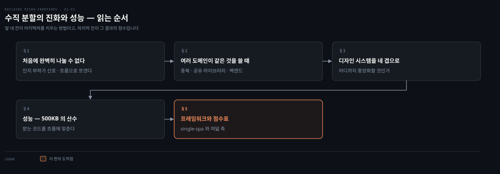
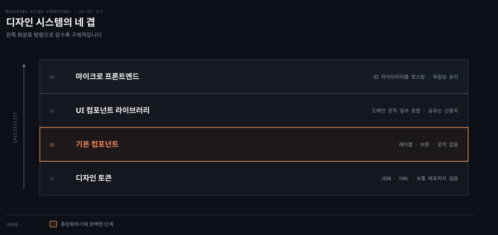
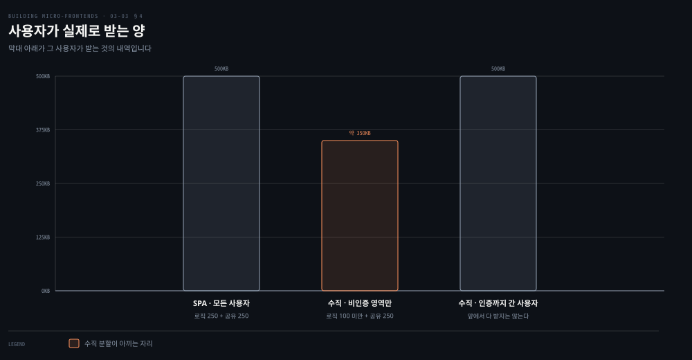

# 수직 분할 — 진화와 디자인 시스템과 성능

---

> 처음 그은 경계는 대개 틀립니다. 이 편은 그것을 다시 긋는 방법에서 출발해, 여러 도메인이 같은 코드를 쓸 때의 선택지와 디자인 시스템과 성능을 지나 수직 분할의 점수표로 닫습니다.

## 핵심 요약

> 이 편 전체가 매달린 하나의 생각은 **수직 분할의 값은 처음 잘 나누는 데 있지 않고 나중에 다시 나눌 수 있는 데 있으며, 그 여지를 지키려면 성급한 추상화를 미뤄야 한다**는 것입니다.
>
> 첫 시도에 서브도메인을 완벽하게 정의하는 일은 늘 가능하지 않습니다. 저자가 쪼갤 때를 알려 주는 신호로 든 것은 팀의 인지 부하가 감당하기 어려워지는 순간입니다.
>
> 여러 도메인이 같은 것을 쓸 때 선택지는 셋입니다. 코드를 중복하거나, 공유 라이브러리로 추상화하거나, 백엔드 API에 위임합니다. 저자는 잘못된 추상화가 중복 코드보다 훨씬 비싸다고 못 박습니다.
>
> 디자인 시스템은 네 겹으로 봅니다. 디자인 토큰, 기본 컴포넌트, UI 컴포넌트 라이브러리, 그리고 그것을 품는 조각입니다. 중앙화하기에 완벽한 단계는 두 번째 겹입니다.
>
> 성능은 도메인을 나눈 만큼 벌립니다. 500KB짜리 애플리케이션에서 랜딩만 보고 떠나는 사용자는 350KB 미만만 받습니다.

## 학습 목표

이 내용을 읽고 나면:

1. 조각을 쪼갤 때가 왔다는 신호와 쪼개는 기준을 설명할 수 있습니다.
2. 여러 도메인이 같은 코드를 쓸 때의 세 선택지와 각각이 맞는 조건을 구분할 수 있습니다.
3. DRY가 왜 오적용돼 왔는지 원저자들의 정정으로 설명할 수 있습니다.
4. 디자인 시스템 네 겹 가운데 어디까지 중앙화할지 판단 기준을 댈 수 있습니다.
5. 수직 분할이 성능에서 무엇을 벌고 무엇을 못 버는지 수치로 말할 수 있습니다.

아래는 이 문서를 읽는 순서로 이은 지도입니다. 앞 네 칸이 아키텍처를 키우는 방법이고 색이 붙은 마지막 칸이 그 결과의 점수입니다.

## 1. 처음에 완벽히 나눌 수 없다

> 경계가 틀렸다는 사실은 실패가 아닙니다. 저자는 그것을 전제로 두고 다시 나누는 방법을 줍니다.

### 풀려는 문제

앞 편에서 조각을 식별하는 기준을 배웠습니다. 그런데 그 기준을 잘 적용해도 몇 달 뒤에 문제가 생깁니다.

수직 분할은 특히 그렇습니다. 조각이 굵게 잡히기 쉬운데, 프로젝트 범위가 넓어지고 팀 역량이 자라면서 그 굵은 조각이 복잡해집니다. 초기에 세운 가정에 대한 새로운 통찰도 생깁니다.

### 신호와 기준

저자의 답은 다시 나누라는 것입니다. **이 아키텍처의 모듈적 성질이 그 길을 열어 줍니다.** 그리고 쪼갤 때를 알려 주는 신호를 하나 줍니다. 팀의 인지 부하가 감당하기 어려워지기 시작할 때입니다.

쪼개는 방법으로 저자가 꼽은 모범 사례가 특정 사용자 흐름에 기반한 코드 캡슐화입니다.

> 캡슐화는 객체지향 프로그래밍에서 온 개념으로 클래스와 데이터를 다루는 방식에 얽혀 있습니다. 속성인 데이터와 그 데이터를 조작하는 메서드를 함께 묶어 데이터를 보호합니다. 많은 언어가 강제하는 일반 규칙은 속성을 클래스 정의 안에 캡슐화된 메서드로만 조회하거나 수정하라는 것입니다.

저자가 든 예가 구체적입니다. 인증 조각 하나가 결제 폼과 가입 폼과 로그인 폼과 이메일·비밀번호 조회 폼으로 이뤄져 있습니다. 이 조각을 맡은 팀에게는 인지 부하가 높은 상태입니다.

여기서 흐름을 봅니다. 기존 사용자는 인증 영역에 로그인하거나 계정 이메일이나 비밀번호를 찾으려 할 가능성이 큽니다. 새 사용자는 가입하거나 결제할 가능성이 큽니다. 그러면 자연스러운 분할이 나옵니다. **인증 조각 하나와 구독 조각 하나**입니다. 이렇게 나누면 비즈니스 로직에 따라 둘이 갈리고, 사용자에게 그 흐름이 요구하는 것보다 많은 코드를 내려받게 하지 않습니다.

### 읽어내기 — 나누는 축은 기술이 아니다

저자가 여기에 조건을 붙입니다. 이것이 유일한 분할 방법은 아니지만, **어떻게 나누든 기술적 결과보다 비즈니스 결과를 우선해야** 합니다. 고객 경험을 우선하는 것이 사용자가 즐길 최종 결과를 내는 최선의 길입니다.

캡슐화가 이런 상황에서 도움이 됩니다. 애플리케이션 상태를 어떻게 구현할지 평가하는 데 시간을 쓰면 나중에 시간을 아끼면서 인지 부하도 줄일 수 있습니다. 코드가 정해진 경계 안에 잘 조직돼 있을 때가, 애플리케이션 여러 곳에 흩어져 있을 때보다 명확하게 생각하기 쉽습니다.

앞의 문제에 답이 생깁니다. **처음에 완벽히 나누지 못한 것은 설계 실패가 아니라 이 아키텍처의 전제입니다.** 그래서 판단 기준도 "지금 맞나"가 아니라 "다시 나눌 수 있게 두었나"가 됩니다.

## 2. 여러 도메인이 같은 것을 쓸 때

> 공통 코드를 만나면 반사적으로 라이브러리를 만들게 됩니다. 저자는 선택지가 셋이고 그중 하나만이 추상화라고 말합니다.

### 풀려는 문제

폼 검증 라이브러리처럼 여러 도메인에서 쓰는 로직이 나옵니다. 이때 거의 자동으로 나오는 답이 공유 라이브러리입니다.

그런데 공유 라이브러리는 값을 청구합니다. 그 값을 모르고 만들면 몇 달 뒤 아무도 못 고치는 자산이 됩니다.

### 세 선택지

저자가 선택지를 셋으로 폅니다.

| 선택지 | 맞는 조건 | 내는 값 |
|---|---|---|
| 코드를 중복한다 | 중복량이 제한적일 때. 컴포넌트 구현이 어렵지 않고 다루는 상태가 적을 때 | 없음. 오히려 구현마다 자기 속도로 독립 진화 |
| 공유 라이브러리로 추상화한다 | 결제 수단 통합처럼 모든 조각이 같은 구현을 써야 할 때 | 견고한 거버넌스. 갱신 시 모든 조각 확인과 여러 팀 조율 |
| 백엔드 API에 위임한다 | 정규식처럼 설정 값으로 표현될 만큼 단순할 때 | 없음. 설정만 바꾸면 재배포 없이 전 조각에 적용 |

첫째를 고르면 무엇에 최적화하는지가 분명합니다. 전달 속도와 팀별 외부 의존 감소입니다. 다만 한계가 있습니다. 비슷한 컴포넌트가 수십 개가 되면 이 논리는 더 이상 확장되지 않고, 그때는 라이브러리로 추상화해야 합니다.

둘째를 고르면 자동화 파이프라인에 조각마다 최신 라이브러리 버전을 검사하는 단계를 넣어야 합니다. 저자가 여기 붙인 말이 뼈아픕니다. 분산 시스템이 조직을 확장하고 빠르게 전달하도록 돕지만, 때로는 시스템의 건강과 안정을 위해 특정 관행을 강제해야 합니다.

셋째는 저자가 든 예가 선명합니다. 여러 조각이 정규식으로 표현 가능한 검증을 가진 입력 필드를 구현한다고 해 봅니다. 공통 라이브러리로 중앙화하고 싶겠지만 그러면 뭔가 바뀔 때마다 그 의존성을 갱신해야 합니다. 대신 애플리케이션이 로드될 때 설정 필드로 제공하고 웹 스토리지로 모든 조각이 쓰게 하면, 정규식을 바꿔도 조각을 다시 배포할 필요가 없습니다.

### DRY는 코드 줄이 아니다

저자가 여기서 업계의 오해 하나를 정면으로 다룹니다. 많은 전문가가 코드 추상화가 늘 이롭지는 않다는 것을 깨닫기 시작했다는 것입니다. 어떤 경우에는 중복이 성급한 추상화보다 이점이 큽니다. 중복된 코드는 필요할 때 쉽게 추상화할 수 있지만, 추상화가 코드에 들어온 뒤 거기서 벗어나기는 훨씬 어렵습니다.

저자가 읽으라고 지목한 글이 Sandi Metz가 2016년에 쓴 [The Wrong Abstraction](https://sandimetz.com/blog/2016/1/20/the-wrong-abstraction)입니다. Kent C. Dodds의 AHA 프로그래밍, 곧 성급한 추상화를 피하라는 개념이 Metz의 작업에서 크게 영감을 받았습니다.

DRY 원칙도 오적용돼 왔습니다. 많은 개발자가 코드에서 중복된 줄을 찾아 추상화했기 때문입니다. DRY를 처음 소개한 《The Pragmatic Programmer》 2판에서 저자들이 직접 정정합니다.

> 이 책의 1판에서 우리는 Don't Repeat Yourself로 무엇을 뜻했는지를 설명하는 데 서툴렀습니다. 많은 사람이 그것을 코드에만 해당하는 말로 받아들였습니다. DRY가 "소스의 줄을 복사해 붙여 넣지 말라"는 뜻이라고 생각한 것입니다.
>
> 그것도 DRY의 일부이기는 하지만 아주 작고 꽤 사소한 부분입니다.
>
> DRY는 지식의 중복, 의도의 중복에 관한 것입니다. 같은 것을 두 곳에서, 어쩌면 완전히 다른 두 방식으로 표현하는 일에 관한 것입니다.

### 읽어내기 — 중복으로 시작해 나중에 추상화한다

저자가 권하는 순서가 있습니다. **중복으로 시작하고 명확해진 뒤에 추상화하는 것**입니다.

이 순서가 사는 것이 넷입니다.

- 프로젝트나 기능 개발 초기에 성급한 추상화에 발목 잡히지 않고 빠르게 움직입니다.
- 초기에 코드를 중복해 두면 여러 구현을 탐색하고 실제 사용 데이터를 모을 수 있습니다.
- 패턴이 드러나고 요구가 안정되면 무엇이 진짜 공통이고 무엇이 유스케이스별로 남아야 하는지가 또렷해집니다.
- 나중에 추상화하면 과설계를 피하고, 추측이 아니라 실전에서 검증된 코드에 기반하므로 곧 쓸모없어지거나 자주 바뀌는 추상화의 위험도 줄어듭니다.

모든 상황에 맞는 해법은 없습니다. 구현이 놓인 맥락을 보고 주어진 가드레일 안에서 최선의 트레이드오프를 고르는 일입니다.

저자가 스스로 던지는 질문이 이 절을 닫습니다. 처음부터 이렇게 설계할 수 있었을까요. 잠재적으로는 가능합니다. **그러나 이 아키텍처의 요점은 성급한 추상화를 피하고 빠른 전달에 최적화하며, 복잡도가 늘거나 방향이 바뀔 때 아키텍처를 진화시키는 데 있습니다.**

## 3. 디자인 시스템을 네 겹으로

> 분산 아키텍처에서 디자인 시스템은 어려워 보이지만 기술 구현은 SPA와 크게 다르지 않습니다. 다른 것은 어디까지 중앙화하느냐입니다.

### 풀려는 문제

조각마다 팀이 다르면 화면이 따로 놉니다. 디자인 시스템이 답이라는 것까지는 쉽게 합의됩니다.

문제는 그다음입니다. 디자인 시스템의 무엇을 공유하고 무엇을 각 조각에 맡길지가 정해지지 않으면, 전부 공유하거나 전부 각자 만드는 양극단으로 갑니다.

### 네 겹과 각 겹의 처방

저자는 디자인 시스템을 네 겹으로 봅니다. 위 도식이 그 구조이고, 겹마다 처방이 다릅니다.

**디자인 토큰**은 글꼴 패밀리나 텍스트 색이나 크기 같은 저수준 값을 잡아 제품의 스타일을 만듭니다. 보통 JSON이나 YAML 파일에 디자인 시스템의 모든 세부를 적어 나열합니다.

토큰은 대개 조각들에 배포하지 않습니다. 팀마다 자기 방식으로 구현하면 셋이 함께 나빠지기 때문입니다.

- 애플리케이션의 어떤 부분에만 버그가 생깁니다.
- 시스템 전반의 코드 중복이 늘어납니다.
- 디자인 시스템의 유지보수가 느려집니다. 다만 예외도 있습니다. 모든 조각이 공유하는 기본 컴포넌트를 나중에 만들기로 하고, 토큰을 일관성의 첫 단계로 쓰는 상황입니다. 이 길로 간다면 디자인 시스템을 반복할 시간과 여유를 확보해 두어야 합니다.

**기본 컴포넌트**는 대개 애플리케이션의 비즈니스 로직을 갖지 않고 어디에 쓰일지도 모릅니다. 그래서 레이블이나 버튼처럼 최대한 일반적이어야 합니다. 필요한 일관성을 주면서도 애플리케이션 어디에나 쓸 만큼 유연한 상태입니다. **저자는 이 단계를 여러 조각에 걸쳐 쓸 코드를 중앙화하기에 완벽한 단계라고 못 박습니다.**

**UI 컴포넌트 라이브러리**는 보통 기본 컴포넌트를 조합한 것이며 주어진 도메인 안의 재사용 가능한 비즈니스 로직을 얼마간 담습니다. 이것도 공유하고 싶어지지만 저자는 주의를 줍니다. 유지해야 할 거버넌스와 조직 구조가 팀 사이에 외부 의존을 많이 만들어, 효율보다 좌절을 낳을 수 있습니다.

예외가 하나 있습니다. 여러 번 반복이 필요한 복잡한 UI 컴포넌트가 있고 그것을 담당할 중앙 팀이 있을 때입니다. 자막과 볼륨 바와 트릭 플레이 같은 기능을 갖춘 비디오 플레이어를 떠올리면 됩니다. 이런 컴포넌트를 중복하는 것은 시간과 노력의 낭비이고, 중앙화해 추상화하는 편이 훨씬 효율적입니다.

**조각**이 마지막 겹으로 UI 컴포넌트 라이브러리를 품습니다. 여기서 유념할 것은 조각의 독립성입니다. 개발 속도와 독립적인 팀과 UI 일관성 사이의 트레이드오프를 맞추려면 프로젝트 생애주기 내내 의존성을 정기적으로 검증하는 편이 좋습니다. 저자는 2주마다 스프린트 끝에 이 점검을 하던 회사들에서 일했고, 그 덕에 여러 팀이 외부 의존 때문에 스프린트 안에 못 끝낼 작업을 미리 미룰 수 있었다고 적습니다.

### 기술과 거버넌스

기술 쪽에서 저자가 꼽은 최선의 투자는 **웹 컴포넌트**입니다. 어떤 UI 프레임워크와도 쓸 수 있으므로 나중에 프레임워크를 바꾸기로 해도 디자인 시스템은 그대로 남습니다. 구형 브라우저를 타깃해야 하는 프로젝트처럼 웹 컴포넌트가 안 되는 상황도 있지만, 대부분은 그런 강한 요구가 없어 모던 브라우저를 겨냥할 수 있습니다.

디자인 시스템을 만들어 두는 일은 절반입니다. 마이크로 프론트엔드 아키텍처 안에서 실제로 전달하려면 그 초기 투자를 지킬 견고한 거버넌스가 필요합니다. 보통 첫 구현은 시간이 넉넉해 매끄럽게 끝나고, 문제는 이후의 갱신에서 옵니다.

특히 분산 팀이라면 개발 과정의 이른 단계에서 디자인 시스템 버전 검증을 자동화하는 것이 최선입니다. 시프트 레프트 접근입니다. Dependabot 같은 도구로 조각 사이의 공유 의존성 관리를 자동화하면 공통 라이브러리 갱신이 자동으로 이뤄져 모든 팀이 늘 최신 버전을 전달하게 됩니다. 일부 회사는 커스텀 대시보드를 두어 디자인 시스템뿐 아니라 로깅이나 인증 같은 다른 라이브러리까지 각 팀이 실시간으로 확인하게 합니다.

팀 구조에도 선택지가 둘입니다.

- **중앙집중** — 전통적으로 엔터프라이즈에서 쓰는 방식입니다. 디자인 팀이 아이디어부터 전달까지 모든 측면을 맡고 개발자는 디자인 팀이 준 라이브러리를 구현만 합니다.
- **분산** — 디자인 팀이 핵심 컴포넌트와 전체 방향을 주는 중앙 권위 역할을 하고, 다른 팀들이 새 컴포넌트나 기존 컴포넌트의 새 기능으로 디자인 시스템을 채웁니다. 병목이 줄지만 모든 컴포넌트가 전체 계획을 존중하도록 가드레일이 필요합니다. 디자인과 개발의 정기 회의, 디자인 팀이 개발 팀을 안내하는 오피스 아워, 디자인 팀이 방향을 정하고 개발자가 실제 코드를 쓰는 협업 세션 같은 것들입니다.

### 읽어내기 — 판단 기준은 하나다

네 겹의 처방이 달라 보이지만 기준은 하나입니다. **의심스러우면 중복으로 시작하고, 몇 번 반복한 뒤 추상화가 필요한지 검토합니다.**

저자가 그 근거로 다시 든 문장이 §2와 같습니다. 잘못된 추상화가 중복 코드보다 훨씬 비쌉니다. 여기에 사실 하나를 더 붙입니다. 공유 컴포넌트는 우리가 기대하는 만큼 재사용되지 않는 경우가 잦아 노력이 낭비됩니다. 그래서 컴포넌트를 중앙화하기 전에 신중히 생각해야 합니다.

## 4. 성능 — 500KB의 산수

> 수직 분할이 성능을 버는 자리는 정해져 있습니다. 사용자가 실제로 밟는 흐름만 내려받게 하는 데서 옵니다.

### 풀려는 문제

마이크로 프론트엔드에서 좋은 성능이 가능하냐는 질문이 자주 나옵니다. 조각을 여러 개 받아야 하니 느려질 것 같다는 직관 때문입니다.

이 직관을 반박하려면 수치가 필요합니다. 그런데 "빨라진다"는 주장만으로는 어느 사용자에게 얼마나 빨라지는지가 안 보입니다.

### 저자의 예제

저자가 든 예가 명확합니다. 애플리케이션 전체 코드가 500KB라고 해 봅니다.

- 비인증 영역은 로그인·가입·랜딩·고객 지원 등으로 이뤄지며 비즈니스 로직 100KB를 씁니다.
- 인증 영역은 비즈니스 로직 150KB를 씁니다.
- 두 영역이 같은 번들 의존성을 공유하며 그 합이 250KB입니다.

SPA라면 새 사용자는 원하는 행동이 애플리케이션의 일부만 필요해도 500KB 전부를 내려받습니다. 사업 제안을 보려고 랜딩 페이지만 방문한 사람도, 결제 수단만 확인하려는 사람도 마찬가지입니다.

수직 분할이면 달라집니다. 랜딩에서 사업 제안만 보려는 비인증 사용자는 그 조각의 코드만 받고, 인증 사용자는 인증 영역의 코드베이스만 받습니다. 위 도식의 가운데 막대가 그 자리입니다. 비인증 영역만 보는 사용자는 100KB 미만의 비즈니스 로직과 공유 의존성만 받습니다.

저자가 이 대목에서 짚는 인식의 문제가 있습니다. **우리는 사용자의 행동이 우리가 애플리케이션을 해석하는 방식과 다르다는 것을 자주 깨닫지 못합니다.** 애플리케이션 성능을 전체로 최적화하지, 사용자가 사이트와 어떻게 상호작용하는지를 기준으로 최적화하지 않기 때문입니다. 사용자 경험에 맞춰 최적화하면 더 나은 결과가 나옵니다.

### 못 버는 자리도 있다

저자는 한계도 함께 적습니다. 랜딩을 넘어가는 새 사용자는 거의 500KB를 받게 됩니다. 다만 애플리케이션 경계를 제대로 정의했다면 그래도 얼마간은 아낍니다. 새 사용자가 모든 뷰를 하나하나 방문할 가능성이 낮기 때문입니다. **최악의 경우 표준 SPA와 똑같이 500KB를 받지만, 이번에는 전부가 앞에서 한꺼번에 로드되지는 않습니다.**

셸 때문에 추가로 받을 로직도 있지만 보통 두 자릿수 크기라 이 예에서는 무시할 만합니다.

### 성능 예산과 측정

수직 분할에서 성능을 관리하는 좋은 관행이 성능 예산입니다. 팀이 넘으면 안 되는 조각의 한도이며, 최종 번들 크기와 로드할 멀티미디어 콘텐츠와 CSS 파일까지 포함합니다.

성능 예산을 세우는 일은 각 팀이 자기 조각을 효과적으로 최적화하게 만드는 중요한 부분입니다. 지속적 통합 과정에서 강제할 수도 있습니다. 프로젝트 후반에야 세우게 되겠지만, 조각 코드베이스에 유의미한 리팩터가 있거나 기능이 추가될 때마다 갱신해야 합니다.

추적할 지표도 저자가 나열합니다.

- 상호작용 가능 시점과 첫 콘텐츠 페인트
- 최종 아티팩트 크기와 폰트 크기와 자바스크립트 번들 크기
- 접근성과 SEO

Lighthouse가 이 지표를 분석하는 데 유용하며 CI에서 쓸 수 있는 명령줄 버전도 있습니다.

### 읽어내기 — 번들 전략에는 정답이 없다

번들 크기는 조각에서 더 까다롭습니다. 수직 분할에서는 공유 라이브러리를 전부 한 덩어리로 묶을지, 조각마다 라이브러리를 따로 묶을지 정해야 합니다.

| 전략 | 얻는 것 | 내는 값 |
|---|---|---|
| 공유 라이브러리를 한 덩어리로 | 사용자가 번들을 한 번만 받아 성능이 낫다 | 라이브러리가 바뀔 때마다 모든 조각의 갱신을 조율해야 한다 |
| 조각마다 따로 | 공유 의존성 조율의 소통 오버헤드가 준다 | 사용자가 받는 콘텐츠 양이 늘 수 있다 |

첫째의 값이 생각보다 큽니다. 공유 UI 프레임워크에 깨지는 변경이 있으면 모든 조각이 새 버전으로 광범위한 테스트를 마칠 때까지 갱신할 수 없습니다. 성능은 얻지만 조직적 과제를 먼저 넘어야 합니다.

둘째의 값도 생각보다 작을 수 있습니다. 사용자가 세션 전체를 같은 조각 안에서 보낼 수 있어 결과적으로 받는 양이 같아질 수 있기 때문입니다.

저자의 결론은 조건부입니다. 어느 전략에도 옳고 그름이 없으니 충족할 요구사항과 놓인 맥락으로 정하라는 것입니다. 그리고 한마디를 덧붙입니다. **이 결정은 언제나 되돌릴 수 있습니다.** 새 요구가 생기거나 그 결정이 이득보다 해가 크면 방향을 바꿀 수 있다는 것을 알아 두라는 말입니다.

## 5. 프레임워크와 점수표

> 셸은 직접 만들어도 되지만 조건이 하나 붙습니다. 그 조건을 어기면 마이크로 프론트엔드의 장기 이득이 통째로 사라집니다.

### 풀려는 문제

여기까지 오면 실제로 무엇을 쓸지 정해야 합니다. 프레임워크를 고를지 셸을 직접 만들지가 첫 갈림입니다.

직접 만드는 쪽은 통제가 크지만 위험도 있습니다. 어디까지 만들어도 되는지 선이 없으면 셸이 자라기 때문입니다.

### 프레임워크 선택지

저자의 답은 직접 만들어도 큰 노력이 들지 않는다는 것입니다. **다만 조각의 비즈니스 로직과 분리해 두는 한**입니다. 셸 코드베이스를 도메인 로직으로 오염시키는 것은 나쁜 관행일 뿐 아니라, 코드와 로직의 결합 때문에 마이크로 프론트엔드를 쓰는 모든 노력과 장기 이득을 훼손할 수 있습니다.

이 아키텍처를 온전히 받아들인 주요 프레임워크는 **single-spa**입니다. 개념은 단순합니다. 다음 두 가지의 무차별적인 무거운 작업을 대신해 주는 경량 라이브러리입니다.

- **조각 등록** — 루트 설정으로 조각을 시스템의 특정 경로에 연결합니다.
- **생명주기 메서드** — 조각은 마운트될 때 여러 단계에 노출됩니다. 마운트될 때 API를 조회하는 로직을 넣고, 언마운트될 때 모든 리스너를 제거하고 DOM 요소를 정리하는 식입니다.

single-spa는 수년의 다듬기와 많은 운영 통합을 거친 성숙한 라이브러리입니다. 오픈소스이고 활발히 유지되며 좋은 커뮤니티가 있습니다. 최신 버전에서는 서버 사이드 렌더링을 포함해 수평 분할 조각도 개발할 수 있습니다. Qiankun은 single-spa 위에 최신 릴리스의 기능을 더해 만들어졌습니다.

앞 편에서 소개한 **Module Federation과 Native Federation**도 수직 분할 구현에 좋은 대안입니다. 마이크로 프론트엔드를 도입하는 회사들 사이에서 점점 인기를 얻고 있습니다. 둘 다 독립적으로 개발된 애플리케이션을 매끄럽게 조합하게 해 주며, 공유 라이브러리와 조각을 런타임에 동적으로 싣고 자원을 효율적으로 나누는 데 뛰어납니다. 조각 하나가 특정 비즈니스 도메인에 묶인 완전한 애플리케이션인 수직 분할에서 특히 효과적입니다.

### 읽어내기 — 여덟 축의 점수

앞 편이 세운 여덟 축으로 수직 분할을 채점한 것이 원문 Table 3-1입니다.

| 축 | 점수 | 저자의 근거 |
|---|---|---|
| 배포성 | 5/5 | 조각이 HTML 페이지 하나이거나 SPA라 클라우드 스토리지나 앱 서버에 올리고 앞에 CDN을 두면 됩니다. 멀티 CDN 전략을 쓰면 한 제공자의 장애에도 콘텐츠가 늘 전달됩니다 |
| 모듈성 | 3/5 | 모듈적이지만 수평 분할만큼 조합적이지는 않습니다. 재사용은 컴포넌트나 라이브러리 같은 코드 수준에 머뭅니다. 조각을 둘로 나눠야 할 때 공유 의존성을 떼어 내는 데 더 큰 노력이 듭니다 |
| 단순함 | 4/5 | 팀의 인지 부하를 줄이고 프론트엔드 개발자에게 익숙한 관행으로 도메인 전문가를 만드는 것이 목적이라 단순함이 본래적입니다. single-spa나 Module Federation을 시작하는 부담이 적습니다 |
| 테스트 용이성 | 4/5 | 셸의 종단 간 테스트에서 약점을 보입니다. 그 예외를 빼면 기존 지식으로 충분합니다 |
| 성능 | 4/5 | 공통 라이브러리를 공유할 수 있으나 팀 사이 조율이 필요합니다. 조각이 수백 개가 될 일이 거의 없어 공통 라이브러리를 분리하는 배포 전략을 세우기 쉽습니다 |
| 개발자 경험 | 4/5 | SPA 도구에 익숙한 팀은 사고방식을 바꿀 필요가 없습니다. SPA용 도구가 전부 맞지는 않아 내부 도구를 얼마간 만들어야 할 수 있습니다 |
| 확장성 | 5/5 | 정적 콘텐츠를 CDN으로 서빙하므로 거의 잊고 지낼 수 있습니다. 자산 성격에 따라 TTL을 달리 주고, 단일 실패 지점을 피해야 하면 멀티 CDN 전략도 씁니다 |
| 조율 | 4/5 | 의사결정의 강한 분산과 팀 자율을 가능하게 합니다. 도메인 경계가 잘 정의돼 있으면 조각 사이 접점이 최소라 조율이 많이 필요하지 않습니다 |

점수를 훑어보면 이 아키텍처의 성격이 드러납니다. **배포성과 확장성이 만점이고 모듈성만 3점입니다.** 조각 하나를 통째로 다루기 때문에 배포와 확장은 쉽지만, 그 조각을 다시 쪼개려면 §1에서 본 노력이 든다는 사실이 점수로 나타난 것입니다.

## 적용 관점

> 아래는 백엔드 개발자가 이미 가진 판단 기준과 이 절을 잇는 노트의 읽기입니다. 책이 백엔드 독자를 향해 쓴 대목이 아닙니다.

세 선택지 가운데 백엔드 위임은 서버 주도 설정과 같은 자리입니다. 검증 규칙을 클라이언트마다 배포하는 대신 설정 엔드포인트로 내려 주면, 규칙을 바꿔도 클라이언트를 재배포하지 않습니다. 저자가 정규식 예로 든 것이 정확히 그 패턴입니다.

DRY 정정은 백엔드에서도 그대로 유효합니다. 같은 모양의 DTO 두 개를 하나로 합치는 일이 흔한데, 그 둘이 서로 다른 이유로 존재한다면 합치는 순간 두 도메인이 묶입니다. 원저자들이 말한 "지식의 중복"과 "코드 줄의 중복"의 차이가 그것입니다. 리팩터링을 시작하기 전에 이해가 먼저라는 원칙은 [리팩토링 원칙 — 행동하기 전에 이해하기](../../04_ddd/03-01.리팩토링%20원칙%20—%20행동하기%20전에%20이해하기.md)가 갖고 있습니다.

성능 예산은 SLO와 같은 성격입니다. 숫자를 정해 두고 CI에서 강제하면 그 숫자가 설계 결정에 영향을 줍니다. 다른 점은 프론트엔드에서는 그 예산이 사용자가 내려받는 바이트라는 것이고, 그래서 도메인 경계가 곧 성능 경계가 됩니다.

## 면접 대비

### 한 줄 정의

수직 분할의 아키텍처 진화란 처음 그은 경계가 틀렸다는 것을 전제로, 팀의 인지 부하가 신호가 될 때 사용자 흐름을 따라 조각을 다시 나누는 일입니다.

### 핵심 포인트 세 가지

1. 조각을 쪼갤 신호는 팀의 인지 부하이고, 나누는 축은 기술적 결과가 아니라 비즈니스 결과입니다.
2. 여러 도메인이 같은 것을 쓸 때 선택지는 중복·공유 라이브러리·백엔드 위임 셋이며, 잘못된 추상화가 중복 코드보다 훨씬 비쌉니다.
3. 수직 분할이 성능을 버는 자리는 사용자가 실제로 밟는 흐름만 내려받게 하는 데 있고, 끝까지 가는 사용자에게는 아끼지 못합니다.

### 자주 묻는 질문

Q: DRY가 왜 오적용된다는 건가요?
A: 많은 개발자가 코드에서 중복된 줄을 찾아 추상화했기 때문입니다. 《The Pragmatic Programmer》 2판에서 저자들이 정정하기를, DRY는 지식과 의도의 중복에 관한 것이지 소스 줄의 복사에 관한 것이 아닙니다.

Q: 디자인 시스템의 어느 겹까지 중앙화해야 하나요?
A: 저자는 기본 컴포넌트 겹을 중앙화하기에 완벽한 단계라고 봅니다. UI 컴포넌트 라이브러리는 거버넌스 부담 때문에 주의해야 하고, 중앙 팀이 담당하는 복잡한 컴포넌트만 예외입니다.

Q: 공유 라이브러리를 한 덩어리로 묶는 것과 조각마다 묶는 것 중 무엇이 나은가요?
A: 정답이 없습니다. 한 덩어리는 성능이 낫지만 라이브러리가 바뀔 때마다 모든 조각의 갱신을 조율해야 합니다. 조각마다 묶으면 조율은 줄지만 받는 양이 늘 수 있습니다. 다만 이 결정은 되돌릴 수 있습니다.

## 핵심 개념 체크리스트

- [ ] 조각을 쪼갤 때가 왔다는 신호와 나누는 축을 말할 수 있는가?
- [ ] 세 선택지와 각각이 맞는 조건을 짝지을 수 있는가?
- [ ] DRY의 원래 뜻을 원저자들의 정정으로 설명할 수 있는가?
- [ ] 디자인 시스템 네 겹을 아래에서 위로 재현할 수 있는가?
- [ ] 500KB 예제에서 누가 얼마를 아끼고 누가 못 아끼는지 말할 수 있는가?
- [ ] 수직 분할의 점수에서 모듈성만 3점인 이유를 댈 수 있는가?

## 관련 문서

- [수직 분할 — 앱 셸과 조각을 잇는 다섯 기법](03-02.수직%20분할%20—%20앱%20셸과%20조각을%20잇는%20다섯%20기법.md) — 이 편이 이어받는 셸과 조합 기법
- [Building Micro-Frontends 정독 인덱스](README.md) — 다음 편인 수평 분할의 진행 상태는 인덱스의 노트 표에서 봅니다
- [프레임워크를 실제 선택에 대다](03-01.프레임워크를%20실제%20선택에%20대다.md) — 이 편이 쓰는 여덟 축의 정의
- [리팩토링 원칙 — 행동하기 전에 이해하기](../../04_ddd/03-01.리팩토링%20원칙%20—%20행동하기%20전에%20이해하기.md) — 추상화를 미루는 판단의 도메인 쪽 근거

## 참고 자료

- 《Building Micro-Frontends, Second Edition》(Luca Mezzalira, O'Reilly, 2026) ISBN 978-1-098-17078-3
  - 다룬 범위: Architecture Evolution · Implementing a Design System · Developer's Experience
  - 이어서: Performance and Micro-Frontends · Available Frameworks · Architecture Characteristics(Table 3-1)
- [The Wrong Abstraction](https://sandimetz.com/blog/2016/1/20/the-wrong-abstraction) — Sandi Metz, 2016. 저자가 직접 읽으라고 지목한 글
- 《The Pragmatic Programmer》 2판 — DRY 원칙의 원저자들이 직접 정정한 대목의 출처
