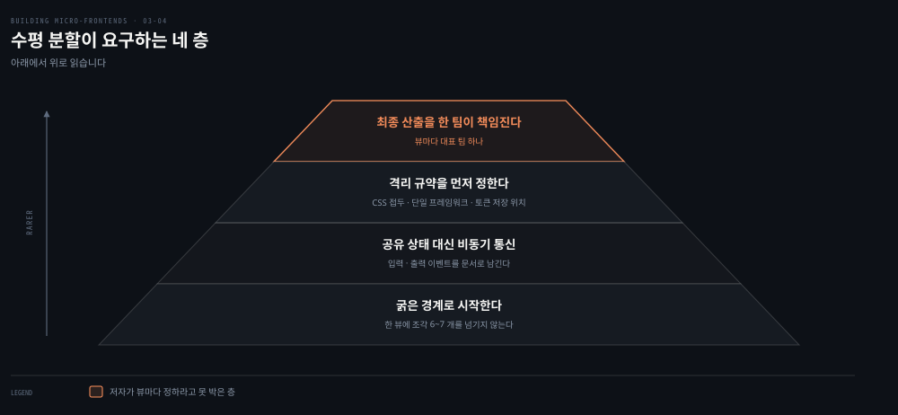
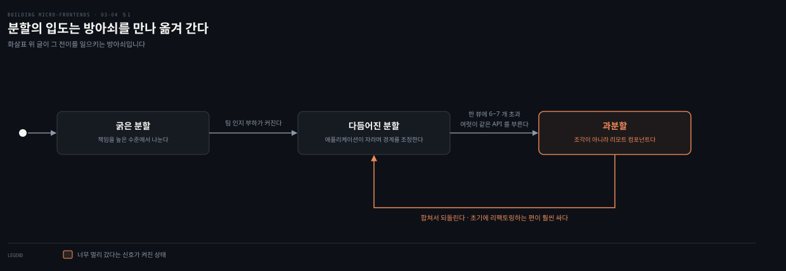
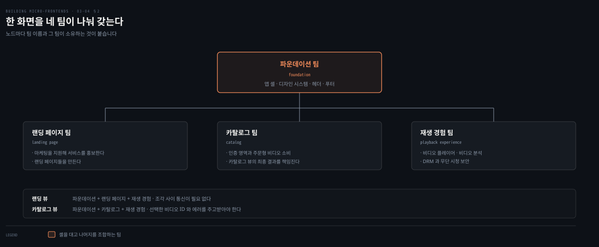
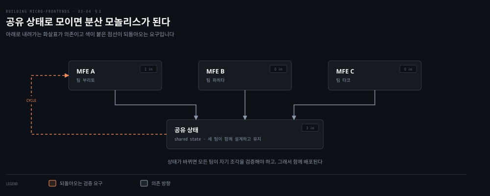
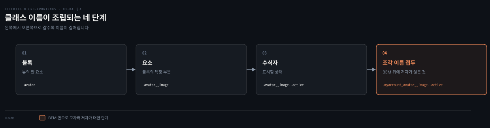
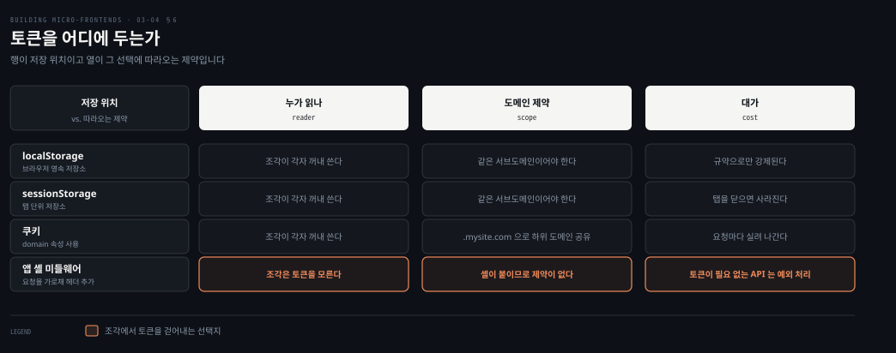

# 수평 분할 — 한 화면을 여럿이 나눌 때의 값

---

> 한 화면을 여러 팀이 나눠 가지면 재사용과 진화가 쉬워집니다. 대신 그 화면이 조율의 무대가 됩니다. 이 편은 수평 분할이 무엇을 벌어 주는지에서 출발해, 그 대가로 치러야 하는 통신·이름·프레임워크·인증 네 가지를 지나 최종 산출을 누가 책임지는가로 닫습니다.

## 핵심 요약

> 이 편이 매달린 하나의 생각은 **수평 분할의 값은 조각을 재사용하고 뷰를 진화시키는 데 있고, 그 값은 팀 사이의 조율 비용으로 지불된다**는 것입니다.

저자가 권하는 출발점은 굵게 나누고 나중에 다듬는 것입니다. 한 뷰에 조각이 6~7개를 넘거나 여러 조각이 같은 API를 부르고 있다면 분할을 너무 밀었다는 신호입니다. 가장 큰 함정은 조각 사이에 상태를 공유하려는 유혹입니다. 저자는 그것을 사회기술적 안티패턴이라 부르고 마이크로서비스에서 분산 모놀리스라 불리는 것과 같다고 못 박습니다.

답은 마이크로서비스에서 이미 쓰던 것입니다. 코레오그래피, 곧 비동기 메시지입니다. 조각은 각자 상태를 소유하고 이벤트 이미터로 알립니다. 나머지 세 가지는 격리 규약입니다. CSS 클래스는 BEM 위에 조각 이름을 얹고 프레임워크는 섞지 않으며 토큰은 저장 위치에 따라 도메인 제약이 달라집니다. 마지막이 조직입니다. 한 뷰에서 일하는 팀 수를 줄이고 최종 산출을 책임질 팀을 하나 정합니다.


## 학습 목표

이 내용을 읽고 나면:

1. 수평 분할이 어떤 조직과 프로젝트에 맞는지, 언제 과분할인지 신호로 판별할 수 있습니다.
2. 공유 상태가 왜 안티패턴인지 기술 쪽과 조직 쪽으로 나눠 설명할 수 있습니다.
3. 조각 사이 통신을 이벤트로 푸는 방식과 그것이 새 팀 합류에 주는 이점을 말할 수 있습니다.
4. CSS 이름 충돌과 멀티 프레임워크를 어떤 규약으로 막는지 재현할 수 있습니다.
5. 인증 토큰의 저장 위치별 제약을 구분하고 앱 셸 미들웨어가 무엇을 바꾸는지 설명할 수 있습니다.

아래는 이 편이 다루는 것을 아래에서 위로 쌓은 지도입니다. 토대가 먼저 서지 않으면 위층은 지켜지지 않습니다.




## 1. 무엇을 벌고 무엇을 요구하는가

> 수평 분할은 가장 유연한 대신 가장 까다롭습니다. 저자는 이 둘을 같은 문단에서 붙여 말합니다.



### 풀려는 문제

앞 편까지의 수직 분할은 한 뷰를 한 팀이 통째로 가졌습니다. 경계가 명확한 대신 재사용이 어렵습니다. 결제 화면이 랜딩에도 상품 상세에도 구독 페이지에도 나온다면, 뷰마다 그 결제 흐름을 다시 만들어야 합니다.

수평 분할은 이 지점을 겨냥합니다. 한 뷰를 여러 조각으로 나누고, 조직 곳곳의 팀이 만든 조각을 뷰에 가져다 씁니다.

### 여는 것

저자가 이 아키텍처를 권하는 대상은 둘입니다. 이미 규모 있는 엔지니어링 부서를 가진 회사와, 코드 재사용성이 높은 프로젝트입니다.

두 번째가 구체적입니다. 한 고객이 커스터마이징을 요청하는 멀티테넌트 B2B, 또는 카테고리마다 동작과 인터페이스가 조금씩 다른 이커머스가 그 예입니다. 이런 곳에서는 그 고객만을 위한, 그 도메인만을 위한 개인화 조각을 따로 만들 수 있습니다. 조각이 유지해야 할 격리와 독립성 덕분에, 애플리케이션의 다른 부분에 버그를 넣을 위험도 줄어듭니다.

### 요구하는 것

같은 모듈화가 값을 청구합니다. 저자는 수평 분할을 가장 도전적인 구현 가운데 하나로 부릅니다. 경계를 제대로 잡으려면 견고한 거버넌스와 정기적인 리뷰가 필요합니다.

더 큰 것은 조직입니다. 미리 잘 설계하지 않으면 이 아키텍처가 조직 구조 자체에 도전합니다. 그래서 통신 흐름과 팀 구조를 함께 리뷰해서, 개발자가 자기 일을 할 수 있게 하고 팀 사이의 외부 의존이 과해지지 않게 해야 합니다.

여기에 하나가 더 붙습니다. 모범 사례를 공유하고 가이드라인을 정의하는 일입니다. 자유의 수준은 유지하면서 사용자에게는 하나로 통합된 경험을 주어야 하기 때문입니다.

### 과분할의 신호 둘

저자가 권하는 출발점은 굵게 나누는 것입니다. 책임을 높은 수준에서 나누고, 애플리케이션이 진화하면서 다듬어 갑니다. 성급하게 뷰를 너무 많은 조각으로 쪼개면 불필요한 복잡도와 팀 간 조율 부담만 늘어납니다.

너무 멀리 갔다는 신호로 저자가 든 것이 둘입니다.

| 신호 | 무엇을 뜻하는가 |
|---|---|
| 한 뷰에 조각이 6~7개를 넘는다 | 조각이 아니라 리모트 컴포넌트를 구현하고 있을 가능성이 큽니다 |
| 여러 조각이 같은 API에서 가져온다 | 뷰의 분할을 너무 밀었고 리팩토링이 필요합니다 |

첫째에 저자가 붙인 설명이 2장의 구분으로 돌아갑니다. 작은 조각 여럿이 한 뷰에 사는 것은 안티패턴인데, 그것이 조각과 컴포넌트 사이의 선을 흐리기 때문입니다. **전자는 서브도메인의 비즈니스 표현이고 후자는 재사용을 위한 기술적 해법입니다.** 게다가 여러 팀의 산출을 같은 뷰에서 관리하려면 개발 수명주기의 여러 단계에서 추가 조율이 듭니다.

### 읽어내기 — 자유의 양이 곧 책임의 양이다

저자가 이 절을 닫는 문장이 관용구입니다. 이 아키텍처가 큰 힘을 주므로 프로젝트에 옳은 선택을 할 큰 책임도 따른다는 것입니다.

앞의 문제에 답이 생깁니다. 수평 분할이 파는 것은 재사용성이고, 받는 값은 거버넌스입니다. 조직에 그 거버넌스를 감당할 근육이 없다면 이 아키텍처는 재사용 대신 조율 지옥을 돌려줍니다.


## 2. 한 화면을 네 팀이 나눠 가질 때

> 클라이언트 사이드 조합은 수직 분할과 같은 앱 셸을 씁니다. 다른 것은 셸이 부르는 조각이 한 뷰에 여럿이라는 점뿐입니다.



### 풀려는 문제

구조가 비슷하다 보니 함정도 비슷한 자리에 있습니다. 모듈적 성질 때문에 컴포넌트를 너무 많이 생각하게 되는 것입니다. 저자가 여기서 거는 제동이 짧습니다. 비즈니스 관점을 고수하라는 것입니다.

말로만 하면 잡히지 않으므로 저자가 예를 하나 폅니다.

### 저자의 예 — 비디오 스트리밍 네 팀

비디오 스트리밍 웹사이트를 짓고, 수평 분할과 클라이언트 사이드 조합을 고릅니다. 여러 팀이 참여하지만 단순하게 두 뷰만 봅니다. 랜딩 페이지와 카탈로그입니다.

| 팀 | 무엇을 소유하는가 |
|---|---|
| 파운데이션 | 앱 셸과 디자인 시스템. UX 팀과 함께 일하되 기술 관점에서 |
| 랜딩 페이지 | 마케팅 팀을 지원해 스트리밍 서비스를 홍보하고 필요한 랜딩 페이지를 만듦 |
| 카탈로그 | 사용자가 주문형 비디오를 보는 인증 영역. 구독자 경험을 위해 다른 팀과 협업 |
| 재생 경험 | 비디오 플레이어, 비디오 분석, DRM 구현, 무단 시청 관련 보안 |

랜딩 페이지 하나를 구현할 때 최종 뷰를 책임지는 팀이 셋입니다. 파운데이션 팀이 앱 셸과 푸터와 헤더를 제공하고 랜딩에 있는 다른 조각들을 조합합니다. 랜딩 페이지 팀이 서비스 소개를 제공합니다. 재생 경험 팀이 신규 사용자를 끌 광고를 전달할 비디오 플레이어를 제공합니다.

이 뷰는 조각 사이에 특별한 통신을 요구하지 않습니다. 앱 셸이 로드되면 나머지 두 조각을 가져와 조합된 뷰를 사용자에게 줍니다.

카탈로그 뷰는 다릅니다. 사용자가 타일을 눌러 콘텐츠를 볼 때마다 카탈로그 조각이 재생 조각에게 선택된 비디오의 ID를 알려야 합니다. 에러를 표시해야 할 때는 카탈로그 팀이 에러 메시지 모달을 띄웁니다. 재생 쪽에서 에러가 나면 그 에러가 카탈로그 조각으로 전달돼 뷰에 표시됩니다. **둘을 독립으로 유지하면서도 사용자 상호작용이나 에러가 있을 때 통신하게 하는 전략이 필요해집니다.**

이 예에 특정 조합 전략이 적히지 않은 이유를 저자가 밝힙니다. 클라이언트 사이드 아키텍처마다 뷰를 조합하는 자기 방식이 있기 때문에, 아키텍처별로 모범 사례를 보겠다는 것입니다.

### 읽어내기 — 값이 드러나는 자리는 진화할 때다

플랫폼 출시 몇 달 뒤로 시간을 감습니다. 제품 팀이 미인증 버전의 카탈로그를 요청합니다. 플랫폼 자산의 발견성을 높이고 잠재 고객에게 좋은 쇼를 미리 보여 주려는 것입니다. 재생 기능이 빠진, 비슷한 카탈로그 경험입니다. 랜딩 페이지에도 정보를 더해서 사용자가 구독 여부를 판단할 수 있게 해 달라고 합니다.

이 요청을 채우는 데 필요한 팀은 파운데이션과 카탈로그와 랜딩 페이지 셋입니다. 재생 경험 팀은 부르지 않습니다.

여기가 저자가 수평 분할이 진짜로 빛나는 자리라고 말한 지점입니다. 웹 애플리케이션을 진화시키는 일은 기술적으로도 협업으로도 쉬운 적이 없습니다. 조각을 동시에 만들어 같은 뷰에 꿰맬 수 있으면, 여러 팀이 서로 발을 밟지 않고 일하게 되고 비즈니스가 속도와 방향을 함께 얻습니다.


## 3. 공유 상태 대신 이벤트

> 조각은 필연적으로 통신하게 됩니다. 저자가 미리 정하라고 요구하는 것은 그 통신을 상태로 풀지 않겠다는 결정입니다.



### 풀려는 문제

다른 팀이 만든 조각들이 사용자 세션 동안 정보와 상태를 어떻게 나눌지가 문제입니다. 프로젝트에 따라 이 통신은 드물 수도 잦을 수도 있지만, 어느 쪽이든 명확한 전략이 미리 있어야 합니다.

많은 개발자가 여기서 조각 사이에 상태를 공유하고 싶어집니다. 저자는 그것을 사회기술적 안티패턴이라 부릅니다.

### 기술 쪽에서 무엇이 깨지나

다른 팀이 소유한 공유 코드를 가진 분산 시스템에서 일한다는 것은, 그 공유 상태를 여러 팀이 함께 설계하고 개발하고 유지해야 한다는 뜻입니다.

한 팀이 공유 상태를 바꿀 때마다 다른 모든 팀이 그 변경이 자기 조각에 영향을 주지 않는지 검증해야 합니다. 이 구조는 조각이 제공하는 캡슐화를 깨고, 팀 사이에 잦은 외부 의존을 만듭니다. 잦은 정도가 아니라 상시적인 경우도 있습니다.

여기서 잃는 것이 시스템의 민첩성과 진화 가능성입니다. 조각의 핵심 부분이 이제 여러 조각에 걸쳐 공유되기 때문입니다. 한 조각이 여러 뷰에서 재사용되면 더 나빠집니다. 한 팀이 여러 개의 공유 상태를 다른 조각들과 함께 유지해야 할 수도 있습니다.

### 조직 쪽에서 무엇이 깨지나

조직 쪽에서 이 접근은 팀 결합을 낳습니다. 각 조각의 경계를 지켰다면 피할 수 있었을 상당한 조율이 필요해집니다.

조율은 설계 단계에서 끝나지 않습니다. 테스트와 릴리스에서 더 심해집니다. 같은 뷰의 모든 조각이 같은 상태에 의존하므로 독립적으로 릴리스할 수 없기 때문입니다.

**마이크로서비스 세계에서는 이것을 분산 모놀리스라 부릅니다. 마이크로서비스처럼 배포되지만 모놀리스처럼 지어진 애플리케이션입니다.**

### 마이크로서비스에서 가져온 답

조각을 쓰는 주된 이점 하나가 강한 경계입니다. 그 경계가 벌어 주는 것이 넷입니다.

- 각 팀이 자기 속도로 움직입니다.
- 조직이 느슨하게 결합됩니다.
- 조율에 드는 시간이 줍니다.
- 개발자가 통제권을 갖습니다.

마이크로서비스 사이에서 느슨한 결합을 얻으려고 쓰는 것이 코레오그래피 패턴입니다. 비동기 통신이나 이벤트 브로커에 기대어, 특정 이벤트에 관심 있는 모든 소비자에게 알립니다. 이렇게 하면 넷을 얻습니다.

- 하나 이상의 생산자가 던진 외부 이벤트에 반응할지 말지를 스스로 고르는 독립적 마이크로서비스
- 여러 서비스로 새지 않는 견고한 바운디드 컨텍스트
- 팀을 가로지르는 조율에 드는 통신 부담의 감소
- 자기 고객의 필요에 따라 서비스를 진화시킬 수 있는 각 팀의 민첩성

조각도 같은 방식으로 접근해서 같은 이점을 얻습니다. 공유 상태 대신 각 조각의 경계를 유지하고, 뷰 안에서 공유돼야 할 이벤트를 비동기 메시지로 전합니다. 프론트엔드에서 이미 익숙하게 다루던 방식입니다.

구현 선택지로 저자가 든 것이 이벤트 이미터와 리액티브 스트림입니다. 어느 쪽이든 뷰의 모든 조각이 그 하나를 공유합니다.

### 새 팀이 붙을 때 드러나는 차이

저자가 이 방식의 값을 시간 축에서 보여 줍니다.

팀 파히타가 만드는 MFE B가, 팀 부리토가 만드는 MFE A에서 사용자가 무언가를 눌렀을 때 반응해야 합니다. 이벤트 이미터를 쓰면 두 팀이 이벤트 이름과 페이로드의 모양을 함께 정의하고, 그 뒤로는 병렬로 구현합니다. 나중에 플랫폼에 기능이 붙어 페이로드가 바뀌어도 팀 파히타는 자기 로직만 조금 고치면 됩니다. 다른 팀의 변경을 기다리지 않고 통합을 시작할 수 있으니 독립이 유지됩니다.

같은 뷰의 MFE C는 팀 타코가 만드는데 내용이 정적이라 어떤 이벤트에도 관심이 없습니다. 팀 타코는 뷰의 상태 변화에 자기 몫이 영향받지 않는다는 것을 알고 자기 일을 계속합니다.

몇 달 뒤 새 기능을 만들 팀 나초가 생깁니다. MFE D가 MFE A와 MFE B 옆에 자리를 잡습니다. 느슨한 결합 덕분에 MFE D는 MFE A가 던지는 이벤트를 듣기만 하면 됩니다. **모든 조각이 잘 캡슐화돼 있고 유일한 통신 프로토콜이 이벤트 이미터 같은 발행 구독 시스템이므로, 새 팀은 필요한 이벤트를 듣는 것만으로 기존 조각들 옆에 기능을 꽂습니다.**

### 읽어내기 — 계약은 이벤트 목록으로 남는다

저자가 여기에 운영 규약을 하나 붙입니다. 수평 분할 조각마다 입력 이벤트와 출력 이벤트를 팀이 문서로 남기면 팀 사이 비동기 통신이 쉬워집니다. 조각 안팎으로 오가는 통신의 계약 목록이 최신 상태로, 스스로 설명되게 유지되면, 명확한 통신과 시스템 전체의 더 나은 거버넌스가 따라옵니다.

앞의 문제에 답이 생깁니다. 조각 사이의 통신은 없앨 수 없고 없앨 필요도 없습니다. 없애야 하는 것은 **공유된 상태**이고, 남겨야 하는 것은 **문서로 적힌 이벤트 계약**입니다.


## 4. 이름과 프레임워크가 부딪힐 때

> 같은 화면에서 여러 팀의 코드가 만나면 이름과 런타임이 충돌합니다. 저자의 답은 한쪽은 규약이고 한쪽은 금지입니다.



### 풀려는 문제

여러 팀이 같은 애플리케이션에서 일하면 클래스 이름이 겹칠 가능성이 큽니다. 겹치면 최종 레이아웃이 깨집니다.

프레임워크도 같은 자리에서 부딪힙니다. 한 뷰에 React 두 버전이 내려오면 성능이 나빠지고, 라이브러리를 로드하거나 새 컴포넌트를 뷰에 붙일 때 변수가 충돌할 수 있습니다.

### CSS는 BEM 위에 조각 이름을 얹는다

위험을 없애는 방법은 조각마다 클래스 이름에 접두를 붙이는 것입니다. 이름이 중복되지 못하게 하는 강한 규칙을 만드는 셈입니다.

저자가 기반으로 쓰는 것이 BEM입니다. 조각의 컴포넌트에 셋을 배정합니다.

| 요소 | 무엇인가 | 아바타 예 |
|---|---|---|
| Block | 뷰의 한 요소 | 이미지와 이름 등으로 이뤄진 아바타 컴포넌트 |
| Element | 블록의 특정 요소 | 아바타 이미지 |
| Modifier | 표시할 상태 | 활성 또는 비활성 |

여기서 나오는 이름이 이렇습니다.

```css
.avatar {}
.avatar__image {}
.avatar__image--active {}
.avatar__image--inactive {}
```

BEM을 따르는 것만으로도 CSS 전략을 세우는 데 큰 도움이 되지만, 조각이 여럿인 프로젝트에는 충분하지 않을 수 있습니다. 그래서 BEM 구조 위에 조각 이름을 접두로 얹습니다. 아바타를 "my account" 조각에서 쓴다면 이렇게 됩니다.

```css
.myaccount_avatar {}
.myaccount_avatar__image {}
.myaccount_avatar__image--active {}
.myaccount_avatar__image--inactive {}
```

이름이 길어지지만 필요한 격리를 보장하고, 각 클래스가 무엇을 가리키는지 분명해집니다.

### 프레임워크는 격리 수단이 있어도 섞지 않는다

멀티 프레임워크는 수직 분할에서도 성능 때문에 이상적이지 않았습니다. 수평 분할에서는 더 위험합니다. 설계 단계에서 다루지 않으면 최종 뷰에서 런타임 에러가 납니다.

이 문제를 다룰 수단이 없지는 않습니다.

| 수단 | 무엇으로 막는가 |
|---|---|
| iframe | 샌드박스를 만들어 한 iframe 안에서 로드된 것이 다른 것과 충돌하지 않게 합니다 |
| Module Federation | 라이브러리를 공유해 같은 라이브러리의 다른 버전 사이 충돌을 피합니다 |
| import maps | 의존성마다 스코프를 정의해 스코프별로 다른 버전을 쓰게 합니다 |
| 웹 컴포넌트 | shadow DOM 뒤에 조각이 필요로 하는 프레임워크를 숨깁니다 |

수단이 있는데도 저자는 멀티 프레임워크를 강하게 말립니다. 이유가 성능입니다. 페이지를 렌더하려고 내려받을 킬로바이트가 늘면 사용자 경험이 나빠지는데, 개발자와 아키텍트의 일은 가능한 최선의 경험을 주는 것입니다. SPA 같은 다른 프론트엔드 아키텍처에서도 멀티 프레임워크는 용납되지 않았고, 조각도 예외가 아니어야 합니다.

정당한 시나리오로 저자가 남긴 것은 둘뿐입니다. 하나는 레거시 애플리케이션을 새것으로 옮기면서 조각을 한꺼번에가 아니라 반복적으로 릴리스하는 경우입니다. 이때는 멀티 프레임워크가 고객 가치를 전달하면서 배포 위험을 줄여 줍니다. 다른 하나는 회사가 다른 회사를 인수해서, 그 소프트웨어를 자기 조각 아키텍처에 통합해 투자를 빨리 회수해야 하는 경우입니다.


## 5. 토큰을 어디에 두는가

> 인증은 수평 분할에서만 생기는 문제를 하나 냅니다. 한 뷰의 여러 조각이 같은 토큰을 필요로 한다는 것입니다.



### 풀려는 문제

사용자가 웹 애플리케이션의 인증 영역에 들어가면, 페이지를 구성하는 모든 조각이 각자의 API와 통신해 토큰을 받아야 합니다. 세 팀이 각각 조각을 만들어 한 뷰를 구성한다고 하면, 그 조각들은 여러 마이크로서비스로 이뤄진 분산 백엔드에서 데이터를 가져오면서 사용자 검증을 위해 JWT를 넘겨야 합니다.

질문이 여기서 나옵니다. 백엔드로 여러 번 왕복하지 않고 여러 조각이 토큰을 안전하게 가져오고 저장하는 방법은 무엇인가입니다.

### 저장 위치가 도메인 제약을 정한다

최선의 선택지로 저자가 든 것이 셋입니다. `localStorage`, `sessionStorage`, 쿠키입니다. 모든 조각이 규약에 따라 선택된 웹 스토리지에서 같은 토큰을 꺼냅니다.

선택한 저장소에 따라 보안 제약이 달라집니다. `localStorage`나 `sessionStorage`를 쓰면 모든 조각이 같은 서브도메인에 호스팅돼야 합니다. 그렇지 않으면 토큰이 든 저장소에 접근할 수 없습니다. 쿠키는 `domain` 속성을 설정해 여러 서브도메인에서 접근하게 만들 수 있습니다. `beta.mysite.com`이나 `preview.mysite.com` 같은 경우입니다. `domain`을 `.mysite.com`으로 두면 브라우저가 그 도메인 아래 모든 서브도메인에서 쿠키를 공유하고 가져오도록 허용합니다.

또 다른 선택지는 앱 셸이 인증 메커니즘을 처리하는 것입니다. 모든 HTTP 요청을 가로채 사용자 토큰이 담긴 헤더를 붙이는 미들웨어를 만듭니다. 토큰이 필요 없는 API가 있는 엣지 케이스는 코드에서 쉽게 해결됩니다.

### 읽어내기 — 같은 API를 같은 몸으로 부르면 하나다

저자가 인증을 다루다 경계 이야기로 넘어갑니다. 여러 조각이 같은 요청 본문으로 같은 API를 소비하고 있다면, 그것들은 하나의 조각으로 합쳐질 수 있을 가능성이 큽니다.

이어지는 조언이 이 장 전체의 태도를 보여 줍니다. 조각의 도메인 경계를 다시 보는 일을 두려워하지 말라는 것입니다. 경계는 비즈니스와 함께 진화합니다. 경계를 정의하는 과학적 방법이 없으므로, 한 발 물러나 고른 방향을 재평가하는 편이 문제를 무시하는 것보다 낫습니다. **오래 무시할수록 팀이 겪을 혼란은 커집니다. 프로젝트 초기에 시간을 들여 조각 몇 개를 리팩토링하는 편이 훨씬 낫습니다.**


## 6. 최종 산출을 누가 책임지는가

> 수평 분할의 주된 난제는 기술이 아니라 조직입니다. 저자는 그것을 최종 산출을 조율하기 어렵다는 한 문장으로 요약합니다.

### 풀려는 문제

다른 팀이 소유한 여러 조각이 같은 뷰에 조합되면, 의존성 충돌이나 CSS가 서로를 덮어쓰는 문제로 프로덕션에서 런타임 문제가 생길 수 있습니다. 이것을 막을 사회적 메커니즘이 필요합니다.

기술 쪽에서 함께 필요한 것이 관측성 도구입니다. 프로덕션에서 어느 조각이 실패하는지 빨리 식별해서, 그 팀에게 자기 조각을 진단할 명확한 정보를 줘야 합니다.

### 저자의 규약 셋

첫째는 통신 채널을 열어 두고 빠른 피드백 루프를 유지하는 것입니다. 한 뷰를 책임지는 모든 조각 팀에서 한 명씩 참여하는 주간이나 격주 회의가 그 예입니다. 팀 사이의 동기화는 라이브 회의로 하거나 이메일이나 인스턴트 메시징 같은 비동기 통신으로 합니다.

둘째는 같은 페이지에서 일하는 팀 수를 줄이고, 사용자에게 제시되는 최종 산출을 한 팀이 책임지게 하는 것입니다. 그 팀이 모든 일을 해야 한다는 뜻은 아닙니다. **공유된 책임은 자주 오해로 이어지므로, 한 팀이 주도하면 최종 사용자 경험이 나아진다는 것입니다.**

앞의 스트리밍 예로 돌아가면 카탈로그 페이지에 세 팀이 관여했습니다. 사용자가 영화나 쇼를 누르면 비디오 플레이어에서 재생돼야 하므로, 카탈로그 팀이 재생 경험에 추가 확인을 할 가능성이 큽니다. 그렇다면 최종 결과를 책임질 팀은 카탈로그 팀이고, 그 팀이 재생 경험 팀과 노력을 조율합니다.

셋째는 외부 의존을 줄이는 일을 엔지니어링 매니저나 팀 리드의 정기 과제로 두는 것입니다. 현상 유지를 자동으로 받아들이지 말고, 지속적 개선의 마음가짐으로 지금까지 한 일에 도전하라는 조언이 붙습니다.

### 왜 회의가 아니라 문서인가

팀을 동기화하고 잠재적인 breaking change를 논의하게 하려면, 조각의 입력과 출력, 받기를 기대하는 이벤트, 스스로 던질 이벤트를 문서로 남기게 해야 합니다. breaking change를 RFC 같은 문서로 추적하는 것을 저자가 강하게 권하는 이유가 셋입니다.

- 팀이 시간대를 넘어 흩어져 있을 때 특히 유용한 비동기 통신이 생깁니다.
- 결정과 함께, 그 결정을 내릴 당시 회사가 놓여 있던 맥락의 기록이 남습니다.
- 회의에서 모두가 잘하지는 않습니다. 한 사람이 논의를 독점해 다른 사람이 의견을 내지 못하는 일이 생깁니다. 구두에서 문서로 옮기면 모두의 목소리가 들리게 됩니다.

### 리팩토링과 SEO와 개발자 경험

같은 절에서 저자가 짧게 지나가는 것이 셋 더 있습니다.

**리팩토링**은 수평 분할이 주는 이점 쪽입니다. 코드가 한 팀이 감당하기 어려울 만큼 복잡해졌을 때, 또는 자기가 만들지 않은 조각을 새 팀이 인수했을 때, 그 조각만 리팩토링할 수 있습니다. 수직 분할에서도 가능하지만 수평 분할 조각은 유지할 로직이 훨씬 적어서, 같은 플랫폼을 여러 해 다루는 엔터프라이즈 조직에 특히 유리합니다. 저자가 여기에 조건을 답니다. 쉬우니까 리팩토링하거나 재작성하라는 말이 아니라는 것입니다. 팀이 추가 비즈니스 지식을 얻었거나 촉박한 마감 때문에 전술적 해법을 넣어야 했던 경우에, 장기적으로 새 기능 개발이 빨라지고 프로덕션 버그 가능성이 줄어든다는 뜻입니다.

**SEO**는 동적 렌더링이 이 아키텍처에서도 유효한 기법이라는 확인입니다. 특히 iframe으로 조각을 캡슐화할 때 그렇습니다. 크롤러를 최적화된 정적 HTML 페이지 버전으로 리다이렉트하면 검색 순위를 개선하는 데 도움이 됩니다.

**개발자 경험**은 팀이 자기 조각만 개발할 때는 수직 분할과 크게 다르지 않습니다. 뷰 안에서 여러 조각을 함께 테스트해야 할 때 복잡해집니다. 주된 난제가 버전을 추적하는 일과 개발자 기기에서 뷰를 조립하는 회전을 빠르게 만드는 일입니다.

한 선택지는 Webpack DevServer 프록시 같은 도구로 로컬에서 테스트하되 조각은 테스트나 스테이징이나 프로덕션 환경의 것을 쓰는 것입니다. 이 아키텍처를 받아들인 회사들은 팀의 피드백 루프를 개선할 도구를 자주 만듭니다. 흔히 명령줄 도구 형태이고 프론트엔드 개발자 커뮤니티가 쓰는 표준 도구를 보강합니다. 저자가 붙이는 단서는 견고한 개발자 경험을 세우려면 내부 투자가 필요할 가능성이 크다는 것입니다.


## 7. 어디에 쓰나

> 저자가 이 아키텍처를 고르는 이유로 든 것이 셋입니다. 셋 다 재사용이 축입니다.

### 조각의 재사용

첫째 이유가 한 애플리케이션 안에서, 또는 여러 애플리케이션에 걸쳐 조각을 재사용하는 것입니다.

이커머스 웹사이트의 결제 조각을 맡은 팀을 상상해 봅니다. 그 조각은 뷰의 유형과 쓸 수 있는 결제 수단에 따라 서로 다른 상태를 가집니다. 결제 조각은 사용자가 결제할 수 있는 모든 뷰에 나타납니다. 랜딩 페이지, 상품 상세 뷰, 심지어 다른 제품의 구독 페이지까지입니다. 비슷한 UX 구성이 여러 뷰에 복제되는 B2B 애플리케이션에서는 이것이 더 큰 규모로 적용됩니다.

### 엔터프라이즈 대시보드

둘째가 엔터프라이즈 애플리케이션입니다. 재무나 모니터링 대시보드처럼, 서로 다른 목적의 뷰에 여러 종류의 데이터를 모아야 하는 경우입니다.

저자가 실명으로 든 사례가 New Relic입니다. 클라우드 서비스 모니터링 도구를 이 방식으로 제공하며, 조직을 확장하려고 조각을 구현한 프론트엔드를 씁니다. 여러 팀이 서로 다른 데이터 표현을 기여하고 그것들이 하나의 대시보드로 모입니다.

주목할 점은 나누는 방식입니다. New Relic은 적은 수의 팀만 같은 뷰에서 일하도록 애플리케이션을 나눴습니다. 최종 뷰를 구성하는 데 필요한 통신을 줄이면서도 각 팀이 자기 비즈니스 도메인 안에 잘 캡슐화되게 한 것입니다. 사용자가 대시보드를 고르면 관련 조각이 앱 셸 안에 지연 로드됩니다. 배포 계약을 따르면 팀은 최종 결과를 자기 웹 애플리케이션에서 바로 확인할 수 있습니다.

### 멀티테넌트

셋째가 멀티테넌트 애플리케이션입니다. 인터페이스 대부분은 같지만 고객이 자기 조직에 맞는 특정 기능을 만들 수 있는 경우입니다.

레스토랑용 디지털 계산대 시스템을 예로 듭니다. 고객마다 플로어의 테이블 구성을 다르게 하고 싶습니다. 모든 고객에게 기능은 같지만 레스토랑 체인이 특정 기능을 요청할 수 있습니다. 담당 팀은 고객마다 코드를 포크하지 않고, 그 고객의 필요를 처리할 새 조각을 만들어 그 테넌트에 배포합니다.


## 적용 관점

> 아래는 백엔드 개발자가 이미 가진 판단 기준과 이 절을 잇는 노트의 읽기입니다. 책이 백엔드 독자를 향해 쓴 대목이 아닙니다.

공유 상태가 분산 모놀리스를 만든다는 대목은 백엔드에서 이미 값을 치르고 배운 것입니다. 여러 서비스가 하나의 데이터베이스 스키마를 함께 쓰면, 컬럼 하나를 바꿀 때마다 모든 소비자를 확인해야 하고 결국 함께 배포하게 됩니다. 저자가 조각에 대해 적은 문장은 그 실패의 프론트엔드 판본입니다. 처방도 같습니다. 코레오그래피와 이벤트입니다.

다만 옮겨 올 때 어긋나는 지점이 있습니다. 백엔드의 이벤트 브로커는 프로세스 밖에 있고 내구성과 재시도와 순서를 어느 정도 보장합니다. 뷰 안의 이벤트 이미터는 그렇지 않습니다. 페이지 수명 동안만 사는 객체입니다. 그래서 브로커를 전제로 굳어진 습관을 그대로 들고 오면 어긋납니다. 늦게 붙은 리스너는 앞선 이벤트를 못 받고, 새로 고침 한 번에 상태가 사라집니다. 저자가 조각마다 자기 상태를 소유하라고 한 것은 이 조건에서 나온 요구로 읽는 편이 정확합니다.

같은 API를 같은 요청 본문으로 부르는 조각 둘은 합칠 후보라는 규칙은, 백엔드에서 트랜잭션 경계를 나누는 감각과 짝을 이룹니다. 같은 데이터를 같은 방식으로 읽는 두 서비스는 대개 하나였어야 합니다. 프론트엔드는 그 신호가 화면에 드러나므로 오히려 발견하기 쉽습니다.

토큰 처리도 대응이 분명합니다. 앱 셸 미들웨어가 모든 요청에 헤더를 붙이는 방식은 API 게이트웨이가 하던 일과 같은 자리에 있습니다. 조각에 토큰을 아예 주지 않는 선택은, 서비스에 자격증명을 직접 쥐여 주지 않는 선택과 같습니다. 노출면이 줄고 회전이 한 곳에서 끝납니다.

입출력 이벤트를 문서로 남기라는 요구는 API 계약 문서와 같은 자리이고, RFC로 breaking change를 추적하라는 요구는 아키텍처 결정 기록과 같은 자리입니다. 새로 배울 것이 아니라 이미 하던 것을 화면 쪽에도 적용하는 일입니다.


## 면접 대비

Q: 마이크로 프론트엔드에서 조각 사이에 전역 상태 스토어를 두면 왜 문제가 되나요?

A: 그 스토어를 여러 팀이 함께 설계하고 유지해야 하기 때문입니다. 한 팀이 상태를 바꿀 때마다 나머지 팀이 자기 조각을 검증해야 하고, 같은 뷰의 모든 조각이 같은 상태에 묶여 독립적으로 릴리스할 수 없게 됩니다. 마이크로서비스처럼 배포되지만 모놀리스처럼 지어진 상태, 곧 분산 모놀리스가 됩니다. 대안은 각 조각이 자기 상태를 소유하고 이벤트 이미터나 커스텀 이벤트로 알리는 것입니다.

Q: 한 화면에 조각이 몇 개까지가 적당한가요?

A: 저자는 6~7개를 넘으면 조각이 아니라 리모트 컴포넌트를 만들고 있는 신호로 봅니다. 조각은 서브도메인의 비즈니스 표현이고 컴포넌트는 재사용을 위한 기술적 해법인데, 잘게 쪼갤수록 그 선이 흐려지기 때문입니다. 또 하나의 신호는 여러 조각이 같은 API에서 데이터를 가져오는 경우입니다. 그때는 분할을 너무 밀었다고 보고 합치는 쪽을 검토합니다.

Q: 여러 조각이 같은 인증 토큰을 써야 할 때 어떤 선택지가 있나요?

A: 웹 스토리지에 두고 규약으로 함께 꺼내 쓰는 방법과, 앱 셸이 처리하는 방법이 있습니다. `localStorage`와 `sessionStorage`는 모든 조각이 같은 서브도메인에 있어야 접근됩니다. 쿠키는 `domain`을 `.mysite.com`처럼 두면 하위 서브도메인이 공유합니다. 앱 셸 방식은 모든 HTTP 요청을 가로채 토큰 헤더를 붙이는 미들웨어를 두는 것으로, 조각이 토큰을 알 필요가 없어집니다.

Q: 한 화면에 여러 프레임워크를 섞어도 되나요?

A: 기술적으로는 iframe이나 Module Federation이나 import maps나 웹 컴포넌트로 충돌을 막을 수 있습니다. 그래도 저자는 성능 때문에 강하게 말립니다. 내려받을 양이 늘면 사용자 경험이 나빠지는데 그것은 SPA에서도 용납되지 않던 일입니다. 정당한 경우는 둘입니다. 레거시를 반복적으로 이관하는 중이거나 인수한 회사의 소프트웨어를 빠르게 통합해야 할 때입니다.

### 요약 세 문장

1. 수평 분할은 조각의 재사용과 뷰의 진화를 벌어 주고, 그 값을 팀 사이 조율 비용으로 받습니다.
2. 조각 사이 통신은 공유 상태가 아니라 문서로 적힌 이벤트 계약으로 풀어야 하며, 그래야 새 팀이 기존 조각을 건드리지 않고 붙을 수 있습니다.
3. 나머지 난제는 규약으로 막습니다. CSS는 조각 이름 접두, 프레임워크는 단일화, 토큰은 저장 위치의 도메인 제약, 최종 산출은 한 팀의 책임입니다.


## 핵심 개념 체크리스트

- [ ] 수평 분할이 맞는 조직과 프로젝트의 조건을 두 가지로 말할 수 있는가?
- [ ] 과분할의 신호 둘과 각각이 뜻하는 바를 댈 수 있는가?
- [ ] 공유 상태가 기술 쪽과 조직 쪽에서 각각 무엇을 깨뜨리는지 나눠 설명할 수 있는가?
- [ ] 코레오그래피가 조각에 주는 이점 넷을 재현할 수 있는가?
- [ ] BEM 세 요소와 조각 이름 접두를 붙인 클래스 이름을 쓸 수 있는가?
- [ ] 토큰 저장 위치 셋의 도메인 제약 차이를 구분할 수 있는가?
- [ ] 한 뷰의 최종 산출을 한 팀이 책임져야 하는 이유를 댈 수 있는가?


## 관련 문서

- [수직 분할 — 진화와 디자인 시스템과 성능](03-03.수직%20분할%20—%20진화와%20디자인%20시스템과%20성능.md) — 이 편이 대비하는 앞 아키텍처
- [합치고 잇고 주고받기](02-03.합치고%20잇고%20주고받기.md) — 조합과 통신의 결정 축을 세운 편
- [경계를 어디에 긋고 어떻게 확인하는가](02-02.경계를%20어디에%20긋고%20어떻게%20확인하는가.md) — 조각과 컴포넌트를 가르는 기준의 출처
- [Building Micro-Frontends 정독 인덱스](README.md) — 다음 편인 Module Federation의 진행 상태는 인덱스의 노트 표에서 봅니다


## 참고 자료

- 《Building Micro-Frontends, Second Edition》(Luca Mezzalira, O'Reilly, 2026) ISBN 978-1-098-17078-3
  - 다룬 범위: Horizontal-Split Architecture · Client Side · Challenges · Micro-Frontend Refactoring
  - 이어서: Search Engine Optimization · Developer Experience · Team Communication · Use Cases
- [BEM — Block Element Modifier](https://getbem.com/) — 저자가 CSS 이름 규약의 기반으로 든 명명 규칙
