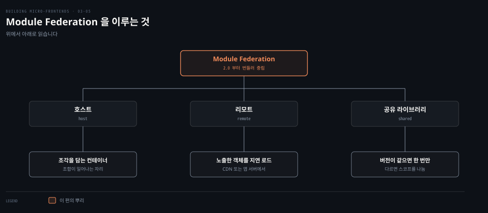
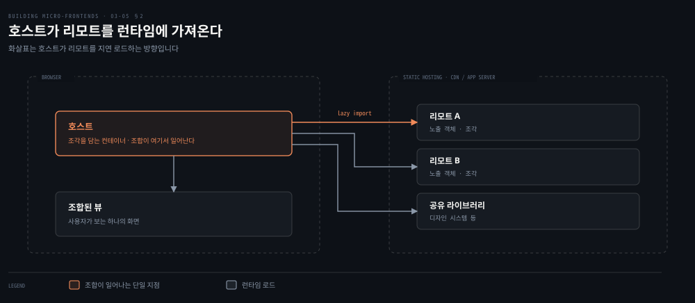
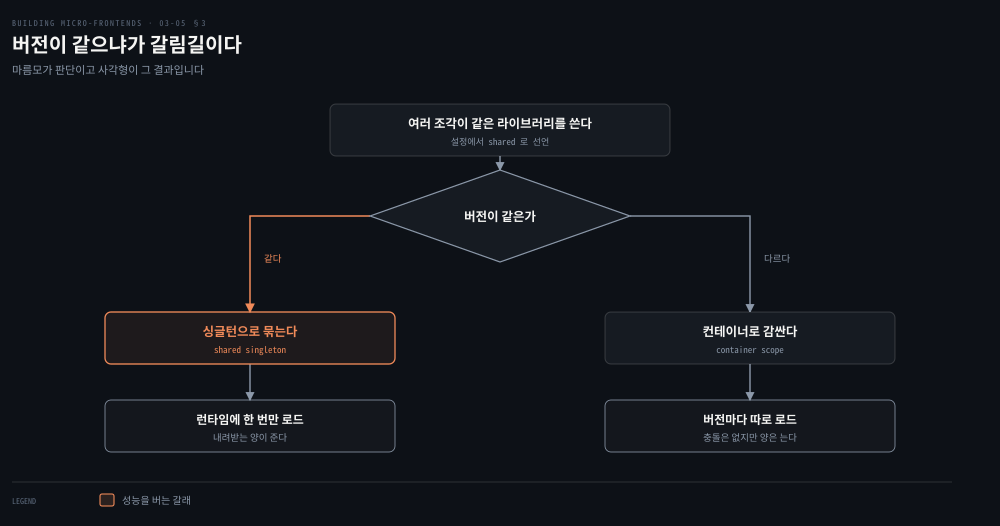
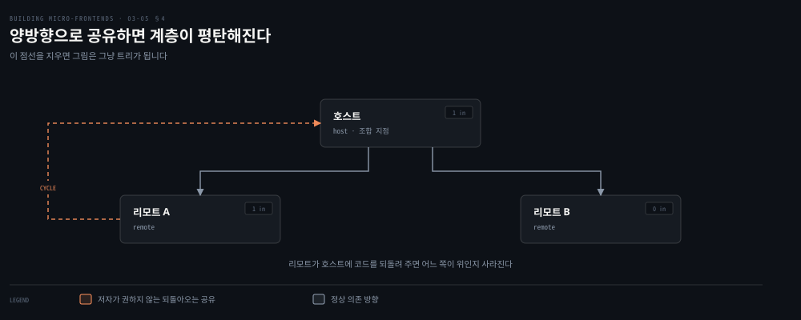

# Module Federation — 호스트와 리모트로 잇는다

---

> 앞 편이 수평 분할의 규약을 세웠다면 이 편부터는 그 규약을 구현하는 도구를 하나씩 봅니다. 첫 도구인 Module Federation은 조각을 런타임에 임포트하게 만들어, 분산 아키텍처를 모놀리식 코드베이스처럼 다루게 합니다. 그 편함이 곧 이 도구의 가장 약한 지점이기도 합니다.

## 핵심 요약

> 이 편 전체가 매달린 하나의 생각은 **Module Federation이 파는 것은 조합의 단순함이고, 그 단순함이 규율 없는 팀에게는 그대로 위험이 된다**는 것입니다.
>
> 구조는 두 부분입니다. 조각을 담는 호스트와, 런타임에 호스트 안으로 로드되는 리모트입니다. 리모트는 지연 로드될 때 호스트가 쓸 객체를 노출합니다.
>
> 2.0에서 크게 바뀌어 특정 번들러에 묶이지 않게 됐습니다. 서로 다른 번들러가 내보낸 모듈을 같은 애플리케이션에서 결합할 수 있습니다.
>
> 외부 라이브러리는 공유로 선언하면 버전이 같은 한 런타임에 한 번만 로드됩니다. 의도적으로 다른 버전을 함께 쓰려면 컨테이너라는 스코프가 각각을 감쌉니다.
>
> 저자가 말리는 것은 양방향 공유입니다. 호스트와 리모트가 서로에게 코드를 주면 계층이 평탄해집니다. 단방향이 디버깅과 통제와 효율에서 낫습니다.
>
> 점수표에서 단순성과 개발자 경험과 확장성이 5점이고, 조율만 3점입니다. 그 3점이 이 도구의 위험이 어디 있는지 말해 줍니다.

## 학습 목표

이 내용을 읽고 나면:

1. 호스트와 리모트가 각각 무엇이고 조합이 언제 일어나는지 설명할 수 있습니다.
2. 2.0의 변화가 도구 선택에 무엇을 바꾸는지 말할 수 있습니다.
3. 같은 라이브러리의 버전이 같을 때와 다를 때 각각 어떻게 처리되는지 구분할 수 있습니다.
4. 양방향 코드 공유를 저자가 말리는 이유 셋을 댈 수 있습니다.
5. 여덟 축 점수에서 조율만 3점인 이유를 이 도구의 성질로 설명할 수 있습니다.

아래는 이 도구를 이루는 것을 뿌리부터 편 지도입니다. 세 갈래가 이 편의 세 절과 그대로 짝을 이룹니다.

## 1. 왜 지금 다시 보는가

> 이 플러그인은 Webpack 5와 함께 나왔지만, 저자가 지금 권하는 근거는 그 시절이 아니라 최근의 두 변화에 있습니다.

### 풀려는 문제

수평 분할을 클라이언트에서 조합하려면 런타임에 다른 팀의 산출물을 가져와야 합니다. 그런데 조각마다 번들러가 다르면 그 결합 자체가 막힙니다. 팀이 자율적으로 도구를 고르는 조직일수록 이 제약이 실제로 걸립니다.

도구를 고르는 쪽에는 다른 걱정도 있습니다. 오픈소스 플러그인 하나에 아키텍처를 얹었는데 유지보수가 끊기면 되돌릴 방법이 없습니다.

### 두 변화

변화 하나는 기술입니다. 2.0에서 Module Federation이 크게 바뀌어 더 이상 특정 번들러에 묶이지 않습니다. Rspack, Rolldown, Webpack, Vite를 비롯한 여러 번들러에서 쓸 수 있고 앞으로 더 늘어납니다. 그래서 **서로 다른 번들러가 내보낸 Module Federation 모듈을 같은 애플리케이션 안에서 결합할 수 있습니다.** 클라이언트 사이드 렌더링에서 UI를 수평으로 나누려 할 때 이 성질이 견고한 해법이 됩니다.

다른 하나는 후원입니다. 이 라이브러리의 주 메인테이너가 ByteDance로 옮겼습니다. TikTok과 CapCut을 만든 회사입니다. ByteDance가 Module Federation을 무겁게 쓰고 있다는 점을 감안하면, 이제 정규 엔지니어 팀이 이 프로젝트에 붙어 있는 셈입니다.

저자가 이 사실에 붙인 용도가 실무적입니다. 기술 리더십에게 마이크로 프론트엔드를 제안할 때 강조할 지표라는 것입니다. 강한 회사와 넓은 커뮤니티가 함께 후원하는 오픈소스 프로젝트를 끼워 넣는 일은 분명한 이점입니다.

### 읽어내기 — 도구 선택에 후원 구조가 들어온다

앞의 문제에 답이 생깁니다. 번들러 중립은 조직의 자율성을 지키고, 후원 구조는 그 선택을 설득할 근거가 됩니다. **아키텍처 결정에서 기술 사양만 보고 유지보수의 지속 가능성을 안 보면 반쪽입니다.**

## 2. 호스트와 리모트

> 이 플러그인의 모델은 두 낱말로 끝납니다. 그 단순함이 저자가 이 도구를 좋아하는 이유입니다.

### 풀려는 문제

여러 개발자나 팀이 격리된 채로 일하면서도 하나의 애플리케이션을 조합해야 합니다. 빌드 시점에 묶으면 격리가 깨지고, 아무 방법도 없으면 조합이 안 됩니다.

Module Federation이 여는 길은 자바스크립트 코드 청크를 동기나 비동기로 로드하는 것입니다. 뒤에서 런타임에 서로 다른 청크를 지연 로드하니, 팀은 격리된 채로 일하면서 조합까지 맡을 수 있습니다.

### 두 부분

| 부분 | 무엇인가 |
|---|---|
| 호스트 | 하나 이상의 조각이나 라이브러리를 담는 컨테이너 |
| 리모트 | 런타임에 호스트 안에 로드될 조각이나 라이브러리. 지연 로드될 때 호스트가 쓸 객체를 하나 이상 노출 |

저자가 이 도구의 진짜 강점으로 꼽는 것이 단순함입니다. 서로 다른 조각이나 디자인 시스템 같은 공유 라이브러리를 노출해 두면 비동기 통합이 쉬워집니다.

개발자 경험은 애플리케이션 안에서 거의 투명합니다. **모놀리식 코드베이스에서 하던 것처럼 원격 조각을 임포트해서 뷰를 조합합니다.** 로컬에서 테스트하든 특정 온라인 엔드포인트를 가리키든 차이가 없습니다. 여러 환경을 다루는 방식과 비슷하게, 번들러마다 공유 설정을 두고 환경별 설정으로 덧입히면 되기 때문입니다.

### 조합이 일어나는 자리

조합은 런타임에 일어나며 자리는 둘입니다. 앱 셸이 여러 조각을 로드하는 클라이언트 사이드이거나, 서버 사이드 렌더링을 쓰는 서버 사이드입니다.

앱 셸에서 런타임에 조각을 로드할 때는 CDN이나 애플리케이션 서버에서 직접 가져옵니다. 서버 사이드 렌더링에서도 같습니다. 이 경우 조합은 오리진에서 일어나고, 클라이언트 요청에 응답하기 전에 런타임으로 조각을 로드합니다.

서버 사이드에서 얻는 것이 하나 더 있습니다. 페이지를 조합해 최종 결과를 서빙하는 애플리케이션 서버를 다시 배포하지 않고도 컴포넌트를 비동기로 갈아 끼울 수 있다는 점입니다.

## 3. 같은 라이브러리를 여럿이 쓸 때

> 여러 조각이 같은 UI 프레임워크를 쓰는 것은 흔한 일입니다. 문제는 그것이 몇 번 내려오느냐입니다.

### 풀려는 문제

분산 아키텍처에서 의존성을 어떻게 공유할지가 주된 난제 가운데 하나라고 저자가 짚습니다. 조각마다 자기 번들에 라이브러리를 넣으면 같은 코드가 여러 번 내려오고, 억지로 하나만 쓰게 만들면 런타임에서 충돌합니다.

### 버전이 같으면 한 번만

Module Federation은 어떤 라이브러리를 공유할지 지정하게 해 줍니다. 지정하면 그 라이브러리를 쓰는 모든 조각에 대해 **단 하나의 버전만 로드합니다.**

저자의 예가 간단합니다. 모든 조각이 Vue.js 3.0.0을 쓴다면 Vue 3을 공유 싱글턴 라이브러리로 지정하기만 하면 됩니다. 그러면 런타임에 Vue.js가 한 번만 로드됩니다. 다른 리모트들이 같은 라이브러리 버전을 쓰고 있는 한 그렇습니다.

여러 팀이 같은 애플리케이션에서 일하고 같은 UI 라이브러리를 쓰기로 합의했다면, 플러그인 설정에서 자동으로 공유되고 프로젝트 시작에 한 번만 로드됩니다. 저자가 성능을 다루며 이 플러그인이 투명해서 시스템에 특별한 오버헤드를 주지 않는다고 적은 근거가 여기입니다.

### 버전이 다르면 스코프를 나눈다

의도적으로 같은 프로젝트에서 Vue의 다른 버전을 쓰고 싶을 때도 있습니다. 이때 Module Federation은 각 버전을 컨테이너라 부르는 서로 다른 스코프로 감싸 런타임 충돌을 피합니다. Module Federation API로 같은 라이브러리의 버전마다 스코프를 직접 지정할 수도 있습니다.

앞 편에서 멀티 프레임워크를 다룰 때 이 플러그인이 격리 수단 넷 가운데 하나로 나왔던 이유가 여기입니다. 다만 저자의 태도는 그대로입니다. 수단이 있다는 것과 그것을 써도 좋다는 것은 다릅니다.

## 4. 공유는 한 방향으로

> 코드 공유가 쉬워지면 방향을 안 따지게 됩니다. 저자는 여기에 명시적인 제동을 겁니다.

### 풀려는 문제

Module Federation은 코드 공유를 아주 단순하게 만들고 개발자 경험에 마찰이 없습니다. 그런데 저자가 바로 되묻습니다. 애초에 왜 조각을 도입했는지를 신중히 따져야 한다는 것입니다.

구체적인 위험이 양방향 공유입니다. 이 도구는 조각 사이의 양방향 공유를 허용해서, 호스트 조각이 리모트 조각에 코드를 공유하고 그 반대도 가능합니다. **그러면 애플리케이션의 계층적 성질이 평탄해집니다.**

### 단방향이 버는 것 셋

저자는 양방향 관행을 권하지 않습니다. 단방향 구현이 주는 이점이 셋입니다.

- 코드가 어디서 왔는지 늘 알기 때문에 디버깅이 쉽습니다.
- 코드에 대한 통제가 커지므로 에러가 날 여지가 줍니다.
- 조각이 시스템 각 부분의 경계를 이해하므로 더 효율적입니다.

이 논리가 새것은 아닙니다. 프론트엔드 아키텍처는 과거에 이미 같은 전환을 겪었습니다. Facebook이 Flux를 내놓으면서 양방향 데이터 흐름이 단방향 흐름으로 바뀌었습니다. 그 결과로 개발자의 삶이 쉬워지고 애플리케이션이 안정됐습니다.

React가 부모 컴포넌트에서 자식으로 주입하는 props 객체를 쓰는 것도 같은 이유입니다. 리액티브 아키텍처도 이 패턴을 온전히 받아들였습니다. Elm이나 Cycle.js에 적용된 MVI가 그 예입니다.

> 저자가 본문 옆에 단방향 데이터 흐름을 따로 상자로 뽑아 둡니다. 이것이 프론트엔드 아키텍처의 최근 혁명 가운데 하나이며, MVVM이나 MVP나 널리 쓰이던 MVC와 비교해 많은 상태 관리 시스템의 진화를 완전히 바꿔 놓았다는 것입니다. 자료로 André Staltz의 웹사이트를 지목합니다. Staltz는 이 주제를 연구해 RxJS Observable에 기반한 완전 리액티브 단방향 아키텍처인 MVI를 만들었습니다.

### 읽어내기 — 마찰 없음이 곧 안전함은 아니다

저자가 이 도구의 가장 약한 지점으로 꼽는 것이 바로 그 단순함입니다. 규율 없는 팀과 일하면 마찰 없는 통합 때문에 라이브러리와 코드 조각과 조각 자체를 여러 뷰에 공유하게 되고, 결국 유지하기 어려울 만큼 복잡한 아키텍처가 됩니다.

그래서 저자가 요구하는 것이 가드레일입니다. **결정 프레임워크를 따르는 가이드라인을 만들어야, Module Federation이 주는 자유를 나중에 후회하지 않습니다.**

## 5. 무엇을 얻고 무엇을 조심하는가

> 이 도구는 수평 분할과 수직 분할을 가리지 않습니다. 그래서 점수표에서 낮은 칸이 어디인지가 더 중요해집니다.

### 풀려는 문제

유연성이 크다는 말은 선택 기준이 흐려진다는 말이기도 합니다. 저자가 여덟 축 점수를 붙이는 이유가 그 흐린 부분을 수치로 고정하기 위해서입니다.

먼저 저자가 유스케이스로 적은 범위를 봅니다. 이 라이브러리가 주는 유연성 덕분에 수평이든 수직이든 어느 분할의 유스케이스에도 적용할 수 있습니다.

- 조합은 클라이언트에서도 서버에서도 합니다.
- 라우팅은 쓰던 UI 프레임워크의 라우팅 라이브러리를 그대로 씁니다.
- 조각 사이 통신은 이벤트 이미터나 커스텀 이벤트로 합니다.

Webpack에 익숙한 팀이라면 거의 모든 마이크로 프론트엔드 유스케이스를 이것으로 덮을 수 있습니다.

개발자 경험 쪽에서 하나 더 붙습니다. 이 플러그인은 기본으로 조각마다 작은 자바스크립트 청크를 만들고, 설정에 지정한 의존성을 조각 사이에 공유합니다. 번들러가 기본 제공하는 최적화 기능을 쓰면 더 적고 큰 청크로 출력을 바꿀 수도 있습니다. 벤더 파일과 비즈니스 로직 파일로 나누는 식입니다.

### 여덟 축 점수

| 아키텍처 특성 | 점수 | 저자가 붙인 근거 |
|---|---|---|
| 배포성 | 4 | 조각이 자바스크립트 청크로 나뉘어 어떤 파이프라인에서도 배포되고 정적 파일이라 캐시가 잘 됩니다. 서버 사이드 렌더링에서는 애플리케이션 서버의 확장성을 따로 다뤄야 합니다 |
| 모듈성 | 4 | 수준이 높지만 위험도 같이 높습니다. 조심하지 않으면 팀 사이 외부 의존이 많아집니다 |
| 단순성 | 5 | 많은 문제를 뒤에서 풀어 주고, 만들어진 추상화 덕에 조각 통합이 SPA나 SSR 같은 익숙한 아키텍처와 비슷해집니다 |
| 테스트성 | 4 | 통합 테스트용 federated test의 초기 버전이 있고, 단위와 종단 간 테스트는 다른 프론트엔드 아키텍처처럼 적용됩니다 |
| 성능 | 4 | 공통 라이브러리를 공유해도 최종 산출물의 성능을 해치지 않습니다. 다만 조각 하나가 여러 작은 파일로 표현될 수 있어 초기 왕복이 늘 수 있습니다 |
| 개발자 경험 | 5 | 현재 조각 작업에 쓸 수 있는 최고 수준입니다. 조합의 복잡도를 감추고 코드 공유와 비동기 임포트 같은 지루한 일을 대신합니다 |
| 확장성 | 5 | CDN으로 서빙되는 정적 자바스크립트 청크라 확장이 쉽습니다 |
| 조율 | 3 | 결정 프레임워크와 함께 쓰면 조직에 큰 도움이 되지만, 접근이 쉬워서 모듈성을 과용하면 장기적으로 조율이 늘고 리팩토링이 필요해집니다 |

> **노트의 읽기**: 확장성 항목의 원문은 정적 청크가 이 접근을 "수직 분할 아키텍처에" 대해 뛰어나게 확장적으로 만든다고 적습니다. 이 대목이 수평 분할의 사용 가능한 프레임워크 절 안에 있는데도 그렇습니다. 저자가 앞서 이 도구를 두 분할 모두에 쓸 수 있다고 적었으므로 문장 자체가 거짓은 아니지만, 절의 범위와 예시의 범위가 어긋나 있습니다. 이 노트는 표에서 분할 종류를 지우고 근거만 옮겼습니다.

### 읽어내기 — 낮은 칸이 위험을 가리킨다

여덟 칸 가운데 셋이 5점이고 하나만 3점입니다. 그 하나가 조율입니다.

이 배치가 이 도구의 성격을 그대로 보여 줍니다. **기술적으로 쉬워지는 것과 조직적으로 쉬워지는 것은 다릅니다.** 조합이 쉬워질수록 조각을 더 잘게 쪼개고 더 많이 공유하게 되며, 그 결과가 조율 비용으로 돌아옵니다. 앞 편에서 본 과분할의 신호 둘이 여기서 실제로 발동하기 쉬운 조건이 갖춰집니다.

## 적용 관점

> 아래는 백엔드 개발자가 이미 가진 판단 기준과 이 절을 잇는 노트의 읽기입니다. 책이 백엔드 독자를 향해 쓴 대목이 아닙니다.

호스트와 리모트라는 두 낱말은 클래스패스에 얹히는 라이브러리와 런타임에 부르는 서비스의 차이로 읽으면 빨리 잡힙니다. 빌드 시점에 묶으면 함께 배포해야 하고, 런타임에 부르면 따로 배포할 수 있습니다. Module Federation이 바꾸는 것은 그 결정을 프론트엔드 코드에서도 임포트 구문 하나로 표현하게 만든 점입니다.

공유 싱글턴은 의존성 관리에서 이미 익숙한 문제입니다. 여러 모듈이 같은 라이브러리의 다른 버전을 요구할 때 빌드 도구가 하나로 수렴시키는 일과 같은 자리에 있습니다.

다른 점은 수렴 시점입니다. 빌드 시점이 아니라 런타임입니다. 수렴에 실패하면 컨테이너 스코프로 갈라져 두 벌이 함께 내려옵니다. 그래서 조각 사이의 버전 합의는 규약으로 관리해야 합니다. 그 규약이 놓일 자리는 자동화 파이프라인의 검사 단계입니다.

양방향 공유를 말리는 대목은 서비스 사이 의존 방향을 한 방향으로 유지하라는 규칙과 같습니다. 순환 의존이 생기면 어느 쪽을 먼저 배포해야 하는지 결정할 수 없어집니다. 프론트엔드에서 그 증상은 배포 순서가 아니라 디버깅에서 먼저 나타납니다. 코드가 어디서 왔는지 추적이 안 되기 때문입니다.

조율만 3점인 배치는 도구가 조직 설계를 대신해 주지 않는다는 뜻으로 읽으면 정확합니다. 서비스를 쉽게 만들 수 있게 되면 서비스가 필요 이상으로 늘어나는 것과 같은 일이 화면에서 벌어집니다.

## 면접 대비

Q: Module Federation의 host와 remote를 설명해 보세요.

A: host는 하나 이상의 조각이나 라이브러리를 담는 컨테이너입니다. remote는 런타임에 host 안으로 로드되는 조각이나 라이브러리이며, 지연 로드될 때 host가 쓸 수 있는 객체를 하나 이상 노출합니다. 조합은 빌드가 아니라 런타임에 일어납니다. 클라이언트에서는 앱 셸이 CDN이나 애플리케이션 서버에서 가져오고 서버 사이드 렌더링에서는 오리진에서 조합합니다.

Q: 여러 조각이 같은 라이브러리를 쓸 때 무슨 일이 일어나나요?

A: 그 라이브러리를 공유로 지정하면 버전이 같은 한 런타임에 한 번만 로드됩니다. 예를 들어 모든 조각이 Vue 3.0.0을 쓴다면 Vue 3을 공유 싱글턴으로 선언하는 것으로 끝납니다. 의도적으로 다른 버전을 함께 쓰려면 각 버전이 컨테이너라는 별도 스코프로 감싸여 런타임 충돌을 피합니다. API로 스코프를 직접 지정할 수도 있습니다.

Q: 코드 공유를 양방향으로 하면 왜 안 되나요?

A: 호스트와 리모트가 서로에게 코드를 주면 애플리케이션의 계층 구조가 평탄해집니다. 단방향으로 두면 코드가 어디서 왔는지 늘 알 수 있어 디버깅이 쉽습니다. 통제가 커지므로 에러도 줄고, 조각이 시스템의 경계를 이해하므로 효율적입니다. 프론트엔드가 양방향 데이터 흐름에서 Flux 이후 단방향으로 옮겨 간 것과 같은 이유입니다.

Q: 이 도구의 가장 큰 위험은 무엇인가요?

A: 코드 공유가 너무 쉽다는 점입니다. 통합에 마찰이 없어서 규율이 없으면 라이브러리와 코드와 조각을 여러 뷰에 무분별하게 공유하게 되고, 유지하기 어려운 아키텍처가 됩니다. 여덟 축 점수에서 단순성과 개발자 경험이 5점인데 조율만 3점인 것이 같은 이야기입니다. 대응은 결정 프레임워크에 기반한 가이드라인을 먼저 세우는 것입니다.

### 요약 세 문장

1. Module Federation은 호스트와 리모트라는 두 부분으로 런타임 조합을 만들고, 2.0부터 번들러를 가리지 않습니다.
2. 공유 라이브러리는 버전이 같으면 싱글턴으로 한 번만, 다르면 컨테이너 스코프로 갈라져 로드됩니다.
3. 단순성과 개발자 경험은 최고 수준이지만 조율은 3점이며, 그 낮은 칸이 가드레일을 먼저 세워야 하는 이유입니다.

## 핵심 개념 체크리스트

- [ ] host와 remote를 각각 한 문장으로 정의할 수 있는가?
- [ ] 2.0의 번들러 중립이 조직에 무엇을 허용하는지 말할 수 있는가?
- [ ] 공유 싱글턴과 컨테이너 스코프가 갈리는 조건을 댈 수 있는가?
- [ ] 단방향 공유가 버는 것 셋을 재현할 수 있는가?
- [ ] 성능이 5점이 아니라 4점인 이유를 청크 개수로 설명할 수 있는가?
- [ ] 조율이 3점인 이유를 이 도구의 단순함과 이어 말할 수 있는가?

## 관련 문서

- [수평 분할 — 한 화면을 여럿이 나눌 때의 값](03-04.수평%20분할%20—%20한%20화면을%20여럿이%20나눌%20때의%20값.md) — 이 도구가 구현하는 규약
- [수직 분할 — 앱 셸과 조각을 잇는 다섯 기법](03-02.수직%20분할%20—%20앱%20셸과%20조각을%20잇는%20다섯%20기법.md) — 조합 기법 다섯 가운데 하나로 이 도구가 처음 등장한 자리
- [프레임워크를 실제 선택에 대다](03-01.프레임워크를%20실제%20선택에%20대다.md) — 이 편이 쓰는 여덟 축의 정의
- [Building Micro-Frontends 정독 인덱스](README.md) — 다음 편인 iframe의 진행 상태는 인덱스의 노트 표에서 봅니다

## 참고 자료

- 《Building Micro-Frontends, Second Edition》(Luca Mezzalira, O'Reilly, 2026) ISBN 978-1-098-17078-3
  - 다룬 범위: Available Frameworks · Module Federation · Performance · Composition · Shared code
  - 이어서: Developer Experience · Use Cases · Architecture Characteristics(Table 3-2)
- [André Staltz](https://staltz.com/) — 저자가 단방향 데이터 흐름 자료로 직접 지목한 웹사이트
- [Module Federation](https://module-federation.io/) — 2.0 이후의 공식 문서
