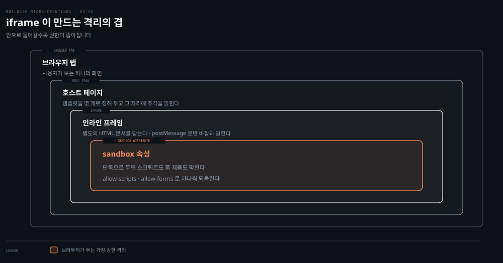
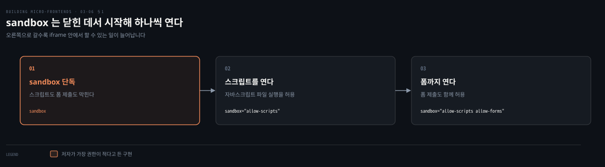
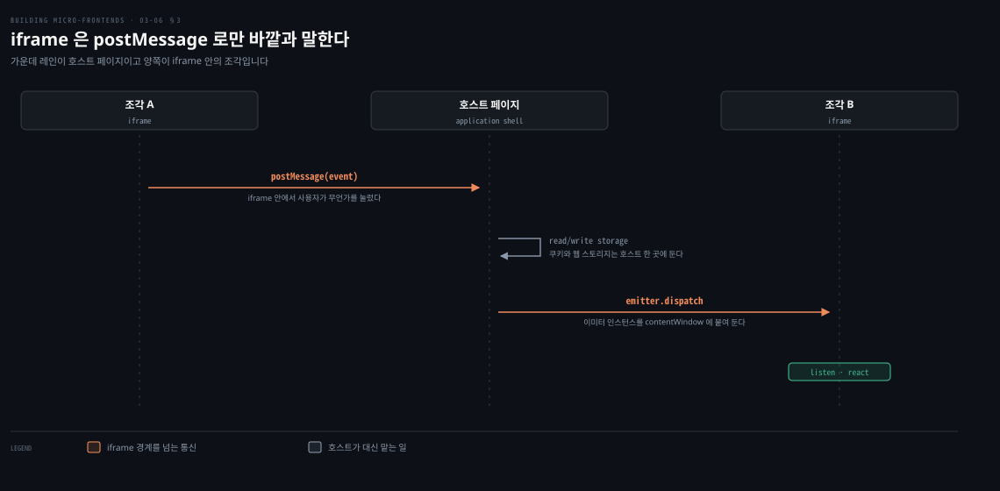
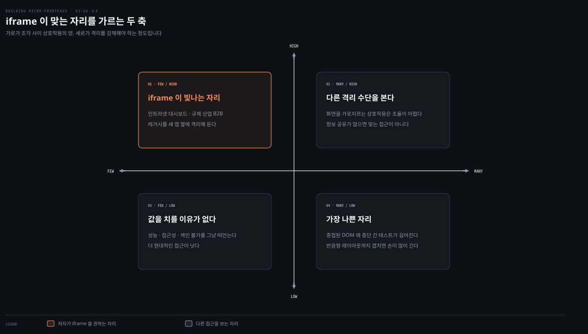

# iframe — 가장 강한 격리를 사는 값

---

> 앞 편의 Module Federation이 조합의 단순함을 팔았다면 iframe은 격리를 팝니다. 브라우저가 주는 가장 강한 격리를 받는 대신 성능과 접근성과 검색 노출을 내줍니다. 이 편은 그 거래가 성립하는 조건을 좁혀 가는 과정입니다.

## 핵심 요약

> 이 편이 매달린 하나의 생각은 **iframe이 파는 것은 다른 어떤 수단도 주지 못하는 격리이고, 그 값이 너무 비싸서 쓸 자리가 좁다**는 것입니다.

`sandbox` 속성만 붙이면 그 안에서 자바스크립트도 폼 제출도 돌지 않고, `allow-scripts`나 `allow-forms`로 필요한 것만 하나씩 되돌립니다. 바깥과 말하는 길은 `postMessage` 하나입니다. 발행 구독을 쓰려면 이벤트 이미터 인스턴스를 iframe의 `contentWindow`에 붙여 공유합니다. 저자의 모범 사례는 대부분 수를 줄이라는 쪽입니다. 템플릿을 정해 두고 한 페이지의 iframe 수를 줄이고 조각 사이 상호작용을 줄입니다.

맞는 자리는 좁습니다. 조각 사이 통신이 적고 캡슐화를 강제해야 하는 곳이며, 데스크톱과 B2B와 인트라넷, 그리고 레거시를 새 앱 옆에 격리하는 경우입니다. 점수표에서 성능이 2점으로 이 장에서 가장 낮습니다. 소비자 웹사이트에 저자가 이 접근을 강하게 말리는 이유가 그 한 칸에 있습니다.


## 학습 목표

이 내용을 읽고 나면:

1. `sandbox` 속성이 기본으로 무엇을 막고 무엇으로 되돌리는지 코드로 쓸 수 있습니다.
2. iframe 조각이 바깥과 통신하는 경로와 저장소를 어디에 둬야 하는지 설명할 수 있습니다.
3. 저자의 모범 사례가 왜 대부분 수를 줄이라는 쪽인지 이유를 댈 수 있습니다.
4. iframe이 맞는 자리와 맞지 않는 자리를 두 축으로 판별할 수 있습니다.
5. 성능이 2점인 근거로 저자가 무엇을 들었는지 말할 수 있습니다.

아래는 이 편이 다루는 격리를 겹으로 편 지도입니다. 안으로 들어갈수록 실행할 수 있는 것이 줄어듭니다.




## 1. 격리를 사면 무엇을 내는가

> iframe은 조각 이야기에서 가장 먼저 떠오르는 수단이 아닙니다. 그런데 다른 어떤 해법도 주지 못하는 것을 하나 줍니다.



### 풀려는 문제

앞 편까지 본 수단들은 모두 같은 문서 트리 안에서 조각을 다뤘습니다. 그러면 세 가지가 부딪힙니다. 라이브러리 버전이 겹치고 전역 변수가 겹치고 CSS가 서로를 덮어씁니다. 규약으로 막을 수는 있지만 규약은 사람이 지켜야 합니다.

조각을 나머지 애플리케이션과 완전히 분리된 독립 산출물로 표현하고 싶을 때, **iframe은 브라우저 안에서 가질 수 있는 가장 강한 격리 형태 가운데 하나입니다.**

### sandbox는 기본이 금지다

iframe은 웹페이지 안에서 다른 HTML 문서를 로드하는 인라인 프레임입니다. 그 안에서 무엇이 돌 수 있는지를 세밀하게 통제할 수 있습니다.

가장 권한이 적은 구현이 `sandbox` 속성입니다. 이것만 붙이면 어떤 자바스크립트 로직도 실행되지 않고 어떤 폼도 제출되지 않습니다.

```html
<iframe sandbox src="https://mfe.mywebsite.com/catalog"/>
```

필요한 기능은 값을 조합해 하나씩 되돌립니다. `allow-forms`는 폼 제출을, `allow-scripts`는 자바스크립트 파일 실행을 각각 허용합니다.

```html
<iframe sandbox="allow-scripts allow-forms"
        src="https://mfe.mywebsite.com/catalog"/>
```

### 읽어내기 — 격리의 방향이 반대다

앞의 문제에 답이 생깁니다. 다른 수단들은 기본이 허용이고 규약으로 막습니다. **`sandbox`는 기본이 금지이고 필요한 것만 명시로 엽니다.** 규약이 아니라 브라우저가 강제한다는 점에서 성질이 다릅니다.

이 성질 때문에 저자가 든 주 유스케이스가 금융 기관처럼 고도로 규제된 환경의 B2B 애플리케이션입니다. 인수 같은 이유로 기존 애플리케이션을 조각 아키텍처에 통합해야 할 때도 그렇습니다.

다만 저자가 곧바로 경계를 긋습니다. 소비자 웹사이트에는 이 접근을 강하게 말립니다. iframe은 성능에 나쁘고 CPU를 많이 쓰는데, 한 뷰에 여러 개를 쓰면 더 그렇습니다.


## 2. 조각과 호스트가 말하는 법

> 격리가 강할수록 통신 경로는 좁아집니다. iframe에서 그 경로는 하나뿐입니다.



### 풀려는 문제

샌드박스는 안에 있는 것이 바깥에 손대지 못하게 막습니다. 그런데 조각은 자기 안에서 일어난 일을 알려야 할 때가 있습니다. 사용자가 무언가를 눌렀고 다른 조각이 반응해야 하는 경우입니다.

### postMessage와 contentWindow

iframe은 `postMessage` 메서드를 쓰면 호스트 페이지와 통신할 수 있습니다. 조각은 자기 문맥 안에서 사용자 상호작용이 일어났음을 더 넓은 애플리케이션에 알리고, 애플리케이션은 그 이벤트를 다른 iframe과 공유하거나 호스트에 있는 UI를 바꾸는 활동을 시작합니다.

발행 구독 패턴을 iframe과 호스트 페이지 사이에 쓰려면 조건이 하나 붙습니다. 페이지의 주요 행위자들이 이벤트 이미터 인스턴스를 공유해야 합니다. 방법은 이미터를 만들어 **iframe의 `contentWindow` 객체에 붙이는 것**입니다. 그러면 그것을 듣고 있는 모든 조각에 `emit`이나 `dispatch` 메서드로 통신할 수 있습니다.

### 저장소는 호스트 한 곳에 둔다

데이터를 웹 스토리지나 쿠키에 저장할 때는 앱 셸의 것을 씁니다. 여러 iframe에 걸쳐 데이터를 꺼내려 할 때 생기는 문제를 피하기 위해서입니다.

저자가 여기에 단서를 답니다. 이 상황에서는 호스트 페이지와 iframe 안에 사는 각 조각 사이의 통신을 신중하게 구현하고 철저히 테스트해야 합니다. 통신 경로가 하나뿐이라는 것은, 그 하나가 잘못되면 대안이 없다는 뜻이기도 합니다.


## 3. 모범 사례는 수를 줄이라고 말한다

> 저자가 iframe에 붙인 모범 사례 여섯 가운데 넷이 무언가를 줄이라는 요구입니다.

### 풀려는 문제

수평 분할에서 iframe으로 조각을 조합하려 하면 격리가 준 이점이 개수와 함께 사라집니다. 한 뷰에 여러 iframe이 있으면 CPU를 많이 씁니다. 크기를 맞추는 일이 어려워지고 테스트도 길어집니다.

### 여섯 가지

| 규약 | 무엇을 얻는가 |
|---|---|
| iframe이 놓일 템플릿 목록을 정의한다 | 레이아웃 몇 개면 관리가 단순해집니다. 팀이 자기 조각 UI를 어떻게 구현할지 이해하게 되고 명확한 가드레일이 엣지 케이스를 줄입니다 |
| 한 페이지의 iframe 수를 줄인다 | iframe을 뷰에 넣는 데 드는 내재적 부담이 있어도 성능이 나아집니다 |
| 조각 사이 상호작용을 줄인다 | 상호작용이 지나치면 유지할 코드의 복잡도가 커집니다. 정보를 많이 공유해야 한다면 iframe이 맞는 접근이 아닐 수 있습니다 |
| 디자인 시스템은 빌드 시점에 공유한다 | 팀이 라이브러리 충돌 없이 격리해 만들 수 있는 대신, 일관된 UI를 만들려면 이 공유가 필요합니다 |
| 되도록 고정 크기를 고수한다 | 반응형 웹사이트에 iframe을 쓰는 일은 어렵습니다. iframe과 그 콘텐츠에 걸친 유동 레이아웃 처리가 복잡하기 때문입니다 |
| 저장소와 이벤트 이미터는 호스트에 둔다 | 여러 iframe에서 데이터를 꺼내려 할 때 생기는 문제를 피합니다 |

다섯째에 저자가 붙인 조건이 단호합니다. 고정 크기가 불가능하다면 이 장의 다른 아키텍처가 더 나을 수 있다는 것입니다.

### 개발자 경험은 갈린다

샌드박스 환경 덕분에 개발자의 삶이 쉬워지는 쪽도 있습니다. 조각 하나는 HTML 진입점과 거기서 로드되는 자바스크립트와 CSS로 표현되는데, SPA 같은 다른 프론트엔드 아키텍처에서 익숙하게 다루던 형태와 비슷합니다.

어려워지는 쪽은 종단 간 테스트입니다. 여러 iframe에 걸쳐 객체를 프로그램으로 가져오려면 객체 중첩 때문에 큰 노력이 듭니다. 이 난제는 뒤의 점수표에서 테스트성과 개발자 경험을 함께 끌어내립니다.


## 4. 어디에 쓰고 어디에 안 쓰나

> iframe은 모든 프로젝트의 해법이 아닙니다. 저자는 맞는 자리를 두 조건으로 좁힙니다.



### 풀려는 문제

격리가 강하다는 이유만으로 고르면 성능과 접근성과 검색 노출을 한꺼번에 잃습니다. 그러니 이 값을 치를 만한 조건이 무엇인지 먼저 정해야 합니다.

### 빛나는 조건 둘

저자가 iframe이 빛난다고 적은 조건이 둘입니다. **조각 사이에 통신이 많이 필요하지 않을 때, 그리고 조각마다 샌드박스로 캡슐화를 강제해야 할 때입니다.** 이때 샌드박스는 메모리를 풀어 주고 조각 사이의 의존성 충돌을 막아, 다른 구현이 지고 있던 복잡성 일부를 덜어 냅니다.

반대편에 단점이 셋입니다. 접근성과 성능과 크롤러의 색인 불가입니다. 그래서 최선의 유스케이스가 데스크톱과 B2B와 인트라넷 애플리케이션으로 좁혀집니다.

### 저자가 든 세 자리

많은 대형 조직이 인트라넷 애플리케이션에서 팀 사이의 강한 보안 경계로 iframe을 씁니다. 수십 개 팀이 같은 프로젝트에서 일하고 팀의 독립성을 강제하고 싶을 때, 추가 도구를 많이 만들지 않고도 코드와 의존성 충돌을 피하는 유효한 해법이 됩니다.

두 번째가 대시보드입니다. 여러 팀이 조각을 기여해 여러 지표와 데이터 포인트의 스냅샷으로 최종 뷰를 구성하는 경우입니다. iframe이 서로 다른 도메인을 격리하므로 팀들의 코드베이스가 충돌할 위험이 없습니다. `sandbox` 속성으로 iframe 안의 특정 기능을 막을 수도 있습니다.

세 번째가 레거시입니다. 활발히 개발되지 않고 지원 모드에 있는 애플리케이션을, 개발 중인 새 애플리케이션과 나란히 두고 둘 다 사용자에게 보여야 하는 경우입니다. 레거시를 iframe 안에 격리하면 새 애플리케이션을 오염시키지 않고 조각 아키텍처 옆에 살게 할 수 있습니다.

저자가 이 절을 닫는 문장이 짧습니다. 웹 애플리케이션이 이 유스케이스에 맞지 않는다면 다른 곳을 보고, 더 현대적인 접근으로 성능을 챙기라는 것입니다.


## 5. 여덟 축 점수

> 이 표에서 눈에 띄는 것은 높은 칸이 아니라 2점짜리 한 칸입니다.

### 풀려는 문제

앞 절까지가 조건을 좁히는 과정이었다면, 점수표는 그 좁힘의 근거를 축마다 나눠 보여 줍니다. 어느 축이 이 아키텍처를 탈락시키는지 알아야 대안을 고를 수 있습니다.

### 점수와 근거

| 아키텍처 특성 | 점수 | 저자가 붙인 근거 |
|---|---|---|
| 배포성 | 5 | 수직 분할과 거의 같습니다. 다른 점은 뷰마다 조각이 여럿이라 배포할 조각이 더 많다는 것뿐입니다 |
| 모듈성 | 3 | 뷰를 여러 조각으로 조직할 수 있어 받아들일 만한 수준입니다. 동시에 이 성질을 오용하지 않을 균형을 찾아야 합니다 |
| 단순성 | 3 | 한 조각을 맡은 팀에게는 어렵지 않습니다. 난제는 iframe 사이 통신과, 페이지가 리사이즈될 때 레이아웃을 깨지 않고 크기를 조율하는 일입니다 |
| 테스트성 | 3 | 수평 분할에서 설명한 것 외에 특별한 난제는 없습니다. 다만 뷰 안 iframe의 DOM 트리 구조 때문에 종단 간 테스트가 장황해집니다 |
| 성능 | 2 | 이 아키텍처의 가장 나쁜 특성입니다. iframe이 메모리 난제를 풀고 의존성 충돌을 막지만 공짜가 아닙니다 |
| 개발자 경험 | 3 | SPA와 비슷하게 파이프라인을 짜고 산출은 정적 파일입니다. 가장 어려운 부분은 여러 iframe에 걸친 DOM 복제 때문에 종단 간 테스트를 만드는 일입니다 |
| 확장성 | 5 | iframe 안에 서빙되는 콘텐츠는 CDN 수준에서 캐시가 잘 됩니다. 결국 CSS와 HTML과 자바스크립트 같은 정적 콘텐츠를 서빙하기 때문입니다 |
| 조율 | 3 | 샌드박스 덕에 코드 충돌은 걱정하지 않아도 됩니다. 다만 여러 iframe이 있을 때 화면을 가로지르는 상호작용은 이 아키텍처에 맞지 않습니다 |

> **노트의 읽기**: 저자는 성능 항목의 근거로 접근성과 검색 엔진 색인을 함께 듭니다. iframe이 스크린 리더에 친화적이지 않고 검색 엔진이 콘텐츠를 색인하지 못한다는 것입니다. 둘 다 성능이 아니라 다른 축의 문제이지만, 저자가 그 자리에 적었고 판정도 그 근거 위에서 내립니다. 둘 중 하나라도 프로젝트의 핵심 요구라면 다른 접근을 쓰라는 결론이 여기서 나옵니다.

### 읽어내기 — 배포성과 확장성이 5점인 것은 위로가 안 된다

높은 칸 둘은 정적 파일을 서빙한다는 사실에서 나옵니다. 다른 조각 아키텍처도 대부분 정적 파일을 서빙하므로, 이 둘로는 iframe을 고를 이유가 되지 않습니다.

**고를 이유가 되는 것은 표에 없는 칸입니다.** 브라우저가 강제하는 격리 자체이고, 그것이 필요 없는 프로젝트라면 성능 2점만 남습니다. 저자가 유스케이스를 그렇게 좁게 적은 이유가 이 비대칭에 있습니다.


## 적용 관점

> 아래는 백엔드 개발자가 이미 가진 판단 기준과 이 절을 잇는 노트의 읽기입니다. 책이 백엔드 독자를 향해 쓴 대목이 아닙니다.

`sandbox`가 기본 금지이고 필요한 것만 여는 구조는 보안 설계의 기본 자세와 같습니다. 허용 목록으로 입력을 검증하는 것, 서비스 계정에 최소 권한만 주는 것과 같은 자리에 있습니다. 다른 점은 강제 주체입니다. 애플리케이션 코드가 아니라 브라우저가 강제하므로, 조각 팀이 규약을 어겨도 뚫리지 않습니다.

통신 경로가 `postMessage` 하나로 좁혀진 상태는 프로세스 격리와 메시지 전달만 허용하는 모델과 닮았습니다. 공유 메모리를 못 쓰게 하고 큐만 열어 두는 설계에서 얻는 것과 잃는 것이 여기서도 그대로 나옵니다. 결합은 줄지만 상호작용이 많아지면 메시지 왕복이 병목이 됩니다. 저자가 상호작용이 많으면 iframe이 맞는 접근이 아닐 수 있다고 적은 근거를 그 비용으로 읽으면 정확합니다.

세션 저장소를 호스트 한 곳에 두라는 규약은 상태를 게이트웨이에 모으고 하위 서비스는 무상태로 두는 배치와 같습니다. 여러 곳에서 같은 상태를 읽으려다 접근 제약에 부딪히느니, 한 곳이 읽고 나머지에게 전달하는 편이 단순합니다.

레거시를 iframe에 가둬 새 시스템 옆에 두는 방식은 스트랭글러 무화과 패턴의 화면 판본입니다. 레거시를 한 번에 걷어내지 않고 경계를 세워 격리한 뒤, 새 기능부터 바깥에서 자라게 합니다. 백엔드에서 프록시가 하던 역할을 여기서는 호스트 페이지가 합니다.


## 면접 대비

Q: iframe의 `sandbox` 속성은 무엇을 하나요?

A: 속성만 붙이면 그 iframe 안에서 자바스크립트 실행과 폼 제출이 모두 막힙니다. 가장 권한이 적은 상태에서 시작해 `allow-scripts`나 `allow-forms` 같은 값을 조합해 필요한 기능만 되돌립니다. 규약이 아니라 브라우저가 강제하는 격리라는 점이 다른 수단과의 차이입니다.

Q: iframe 안의 조각이 다른 조각과 통신하려면 어떻게 하나요?

A: `postMessage`로 호스트 페이지에 알리고, 호스트가 그 이벤트를 다른 iframe과 공유하거나 자기 UI를 바꿉니다. 발행 구독을 쓰려면 이벤트 이미터 인스턴스를 만들어 iframe의 `contentWindow` 객체에 붙여 공유합니다. 웹 스토리지나 쿠키도 앱 셸의 것을 쓰는 편이 여러 iframe에서 데이터를 꺼내는 문제를 피합니다.

Q: iframe을 소비자 웹사이트에 쓰면 왜 안 되나요?

A: 성능이 나쁘고 CPU를 많이 씁니다. 한 뷰에 여러 개를 쓰면 더 그렇습니다. 스크린 리더에 친화적이지 않아 접근성이 떨어지고 검색 엔진은 안의 콘텐츠를 색인하지 못합니다. 그래서 저자는 데스크톱과 B2B와 인트라넷을 최선의 유스케이스로 좁힙니다.

Q: 그럼에도 iframe을 고를 만한 상황은 언제인가요?

A: 조각 사이 통신이 적고 캡슐화를 강제해야 할 때입니다. 수십 팀이 한 프로젝트에서 일하는 인트라넷, 여러 팀이 지표를 기여하는 대시보드, 그리고 지원 모드의 레거시를 새 애플리케이션 옆에 격리해야 하는 경우가 저자가 든 셋입니다.

### 요약 세 문장

1. iframe은 브라우저가 강제하는 가장 강한 격리를 주고 성능과 접근성과 색인을 대가로 받습니다.
2. 통신은 `postMessage` 하나로 좁혀지므로 저장소와 이벤트 이미터를 호스트 한 곳에 모으고 상호작용 자체를 줄여야 합니다.
3. 점수표에서 높은 칸 둘은 다른 아키텍처도 가지는 것이고, 고를 이유가 되는 격리는 표에 없는 칸입니다.


## 핵심 개념 체크리스트

- [ ] `sandbox` 단독과 `allow-scripts allow-forms`의 차이를 코드로 쓸 수 있는가?
- [ ] iframe이 바깥과 통신하는 경로와 이벤트 이미터를 붙이는 자리를 말할 수 있는가?
- [ ] 저자의 모범 사례 여섯을 절반 이상 재현할 수 있는가?
- [ ] iframe이 빛나는 조건 둘과 단점 셋을 짝지어 말할 수 있는가?
- [ ] 성능 2점의 근거로 저자가 든 것을 댈 수 있는가?
- [ ] 배포성과 확장성이 5점인 것이 선택 근거가 못 되는 이유를 설명할 수 있는가?


## 관련 문서

- [Module Federation — 호스트와 리모트로 잇는다](03-05.Module%20Federation%20—%20호스트와%20리모트로%20잇는다.md) — 격리 대신 조합의 단순함을 파는 앞 도구
- [수평 분할 — 한 화면을 여럿이 나눌 때의 값](03-04.수평%20분할%20—%20한%20화면을%20여럿이%20나눌%20때의%20값.md) — 이 도구가 놓이는 규약과 멀티 프레임워크 격리 수단 넷
- [프레임워크를 실제 선택에 대다](03-01.프레임워크를%20실제%20선택에%20대다.md) — 이 편이 쓰는 여덟 축의 정의
- [Building Micro-Frontends 정독 인덱스](README.md) — 다음 편인 웹 컴포넌트의 진행 상태는 인덱스의 노트 표에서 봅니다


## 참고 자료

- 《Building Micro-Frontends, Second Edition》(Luca Mezzalira, O'Reilly, 2026) ISBN 978-1-098-17078-3
  - 다룬 범위: Iframes · Best Practices and Drawbacks · Developer Experience
  - 이어서: Use Cases · Architecture Characteristics(Table 3-3)
- [MDN — iframe sandbox 속성](https://developer.mozilla.org/en-US/docs/Web/HTML/Reference/Elements/iframe#sandbox) — 저자가 예로 든 값들의 전체 목록
