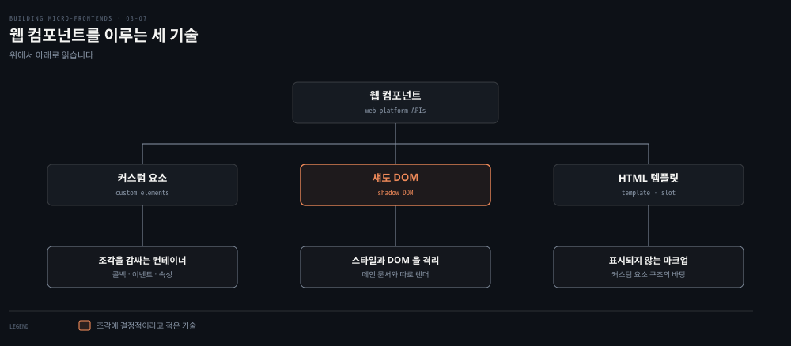
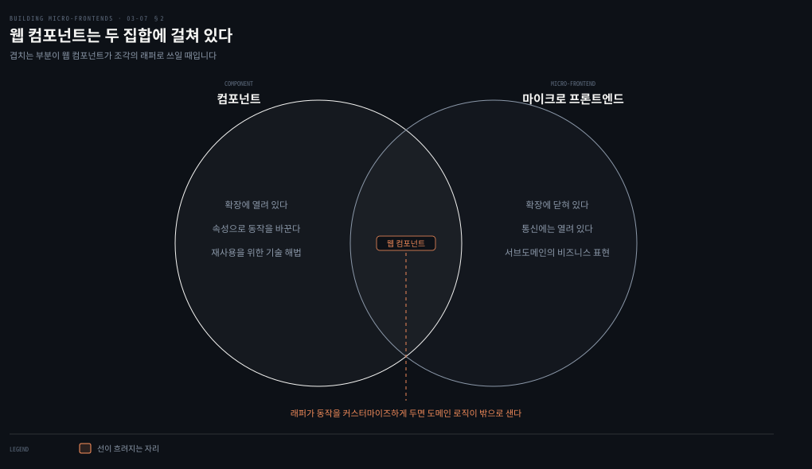
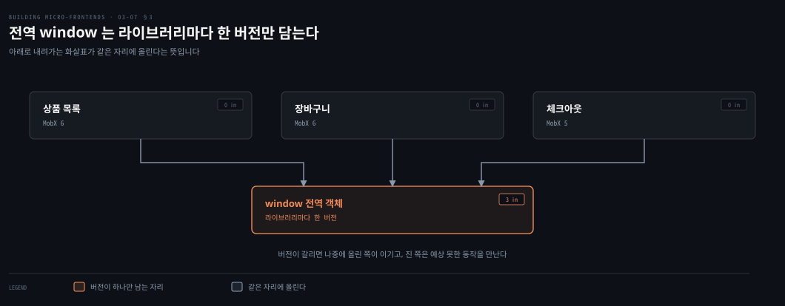
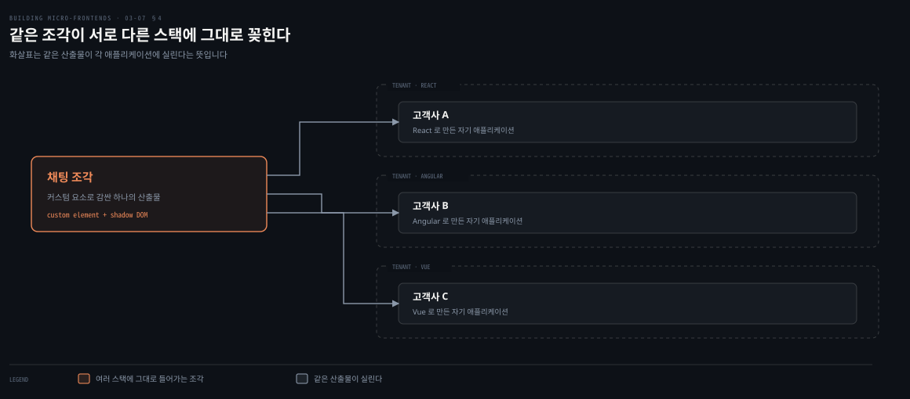
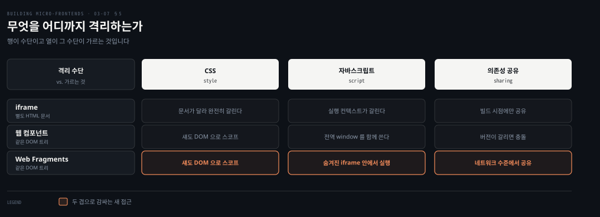

# 웹 컴포넌트와 Web Fragments — 표준으로 감싼다

---

> iframe이 문서를 갈라서 격리를 얻었다면 웹 컴포넌트는 같은 문서 안에서 표준으로 격리를 얻습니다. 대신 격리가 스타일까지만 미쳐서, 의존성은 공유하지 못하고 합의로만 맞춥니다. 이 편은 그 절반의 격리가 어디까지 통하는지 보고, 나머지 절반을 숨겨진 iframe으로 메운 새 접근으로 닫습니다.

## 핵심 요약

> 이 편이 매달린 하나의 생각은 **웹 컴포넌트가 주는 격리는 웹 표준이라 어디서나 통하지만 스타일과 DOM까지이며, 그 경계 밖에 남은 문제가 도메인 로직 누출과 의존성 공유다**라는 것입니다.

세 기술 가운데 조각에 결정적인 것은 커스텀 요소와 섀도 DOM입니다. 앞이 조각을 감싸는 컨테이너이고 뒤가 스타일 격리를 맡습니다. 래퍼가 동작을 커스터마이즈하게 두면 도메인 로직이 밖으로 샙니다. 저자의 기준은 하나입니다. 컴포넌트는 확장에 열려 있고 조각은 확장에 닫혀 있되 통신에 열려 있어야 합니다.

격리된 성질 탓에 내부 라이브러리를 서로 나누지 못하므로 초점이 공유 라이브러리 제공에서 어떤 라이브러리를 쓸지 합의하는 쪽으로 옮겨 갑니다. 맞는 자리는 멀티테넌트입니다. 고객마다 프론트엔드 스택이 다른 곳에서 같은 조각을 그대로 꽂을 수 있습니다. 마지막이 Web Fragments입니다. CSS는 섀도 DOM으로 자바스크립트는 숨겨진 iframe으로 감싸 브라우저 안에 컨테이너를 만듭니다.

## 학습 목표

이 내용을 읽고 나면:

1. 웹 컴포넌트 세 기술과 그 가운데 조각에 결정적인 둘을 구분할 수 있습니다.
2. 조각을 웹 컴포넌트로 감쌀 때 도메인 로직이 새는 경로를 설명할 수 있습니다.
3. 의존성 공유가 왜 어렵고 그 대신 무엇을 해야 하는지 말할 수 있습니다.
4. 멀티테넌트에서 이 접근이 유리한 이유를 댈 수 있습니다.
5. Web Fragments가 격리를 두 겹으로 나눠 얻는 것과 내주는 것을 말할 수 있습니다.

아래는 이 편이 다루는 표준을 뿌리부터 편 지도입니다. 셋 가운데 둘이 조각 아키텍처를 떠받칩니다.

## 1. 왜 웹 표준으로 감싸는가

> 웹 컴포넌트는 조각을 떠올릴 때 가장 먼저 나오는 선택지가 아닙니다. 그런데 조각 아키텍처를 짓기에 맞는 성질을 몇 가지 갖고 있습니다.

### 풀려는 문제

앞 편의 iframe은 격리를 확실히 주지만 문서 자체를 갈라서 성능과 접근성과 색인을 잃었습니다. 그렇다고 같은 문서 안에 두면 CSS가 새고 라이브러리가 부딪힙니다.

가운데가 필요합니다. 같은 문서 트리 안에 있으면서 스타일은 새지 않는 무언가입니다.

### 웹 컴포넌트가 가진 것

웹 컴포넌트는 커스텀하고 재사용 가능하며 캡슐화된 HTML 태그를 만들게 해 주는 웹 플랫폼 API 집합입니다. 저자가 조각에 맞다고 든 성질이 셋입니다.

- 스타일을 웹 컴포넌트 안에 캡슐화하므로 메인 애플리케이션으로 새지 않습니다.
- React와 Angular와 Vue를 비롯한 주요 UI 프레임워크가 모두 웹 컴포넌트를 만들어 낼 수 있습니다.
- 웹 컴포넌트 생성을 단순하게 해 주는 오픈소스 라이브러리가 늘고 있습니다. 웹 컴포넌트로 컴파일되는 Svelte와 Google의 LitElement가 그 예입니다.

그래서 웹 컴포넌트는 조각 프로젝트에서 공유 라이브러리를 만드는 도구로 훌륭합니다. 팀들이 같은 UI 프레임워크를 쓰든 다른 것을 쓰든 그렇습니다. 조각 아키텍처에서 이것이 두 자리를 차지합니다. **조각 사이에 컴포넌트를 공유하는 자리와, 조각 자체를 감싸는 자리입니다.**

### 세 기술과 그중 둘

웹 컴포넌트를 이루는 주요 기술은 셋입니다. 함께 쓰면 코드 충돌 걱정 없이 재사용되는 커스텀 요소를 만듭니다.

| 기술 | 무엇인가 |
|---|---|
| 커스텀 요소 | HTML 컴포넌트의 확장이며 조각의 컨테이너 역할을 합니다. 콜백이나 이벤트로 바깥과 상호작용하고 노출된 속성으로 설정됩니다 |
| 섀도 DOM | 캡슐화된 섀도 DOM 트리를 요소에 붙이는 자바스크립트 API 집합입니다. 메인 문서 DOM과 따로 렌더되며, 강력한 캡슐화 메커니즘이라 조각에 결정적입니다 |
| HTML 템플릿 | `<template>`과 `<slot>` 요소입니다. 렌더된 페이지에 표시되지 않는 마크업 템플릿을 쓰고 커스텀 요소 구조의 바탕으로 재사용합니다 |

셋 가운데 조각 아키텍처에 특히 유용한 것을 저자가 둘로 좁힙니다. 커스텀 요소와 섀도 DOM입니다. 커스텀 요소가 조각의 래퍼가 되고 섀도 DOM이 스타일 격리와 DOM 캡슐화를 맡습니다. 이 캡슐화 덕분에 각 조각이 자기 웹 컴포넌트를 품어도 전역 CSS나 자바스크립트가 일으키는 스타일 충돌과 예상 못한 동작을 걱정하지 않게 됩니다.

### 실제로 쓰는 곳

저자가 이름을 든 프로젝트가 둘입니다. Picard.js는 웹 컴포넌트를 조각에 활용하며 브라우저 안에서도, Node.js나 Deno를 쓰는 백엔드에서도 동작합니다. Piral과 Module Federation과 Native Federation 같은 기술과 호환되며 조각 오케스트레이션에 도움이 됩니다.

OpenMFE는 웹 표준에 기반한 또 다른 오픈소스 프레임워크로, 여행사 TUI에서 직접 나왔습니다. 여러 팀이 웹 애플리케이션의 특정 기능을 전담하는 수평 분할 웹사이트를 이 방식으로 지었습니다.

## 2. 래퍼로 쓰면 선이 흐려진다

> 웹 컴포넌트로 조각을 감쌀 때 저자가 가장 먼저 경고하는 것은 기술이 아니라 경계입니다.

### 풀려는 문제

같은 기술로 컴포넌트 라이브러리도 만들고 조각의 래퍼도 만들 수 있다는 것이 편리함이면서 함정입니다. 둘의 구분이 코드에서 사라지기 때문입니다.

### 도메인 로직이 새는 경로

조각을 웹 컴포넌트로 감쌀 때 피해야 하는 것이 도메인 로직 누출입니다.

경로가 구체적입니다. **웹 컴포넌트로 감싼 컨테이너가 자기 동작을 커스터마이즈하도록 허용하는 순간, 도메인 로직을 바깥에 노출하게 됩니다.** 컨테이너가 특정 API 계약과 속성으로 어떻게 상호작용해야 하는지를 알게 되기 때문입니다.

그래서 웹 컴포넌트로 감싼 조각과 나머지 뷰 사이의 통신은 결합 없이 통일된 방식으로 일어나야 합니다.

### 저자의 기준 한 줄

그러지 않으면 컴포넌트와 조각 사이의 선이 흐려집니다. 저자가 그 선을 한 문장으로 긋습니다.

> 컴포넌트는 확장에 열려 있어야 하고, 마이크로 프론트엔드는 확장에 닫혀 있되 통신에는 열려 있어야 합니다.

2장에서 컴포넌트를 재사용을 위한 기술적 해법으로, 조각을 서브도메인의 비즈니스 표현으로 갈랐던 구분이 여기서 실행 규칙으로 바뀝니다. 속성을 늘려 동작을 바꾸게 할수록 조각은 컴포넌트에 가까워집니다.

## 3. 의존성은 공유가 아니라 합의로

> 격리가 준 이점이 여기서 그대로 제약이 됩니다. 나눌 수 없는 것을 나누려 하면 문제가 생깁니다.

### 풀려는 문제

웹 컴포넌트는 로직 캡슐화와 강한 경계에는 훌륭하지만 공유 의존성에서는 난제를 냅니다. 격리된 성질 때문에 **내부 라이브러리를 서로 다른 웹 컴포넌트 사이에 쉽게 공유할 수 없습니다.**

이 한계가 초점을 옮깁니다. 중앙에서 의존성 세트를 제공하는 일에서, 프로젝트에서 어떤 라이브러리를 쓸지 조율하는 일로 옮겨 갑니다. 팀들이 라이브러리 선택과 사용에 관한 느슨한 가이드라인을 함께 세워야 한다는 뜻입니다.

### 전역 객체에 올리면

의존성을 공유하는 접근이 하나 있기는 합니다. 공유 라이브러리를 전역 `window` 객체에 추가하는 것입니다.

이 방법은 자기 나름의 난제를 데려옵니다. 같은 의존성의 서로 다른 버전을 다룰 때 특히 그렇습니다. 조각들이 공유 라이브러리에 접근할 수는 있지만, 서로 다른 버전을 요구하기 시작하면 문제가 됩니다. **전역 객체는 라이브러리마다 한 버전만 담을 수 있기 때문입니다.** 충돌과 예상 못한 동작이 여기서 나옵니다.

### 저자의 이커머스 예

웹 컴포넌트로 구현한 이커머스 플랫폼을 생각해 봅니다. 상품 목록과 장바구니와 체크아웃이 각각 별개 조각입니다.

각 팀이 상태 관리와 HTTP 요청과 UI 유틸리티에 쓸 라이브러리를 독립적으로 정해야 합니다. 공통 Redux 스토어나 Axios 인스턴스를 공유하는 대신, 비슷한 라이브러리를 쓰기로 합의합니다. 상태 관리에 MobX를, HTTP에 Fetch API를 쓰는 식입니다. **구현을 직접 공유하지는 않습니다.**

이 방식은 각 조각의 독립성을 지키면서 플랫폼 전반의 일관성을 확보합니다. 난제는 그 독립성과, 응집된 사용자 경험 및 효율적인 개발 관행 사이의 균형을 잡는 일입니다.

## 4. 어디에 쓰나

> 웹 컴포넌트가 다른 수단보다 확실히 나은 자리가 하나 있습니다. 스택이 제각각인 곳입니다.

### 풀려는 문제

조각을 여러 애플리케이션에 재사용하려 할 때, 받는 쪽 프레임워크가 다르면 대개 다시 만들어야 합니다. 멀티테넌트 프로젝트에서 이 일이 자주 벌어집니다.

### 멀티테넌트

웹 컴포넌트를 조각 아키텍처에 쓰는 것은 멀티테넌트 환경을 지원해야 할 때 좋은 선택입니다. 주요 프레임워크와 폭넓게 호환되므로, 프론트엔드 스택이 같든 다르든 여러 프로젝트에서 쓰기에 적합합니다. 멀티테넌트 프로젝트에서는 스택이 다른 경우가 흔합니다.

이런 프로젝트에서 조각은 같은 애플리케이션의 여러 버전에, 또는 아예 다른 애플리케이션들에 통합돼야 합니다. 웹 컴포넌트가 그 일을 단순하고 효과적으로 만듭니다.

저자가 든 예가 선명합니다. 고객 지원 솔루션을 파는 조직에서 **채팅 조각이 고객이 쓰는 어떤 프론트엔드 기술과도 나란히 동작해야 하는 경우**입니다.

### 디자인 시스템

공유 라이브러리에서도 중요한 역할을 합니다. 디자인 시스템에 웹 표준을 쓰면 매번 처음부터 시작하지 않고 애플리케이션을 진화시킬 수 있습니다. 기술 팀이나 비즈니스가 어느 방향으로 가든 작업의 일부가 재사용되기 때문입니다. 저자는 이것을 현명한 투자라고 부릅니다.

## 5. 여덟 축 점수

> 이 표에는 2점도 5점도 거의 없습니다. 고르게 4점이라는 사실 자체가 이 접근의 성격입니다.

### 풀려는 문제

앞 절들이 이 접근의 강점과 제약을 따로 봤다면, 점수표는 그것들이 축마다 어떻게 상쇄되는지 보여 줍니다.

### 점수와 근거

| 아키텍처 특성 | 점수 | 저자가 붙인 근거 |
|---|---|---|
| 배포성 | 4 | 런타임 로드는 CDN만 있으면 되고 컴파일 시점 통합도 쉽습니다. 서버 사이드 렌더도 기술적으로 가능하지만 개발자 경험이 React 같은 프레임워크만큼 매끄럽지 않습니다 |
| 모듈성 | 4 | 애플리케이션을 잘 캡슐화된 서브도메인으로 분해할 수 있고 웹 표준이라 여러 상황에 쓰입니다. 위험은 새 개발자가 컴포넌트와 조각을 혼동해 조각이 증식하는 것입니다 |
| 단순성 | 4 | 프론트엔드에 익숙하면 어렵지 않습니다. 주 난제는 너무 세밀하게 쪼개지 않는 일입니다 |
| 테스트성 | 4 | 여러 테스트 전략을 쓰는 데 큰 난제는 없지만 API에 익숙해야 합니다. 웹 컴포넌트 API가 UI 프레임워크의 것과 달라 쓰던 방식이 그대로 통하지 않습니다 |
| 성능 | 4 | HTML 컴포넌트를 확장하는 방식이라 외부 라이브러리 코드로 지나치게 무거워지지 않습니다. 클라이언트 사이드 렌더링에 최선의 해법 가운데 하나입니다 |
| 개발자 경험 | 4 | 쓰던 프레임워크와 크게 다르지 않습니다. 워크플로 단순화를 위해 다른 프레임워크를 배워야 할 수 있지만 개발 수명주기와 문법에 큰 차이는 없습니다 |
| 확장성 | 5 | 컴파일 시점이든 런타임이든 정적 파일을 전달하므로, 단순한 인프라로 수백만 고객을 감당합니다 |
| 조율 | 3 | 주 난제는 조각의 입도를 제대로 잡는 일입니다. 무엇이 컴포넌트이고 무엇이 조각인지 식별할 때 강한 규율이 필요합니다 |

### 읽어내기 — 나노 프론트엔드라는 말

모듈성 항목에 저자가 붙인 표현이 남습니다. 웹 컴포넌트를 조각 래퍼로 쓰면 새로 합류한 개발자가 혼란을 겪고, 뷰 안에 "조각"이 증식하는 결과가 나온다는 것입니다. 그러고는 덧붙입니다. **어쩌면 그것들은 나노 프론트엔드라 불러야 할지도 모른다고 말입니다.**

이 농담이 조율 3점의 이유이기도 합니다. 앞 편들에서 본 과분할의 신호가 여기서는 기술 자체의 성질 때문에 더 쉽게 켜집니다. 웹 컴포넌트로 컴포넌트 라이브러리도 만들 수 있으니, 같은 문법으로 만든 것이 조각인지 컴포넌트인지 코드만 봐서는 갈리지 않기 때문입니다. 저자의 처방은 기술이 아니라 판단입니다. **애플리케이션의 비즈니스 측면에 집중하면 둘이 올바로 갈립니다.**

## 6. Web Fragments — 두 겹으로 감싼다

> 웹 컴포넌트의 격리는 스타일까지였습니다. 나머지 절반을 채우려는 시도가 2025년에 나왔습니다.

### 풀려는 문제

여기까지 본 접근들은 모두 런타임 의존성 공유에 기대고 있었습니다. 그래서 같은 라이브러리의 여러 버전이 한 페이지에 있으면 조율이 필요했습니다.

Web Fragments는 다른 데서 출발합니다. **격리와 캡슐화가 운명 공유와 그에 따르는 조율 부담을 없앨 수 있다**는 생각입니다.

### 누가 만들었나

CloudFlare가 2025년에 제안한 접근입니다. 저자는 아직 직접 다뤄 보지 않았다고 밝히면서도, 세계의 주요 조각 프로젝트를 모으는 이 책에 언급할 가치가 있다고 적습니다.

내력은 이렇습니다. Igor Minar가 2021년에 착안했고 Natalia Venditto와 협업해 개발했습니다. 2024년부터 CloudFlare가 후원하고 직접 쓰는 벤더 중립 오픈소스 프로젝트이며, Microsoft와 Netlify 등이 기여합니다. 강한 격리와 점진적 현대화에 초점을 둔 새로운 조합 기법입니다.

### 두 겹의 격리

기술적으로 각 fragment는 호스트 애플리케이션이 소유하는 같은 DOM 트리 안에 렌더됩니다. 그런데 두 겹의 격리로 감싸입니다.

- CSS는 섀도 DOM으로 스코프됩니다.
- 자바스크립트는 사설 실행 컨텍스트를 제공하는 숨겨진 iframe 안에서 돕니다.

저자가 이것을 브라우저 안의 Docker 같은 컨테이너에 비유합니다. fragment들은 스타일이나 전역 변수를 서로에게 흘리지 못하고 디버깅이 단순해지지만, 공유된 내비게이션과 히스토리를 가진 하나의 애플리케이션으로 남습니다.

그 결과로 React 같은 프레임워크의 여러 버전이 같은 페이지에 충돌 없이 공존합니다. 트레이드오프가 단순합니다. **중복이 페이로드 크기를 늘리지만, 독립적인 수명주기가 주는 조직적 이점이 몇 킬로바이트의 비용을 넘어서는 경우가 많다는 것입니다.** 게다가 네트워크 수준의 의존성 공유도 지원해서, 격리 보장을 희생하지 않고 그 부담을 줄입니다.

### 무엇에 쓰고 있나

CloudFlare는 자기 대형 미션 크리티컬 대시보드를 점진적으로 현대화하는 데 이것을 씁니다. 파괴적인 재작성 대신 한 섹션씩 마이그레이션하면서 응집된 사용자 경험을 유지합니다.

같은 접근이 특이한 통합도 가능하게 합니다. 완전히 분리된 두 SPA를 하나의 인터페이스로 매끄럽게 조합하는 일, 기술 스택과 무관하게 SPA와 풀스택 애플리케이션을 섞는 일, 기술 스택이나 호스팅 제공자를 점진적으로 바꾸는 일입니다.

프론트엔드 확장의 복잡성에 부딪힌 기업에게 Web Fragments는 수평 분할과 수직 분할 전략을 모두 제공합니다. 페이지 수준에서도 섹션 수준에서도 모듈화할 수 있습니다. 마이그레이션 위험이 줄고, 릴리스 주기를 강하게 묶지 않은 채로 더 빨리 움직이게 됩니다.

## 적용 관점

> 아래는 백엔드 개발자가 이미 가진 판단 기준과 이 절을 잇는 노트의 읽기입니다. 책이 백엔드 독자를 향해 쓴 대목이 아닙니다.

"컴포넌트는 확장에 열려 있고 조각은 확장에 닫혀 있되 통신에 열려 있다"는 기준은 라이브러리와 서비스를 가르는 기준과 같습니다. 라이브러리는 확장 지점을 열어 두고 쓰는 쪽이 채우게 합니다. 서비스는 내부를 잠그고 계약만 공개합니다. 조각의 래퍼에 속성을 늘리는 일은 서비스에 내부 동작을 바꾸는 파라미터를 늘리는 일과 같고, 결과도 같습니다. 호출하는 쪽이 내부를 알게 됩니다.

전역 `window`에 라이브러리를 올리는 방식은 애플리케이션 서버 공용 라이브러리 디렉터리에 jar를 올려 두던 배치와 닮았습니다. 한 자리에 한 버전만 놓이므로, 다른 버전이 필요한 모듈이 생기는 순간 누군가 양보해야 합니다. 이 문제를 클래스로더 격리로 풀었던 것처럼, 프론트엔드에서는 컨테이너 스코프나 섀도 DOM이나 숨겨진 iframe이 그 자리를 맡습니다.

저자가 "공유 라이브러리 제공에서 라이브러리 선택 조율로 초점이 옮겨 간다"고 적은 대목은 실무에서 익숙한 전환입니다. 공용 모듈을 만들어 강제하는 대신, 권장 스택을 문서로 정하고 각 팀이 자기 저장소에서 그것을 쓰게 하는 방식입니다. 강제력은 약해지지만 배포 결합이 사라집니다. 무엇을 살 것인지의 문제입니다.

Web Fragments가 자바스크립트를 숨겨진 iframe 안에서 돌린다는 대목은 프로세스 격리를 컨테이너로 얻는 방식과 정확히 같은 자리에 있습니다. 저자 스스로 브라우저 안의 Docker에 비유합니다. 중복 페이로드를 감수하고 독립성을 사는 계산도, 컨테이너마다 런타임을 중복해 넣고 배포 독립성을 사는 계산과 같습니다.

## 면접 대비

Q: 웹 컴포넌트의 세 기술 가운데 마이크로 프론트엔드에 중요한 것은 무엇인가요?

A: 커스텀 요소와 섀도 DOM입니다. 커스텀 요소가 조각을 감싸는 컨테이너 역할을 하고 콜백이나 이벤트로 바깥과 상호작용합니다. 섀도 DOM은 메인 문서와 따로 렌더되는 트리를 만들어 스타일 격리와 DOM 캡슐화를 맡습니다. HTML 템플릿은 커스텀 요소 구조의 바탕이지만 조각 아키텍처에서의 비중은 앞의 둘보다 작습니다.

Q: 조각을 웹 컴포넌트로 감쌀 때 무엇을 조심해야 하나요?

A: 도메인 로직 누출입니다. 래퍼가 자기 동작을 커스터마이즈하도록 허용하면, 컨테이너가 특정 API 계약과 속성으로 어떻게 상호작용할지를 알게 되어 도메인 로직이 밖으로 노출됩니다. 기준은 컴포넌트는 확장에 열려 있고 조각은 확장에 닫혀 있되 통신에 열려 있어야 한다는 것입니다.

Q: 웹 컴포넌트 사이에 라이브러리를 공유하려면 어떻게 하나요?

A: 쉽게 공유되지 않는 것이 이 접근의 제약입니다. 전역 `window` 객체에 올리는 방법이 있지만 라이브러리마다 한 버전만 담기므로 버전이 갈리면 충돌합니다. 그래서 저자는 구현을 공유하는 대신 어떤 라이브러리를 쓸지 팀들이 합의하라고 말합니다. 상태 관리에 MobX, HTTP에 Fetch API를 쓰기로 정하되 인스턴스를 공유하지는 않는 식입니다.

Q: Web Fragments는 기존 접근과 무엇이 다른가요?

A: 런타임 의존성 공유에 기대지 않고 격리로 조율 부담 자체를 없애려 합니다. 각 fragment는 호스트의 DOM 트리 안에 렌더되지만 CSS는 섀도 DOM으로, 자바스크립트는 숨겨진 iframe으로 감싸입니다. 그래서 React 여러 버전이 한 페이지에 공존합니다. 대가는 중복으로 늘어나는 페이로드이고, 네트워크 수준 공유로 그 부담을 일부 줄입니다.

### 요약 세 문장

1. 웹 컴포넌트는 같은 문서 안에서 웹 표준으로 스타일과 DOM을 격리하고, 그 덕에 스택이 다른 여러 애플리케이션에 같은 조각을 그대로 꽂습니다.
2. 격리의 대가로 의존성은 공유되지 않으므로, 초점이 공유 라이브러리 제공에서 어떤 라이브러리를 쓸지 합의하는 쪽으로 옮겨 갑니다.
3. Web Fragments는 CSS와 자바스크립트를 각각 섀도 DOM과 숨겨진 iframe으로 감싸 브라우저 안에 컨테이너를 만들고, 중복 페이로드를 내주고 독립적 수명주기를 삽니다.

## 핵심 개념 체크리스트

- [ ] 웹 컴포넌트 세 기술을 각각 한 줄로 설명할 수 있는가?
- [ ] 커스텀 요소와 섀도 DOM이 조각에서 맡는 역할을 나눠 말할 수 있는가?
- [ ] 도메인 로직이 래퍼 밖으로 새는 경로를 재현할 수 있는가?
- [ ] 전역 `window` 공유가 실패하는 조건을 댈 수 있는가?
- [ ] 멀티테넌트에서 이 접근이 유리한 이유를 예로 말할 수 있는가?
- [ ] Web Fragments의 두 겹 격리와 그 트레이드오프를 설명할 수 있는가?

## 관련 문서

- [iframe — 가장 강한 격리를 사는 값](03-06.iframe%20—%20가장%20강한%20격리를%20사는%20값.md) — Web Fragments가 자바스크립트 격리에 다시 끌어다 쓰는 수단
- [수평 분할 — 한 화면을 여럿이 나눌 때의 값](03-04.수평%20분할%20—%20한%20화면을%20여럿이%20나눌%20때의%20값.md) — 멀티 프레임워크 격리 수단 넷에 웹 컴포넌트가 들어 있던 자리
- [경계를 어디에 긋고 어떻게 확인하는가](02-02.경계를%20어디에%20긋고%20어떻게%20확인하는가.md) — 컴포넌트와 조각을 가르는 기준의 출처
- [Building Micro-Frontends 정독 인덱스](README.md) — 다음 편인 서버 사이드의 진행 상태는 인덱스의 노트 표에서 봅니다

## 참고 자료

- 《Building Micro-Frontends, Second Edition》(Luca Mezzalira, O'Reilly, 2026) ISBN 978-1-098-17078-3
  - 다룬 범위: Web Components · Web Components Technologies · Dependency Management
  - 이어서: Use Cases · Architecture Characteristics(Table 3-4) · Web Fragments
- [Web Fragments](https://web-fragments.dev/) — 저자가 2025년의 새 접근으로 소개한 프로젝트
- [Lit](https://lit.dev/) — 저자가 이름을 든 LitElement의 현재 프로젝트
