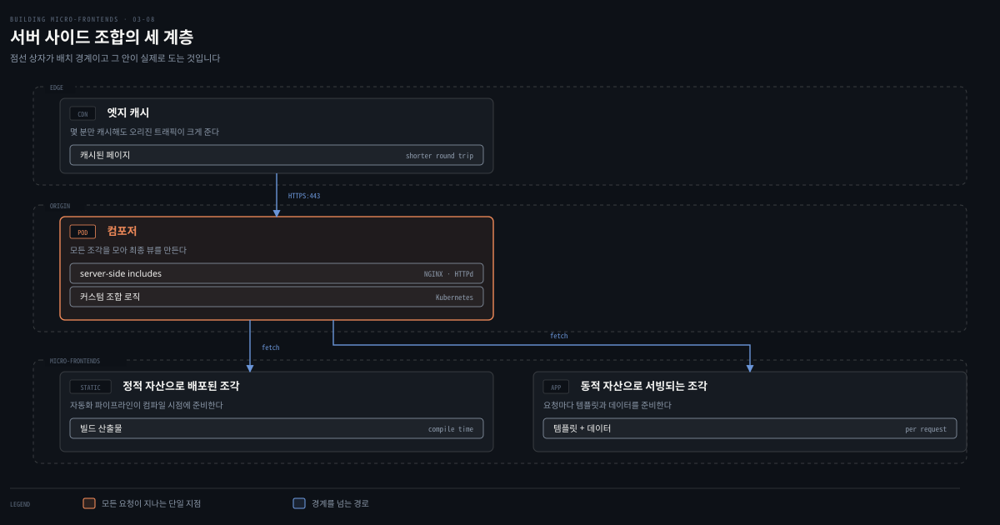
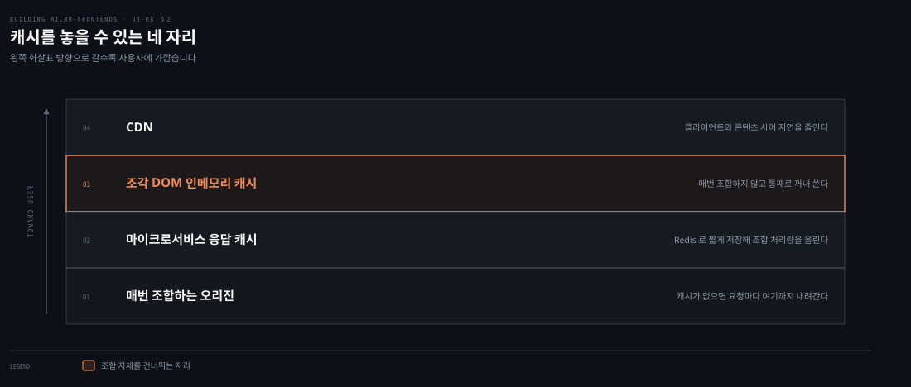
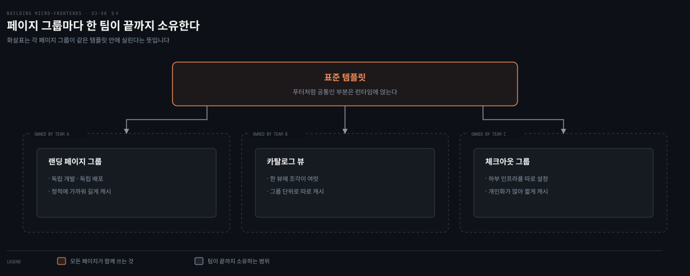
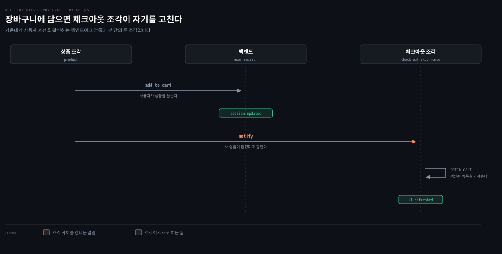

# 서버 사이드 — 조합을 오리진으로 옮긴다

---

> 여기까지의 도구들은 모두 브라우저에서 조각을 합쳤습니다. 조합을 서버로 옮기면 검색 엔진이 완성된 HTML을 보게 되고 최종 산출물을 바이트 단위까지 통제할 수 있습니다. 대신 프론트엔드 팀이 인프라를 함께 져야 합니다. 이 편은 그 교환의 양쪽을 봅니다.

## 핵심 요약

> 이 편 전체가 매달린 하나의 생각은 **서버 사이드 조합이 가장 강력한 만큼 가장 많은 것을 요구하며, 요구하는 쪽은 코드가 아니라 인프라와 조직이다**라는 것입니다.
>
> 이 방식을 고르는 이유는 대개 SEO입니다. 페이지가 자바스크립트 없이 완전히 렌더되고 로드가 빨라지기 때문입니다.
>
> 구조는 세 계층입니다. 조각과 컴포저와 CDN입니다. 컴포저는 NGINX의 server-side includes일 수도, Kubernetes 위의 커스텀 로직일 수도 있습니다.
>
> 성능의 핵심은 캐시를 어디에 두느냐입니다. CDN, 인메모리에 저장한 조각 DOM, 마이크로서비스 응답 캐시가 층으로 쌓입니다.
>
> 최근 구조는 페이지나 페이지 그룹 단위로 나눠 표준 템플릿에 얹는 쪽입니다. Next.js의 멀티 존이 그 예이고 이커머스에 잘 맞습니다.
>
> 점수표에서 모듈성과 성능이 5점이고 단순성과 확장성과 개발자 경험이 3점입니다. 강력함의 값이 그 세 칸에 적혀 있습니다.

## 학습 목표

이 내용을 읽고 나면:

1. 서버 사이드 조합을 고르는 이유와 그때 통제하게 되는 것을 설명할 수 있습니다.
2. 캐시를 놓을 수 있는 자리를 층으로 구분하고 각각이 무엇을 덜어 주는지 말할 수 있습니다.
3. 조합 계층의 소유권을 나눌 때 생기는 위험을 댈 수 있습니다.
4. 세 계층 구조와 페이지 단위 구조가 어떻게 다른지 구분할 수 있습니다.
5. 확장성이 3점인 이유를 캐시와 API 통제권으로 설명할 수 있습니다.

아래는 이 편이 다루는 구조를 배치로 편 지도입니다. 위에서 아래로 요청이 내려가고 조립된 HTML이 올라옵니다.

## 1. 왜 조합을 서버로 옮기는가

> 저자는 이 접근을 조각 생태계에서 가장 유연하고 강력한 해법이라고 부릅니다. 그 힘이 어디서 오는지부터 봅니다.

### 풀려는 문제

클라이언트에서 조각을 합치면 브라우저가 자바스크립트를 받아 실행해야 화면이 완성됩니다. 검색 엔진 크롤러 입장에서는 빈 껍데기를 먼저 보게 되고, 사용자 입장에서는 첫 화면이 늦게 옵니다.

콘텐츠가 검색에 걸려야 하는 서비스에서 이 지연은 그냥 느린 것이 아니라 매출입니다.

### 클라우드가 만든 조건

저자가 이 접근이 지금 가능해진 배경으로 클라우드를 듭니다. 클라우드는 개발자가 인프라 운영보다 가치 흐름에 집중하려 할 때 알맞은 환경입니다. 요청이 늘면 인프라를 띄우고 트래픽이 정상으로 돌아오면 줄입니다. 베이스라인을 세우는 일도 크게 어렵지 않아서, 사용자에게 만드는 가치에 집중할 수 있습니다.

### 무엇을 얻는가

서버 사이드 조합을 고르는 계기는 대개 SEO 요구가 강할 때입니다. 이 기법이 페이지 로드 시간을 줄이고, 자바스크립트 로직 없이 페이지를 완전히 렌더합니다. 둘 다 검색 결과 순위를 올리는 데 도움이 됩니다.

여기서 딸려 오는 것이 통제권입니다. 최종 뷰가 서버에서 만들어지므로 그 산출 속도를 여러 방법으로 통제할 수 있습니다.

- 여러 계층에서 캐시합니다. 서비스에서, 인메모리에서, CDN에서 각각 가능합니다.
- 모든 조각을 가져오려고 오가는 서비스 간 홉을 줄입니다.
- 조각을 조합하는 데 쓰는 컴퓨트의 유형을 최적화합니다.

저자가 이 절을 닫는 문장이 담백합니다. 요즘은 뷰가 얼마나 빨리 조합돼 사용자에게 전달되는지에 영향을 줄 도구와 자원이 모두 갖춰져 있다는 것입니다.

### 읽어내기 — 난제의 종류가 바뀐다

클라이언트 사이드 수평 분할에서 겪던 난제는 여기서도 대부분 그대로 남습니다. 저자도 그것들을 반복하지 않고 서버 쪽에만 있는 것에 집중하겠다고 밝힙니다.

새로 생기는 난제가 어떤 종류인지가 이 편의 성격을 정합니다. **CSS 이름 충돌이나 이벤트 계약 같은 코드 문제가 아니라, 트래픽 급증과 응답 지연과 조합 계층의 소유권 같은 운영 문제입니다.**

## 2. 확장성과 응답 시간

> 클라우드가 유연하다는 말이 알아서 견뎌 준다는 뜻은 아닙니다. 저자가 가장 먼저 경고하는 것이 그 오해입니다.

### 풀려는 문제

클라우드가 유연해도 애플리케이션의 트래픽 패턴에 맞춰 인프라를 처음부터 제대로 세워야 합니다. 클라우드 제공자의 오토스케일링이 도와주기는 합니다. 그래도 고른 컴퓨트 계층의 유형이 얼마나 빨리 늘릴 수 있는지를 좌우합니다.

모든 웹 애플리케이션이 같은 방식으로 움직이지는 않습니다. 그래서 고른 오토스케일링 해법이 특정 트래픽 급증을 따라가지 못할 위험이 있습니다. 저자가 든 고전적인 예가 블랙 프라이데이 세일의 시작과, 한 플랫폼에서만 볼 수 있는 글로벌 라이브 이벤트입니다. **이런 경우에는 사용자가 몰려들기 전에 베이스라인 인프라를 손으로 미리 올려서 예측 부하를 맞춰야 합니다.**

### 캐시를 어디에 둘 것인가

두 번째 난제가 서비스의 응답 시간을 줄이는 일입니다. 여기에 결정이 하나 붙습니다. 매번 서비스를 부를 것인지, 아니면 특정 조각의 응답을 캐시하고 결과적 일관성을 받아들일 것인지입니다.

Redis 같은 인메모리 캐시가 이 상황에서 좋은 동맹이 됩니다. 마이크로서비스 응답을 짧은 기간 저장해 두면 조각 조합의 처리량이 올라갑니다. 한 걸음 더 가면 **조각의 DOM 전체를 인메모리 캐시에 저장해 두고, 매번 조합하는 대신 거기서 꺼내 쓸 수도 있습니다.**

또 하나의 선택지가 CDN입니다. 웹 페이지의 전달 속도를 높이고 클라이언트와 요청한 콘텐츠 사이의 지연을 줄입니다.

### 읽어내기 — 성공의 척도가 바뀐다

이 상황에서 성공의 척도가 되는 것이 지연과 응답 시간과 캐시 축출 같은 지표입니다. 프론트엔드 팀이 그동안 보던 번들 크기나 렌더 시간과는 다른 종류의 숫자입니다.

저자가 여기에 솔직한 단서를 답니다. 알맞은 인프라를 만드는 일은 사소한 과정이 아니며, 지식이나 경험이 부족할 때 특히 그렇다는 것입니다.

## 3. 조합 계층은 누가 소유하는가

> 기술 난제 다음에 오는 것이 조직 난제입니다. 이 아키텍처에서는 그 둘이 같은 자리에서 만납니다.

### 풀려는 문제

조합 계층은 프론트엔드 코드도 아니고 순수한 백엔드도 아닙니다. 소유권을 정하지 않으면 아무도 안 보는 계층이 되고, 잘못 정하면 팀이 갈라집니다.

### 최선과 위험

저자가 최선의 구현으로 드는 것은 **프론트엔드와 백엔드 개발자로 이뤄진 교차 기능 팀이 조각 조합 계층을 끝까지 함께 관리하는 것**입니다. 그러면 조합 계층 출력의 최선 진입점을 함께 정하고 데이터가 그곳을 어떻게 흐르는지 개선할 수 있습니다.

어떤 회사는 조합 계층을 조각 개발과 분리하기로 정합니다. 여기에 위험이 있습니다. 프론트엔드 개발자가 사일로에서 일하게 되고, 두 계층의 통합을 유지하려고 팀을 동기화하는 메커니즘이 추가로 필요해집니다.

그래서 저자가 요구하는 것이 이해의 범위입니다. 프론트엔드 개발자가 조합 계층에서 무슨 일이 일어나는지 명확히 이해해야 하고, 코드와 인프라와 모니터링과 로깅 전반에서 그것을 개선하는 데 기여할 수 있어야 합니다. 그래야 조합 계층의 구현에 맞춰 조각 코드를 최적화할 수 있습니다.

## 4. 어떻게 조합하는가

> 조합 방식은 지금까지 본 것과 달라 보이지만, 저자는 그 차이가 본질이 아니라 세부에 있다고 말합니다.

### 풀려는 문제

브라우저에서 조각을 합칠 때는 앱 셸이 있었습니다. 서버에서는 그 자리를 무엇이 대신하는지, 그리고 그 앞뒤에 무엇이 놓이는지를 정해야 합니다.

### 세 계층

전형적인 아키텍처가 세 계층입니다.

| 계층 | 무엇을 하는가 |
|---|---|
| 마이크로 프론트엔드 | 자동화 파이프라인에서 컴파일 시점에 준비되는 정적 자산이거나, 요청마다 애플리케이션 서버가 템플릿과 데이터를 준비하는 동적 자산입니다 |
| 컴포저 | 모든 조각을 모아 최종 뷰를 사용자에게 돌려줍니다. NGINX나 HTTPd 인스턴스로 server-side includes 지시자를 쓰거나, Kubernetes와 커스텀 애플리케이션 로직으로 더 복잡한 해법을 구현합니다 |
| CDN | 가능하면 애플리케이션 서버 앞에 두고 최대한 많은 요청을 캐시합니다. 페이지를 몇 분만 캐시해도 컴포저에서 트래픽을 많이 덜어 냅니다 |

이 아키텍처의 반복적이고 무거운 작업을 대신 처리해 주는 프레임워크가 여럿 있습니다. 최선을 고르려면 프로젝트의 비즈니스 목표를 이해하고 그 기준으로 평가해야 합니다. 다만 프레임워크마다 강조하는 지점이 다르고 개발자 경험이 모두 일급은 아니어서, 기대한 결과를 얻기 전에 개발자 경험을 다듬는 데 시간을 더 쓰게 될 수도 있습니다.

### 페이지 단위로 나누는 또 다른 구조

최근에 Astro.js나 Next.js 같은 프레임워크와 함께 떠오른 서버 사이드 렌더링 구조가 하나 더 있습니다. **조각을 페이지 또는 페이지 그룹 단위로 나누는 것**입니다. 그것들이 표준 템플릿 안에 로드되고, 그 템플릿에는 푸터처럼 런타임에 로드되는 공통 부분도 함께 들어갑니다.

이 시나리오는 수직 분할과 거의 같은 논리를 따릅니다. 애플리케이션을 페이지나 페이지 그룹으로 나눕니다. 다만 카탈로그 뷰처럼 한 뷰 안에 조각을 하나 이상 로드한다는 점이 다릅니다. Next.js와 멀티 존 아키텍처가 제안하는 최신 구조와도 잘 맞습니다.

이 구조에서 애플리케이션의 각 부분을 한 팀이 소유합니다. 독립적으로 개발하고 배포하며 자기 부분의 최고 성능을 위해 하부 인프라도 따로 설정합니다. 자기 페이지나 페이지 그룹을 독립적으로 캐시할 수도 있습니다. 그래서 이커머스 같은 해법에 훌륭한 후보가 됩니다.

## 5. 조각 사이 통신

> 페이지가 다시 로드되는 세계에서는 조각끼리 말할 일이 줄어듭니다. 그래도 완전히 사라지지는 않습니다.

### 풀려는 문제

서버 사이드를 고르면 뷰 안의 통신은 많지 않고 뷰와 API 사이의 통신에 무게가 실립니다. 의미 있는 사용자 동작마다 페이지가 다시 로드되기 때문입니다.

그래도 한 조각이 다른 조각에게 세션 중에 무슨 일이 있었는지 알려야 하는 상황이 남습니다. 사용자가 장바구니에 상품을 담는 경우입니다. 그 도메인을 소유한 조각이 드롭다운을 갱신해서 변경을 보여 줘야 합니다.

### 저자가 든 세 단계

방법은 앞 편들과 같습니다. 프론트엔드에 로직을 조금 넣고 이벤트 이미터나 커스텀 이벤트로 조각을 느슨하게 결합한 채 통신하게 합니다. 저자가 번호로 적은 흐름이 이렇습니다.

1. 사용자가 장바구니에 상품을 담습니다. 이 이벤트가 백엔드에 전달되고 백엔드가 사용자 세션 안에서 상품이 추가됐음을 확인합니다.
2. 상품 조각이 체크아웃 경험 조각에게 새 상품이 추가됐다고 알립니다.
3. 체크아웃 경험 조각이 갱신된 장바구니 상품 목록을 가져와 UI에 새 정보를 표시합니다.

대부분의 웹 애플리케이션에서 뷰당 이런 상호작용이 많지 않습니다. 그래서 이 코드가 최종 해법의 성능이나 유지보수성에 나쁜 영향을 주지 않습니다.

## 6. 프레임워크와 어디에 쓰나

> 저자가 이 아키텍처의 프레임워크로 이름을 든 것은 하나입니다. 그 하나에 이 접근이 요구하는 것이 다 들어 있습니다.

### 풀려는 문제

세 계층을 직접 만들면 레지스트리와 관측성과 CDN 프리워밍을 전부 손으로 지어야 합니다. 그래서 의견이 강한 프레임워크가 어디까지 대신해 주는지를 보게 됩니다.

### OpenComponents

OpenComponents는 서버 사이드 수평 분할 아키텍처를 위한 조각 프레임워크입니다. 의견이 강한 프레임워크로 여러 기능을 기본 제공합니다. 런타임 에이전트를 통한 CDN 프리워밍, 조각 레지스트리, 개발자 경험을 단순하게 만드는 도구들입니다.

모든 조각이 계산 계층 안에 캡슐화되어 서로 완전히 격리됩니다. 그래서 각 팀이 애플리케이션 전체를 고려하지 않고 자기 도메인 구현에 집중할 수 있습니다. 조각마다 관측성과 모니터링과 대시보드 같은 유틸리티 세트도 따라옵니다.

하루 중 특정 시간대의 버스트 트래픽을 다루는 방식이 인상적입니다. 레스토랑 예약이 몰리는 시간처럼 사람이 끊임없이 들어오는 경우입니다. **새 조각이 만들어지거나 기존 조각이 갱신될 때마다 CDN을 미리 데우는 트래픽이 오프로드됩니다.**

이 프레임워크는 서버 사이드 렌더링뿐 아니라 클라이언트 사이드 렌더링도 허용합니다. 그래서 유스케이스마다 맞는 기법을 고를 수 있습니다. SEO가 핵심 목표인 프로젝트에서는 서버 사이드 렌더링을, SPA 같은 경험이 필요할 때는 클라이언트 사이드 렌더링을 씁니다.

저자가 여기서 다시 짚는 것이 개발자 경험입니다. 이 프레임워크들이 채택을 앞당기려고 개발자 경험에 투자해야 했다는 사실입니다. 프레임워크를 견줄 때 염두에 둘 것도 덧붙입니다. **대다수가 중대형 조직에서 만들어졌고, 그 조직들에게는 최종 이점이 초기 자원과 시간의 투자를 분명히 넘어섰다는 점입니다.**

### 맞는 자리와 아닌 자리

전형적인 유스케이스는 콘텐츠가 검색 엔진에 잘 발견돼야 하는 B2C 웹사이트입니다. 또는 대시보드처럼 모듈형 레이아웃이 필요하되 사용자 인터페이스가 크게 달라지지 않는 해법입니다. 고객을 향한 솔루션에서 흔한 모양입니다.

여러 뷰에서 재사용되는 모듈이 많은 B2B 애플리케이션에도 유효합니다. 다만 조건이 붙습니다. 적절한 기술을 가진 풀스택이나 백엔드 개발자가 도입을 도와야 합니다.

맞지 않는 자리도 분명합니다. 상호작용이 많고 레이아웃이 유동적인 경우입니다. 응집된 최종 결과를 만들려면 팀 사이 조율이 많이 필요하기 때문입니다. 프로덕션 버그의 근본 원인을 찾는 데 더 큰 노력이 드는 것도 이유입니다.

## 7. 여덟 축 점수

> 이 표는 5점과 3점으로 갈립니다. 그 갈림이 이 아키텍처의 성격을 그대로 보여 줍니다.

### 풀려는 문제

앞 절들이 이 접근이 무엇을 주고 무엇을 요구하는지 나눠 봤다면, 점수표는 그 둘이 축마다 어떻게 나타나는지 보여 줍니다.

### 점수와 근거

| 아키텍처 특성 | 점수 | 저자가 붙인 근거 |
|---|---|---|
| 배포성 | 4 | 버스트나 대량 트래픽을 다룰 때 어려워질 수 있습니다. 추가 작업과 프로덕션 문제를 줄이려면 반복 작업을 최대한 자동화해야 합니다 |
| 모듈성 | 5 | 조각 조합뿐 아니라 캐싱 수준과 최종 출력 최적화까지 통제한다는 점이 이 아키텍처의 핵심입니다. 프론트엔드의 모든 측면을 통제할 수 있으므로 애플리케이션을 모듈화하는 것이 중요합니다 |
| 단순성 | 3 | 움직이는 부품이 많고, 프론트엔드와 백엔드 양쪽에 관측성 도구를 설정해야 애플리케이션이 예상과 다르게 움직일 때 무슨 일인지 이해할 수 있습니다 |
| 테스트성 | 3 | 서버 사이드 렌더링 애플리케이션과 크게 다르지 않습니다. 모든 조각이 클라이언트에서 코드를 하이드레이트하기를 기대하면 테스트할 로직이 늘어납니다 |
| 성능 | 5 | 클라이언트에 서빙되는 최종 결과를 완전히 통제하므로 바이트 단위까지 최적화할 수 있습니다. 최적화가 더 쉽다는 뜻은 아니고, 필요한 도구가 다 갖춰진다는 뜻입니다 |
| 개발자 경험 | 3 | 매끄러운 경험을 주는 프레임워크가 있지만 대시보드나 추가 명령줄 도구 같은 커스텀 도구에 시간을 쓰게 됩니다. 프론트엔드 개발자가 서버 실행과 확장과 관측성까지 백엔드 지식을 넓혀야 합니다 |
| 확장성 | 3 | 최종 뷰를 조합하는 백엔드를 확장해야 합니다. CDN이 돕지만 여러 수준의 캐싱을 다뤄야 하고, CDN은 정적 콘텐츠에는 유용하지만 개인화 콘텐츠에는 덜 유용합니다 |
| 조율 | 3 | 움직이는 부품이 많아 조율을 신중히 설계해야 합니다. 개발자가 큰 그림과 구현 세부를 함께 염두에 둬야 해서 조직 구조가 더 복잡해집니다 |

> **원문 정오**: 단순성 항목의 첫 문장은 이 아키텍처를 쓰는 것이 "여러분이 하게 될 가장 쉬운 구현 가운데 하나"라고 적습니다. 그런데 같은 문단이 세 문장 뒤에 "지금까지 논의한 아키텍처를 감안하면 이것이 가장 강력하면서 동시에 가장 도전적인 접근"이라고 적고, 점수도 3점입니다. 한 문단 안에서 같은 대상에 대한 판정이 뒤집힙니다. 이 노트는 뒤의 판정과 점수가 서로 맞으므로 그쪽을 옮겼고, 첫 문장은 옮기지 않았습니다.

### 읽어내기 — 5점과 3점이 같은 사실의 양면이다

모듈성과 성능이 5점인 이유는 하나입니다. 최종 산출을 서버에서 만들기 때문에 조합부터 캐싱까지 전부 통제할 수 있다는 것입니다.

단순성과 확장성과 개발자 경험이 3점인 이유도 같습니다. **전부 통제할 수 있다는 말은 전부 책임져야 한다는 말입니다.** 확장성 항목에 저자가 붙인 마지막 조건이 그 성격을 잘 보여 줍니다. 낮은 응답 지연을 유지해야 하는데 소비하는 API를 자기가 통제하지 못하면, 조합 계층을 확장하는 일 위에 난제가 하나 더 얹힙니다.

앞 편들의 도구가 개발자 경험을 앞세워 팔았다면 이 아키텍처는 통제권을 팝니다. 사는 쪽이 인프라를 감당할 팀을 이미 갖고 있는지가 판단의 첫 질문이 됩니다.

## 적용 관점

> 아래는 백엔드 개발자가 이미 가진 판단 기준과 이 절을 잇는 노트의 읽기입니다. 책이 백엔드 독자를 향해 쓴 대목이 아닙니다.

컴포저는 익숙한 자리에 있습니다. 여러 서비스의 응답을 모아 하나의 응답으로 만들어 내려보내는 조합 계층은 API 게이트웨이나 BFF가 하던 일과 같습니다. 다른 점은 조립 결과가 JSON이 아니라 HTML이라는 것뿐입니다. 그래서 NGINX의 server-side includes로도 되고 Kubernetes 위의 커스텀 로직으로도 된다는 저자의 설명이 자연스럽게 읽힙니다. 복잡도에 따라 게이트웨이를 프록시로 둘지 애플리케이션으로 둘지 고르던 판단과 같습니다.

캐시를 네 자리에 나눠 두는 배치도 그대로 대응됩니다. CDN은 리버스 프록시 캐시, 조각 DOM 인메모리 캐시는 조립된 응답 캐시, 마이크로서비스 응답 캐시는 서비스 호출 캐시입니다. 결과적 일관성을 받아들일지 매번 원본을 볼지 정하는 결정도 같습니다. 다른 점은 무효화의 관측 지점입니다. 잘못된 캐시가 화면으로 바로 드러나므로 사용자가 먼저 발견합니다.

블랙 프라이데이 앞에 베이스라인을 손으로 올리라는 조언은 오토스케일링을 써 본 사람에게 익숙합니다. 스케일 아웃에는 지연이 있고, 급증이 그 지연보다 가파르면 늦습니다. 프론트엔드 조합 계층도 같은 성질을 가진 서버라는 사실을 이 문단이 확인해 줍니다.

조합 계층을 교차 기능 팀이 소유해야 한다는 요구는 조직 쪽 결론입니다. 프론트엔드 팀이 자기 코드만 보고 백엔드 팀이 조합 계층을 운영하면, 장애가 났을 때 원인이 어느 쪽인지 정하는 데 시간이 갑니다. 서비스 소유권을 그 서비스를 만든 팀에 두던 원칙을 화면 조합 계층에도 적용하는 셈입니다.

## 면접 대비

Q: 서버 사이드 조합을 고르는 이유는 무엇인가요?

A: 대개 SEO 요구가 강할 때입니다. 서버에서 페이지를 완전히 렌더하므로 자바스크립트 없이도 콘텐츠가 보이고 로드 시간이 짧아집니다. 여기에 딸려 오는 것이 통제권입니다. 여러 계층에서 캐시할 수 있습니다. 조각을 가져오는 서비스 간 홉을 줄이고 조합에 쓰는 컴퓨트 유형까지 고릅니다.

Q: 세 계층 구조를 설명해 보세요.

A: 조각과 컴포저와 CDN입니다. 조각은 컴파일 시점에 준비된 정적 자산이거나 요청마다 템플릿과 데이터를 준비하는 동적 자산입니다. 컴포저는 그것들을 모아 최종 뷰를 만드는 계층으로, NGINX의 server-side includes를 쓰거나 Kubernetes 위 커스텀 로직으로 구현합니다. CDN은 컴포저 앞에 두어 요청을 캐시하고 오리진 부담을 덜어 냅니다.

Q: 이 아키텍처의 확장성이 3점인 이유는 무엇인가요?

A: 최종 뷰를 조합하는 백엔드를 직접 확장해야 하기 때문입니다. CDN이 돕지만 정적 콘텐츠에 유용하고 개인화 콘텐츠에는 덜합니다. 게다가 낮은 응답 지연을 유지해야 하는데 소비하는 API를 자기가 통제하지 못하면, 조합 계층 확장 위에 난제가 하나 더 얹힙니다.

Q: 조합 계층의 소유권은 어떻게 두는 것이 좋나요?

A: 프론트엔드와 백엔드 개발자로 이뤄진 교차 기능 팀이 끝까지 함께 관리하는 것이 저자가 든 최선입니다. 조합 계층을 조각 개발과 분리하면 프론트엔드 개발자가 사일로에서 일하게 되고 팀 동기화 메커니즘이 추가로 필요해집니다. 프론트엔드 개발자가 코드와 인프라와 모니터링과 로깅 전반을 이해해야 조합 계층에 맞춰 조각을 최적화할 수 있습니다.

### 요약 세 문장

1. 서버 사이드 조합은 SEO와 최종 산출의 통제권을 주고, 그 값을 인프라와 조직으로 받습니다.
2. 구조는 조각과 컴포저와 CDN 세 계층이며, 성능은 캐시를 어느 층에 두느냐로 갈립니다.
3. 모듈성과 성능이 5점인 이유와 단순성과 확장성과 개발자 경험이 3점인 이유는 같습니다. 전부 통제할 수 있다는 것은 전부 책임진다는 뜻입니다.

## 핵심 개념 체크리스트

- [ ] 서버 사이드 조합을 고르는 계기와 그때 통제하게 되는 것 셋을 말할 수 있는가?
- [ ] 캐시를 놓을 수 있는 네 자리를 위에서 아래로 재현할 수 있는가?
- [ ] 오토스케일링이 못 따라가는 경우와 그때의 대응을 댈 수 있는가?
- [ ] 세 계층 각각의 구현 수단을 하나 이상 댈 수 있는가?
- [ ] 페이지 단위 구조가 수직 분할과 어디서 갈리는지 설명할 수 있는가?
- [ ] 모듈성 5점과 단순성 3점이 같은 사실의 양면인 이유를 말할 수 있는가?

## 관련 문서

- [웹 컴포넌트와 Web Fragments — 표준으로 감싼다](03-07.웹%20컴포넌트와%20Web%20Fragments%20—%20표준으로%20감싼다.md) — 클라이언트에서 격리를 얻던 마지막 편
- [수평 분할 — 한 화면을 여럿이 나눌 때의 값](03-04.수평%20분할%20—%20한%20화면을%20여럿이%20나눌%20때의%20값.md) — 여기서 반복하지 않고 넘어간 클라이언트 쪽 난제들
- [프레임워크를 실제 선택에 대다](03-01.프레임워크를%20실제%20선택에%20대다.md) — 이 편이 쓰는 여덟 축의 정의
- [Building Micro-Frontends 정독 인덱스](README.md) — 다음 편인 모던 SSR 프레임워크의 진행 상태는 인덱스의 노트 표에서 봅니다

## 참고 자료

- 《Building Micro-Frontends, Second Edition》(Luca Mezzalira, O'Reilly, 2026) ISBN 978-1-098-17078-3
  - 다룬 범위: Server Side · Scalability and Response Time · Infrastructure Ownership · Composing Micro-Frontends
  - 이어서: Micro-Frontend Communication · Available Frameworks · Use Cases · Architecture Characteristics(Table 3-5)
- [OpenComponents](https://opencomponents.github.io/) — 저자가 이 아키텍처의 프레임워크로 이름을 든 프로젝트
