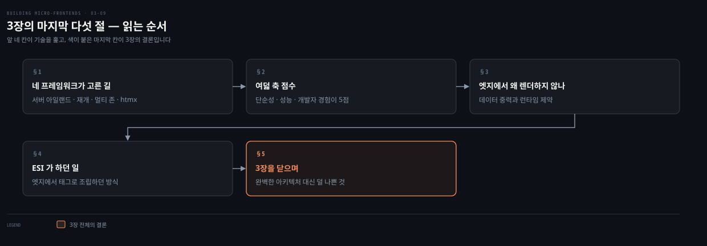
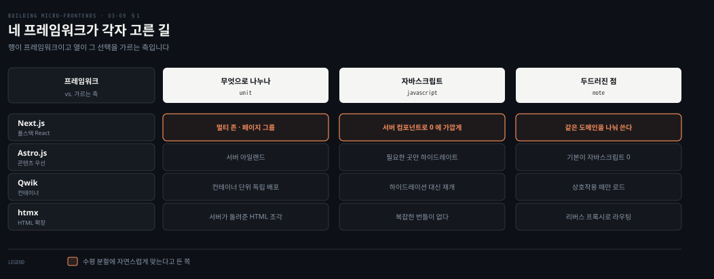
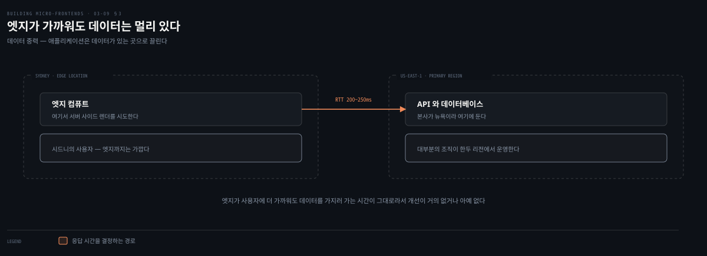
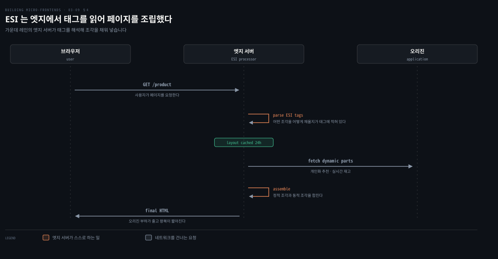

# 모던 SSR 프레임워크와 엣지 — 3장을 닫으며

---

> 앞 편이 서버 사이드 조합을 직접 짓는 이야기였다면 이 편은 그 일을 대신해 주는 최근 프레임워크들에서 시작합니다. 그다음 엣지가 왜 아직 조각의 무대가 되지 못했는지를 데이터 중력이라는 한 낱말로 보고, 3장 전체의 결론으로 닫습니다.

## 핵심 요약

> 이 편이 매달린 하나의 생각은 **프레임워크 선택이 기술 비교가 아니라 팀의 철학을 고르는 일이며, 3장 전체의 결론도 최선이 아니라 덜 나쁜 것을 고르는 일이다**라는 것입니다.

Astro는 서버 아일랜드로 필요한 곳만 하이드레이트하고 Qwik은 하이드레이션 대신 재개를 쓰며 Next.js는 멀티 존으로 여러 애플리케이션을 하나로 합칩니다. htmx가 가장 급진적입니다. 클라이언트 자바스크립트 프레임워크를 아예 걷어내고 HTML 자체를 확장합니다.

엣지에서 렌더하지 않는 이유는 데이터 중력입니다. 엣지가 사용자에게 가까워도 데이터가 있는 리전까지 왕복해야 하면 개선이 거의 없습니다. 엣지 런타임 자체도 좁습니다. 메모리는 128MB에서 256MB, 실행 시간은 50ms에서 500ms 사이입니다. 그래서 장의 결론이 하나로 모입니다. 완벽한 아키텍처는 없으므로 우리가 놓인 맥락에서 가장 덜 나쁜 것을 찾아야 합니다.

## 학습 목표

이 내용을 읽고 나면:

1. 모던 SSR 프레임워크 넷이 자바스크립트 부담을 각각 어떻게 다루는지 구분할 수 있습니다.
2. 서버 컴포넌트와 서버 아일랜드가 수평 분할에 맞는 이유를 설명할 수 있습니다.
3. 데이터 중력이 무엇이고 엣지 렌더링에 어떤 결론을 주는지 말할 수 있습니다.
4. ESI가 무엇을 어떻게 했고 왜 덜 쓰이게 됐는지 재현할 수 있습니다.
5. 3장의 여섯 점수표를 견주어 무엇을 최적화할지로 아키텍처를 고를 수 있습니다.

아래는 이 편이 다루는 절 다섯을 읽는 순서로 이은 지도입니다. 앞 네 칸이 기술을 훑고 마지막 칸이 3장의 결론입니다.

## 1. 네 프레임워크가 각자 고른 길

> 최근 몇 해 동안 서버 사이드 렌더링 프레임워크들이 조각 아키텍처에 접근하는 방식을 바꿔 놓았습니다. 넷이 같은 문제를 서로 다른 데서 붙잡습니다.

### 풀려는 문제

앞 편의 세 계층 구조는 강력하지만 손으로 지어야 할 것이 많았습니다. 컴포저를 만들고 캐시 계층을 붙이고 관측성을 세우는 일이 전부 팀의 몫이었습니다.

같은 시기에 프레임워크 쪽에서도 답이 나왔습니다. 조각 메커니즘을 쉽게 구현할 포장된 길을 제공하는 방향입니다.

### Astro와 Qwik — 자바스크립트를 줄이는 두 방식

Astro.js가 개척한 것이 서버 아일랜드입니다. 상호작용이 필요한 컴포넌트만 골라서 하이드레이트하고 나머지 페이지는 정적으로 둡니다. 그 결과로 성능이 좋아지고 자바스크립트 페이로드가 줄어듭니다. 이 방식이 팀에게 주는 것은 독립적인 기능을 만들어 더 큰 애플리케이션에 매끄럽게 통합할 수 있다는 점입니다.

Qwik은 비슷하지만 다른 길을 갑니다. 컨테이너라는 개념을 도입하고 **하이드레이션 대신 재개를 씁니다.** Qwik 컨테이너는 조각의 독립 배포를 가능하게 하면서, 상호작용에 필요할 때만 자바스크립트를 로드하는 고유한 직렬화 메커니즘으로 최적의 성능을 유지합니다.

### Next.js — 멀티 존과 서버 컴포넌트

Next.js는 멀티 존 기능으로 특히 강력한 해법이 됐습니다. 멀티 존은 **여러 Next.js 애플리케이션을 하나의 메인 애플리케이션으로 합치게** 해 줍니다. 각 존은 독립적으로 동작하면서 같은 도메인을 공유합니다. 그래서 팀들이 웹사이트의 서로 다른 구역에서 자율적으로 일하면서도 통합된 사용자 경험을 유지합니다.

여기에 React 서버 컴포넌트가 더해지면서 조각 능력이 한 단계 더 올라갔습니다. 서버 컴포넌트는 복잡한 UI를 서버에서 렌더하면서 클라이언트 자바스크립트 부담을 0으로 만듭니다. 전적으로 서버에서 실행되어 HTML을 클라이언트로 스트리밍하고, 추가 API 계층 없이 데이터베이스에서 직접 데이터를 가져올 수 있습니다.

수평 분할과 관련해 저자가 자연스럽게 맞는다고 든 조합이 둘입니다. Next.js의 서버 컴포넌트와 Astro.js의 서버 아일랜드입니다. 팀이 독립적인 기능을 서버 컴포넌트로 개발하고, 그것들이 명확한 경계를 유지한 채 더 큰 애플리케이션으로 조합됩니다. 클라이언트 번들이 줄고 초기 페이지 로드가 개선됩니다. **서버 컴포넌트의 스트리밍 성질 덕분에 사용자는 모든 조각이 로드되기를 기다리지 않고 콘텐츠가 준비되는 대로 봅니다.**

### htmx — 가장 급진적인 쪽

자바스크립트가 무거운 프레임워크들과 대비되는 자리에 htmx가 있습니다. 서버 중심 아키텍처로 돌아가면서도 동적인 조각 구현을 가능하게 합니다.

방식이 단순합니다. HTML 속성으로 서버 통신과 DOM 갱신을 처리합니다. 그래서 조각이 아주 가벼워집니다. 복잡한 클라이언트 자바스크립트 번들도, 정교한 빌드 시스템도 필요 없습니다. 표준 HTTP 요청과 서버가 렌더한 HTML만으로 눈에 띄는 성능을 내면서 애플리케이션 부분들 사이의 깔끔한 분리를 유지합니다.

NGINX 같은 리버스 프록시와 함께 쓰면 팀들이 요청을 서로 다른 백엔드 서비스로 라우팅할 수 있고, 각 서비스가 자기 조각 구역을 렌더합니다. **서버 사이드 렌더링을 선호하면서 클라이언트 자바스크립트 프레임워크의 복잡성을 피하고 싶은 조직**에서 특히 강력합니다. 독립 배포성과 팀 자율성이라는 조각의 이점은 그대로 유지됩니다.

### 읽어내기 — 고르는 기준은 철학이다

저자가 이 절의 유스케이스를 정리하며 내놓는 결론이 분명합니다. 넷 모두 비슷한 애플리케이션을 만들 수 있지만 **기본 접근과 최적화가 다르다**는 것입니다.

- Next.js는 풀스택 React 프레임워크로 서버와 클라이언트 능력을 두루 갖췄고, 이미 React 생태계에 투자한 팀에 자연스럽습니다.
- Astro는 부분 하이드레이션 덕에 기본값만으로도 높은 성능을 내고, 필요 없는 곳에는 자바스크립트를 아예 보내지 않습니다.
- Qwik의 재개 방식은 하이드레이션 단계 자체를 없애 자바스크립트 부담 문제에 독특한 답을 냅니다.
- htmx의 단순함은 복잡도와 유지보수 부담을 줄이는 것이 우선일 때, 또는 자바스크립트가 주 언어가 아닌 회사에서 이점이 됩니다.

그래서 하나를 다른 것보다 고르는 일은 **팀의 철학에 맞추고, 자기 필요에 가장 잘 맞는 내장 최적화를 활용하는 문제**에 가깝습니다.

## 2. 여덟 축 점수

> 이 표는 3장에서 가장 후한 편입니다. 그 후함이 어디서 오는지가 이 접근의 성격입니다.

### 풀려는 문제

앞 절이 네 프레임워크의 차이를 봤다면, 점수표는 그것들을 하나의 접근으로 묶었을 때 어떤 모양인지 보여 줍니다.

### 점수와 근거

| 아키텍처 특성 | 점수 | 저자가 붙인 근거 |
|---|---|---|
| 배포성 | 4 | 서버 사이드 렌더링 아키텍처라 버스트나 대량 트래픽이 어렵습니다. 오리진에서 최대한 오프로드하도록 캐싱 전략을 제대로 계획해야 합니다 |
| 모듈성 | 4 | 세밀한 모듈화가 가능하지만 나누는 데 주의가 필요합니다. 저자가 관찰한 성공적인 팀 대부분은 굵게 시작해 필요한 곳부터 점차 세밀하게 갔습니다 |
| 단순성 | 5 | 모든 프레임워크가 조각 메커니즘을 쉽게 구현할 포장된 길과 추상을 제공합니다. 주 난제는 기능 개발이 아니라 조각의 경계를 식별하는 일입니다 |
| 테스트성 | 4 | 단위부터 종단 간까지 견고한 테스트 해법이 있고 모놀리식 애플리케이션과 크게 다르지 않습니다 |
| 성능 | 5 | 클라이언트에 서빙되는 최종 결과를 완전히 통제하므로 바이트 단위까지 최적화할 수 있습니다 |
| 개발자 경험 | 5 | 모던 프레임워크들이 개발자 경험을 최우선에 둡니다. 넷 가운데 htmx는 의도적으로 단순한 성질 때문에 약간 뒤처질 수 있습니다 |
| 확장성 | 3 | 인메모리 캐싱 해법이 있어도 확장 가능한 인프라 설계에 상당한 노력이 듭니다. 예외는 플랫폼이 인프라 복잡성을 대신 처리해 주는 경우입니다 |
| 조율 | 4 | 페이지나 페이지 그룹을 팀에 할당하는 구조라면 팀 간 조율이 최소로 유지됩니다. 더 세밀하게 가면 거버넌스 계획과 조직 재편이 필요해집니다 |

### 읽어내기 — 단순성 5점의 정체

단순성이 5점인 이유가 기술이 쉬워서가 아닙니다. 프레임워크가 포장된 길을 깔아 줬기 때문입니다. 그리고 그 문장 바로 뒤에 저자가 남은 난제를 적어 둡니다. **주 난제는 이 프레임워크로 기능을 개발하는 일이 아니라 조각의 경계를 식별하는 일이라는 것입니다.**

3장 내내 반복된 이야기가 여기서 마지막으로 돌아옵니다. 도구가 좋아질수록 남는 문제는 도구가 못 푸는 쪽으로 몰립니다. 경계를 어디에 그을지는 2장의 결정 프레임워크가 다루던 질문이고, 프레임워크가 아무리 발전해도 그 자리는 비워 두지 않습니다.

## 3. 엣지에서는 왜 렌더하지 않나

> 엣지 컴퓨팅이 크게 자랐는데도 조각을 엣지에서 렌더하는 구현은 보이지 않습니다. 저자는 그 이유를 한 낱말로 답합니다.

### 풀려는 문제

Cloudflare Workers와 Fastly Compute와 AWS Lambda@Edge 같은 플랫폼과 함께 엣지 컴퓨팅이 최근 몇 해 동안 크게 성장했습니다. 사용자에게 가까운 곳에서 코드를 돌릴 수 있으니 서버 사이드 조합을 거기서 하면 될 것 같습니다.

그런데 실제로는 그런 구현을 보기 어렵습니다.

### 데이터 중력

주된 이유가 데이터 중력이라는 개념에 있습니다. Dave McCrory가 2010년에 만든 용어로, 물리학의 중력처럼 데이터와 서비스가 서로 끌어당긴다는 뜻입니다. 실질적으로는 **애플리케이션이 자기 데이터 소스에 가까이 있을 때 가장 효과적으로 동작한다**는 말입니다.

대부분의 조직은 API와 데이터베이스를 한두 개의 주요 리전에서 운영합니다. 보통 주요 비즈니스 운영지 근처이거나 클라우드 인프라를 처음 시작한 곳입니다.

저자의 예가 구체적입니다. 뉴욕에 본사를 둔 이커머스 회사가 주 데이터베이스와 API 인프라를 AWS의 `us-east-1` 리전에 둡니다. 호주 시드니의 고객이 시드니 엣지 위치를 통해 웹사이트에 접속하면, 엣지에서 일어나는 서버 사이드 렌더링이 여전히 뉴욕에서 데이터를 가져와야 합니다. **시드니에서 뉴욕까지 왕복 시간은 보통 200에서 250밀리초입니다.** 엣지 컴퓨트 위치가 사용자에게 더 가깝더라도, 데이터를 가져와야 한다는 요구 때문에 실제 성능 개선은 미미하거나 아예 없습니다.

### 엣지 런타임의 제약

이유가 하나 더 있습니다. 엣지 컴퓨팅 환경은 전통적인 클라우드 환경에 비해 계산 자원이 제한적입니다. 이 제약은 엣지 네트워크의 비용 효율성과 분산된 성질을 유지하려고 존재합니다.

| 제약 | 범위 |
|---|---|
| CPU 할당 | 엄격하게 제한됩니다 |
| 메모리 | 보통 128MB에서 256MB 사이입니다 |
| 실행 시간 | 보통 50밀리초에서 500밀리초 사이입니다 |
| Node.js API | 특정 API와 기능에만 제한적으로 지원됩니다 |

마지막 제약 때문에 전통적인 서버 환경에서 흔한 완전한 기능의 애플리케이션을 돌리기가 어려워집니다.

## 4. ESI가 하던 일

> 엣지에서 조각을 조립하는 시도가 아예 없었던 것은 아닙니다. CDN 초창기에 그 자리를 맡던 기술이 있습니다.

### 풀려는 문제

페이지 전체를 캐시하면 개인화된 부분까지 굳어 버리고, 캐시를 안 하면 오리진이 모든 요청을 받습니다. 이 둘 사이가 필요합니다.

과거에 엣지 사이드 인클루드, 곧 ESI가 조각의 잠재적 해법을 대표했습니다. CDN 초창기에 동적 콘텐츠 전달을 바꿔 놓은 마크업 언어입니다.

### 어떻게 동작했나

ESI는 XML 기반 기술로, 특수한 태그 시스템을 통해 네트워크 엣지에서 웹 페이지를 조립하게 해 줍니다. 태그가 엣지 서버에게 최종 콘텐츠를 어떻게 구성할지 지시합니다. **근본 원리는 정적 콘텐츠와 동적 콘텐츠의 분리입니다.** 효율적인 캐싱 전략을 유지하면서도 개인화되거나 자주 갱신되는 콘텐츠를 서빙할 수 있게 합니다.

사용자가 웹 페이지를 요청하면 ESI를 지원하는 엣지 서버가 HTML 안에 박힌 특수 마크업 태그를 처리합니다. 이 태그들이 지시로 작동해서, 어떤 콘텐츠 조각을 가져올지와 어떻게 조립할지와 언제 동적 요소를 넣을지를 알려 줍니다. 예를 들어 상품 페이지에는 페이지 레이아웃과 내비게이션 같은 정적 요소가 있고, 개인화 추천이나 실시간 재고 상태 같은 동적 요소는 요청 시점에 가져와 삽입됩니다.

ESI 프로세서는 보통 CDN 엣지 서버나 리버스 프록시에서 동작합니다. 태그를 해석하고 필요한 콘텐츠 조립을 수행한 뒤 최종 페이지를 사용자에게 전달합니다. 이 방식이 주는 이점이 셋입니다.

- 오리진 서버의 부하가 줍니다.
- 캐싱 메커니즘을 효율적으로 씁니다.
- 콘텐츠 갱신을 세밀하게 통제합니다.

저자의 예가 이 세밀함을 잘 보여 줍니다. 뉴스 웹사이트가 메인 레이아웃은 24시간 캐시하면서 헤드라인은 15분마다 갱신할 수 있습니다. **하부 애플리케이션 아키텍처를 바꾸지 않고 그렇게 됩니다.**

### 왜 덜 쓰이게 됐나

웹 아키텍처가 더 상호작용적이고 클라이언트 중심으로 진화하면서 ESI는 현대 웹 개발에서 덜 흔해졌습니다. 조각 지형에서도 새로운 기술과 접근이 그 자리를 대신했습니다.

## 5. 3장을 닫으며

> 이 장이 한 일은 하나의 멘탈 모델을 여러 아키텍처에 적용해 본 것입니다. 그 결과로 남는 결론이 담백합니다.

### 풀려는 문제

3장이 다룬 아키텍처가 여섯입니다. 각각의 난제와 점수를 따로 보면 무엇을 골라야 할지 오히려 흐려집니다. 견주는 자리가 필요합니다.

### 여섯 점수표를 한자리에

3장이 매긴 점수를 한 표로 모으면 이렇습니다. 각 행이 그 아키텍처를 다룬 편에서 나온 값입니다.

| 아키텍처 | 배포성 | 모듈성 | 단순성 | 테스트성 | 성능 | 개발자 경험 | 확장성 | 조율 |
|---|---|---|---|---|---|---|---|---|
| 수직 분할 | 5 | 3 | 4 | 4 | 4 | 4 | 5 | 4 |
| Module Federation | 4 | 4 | 5 | 4 | 4 | 5 | 5 | 3 |
| 수평 분할 · iframe | 5 | 3 | 3 | 3 | 2 | 3 | 5 | 3 |
| 웹 컴포넌트 | 4 | 4 | 4 | 4 | 4 | 4 | 5 | 3 |
| 수평 분할 · 서버 사이드 | 4 | 5 | 3 | 3 | 5 | 3 | 3 | 3 |
| 수평 분할 · 모던 SSR | 4 | 4 | 5 | 4 | 5 | 5 | 3 | 4 |

표를 세로로 읽으면 몇 가지가 드러납니다. 확장성은 클라이언트에서 정적 파일을 서빙하는 쪽이 높고 서버에서 조합하는 쪽이 낮습니다. 성능은 반대입니다. 조율은 어느 행에서도 5점이 아닙니다.

### 저자의 결론

저자가 장을 닫으며 적은 것이 셋입니다.

첫째, 이 장에서 조각 결정 프레임워크를 여러 아키텍처에 적용했습니다. 네 기둥을 정의하는 이 멘탈 모델이 선택지를 걸러 프로젝트에 맞는 아키텍처를 고르게 돕습니다.

둘째, 여러 조각 아키텍처를 분석하면서 난제를 짚고 아키텍처 특성에 점수를 매겼습니다. 그래서 **무엇을 최적화할지에 따라 맞는 아키텍처를 고를 수 있게** 됐습니다.

셋째가 이 장의 결론입니다. 완벽한 아키텍처는 존재하지 않는다는 것을 이해했으므로, 우리가 놓인 맥락에 기반해 **가장 덜 나쁜 아키텍처**를 찾아야 한다는 것입니다.

### 읽어내기 — 점수표는 순위표가 아니다

여섯 행을 합계로 줄여 1등을 뽑고 싶어집니다. 그런데 그렇게 하면 이 표가 만들어진 목적이 사라집니다.

**축마다 무게가 다르기 때문입니다.** 검색 노출이 매출인 서비스에서 성능 2점은 탈락 조건입니다. 사내 인트라넷에서는 상관없는 숫자입니다. 팀이 스물이 넘는 조직에서 조율 3점은 무겁고, 팀이 셋이면 견딜 만합니다. 저자가 "least worst"라는 표현을 쓴 이유가 여기 있습니다. **덜 나쁘다는 판정은 맥락 없이는 내려지지 않습니다.**

3장의 다음 순서도 그렇게 이어집니다. 4장에서는 기술 구현을 분석하고, 조각을 실제로 구현하며 만나게 될 주요 난제에 집중합니다.

## 적용 관점

> 아래는 백엔드 개발자가 이미 가진 판단 기준과 이 절을 잇는 노트의 읽기입니다. 책이 백엔드 독자를 향해 쓴 대목이 아닙니다.

데이터 중력은 백엔드에서 이미 겪은 계산입니다. 애플리케이션 서버를 데이터베이스와 다른 리전에 두면, 아무리 서버가 사용자 가까이 있어도 쿼리 왕복이 응답 시간을 지배합니다. 저자가 엣지 렌더링을 두고 내리는 결론은 그 계산을 프론트엔드 조합 계층에 그대로 적용한 것입니다. 판단 기준도 같습니다. 렌더에 데이터가 필요한가, 필요하다면 그 데이터는 어디 있는가입니다.

엣지 런타임의 제약도 익숙한 모양입니다. 메모리 128MB에서 256MB, 실행 시간 50밀리초에서 500밀리초라는 조건은 서버리스 함수의 제약과 같은 종류입니다. 무거운 의존성을 올리지 못하고 커넥션 풀을 오래 붙들지 못한다는 결론도 같습니다. 엣지에서 조각을 렌더한다는 아이디어는 그래서 기술적 호기심으로 남고, 실무에서는 캐시 계층으로 쓰는 편이 자연스럽습니다.

ESI는 서버 사이드 인클루드의 엣지 판본으로 읽으면 정확합니다. 정적 레이아웃은 길게 캐시하고 개인화 부분만 요청 시점에 채우는 전략은, 캐시 가능한 응답과 불가능한 응답을 갈라 엔드포인트를 나누던 설계와 같은 자리에 있습니다. 다른 점은 조립이 애플리케이션이 아니라 프록시에서 일어난다는 것뿐입니다.

여섯 점수표를 합계로 줄이지 말라는 대목은 아키텍처 결정 기록을 쓸 때의 자세와 같습니다. 결정의 근거는 "이게 제일 좋아서"가 아니라 "우리 맥락에서 이 축이 제일 무거워서"여야 하고, 그 맥락이 바뀌면 결정도 다시 봐야 합니다. 저자가 장 전체를 이 문장으로 닫는 이유가 그것입니다.

## 면접 대비

Q: 서버 컴포넌트와 서버 아일랜드가 마이크로 프론트엔드에 맞는 이유는 무엇인가요?

A: 팀이 독립적인 기능을 서버에서 렌더되는 단위로 만들고, 그것들이 명확한 경계를 유지한 채 더 큰 애플리케이션으로 조합되기 때문입니다. 클라이언트 번들이 줄고 초기 페이지 로드가 개선됩니다. 스트리밍 덕분에 사용자는 모든 조각을 기다리지 않고 준비된 것부터 봅니다. Next.js의 서버 컴포넌트와 Astro의 서버 아일랜드가 저자가 수평 분할에 자연스럽게 맞는다고 든 조합입니다.

Q: htmx로 마이크로 프론트엔드를 만든다는 것은 무슨 뜻인가요?

A: HTML 속성으로 서버 통신과 DOM 갱신을 처리하므로 클라이언트 자바스크립트 번들과 빌드 시스템이 필요 없습니다. NGINX 같은 리버스 프록시와 함께 쓰면 요청을 서로 다른 백엔드 서비스로 라우팅하고 각 서비스가 자기 조각 구역을 렌더합니다. 독립 배포성과 팀 자율성은 유지하면서 클라이언트 프레임워크의 복잡성을 피하는 접근입니다.

Q: 엣지에서 마이크로 프론트엔드를 렌더하지 않는 이유는 무엇인가요?

A: 데이터 중력 때문입니다. 대부분 조직이 API와 데이터베이스를 한두 리전에 두는데, 엣지에서 렌더해도 데이터를 그 리전에서 가져와야 합니다. 시드니에서 `us-east-1`까지 왕복이 보통 200에서 250밀리초라, 엣지가 사용자에게 가까워도 개선이 거의 없습니다. 엣지 런타임 자체도 메모리 128MB에서 256MB, 실행 시간 50에서 500밀리초로 좁습니다.

Q: 3장의 결론은 무엇인가요?

A: 완벽한 아키텍처는 없으므로 자기 맥락에서 가장 덜 나쁜 것을 찾아야 한다는 것입니다. 결정 프레임워크로 선택지를 거르고, 아키텍처 특성 여덟 축에 점수를 매겨 무엇을 최적화할지에 따라 고릅니다. 점수를 합계로 줄여 순위를 매기는 것은 이 방법의 목적과 어긋납니다. 축마다 무게가 맥락에 따라 다르기 때문입니다.

### 요약 세 문장

1. 모던 SSR 프레임워크 넷은 자바스크립트 부담을 서버 아일랜드와 재개와 서버 컴포넌트와 HTML 확장이라는 서로 다른 방식으로 다루며, 고르는 기준은 성능 비교가 아니라 팀의 철학입니다.
2. 엣지에서 조각을 렌더하지 않는 이유는 데이터 중력과 좁은 런타임 제약이며, 과거 그 자리를 맡던 ESI는 웹이 클라이언트 중심으로 가면서 덜 쓰이게 됐습니다.
3. 3장의 결론은 완벽한 아키텍처가 없으므로 맥락에서 가장 덜 나쁜 것을 찾으라는 것이고, 여섯 점수표는 순위표가 아니라 무게를 재는 자입니다.

## 핵심 개념 체크리스트

- [ ] 서버 아일랜드와 재개와 멀티 존을 각각 한 줄로 설명할 수 있는가?
- [ ] htmx가 조각 아키텍처에서 무엇을 덜어 내는지 말할 수 있는가?
- [ ] 단순성 5점의 이유와 그때도 남는 난제를 짝지어 댈 수 있는가?
- [ ] 데이터 중력을 정의하고 저자의 시드니 예로 설명할 수 있는가?
- [ ] ESI가 정적과 동적을 어떻게 갈랐는지 뉴스 사이트 예로 재현할 수 있는가?
- [ ] 여섯 점수표를 합계로 줄이면 안 되는 이유를 말할 수 있는가?

## 관련 문서

- [서버 사이드 — 조합을 오리진으로 옮긴다](03-08.서버%20사이드%20—%20조합을%20오리진으로%20옮긴다.md) — 이 편의 프레임워크들이 대신해 주는 일
- [프레임워크를 실제 선택에 대다](03-01.프레임워크를%20실제%20선택에%20대다.md) — 이 편이 종합하는 여덟 축의 정의
- [네 기둥과 첫 기둥 — 무엇을 하나로 볼 것인가](02-01.네%20기둥과%20첫%20기둥%20—%20무엇을%20하나로%20볼%20것인가.md) — 장을 닫으며 저자가 다시 부르는 결정 프레임워크
- [결정 프레임워크를 실제 프로젝트에 넣는다](04-01.%EA%B2%B0%EC%A0%95%20%ED%94%84%EB%A0%88%EC%9E%84%EC%9B%8C%ED%81%AC%EB%A5%BC%20%EC%8B%A4%EC%A0%9C%20%ED%94%84%EB%A1%9C%EC%A0%9D%ED%8A%B8%EC%97%90%20%EB%84%A3%EB%8A%94%EB%8B%A4.md) — 이 장의 결론을 실제 프로젝트에 넣는 다음 장

## 참고 자료

- 《Building Micro-Frontends, Second Edition》(Luca Mezzalira, O'Reilly, 2026) ISBN 978-1-098-17078-3
  - 다룬 범위: Modern Server-Side Rendering Frameworks · Use Cases · Architecture Characteristics(Table 3-6)
  - 이어서: Edge Side · Summary
- [Data Gravity in the Clouds](https://datagravitas.com/2010/12/07/data-gravity-in-the-clouds/) — Dave McCrory가 2010년에 데이터 중력을 처음 적은 글
- [htmx](https://htmx.org/) — 저자가 가장 급진적인 접근으로 든 프로젝트
