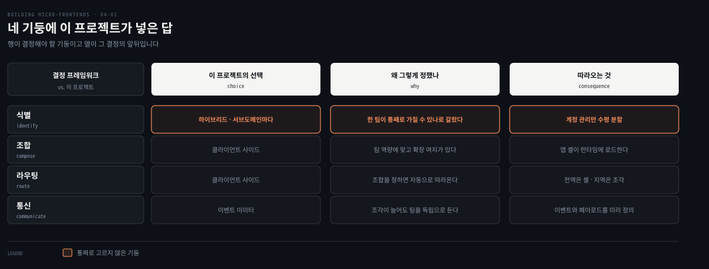
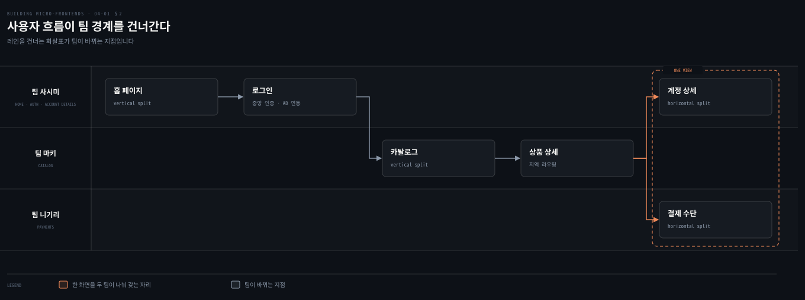
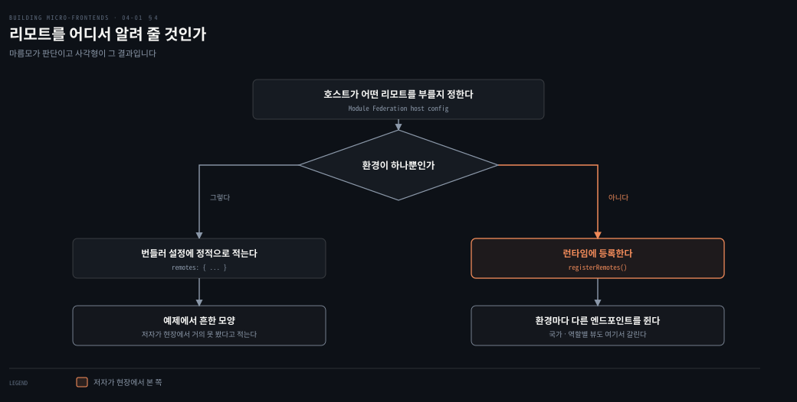

# 결정 프레임워크를 실제 프로젝트에 넣는다

---

> 3장까지가 고르는 법이었다면 4장은 고른 뒤의 이야기입니다. 이 편은 저자가 예제로 세운 사내 티셔츠 이커머스에서, 맥락을 읽고 팀을 배정하고 네 기둥에 답을 넣는 과정을 따라갑니다. 코드는 다음 편부터입니다.

## 핵심 요약

> 이 편이 매달린 하나의 생각은 **결정 프레임워크는 통짜 답을 주는 도구가 아니라 서브도메인마다 다른 답을 정당화하는 도구**라는 것입니다.

저자가 이 장에서 하려는 일은 프레임워크 사용법을 외우게 하는 것이 아니라 멘탈 모델을 세우는 것입니다. 물고기가 아니라 잡는 법을 가르치겠다고 밝힙니다. 그래서 식별을 하이브리드로 갑니다. 인증과 카탈로그는 한 팀이 통째로 가질 수 있어 수직 분할이고 계정 관리는 두 도메인이 만나 수평 분할입니다.

나머지 세 기둥은 그 결정에 딸려 옵니다. 클라이언트 조합을 정하면 라우팅도 클라이언트가 되고 조각이 여럿인 화면이 생기므로 통신은 이벤트 이미터가 됩니다. Module Federation을 고른 이유 셋도 전부 조직 쪽입니다. 이미 있는 Webpack 지식과 클라이언트 조합에 맞는 성질과 그대로 쓰는 파이프라인입니다. 그리고 저자가 못 박습니다. 공유는 단방향이어야 하고 리모트는 대개 런타임에 등록해야 합니다.

## 학습 목표

이 내용을 읽고 나면:

1. 아키텍처 결정에서 맥락으로 무엇을 읽어야 하는지 세 가지로 말할 수 있습니다.
2. 하이브리드 식별이 무엇이고 어떤 기준으로 서브도메인을 갈랐는지 설명할 수 있습니다.
3. 네 기둥의 결정이 서로를 어떻게 구속하는지 이 프로젝트의 예로 재현할 수 있습니다.
4. Module Federation을 고른 세 이유를 대고 그것이 기술 이유가 아닌 까닭을 말할 수 있습니다.
5. 양방향 공유가 만드는 순환 참조와 그 대안을 설명할 수 있습니다.

아래는 이 편이 도착하는 지점을 표로 편 지도입니다. 네 기둥에 이 프로젝트가 실제로 넣은 답입니다.

## 1. 무엇을 짓고 무엇을 물려받는가

> 저자는 코드로 바로 가지 않습니다. 어떤 회사가 어떤 사정에서 이 결정을 내리는지부터 세웁니다.

### 풀려는 문제

3장이 여섯 아키텍처에 점수를 매겨 놓았지만, 그 표만으로는 고를 수 없습니다. 어느 축이 무거운지가 맥락에서 나오기 때문입니다.

저자가 맥락으로 읽으라고 든 것이 셋입니다. **프로젝트의 목표, 조직의 구조와 커뮤니케이션, 회사가 가진 기술 역량**입니다. 아키텍처에는 만능이 없으니 이것들을 먼저 확인한 뒤에 결정 프레임워크로 기술 방향의 기둥을 정합니다.

### 저자가 이 장에서 하려는 것

저자가 방식을 미리 밝힙니다. 같은 예제를 여러 프레임워크로 반복해 만드는 대신 올바른 멘탈 모델을 세우는 데 집중하겠다는 것입니다. 그러면 **선택지 두어 개를 외우는 대신 어떤 마이크로 프론트엔드 프레임워크든 다룰 수 있게** 됩니다.

코드도 보지만 강조점은 다른 곳에 있습니다. 왜 그 결정이 내려졌는지를 이해하는 일입니다. 그러면 다음 프로젝트에서 어떤 접근과 프레임워크를 쓰든, 그 프레임워크에 얼마나 익숙한지와 무관하게 옳은 방향을 정할 수 있습니다.

> 물고기를 주면 하루를 먹이지만 잡는 법을 가르치면 평생을 먹인다는 옛말을 저자가 그대로 인용합니다. 잡는 법을 배우자는 것입니다.

### 프로젝트의 사정

프로젝트는 기업 내부용 티셔츠 이커머스 웹사이트입니다. 서브도메인이 일곱입니다. 홈 페이지, 로그인, 결제, 카탈로그, 계정 관리, 직원 지원, FAQ입니다. 이 장에서는 그중 넷만 씁니다. 홈 페이지와 인증과 카탈로그와 계정 관리입니다.

사이트는 일관된 사용자 인터페이스를 가져야 합니다. 직원이 좋아하는 티셔츠를 고르는 동안 응집된 경험을 하도록 하기 위해서입니다.

여기에 물려받는 것이 하나 있습니다. 마감을 맞추려고 기술 부서가 B2C 이커머스용으로 개발한 내부 엔진을 재사용하기로 합니다. **수년간 개발되고 프로덕션에서 단련된 모놀리식 백엔드 아키텍처**입니다.

### 읽어내기 — 프론트를 쪼개는 이유가 프론트에 있지 않다

그런데 기술 부서가 원하는 것이 따로 있습니다. 프론트엔드와 백엔드 전문성이 사일로로 갈리는 상태에서 벗어나는 일입니다.

그래서 마이크로 프론트엔드를 쓰기로 하고, 새 이커머스의 서브도메인마다 독립 팀을 세웁니다. 동시에 백엔드 개발자들은 백엔드를 마이크로서비스로 재설계합니다. 비즈니스와 기술 양쪽에 민첩성을 넣겠다는 것입니다.

앞의 문제에 답이 생깁니다. **이 조직이 조각을 도입하는 동기는 화면을 잘 나누고 싶어서가 아니라 사람을 잘 나누고 싶어서입니다.** 1장에서 본 원칙이 여기서 실제 결정으로 나타납니다.

## 2. 팀을 서브도메인에 붙인다

> 결정 프레임워크를 돌리기 전에 저자가 먼저 하는 일이 팀 배정입니다. 순서가 뒤바뀌지 않습니다.

### 풀려는 문제

서브도메인을 나눠 놓아도 누가 무엇을 갖는지 정해지지 않으면 경계가 지켜지지 않습니다. 그리고 팀의 구성이 그 서브도메인에 맞는 아키텍처를 되먹입니다.

### 세 팀과 그들이 갖는 것

| 팀 | 무엇을 갖는가 | 팀의 구성 |
|---|---|---|
| 사시미 | 홈 페이지 서브도메인. 사내 사이트이므로 조직의 모든 시스템에 쓰이는 중앙 인증 시스템으로 로그인 폼을 구현합니다. 사용자 인증과 "계정 상세" 조각의 개인정보 수집도 맡습니다 | 한 명이 풀스택이고 나머지는 Microsoft Active Directory 백엔드 연동에 집중합니다 |
| 마키 | 핵심 도메인인 카탈로그. 주된 사용자 경험을 책임집니다 | 가장 큰 팀이며 프론트엔드와 백엔드 개발자로 나뉩니다 |
| 니기리 | 결제 서브도메인. 신용카드와 PayPal 같은 결제 수단을 통합합니다 | 원문이 구성을 따로 적지 않습니다 |

### 팀 구성이 분할 방식을 되먹인다

구현할 흐름이 세 구간입니다. 사용자가 홈 페이지를 만나고 인증한 뒤 전체 카탈로그를 봅니다. **카탈로그 조각은 수직 분할이고 "내 계정" 구역은 수평 분할 조각 둘로 구성됩니다.**

각각의 이유를 저자가 팀 사정으로 답니다.

- 인증 프론트엔드는 개발자 한 명이면 됩니다. 구현의 무거운 쪽이 백엔드에 있기 때문입니다.
- 카탈로그는 더 풍부한 사용자 경험을 원하므로 프론트엔드 실무 지식이 깊은 팀이 필요합니다.
- 계정 관리는 서로 다른 서브도메인이 만나는 자리이므로, 그 두 서브도메인을 맡은 두 팀이 함께 이 뷰를 개발합니다.

앞의 문제에 답이 생깁니다. 분할 방식이 기술 취향에서 나오지 않습니다. **한 팀이 통째로 가질 수 있으면 수직이고, 두 팀이 한 화면에서 만나야 하면 수평입니다.**

## 3. 네 기둥에 답을 넣는다

> 팀이 정해지고 나서야 결정 프레임워크가 돌아갑니다. 저자는 가정을 개념 증명으로 검증한 뒤에 넷을 확정했다고 적습니다.

### 풀려는 문제

2장에서 배운 네 기둥은 식별과 조합과 라우팅과 통신이었습니다. 문제는 그것을 프로젝트 전체에 하나씩 정해야 하는가입니다.

### 식별 — 통짜로 고르지 않는다

첫 기둥에서 저자가 통념을 깹니다. 프로젝트 전체에 수평 분할이나 수직 분할 하나를 쓰는 대신, **서브도메인마다 가장 알맞은 접근을 고르기로 합니다.**

가르는 기준이 명확합니다. 인증과 카탈로그는 수직 분할이 비즈니스 요구에 더 맞습니다. 둘 다 같은 팀에 배정됐고, 그 팀이 외부 의존을 많이 만들지 않고 서브도메인 전체를 관리할 수 있기 때문입니다. 반면 계정 관리는 수평 분할이 맞습니다. 여러 서브도메인을 한 화면에 두어야 한다는 비즈니스 요구가 있기 때문입니다.

### 나머지 셋은 딸려 온다

**조합**은 클라이언트 사이드입니다. 사내 이커머스의 요구를 뒷받침하고 팀의 역량에도 맞습니다. 여기에 저자가 한 가지를 덧붙입니다. 이 조합 방식이 데스크톱 애플리케이션이나 프로그레시브 웹 앱 같은 다른 플랫폼으로의 진화도 열어 둔다는 점입니다.

**라우팅**은 조합이 정해지면 따라옵니다. 클라이언트 사이드 조합을 쓰기로 하면 결정 프레임워크가 라우팅도 클라이언트에서 해야 한다고 쉽게 알려 줍니다. 다만 라우팅이 두 종류라는 점을 고려해야 합니다. **조각 컨테이너, 곧 애플리케이션 셸이 다루는 전역 라우팅**과, 마키 팀이 여러 뷰를 만들 카탈로그 서브도메인 안의 **지역 라우팅**입니다.

**통신**도 결정 프레임워크의 제안을 따릅니다. 팀 사시미가 세션 토큰을 쿠키에 저장하고 모든 API 요청 헤더에 bearer 토큰을 붙이는 미들웨어를 만듭니다. 계정 관리 뷰에는 조각이 둘이고 앞으로 더 늘 수도 있습니다. 팀과 산출물을 서로 독립으로 유지하고 싶은 이유가 여기 있습니다. 그래서 조각과 애플리케이션 셸 사이의 통신에 이벤트 이미터를 쓰고, **조각마다 트리거할 이벤트와 그 페이로드를 미리 정의합니다.**

### 읽어내기 — 첫 기둥이 나머지를 구속한다는 말의 뜻

2장에서 정의가 나머지 셋을 구속한다고 배웠습니다. 여기서 그 구속이 실제로 보입니다.

식별을 하이브리드로 정한 순간 계정 관리 화면에 조각이 둘 놓입니다. 그러면 그 둘이 말을 섞어야 하고, 상태를 공유하지 않으면서 말하려면 이벤트가 됩니다. **통신 기둥의 답은 통신을 고민해서 나온 것이 아니라 식별의 결과로 정해집니다.**

## 4. Module Federation을 고른 이유

> 기술 선택은 마지막입니다. 그리고 저자가 든 세 이유는 모두 기술 성능에 관한 것이 아닙니다.

### 풀려는 문제

3장에서 본 여섯 아키텍처와 여러 프레임워크 가운데 하나를 골라야 합니다. 점수표만으로는 결정이 안 되고, 조직이 실제로 쓸 수 있느냐가 남습니다.

이 이커머스에 고른 기술이 React와 함께 쓰는 Module Federation입니다. 여러 차례 개념 증명을 거친 뒤, 팀들은 이 프로젝트를 성공적으로 릴리스하는 데 필요한 것을 Module Federation이 다 준다고 느꼈습니다.

### 세 이유

| 이유 | 저자가 붙인 설명 |
|---|---|
| 이미 있는 Webpack 지식 | Webpack이 조직 안에서 널리 쓰입니다. 많은 개발자가 다른 프로젝트에서 이 번들러를 써 봤으므로 새 프레임워크를 배우지 않아도 됩니다. Module Federation은 회사가 잘 아는 도구의 플러그인일 뿐이라 기술 스택에 잘 맞습니다 |
| 클라이언트 사이드 조합 | 클라이언트 기반 조합에서 Module Federation이 자바스크립트 번들을 비동기로 로드하는 단순한 방법을 줍니다. 원래 이 유스케이스로 개발됐고 나중에 서버 사이드 렌더링으로 확장됐습니다. 요구가 바뀌어도 Module Federation을 안정된 자산으로 두고 구현만 바꿀 수 있습니다 |
| 매끄러운 개발자 경험 | 팀들이 Webpack에 상당한 전문성을 갖고 있습니다. 자동화 파이프라인과 로컬 개발 도구의 구현이 그대로라, 팀이 곧바로 생산적으로 일할 수 있습니다 |

### 읽어내기 — 이 선택은 이 조직의 것이다

저자가 곧바로 단서를 답니다. Module Federation은 이 프로젝트에 특정한 이유로 골랐고, **다른 프로젝트에서는 옳은 선택이 아닐 수 있다**는 것입니다.

그래서 결정 전에 분석하라고 요구하는 것이 넷입니다. 팀 구조, 개발자의 기술, 회사의 다른 프로젝트에서 쓰는 기술 스택, 그리고 프로젝트의 비즈니스 목표입니다. 자기가 일하는 맥락을 분석한 뒤에 결정 프레임워크로 앞으로의 결정을 받칠 토대를 만들라는 것입니다.

## 5. Module Federation 101

> 구현으로 들어가기 전에 저자가 개념 몇 개를 세웁니다. 뒤의 기술 결정이 왜 그렇게 내려지는지가 여기서 나옵니다.

### 풀려는 문제

Module Federation은 자바스크립트 애플리케이션이 다른 번들의 코드를 런타임에 동적으로 로드하고 실행하게 해 줍니다. 조각이 이 능력의 완벽한 유스케이스입니다.

버전 2.0이 이전 버전에서 크게 나아간 지점이라고 저자가 짚습니다. Webpack과 Rolldown과 Vite와 Rspack에서 쓸 수 있고 앞으로 더 늘어납니다. 이전의 Webpack 결합이 사라졌고 클라이언트 사이드와 서버 사이드 애플리케이션 모두에 잘 동작합니다.

### 두 개념

| 개념 | 무엇인가 |
|---|---|
| 호스트 | 공유 라이브러리나 조각이나 컴포넌트를 런타임에 로드하는 컨테이너 |
| 리모트 | 호스트 안에 로드하려는 자바스크립트 번들 |

호스트 하나가 리모트 여럿을 로드할 수 있습니다. 이 프로젝트에서 호스트는 애플리케이션 셸이고 리모트는 조각입니다.

### 양방향 공유가 만드는 순환

Module Federation에서 공유는 양방향이 가능합니다. 리모트가 번들의 일부나 전체를 호스트와 공유할 수 있고 그 반대도 됩니다. 그런데 **양방향 공유는 아키텍처를 아주 빠르게 복잡하게 만듭니다.**

저자가 든 예가 구체적입니다. "상품 카탈로그" 조각이 공유 상품 카드 컴포넌트를 노출하면서, 동시에 가격 유틸리티를 쓰려고 장바구니 조각에 의존한다고 해 봅니다. 이 상호 의존이 순환 참조를 만듭니다. **한쪽의 어떤 변경이든 다른 쪽을 깨뜨릴 수 있어, 조율 부담과 팀 사이 결합이 늘어납니다.** 큰 시스템에서 이런 얽힘은 자율성을 줄이고 독립적으로 배포 가능한 산출물이 주는 이점을 훼손합니다.

최선은 단방향 공유입니다. **호스트가 리모트에게 아무것도 공유하지 않는 것입니다.** 그러면 디버깅이 쉬워지고, 호스트로 도메인이 새어 들어갈 가능성이 줄어듭니다. 그 누출이 호스트와 리모트 사이에 설계 결합을 만들 수 있기 때문입니다.

### 리모트를 코드에서 등록한다

이 아키텍처를 활용하면 리모트를 번들러 설정에 지정하는 것뿐 아니라 코드에서 자바스크립트로 로드할 수도 있습니다.

저자가 든 활용이 실무적입니다. **API에서 라우트를 가져와 사용자의 국가나 역할에 따라 리모트의 동적인 뷰를 만드는 것**입니다. 우리가 매일 다루는 다중 환경 시스템에 맞는 구현이라는 설명이 붙습니다.

### 번들러의 다른 플러그인과 함께

Module Federation이 여러 번들러의 플러그인을 갖고 있으므로, 그 번들러의 다른 기능으로 프로젝트에 맞게 코드를 최적화할 수 있습니다.

저자가 든 예가 둘입니다. Module Federation은 기본으로 자바스크립트 청크 파일을 많이 만드는데, 리모트를 덜 수다스럽게 만들어 두세 파일만 로드하게 하고 싶을 수 있습니다. 번들러가 Webpack이라면 `MinChunkSizePlugin`으로 파일당 최소 킬로바이트를 강제해 청크를 나눌 수 있습니다. `DefinePlugin`으로는 컴파일 시점에 코드의 변수를 다른 값이나 표현식으로 치환할 수 있습니다. 로컬에서 테스트할 때와 개발 환경에서 돌 때 알맞은 기본 경로를 주는 로직을 이것으로 쉽게 만듭니다.

번들러 생태계의 다른 플러그인과 함께 쓰면 Module Federation은 자기 맥락에 맞게 산출물을 손볼 수 있는 강력하고 알맞은 수단이 됩니다.

## 적용 관점

> 아래는 백엔드 개발자가 이미 가진 판단 기준과 이 절을 잇는 노트의 읽기입니다. 책이 백엔드 독자를 향해 쓴 대목이 아닙니다.

팀을 먼저 배정하고 그다음에 분할 방식을 정하는 순서는 서비스 경계를 팀 경계에 맞추던 판단과 같습니다. 한 팀이 통째로 가질 수 있으면 하나의 서비스로 두고, 두 팀이 같은 데이터를 만져야 하면 경계를 다시 봅니다. 저자가 인증과 카탈로그를 수직으로, 계정 관리를 수평으로 가른 근거가 정확히 그 기준입니다.

모놀리식 백엔드를 물려받은 채로 프론트엔드부터 쪼갠다는 설정도 현실적입니다. 백엔드 재설계를 기다렸다가 프론트를 나누면 아무것도 시작되지 않습니다. 이 프로젝트는 검증된 모놀리스를 그대로 쓰면서 프론트를 나누고 백엔드는 병행해서 마이크로서비스로 옮깁니다. 조각의 경계와 서비스의 경계가 처음부터 일치할 필요는 없다는 뜻으로 읽는 편이 정확합니다.

호스트와 리모트 사이를 단방향으로 유지하라는 요구는 모듈 의존 방향을 한 방향으로 강제하던 규칙과 같은 자리에 있습니다. 저자가 든 순환 참조 예는 두 서비스가 서로의 유틸리티를 참조해 어느 쪽을 먼저 배포해야 할지 정할 수 없어지는 상황과 같습니다. 백엔드에서는 이것을 아키텍처 테스트로 굳혀 왔고, 프론트엔드에서는 아직 그런 강제 장치가 흔하지 않습니다. 그래서 규약과 리뷰가 더 무겁게 걸립니다.

리모트를 런타임에 등록한다는 결정은 서비스 디스커버리와 같습니다. 엔드포인트를 설정 파일에 박아 두면 환경마다 빌드를 다시 해야 하고, 레지스트리에서 받아 오면 같은 산출물로 여러 환경을 돌 수 있습니다. 저자가 다중 환경을 근거로 든 것도 같은 이유입니다. 국가나 역할에 따라 다른 조각을 내려 주는 활용은 기능 플래그와 라우팅 규칙을 합친 모양으로 읽힙니다.

## 면접 대비

Q: 마이크로 프론트엔드 아키텍처를 고를 때 맥락에서 무엇을 봐야 하나요?

A: 저자가 든 것은 셋입니다. 프로젝트의 목표, 조직의 구조와 커뮤니케이션, 회사가 가진 기술 역량입니다. 기술 선택 단계에서는 여기에 넷을 더 봅니다. 팀 구조, 개발자의 기술, 회사의 다른 프로젝트가 쓰는 기술 스택, 프로젝트의 비즈니스 목표입니다. 아키텍처에는 만능이 없으므로 이 맥락을 먼저 확인한 뒤 결정 프레임워크를 돌립니다.

Q: 하이브리드 분할이란 무엇인가요?

A: 프로젝트 전체에 수평이나 수직 하나를 쓰는 대신 서브도메인마다 알맞은 방식을 고르는 것입니다. 저자의 예에서 인증과 카탈로그는 같은 팀에 배정됐고 외부 의존 없이 서브도메인 전체를 관리할 수 있어 수직 분할입니다. 계정 관리는 여러 서브도메인을 한 화면에 두어야 한다는 요구가 있어 수평 분할입니다.

Q: Module Federation의 양방향 공유가 왜 문제인가요?

A: 순환 참조를 만들기 때문입니다. 저자의 예로 상품 카탈로그 조각이 상품 카드 컴포넌트를 노출하면서 동시에 가격 유틸리티를 위해 장바구니 조각에 의존하면, 한쪽의 변경이 다른 쪽을 깨뜨릴 수 있습니다. 조율 부담과 팀 결합이 늘고 독립 배포의 이점이 사라집니다. 최선은 단방향이며, 호스트가 리모트에게 아무것도 공유하지 않는 것입니다.

Q: 리모트를 번들러 설정에 적지 않고 런타임에 등록하는 이유는 무엇인가요?

A: 대부분의 팀이 다중 환경 전략으로 일하기 때문입니다. 배포 환경에 따라 애플리케이션이 서로 다른 엔드포인트로 구성되므로, 설정에 박아 두면 환경마다 다시 빌드해야 합니다. 런타임 등록은 API에서 라우트를 가져와 사용자의 국가나 역할에 따라 다른 뷰를 만드는 일도 가능하게 합니다.

### 요약 세 문장

1. 결정 프레임워크는 프로젝트 전체에 하나의 답을 강요하지 않고, 서브도메인마다 다른 답을 정당화하는 도구입니다.
2. 팀 배정이 분할 방식을 되먹입니다. 한 팀이 통째로 가질 수 있으면 수직이고 두 팀이 한 화면에서 만나면 수평입니다.
3. Module Federation을 고른 이유 셋은 모두 조직 쪽이며, 쓰는 방식의 원칙은 단방향 공유와 런타임 등록입니다.

## 핵심 개념 체크리스트

- [ ] 맥락에서 읽어야 할 세 가지를 댈 수 있는가?
- [ ] 세 팀과 각자 갖는 서브도메인을 짝지을 수 있는가?
- [ ] 인증과 카탈로그가 수직이고 계정 관리가 수평인 이유를 말할 수 있는가?
- [ ] 식별의 결정이 통신의 답을 어떻게 정하는지 설명할 수 있는가?
- [ ] Module Federation을 고른 세 이유를 재현할 수 있는가?
- [ ] 호스트와 리모트를 정의하고 단방향 공유를 권하는 근거를 댈 수 있는가?

## 관련 문서

- [모던 SSR 프레임워크와 엣지 — 3장을 닫으며](03-09.모던%20SSR%20프레임워크와%20엣지%20—%203장을%20닫으며.md) — 아키텍처를 고르는 기준을 세운 앞 장의 결론
- [네 기둥과 첫 기둥 — 무엇을 하나로 볼 것인가](02-01.네%20기둥과%20첫%20기둥%20—%20무엇을%20하나로%20볼%20것인가.md) — 이 편이 실제 프로젝트에 넣는 결정 프레임워크의 정의
- [Module Federation — 호스트와 리모트로 잇는다](03-05.Module%20Federation%20—%20호스트와%20리모트로%20잇는다.md) — 이 도구의 성질과 여덟 축 점수
- [Building Micro-Frontends 정독 인덱스](README.md) — 다음 편인 애플리케이션 셸의 진행 상태는 인덱스의 노트 표에서 봅니다

## 참고 자료

- 《Building Micro-Frontends, Second Edition》(Luca Mezzalira, O'Reilly, 2026) ISBN 978-1-098-17078-3
  - 다룬 범위: The Project · Module Federation 101
  - 이어서: Technical Implementation · Project Structure · Application Shell
- [Module Federation 공식 문서](https://module-federation.io/) — 저자가 더 자세한 내용을 보라고 지목한 곳
