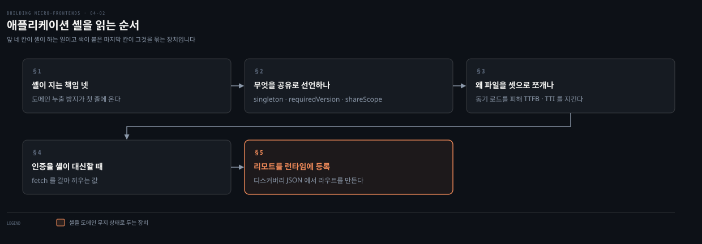
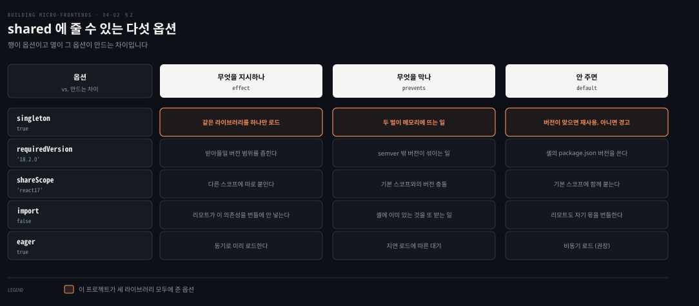
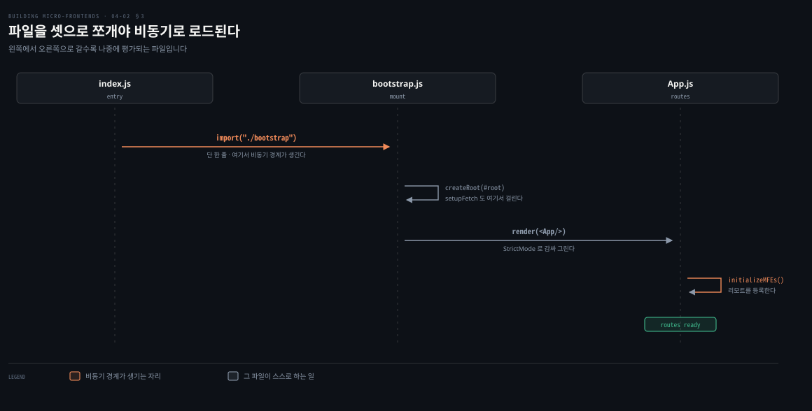
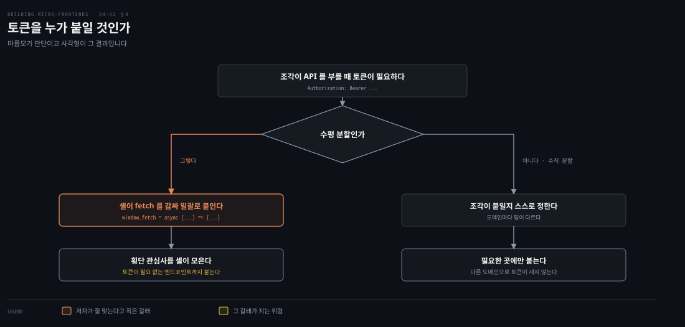
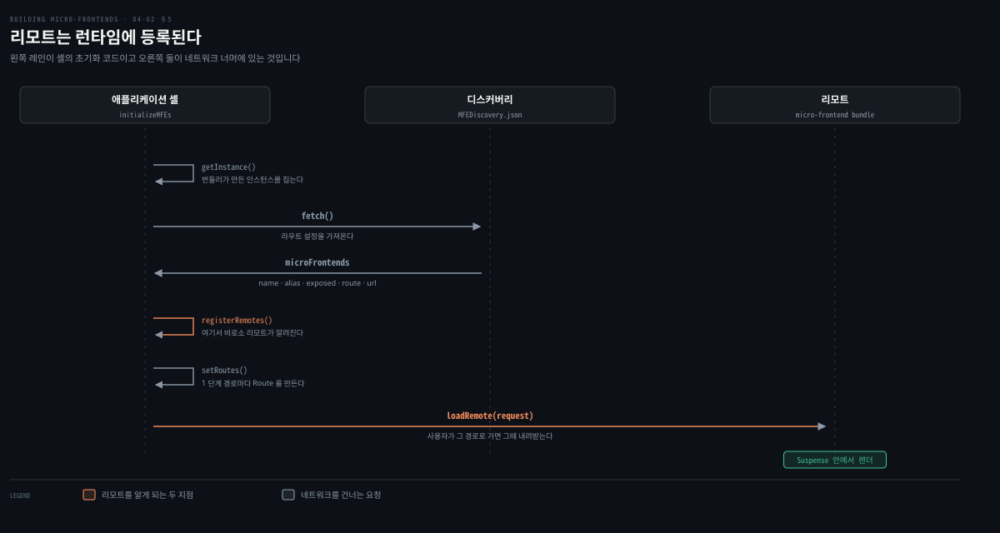

# 애플리케이션 셸 — 호스트가 하는 일

---

> 앞 편이 결정을 세웠다면 이 편은 그 결정이 설정 파일과 부팅 코드로 어떻게 내려앉는지 봅니다. 셸은 코드가 적은 대신 규율이 많이 걸리는 자리입니다. 도메인을 하나도 갖지 않으면서 모든 조각을 붙여야 하기 때문입니다.

## 핵심 요약

> 이 편이 매달린 하나의 생각은 **애플리케이션 셸의 일은 기능을 갖는 것이 아니라 도메인을 갖지 않는 것**이라는 점입니다.

그래서 셸을 맡은 팀의 첫 책임이 도메인 누출을 막는 일이고 전역 라우팅과 마운트와 공유 의존성이 그 뒤에 옵니다. 공유 라이브러리는 별도 저장소로 빼지 않고 `shared` 설정 한 줄로 끝냅니다. `singleton`과 `requiredVersion`이 그 한 줄의 뼈대입니다.

파일은 `index.js`와 `bootstrap.js`와 `app.js` 셋으로 쪼갭니다. 진입 파일이 한 줄짜리 동적 임포트여야 의존성이 앞에서 한꺼번에 내려오지 않기 때문입니다. 인증은 셸이 `fetch`를 감싸 토큰을 붙이는 방식으로 가는데, 저자는 이것이 수평 분할에 잘 맞지만 프로덕션 해법은 아니라고 못 박습니다. 리모트는 번들러 설정이 아니라 런타임에 등록합니다. 다중 환경 때문입니다.


## 학습 목표

이 내용을 읽고 나면:

1. 애플리케이션 셸을 맡은 팀의 책임 넷을 순서대로 말할 수 있습니다.
2. `shared` 설정의 옵션들이 각각 무엇을 보장하는지 구분할 수 있습니다.
3. 진입 파일을 셋으로 쪼개는 이유를 성능 지표로 설명할 수 있습니다.
4. `fetch`를 감싸는 인증 미들웨어의 이점과 위험을 함께 댈 수 있습니다.
5. 리모트를 런타임에 등록하는 흐름을 함수 이름으로 재현할 수 있습니다.

아래는 이 편의 절 다섯을 읽는 순서로 이은 지도입니다. 앞 네 칸이 셸이 하는 일이고 마지막 칸이 그것을 묶는 장치입니다.




## 1. 셸을 누가 맡고 무엇을 지는가

> 셸은 어느 비즈니스 서브도메인에도 속하지 않습니다. 그래서 소유권을 정하는 방식부터 다릅니다.

### 풀려는 문제

애플리케이션 셸은 사용자 세션 내내 살아 있으면서 조각을 오케스트레이션합니다. 그런데 **어떤 비즈니스 서브도메인에도 속하지 않습니다.**

그러면 누가 맡아야 하는지가 문제가 됩니다. 어느 도메인 팀에 붙이면 그 팀의 도메인이 셸로 새어 들 위험이 생깁니다.

### 저자의 답 — 겸직하는 원칙 엔지니어 팀

팀들이 셸의 구현을 새로 꾸린 원칙 엔지니어 팀에 맡기기로 합니다. 팀 사사즈시입니다.

근거가 두 가지입니다. 이 부분을 짓는 데 드는 노력이 적고, 앞으로의 유지보수도 적을 것으로 보이기 때문입니다. **셸이 어떤 비즈니스 도메인 로직도 갖지 않는다는 점이 그 근거입니다.** 그래서 원칙 엔지니어들이 각자 원래 팀에서 하던 역할에 더해 이 팀을 겸합니다.

### 책임 넷과 그 순서

팀 사사즈시가 지는 책임이 넷입니다.

- 애플리케이션 셸에서 도메인 누출을 막습니다.
- 조각 사이의 전역 라우팅을 구현합니다.
- 조각이 올바르게 마운트되고 언마운트되도록 보장합니다.
- 도메인을 가로지르는 의존성을 관리하고, 그것들을 하나 또는 여러 자바스크립트 청크로 묶습니다.

원칙 엔지니어로 이뤄진 팀인 만큼 시스템 전체의 성능도 함께 봅니다. 다른 팀들과 정기 회의를 열어 최적화 모범 사례를 공유하고, 평가에서 드러난 성능 병목을 검토하는 일이 여기 들어갑니다.

### 읽어내기 — 첫 줄이 금지 조항이다

책임 목록의 첫 줄이 무엇을 하라가 아니라 **무엇이 새어 들지 않게 하라**입니다.

이 순서가 셸이라는 자리의 성격을 말합니다. 셸에 기능을 넣는 일은 언제나 쉽고 그 유혹이 계속 옵니다. 3장에서 본 것처럼 셸에 도메인 로직이 들어가면 그것을 바꿀 때마다 셸을 다시 배포해야 합니다. 그런데 셸은 모든 팀이 함께 쓰는 자산입니다. **금지가 먼저 오는 이유가 그것입니다.**


## 2. 무엇을 공유로 선언하는가

> 마이크로 프론트엔드에서 가장 성가신 문제 하나가 공유 의존성입니다. Module Federation은 그것을 설정 한 덩어리로 줄입니다.



### 풀려는 문제

여러 조각이 같은 React를 쓰는데 각자 번들에 넣으면 사용자가 같은 코드를 여러 번 받습니다. 그렇다고 억지로 하나만 쓰게 만들면 런타임에서 충돌합니다.

다른 프레임워크에서 흔한 답은 공유 라이브러리와 의존성을 위한 독립 저장소를 만드는 것입니다. 그러면 그 공유 코드를 빌드하고 배포하는 자동화 파이프라인이 필요하고, 갱신 책임과 패키지 크기 제약과 롤백 절차와 배포 전략을 담은 거버넌스 정책까지 따라옵니다.

### Module Federation이 줄이는 것

이 플러그인에서는 그 과정이 크게 단순해집니다. 별도 저장소를 관리하는 대신 **호스트와 리모트 양쪽에 공유 의존성을 지정하기만 하면 됩니다.** 이 프로젝트에서는 애플리케이션 셸과 모든 조각입니다.

그러면 Webpack과 Module Federation이 여러 자바스크립트 파일을 만들고, 조각이 몇 개나 그 의존성을 필요로 하든 **사용자 세션당 한 번만 내려받게** 보장합니다.

셸의 설정이 이렇습니다.

```javascript
new ModuleFederationPlugin({
  name: 'shell',
  filename: 'remoteEntry.js',
  shared: {
    'react-router-dom': { singleton: true, requiredVersion: '6.21.3' },
    react:              { singleton: true, requiredVersion: '18.2.0' },
    'react-dom':        { singleton: true, requiredVersion: '18.2.0' }
  }
})
```

`name`으로 호스트의 이름을 정하고, `shared`에 모든 조각에 걸쳐 공유할 라이브러리를 적습니다.

### 옵션이 각각 보장하는 것

`singleton`은 같은 의존성과 같은 버전을 다른 조각이 요구할 때 인스턴스를 하나만 로드하라고 알립니다. `requiredVersion`은 호환성을 위해 특정 버전을 정합니다. 이 프로젝트는 React와 ReactDOM과 React Router DOM을 미리 정한 세트로 묶어 일관성을 지킵니다.

여기에 리모트 쪽 최적화가 하나 더 있습니다. 리모트에서 `import`를 `false`로 두면 그 공유 의존성을 자기 번들에 넣지 않습니다. **리모트가 로드될 때 애플리케이션 셸이 이미 메모리에 그 버전을 갖고 있다는 것을 알기 때문입니다.**

`shareScope`는 이 라이브러리들이 어디에 붙을지를 정합니다. 다음 편에서 실제로 쓰이는 것을 봅니다.

> 저자가 사이드바로 따로 뽑아 둔 규칙이 있습니다. 공유 라이브러리에 필요 버전을 지정하지 않으면 애플리케이션 셸의 `package.json`에 선언된 버전이 기본값이 됩니다. 여러 애플리케이션이 같은 모듈을 공유할 때 Module Federation은 각자의 `shared` 설정에 선언된 버전을 비교합니다. 이미 로드된 버전과 semver 호환이면 그 버전을 문제없이 재사용하고, 요구 범위 밖으로 어긋나면 콘솔에 경고가 뜹니다.


## 3. 왜 파일을 셋으로 쪼개는가

> 셸의 진입 파일이 한 줄짜리입니다. 그 한 줄이 성능 지표를 지키는 장치입니다.



### 풀려는 문제

Module Federation은 의존성을 동기로도 비동기로도 로드할 수 있습니다. 동기 로드는 플러그인 설정에서 `eager` 속성으로 켭니다.

그런데 저자가 권하는 것은 비동기입니다. 이유가 분명합니다. **사용자가 커다란 선행 번들로 모든 의존성을 내려받지 않아도 되기 때문**입니다. 그래야 첫 바이트까지의 시간과 상호작용 가능까지의 시간 같은 핵심 성능 지표를 지킬 수 있습니다.

### 셋으로 나눈다

비동기 로드를 켜려면 애플리케이션의 초기화를 여러 파일로 쪼개야 합니다. 이 프로젝트에서 셸은 `index.js`와 `bootstrap.js`와 `app.js` 셋으로 나뉩니다.

`index.js`는 진입점이고 코드가 딱 한 줄입니다.

```javascript
import("./bootstrap");
```

`bootstrap.js`는 셸을 인스턴스화하고 HTML 템플릿에 있는 `root` 라는 `<div>` 안에 React 애플리케이션을 마운트합니다.

```javascript
import React from 'react';
import ReactDOM from 'react-dom/client';
import App from './App';
import './setupFetch';

const root = ReactDOM.createRoot(document.getElementById('root'));
root.render(
  <React.StrictMode>
    <App />
  </React.StrictMode>,
);
```

`App.js`에는 두 가지가 들어갑니다. 애플리케이션 헤더를 포함한 기본 인터페이스 구조를 정의하는 `Main` 컴포넌트와, 조각 사이의 전역 내비게이션을 관리하는 React Router입니다.

### 읽어내기 — 한 줄이 경계다

`index.js`의 한 줄이 하는 일은 코드를 옮기는 것이 아니라 **경계를 만드는 것**입니다. 동적 임포트가 그 자리에서 번들을 가르므로, 나머지 코드와 그 코드가 끌어오는 의존성이 별도 청크로 밀려납니다.

이 구조를 모르고 진입 파일에 곧바로 애플리케이션을 마운트하면, 설정은 그대로인데 공유 의존성이 앞으로 당겨져 내려옵니다. **설정이 아니라 파일 구조가 로딩 시점을 정하는 셈입니다.**


## 4. 인증을 셸이 대신할 때

> 셸이 모든 요청에 토큰을 붙여 주면 조각은 인증을 몰라도 됩니다. 저자는 그 편함과 함께 값도 적어 둡니다.



### 풀려는 문제

마이크로 프론트엔드 아키텍처에서 인증과 인가는 여러 방식으로 관리할 수 있습니다. 흔한 접근 하나가 애플리케이션 셸에 미들웨어를 두고, **조각이 보내는 모든 `fetch` 요청에 JWT를 자동으로 붙이는 것**입니다. 인증이 한곳에 모여 모든 API 호출에 일관되고 표준화된 절차가 적용됩니다.

`bootstrap.js`가 임포트하던 `setupFetch` 모듈이 그 자리입니다.

```javascript
const originalFetch = window.fetch;

window.fetch = async (input, init = {}) => {
  const jwtToken = 'your-jwt-token-here';
  const headers = new Headers(init.headers || {});
  headers.append('Authorization', `Bearer ${jwtToken}`);

  const modifiedInit = { ...init, headers };
  return originalFetch(input, modifiedInit);
};
```

이 미들웨어가 있으면 어느 조각에서 나가는 요청이든 올바른 `Authorization` 헤더가 자동으로 실립니다.

### 잘 맞는 자리와 어긋나는 자리

저자가 이 방식이 특히 잘 맞는 곳으로 수평 분할 아키텍처를 듭니다. 셸이 공유 로직을 오케스트레이션하고 인증 같은 횡단 관심사를 관리하는 구조이기 때문입니다.

그런데 트레이드오프가 없지 않습니다. **수직 분할에서는 각 조각이 별개의 비즈니스 도메인을 대표하고 팀도 다른 경우가 많아, 인증과 인가를 각자 다뤄야 할 수 있습니다.** `fetch`를 전역으로 덮어쓰면 인증이 필요 없는 엔드포인트로 가는 호출까지 건드릴 위험이 있습니다. 이것을 피하려면 예제를 넓혀서 조각마다 토큰을 넣을지 말지 정하게 하는 편이 현명합니다. 그래야 보안이 정말 필요한 곳에만 걸립니다.

### 저자가 붙인 경고

구현에도 주의가 필요합니다. **인증 미들웨어가 리모트에서 다른 도메인으로 나가는 `fetch` 호출까지 가로채서는 안 됩니다.** 의도한 경우가 아니라면 그렇습니다. 그러면 도메인 경계를 넘어 토큰이 샙니다. 보안 기대가 깨지고 찾기 어려운 버그가 생깁니다.

그리고 이 미들웨어는 프로덕션에 바로 쓸 해법이 아니라 출발점으로 봐야 합니다. 실제 구현은 토큰 만료 처리와 에러 관리, 그리고 서로 다른 UI 프레임워크나 라이브러리와의 호환까지 감안해야 합니다.

마지막 단서가 실무적입니다. 모든 프레임워크나 라이브러리가 HTTP 호출의 바탕으로 `fetch` API를 쓰지는 않습니다. **덮어쓰기 전에 어떤 메서드가 쓰이는지부터 제대로 확인해야 합니다.**


## 5. 리모트를 런타임에 등록한다

> 앞 편에서 본 결정이 여기서 코드가 됩니다. 번들러 설정에 리모트를 적지 않았기 때문에 셸이 뜰 때 등록해야 합니다.



### 풀려는 문제

중간 규모 이상의 애플리케이션에서 모든 리모트를 Webpack 설정에 직접 정의하는 일은 거의 없습니다. 주된 이유가 **다중 환경 전략**입니다. 배포 환경에 따라 애플리케이션이 서로 다른 엔드포인트로 구성되기 때문입니다.

테스트할 때도 유연성이 중요합니다. 저자가 든 상황이 구체적입니다. 팀이 몇 주 동안 새 기능을 개발했고 최종 테스트에서 다른 팀의 작업과 충돌하지 않는지 확인해야 합니다. 그러려면 자기 조각의 최신 버전은 개발 환경에서 돌리면서, 다른 조각들의 안정 버전은 스테이징이나 다른 프로덕션 전 환경에서 끌어와야 합니다.

### 전역 라우팅과 지역 라우팅

라우트를 동적으로 만들기 전에 라우팅의 층을 정해야 합니다. 셸을 쓰면 라우팅이 클라이언트에서 일어나고, 셸이 조각 사이를 오가는 일을 맡습니다.

URL은 대개 여러 단계입니다. `https://www.mysite.com/catalog/product/123` 이라면 **애플리케이션 셸은 1단계 경로만 다뤄야 합니다.** 여기서는 `/catalog` 입니다. 사용자가 그 경로에 도착하면 조각 하나 또는 여럿이 이어받아 자기 도메인 안의 더 깊은 내비게이션을 관리합니다.

이 분리가 하는 일이 명확합니다. 라우팅 로직의 소유와 캡슐화를 비즈니스 도메인 단위로 나눠 팀 사이 조율의 복잡도를 줄입니다. 그리고 **셸을 가능한 한 도메인 무지 상태로 남깁니다.** 1단계 URL만 동적으로 로드하고 나머지 내비게이션을 각 조각에 위임하면 팀 사이에 불필요한 의존이 생기지 않습니다. 그만큼 릴리스가 빨라지고 각 팀이 자율을 유지합니다.

### 등록 흐름

라우트를 동적으로 로드하려고 `initializeMFEs` 라는 함수를 부릅니다. 이 함수가 라우트 설정을 가져오고 조각을 Module Federation에 등록합니다.

```javascript
const initializeMFEs = useCallback(async () => {
  if (isInitialized) return;
  try {
    const instance = getInstance();          // 번들러가 만든 인스턴스를 집는다
    setMfInstance(instance);

    const response = await fetch('http://www.mysite.com/MFEDiscovery.json');
    const data = await response.json();

    const remotes = [];
    const routeConfigs = [];
    for (const [_, configs] of Object.entries(data.microFrontends)) {
      const config = configs[0];
      const { name, alias, exposed, route, routes } = config.extras;
      remotes.push({ name, alias, entry: config.url });
      routeConfigs.push(...generateRoutesForMFE(name, exposed, route, routes));
    }

    await instance.registerRemotes(remotes);
    setRoutes(routeConfigs);
    setIsInitialized(true);
    setIsLoading(false);
  } catch (error) {
    console.error('Failed to initialize MFEs:', error);
    setIsLoading(false);
  }
}, [isInitialized]);
```

여기서 눈여겨볼 Module Federation의 지점이 둘입니다.

| 지점 | 무엇을 하는가 |
|---|---|
| 초기화 | 설정이 번들러에 정의돼 있으면 `getInstance`로 생성된 인스턴스를 가져와, 동적으로 받아 온 리모트 같은 추가 설정을 붙입니다. 아니면 `createInstance`로 새 인스턴스를 만들어 애플리케이션 코드 안에서 전부 설정할 수도 있습니다 |
| 런타임 등록 | 리모트는 `createInstance` 설정 안에 있거나 `registerRemotes` 함수를 거쳐야 동적으로 로드됩니다 |

등록된 리모트를 실제로 그리는 것은 `System` 함수입니다.

```javascript
const System = ({ request, mfInstance }) => {
  if (!request) return <h2>No system specified</h2>;

  const MFE = React.lazy(() =>
    mfInstance.loadRemote(request).then(module => ({ default: module.default }))
  );

  return (
    <React.Suspense fallback={<div>Loading...</div>}>
      <MFE emitter={emitter} />
    </React.Suspense>
  );
};
```

`loadRemote`로 조각을 비동기로 가져오고, 로드된 조각을 `Suspense` 안에 담아 돌려주면서 **나중에 조각 사이 통신에 쓸 `emitter`를 주입합니다.**

### 읽어내기 — 에러 경계를 함께 둔다

저자가 동적 라우트에 조건을 하나 답니다. 예기치 못한 경우를 위한 적절한 에러 처리를 반드시 넣으라는 것입니다. 잘못된 경로에 대한 404와 서버 문제에 대한 5xx 같은 커스텀 에러 페이지가 그것입니다. **명확한 에러 경계가 사용자 경험을 개선하고, 실패를 격리해 나머지 애플리케이션에 번지지 않게 합니다.**

1장에서 실패 격리가 프론트엔드에서 더 비싸다고 배웠던 이유가 여기서 코드로 나타납니다. 조각을 런타임에 가져오는 순간, 그 요청이 실패할 수 있다는 사실을 화면이 감당해야 합니다.


## 적용 관점

> 아래는 백엔드 개발자가 이미 가진 판단 기준과 이 절을 잇는 노트의 읽기입니다. 책이 백엔드 독자를 향해 쓴 대목이 아닙니다.

셸을 겸직 팀에 맡기고 첫 책임을 "도메인 누출 방지"로 둔 배치는 공용 플랫폼 모듈을 다루던 방식과 같습니다. 공통 라이브러리에 업무 로직이 한 줄 들어가는 순간 그것을 고칠 때마다 모든 소비자가 영향을 받습니다. 그래서 그 자리를 지키는 사람의 일은 기능을 넣는 것이 아니라 들어오려는 것을 되돌려 보내는 일이 됩니다.

`shared` 설정은 의존성 관리 도구의 dependency management 블록과 같은 자리에 있습니다. 버전을 한곳에서 고정하고 모듈들이 그것을 따르게 하는 구조입니다. 다른 점은 강제 시점입니다. 빌드 시점에 해결되는 대신 런타임에 해결되고, 어긋나면 빌드가 깨지는 대신 콘솔 경고가 뜹니다. **실패가 조용하다는 뜻이므로 파이프라인에서 버전을 검사하는 단계가 따로 필요합니다.**

`fetch`를 전역으로 덮어써 토큰을 붙이는 방식은 서블릿 필터나 인터셉터와 정확히 같은 모양입니다. 그리고 저자가 든 위험도 같습니다. 필터를 URL 패턴 없이 전역으로 걸면 인증이 필요 없는 엔드포인트와 외부 도메인 호출까지 헤더가 붙습니다. 백엔드에서 이 문제를 경로 패턴과 화이트리스트로 풀었듯, 여기서도 조각이 스스로 정하게 하는 쪽으로 넓히라는 것이 저자의 제안입니다.

리모트를 `MFEDiscovery.json`에서 읽어 `registerRemotes`로 등록하는 흐름은 서비스 레지스트리에서 인스턴스 목록을 받아 로드밸런서에 등록하는 절차와 같습니다. 같은 산출물로 여러 환경을 돌 수 있게 되는 이점도 같고, 레지스트리가 죽으면 아무것도 못 뜨는 위험도 같습니다. 저자가 에러 경계를 강조한 이유를 그 위험으로 읽으면 정확합니다.


## 면접 대비

Q: 애플리케이션 셸을 맡은 팀의 책임은 무엇인가요?

A: 저자가 든 것은 넷입니다. 셸에서 도메인 누출을 막는 일, 조각 사이의 전역 라우팅을 구현하는 일, 조각이 올바르게 마운트되고 언마운트되게 하는 일, 도메인을 가로지르는 의존성을 관리해 청크로 묶는 일입니다. 첫 줄이 금지 조항이라는 점이 이 자리의 성격을 보여 줍니다. 셸은 어떤 비즈니스 도메인도 갖지 않아야 하기 때문입니다.

Q: Module Federation의 `shared` 설정은 어떤 문제를 줄이나요?

A: 공유 라이브러리를 위한 별도 저장소와 그 저장소의 빌드·배포 파이프라인, 그리고 갱신 책임과 패키지 크기와 롤백을 다루는 거버넌스를 줄입니다. 호스트와 리모트 양쪽에 공유 의존성을 지정하기만 하면 번들러가 사용자 세션당 한 번만 내려받게 보장합니다. `singleton`은 인스턴스를 하나로, `requiredVersion`은 버전 범위를 정하며, 리모트에서 `import`를 `false`로 두면 그 의존성을 자기 번들에 넣지 않습니다.

Q: 진입 파일을 `index.js`와 `bootstrap.js`와 `app.js`로 쪼개는 이유는 무엇인가요?

A: 의존성을 비동기로 로드하기 위해서입니다. `index.js`가 `import("./bootstrap")` 한 줄만 갖는 덕분에 그 자리에서 번들이 갈리고, 사용자가 커다란 선행 번들을 받지 않게 됩니다. 첫 바이트까지의 시간과 상호작용 가능까지의 시간을 지키는 장치입니다.

Q: 셸이 `fetch`를 감싸 토큰을 붙이는 방식의 위험은 무엇인가요?

A: 전역으로 덮어쓰면 인증이 필요 없는 엔드포인트로 가는 호출까지 헤더가 붙습니다. 더 위험한 것은 리모트가 다른 도메인으로 보내는 호출까지 가로채는 경우로, 도메인 경계를 넘어 토큰이 샙니다. 또 이 코드는 출발점일 뿐이라 토큰 만료와 에러 처리와 프레임워크 호환을 따로 다뤄야 하고, `fetch`를 쓰지 않는 라이브러리도 있으므로 덮어쓰기 전에 확인해야 합니다.

### 요약 세 문장

1. 애플리케이션 셸의 첫 책임은 기능이 아니라 도메인 누출을 막는 일이며, 그래서 도메인을 갖지 않은 겸직 팀이 맡습니다.
2. 공유 의존성은 `shared` 설정으로 끝내고, 파일을 셋으로 쪼개야 그 의존성이 비동기로 내려옵니다.
3. 라우팅은 1단계를 셸이 갖고 그 아래를 조각이 가지며, 리모트는 다중 환경 때문에 런타임에 등록합니다.


## 핵심 개념 체크리스트

- [ ] 셸을 원칙 엔지니어 겸직 팀에 맡긴 근거를 댈 수 있는가?
- [ ] 책임 넷을 순서대로 재현하고 첫 줄이 금지인 이유를 말할 수 있는가?
- [ ] `singleton`과 `requiredVersion`과 `shareScope`와 `import: false`를 구분할 수 있는가?
- [ ] `index.js`가 한 줄이어야 하는 이유를 성능 지표로 설명할 수 있는가?
- [ ] `fetch` 미들웨어의 이점과 위험을 각각 두 가지 이상 댈 수 있는가?
- [ ] `getInstance`에서 `loadRemote`까지의 흐름을 순서대로 말할 수 있는가?


## 관련 문서

- [결정 프레임워크를 실제 프로젝트에 넣는다](04-01.결정%20프레임워크를%20실제%20프로젝트에%20넣는다.md) — 이 편의 코드가 구현하는 결정들
- [수직 분할 — 앱 셸과 조각을 잇는 다섯 기법](03-02.수직%20분할%20—%20앱%20셸과%20조각을%20잇는%20다섯%20기법.md) — 셸이 하는 여섯 가지와 절대 쓰면 안 되는 자리
- [프레임워크를 실제 선택에 대다](03-01.프레임워크를%20실제%20선택에%20대다.md) — 전역 라우팅과 지역 라우팅이 갈리는 자리의 도식
- [Building Micro-Frontends 정독 인덱스](README.md) — 다음 편인 세 조각의 진행 상태는 인덱스의 노트 표에서 봅니다


## 참고 자료

- 《Building Micro-Frontends, Second Edition》(Luca Mezzalira, O'Reilly, 2026) ISBN 978-1-098-17078-3
  - 다룬 범위: Technical Implementation · Project Structure · Application Shell
  - 이어서: Home Micro-Frontend · Catalog Micro-Frontend · Account Management Micro-Frontend
- [Module Federation — shared 설정](https://module-federation.io/configure/shared.html) — 이 편이 다룬 옵션들의 공식 설명
