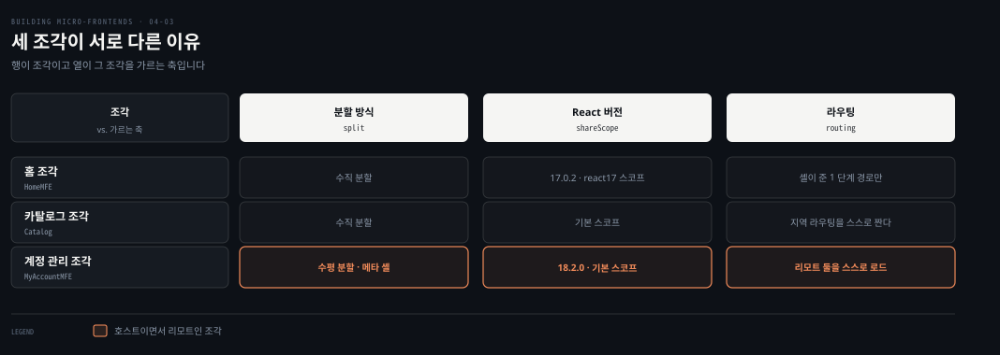
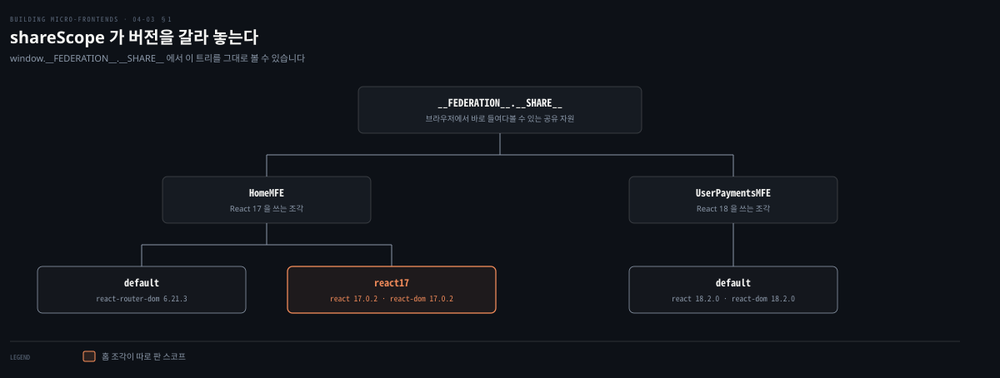
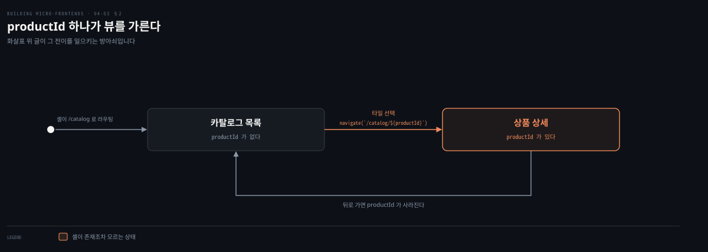
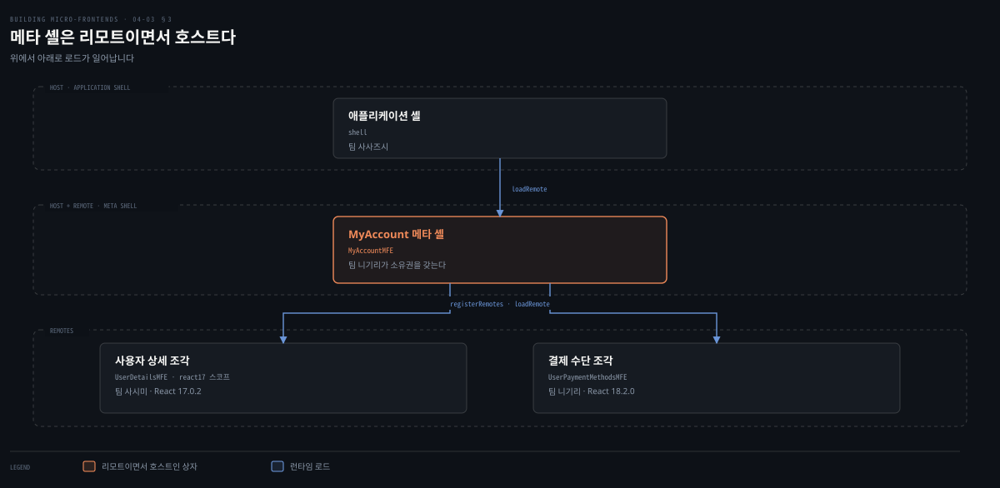
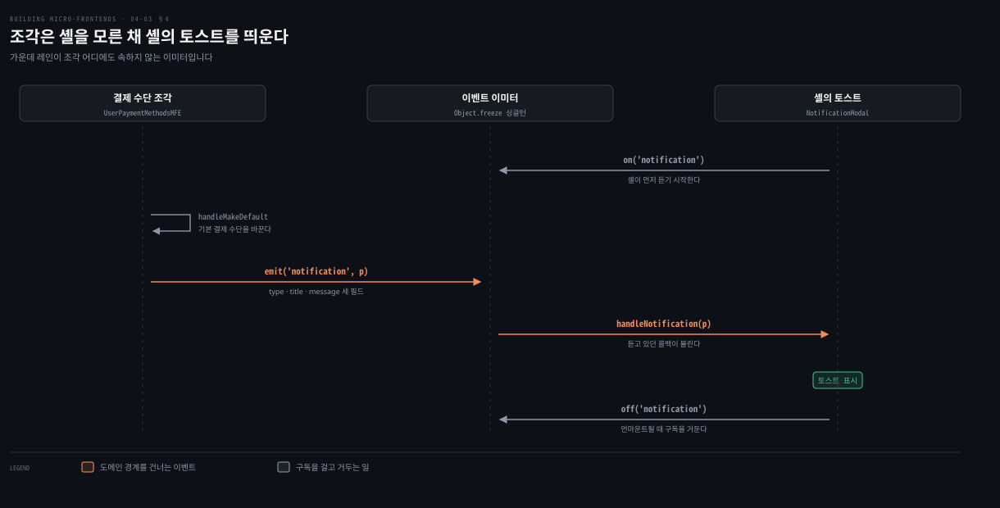

# 세 조각 — 버전과 라우팅과 메타 셸

---

> 셸이 섰으니 이제 그 안에 들어갈 조각들입니다. 홈은 React 버전을 따로 쓰고, 카탈로그는 자기 라우팅을 스스로 짜며, 계정 관리는 셸을 하나 더 세웁니다. 셋 다 같은 프로젝트인데 셋 다 다른 이유가 이 편의 내용입니다.

## 핵심 요약

> 이 편이 매달린 하나의 생각은 **조각마다 다르게 지어도 되는 것이 아니라, 조각마다 다르게 지을 수 있어야 조각인 것**이라는 점입니다.

그 능력이 세 조각에서 각각 다른 모습으로 나타납니다. 홈 조각은 `shareScope`로 자기 스코프를 따로 파서 나머지가 React 18을 쓰는 동안 혼자 17을 씁니다. 카탈로그는 수직 분할이라 여러 뷰를 자기 안에 갖고 셸은 1단계 경로까지만 알며 `productId`부터는 조각의 몫입니다. 계정 관리는 두 팀이 만나는 자리라 메타 셸을 하나 더 두는데, 이 호스트는 셸에게는 리모트이고 두 조각에게는 호스트입니다.

능력이 있다는 것과 그것에 기대라는 것은 다릅니다. 저자는 버전을 갈라 쓰는 능력에 최적화하지 말라고 곧바로 말립니다. 라이브러리 비호환을 여럿 겪었고 즐겁지 않았다는 것이 그 이유입니다. 조각 사이 통신도 같은 절제를 요구해서 `Object.freeze`로 굳힌 이벤트 이미터 싱글턴만 두고, 전역 상태 관리자는 쓰지 말라고 거듭 못 박습니다.


## 학습 목표

이 내용을 읽고 나면:

1. `shareScope`가 버전 충돌을 막는 방식과 그것을 남용하지 말라는 이유를 설명할 수 있습니다.
2. 브라우저에서 공유 자원을 들여다보는 방법과 그 출력을 읽을 수 있습니다.
3. 지역 라우팅이 전역 라우팅과 만나는 지점을 코드로 재현할 수 있습니다.
4. 메타 셸이 무엇이고 왜 그것을 남용하면 안 되는지 말할 수 있습니다.
5. 이벤트 이미터를 싱글턴으로 굳히는 이유와 이벤트 설계 규칙을 댈 수 있습니다.

아래는 이 편이 다루는 조각 셋을 같은 축으로 세운 지도입니다. 같은 프로젝트인데 세 줄이 모두 다릅니다.




## 1. 홈 조각 — 라이브러리 버전을 따로 쓴다

> 홈 조각에는 조각다운 코드가 없습니다. 저자가 여기에 일부러 하나를 얹습니다.



### 풀려는 문제

저자가 상황으로 설명합니다. 우리 팀에 처리할 스토리가 산더미인데 애플리케이션 셸 팀에서 React를 18로 올려 달라는 요청이 옵니다. 마감이 빠듯하면 그 갱신을 위한 스토리를 하나 더 만들고 싶지 않습니다. 더 중요한 기능이 밀릴 위험이 있기 때문입니다. 그사이 다른 팀들은 이미 자기 조각을 금세 최신 버전으로 올렸을 수 있습니다.

이 위험을 피하려고 조각의 다른 능력을 꺼내 씁니다. **같은 애플리케이션 안에서 서로 다른 라이브러리 버전을 관리하는 능력**입니다.

### shareScope로 스코프를 판다

홈 페이지의 Webpack 설정이 셸의 것과 다릅니다.

```javascript
new ModuleFederationPlugin({
  name: 'HomeMFE',
  filename: 'remoteEntry.js',
  exposes: { './MFE': './src/App' },
  shared: {
    'react-router-dom': { singleton: true, requiredVersion: '6.21.3' },
    react: {
      import: 'react', shareScope: 'react17',
      singleton: true, requiredVersion: '17.0.2'
    },
    'react-dom': {
      import: 'react-dom', shareScope: 'react17',
      singleton: true, requiredVersion: '17.0.2'
    }
  }
})
```

`shareScope` 속성으로 다른 스코프를 만들었습니다. Module Federation 용어로는 컨테이너입니다. 이 속성이 조각으로 하여금 React와 ReactDOM을 그 스코프에 붙이게 해서, **나머지 라이브러리가 쓰는 기본 스코프와 버전이 부딪히지 않게** 합니다.

React Router DOM만 기본 스코프에서 가져옵니다. 그 버전이 React 17과 18 모두에서 문제없이 동작하기 때문입니다.

### 브라우저에서 확인한다

Module Federation 2.0은 공유 자원을 브라우저 개발자 도구로 들여다보는 길을 줍니다. 모든 공유 자원이 `window.__FEDERATION__.__SHARE__` 객체에 있습니다.

이 객체가 담는 것이 셋입니다. 조각 이름으로 정리된 모든 공유 의존성, 자원마다의 버전 정보, 그리고 공유 모듈의 현재 상태입니다.

```javascript
// HomeMFE 의 공유 자원을 본다
window.__FEDERATION__.__SHARE__.HomeMFE
```

저자가 실제 출력을 보여 줍니다.

```pseudocode
window.__FEDERATION__.__SHARE__.HomeMFE
  HomeMFE:1.0.0:
    default: {react-dom: {...}, react-router-dom: {...}, react: {...}}
    react17:
      react: {17.0.2: {...}}
      react-dom: {17.0.2: {...}}

window.__FEDERATION__.__SHARE__.UserPaymentsMFE
    default:
      react: {18.2.0: {...}}
      react-dom: {18.2.0: {...}}
      react-router-dom: {6.21.3: {...}, 6.30.0: {...}}
```

이것이 쓸모 있는 곳으로 저자가 넷을 듭니다. 공유 의존성을 디버깅할 때, 버전 공유가 제대로 되는지 확인할 때, React 17과 18의 격리가 잘 됐는지 확인할 때, 그리고 Module Federation이 런타임에 공유 자원을 어떻게 관리하는지 이해할 때입니다. 내부를 깊이 파고들지 않고도 설정을 검증하는 편리한 방법이라고 평합니다.

> 저자가 여기에 참고를 답니다. 라이브러리를 격리하는 능력은 import maps의 스코프나 SystemJS 같은 다른 접근에도 있습니다. 이 능력이 좋은 이유는 Native Federation이나 single-spa처럼 웹 표준을 활용하는 여러 라이브러리에 퍼져 있기 때문입니다.

### 읽어내기 — 할 수 있다와 해도 된다는 다르다

저자가 이 절을 닫는 말이 단호합니다. **여러 라이브러리 버전을 같은 애플리케이션에서 다룰 수 있지만, 이 접근에 최적화하지 말라**는 것입니다.

근거가 경험입니다. 이 데모를 만들면서 라이브러리 사이의 비호환을 여럿 만났고 전혀 즐겁지 않았다고 적습니다. 게다가 사용자가 필요로 하는 것보다 많은 코드를 내려받게 설계하는 일은 사용자 중심과 거리가 멉니다.

그래서 이 능력의 자리를 저자가 정확히 규정합니다. **라이브러리를 갱신할 시간을 벌어 주는 장치이지, 남용할 기능이 아닙니다.**


## 2. 카탈로그 조각 — 라우팅을 스스로 짠다

> 카탈로그는 이 프로젝트에서 가장 크고 복잡한 조각입니다. 사용자가 사이트에 오는 이유이기 때문입니다.



### 풀려는 문제

카탈로그 도메인은 쓰기 쉬워야 할 뿐 아니라 사용자가 찾는 정보를 모두 제공해야 합니다. 팀 마키가 이 조각을 맡고, 목표는 여러 뷰를 구현해 사용자가 카탈로그에 무엇이 있는지 발견하고 상품마다 상세를 보게 하는 것입니다.

앞으로 기능이 더 붙을 수도 있습니다. 구매자가 찍은 상품 이미지를 공유하거나 리뷰 점수와 댓글을 다는 일입니다. 그래서 팀은 이 기능들을 구현하면서 코드베이스를 모듈적으로 준비합니다. **나중에 도메인의 일부를 다른 팀에 넘겨주기 쉽도록** 하기 위해서입니다. 강한 캡슐화와 견고한 모듈성이 그 분리를 쉽게 만듭니다.

### 수직 분할 조각의 특징

이 수직 분할 조각의 특이한 점은 **같은 조각 안에서 여러 뷰를 다뤄야 한다**는 것입니다. 카탈로그 도메인에 한정된 일종의 SPA인 셈입니다. 그렇다고 다른 팀이 만든 공유 컴포넌트나 도메인 전용 컴포넌트를 이 도메인 안에 넣지 못하는 것은 아닙니다. 개인화 상품 컴포넌트 같은 것이 그 예입니다.

애플리케이션 셸이 전역 라우팅을 맡고 있지만, 이 조각은 **지역 라우팅**을 구현해야 합니다. 조각 수준에서 구현되어 전역 라우팅과 함께 동작하는 라우팅입니다.

```javascript
function Catalog() {
  const navigate = useNavigate();
  const { productId } = useParams();

  const handleViewDetails = (productId) => {
    navigate(`/catalog/${productId}`);
  };

  // productId 파라미터가 있으면 상품 상세를 보여 준다
  if (productId) {
    return <ProductDetails productId={productId} />;
  } else {
    console.log('No productId found');
  }
```

React Router로 먼저 URL의 첫 단계 깊이를 가져옵니다. 그리고 사용자가 특정 상품을 고르면 그 깊이에 상품 ID를 덧붙입니다.

### 읽어내기 — 2단계부터는 다른 팀이 모른다

저자가 여기에 결론을 답니다. **두 번째 단계부터는 구조와 관리가 대개 조각 안에서 전부 처리됩니다.** 그래서 도메인이 자율적으로 진화할 수 있고, 개선을 다른 팀과 조율할 필요가 사라집니다.

여기에 하나가 더 딸려 옵니다. 전역 라우팅을 한 팀만 책임지므로 **도메인들이 1단계 URL을 겹쳐 쓰는 일이 생기지 않습니다.**

이런 식으로 앞으로의 분할 가능성에 대비한 코드베이스를 큰 수고 없이 준비합니다. 저자가 마지막으로 덧붙이는 것이 쿼리 스트링의 용도입니다. 다른 뷰나 다른 조각에 잠깐 쓰고 버릴 정보를 넘기기에 좋은 수단이라는 것입니다. 이런 데이터는 시스템의 다른 부분이 즉시 소비하고 오래 저장할 필요가 없으므로, **쿼리 스트링으로 넘기는 방식이 강하게 권장됩니다.**


## 3. 계정 관리 조각 — 셸을 하나 더 세운다

> 두 팀의 도메인이 한 화면에서 만납니다. 여기서 이 프로젝트의 유일한 수평 분할이 나옵니다.



### 풀려는 문제

결제 서브도메인을 맡은 팀 니기리와 사용자 계정을 맡은 팀 사시미가 계정 관리 뷰에서 협업해야 합니다. 결제 정보의 일부와 사용자 상세의 일부가 같은 뷰로 모이기 때문입니다.

이 도메인들이 서로 다른 팀에 배정돼 있으므로 다른 조각들과는 다른 접근이 필요합니다. 수직 분할 대신 **수평 분할로 최종 뷰를 구성하고, 특정 사용자 상호작용에서 두 도메인이 서로 통신하게** 합니다. 그러려면 새 호스트 하나와 리모트 둘이 필요합니다.

### 새 호스트는 누가 갖는가

리모트마다 팀이 붙는다는 것은 알지만 새 호스트는 어떻게 할지가 남습니다. 두 팀이 함께 이 공통 컨테이너를 어떻게 평가할지 전략을 정합니다.

새 호스트가 하는 일은 명확합니다. 사용자 상세와 결제 상세, 두 조각을 로드하는 것입니다. 그래서 **팀 니기리가 새 호스트의 소유권을 갖기로 하고**, 팀 사시미와 협력해 개발자 경험을 매끄럽게 만들고 호스트의 릴리스가 팀 사시미의 작업에 문제를 일으키지 않도록 하는 장치를 정합니다.

### 호스트와 리모트의 얇은 경계

새 호스트가 사용자에게 실제로 어디서 보이는지가 궁금해집니다. Module Federation은 호스트를 여러 겹으로 중첩할 수 있게 해 주고 엄격한 계층 구조를 강요하지 않습니다. **사실 리모트와 호스트 사이의 선은 아주 얇습니다.** 리모트가 호스트에게 라이브러리를 노출할 수 있고 그 반대도 되기 때문입니다.

저자가 이 얇은 선에 주의를 요구합니다. 그 선을 넘어 양방향으로 의존성을 공유하기 시작하면, 장기적으로 이점보다 문제를 더 만드는 유지 불가능한 코드가 됩니다. 그래서 권고가 명확합니다. **호스트와 리모트 사이에 계층 관계를 강제하고 공유는 늘 단방향으로 두어, 호스트가 리모트에게 어떤 모듈도 노출하지 않게 하라**는 것입니다.

이 단순하고 효과적인 관행이 하는 일이 셋입니다.

- 조각 아키텍처 구현이 단순해집니다.
- 잠재적 버그의 위험이 줍니다.
- 모듈 사이 결합이 줄어 디버깅이 나아집니다. 여러 모듈이 서로 의존하는 진흙 덩어리를 피한다는 뜻입니다.

### 메타 셸을 만든다

기술 쪽에서는 수평 분할을 다루려고 작은 변경 몇 가지가 필요합니다. 먼저 두 조각을 담을 컨테이너가 있어야 합니다. 가벼운 애플리케이션 셸처럼 동작하므로 **메타 셸**이라고 부릅니다.

`MyAccount` 라는 호스트를 만들어 리모트 둘을 로드합니다. 다른 조각들과 비슷한 Module Federation 설정을 갖되 차이가 하나 있습니다. `MyAccount`는 사용자 상세와 결제 조각을 다루므로 **호스트여야 하지만, 동시에 애플리케이션 셸의 리모트이기도 해야 합니다.** 그래서 노출 객체를 함께 넣습니다.

```javascript
new ModuleFederationPlugin({
  name: 'MyAccountMFE',
  filename: 'remoteEntry.js',
  exposes: { './MFE': './src/MyAccount' },
  shared: {
    react:       { singleton: true, requiredVersion: '18.2.0' },
    'react-dom': { singleton: true, requiredVersion: '18.2.0' }
  }
})
```

이 변경만으로 호스트이면서 리모트인 것이 됩니다.

### 읽어내기 — 남용하면 나노 프론트엔드가 된다

저자가 곧바로 제동을 겁니다. **이 관행을 과하게 쓰지 말라**는 것입니다. 그러면 비즈니스 도메인 전체가 아니라 개별 컴포넌트를 대표하는 작은 애플리케이션이 금세 많아집니다.

경계를 올바르게 설계하는 일이 결정적입니다. 새 조각을 만들지 기존 조각에 기능을 넣을지 확신이 서지 않으면, 다시 설계 단계로 돌아가 그 결정이 조각의 핵심 원칙에 맞는지 확인해야 합니다.

3장에서 웹 컴포넌트를 다루며 저자가 "나노 프론트엔드"라 부른 것과 같은 위험이 여기서도 나옵니다. 다른 점은 여기서는 그 미끄러짐이 기술의 성질이 아니라 **중첩의 편리함**에서 온다는 것입니다.


## 4. 조각 사이 통신 — 굳힌 싱글턴

> 결정 프레임워크가 요구하는 것은 코드를 공유하지 않으면서 정보를 나누는 일입니다. 그 구현이 여기 있습니다.



### 풀려는 문제

이 구현의 핵심 하나가 조각 사이의 통신입니다. 결정 프레임워크가 말하듯, **서로 다른 도메인에 코드를 직접 공유하지 않으면서 조각 사이에 정보를 나눠야** 합니다. 전역 상태를 쓰면 그 코드 공유가 일어납니다.

이상적인 접근이 도메인을 결합하지 않는 발행 구독 패턴입니다. 한 도메인 안에서 변경이 일어나면 그 조각이 이벤트를 던져 변화를 알립니다. 모든 조각이 접근할 수 있는 토스트 알림 시스템을 가진 애플리케이션 셸이 그 이벤트를 듣고 필요할 때 알림을 표시합니다.

### 이미터는 굳힌 싱글턴이다

조각이 애플리케이션 셸에 로드될 때 이미터가 주입됩니다. 조각 사이의 통신, 또는 조각과 셸 사이의 통신을 위해서입니다.

```javascript
return (
  <React.Suspense fallback={<div>Loading...</div>}>
    <MFE emitter={emitter} />
  </React.Suspense>
);
```

그 이미터는 단순한 싱글턴이며 `Object.freeze` 덕분에 확장할 수 없습니다.

```javascript
import { EventEmitter } from 'tseep';

class EventEmitterSingleton {
  constructor() {
    if (EventEmitterSingleton.instance) return EventEmitterSingleton.instance;
    this.emitter = new EventEmitter();
    EventEmitterSingleton.instance = this;
  }
  emit(event, data)    { this.emitter.emit(event, data); }
  on(event, callback)  { this.emitter.on(event, callback); }
  off(event, callback) { this.emitter.off(event, callback); }
}

const emitter = new EventEmitterSingleton();
Object.freeze(emitter);

export default emitter;
```

이러면 어느 조각에서든 DOM 안의 특정 위치에 기대지 않고 이벤트를 던지고 들을 수 있습니다. **커스텀 이벤트는 그 위치에 기대므로 이 점이 갈립니다.**

저자가 이미터를 고른 이유도 그 자리에서 밝힙니다. 리액티브 스트림에 비해 단순하고, 커스텀 이벤트와 달리 DOM 계층에 독립적이라는 것입니다. 그래서 **조각 사이 통신의 기본 선택지가 되어야 한다**고 적습니다.

### 실제 이벤트

사용자가 기본 결제 수단을 바꿀 때마다 `notification` 이라는 이벤트를 던집니다. 토스트가 표시할 메시지를 담아서입니다.

```javascript
handleMakeDefault = (id) => {
  const { emitter } = this.props;
  this.setState(prevState => ({
    paymentMethods: prevState.paymentMethods.map(method => ({
      ...method, isDefault: method.id === id
    }))
  }), () => {
    const defaultMethod = this.state.paymentMethods.find(m => m.id === id);
    if (emitter) {
      const notification = {
        type: 'success',
        title: 'Payment Method Updated',
        message: `${defaultMethod.brand} ending in ${defaultMethod.last4} is now your default payment method`
      };
      emitter.emit('notification', notification);
    }
  });
};
```

셸 쪽에서 그 알림을 다루는 컴포넌트를 만듭니다.

```javascript
function NotificationModal({ emitter }) {
  const [isOpen, setIsOpen] = useState(false);
  // ... type · title · message 상태 생략

  useEffect(() => {
    const handleNotification = ({ type, title, message }) => {
      setType(type); setTitle(title); setMessage(message); setIsOpen(true);
    };
    emitter.on('notification', handleNotification);
    return () => { emitter.off('notification', handleNotification); };
  }, [emitter]);

  if (!isOpen) return null;
```

이 이벤트는 제목과 유형과 메시지 셋으로 꽤 단순합니다. 셸에 있는 공유 토스트와 통신할 것이므로 모든 도메인에 두루 쓰이도록 일반적으로 유지한 것입니다. 다만 **모든 이벤트를 이런 모양으로 만들어야 한다는 뜻은 아니라고** 저자가 단서를 답니다.

### 이벤트를 설계하는 규칙

저자가 프론트엔드에서 이벤트 이미터용 이벤트를 설계할 때의 원칙을 정리합니다. 가볍고 유연하며 결합이 없는 통신을 목표로 삼습니다.

- **이름 공간을 붙여 충돌을 피합니다.** `cart:itemAdded`나 `auth:userLoggedIn` 같은 식입니다.
- **페이로드는 일관되고 예측 가능해야** 조각 사이 통합이 매끄럽습니다.
- 이미터는 **전역 이벤트와 지역 이벤트를 모두 다뤄야** 합니다. 인증 변경 같은 전역 이벤트는 셸 수준에서 방송하고, UI 상태 변경 같은 지역 이벤트는 개별 조각으로 범위를 좁힙니다.
- **강한 결합을 피하도록 설계합니다.** 조각은 다른 조각의 함수를 직접 부르지 말고 이벤트를 들어야 합니다.

### 읽어내기 — 전역 상태 관리자를 쓰지 말라

저자가 이 절에서 목소리를 높이는 대목이 하나 있습니다. **조각을 가로지르는 전역 상태 관리자를 피하는 일의 중요성은 아무리 강조해도 지나치지 않다**는 것입니다. 상태 관리는 각 조각 안에서 다뤄야 서로 독립을 유지합니다.

이 편이 보여 준 결과가 그 근거이기도 합니다. React 17을 쓰는 조각과 18을 쓰는 조각이 같은 뷰에 공존하고, 계정 관리 조각은 18을 씁니다. Module Federation이 두 버전을 충돌 없이 로드해 각 조각이 독립적으로 동작하면서도 공통 자원을 효율적으로 나눕니다.

저자가 이 장의 구현 부분을 닫으며 하는 말이 이렇습니다. 코드 구조 자체는 여러분이 고른 프레임워크로 표준 클라이언트 애플리케이션을 만드는 것과 크게 다르지 않다는 것입니다. **핵심 차이는 조각마다 명확한 경계와 책임을 정의하고 그들 사이의 효율적인 통신 전략을 세우는 데 있습니다.**


## 적용 관점

> 아래는 백엔드 개발자가 이미 가진 판단 기준과 이 절을 잇는 노트의 읽기입니다. 책이 백엔드 독자를 향해 쓴 대목이 아닙니다.

`shareScope`로 React 17과 18을 갈라 두는 방식은 클래스로더 격리와 정확히 같은 자리에 있습니다. 같은 이름의 클래스를 다른 로더에 올려 공존시키던 기법이고, 대가도 같습니다. 메모리에 두 벌이 올라가고 경계를 넘나드는 객체에서 사고가 납니다. 저자가 "할 수 있지만 최적화하지 말라"고 적은 이유를 그 경험으로 읽으면 정확합니다. 이것은 마이그레이션 기간을 버는 장치이지 정상 상태가 아닙니다.

`window.__FEDERATION__.__SHARE__`로 런타임의 공유 상태를 들여다보는 일은 액추에이터 엔드포인트로 로드된 빈과 의존성 버전을 확인하던 습관과 같습니다. 설정 파일이 무엇을 의도했는지가 아니라 런타임이 실제로 무엇을 쥐고 있는지를 봅니다. 버전 충돌이 콘솔 경고로만 나타나는 구조에서는 이 확인이 사실상 유일한 검증 수단입니다.

메타 셸은 중간 계층을 하나 더 두는 결정입니다. 여러 서비스의 응답을 한 화면 단위로 모으는 BFF와 같은 자리이고, 저자가 남용을 경계한 이유도 같습니다. 화면마다 BFF를 만들면 관리할 배포 단위가 화면 수만큼 늘어납니다. "새 조각을 만들지 기존 조각에 넣을지 확신이 안 서면 설계 단계로 돌아가라"는 조언은 새 서비스를 뽑기 전에 던지는 질문과 같습니다.

이미터를 `Object.freeze`로 굳혀 주입하는 방식은 공유 인프라를 불변으로 만들어 내려보내는 배치입니다. 다만 백엔드의 메시지 브로커와 다른 점이 하나 있습니다. **이 이미터에는 내구성도 재시도도 순서 보장도 없습니다.** 늦게 붙은 리스너는 앞선 이벤트를 못 받습니다. 저자가 셸의 토스트에서 `emitter.on`을 먼저 걸고 언마운트 때 `off`로 거두는 코드를 보인 이유가 그것입니다. 구독 수명을 컴포넌트 수명에 맞추지 않으면 누수와 유령 알림이 남습니다.


## 면접 대비

Q: 같은 페이지에서 React 17과 18을 함께 쓰려면 어떻게 하나요?

A: Module Federation의 `shareScope`로 스코프를 따로 팝니다. 홈 조각이 `shareScope: 'react17'`로 React와 ReactDOM을 별도 컨테이너에 붙이면 기본 스코프의 18과 부딪히지 않습니다. React Router DOM처럼 양쪽에서 잘 도는 라이브러리는 기본 스코프에 그대로 둡니다. 다만 저자는 이 능력에 최적화하지 말라고 말립니다. 라이브러리 비호환을 여럿 겪었고 사용자가 필요 이상의 코드를 받게 되기 때문입니다.

Q: 전역 라우팅과 지역 라우팅은 어디서 갈리나요?

A: URL 깊이에서 갈립니다. 애플리케이션 셸은 `/catalog` 같은 1단계 경로까지만 알고 그에 맞는 조각을 로드합니다. 그 아래 `productId` 부터는 조각이 자기 안에서 관리합니다. 카탈로그 조각은 `useParams`로 `productId`를 읽어 있으면 상세를, 없으면 목록을 그립니다. 이 분리 덕분에 도메인이 자율적으로 진화하고 1단계 URL이 팀 사이에 겹치지 않습니다.

Q: 메타 셸이란 무엇이고 왜 필요한가요?

A: 수평 분할 뷰에서 조각 둘을 담는 가벼운 호스트입니다. 계정 관리 뷰는 결제 팀과 계정 팀의 조각이 만나므로 `MyAccountMFE`라는 호스트를 하나 더 둡니다. 이것은 애플리케이션 셸에게는 리모트이고 두 조각에게는 호스트입니다. `exposes`를 함께 넣으면 그렇게 됩니다. 다만 남용하면 비즈니스 도메인이 아니라 컴포넌트 수준의 작은 애플리케이션이 늘어나므로 경계 설계가 중요합니다.

Q: 조각 사이 통신에 이벤트 이미터를 쓰는 이유는 무엇인가요?

A: 리액티브 스트림보다 단순하고, 커스텀 이벤트와 달리 DOM 계층에 독립적이기 때문입니다. 저자는 이것이 조각 사이 통신의 기본 선택지여야 한다고 적습니다. 구현은 `Object.freeze`로 굳힌 싱글턴이고 조각이 로드될 때 주입됩니다. 그리고 조각을 가로지르는 전역 상태 관리자는 쓰지 말아야 합니다. 상태 관리를 각 조각 안에 두어야 독립이 유지되기 때문입니다.

### 요약 세 문장

1. 홈 조각은 `shareScope`로 React 17을 따로 쓰지만, 저자는 그것을 갱신 시간을 버는 장치일 뿐 최적화 대상이 아니라고 못 박습니다.
2. 카탈로그는 셸이 준 1단계 경로 아래를 스스로 라우팅하며, 그 덕분에 도메인이 다른 팀과 조율 없이 진화합니다.
3. 계정 관리는 메타 셸을 하나 더 두어 두 팀의 조각을 담고, 그 조각들은 굳힌 이벤트 이미터로만 말합니다.


## 핵심 개념 체크리스트

- [ ] `shareScope`가 무엇을 갈라 놓는지와 무엇이 기본 스코프에 남았는지 말할 수 있는가?
- [ ] `window.__FEDERATION__.__SHARE__` 출력에서 스코프와 버전을 읽을 수 있는가?
- [ ] 여러 버전 공존을 저자가 말리는 이유 둘을 댈 수 있는가?
- [ ] 카탈로그의 지역 라우팅이 `productId`로 갈리는 코드를 재현할 수 있는가?
- [ ] 메타 셸이 호스트이면서 리모트가 되는 설정 한 줄을 말할 수 있는가?
- [ ] 이벤트 설계 규칙 넷과 전역 상태 관리자를 피하는 이유를 설명할 수 있는가?


## 관련 문서

- [애플리케이션 셸 — 호스트가 하는 일](04-02.애플리케이션%20셸%20—%20호스트가%20하는%20일.md) — 이 조각들을 로드하고 이미터를 주입하는 쪽
- [수평 분할 — 한 화면을 여럿이 나눌 때의 값](03-04.수평%20분할%20—%20한%20화면을%20여럿이%20나눌%20때의%20값.md) — 계정 관리 뷰가 따르는 규약과 공유 상태 안티패턴
- [웹 컴포넌트와 Web Fragments — 표준으로 감싼다](03-07.웹%20컴포넌트와%20Web%20Fragments%20—%20표준으로%20감싼다.md) — 나노 프론트엔드라는 같은 위험이 다른 기술에서 나오는 자리
- [Building Micro-Frontends 정독 인덱스](README.md) — 다음 편인 진화와 호스팅의 진행 상태는 인덱스의 노트 표에서 봅니다


## 참고 자료

- 《Building Micro-Frontends, Second Edition》(Luca Mezzalira, O'Reilly, 2026) ISBN 978-1-098-17078-3
  - 다룬 범위: Home Micro-Frontend · Catalog Micro-Frontend · Account Management Micro-Frontend
  - 이어서: Project Evolution · Hosting · Caching · Summary
- [tseep](https://github.com/Morglod/tseep) — 저자의 이미터 코드가 임포트하는 라이브러리
