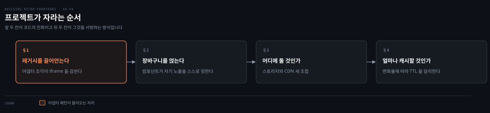
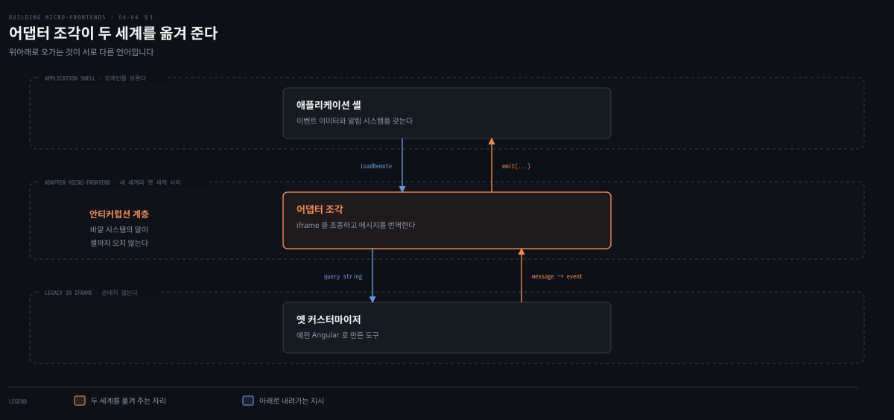
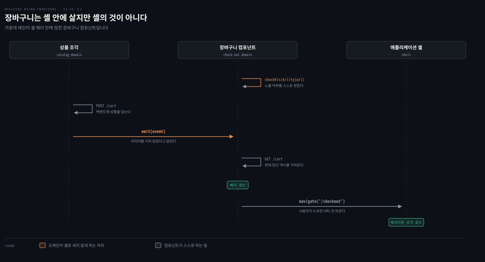
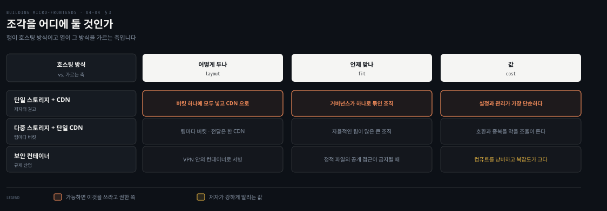

# 진화와 호스팅 — 레거시와 장바구니와 CDN

---

> 짧은 기간만 도는 프로젝트를 만들 생각은 없습니다. 이 편은 만들어 둔 것 위에 레거시를 끌어안고 새 기능을 얹는 두 시나리오를 따라가고, 그 산출물을 어디에 두고 얼마나 캐시할지로 4장을 닫습니다.

## 핵심 요약

> 이 편이 매달린 하나의 생각은 **진화의 관건이 새 코드를 어디에 쓰느냐가 아니라 도메인이 셸로 새지 않게 어디에 막느냐**라는 것입니다.

레거시 Angular 도구는 iframe에 가두고 그 iframe을 조각 하나가 감싸 어댑터로 씁니다. 셸을 직접 잇지 않는 이유가 셸의 코드베이스를 오염시키지 않기 위해서입니다. 이 배치가 안티커럽션 계층이 되고 레거시를 하나씩 걷어내는 스트랭글러 무화과 패턴의 발판이 됩니다. 장바구니도 같은 원리로 셸 헤더에 얹히지만 노출 여부는 스스로 판단합니다. 셸이 판단하면 체크아웃 도메인이 셸로 새기 때문입니다.

호스팅은 셋 가운데 단일 스토리지와 CDN을 저자가 권하고, 컨테이너로 정적 파일을 서빙하는 일은 강하게 말립니다. 캐시는 조각의 변화율에 따라 TTL을 다르게 줍니다. 1분짜리 TTL도 오리진 트래픽을 줄입니다.

## 학습 목표

이 내용을 읽고 나면:

1. 레거시를 iframe에 넣고 조각으로 감싸는 이유를 셸의 관점에서 설명할 수 있습니다.
2. 어댑터 패턴이 안티커럽션 계층과 스트랭글러 무화과로 이어지는 흐름을 말할 수 있습니다.
3. 장바구니 컴포넌트가 자기 노출을 스스로 정해야 하는 이유를 댈 수 있습니다.
4. 호스팅 세 방식을 구분하고 저자의 권고와 그 근거를 설명할 수 있습니다.
5. 조각의 변화율에 따라 TTL을 어떻게 다르게 줄지 판단할 수 있습니다.

아래는 이 편의 절 넷을 읽는 순서로 이은 지도입니다. 앞 둘이 코드의 진화이고 뒤 둘이 그것을 서빙하는 방식입니다.

## 1. 레거시를 끌어안는다

> 새로 만들 수 없는 것을 옆에 두는 방법입니다. 저자는 그 방법이 셸을 건드리지 않는 데 있다고 봅니다.

### 풀려는 문제

이커머스에 기존 상품을 꾸미는 도구를 더해야 합니다. 양말과 후디와 머그컵 같은 것을 커스터마이즈하는 도구입니다. 그런데 그것이 **몇 해 전에 옛 버전 Angular로 만든 레거시 애플리케이션**입니다.

이 해법을 개발한 팀에서 지금 회사에 남은 사람이 하나뿐이고, 그 사람이 버그를 고치고 가능한 데서 코드를 다듬으며 불을 꺼뜨리지 않고 있습니다.

기능의 출시 시점을 앞당기려고 비즈니스와 기술 부서가 결정을 내립니다. 이 레거시 도구를 기존 조각 아키텍처와 통합해 한시적으로 내보내고, 나중에 새 팀이 프로젝트를 인수해 조각을 제대로 품도록 다시 만드는 것입니다.

다행히 그 애플리케이션은 캡슐화가 잘 돼 있습니다. 자기가 도는 환경에 관해 특별한 정보를 요구하지 않고, 파일을 렌더하는 데 필요한 설정은 쿼리 스트링으로 커스터마이저에 넘길 수 있습니다. 그리고 애플리케이션 셸 같은 다른 부분과의 충돌은 최소화하고 싶습니다.

### 먼저 iframe으로 가둔다

이 문제를 푸는 방법이 레거시를 iframe으로 감싸는 것입니다. 그러면 기존 조각 시스템과의 어떤 충돌도 막을 수 있습니다.

3장에서 iframe을 다루며 저자가 든 세 유스케이스 가운데 하나가 정확히 이것이었습니다. 활발히 개발되지 않고 지원 모드에 있는 애플리케이션을 새 애플리케이션 옆에 두는 경우입니다.

### 그러나 셸과 직접 잇지 않는다

그런데 레거시와 통신해야 할 일이 생깁니다. iframe 안에서만이 아니라 인터페이스 전체에 에러를 표시하려는 경우입니다. 그러려면 레거시와 애플리케이션 셸 사이에 통신 다리를 놓아 셸의 알림 시스템을 재사용해야 합니다.

셸을 레거시와 직접 통합할 수도 있습니다. **그런데 그러면 셸의 코드베이스가 오염됩니다.**

저자가 내놓는 더 나은 전략이 어댑터 패턴입니다. **조각 하나를 레거시를 담은 iframe의 컨테이너로 쓰는 것**입니다. 그 조각이 지는 일이 둘입니다.

- 쿼리 스트링으로 iframe을 오케스트레이션합니다.
- 레거시가 보내는 메시지를 가로채 이벤트 버스에 던지는 이벤트로 번역합니다.

> 어댑터 패턴은 기존 클래스의 인터페이스를 다른 인터페이스로 쓰게 해 주는 소프트웨어 디자인 패턴입니다. 래퍼라고도 불립니다. 소스 코드를 고치지 않고 기존 클래스를 다른 것들과 함께 동작시킬 때 자주 씁니다.

### 읽어내기 — 이 배치가 여는 두 가지

조각을 어댑터로 쓰면 프로젝트를 앞으로의 진화에 대비시킬 수 있습니다. 애플리케이션 셸의 리팩토링도 줄어듭니다. 처음 레거시를 통합할 때도, 나중에 그것을 새 조각 구현으로 갈아 끼울 때도 그렇습니다.

셸 안에는 비즈니스를 모르는 로직만 남습니다. 통신이 이벤트 이미터를 거쳐 이벤트로 번역되기 때문입니다. **이 과정이 안쪽 시스템과 바깥 시스템 사이의 안티커럽션 계층 역할을 합니다.**

여기서 하나가 더 열립니다. 여러 애플리케이션을 같은 시스템 아래로 모으고 레거시를 하나씩 조각으로 갈아 치우고 싶을 때 이 패턴이 쓸모 있습니다. **스트랭글러 무화과 패턴**을 구현하는 것이고, 그 덕분에 조각 애플리케이션이 레거시와 나란히 살 수 있습니다.

## 2. 장바구니를 얹는다

> 프로젝트가 조직 안에서 힘을 얻고 체크아웃을 만들 차례입니다. 그런데 장바구니를 어디에 둘지가 문제가 됩니다.

### 풀려는 문제

팀 니기리가 체크아웃 절차를 개발합니다. 제품 책임자와 UX 팀이 장바구니를 애플리케이션 셸 헤더 안에 두기로 정했습니다. **장바구니는 사용자가 쇼핑몰에 인증했을 때만 보여야 하므로, 그 컴포넌트는 특정 뷰에서만 보여야 합니다.** 장바구니 버튼을 누르면 새 체크아웃 조각이 사용자를 주문 절차로 데려갑니다.

장바구니 컴포넌트가 지는 책임이 셋입니다.

- 사용자가 이동한 영역에 따라 자기를 숨기거나 드러냅니다.
- 장바구니에 담긴 항목의 총 개수를 표시합니다.
- 체크아웃 경험을 시작합니다.

### 노출 여부를 누가 정하는가

장바구니가 애플리케이션 셸 안에 있으므로, 사용자가 인증되지 않았을 때 숨기고 인증됐을 때 보여 주는 로직이 필요합니다.

셸이 그 컴포넌트의 노출 여부를 오케스트레이션할 수도 있습니다. **그러면 체크아웃 도메인 로직이 셸로 새어 들어 코드베이스를 오염시킵니다.** 게다가 노출 로직을 바꿀 때마다 셸을 새 버전으로 릴리스해야 합니다. 체크아웃 경험과 셸을 서로 다른 팀이 소유하고 있으므로, 이런 의존을 만드는 일은 이점보다 문제를 더 낳습니다.

더 나은 해법은 이렇습니다. **셸 팀에게 컴포넌트를 넣어 달라고 부탁하고, 컴포넌트가 페이지 URL 같은 조건에 따라 자기 노출을 스스로 다루는 것**입니다. 그러면 어떤 로직 변경이나 개선도 컴포넌트 안에서 일어나고 구현 세부가 셸로 새지 않습니다.

셸 팀이 할 일도 명확해집니다. 컴파일 시점 구현을 썼다면 컴포넌트를 로드하는 데 쓰는 라이브러리를 갱신해야 합니다. **Module Federation을 쓰는 경우에는 새 컴포넌트가 런타임에 로드되므로 아무것도 하지 않아도 됩니다.**

### 개수와 이동

담긴 항목의 총 개수를 표시하려면 먼저 백엔드가 노출한 API로 상품을 장바구니에 넣고, 그다음 장바구니 컴포넌트에 인터페이스의 값을 갱신하라고 알려야 합니다. 이것을 이루는 최선의 방법이 **이벤트 이미터 인스턴스로 이벤트를 던지는 것**입니다. 장바구니 컴포넌트가 그 이벤트를 받으면 API를 소비해 현재 담긴 항목 수를 가져옵니다.

마지막으로 사용자가 장바구니 컴포넌트를 눌러 체크아웃을 시작할 때 필요한 것은 URL을 바꾸는 일뿐입니다. 그것이 애플리케이션 셸에게 체크아웃 조각으로 넘어가라고 알립니다.

### 읽어내기 — 작은 요소에 미리 들이는 시간

저자가 이 절을 닫는 말이 담백합니다. 장바구니 컴포넌트 같은 단순한 요소의 구현을 미리 조금 생각해 두는 일이 **긴 안목에서 큰 차이를 만든다**는 것입니다.

이 컴포넌트는 다른 도메인인 애플리케이션 셸 안에 살면서도 강한 캡슐화를 유지합니다. 시스템의 다른 부분에서 오는 이벤트를 이미터로 받고 사용자를 체크아웃 경험으로 라우팅합니다. 조각의 원칙을 따르면 새로운 방식으로 생각하게 됩니다. 개발자 경험이 나아지고 다른 영역으로 도메인이 새는 일도 피하게 됩니다.

## 3. 어디에 둘 것인가

> 조각을 만들었으면 어딘가에 놓아야 합니다. 저자가 팀들에게서 본 방식은 셋입니다.

### 풀려는 문제

클라이언트 사이드 렌더링 조각을 호스팅할 때 팀들이 대체로 따르는 접근이 셋입니다. 저자가 스토리지라고 말할 때는 AWS S3 같은 해법을 떠올리면 됩니다. 각 접근에 저마다의 장점과 트레이드오프가 있고, 옳은 선택은 대개 조직의 구조와 요구에 달려 있습니다.

### 세 방식

**단일 스토리지와 CDN**은 모든 조각을 클라우드 스토리지 버킷 같은 한 곳에 저장하고 CDN으로 서빙합니다. 배포 파이프라인이 한곳에 모이고 팀 사이 일관성이 보장되므로 구현과 관리가 단순합니다. 이커머스 플랫폼에서 홈 페이지와 상품 페이지와 체크아웃 흐름이 별개 조각이라면, 모두 한 버킷에 두고 CloudFront 같은 CDN으로 전 세계에 서빙합니다. **거버넌스가 단순해지고 배포를 이해하기 쉬우며 엣지 캐싱으로 성능도 확보됩니다.** 팀들이 긴밀히 통합돼 있고 거버넌스가 하나로 묶인 조직에 가장 잘 맞습니다.

**다중 스토리지와 단일 CDN**은 팀마다 자기 조각 스토리지를 갖되 전달은 하나의 CDN으로 합니다. 개별 팀에 더 큰 자율을 주면서도 공유된 전달 수단의 성능 이점은 그대로 누립니다. 항공과 호텔과 렌터카를 별개 팀이 맡는 여행 예약 플랫폼이 그 예입니다. 각 팀이 자기 버킷을 유지하면서 같은 CDN에 기댑니다. 다만 **호환성을 보장하고 인프라 구축과 유지의 중복을 피하려면 팀 사이 조율이 더 필요합니다.**

**보안 컨테이너 호스팅**은 금융이나 헬스케어처럼 정적 파일을 공용 인터넷으로 접근하는 일이 허용되지 않는 고도로 규제된 산업에서 씁니다. 조각을 VPN 같은 수단으로만 접근되는 보안 네트워크 안의 컨테이너에 호스팅합니다. 금융 기관이 계정 관리나 컴플라이언스 보고용 내부 대시보드를 이 방식으로 두는 경우입니다. 엄격한 보안 통제가 되는 대신 인프라 관리의 복잡도가 크게 늘고, **컨테이너가 정적 파일 서빙에 최적화돼 있지 않아 컴퓨트 자원을 낭비합니다.**

### 읽어내기 — 저자가 권하는 것과 말리는 것

저자의 권고가 분명합니다. **가능하면 단일 스토리지와 CDN을 쓰라**는 것입니다. 설정이 쉽고 관리가 단순하며 운영 부담이 적습니다. 명확한 거버넌스를 주고 팀 사이 일관성을 보장하면서 성능도 훌륭합니다.

다중 스토리지 방식은 분산된 팀에 더 큰 유연성을 주지만, 중복을 피하고 산출물 사이 호환을 유지하려면 신중한 조율이 필요합니다. 더 크거나 자율적인 팀이 많아 자기 조각을 더 통제해야 하는 조직에 맞습니다.

말리는 쪽은 더 강합니다. **규제 산업처럼 정말 어쩔 수 없는 경우가 아니면 컨테이너로 정적 파일을 서빙하지 말라**고 거듭 적습니다. 컨테이너는 애플리케이션을 돌리도록 설계됐지 정적 자산을 서빙하도록 설계되지 않았습니다. 불필요한 컴퓨트를 소비하고 인프라 복잡도를 크게 올리면서, CDN이나 클라우드 스토리지 같은 더 단순한 해법에 비해 의미 있는 이점을 주지 않습니다.

## 4. 얼마나 캐시할 것인가

> 호스팅 방식을 정했으면 남는 것이 캐시 수명입니다. 저자는 그것을 조각마다 다르게 주라고 말합니다.

### 풀려는 문제

클라이언트 사이드 렌더링 조각을 호스팅할 때의 핵심 최적화 하나가, **조각마다 변화율에 따라 CDN 캐시의 TTL 값을 다르게 설정하는 것**입니다. 이 전략이 성능과 신선도의 균형을 잡습니다. 자주 갱신되는 조각은 최신을 유지하고, 덜 변하는 조각은 긴 캐시 기간의 이점을 누립니다.

### 변화율에 따라 가른다

| 조각의 성격 | TTL | 저자가 든 예 |
|---|---|---|
| 변화율이 낮다 | 길게 | 1950년대 Formula 1 순위를 보여 주는 조각이나 보관된 상품 상세. 거의 바뀌지 않으므로 오래 캐시하면 서버 부하가 줄고 응답이 빨라집니다 |
| 자주 갱신된다 | 짧게 | 속보 구역이나 실시간 재고 표시. 같은 이커머스에서 실시간 재고나 프로모션 배너가 여기 듭니다 |

저자가 짧은 쪽에 붙인 단서가 실무적입니다. **1분짜리 TTL만으로도 오리진으로 가는 트래픽을 줄이고 클라이언트 응답 시간을 개선합니다.** 그러니 캐시를 제대로 설정하는 일을 잊지 말라는 것입니다.

### 4장을 닫으며

저자가 장을 마무리하며 적은 것이 둘입니다.

첫째, 이 장에서 조각 결정 프레임워크가 실제로 도는 것을 봤습니다. 모든 팀이 제품 팀이 내놓은 요구를 이루는 데 맞는 접근을 식별했습니다. **결합을 끊은 접근을 유지했고, 그 길이 독립성과 비즈니스 변화에 대한 빠른 대응을 보장한다는 것을 알고 그렇게 했습니다.** 그 여정에서 Webpack과 Module Federation으로 조각 아키텍처를 기술적으로 구현하는 것도 함께 봤습니다.

둘째가 이 장의 태도입니다. 이것은 3장에서 언급한 여러 접근 가운데 하나입니다. 프레임워크와 기술마다 자기 구현 난제를 갖습니다. **각 구현을 평가하는 것보다 어떤 결정이 왜 내려졌는지를 따라가는 편이 훨씬 값지다**는 것이 저자의 판단입니다. 그렇게 하면 이 여정에서 배운 것만 따라가도 한 프레임워크에서 다른 프레임워크로 쉽게 옮겨 갈 멘탈 모델을 갖게 됩니다.

## 적용 관점

> 아래는 백엔드 개발자가 이미 가진 판단 기준과 이 절을 잇는 노트의 읽기입니다. 책이 백엔드 독자를 향해 쓴 대목이 아닙니다.

레거시를 iframe에 가두고 그 앞에 어댑터 조각을 세우는 배치는 이름 그대로 안티커럽션 계층입니다. 도메인 주도 설계에서 외부 시스템의 모델이 우리 모델로 새어 들지 않게 번역 계층을 두던 것과 같고, 저자도 그 이름을 그대로 씁니다. 다른 점은 번역 대상입니다. 데이터 모델이 아니라 `postMessage`로 오는 메시지를 이벤트로 옮깁니다.

스트랭글러 무화과도 그대로입니다. 레거시를 한 번에 걷어내지 않고 경계를 세운 뒤 새 기능부터 바깥에서 자라게 합니다. 백엔드에서 프록시가 하던 라우팅 역할을 여기서는 셸의 전역 라우팅이 합니다. 3장의 iframe 편에서 이미 같은 이야기를 봤고, 4장은 그것을 실제 코드 배치로 내려놓은 셈입니다.

장바구니 컴포넌트가 자기 노출을 스스로 정한다는 결정은 권한 판단을 어디에 두느냐의 문제와 같습니다. 게이트웨이가 모든 화면의 노출 규칙을 알면 규칙이 바뀔 때마다 게이트웨이를 배포해야 합니다. 그 판단을 소유한 서비스로 내리면 배포 결합이 끊깁니다. 저자가 "셸을 새 버전으로 릴리스해야 한다"를 근거로 든 것이 정확히 그 계산입니다.

호스팅 세 방식은 아티팩트 저장소 전략과 대응됩니다. 하나의 레지스트리로 모으면 거버넌스가 쉽고, 팀마다 레지스트리를 두면 자율이 커지는 대신 호환을 맞추는 일이 늘어납니다. 컨테이너로 정적 파일을 서빙하지 말라는 조언은 굳이 대응을 찾자면, 정적 리소스를 애플리케이션 서버가 직접 서빙하지 말고 웹 서버나 CDN에 맡기던 오래된 규칙과 같습니다.

TTL을 변화율에 따라 가르는 것도 캐시 설계의 기본입니다. 다만 프론트엔드에서는 캐시 대상이 데이터가 아니라 **코드**라는 점이 다릅니다. 잘못 잡은 TTL은 오래된 데이터가 아니라 오래된 기능을 사용자에게 보여 줍니다. 배포했는데 반영이 안 된다는 신고가 여기서 나옵니다.

## 면접 대비

Q: 레거시 애플리케이션을 마이크로 프론트엔드 아키텍처에 통합하려면 어떻게 하나요?

A: 레거시를 iframe으로 감싸 충돌을 막고, 그 iframe을 조각 하나가 감싸 어댑터로 씁니다. 그 조각이 쿼리 스트링으로 iframe을 조종하고 레거시가 보내는 메시지를 이벤트 버스의 이벤트로 번역합니다. 셸과 레거시를 직접 이으면 셸의 코드베이스가 오염되므로 그 사이에 계층을 하나 두는 것입니다. 이 배치가 안티커럽션 계층이 되고 스트랭글러 무화과 패턴의 발판이 됩니다.

Q: 셸 헤더에 얹히는 컴포넌트의 노출 로직은 누가 가져야 하나요?

A: 컴포넌트 자신입니다. 셸이 노출 여부를 판단하면 그 도메인 로직이 셸로 새고, 규칙이 바뀔 때마다 셸을 다시 릴리스해야 합니다. 셸과 그 컴포넌트를 서로 다른 팀이 소유하므로 그 의존은 문제만 만듭니다. 컴포넌트가 페이지 URL 같은 조건으로 스스로 판단하면 변경이 컴포넌트 안에서 끝납니다. Module Federation을 쓰면 새 컴포넌트가 런타임에 로드되므로 셸 팀은 아무것도 하지 않아도 됩니다.

Q: 클라이언트 사이드 렌더링 조각을 어디에 호스팅하나요?

A: 저자가 든 방식은 셋입니다. 단일 스토리지와 CDN, 다중 스토리지와 단일 CDN, 그리고 보안 컨테이너입니다. 저자의 권고는 가능하면 첫째입니다. 설정이 쉽고 관리가 단순하며 거버넌스가 명확합니다. 둘째는 자율적인 팀이 많은 큰 조직에 맞지만 조율이 더 듭니다. 셋째는 규제 때문에 어쩔 수 없는 경우가 아니면 강하게 말립니다. 컨테이너는 정적 파일 서빙에 최적화돼 있지 않아 컴퓨트를 낭비하기 때문입니다.

Q: 조각의 CDN 캐시 TTL은 어떻게 정하나요?

A: 조각의 변화율에 따라 다르게 줍니다. 보관된 상품 상세처럼 거의 바뀌지 않는 조각은 TTL을 길게 잡아 서버 부하를 줄이고 응답을 빠르게 합니다. 실시간 재고나 프로모션 배너처럼 자주 갱신되는 조각은 짧게 잡습니다. 저자는 1분짜리 TTL만으로도 오리진 트래픽이 줄고 클라이언트 응답 시간이 개선된다고 적습니다.

### 요약 세 문장

1. 레거시는 iframe에 가두고 조각 하나로 감싸 어댑터로 쓰며, 그 배치가 안티커럽션 계층이자 스트랭글러 무화과의 발판이 됩니다.
2. 셸 안에 사는 컴포넌트도 자기 노출과 자기 데이터를 스스로 다뤄야 도메인이 셸로 새지 않습니다.
3. 호스팅은 단일 스토리지와 CDN이 기본이고, 캐시 TTL은 조각의 변화율에 따라 가릅니다.

## 핵심 개념 체크리스트

- [ ] 레거시를 셸과 직접 잇지 않는 이유를 댈 수 있는가?
- [ ] 어댑터 조각이 지는 두 가지 일을 말할 수 있는가?
- [ ] 안티커럽션 계층과 스트랭글러 무화과가 여기서 어떻게 이어지는지 설명할 수 있는가?
- [ ] 장바구니 컴포넌트의 책임 셋과 노출 판단의 소유자를 짝지을 수 있는가?
- [ ] 호스팅 세 방식과 저자의 권고를 근거와 함께 재현할 수 있는가?
- [ ] 변화율이 낮은 조각과 높은 조각의 TTL 전략을 예로 말할 수 있는가?

## 관련 문서

- [세 조각 — 버전과 라우팅과 메타 셸](04-03.세%20조각%20—%20버전과%20라우팅과%20메타%20셸.md) — 이 편이 진화시키는 대상
- [iframe — 가장 강한 격리를 사는 값](03-06.iframe%20—%20가장%20강한%20격리를%20사는%20값.md) — 레거시를 가두는 수단의 성질과 값
- [서버 사이드 — 조합을 오리진으로 옮긴다](03-08.서버%20사이드%20—%20조합을%20오리진으로%20옮긴다.md) — 캐시를 층으로 두는 같은 판단이 서버 쪽에서 나오는 자리
- [언제 서버에서 그릴 것인가](05-01.%EC%96%B8%EC%A0%9C%20%EC%84%9C%EB%B2%84%EC%97%90%EC%84%9C%20%EA%B7%B8%EB%A6%B4%20%EA%B2%83%EC%9D%B8%EA%B0%80.md) — 조합을 서버로 옮기는 다음 장

## 참고 자료

- 《Building Micro-Frontends, Second Edition》(Luca Mezzalira, O'Reilly, 2026) ISBN 978-1-098-17078-3
  - 다룬 범위: Project Evolution · Embedding a Legacy Application · Developing the Check-Out Experience
  - 이어서: Hosting a Client-Side Rendering Micro-Frontend Project · Caching · Summary
- [Strangler Fig Application](https://martinfowler.com/bliki/StranglerFigApplication.html) — Martin Fowler, 저자가 이름을 든 패턴의 원 출처
