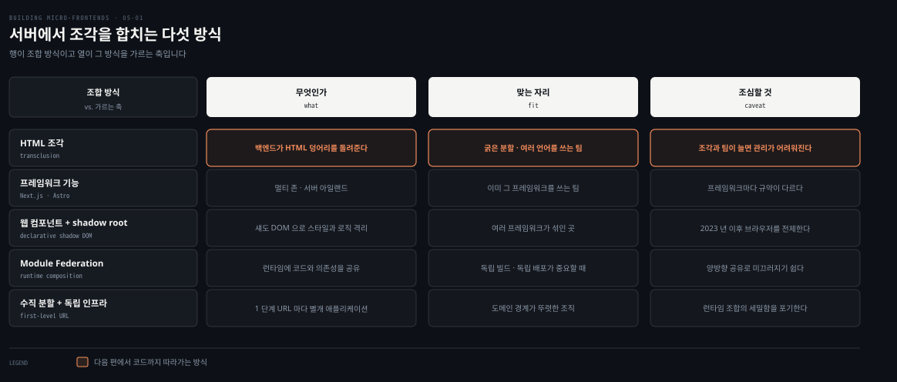
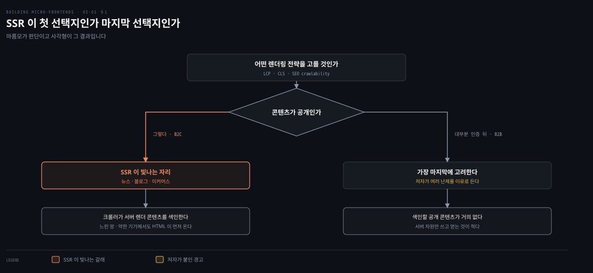
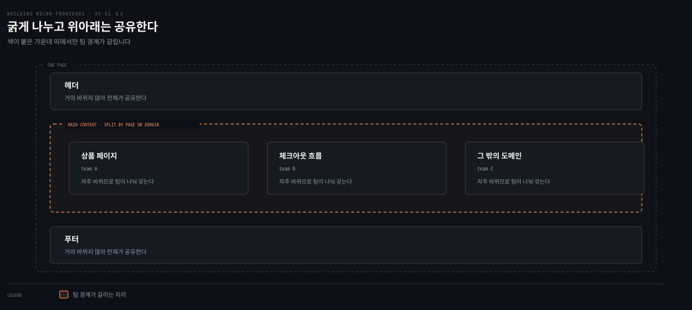

# 언제 서버에서 그릴 것인가

---

> 4장이 브라우저에서 조각을 합쳤다면 5장은 그 일을 서버로 옮깁니다. 이 편은 그 결정이 왜 기술 선택이 아니라 사업 결정인지에서 출발해, 트래픽이 몰릴 때 무엇이 무너지는지와 조각을 어떤 굵기로 나눌지를 지나 조합 방식 다섯을 늘어놓는 데서 멈춥니다.

## 핵심 요약

> 이 편 전체가 매달린 하나의 생각은 **서버 사이드 렌더링이 기술 취향이 아니라 지표를 통해 사업에 직접 닿는 결정**이라는 것입니다.
>
> 그 지표가 셋입니다. LCP와 CLS와 검색 엔진 크롤 가능성입니다. 저자는 이것을 사업에 결정적인 아키텍처 결정이라 부릅니다.
>
> 맞는 자리는 콘텐츠가 공개인 곳입니다. 반대로 대부분이 인증 뒤에 있는 B2B라면 SSR을 가장 마지막에 고려하라고 말합니다.
>
> 확장은 다른 문제입니다. 요청마다 HTML을 그리므로 블랙 프라이데이에 평소의 10배에서 20배 트래픽이 서버를 덮칠 수 있습니다.
>
> 나누는 굵기는 굵게 잡습니다. 헤더와 푸터는 공유하고 본문만 페이지나 도메인으로 가릅니다.
>
> 조합 방식은 다섯이며, 그중 무엇을 고르느냐가 런타임 성능과 팀 자율성과 운영 복잡도를 함께 정합니다.

## 학습 목표

이 내용을 읽고 나면:

1. SSR이 건드리는 세 지표를 대고 각각이 무엇을 재는지 설명할 수 있습니다.
2. SSR이 맞는 자리와 마지막에 고려할 자리를 조건으로 가를 수 있습니다.
3. 트래픽 급증에 대응하는 세 기법을 대고 각각이 무엇을 줄이는지 말할 수 있습니다.
4. 굵은 수평 분할을 권하는 이유와 세밀한 분할의 다섯 위험을 재현할 수 있습니다.
5. 조합 방식 다섯을 구분하고 각각의 맞는 자리를 짝지을 수 있습니다.

아래는 이 편이 도착하는 지점을 표로 편 지도입니다. 다음 편부터 이 다섯 가운데 넷을 하나씩 따라갑니다.

## 1. 왜 서버에서 그리는가

> 저자가 이 장을 여는 방식이 기술 설명이 아니라 사용자의 경험입니다. 느리게 뜨고 화면이 튀는 그 상황입니다.

### 풀려는 문제

웹사이트를 열었는데 한참 뜨지 않습니다. 더 나쁜 경우는 콘텐츠가 번쩍이고 요소가 튀어 다녀서, 이게 동작하는 것이 맞나 싶어집니다.

**소비자를 상대하는 플랫폼, 특히 이커머스라면 이런 일이 일어나서는 안 됩니다.** 사용자가 이탈합니다. SEO가 나빠지고 신뢰가 증발합니다.

### 세 지표

그래서 서버 사이드 렌더링이 중요해집니다. 저자가 이것을 단순한 기술 선택이 아니라고 못 박습니다. 핵심 웹 성능 지표에 직접 영향을 주므로 **사업에 결정적인 아키텍처 결정**이라는 것입니다.

| 지표 | 무엇을 재는가 |
|---|---|
| LCP | 페이지의 주된 콘텐츠가 얼마나 빨리 뜨는지를 재며, 사용자가 느끼는 속도를 좌우합니다 |
| CLS | 페이지가 로드되는 동안 보이는 요소가 움직여 사용자를 성가시게 하는, 예상치 못한 레이아웃 이동을 추적합니다 |
| SEO 크롤 가능성 | 검색 엔진이 콘텐츠에 쉽게 접근하고 색인할 수 있게 보장하며, 앱의 가시성과 발견성에 직접 영향을 줍니다 |

이 지표들을 개선하면 애플리케이션이 첫 상호작용부터 빠르고 안정적이고 믿을 만하게 느껴집니다. **사용자와 리더십 양쪽에 통하는 측정 가능한 값**을 전달하게 됩니다.

여기에 조각이 더해지면 얻는 것이 하나 더 있습니다. 사용자 트래픽만이 아니라 **팀 구조의 확장성과 독립 배포**까지 열립니다.

### 맞는 자리와 마지막 자리

SSR 아키텍처가 빛나는 시나리오로 저자가 셋을 듭니다.

- SEO가 결정적인 콘텐츠 중심 웹사이트입니다. 뉴스 사이트와 블로그와 이커머스 플랫폼이 그 예입니다. 검색 엔진이 서버에서 렌더된 콘텐츠를 더 효과적으로 크롤하고 색인해 노출과 순위가 올라갑니다.
- 망 상태가 나쁘거나 기기 성능이 떨어지는 사용자에게 더 나은 성능을 줍니다. 자바스크립트 실행을 기다리지 않고 HTML 콘텐츠를 곧바로 전달하기 때문입니다.
- 초기 페이지 로드가 빨라야 이탈률이 줄고 사용자 유지가 나아지는 애플리케이션입니다.

이커머스는 플래시 세일 같은 고트래픽 이벤트에서 특히 이득을 봅니다. **초기 상품 정보가 빠르게 뜨면서 사용자에게 즉각적인 피드백을 주고, 상호작용 요소는 점진적으로 하이드레이트됩니다.**

반대쪽이 분명합니다. 시스템 대부분이 인증 뒤에 있는 B2B 애플리케이션을 만든다면, **여러 난제를 감안할 때 SSR은 가장 마지막에 고려할 아키텍처여야** 합니다.

### 읽어내기 — 조합의 값은 지표로 환산된다

두 접근을 섞는 일에 난제가 없지 않습니다. 저자가 그 점을 미리 밝히고 장을 시작합니다.

앞의 문제에 답이 생깁니다. SSR을 고를지 말지의 판단 기준은 **"서버 렌더링이 좋은가"가 아니라 "우리 서비스에서 저 세 지표가 매출에 닿는가"**입니다. 공개 콘텐츠로 사용자를 데려오는 서비스에서는 닿고, 로그인 뒤에서 도는 도구에서는 닿지 않습니다.

## 2. 트래픽이 몰릴 때 무엇이 무너지는가

> SSR을 고르면 확장의 성질이 바뀝니다. 정적 사이트나 클라이언트 애플리케이션과 다른 지점이 여기 있습니다.

### 풀려는 문제

트래픽 급증에서 SSR 애플리케이션을 확장하는 일에는 고유한 난제가 있습니다. 정적 사이트나 클라이언트 사이드 애플리케이션과 달리, **SSR은 요청마다 HTML을 렌더하려고 상당한 서버 자원을 씁니다.**

저자가 든 수치가 구체적입니다. 블랙 프라이데이 같은 이벤트에서 이커머스 플랫폼은 평소보다 **10배에서 20배 늘어난 트래픽**을 볼 수 있고, 그것이 서버를 압도할 수 있습니다.

### 세 기법

SSR 시스템과 그것이 소비하는 API의 부담을 줄이는 기법으로 저자가 셋을 듭니다.

**캐싱**이 SSR을 효과적으로 확장하는 데 중심 역할을 합니다. 아키텍처 곳곳에 전략적으로 배치된 여러 인메모리 캐시가 렌더된 HTML과 API 응답과 비즈니스 데이터를 저장합니다. 반복 요청에서 콘텐츠를 다시 만들 필요가 크게 줄어듭니다.

**늘 데워 두는 캐시** 방식은 요청마다 가져오는 대신 데이터를 미리 저장해 두어 피크에도 지연을 최소로 만듭니다. 꼼꼼히 분석해 보면 모든 데이터가 절대적인 신선함을 요구하지는 않는다는 사실이 자주 드러납니다. 많은 요소가 초 단위의 짧은 TTL로 충분합니다.

결국 **효과적인 캐시 설계와 견고한 무효화 전략과 알맞은 일관성 모델이 SSR을 급증 상황에서 매끄럽게 확장시키는 진짜 지렛대**입니다. 이것들이 없으면 SSR 혼자로는 고수요 시나리오를 안정적으로 감당하지 못합니다.

**서버리스 또는 컴퓨트 사전 배치**는 컴퓨트 확장을 다루는 방법입니다. AWS Lambda 같은 서버리스 해법부터, 예측 가능한 급증에 앞서 컨테이너를 미리 띄워 두는 사전 프로비저닝까지 범위가 넓습니다. 둘 중 하나를 고르거나 둘을 섞으면, 조직이 자기 애플리케이션의 필요와 트래픽 패턴에 맞춰 비용과 성능과 운영 통제를 최적화할 수 있습니다.

**사전 계산**은 추천 엔진과 콘텐츠 저장소가 데이터를 미리 준비해 두어 피크의 처리량을 줄이는 방식입니다. 플래시 세일 동안 상품 페이지를 미리 렌더해 CDN 수준에 캐시해 두고, 재고 갱신은 더 작고 표적화된 API 호출로 처리하는 식입니다.

### 읽어내기 — 캐시가 아키텍처 결정으로 올라온다

저자가 캐싱에 붙인 표현이 강합니다. 캐싱 아키텍처를 **성능과 확장성을 위한 사업적 고려사항**이라고 부릅니다.

3장에서 서버 사이드 조합의 확장성이 3점이었던 이유가 여기서 다시 확인됩니다. 최종 뷰를 조합하는 백엔드를 직접 확장해야 하고, 그 부담을 덜어 주는 유일한 수단이 캐시입니다. **캐시를 나중에 붙이는 최적화로 두면 이 아키텍처는 서지 않습니다.**

## 3. 조각을 어떤 굵기로 나눌 것인가

> 나누는 방법을 정하기 전에 나누는 굵기를 정합니다. 저자는 성공한 구현 대부분이 같은 굵기를 골랐다고 말합니다.

### 풀려는 문제

조각을 잘게 나눌수록 팀의 자율은 커집니다. 그런데 서버에서 조합하면 그 자율의 값이 다른 데서 나옵니다. 조각마다 서비스를 부르고, 그중 하나가 실패했을 때를 처리해야 하기 때문입니다.

### 굵은 수평 분할

성공한 SSR 조각 구현 대부분이 **굵은 수평 분할**을 씁니다. 그러면 조각 사이의 오케스트레이션 부담과 에러 처리 복잡도가 줄어드는데, 세밀한 분할에서는 그것이 감당 불가능해집니다.

배치가 단순합니다. 거의 바뀌지 않는 컴포넌트인 **헤더와 푸터는 애플리케이션 전체가 공유**하고, **본문 영역만 페이지나 도메인으로 나눕니다.**

Next.js나 Astro 같은 모던 SSR 프레임워크는 페이지 기반 구조 덕분에 이 분할을 자연스럽게 뒷받침합니다. **콘텐츠가 자주 바뀌는 지점인 페이지 경계가 팀 사이의 자연스러운 분할점**이 됩니다. 한 팀이 상품 페이지를 맡고 다른 팀이 체크아웃 흐름을 맡는 식입니다.

### 세밀하게 나누면 생기는 다섯

어떤 회사들은 더 세밀한 분할을 시도합니다. 한 페이지 안의 개별 컴포넌트가 서로 다른 조각에서 오는 방식입니다. 팀 자율성은 최대가 되지만 저자가 상당한 난제 다섯을 답니다.

- 조율 복잡도가 지수적으로 늘어납니다.
- 서비스 호출이 여러 번 일어나 성능이 나빠질 수 있습니다.
- 서비스 경계를 넘나들며 디버깅하기가 어려워집니다.
- 의존성 충돌 가능성이 커집니다.
- 캐시 무효화 전략이 더 복잡해집니다.

### 읽어내기 — 3장의 신호가 여기서도 통한다

3장에서 한 뷰에 조각이 6~7개를 넘으면 리모트 컴포넌트를 만들고 있는 신호라고 했습니다. 서버 사이드에서는 그 임계가 더 낮게 걸립니다.

이유가 목록의 둘째 줄에 있습니다. **클라이언트에서는 조각이 늘어도 브라우저가 병렬로 받습니다. 서버에서는 조합 계층이 매 요청마다 그만큼의 서비스를 불러야 합니다.** 응답 시간이 조각 수에 비례해 나빠지고 그중 가장 느린 하나가 페이지 전체를 붙잡습니다.

## 4. 조합 방식 다섯

> 이 장의 핵심 결정은 하나입니다. 조각을 어떻게 합칠 것인가입니다.

### 풀려는 문제

저자가 이 결정이 무엇을 함께 정하는지 밝힙니다. **런타임 성능과 팀 자율성과 운영 복잡도**입니다. 그리고 팀들이 오케스트레이션 난제를 과소평가하는 일이 잦다고 덧붙입니다.

### 다섯 가지

| 방식 | 저자가 붙인 설명 |
|---|---|
| HTML 조각 | 백엔드 서비스가 HTML 덩어리를 돌려주고 그것을 서버에서 조립해 클라이언트로 보내는 고전적 접근입니다. 직관적이고 굵은 분할에 잘 맞지만, 조각과 팀의 수가 늘면 관리가 어려워집니다 |
| 프레임워크 고유 해법 | 점점 인기를 얻는 접근입니다. Next.js의 멀티 존은 앱의 서로 다른 부분을 별개 배포가 다루게 하고, Astro.js의 서버 아일랜드는 한 페이지 안에서 렌더링 전략을 섞게 합니다. 프레임워크마다 자기 조합 규약이 있습니다 |
| 웹 컴포넌트와 shadow root | 각 조각을 섀도 DOM을 쓰는 웹 컴포넌트로 캡슐화해 스타일과 로직을 강하게 격리합니다. 2023년 이후 모든 주요 모던 브라우저가 선언적 섀도 DOM을 폭넓게 지원해, 이제 SSR에서도 실용적입니다 |
| Module Federation | 앞 장들에서 본 대로 팀이 조각을 독립적으로 빌드하고 배포하며 런타임에 코드와 의존성을 공유합니다. 진짜 런타임 조합이 되어 중복이 줄고, 전체를 다시 배포하지 않고도 갱신을 굴릴 수 있습니다 |
| 수직 분할과 독립 인프라 | 더 단순하지만 효과적인 전략이며, 도메인 경계가 뚜렷한 조직에 특히 맞습니다. 애플리케이션의 각 주요 구역이 대개 1단계 URL에 대응하고, 별개로 독립 배포되는 웹 애플리케이션이 그것을 다룹니다 |

### 엣지가 늘 맞지는 않는다

저자가 여기에 단서를 하나 답니다. **엣지 컴퓨팅이 늘 적합하지는 않다**는 것입니다. 특히 규정 준수 요구가 엄격한 단일 리전 애플리케이션이 그렇습니다.

이유가 3장에서 본 것과 같습니다. 데이터가 다른 리전에 중앙화된 채로 남아 있으면 워크로드를 엣지로 분산하는 부담이 그 이점을 정당화하지 못할 수 있습니다. 게다가 엣지의 컴퓨트 성능은 리전 안 자원보다 대개 낮아서, Node.js 기능이나 다른 런타임 제약을 감수해야 합니다.

### 읽어내기 — 고르는 축은 조직이다

저자가 이 목록을 닫으며 밝히는 것이 선택의 기준입니다. 수백 팀과 일해 보니 조합 전략마다 성능과 팀 자율성과 운영 복잡도에서 서로 다른 트레이드오프가 있었다는 것입니다.

그리고 **선택이 조직의 구조, 쓰는 기술, 팀에 주고 싶은 독립성의 수준에 달려 있다**고 적습니다. 4장에서 Module Federation을 고른 세 이유가 모두 조직 쪽이었던 것과 같은 판단입니다.

## 적용 관점

> 아래는 백엔드 개발자가 이미 가진 판단 기준과 이 절을 잇는 노트의 읽기입니다. 책이 백엔드 독자를 향해 쓴 대목이 아닙니다.

요청마다 HTML을 만든다는 것은 요청마다 CPU를 쓴다는 뜻입니다. 정적 파일을 서빙하던 프론트엔드가 갑자기 애플리케이션 서버가 됩니다. 그래서 이 장에서 다루는 문제가 톰캣 앞에 리버스 프록시를 두고 캐시를 걸던 이야기와 거의 같아집니다. 다른 점은 캐시 대상이 JSON이 아니라 사람이 보는 화면이라, 잘못된 캐시가 곧바로 사용자에게 드러난다는 것입니다.

블랙 프라이데이에 평소의 10~20배를 대비하라는 대목은 용량 산정의 언어 그대로입니다. 오토스케일링이 있어도 스케일 아웃 지연보다 급증이 가파르면 늦습니다. 그래서 예측 부하만큼 베이스라인을 미리 올려 둡니다. 3장에서 같은 조언을 봤고 여기서는 그 앞에 캐시라는 층을 더 두라는 요구가 붙습니다.

굵게 나누라는 권고는 서비스를 잘게 쪼갤 때의 계산과 같습니다. 서비스가 늘면 한 요청이 부르는 하위 호출이 늘고, 응답 시간은 가장 느린 하나에 끌려갑니다. 프론트엔드 조합 계층에서는 그것이 더 직접적입니다. 조각 하나가 늦으면 페이지 전체가 늦습니다. 저자가 세밀한 분할의 위험 다섯 가운데 성능과 디버깅을 넣은 이유가 그것입니다.

조합 방식 다섯을 조직 구조로 고르라는 결론도 익숙합니다. 통합 방식을 정할 때 기술 성능보다 팀 경계와 릴리스 주기를 먼저 보던 판단과 같습니다. 다만 프론트엔드 쪽이 하나 더 무겁습니다. 잘못 고르면 사용자가 그 결과를 화면에서 즉시 겪습니다.

## 면접 대비

Q: 서버 사이드 렌더링이 건드리는 지표는 무엇인가요?

A: LCP와 CLS와 SEO 크롤 가능성입니다. LCP는 주된 콘텐츠가 얼마나 빨리 뜨는지를 잽니다. CLS는 로드 중 요소가 튀는 예상치 못한 레이아웃 이동을 추적하고, 크롤 가능성은 검색 엔진이 콘텐츠에 접근하고 색인할 수 있는지를 봅니다. 저자는 이 때문에 SSR이 단순한 기술 선택이 아니라 사업에 결정적인 아키텍처 결정이라고 적습니다.

Q: SSR을 쓰지 말아야 할 때는 언제인가요?

A: 시스템 대부분이 인증 뒤에 있는 B2B 애플리케이션입니다. 저자는 여러 난제를 감안해 그런 경우 SSR을 가장 마지막에 고려할 아키텍처로 두라고 말합니다. 색인할 공개 콘텐츠가 없으면 세 지표에서 얻는 것이 거의 없고 서버 자원만 쓰게 되기 때문입니다.

Q: SSR 시스템이 트래픽 급증을 견디게 하는 방법은 무엇인가요?

A: 세 가지입니다. 첫째는 캐싱으로, 아키텍처 곳곳에 인메모리 캐시를 두고 렌더된 HTML과 API 응답과 비즈니스 데이터를 저장합니다. 늘 데워 두는 방식이면 피크에도 지연이 최소가 되고, 많은 데이터는 초 단위 TTL로 충분합니다. 둘째는 서버리스나 컴퓨트 사전 배치, 셋째는 사전 계산입니다. 저자는 이 가운데 캐시 설계와 무효화 전략을 진짜 지렛대로 꼽습니다.

Q: SSR 조각을 세밀하게 나누면 무엇이 문제인가요?

A: 저자가 다섯을 듭니다. 조율 복잡도가 지수적으로 늘어납니다. 서비스 호출이 여러 번이라 성능이 나빠지고 서비스 경계를 넘는 디버깅이 어려워집니다. 의존성 충돌 가능성이 커지고 캐시 무효화 전략도 복잡해집니다. 그래서 성공한 구현 대부분은 굵은 수평 분할을 쓰고 헤더와 푸터는 공유하며 본문만 페이지나 도메인으로 나눕니다.

### 요약 세 문장

1. SSR은 LCP와 CLS와 크롤 가능성을 통해 사업에 직접 닿으며, 공개 콘텐츠로 사용자를 데려오는 서비스에서 값이 납니다.
2. 요청마다 HTML을 그리므로 확장의 진짜 지렛대는 캐시 설계와 무효화 전략이고, 캐시를 나중에 붙이면 이 아키텍처는 서지 않습니다.
3. 조각은 굵게 나누고 헤더와 푸터는 공유하며, 조합 방식 다섯 가운데 무엇을 고를지는 기술이 아니라 조직 구조가 정합니다.

## 핵심 개념 체크리스트

- [ ] 세 지표를 대고 각각이 무엇을 재는지 말할 수 있는가?
- [ ] SSR이 빛나는 세 시나리오와 마지막에 고려할 한 경우를 짝지을 수 있는가?
- [ ] 트래픽 급증 대응 세 기법과 각각이 줄이는 것을 댈 수 있는가?
- [ ] 굵은 수평 분할에서 무엇이 공유되고 무엇이 갈리는지 재현할 수 있는가?
- [ ] 세밀한 분할의 위험 다섯을 절반 이상 말할 수 있는가?
- [ ] 조합 방식 다섯을 이름과 맞는 자리로 짝지을 수 있는가?

## 관련 문서

- [진화와 호스팅 — 레거시와 장바구니와 CDN](04-04.진화와%20호스팅%20—%20레거시와%20장바구니와%20CDN.md) — 클라이언트 조합으로 4장을 닫은 자리
- [서버 사이드 — 조합을 오리진으로 옮긴다](03-08.서버%20사이드%20—%20조합을%20오리진으로%20옮긴다.md) — 이 아키텍처의 여덟 축 점수와 세 계층 구조
- [모던 SSR 프레임워크와 엣지 — 3장을 닫으며](03-09.모던%20SSR%20프레임워크와%20엣지%20—%203장을%20닫으며.md) — 엣지가 아직 자리를 못 잡은 이유의 출처
- [Building Micro-Frontends 정독 인덱스](README.md) — 다음 편인 HTML 조각의 진행 상태는 인덱스의 노트 표에서 봅니다

## 참고 자료

- 《Building Micro-Frontends, Second Edition》(Luca Mezzalira, O'Reilly, 2026) ISBN 978-1-098-17078-3
  - 다룬 범위: When to Use Server-Side Rendering · Scalability Challenges · Dividing Micro-Frontends · Composition Approaches · The Main Challenge
  - 이어서: HTML Fragments · Splitting by URL · Next.js Multi-Zones
- [Core Web Vitals](https://web.dev/articles/vitals) — 저자가 든 LCP와 CLS의 정의가 있는 곳
