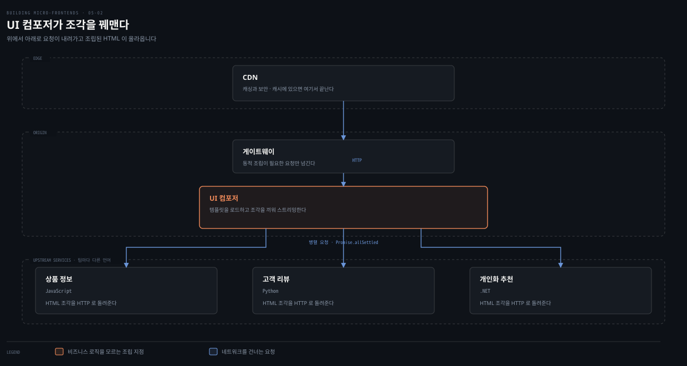
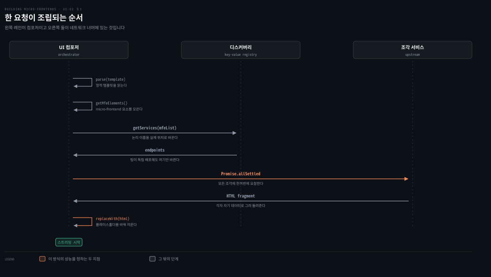
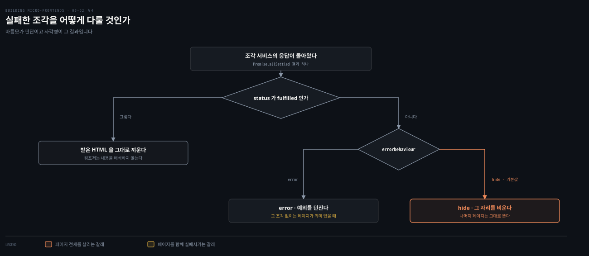

# HTML 조각 — UI 컴포저가 꿰맨다

---

> 조합 방식 다섯 가운데 첫째입니다. 팀마다 HTML 덩어리를 HTTP로 내놓고, 서버에 있는 조립기가 템플릿의 빈칸에 그것을 끼웁니다. 이 방식의 값은 조립기가 아무것도 모른다는 데 있습니다.

## 핵심 요약

> 이 편이 매달린 하나의 생각은 **UI 컴포저가 비즈니스를 하나도 모를 때에만 팀이 서로를 기다리지 않는다**는 것입니다.

팀마다 자기 비즈니스 능력을 HTML 조각으로 HTTP 엔드포인트에 내놓습니다. 완전한 페이지가 아니라 바운디드 컨텍스트 하나를 표현하는 부분 스니펫입니다. 그래서 조각마다 언어가 달라도 됩니다. 저자의 예에서 상품은 자바스크립트, 리뷰는 파이썬, 추천은 .NET입니다. 조립은 트랜스클루전으로 하며 컴포저는 어디서 가져와 어디에 놓을지만 알고 그 조각이 무엇을 하는지는 모릅니다.

플레이스홀더에 `errorbehaviour`를 적어 두면 서비스가 실패했을 때 감출지 페이지를 실패시킬지가 정해집니다. 실패 도메인이 그 한 속성으로 갈립니다. 마지막 권고가 분리입니다. 원시 데이터를 주는 API와 HTML을 그리는 서비스를 나눠야 각자 진화합니다.


## 학습 목표

이 내용을 읽고 나면:

1. HTML 조각이 무엇이고 왜 완전한 페이지가 아닌지 설명할 수 있습니다.
2. UI 컴포저가 하는 일과 하지 않는 일을 나눠 말할 수 있습니다.
3. 한 요청이 조립되는 순서를 함수 이름으로 재현할 수 있습니다.
4. `errorbehaviour`가 실패 도메인을 어떻게 가르는지 설명할 수 있습니다.
5. 데이터 API와 렌더링 서비스를 분리하라는 권고의 근거를 댈 수 있습니다.

아래는 이 편이 다루는 전경을 배치로 편 지도입니다. 위에서 아래로 요청이 내려가고 조립된 HTML이 올라옵니다.




## 1. 조각이 HTML로 온다

> 앞 편의 다섯 가운데 첫째입니다. 이름 그대로 조각이 HTML 덩어리로 옵니다.

### 풀려는 문제

서버에서 조합하려면 조각이 무엇으로 와야 할지를 정해야 합니다. JSON으로 받아 서버에서 그리면 렌더링 책임이 조합 계층으로 몰립니다. 그러면 조합 계층이 각 도메인의 화면을 알게 됩니다.

### HTML 조각이라는 계약

이 모델에서 각 팀은 특정 비즈니스 능력을 맡습니다. 상품 카탈로그나 장바구니나 사용자 리뷰 같은 것입니다. 그리고 자기 UI를 **HTTP 엔드포인트를 통해 HTML 조각으로 노출**합니다.

이 조각들은 완전한 독립 페이지가 아닙니다. **더 큰 애플리케이션 안의 바운디드 컨텍스트 하나를 표현하는 부분 HTML 스니펫**입니다.

저자의 예가 이커머스입니다. 상품 상세 페이지가 조각 여럿으로 구성됩니다. 하나는 상품 정보, 다른 하나는 고객 리뷰, 세 번째는 개인화 추천입니다. 각각을 별개 팀이 개발하고, **기술이나 프로그래밍 언어가 서로 달라도 됩니다.**

| 조각 | 언어 |
|---|---|
| 상품 상세 | JavaScript |
| 리뷰 | Python |
| 추천 | .NET |

각 팀은 자기 조각을 HTML로 전달할 책임을 지고, 전체 애플리케이션이 기대하는 계약을 지킵니다. 특정 플레이스홀더나 API가 그 계약입니다.

### 프론트엔드 라이브러리는 맞추는 편이 좋다

여기에 저자가 조건을 하나 답니다. 이상적으로는 프론트엔드 쪽이 같은 라이브러리를 써야 합니다. 그래야 **의존성이 애플리케이션 전체에 한 번만 로드되어** 사용자 경험과 성능이 지켜집니다.

이 다중 언어 접근에 견고한 기반을 주는 라이브러리로 htmx를 듭니다. 3장에서 htmx가 클라이언트 자바스크립트 프레임워크를 걷어내는 접근으로 나왔던 것과 이어집니다.


## 2. UI 컴포저가 아무것도 모른다

> 조각을 응집된 페이지로 조립하는 일은 UI 컴포저가 맡습니다. 이 편의 핵심은 그 컴포저가 무엇을 모르느냐입니다.

### 풀려는 문제

조립기가 각 조각의 내용을 알기 시작하면 팀 사이의 결합이 조립기를 통해 되살아납니다. 조각을 나눈 이유가 사라집니다.

### 트랜스클루전

조각을 응집된 페이지로 조립하는 것은 **UI 컴포저**입니다. 트랜스클루전을 활용하는 서버 사이드 오케스트레이터입니다.

UI 컴포저가 각 조각을 위한 플레이스홀더가 든 기본 HTML 템플릿을 로드합니다. 런타임에 여러 업스트림 서비스에서 관련 HTML 조각을 가져와 대응하는 플레이스홀더에 주입합니다.

사용자가 상품 페이지로 이동하면 컴포저가 상품 팀의 서비스에서 상품 상세 조각을, 리뷰 팀의 서비스에서 리뷰 조각을 가져오는 식으로 모아, **서버에서 꿰맨 뒤 완성된 HTML 페이지를 브라우저로 스트리밍**합니다.

### 컴포저가 하는 일과 하지 않는 일

이 접근이 주는 이점을 저자가 정리합니다. 팀이 자율적으로 일할 수 있습니다. 각 팀이 다른 팀에 영향을 주지 않고 자기 조각을 갱신하고 테스트하고 배포합니다.

핵심이 여기 있습니다. **UI 컴포저는 비즈니스 로직을 모릅니다.** 각 조각을 어디서 가져오고 어디에 놓을지만 알 뿐, 그 조각이 어떻게 만들어졌는지도 어떤 비즈니스 규칙을 구현하는지도 모릅니다. 이 관심사 분리 덕분에 견고한 테스트가 가능해집니다. 팀은 자기 조각을 격리해 검증하면서 조합 메커니즘이 안정적으로 유지되리라 믿을 수 있습니다.

### 블랙 프라이데이에 무엇이 달라지나

이커머스 맥락에서 이 모델이 특히 강력해집니다. 저자가 다시 블랙 프라이데이를 부릅니다.

프로모션 팀이 추천 조각을 갱신해 플래시 세일을 강조하고, 동시에 상품 팀이 새 상품 상세 레이아웃을 내놓습니다. **릴리스를 조율할 필요도, 페이지 전체를 깨뜨릴 위험도 없습니다.** 리뷰 서비스에 부하가 걸리면 UI 컴포저가 캐시된 조각이나 단순 플레이스홀더를 보여 주며 우아하게 저하시킬 수 있습니다. 나머지 페이지는 그대로 동작하고 성능도 유지됩니다.

### 읽어내기 — 백엔드가 강한 조직의 무기

이 아키텍처가 특히 매력적인 곳을 저자가 짚습니다. **백엔드와 풀스택 엔지니어링 역량이 강한 조직**입니다.

이유가 분명합니다. 자바스크립트 밖의 언어와 프레임워크에서 쌓은 기존 전문성을 그대로 활용하면서도 현대적이고 확장 가능하며 유지보수되는 프론트엔드 경험을 전달할 수 있기 때문입니다.

4장에서 Module Federation을 고른 이유가 "이미 Webpack을 안다"였던 것과 같은 논리입니다. **조직이 이미 가진 것이 아키텍처 선택을 정합니다.**


## 3. 한 요청이 조립되는 순서

> 조합이 어떻게 도는지 따라갑니다. 저자의 코드가 하는 일은 놀랄 만큼 기계적입니다.



### 풀려는 문제

컴포저가 비즈니스를 모른다면, 어느 조각을 어디서 가져올지는 어떻게 압니까. 그리고 조각이 여럿일 때 그것을 순서대로 부르면 응답 시간이 합산됩니다.

### 요청이 도착하기까지

사용자가 페이지를 요청하면 여정은 시스템의 엣지, 대개 CDN에서 시작합니다. CDN이 캐싱과 보안을 다루고, 콘텐츠가 아직 캐시돼 있지 않으면 알맞은 백엔드로 요청을 라우팅합니다. 요청한 페이지가 동적 조립을 필요로 하면 CDN이 시스템의 진입점으로 넘깁니다. 트래픽을 UI 컴포저 서비스로 보내는 로드밸런서나 게이트웨이입니다.

컴포저의 진입점이 이렇습니다.

```javascript
fastify.get('/productdetails', async (request, reply) => {
  try {
    const catalogDetailspage = await transformTemplate(catalogTemplate)
    return reply
      .code(200)
      .header('content-type', 'text/html')
      .send(catalogDetailspage)
  } catch (err) {
    request.log.error(createError('500', err))
    throw new Error(err)
  }
})
```

### 템플릿에는 빈칸이 있다

컴포저는 정적 HTML 템플릿을 가져오는 것으로 시작합니다. `head`에는 공통 의존성이, `body`에는 각 조각이 들어갈 자리를 가리키는 플레이스홀더나 커스텀 요소가 있습니다.

```html
<!DOCTYPE html>
<html>
  <head>
    <title>AWS micro-frontends</title>
    <script src="./static/nanoevents.js" type="module"></script>
    <script src="./static/preact.min.js"></script>
    <script src="./static/htm.min.js"></script>
  </head>
  <body>
    <div id="noitificationscontainer">
      <script src="./static/notifications.js" defer></script>
    </div>

    <micro-frontend id="catalog" errorbehaviour="error"/>
    <micro-frontend id="review" errorbehaviour="hide" />
  </body>
</html>
```

### 빈칸을 채우는 순서

빈칸을 채우려고 컴포저가 **서비스 디스커버리**를 씁니다. 논리적 이름을 대응하는 서비스의 실제 위치로 매핑하는 키-값 저장소나 레지스트리입니다. 덕분에 팀이 자기 조각을 독립적으로 배포하고 갱신하면서 자기 바운디드 컨텍스트 안에서 빠르게 반복할 수 있습니다.

엔드포인트가 해석되면 컴포저가 **각 조각 서비스에 병렬로 요청**합니다.

```javascript
const transformTemplate = async (html) => {
  const root = parse(html);
  const mfeElements = getMfeElements(root);
  let mfeList = [];

  if (mfeElements.length > 0) {
    mfeElements.forEach(element => {
      mfeList.push(getMfeVO(
        element.getAttribute("id"),
        element.getAttribute("errorbehaviour")
      ));
    });
  } else { return "" }

  // 디스커버리에서 조각 엔드포인트를 받는다
  mfeList = await getServices(mfeList);

  // HTML 조각을 병렬로 받는다
  const fragmentsResponses = await Promise.allSettled(
    mfeList.map(element => element.loader(element.service)))

  // 응답을 판정한다
  const mfeToRender = fragmentsResponses.map((element, index) =>
    analyseMFEresponse(element, mfeList[index].errorBehaviour))

  // 템플릿에 끼운다
  mfeElements.forEach((element, index) =>
    element.replaceWith(mfeToRender[index]))

  return root.toString();
}
```

각 서비스가 자기 데이터 소스를 조회하고 자기 렌더링 로직을 적용해 HTML 조각을 만들어 돌려줍니다.

> 디스커버리 패턴은 다음 장에서 자세히 다룬다고 저자가 예고합니다.

### 읽어내기 — 조합이 기계적이라는 말의 뜻

HTML은 자바스크립트로 파싱하기 쉽고, 트랜스클루전은 플레이스홀더를 진짜 HTML 조각으로 바꾸는 강력한 메커니즘이 됩니다. 그 조각에는 HTML과 스타일과 자바스크립트가 함께 들어 있습니다.

저자가 이 과정에 붙인 표현이 정확합니다. **조합 과정은 엄격히 기계적입니다.** UI 컴포저가 조각의 내용을 해석하거나 바꾸지 않습니다. 그래서 관심사 분리가 명확하게 유지되고 조합 로직이 비즈니스를 모르는 상태로 남습니다.

조립이 끝나면 컴포저가 완성된 HTML 페이지를 CDN을 거쳐 브라우저로 스트리밍합니다. **스트리밍 덕분에 중요한 콘텐츠를 가능해지는 대로 전달할 수 있어 체감 성능이 좋아지고 상호작용 가능까지의 시간이 줄어듭니다.** 어떤 조각이 지연되거나 실패하면 폴백이나 캐시된 버전을 끼워 넣어 회복력과 매끄러운 경험을 지킵니다.


## 4. 실패한 조각을 어떻게 다룰 것인가

> 이 방식의 회복력은 템플릿에 적힌 속성 하나에서 나옵니다.



### 풀려는 문제

조각 하나가 실패했을 때 페이지 전체를 실패시킬지 그 자리만 비울지는 조각마다 다릅니다. 그런데 컴포저는 비즈니스를 모르므로 스스로 판단할 수 없습니다.

### 판단을 템플릿에 적어 둔다

조각 플레이스홀더가 에러 처리 전략도 함께 지정합니다. 서비스에서 온 에러 응답을 어떻게 다룰지 UI 컴포저에게 알리는 것입니다.

저자의 설명이 직관적입니다. 웹 애플리케이션의 뷰를 보면 모든 부분이 늘 필수는 아니라는 사실이 분명해집니다. 이커머스에서 상품 상세 페이지는 상품 자체의 정보를 요구하지만, **어떤 이유로 리뷰를 쓸 수 없다면 애플리케이션은 핵심 부분인 상품 상세만 보여 주는 저하된 경험을 제공할 수 있습니다.**

이 유연함 덕분에 조각 시스템이 우아하게 실패합니다. 서비스를 쓸 수 없게 되거나, 에러를 돌려주거나, 응답 시간이 지나치게 길 때 그렇습니다.

여기서 얻는 것을 저자가 한 문장으로 적습니다. **실패 도메인이 갈리고, 전체 실패 대신 부분 로드가 가능해집니다.** 고트래픽 이커머스 환경에서는 이것이 필수입니다.

판정 코드가 짧습니다.

```javascript
const analyseMFEresponse = (response, behaviour) => {
  let html = "";
  if (response.status !== "fulfilled") {
    switch (behaviour) {
      case behaviour.ERROR:
        throw new Error()
      case behaviour.HIDE:
      default:
        html = ""
        break;
    }
  } else {
    html = response.value.body
  }
  return html;
}
```

### 모든 조각이 서버에서 그려질 필요는 없다

저자가 여기에 유연함을 하나 더 붙입니다. **모든 조각이 서버 사이드에서 렌더될 필요는 없습니다.** 일부는 완전히 클라이언트에서 렌더될 수 있고, 그래서 애플리케이션의 각 부분을 어떻게 전달하고 사용자와 어떻게 상호작용할지에 여유가 생깁니다.

앞의 템플릿에 있던 알림 조각이 그 예입니다. 클라이언트에서 로드되어 다른 조각이 던지는 이벤트를 듣고, 장바구니에 항목이 담겼을 때의 메시지 같은 실시간 피드백을 줍니다. **이 이벤트 기반 통신이 조각 사이를 느슨하게 결합합니다.**

조각마다 렌더링 모드를 신중히 고르면 성능과 사용자 경험을 함께 최적화할 수 있습니다. 정적인 구역에는 CDN 캐싱을, 상호작용 기능에는 동적 갱신을 쓰는 식입니다.


## 5. API와 렌더링 서비스를 나눈다

> 저자가 이 방식을 닫으며 남기는 권고 하나가 이 아키텍처의 오래된 교훈입니다.

### 풀려는 문제

한 서비스가 데이터도 주고 HTML도 그리면, 화면이 바뀔 때마다 데이터 계약을 건드리게 됩니다. 반대로 데이터 모델이 바뀌면 화면이 함께 흔들립니다.

### 두 종류의 서비스로 나눈다

일반적인 권고는 **원시 데이터를 서빙하는 API와 프론트엔드 렌더링을 수행하는 서비스 사이에 명확한 분리를 유지하는 것**입니다.

- 백엔드 API는 데이터 전달과 비즈니스 로직에 최적화된 채로 독립적으로 진화합니다.
- 프론트엔드 렌더링 서비스는 그 데이터를 표현용 HTML 조각으로 바꾸는 데만 집중합니다.

### 누가 쓰고 있나

이 접근을 눈에 띄게 채택한 곳으로 저자가 **Zalando**를 듭니다. 독일의 패션 이커머스 플랫폼이며, 초기 구현에서 Tailor.js를 썼습니다.

오늘날 이 접근은 자바스크립트나 파이썬이나 .NET 같은 언어로 일하는 강한 백엔드나 풀스택 엔지니어링 조직에서 점점 인기를 얻고 있습니다. **HTML 조각을 통합 지점으로 삼으면, 조직이 이미 가진 기술과 인프라를 활용하면서도 현대적이고 결합이 끊긴 프론트엔드 개발의 이점을 누립니다.**

저자가 AWS 서버리스 서비스로 만든 예제가 GitHub에 있다고 밝히면서 단서를 답니다. **이 접근은 AWS 중심이 아니며 온프레미스부터 다른 클라우드까지 어떤 컴퓨트 해법으로도 구현할 수 있습니다.**


## 적용 관점

> 아래는 백엔드 개발자가 이미 가진 판단 기준과 이 절을 잇는 노트의 읽기입니다. 책이 백엔드 독자를 향해 쓴 대목이 아닙니다.

UI 컴포저는 응답을 모아 하나로 만들어 내려보내는 조합 계층입니다. API 게이트웨이나 BFF와 같은 자리입니다. 다른 점은 조합의 재료가 JSON이 아니라 HTML이라는 것입니다. 그래서 컴포저가 내용을 파싱해 해석할 이유가 없어집니다. 저자가 강조한 "기계적"이라는 성질이 그 자리에서 나옵니다. 게이트웨이에 응답 변환 로직을 넣기 시작하면 도메인이 새어 든다는 익숙한 교훈과 같습니다.

조각마다 언어가 달라도 된다는 대목은 서비스마다 스택을 고르던 자유와 같습니다. 다만 조건이 하나 붙습니다. 프론트엔드 라이브러리는 맞춰야 의존성이 한 번만 내려옵니다. 서버 쪽은 완전히 자유롭고 클라이언트 쪽은 수렴시켜야 한다는, 이 아키텍처 특유의 비대칭입니다.

`errorbehaviour`로 실패 도메인을 가르는 방식은 회복력 패턴의 프론트엔드 판본입니다. 호출하는 쪽이 폴백을 정의하고 실패를 격리하는 구조이고, 여기서는 그 정의가 코드가 아니라 템플릿 속성에 있습니다. 화면을 아는 사람이 그 판단을 소유한다는 점에서 오히려 자리가 맞습니다. 백엔드에서 서킷 브레이커의 폴백을 도메인 팀이 정하던 것과 같습니다.

`Promise.allSettled`로 병렬 요청을 보내는 대목도 그대로 대응됩니다. 순차 호출이면 응답 시간이 합산되고 병렬이면 가장 느린 하나에 수렴합니다. 그래서 앞 편에서 조각을 굵게 나누라고 한 이유가 여기서 확인됩니다. 조각이 늘면 병렬이어도 가장 느린 꼬리가 길어질 확률이 올라갑니다.

데이터 API와 렌더링 서비스를 나누라는 마지막 권고는 조회 모델과 표현 모델을 분리하던 판단과 같습니다. 한 서비스가 둘을 다 지면 화면 요구가 데이터 계약을 흔듭니다. 이 분리를 지켜야 백엔드 API가 여러 소비자를 상대로 독립 진화할 수 있습니다.


## 면접 대비

Q: HTML 조각 방식이란 무엇인가요?

A: 각 팀이 자기 비즈니스 능력을 HTML 조각으로 HTTP 엔드포인트에 노출합니다. 서버의 UI 컴포저가 템플릿의 플레이스홀더에 그것을 끼워 완성된 페이지를 만듭니다. 조각은 완전한 페이지가 아니라 바운디드 컨텍스트 하나를 표현하는 부분 스니펫입니다. 조각마다 언어가 달라도 되며 저자의 예에서는 상품이 자바스크립트, 리뷰가 파이썬, 추천이 .NET입니다.

Q: UI 컴포저가 비즈니스 로직을 모른다는 것이 왜 중요한가요?

A: 컴포저가 조각의 내용을 알기 시작하면 팀 사이의 결합이 컴포저를 통해 되살아나기 때문입니다. 컴포저는 각 조각을 어디서 가져와 어디에 놓을지만 압니다. 어떻게 만들어졌는지도 어떤 규칙을 구현하는지도 모릅니다. 그 덕분에 팀이 릴리스를 조율하지 않고 각자 배포하며 조각을 격리해 테스트할 수 있습니다.

Q: 조각 하나가 실패하면 어떻게 되나요?

A: 플레이스홀더에 적어 둔 `errorbehaviour`가 정합니다. `error`면 예외를 던져 페이지를 실패시키고, `hide`면 그 자리를 비우고 나머지 페이지를 그대로 띄웁니다. 상품 상세 페이지에서 리뷰를 못 가져와도 상품 정보만으로 저하된 경험을 줄 수 있는 것이 이 덕분입니다. 실패 도메인이 갈려 전체 실패 대신 부분 로드가 됩니다.

Q: 데이터 API와 렌더링 서비스를 왜 분리하나요?

A: 각자 독립적으로 진화하게 하기 위해서입니다. 백엔드 API는 데이터 전달과 비즈니스 로직에 최적화됩니다. 프론트엔드 렌더링 서비스는 그 데이터를 표현용 HTML 조각으로 바꾸는 데만 집중합니다. Zalando가 Tailor.js 초기 구현에서 이 방식을 채택했고 지금도 백엔드나 풀스택 역량이 강한 조직에서 널리 쓰입니다.

### 요약 세 문장

1. HTML 조각 방식은 팀마다 부분 HTML을 HTTP로 내놓게 하고 서버의 컴포저가 트랜스클루전으로 꿰맵니다.
2. 컴포저가 비즈니스를 하나도 모르기 때문에 팀이 서로를 기다리지 않고 각자 배포할 수 있습니다.
3. 실패 처리는 템플릿의 `errorbehaviour`가 정하고, 데이터 API와 렌더링 서비스를 나눠야 양쪽이 독립 진화합니다.


## 핵심 개념 체크리스트

- [ ] HTML 조각이 완전한 페이지가 아닌 이유를 말할 수 있는가?
- [ ] 조각마다 언어가 달라도 되는 조건과 그때 맞춰야 할 것을 댈 수 있는가?
- [ ] UI 컴포저가 아는 것과 모르는 것을 나눠 설명할 수 있는가?
- [ ] `parse`에서 `replaceWith`까지의 순서를 재현할 수 있는가?
- [ ] `errorbehaviour`의 두 값과 각각의 결과를 짝지을 수 있는가?
- [ ] 데이터 API와 렌더링 서비스를 나누는 근거를 댈 수 있는가?


## 관련 문서

- [언제 서버에서 그릴 것인가](05-01.언제%20서버에서%20그릴%20것인가.md) — 이 방식이 조합 다섯 가운데 어디에 놓이는지
- [서버 사이드 — 조합을 오리진으로 옮긴다](03-08.서버%20사이드%20—%20조합을%20오리진으로%20옮긴다.md) — 컴포저와 CDN을 포함한 세 계층 구조
- [애플리케이션 셸 — 호스트가 하는 일](04-02.애플리케이션%20셸%20—%20호스트가%20하는%20일.md) — 클라이언트 쪽에서 같은 역할을 하던 자리
- [Building Micro-Frontends 정독 인덱스](README.md) — 다음 편인 URL 분할의 진행 상태는 인덱스의 노트 표에서 봅니다


## 참고 자료

- 《Building Micro-Frontends, Second Edition》(Luca Mezzalira, O'Reilly, 2026) ISBN 978-1-098-17078-3
  - 다룬 범위: HTML Fragments
  - 이어서: Splitting by URL · Next.js Multi-Zones
- [Tailor.js](https://github.com/zalando/tailor) — 저자가 Zalando의 초기 구현으로 이름을 든 프로젝트
- [htmx](https://htmx.org/) — 다중 언어 접근의 기반으로 저자가 지목한 라이브러리
