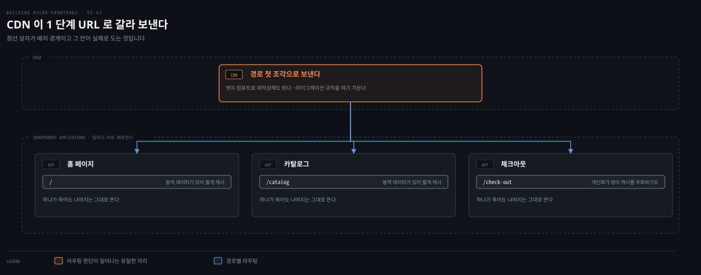
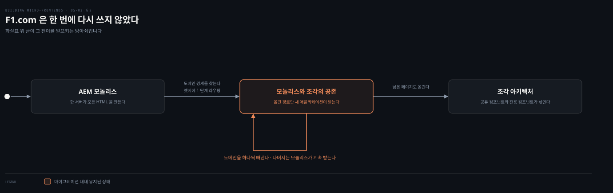
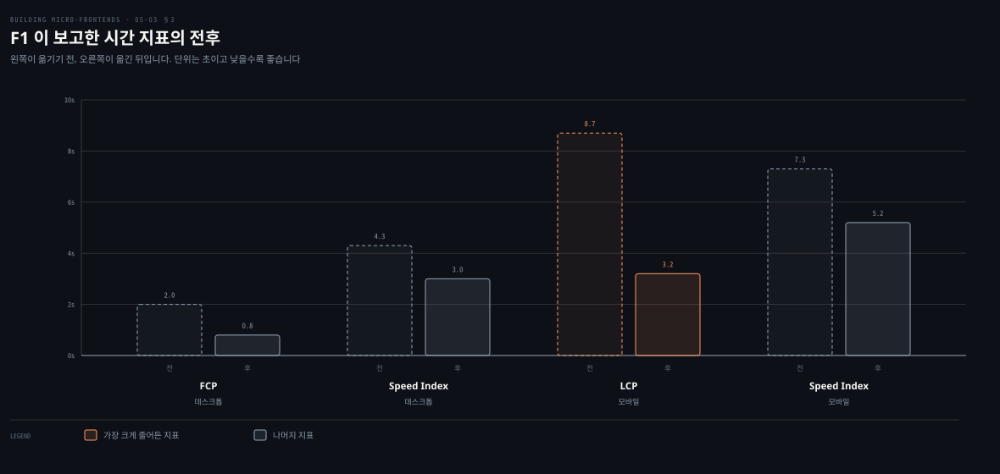

# URL로 나누기 — F1이 걸어간 길

---

> 앞 편이 한 페이지 안에서 조각을 꿰맸다면 이 편은 아예 페이지째 갈라 보냅니다. 조합 계층이 없어서 단순하고, 그 단순함이 마이그레이션에서 무기가 됩니다. F1.com이 그 길을 걸었고 수치를 남겼습니다.

## 핵심 요약

> 이 편 전체가 매달린 하나의 생각은 **런타임 조합의 세밀함을 포기하면 배포와 마이그레이션의 단순함을 얻는다**는 것입니다.
>
> CDN이 URL의 첫 조각만 보고 그에 맞는 독립 애플리케이션으로 요청을 보냅니다. 조합 계층도 런타임 오케스트레이션도 없습니다.
>
> 그래서 조각 하나가 죽어도 나머지가 계속 돕니다. 실패가 격리되고 플랫폼을 가로질러 번지지 않습니다.
>
> 캐시 정책도 도메인마다 다르게 잡습니다. 다만 정책이 어긋나면 사용자 경험이 들쭉날쭉해집니다.
>
> F1.com이 이 방식으로 AEM 모놀리스에서 옮겨 갔습니다. 한 번에 다시 쓰지 않고 스트랭글러 무화과 패턴으로 도메인을 하나씩 빼냈습니다.
>
> 결과가 수치로 남았습니다. 구독 34% 증가, 플랫폼 비용 26% 감소, 모바일 LCP 8.7초에서 3.2초입니다.

## 학습 목표

이 내용을 읽고 나면:

1. URL 분할이 무엇을 포기하고 무엇을 얻는지 한 문장으로 말할 수 있습니다.
2. CDN 라우팅과 엣지 재작성이 마이그레이션에서 왜 유용한지 설명할 수 있습니다.
3. 캐시 정책을 도메인마다 다르게 잡을 때의 이점과 위험을 함께 댈 수 있습니다.
4. F1.com이 모놀리스에서 옮겨 간 순서를 재현할 수 있습니다.
5. F1이 보고한 수치를 사업과 성능과 개발자 경험으로 나눠 말할 수 있습니다.

아래는 이 편이 다루는 구조를 배치로 편 지도입니다. 요청이 경로 첫 조각만 보고 곧바로 그 애플리케이션에 닿습니다.

## 1. 조합 계층 없이 나눈다

> 이 방식이 파는 것과 사는 것을 저자가 첫 문장에 적어 둡니다.

### 풀려는 문제

앞 편의 HTML 조각 방식은 UI 컴포저라는 조합 계층을 하나 세웠습니다. 그 계층이 있으면 한 페이지를 여러 팀이 나눠 가질 수 있지만, 그 계층 자체를 만들고 확장하고 감시해야 합니다.

조직이 현대화 중이라면 그 부담이 무겁습니다. 저자가 이 접근을 소개하는 문장이 그 사정을 정확히 짚습니다. **이 기법은 세밀한 런타임 조합을 배포와 마이그레이션의 단순함과 맞바꾸며, 그 교환이 대부분 조직의 현실적 제약과 잘 맞습니다.**

### CDN이 첫 조각만 본다

이 기법은 트래픽을 서로 다른 독립 배포 서비스로 보냅니다. 한 페이지에 여러 조각을 조합하는 대신, **최상위 경로 전체를 특정 애플리케이션에 배정합니다.** `/news`나 `/standings`나 `/video` 같은 것이며, 각각을 전담 팀이 유지하고 배포합니다.

CDN이 들어오는 모든 사용자 요청을 받습니다. URL의 첫 세그먼트를 보고 그 부분을 책임지는 조각 애플리케이션으로 요청을 곧바로 보냅니다. 루트 경로는 홈 페이지 조각이, `/catalog`는 카탈로그 조각이, `/check-out`은 체크아웃 조각이 다루는 식입니다.

여기에 대안이 하나 있습니다. **엣지 컴퓨트로 요청을 가로채 특정 엔드포인트로 재작성하는 것**입니다. 이 방식이 마이그레이션에 특히 유용한데, 임시 리다이렉션 로직을 메인 코드베이스 밖에 두기 때문입니다. 이 규칙들을 엣지에 가둬 두면 조각 로직이 잘 캡슐화된 채로 남고, 조각이 바뀔 때마다 추가 테스트를 하지 않아도 됩니다.

### 얻는 것 셋

이 아키텍처가 주는 것을 저자가 셋으로 정리합니다.

**단순함과 회복력**이 첫째입니다. 각 조각이 완전히 독립적인 애플리케이션이며 자기 팀이 개발하고 배포하고 확장합니다. **조각 하나를 쓸 수 없게 돼도 나머지 시스템은 끊김 없이 계속 동작합니다.** 이 관심사 격리가 실패를 가두고 플랫폼을 가로질러 번지지 않게 해서 시스템 전체의 신뢰성을 크게 높입니다.

**캐시 전략의 유연함**이 둘째입니다. 조각마다 따로 서빙되므로 팀이 자기 도메인의 필요에 맞춰 캐시 정책을 재단할 수 있습니다. 자주 바뀌지 않는 "문의하기" 조각은 CDN에 공격적으로 캐시해 성능을 높이고 백엔드 부하를 줄입니다. 반대로 동적 데이터를 다루는 홈 페이지나 카탈로그 조각은 더 신선한 콘텐츠가 필요해 보수적으로 캐시하거나 아예 캐시를 우회하기도 합니다. 이 세밀함 덕분에 사이트 영역마다 성능과 비용과 데이터 신선도의 균형을 사업이 정할 수 있습니다.

여기에 저자가 경고를 하나 답니다. **조각들 사이에서 캐시 정책이 어긋나면 사용자 경험이 들쭉날쭉해질 수 있고, 그러면 캐시 무효화 패턴을 서로 맞춰야 합니다.**

**배포의 자유**가 셋째입니다. 각 조각을 컨테이너로도 서버리스 함수로도 호스팅할 수 있습니다. 조직의 인프라 선호와 확장성 요구에 따라 팀이 가장 알맞은 기술 스택과 배포 전략을 고릅니다.

### 공유와 인증은 이렇게 푼다

조합 계층이 없으니 공유 컴포넌트를 어떻게 나눌지가 남습니다. 유틸리티 라이브러리나 디자인 시스템 컴포넌트 같은 공유 의존성은 **비공개 패키지 저장소로 배포**합니다. 이상적으로는 이 공유 요소를 웹 컴포넌트로 구현합니다. 그러면 팀이 애플리케이션마다 다시 쓰지 않고 UI 요소를 재사용하고 갱신할 수 있습니다. 시각적·기능적 일관성이 조각 전체에 유지되면서, 각 팀이 독립적으로 진화하고 디자인 시스템 갱신을 점진적으로 받아들입니다.

인증도 단순해집니다. **인증 토큰을 기본 도메인 범위의 쿠키에 저장하면**, 그 도메인 아래에서 서빙되는 모든 조각이 토큰에 접근해 안전한 API 호출이나 세션 검증에 재사용할 수 있습니다. 복잡한 교차 애플리케이션 인증 메커니즘이 필요 없어지고, 사용자가 사이트의 여러 구역을 오갈 때 경험이 끊기지 않습니다.

## 2. F1.com이 걸어간 길

> 1단계 URL 분할이 F1.com의 전환에서 중심이었습니다. 저자가 그 여정을 순서대로 적습니다.

### 풀려는 문제

과제는 레거시 모놀리식 웹 플랫폼을 확장 가능하고 성능이 높으며 독립 배포되는 시스템으로 현대화하는 것이었습니다.

처음 아키텍처는 많은 엔터프라이즈 웹사이트가 그렇듯 고전적인 3계층 모놀리스였습니다. **애플리케이션 서버 하나가 모든 HTML을 만들고 모든 비즈니스 로직을 관리하며 모든 사용자 요청을 다뤘습니다.** 직관적이기는 하지만 확장성과 릴리스 속도와 팀 자율성에 상당한 제약이 걸렸습니다.

증상이 분명합니다. **아무리 작은 변경이라도 애플리케이션 전체의 회귀 테스트와 재배포를 요구했고**, 그래서 병목이 생기고 위험이 커졌습니다.

### 도메인 경계부터 찾았다

마이그레이션은 사이트 구조 안의 명확한 도메인 경계를 식별하는 데서 시작했습니다. F1.com에서는 구독 여정과 뉴스 목록과 통계 같은 페이지들이 분리되어 서로 다른 팀이 소유할 수 있다는 것을 알아본 일입니다.

**사이트 전체를 한 번에 다시 쓰지 않았습니다.** 팀은 점진적인 스트랭글러 무화과 패턴을 택했습니다. 새 기능이나 도메인을 하나씩 독립 애플리케이션으로 빼냈습니다.

핵심 조력자가 **엣지나 게이트웨이 계층의 1단계 URL 라우팅**이었습니다. 들어오는 요청을 최상위 경로에서 검사했습니다. 구독 페이지의 `/tv-proposition` 같은 것이면 알맞은 독립 서비스로 곧바로 보냈습니다. 여전히 모놀리스가 서빙하는 페이지는 예전대로 처리되고 새로 만들거나 옮긴 페이지는 전용 조각 애플리케이션이 매끄럽게 서빙했습니다.

### 읽어내기 — 조합 계층이 없다는 것이 마이그레이션의 무기다

이 라우팅 전략이 마이그레이션에 주는 것을 저자가 짚습니다. **복잡한 조합 계층도 런타임 오케스트레이션도 필요 없습니다.** 각 조각이 자기 자산과 의존성과 렌더링을 책임지는 자족적 애플리케이션이기 때문입니다.

헤더와 푸터와 디자인 시스템 컴포넌트 같은 공유 요소는 라이브러리로 배포해 애플리케이션들이 재사용합니다. 배포를 강하게 결합하지 않으면서 시각적 일관성을 지키는 방식입니다.

시간이 지나며 F1 웹 플랫폼은 레거시 Adobe Experience Manager 모놀리스에서 현대적인 조각 아키텍처로 진화했습니다. 이 조각들은 **플랫폼 전반에 일관되게 쓰이는 공유 컴포넌트와, 특화 기능을 위한 "스노플레이크" 컴포넌트를 함께** 활용했습니다.

## 3. F1이 남긴 수치

> 저자가 이 사례를 "이 아키텍처가 조직에 얼마나 잘 맞는지 보여 주는 훌륭한 증언"이라고 부릅니다.

### 풀려는 문제

아키텍처 전환의 값은 대개 정성적으로만 말해집니다. 이 사례가 값진 이유는 F1이 사업과 성능과 개발자 경험 세 축의 수치를 함께 공개했기 때문입니다.

### 사업 쪽

| 지표 | 값 |
|---|---|
| F1 Unlocked와 F1 TV 구독·가입 | 34% 증가 (2024년 1월부터 9월까지 측정) |
| 플랫폼 비용 | 26% 감소 (워크로드를 Amazon EC2에서 컨테이너 기반으로 옮겨) |

### 성능 쪽

"Latest F1 News" 페이지에서 잰 웹 바이탈이 눈에 띄게 개선됐습니다.

- FCP가 데스크톱에서 2.0초에서 0.8초로 줄었습니다.
- Speed Index가 데스크톱에서 4.3초에서 3.0초로 개선됐고, 비필수 코드를 빼면 0.6초까지 내려갔습니다.
- 모바일 LCP가 8.7초에서 3.2초로 떨어졌습니다.
- 모바일 Speed Index가 7.3초에서 5.2초로, 비필수 코드 없이는 2.2초로 개선됐습니다.
- 전체 Lighthouse 성능 점수가 53에서 83으로 올랐습니다. 모바일에서 56%, 데스크톱에서 30% 개선입니다.

> 사업 지표 넷은 2장에서 여덟 회사의 사례를 볼 때 이미 막대로 그렸습니다. 이 편의 도식은 그때 다루지 않은 시간 지표만 담았습니다.

### 개발자 경험 쪽

개발자 경험도 크게 나아졌다고 저자가 적습니다.

- 엔지니어가 개별 조각에 집중하게 되어 인지 부하가 줄었습니다.
- 독립적인 개발과 테스트와 배포로 플랫폼 전체 회귀 테스트가 최소화됐습니다.
- 디자인 시스템과의 긴밀한 통합, 그리고 자동화된 접근성 테스트가 전달 품질을 앞당겼습니다.

### 읽어내기 — 아키텍처가 나를 위해 돌아야 한다

저자가 이 사례를 닫으며 남기는 문장이 이 책의 태도를 압축합니다. 언제나 개선의 여지는 더 있고, **가장 중요한 것은 아키텍처가 나를 위해 돌아가는 것이지 그 반대가 아니라는 점**입니다.

이 사례를 더 알고 싶다면 AWS re:Invent 2024에서 F1 디지털 기술 팀의 디지털 솔루션 아키텍트인 Ivan Rigoni가 한 발표를 보라고 안내합니다.

## 적용 관점

> 아래는 백엔드 개발자가 이미 가진 판단 기준과 이 절을 잇는 노트의 읽기입니다. 책이 백엔드 독자를 향해 쓴 대목이 아닙니다.

경로 접두사로 요청을 서로 다른 애플리케이션에 보내는 구조는 게이트웨이 라우팅 규칙과 같습니다. 다른 점은 그 규칙이 애플리케이션이 아니라 CDN 설정에 있다는 것이고, 그래서 라우팅 변경에 배포가 필요 없습니다. 마이그레이션 중 임시 규칙을 엣지에 가둬 두라는 조언도 같은 이유입니다. 코드베이스에 들어간 임시 분기는 좀처럼 지워지지 않습니다.

조합 계층이 없다는 점이 이 방식의 회복력을 만듭니다. 중간에 아무것도 없으면 중간에서 실패할 것도 없습니다. 반대로 앞 편의 UI 컴포저는 모든 요청이 지나는 단일 지점이라 그것이 죽으면 전부 죽습니다. 어느 쪽이 나은지는 한 화면을 여러 팀이 나눠 가져야 하느냐가 정합니다.

인증 토큰을 기본 도메인 쿠키에 두는 방식은 3장의 수평 분할에서 본 것과 같습니다. 여기서는 조각들이 애초에 별개 애플리케이션이라 그 선택이 더 자연스럽습니다. 서브도메인이 갈리면 쿠키의 `domain` 속성으로 범위를 넓혀야 한다는 조건도 그대로입니다.

스트랭글러 무화과를 1단계 URL로 구현한 대목은 백엔드에서 프록시로 같은 일을 하던 것과 같습니다. 옮긴 엔드포인트만 새 서비스로 보내고 나머지는 레거시가 계속 받게 합니다. F1이 그것을 프론트엔드에서 했고, 조합 계층을 세우지 않았기 때문에 그 전환이 가벼웠습니다.

수치를 세 축으로 나눠 보고한 방식도 참고할 만합니다. 성능 지표만 들고 가면 "그래서 사업에 뭐가 좋아졌냐"는 질문을 받습니다. 구독 34%와 비용 26%를 함께 놓았기에 이 사례가 설득력을 갖습니다.

## 면접 대비

Q: URL로 나누는 방식은 무엇을 포기하고 무엇을 얻나요?

A: 세밀한 런타임 조합을 포기하고 배포와 마이그레이션의 단순함을 얻습니다. 한 페이지에 여러 조각을 조합하는 대신 최상위 경로 전체를 특정 애플리케이션에 배정하고, CDN이 URL 첫 세그먼트를 보고 그리로 보냅니다. 조합 계층도 런타임 오케스트레이션도 없어서 조각 하나가 죽어도 나머지가 계속 돕니다.

Q: 조각마다 캐시 정책을 다르게 잡을 때 조심할 것은 무엇인가요?

A: 정책이 어긋나면 사용자 경험이 들쭉날쭉해집니다. 그러면 캐시 무효화 패턴을 팀 사이에 맞춰야 합니다. 저자의 예로 자주 바뀌지 않는 "문의하기" 조각은 CDN에 공격적으로 캐시하고, 동적 데이터를 다루는 홈이나 카탈로그는 보수적으로 캐시하거나 우회합니다.

Q: F1.com은 모놀리스에서 어떻게 옮겨 갔나요?

A: 한 번에 다시 쓰지 않고 점진적인 스트랭글러 무화과 패턴을 썼습니다. 먼저 사이트 구조 안의 도메인 경계를 식별했고, 엣지나 게이트웨이 계층에 1단계 URL 라우팅을 걸었습니다. `/tv-proposition` 같은 최상위 경로를 검사해 옮긴 것은 새 독립 서비스로, 아직 옮기지 않은 것은 모놀리스로 보냈습니다. 그 과정에서 새 도메인을 하나씩 빼냈습니다.

Q: F1이 보고한 결과는 무엇인가요?

A: 사업 쪽에서 구독과 가입이 34% 늘고 플랫폼 비용이 26% 줄었습니다. 성능 쪽에서 데스크톱 FCP가 2.0초에서 0.8초로, 모바일 LCP가 8.7초에서 3.2초로 내려갔고 Lighthouse 점수가 53에서 83이 됐습니다. 개발자 경험 쪽에서는 엔지니어의 인지 부하가 줄고 플랫폼 전체 회귀 테스트가 최소화됐습니다.

### 요약 세 문장

1. URL 분할은 조합 계층을 세우지 않는 대신 페이지째 갈라 보내고, 그 단순함이 실패 격리와 마이그레이션의 무기가 됩니다.
2. 캐시 정책과 배포 방식을 도메인마다 따로 정할 수 있지만, 정책이 어긋나면 무효화를 서로 맞춰야 합니다.
3. F1.com이 이 방식으로 AEM 모놀리스를 걷어냈고 사업과 성능과 개발자 경험 세 축에서 수치를 남겼습니다.

## 핵심 개념 체크리스트

- [ ] 이 방식이 맞바꾸는 두 가지를 한 문장으로 말할 수 있는가?
- [ ] CDN 라우팅과 엣지 재작성 가운데 마이그레이션에 무엇이 유리한지 근거를 댈 수 있는가?
- [ ] 캐시 정책 차등의 이점과 위험을 각각 말할 수 있는가?
- [ ] 공유 컴포넌트와 인증 토큰을 이 구조에서 어떻게 다루는지 설명할 수 있는가?
- [ ] F1의 마이그레이션 세 단계를 순서대로 재현할 수 있는가?
- [ ] F1의 수치를 사업과 성능으로 나눠 각각 둘 이상 댈 수 있는가?

## 관련 문서

- [HTML 조각 — UI 컴포저가 꿰맨다](05-02.HTML%20조각%20—%20UI%20컴포저가%20꿰맨다.md) — 조합 계층을 세우는 반대편 방식
- [여덟 회사가 고른 길](02-04.여덟%20회사가%20고른%20길.md) — F1의 사업 지표 넷을 막대로 그린 자리
- [진화와 호스팅 — 레거시와 장바구니와 CDN](04-04.진화와%20호스팅%20—%20레거시와%20장바구니와%20CDN.md) — 스트랭글러 무화과가 클라이언트 쪽에서 나온 자리
- [Building Micro-Frontends 정독 인덱스](README.md) — 다음 편인 Next.js 멀티 존의 진행 상태는 인덱스의 노트 표에서 봅니다

## 참고 자료

- 《Building Micro-Frontends, Second Edition》(Luca Mezzalira, O'Reilly, 2026) ISBN 978-1-098-17078-3
  - 다룬 범위: Splitting by URL · The Formula 1 Website is Powered by Micro-Frontends
  - 이어서: Next.js Multi-Zones · How to Handle Shared Components · How to Manage Data
- [AWS re:Invent 2024](https://reinvent.awsevents.com/) — 저자가 이 사례의 발표로 안내한 행사. 발표자는 F1 디지털 기술 팀의 Ivan Rigoni
