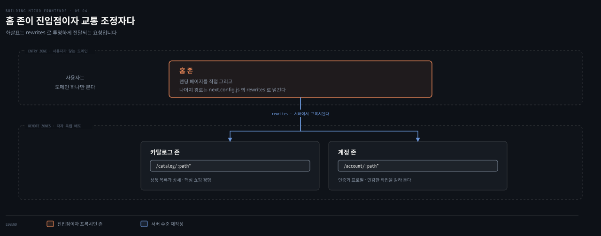
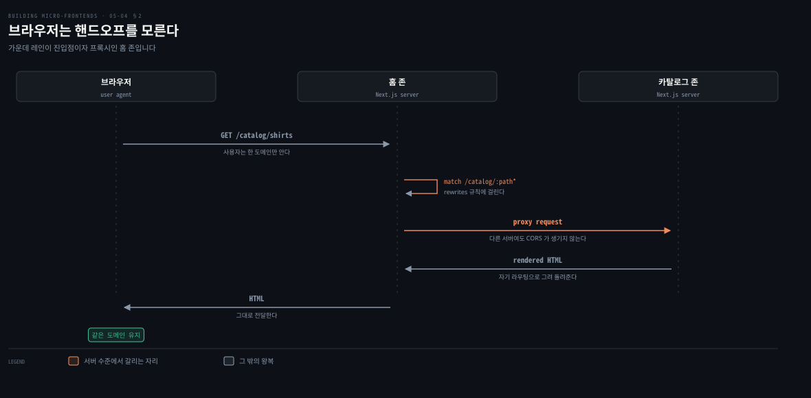
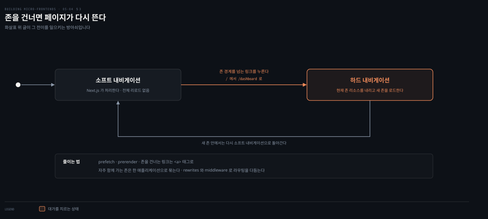
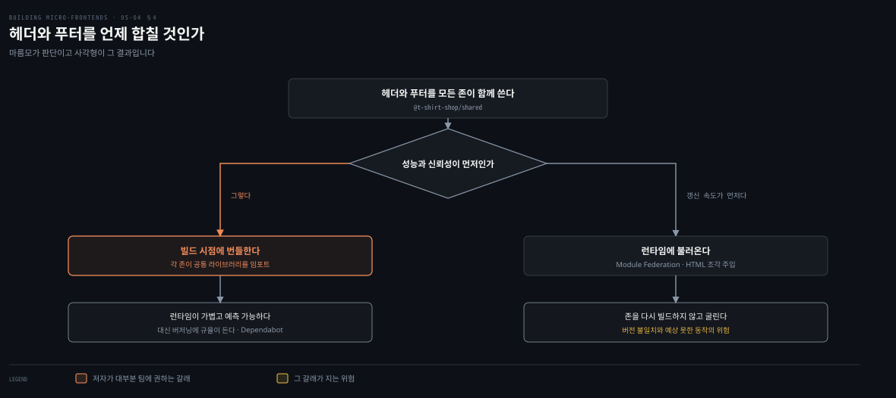
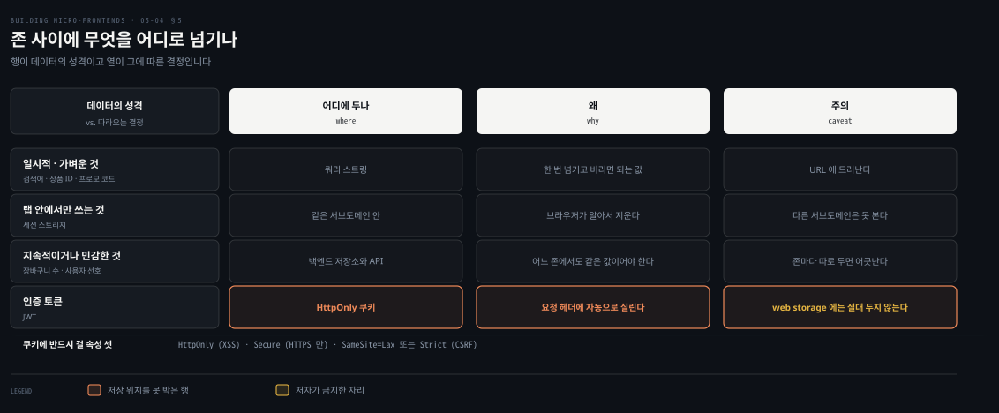

# Next.js 멀티 존 — 존을 프록시로 잇는다

---

> 앞 편이 CDN에 라우팅을 맡겼다면 이 편은 그 일을 프레임워크가 합니다. 존 하나가 진입점이 되어 나머지를 프록시하고, 사용자는 도메인 하나만 봅니다. 대신 존을 건널 때마다 페이지가 다시 뜹니다.

## 핵심 요약

> 이 편 전체가 매달린 하나의 생각은 **멀티 존이 파는 것은 독립 배포이고 그 값은 존을 건널 때의 하드 내비게이션**이라는 것입니다.
>
> 각 존이 특정 라우트를 책임지는 독립 Next.js 애플리케이션이며, 사용자에게는 하나의 도메인으로 합쳐집니다.
>
> 진짜 힘은 `next.config.js`의 `rewrites`에서 옵니다. 리버스 프록시처럼 동작해 CORS를 피하고 서버 수준에서 요청을 넘깁니다.
>
> 같은 존 안의 이동은 빠른 소프트 내비게이션이지만 존을 건너면 리소스가 통째로 갈립니다. prefetch와 `<a>` 태그로 그 대가를 줄입니다.
>
> 공유 컴포넌트는 런타임이 아니라 빌드 시점에 번들합니다. 런타임이 가볍고 예측 가능해지는 대신 버저닝에 규율이 듭니다.
>
> 존 사이 데이터는 성격에 따라 길이 다릅니다. 일시적인 것은 쿼리 스트링, 인증 토큰은 `HttpOnly` 쿠키입니다.


## 학습 목표

이 내용을 읽고 나면:

1. 멀티 존이 무엇이고 `rewrites`가 어떤 문제를 푸는지 설명할 수 있습니다.
2. 소프트 내비게이션과 하드 내비게이션이 갈리는 지점과 그 대가를 줄이는 법을 말할 수 있습니다.
3. 공유 컴포넌트를 빌드 시점에 합치는 근거와 그 대가를 함께 댈 수 있습니다.
4. 데이터의 성격에 따라 존 사이에 무엇을 어디로 넘길지 판별할 수 있습니다.
5. 쿠키에 걸어야 할 보안 속성 셋과 각각이 막는 공격을 짝지을 수 있습니다.

아래는 저자의 티셔츠 가게 프로젝트를 배치로 편 지도입니다. 홈 존이 진입점이면서 나머지를 프록시합니다.




## 1. 존이라는 단위

> 저자가 이 절을 여는 문장이 짓궂습니다. 멀티 존을 설명해 놓고 "조각처럼 들리지 않느냐"고 묻습니다.

### 풀려는 문제

대규모 애플리케이션을 독립 배포 가능한 구역으로 나눠야 합니다. 앞 편처럼 CDN에 맡길 수도 있지만, 그러면 라우팅 규칙이 애플리케이션 밖 인프라 설정에 흩어집니다.

### 존은 독립 애플리케이션이다

이 모델에서 각 "존"은 특정 라우트나 기능 집합을 책임지는 **독립 Next.js 애플리케이션**입니다. `/blog/*`나 `/dashboard/*`, 또는 메인 사이트 같은 것입니다. 그러면서 **모든 존이 최종 사용자에게는 하나의 도메인 아래로 매끄럽게 합쳐집니다.**

저자의 예제 프로젝트가 티셔츠 가게입니다. Next.js 15의 멀티 존으로 조각 아키텍처를 구현했고 존이 셋입니다.

| 존 | 무엇을 맡는가 |
|---|---|
| 홈 | 랜딩 페이지 역할을 하며 사용자를 맞이하고 추천 상품을 보여 줍니다 |
| 카탈로그 | 상품 목록과 상세 뷰를 관리하며 핵심 쇼핑 경험을 다룹니다 |
| 계정 | 사용자 인증과 프로필 관리를 맡아, 민감한 작업을 논리적으로도 기술적으로도 나머지와 갈라 둡니다 |

각 존이 자기 라우팅과 설정을 유지합니다. 그래서 **팀이 자기 책임 영역 안에서 나머지 플랫폼에 영향을 주지 않고 결정을 내립니다.** 공유 컴포넌트는 공유 라이브러리로 관리하고, 스타일링은 Tailwind CSS로 통일해 어느 구역을 방문하든 같은 결을 유지합니다.

### rewrites가 진짜 힘이다

멀티 존의 진짜 힘은 `rewrites`를 어떻게 설정하느냐에서 옵니다. `next.config.js`에 `rewrites`를 두면 **특정 경로로 오는 요청이 알맞은 존으로 투명하게 프록시됩니다.** 그 존이 다른 서버나 다른 포트에서 돌고 있어도 그렇습니다.

이것이 리버스 프록시처럼 동작해 **CORS 문제를 피하고 모든 존이 하나의 응집된 애플리케이션으로 보이게** 합니다. `/dashboard/:path*`를 `https://dashboard.example.com/:path*`로 재작성하면, 대시보드 팀이 나머지 사이트와 따로 배포하고 관리할 수 있습니다.

홈 존의 설정이 이렇습니다.

```javascript
async rewrites() {
  return {
    fallback: [
      {
        source: '/catalog/:path*',
        destination: `${process.env.NEXT_PUBLIC_CATALOG_URL}${process.env.NEXT_PUBLIC_CATALOG_BASE_PATH}/:path*`,
      },
      {
        source: '/account/:path*',
        destination: `${process.env.NEXT_PUBLIC_ACCOUNT_URL}${process.env.NEXT_PUBLIC_ACCOUNT_BASE_PATH}/:path*`,
      },
    ],
  };
},
```

저자가 여기에 단서를 하나 답니다. 이 설정이면 **자기만의 리버스 프록시를 만들어 비슷하게 설정할 수도 있습니다.** 그래서 멀티 존을 쓰다가 내장 프록시에서 커스텀 리버스 프록시로 바꾸는 데는 최소한의 변경만 듭니다.

### 미들웨어가 한 겹 더 준다

Next.js의 미들웨어가 유연함을 하나 더 얹습니다. **요청이 완료되기 전에 코드를 실행**하게 해 주어, 들어오는 요청에 따라 재작성하거나 리다이렉트하거나 커스텀 로직을 주입할 수 있습니다.

멀티 존 아키텍처에서 미들웨어가 쓰이는 자리가 셋입니다. 인증을 다루고 기능 플래그를 적용하고 A/B 테스트를 수행합니다. 요청이 알맞은 존으로 라우팅되거나 비즈니스 규칙대로 처리되게 하는 일을 **메인 애플리케이션 코드가 돌기 전에** 끝냅니다.


## 2. 브라우저는 핸드오프를 모른다

> 사용자가 `/catalog/shirts`를 요청하면 무슨 일이 일어나는지 저자가 시퀀스로 그려 둡니다.



### 풀려는 문제

존이 서로 다른 애플리케이션이면 사용자가 그 경계를 느낄 수 있습니다. 도메인이 바뀌거나 CORS 오류가 나면 하나의 사이트라는 인상이 깨집니다.

### 홈 존이 교통을 정리한다

사용자가 사이트를 방문하면 루트 경로나 홈 존이 다루는 라우트는 홈 존이 로컬에서 처리합니다. 그런데 `/catalog/`나 `/account/`로 시작하는 경로로 이동하면, **홈 존의 Next.js 서버가 `next.config.js`의 `rewrites`를 써서 그 요청을 알맞은 원격 존으로 투명하게 전달합니다.** 들어온 경로를 목적지 URL과 base path로 매핑하는데, 그 값들은 환경 변수로 지정됩니다.

결과가 이렇습니다. **사용자는 같은 도메인에 머물고, 내부적으로는 완전히 별개의 Next.js 애플리케이션으로 요청이 라우팅됩니다.**

이 접근 덕분에 각 존이 독립적으로 개발되고 배포되고 확장되며, 홈 존이 진입점이자 교통 조정자 노릇을 합니다. **재작성이 서버 수준에서 처리되므로 브라우저는 핸드오프를 알지 못합니다.** `/catalog/shirts`나 `/account/profile`로의 이동이 사이트의 자연스러운 일부로 보입니다. 그 페이지들을 서로 다른 애플리케이션이 렌더하는데도 그렇습니다.

### 읽어내기 — 1단계 URL을 한 번만 정한다

이 메커니즘이 처음에는 성가셔 보일 수 있다고 저자가 인정합니다. 그런데 재작성 코드가 주는 유연함이 충분해서, **1단계 URL을 한 번만 정해 두면 프로젝트 수명 내내 최소한의 변경만 필요합니다.**

앞 편의 CDN 라우팅과 같은 판단이 여기서도 통합니다. 경로의 첫 조각이 소유권 경계이고, 그 아래는 각 존이 알아서 합니다.


## 3. 존을 건너면 페이지가 다시 뜬다

> 이 방식이 치르는 값이 여기 있습니다. 저자가 그것을 감추지 않고 먼저 적습니다.



### 풀려는 문제

멀티 존에서 내비게이션은 사용자에게 매끄럽고 통일되게 느껴지도록 설계됩니다. 같은 존 안에서 페이지를 오갈 때는 Next.js가 처리해 **빠른 소프트 내비게이션**이 되고 전체 페이지 리로드가 필요 없습니다.

그런데 한 존에서 다른 존으로 이동하면, 예를 들어 `/`에서 `/dashboard`로 가면 **하드 내비게이션**이 일어납니다. 현재 존의 리소스를 내리고 새 존의 것을 로드합니다.

### 대가를 줄이는 네 가지

하드 내비게이션이 멀티 존이나 조각 아키텍처에서 때로 불가피하지만, 그 영향을 줄이고 매끄러운 경험을 지킬 모범 사례가 있습니다.

- **prefetch와 prerender를 쓴다.** Vercel이 권하는 방식으로, 갈 가능성이 높은 목적지의 리소스를 미리 가져오거나 숨겨진 탭에서 다음 페이지를 미리 렌더합니다. 그러면 사용자가 하드 내비게이션을 시작할 때 콘텐츠 대부분이 이미 로드돼 있습니다. Speculation Rules API로 어떤 링크를 prefetch하거나 prerender할지 선언적으로 지정할 수 있습니다.
- **존 경계를 넘는 링크에는 평범한 `<a>` 태그를 쓴다.** Next.js의 `<Link>` 컴포넌트를 쓰지 않습니다. 그래야 Next.js가 다른 애플리케이션에 속한 라우트로 소프트 내비게이트하려 시도하지 않고, 브라우저가 전체 페이지 로드로 처리합니다.
- **자주 함께 방문되는 존은 한 애플리케이션 안에 묶는 것을 고려한다.** 필요한 하드 내비게이션 횟수 자체가 줄어듭니다.
- **`rewrites`와 미들웨어로 라우팅 설정을 다듬는다.** 요청 처리를 최적화하고 사용자 여정을 더 매끄럽게 만듭니다.

### 읽어내기 — 존을 나누는 축은 함께 가는 빈도다

세 번째 항목이 이 방식의 설계 기준을 드러냅니다. **자주 함께 방문되는 존을 묶으라는 말은, 존의 경계를 도메인만이 아니라 사용자 동선으로도 봐야 한다는 뜻입니다.**

도메인 경계로만 나누면 사용자가 하루에도 몇 번씩 두 존을 오갈 수 있고, 그때마다 페이지가 다시 뜹니다. 3장에서 수직 분할이 "사용자가 실제로 밟는 흐름"으로 나뉘어야 성능을 벌었던 것과 같은 이야기입니다.


## 4. 공유 컴포넌트를 언제 합치나

> 헤더와 푸터를 모든 존이 함께 씁니다. 그것을 언제 끼워 넣을지가 결정적인 설계 선택입니다.



### 풀려는 문제

존이 독립 배포되므로 공유 컴포넌트를 어느 시점에 합칠지 정해야 합니다. 런타임에 불러오면 갱신이 빠르고, 빌드 시점에 넣으면 런타임이 가볍습니다.

### 저자의 선택은 빌드 시점이다

티셔츠 가게 프로젝트에서 헤더나 푸터처럼 모든 존에 걸치는 공유 컴포넌트는 **런타임이 아니라 빌드 시점에 포함됩니다.** 각 존이 공통 라이브러리에서 공유 컴포넌트를 직접 임포트해 자기 빌드 과정의 일부로 삼고, 그래서 각 독립 Next.js 애플리케이션의 최종 산출물에 번들됩니다.

```javascript
import "@t-shirt-shop/shared/src/styles/globals.css";
import { Header, Footer } from "@t-shirt-shop/shared";

export default function RootLayout({ children }) {
  return (
    <html lang="en">
      <body className={inter.className}>
        <div className="min-h-screen flex flex-col">
          <Header />
          <main className="flex-grow">{children}</main>
          <Footer />
        </div>
      </body>
    </html>
  );
}
```

이 선택이 주는 것을 저자가 정리합니다. 가장 중요한 것은 **런타임의 로직과 스타일 중복을 피한다**는 점입니다. 그 중복은 일관성 없는 사용자 경험과 불필요하게 큰 자바스크립트 번들로 이어질 수 있습니다. 모든 존이 빌드 시점에 같은 버전을 쓰므로 애플리케이션 전반에 일관된 룩앤필이 유지됩니다. 디버깅과 유지보수도 단순해지는데, 공유 컴포넌트를 갱신하면 각 존이 다음에 빌드되고 배포될 때 반영되기 때문입니다.

### 그 대가는 버저닝의 규율이다

이 접근은 패키지 관리와 버저닝에 규율을 요구합니다. Dependabot 같은 자동화 도구가 특히 유용한데, **공유 컴포넌트를 쓰는 존들의 리뷰를 단순화하고 PR을 열어 의존성을 자동으로 갱신**해 주기 때문입니다. 저자는 이것을 런타임의 속도와 단순함을 얻기 위한 감당할 만한 트레이드오프로 봅니다.

### 런타임 공유라는 대안

어떤 조직은 Module Federation이나 HTML 조각 주입으로 런타임 공유를 실험합니다. 그러면 존을 다시 빌드하지 않고도 갱신을 굴릴 수 있습니다.

그런데 유연함의 대가가 있습니다. **의존성 관리에 복잡도가 더해지고, 존마다 호환되지 않는 버전의 컴포넌트를 로드하면 버전 불일치나 예상 못한 동작이 생길 수 있습니다.**

그래서 대부분의 팀, 특히 성능과 신뢰성을 우선하는 팀에게는 빌드 시점 공유가 선호되는 접근입니다. 런타임 환경이 가볍고 예측 가능해지며, 사용자가 어느 존에 있든 스타일과 동작이 일관되게 유지됩니다.

### 읽어내기 — 확신이 없으면 중복부터

저자가 여기서 3장의 이야기를 다시 부릅니다. 코드 재사용성에 관해 했던 말이 여전히 유효하다는 것입니다.

> 확신이 없으면 그냥 코드를 중복하는 데서 시작하십시오. 나중에 공유 컴포넌트 같은 추상화를 만들고 유지할 가치가 정말 있는지 평가하면 됩니다. 너무 일찍 너무 많이 공유하지 마십시오. 불필요한 복잡도가 생기고 다른 팀의 삶이 힘들어집니다.


## 5. 존 사이에 무엇을 어디로 넘기나

> 존이 독립 애플리케이션이라 정보를 나누려면 사용자 경험과 보안을 함께 봐야 합니다.



### 풀려는 문제

각 존이 별개 애플리케이션이므로 상태가 자동으로 공유되지 않습니다. 그렇다고 아무거나 URL에 실으면 민감한 값이 드러납니다.

### 가벼운 것은 쿼리 스트링으로

검색어나 상품 ID나 프로모 코드 같은 **가볍고 일시적인 정보**에는 쿼리 스트링이 효과적이고 직관적인 해법입니다.

저자의 예가 구체적입니다. 사용자가 홈 페이지에서 프로모 코드를 넣고 카탈로그 존의 특정 상품으로 이동하면, 프로모 코드를 쿼리 파라미터로 URL에 덧붙입니다. 카탈로그 존이 요청을 받으면 쿼리 스트링에서 그 코드를 꺼내 관련 할인이나 메시지를 적용합니다. 단순하고 투명하며, **한 번의 내비게이션이나 세션을 넘어 남을 필요가 없는 데이터에 잘 맞습니다.**

세션 스토리지도 고려할 수 있지만 보안 모델을 유념해야 합니다. **세션 스토리지와 로컬 스토리지는 서브도메인에 묶입니다.** `www.mysite.com`의 세션 스토리지를 `catalog.mysite.com`이 볼 수 없고 그 반대도 마찬가지입니다.

### 지속적이거나 민감한 것은 백엔드로

모든 데이터가 이런 일시적인 클라이언트 전달에 맞지는 않습니다. 장바구니 항목 수나 인증 토큰이나 사용자 선호 같은 **지속적이거나 민감한 정보**는 백엔드 저장소나 API에 기대어 존 사이의 상태를 동기화하는 편이 낫습니다.

이유가 화면에 드러납니다. 모든 존의 헤더에 표시되는 장바구니 아이콘은 사용자가 어느 존에 있든 현재 장바구니 상태를 반영해야 합니다. 그래야 일관성과 보안과 매끄러운 경험이 유지됩니다.

### 인증 토큰은 HttpOnly 쿠키로

인증은 대개 토큰으로 관리하며 보통 쿠키에 저장합니다. 각 독립 존이 안전하게 접근해 사용자의 세션을 검증할 수 있어야 하기 때문입니다. 안전한 인증 시스템의 핵심에 JWT가 있고, 사용자가 로그인할 때 인증 서비스가 발급해 브라우저에 쿠키로 설정합니다.

이 쿠키의 보안을 위해 반드시 걸어야 할 속성이 셋입니다.

| 속성 | 무엇을 막는가 |
|---|---|
| `HttpOnly` | 자바스크립트로 쿠키에 접근하지 못하게 해 XSS 공격에서 보호합니다 |
| `Secure` | HTTPS로만 전송되게 해 가로채기 공격에서 보호합니다 |
| `SameSite` | `Lax`나 `Strict`로 두면 교차 사이트 요청에 쿠키가 실리는 조건이 제한되어 CSRF를 막습니다 |

이 조치가 있으면 사용자가 존 사이를 오갈 때마다 **인증 토큰이 HTTP 헤더에 자동으로 실립니다.** 그래서 각 존의 서버가 토큰을 검증하고 SSR 검사를 수행하며, 프로필 정보나 과거 주문 이력 같은 보호된 자원에 접근할 권한이 있는지 확인합니다.

### 미들웨어로 한곳에 모은다

멀티 존에서 사용자가 페이지를 요청하면 **미들웨어가 페이지 렌더링 로직에 닿기 전에 요청을 가로챌 수 있습니다.** 여기서 두 가지를 보장합니다.

- 사용자의 세션이 유효하고 인증 토큰이 있는지 확인합니다.
- 비밀 키로 토큰을 검증해 변조되지 않았음을 확인합니다.

이 로직을 미들웨어에 모으면 **여러 존에 인증과 인가 코드를 중복할 필요가 없어집니다.** 시스템이 더 유지보수하기 쉽고 안전해집니다. 사용자 프로필이나 관리자 패널 같은 민감한 자원은 권한 있는 사용자만 접근하게 되고, 다른 사용자는 로그인이나 접근 거부 페이지로 리다이렉트됩니다.

### 세션을 오래 유지하는 법

지속적인 사용자 세션을 위해 **짧은 수명의 액세스 토큰과 함께 리프레시 토큰을 쓰는 것**이 좋은 관행입니다. 액세스 토큰은 보통 15분에서 한 시간 정도의 만료 시간을 갖고, 리프레시 토큰은 장수명이라 현재 것이 만료될 때 새 액세스 토큰을 얻는 데 씁니다. 그래야 사용자가 자주 다시 로그인하지 않아도 됩니다.

리프레시 토큰도 `HttpOnly` 쿠키에 안전하게 저장합니다. 유효한 리프레시 토큰을 근거로 백엔드 API가 새 액세스 토큰을 발급합니다. **보안과 사용성의 균형이며 탈취된 토큰이 제한된 시간 동안만 쓸모 있게 만듭니다.**

저자가 여기에 금지 조항을 명확히 답니다. **민감한 토큰을 `localStorage`나 `sessionStorage`에 절대 저장하지 마십시오.** 자바스크립트 접근에 취약해서, 공격자가 클라이언트 측 애플리케이션을 장악하면 쉽게 악용됩니다. 토큰은 언제나 HTTPS로 전송해야 하며 `Secure` 쿠키 속성이 그것을 보장합니다.

이 원칙들은 Next.js든 Astro.js든 다른 SSR 해법이든 그대로 통한다고 저자가 덧붙입니다.


## 6. Vercel이 준비하는 것

> 저자가 이 절을 미래에 관한 관측으로 닫습니다. 확정된 사실과 아직 진행 중인 것을 구분해 적습니다.

### 풀려는 문제

멀티 존은 프레임워크가 제공하는 기능을 활용한 것이지, 조각을 위해 설계된 일급 기능은 아닙니다. 그 자리가 채워질지가 남은 질문입니다.

### 확정된 방향

Vercel의 최고 기술 책임자 Malte Ubl이 **마이크로 프론트엔드가 플랫폼의 일급 프리미티브가 될 것**이라고 확인했습니다. Vercel 엔지니어링 팀과의 최근 논의에서 그 비전을 향한 구체적인 단계도 드러났습니다. 페더레이티드 렌더링과 환경 관리와 원격 컴포넌트 통합을 간소화하는 도구를 개발 중인데, 모두 조각 아키텍처의 핵심 고통 지점입니다.

두드러진 혁신이 **환경 무관 Module Federation**입니다. 원격 진입점에 상대 경로를 써서 프로덕션과 스테이징과 로컬 설정 사이를 매끄럽게 전환합니다. 중앙 `microfrontends.json` 설정 파일과, 동적 환경 시뮬레이션을 위한 개발자 툴바로 관리합니다.

저자가 이 방식의 아름다움으로 꼽는 것이 실용적입니다. **어떤 개발자든 UI에서 직접 조각을 바꿔 낄 수 있습니다.** 프로덕션을 포함한 어느 환경에서도 그렇게 할 수 있고 환경마다 따로 배포하지 않아도 됩니다. 새 버전을 배포하는 자동화를 돌리기 전에 조각을 개발하고 테스트하는 일이 크게 단순해지리라는 것이 저자의 견해입니다.

SSR 특유의 난제에는 Vercel이 재작성 규칙과 쿠키 기반 라우팅 오버라이드를 씁니다. 보안을 지키면서 사용자 경험을 해치지 않기 위해서입니다.

### 아직 초기인 것

React 서버 컴포넌트가 중추적 역할을 하게 될 것으로 보입니다. Vercel 엔지니어들이 **원격 컴포넌트**를 프로토타이핑하고 있는데, Next.js 애플리케이션으로의 코드 트랜스클루전을 가능하게 하는 강력한 추상화입니다. 호스트가 외부 서비스의 서버 렌더 콘텐츠를 최소한의 클라이언트 자바스크립트로 임베드하게 해 줍니다.

저자가 상태를 정확히 밝힙니다. **개발이 현재 초기 단계**이며, 장기 비전은 원격 컴포넌트를 오픈소스화하고 프레임워크 무관하게 만드는 것입니다. React뿐 아니라 RSC나 증분 정적 생성이나 심지어 순수 HTML을 활용할 수 있는 다른 프론트엔드 프레임워크까지 지원한다는 것입니다.

이 책을 쓰는 시점에 Vercel과 Module Federation 팀 사이의 논의가 재개됐다는 소식도 함께 적습니다. Vercel의 전략은 Module Federation에 한정되지 않고 single-spa를 비롯한 기존 프레임워크와 커스텀 조각 프레임워크까지 넓어지고 있습니다. 2025년 하반기에 퍼블릭 베타 롤아웃을 준비 중이며 컨퍼런스 데모와 생태계 파트너십도 계획돼 있습니다.

전체 세부는 아직 공개되지 않았지만, 개발자 경험과 관측성 양쪽에 집중하는 점이 총체적인 접근을 시사한다고 저자가 봅니다.


## 적용 관점

> 아래는 백엔드 개발자가 이미 가진 판단 기준과 이 절을 잇는 노트의 읽기입니다. 책이 백엔드 독자를 향해 쓴 대목이 아닙니다.

`rewrites`로 다른 존에 요청을 넘기는 구조는 리버스 프록시 그대로이고, 저자도 그렇게 부릅니다. 그래서 "내장 프록시에서 커스텀 프록시로 바꾸는 데 최소한의 변경만 든다"는 말이 성립합니다. 프레임워크 기능이 인프라 구성 요소를 애플리케이션 안으로 끌어들인 셈이라, 그 기능을 쓸지 인프라에 맡길지는 운영 주체가 누구냐로 정하면 됩니다.

하드 내비게이션은 서비스 경계를 넘는 호출과 같은 자리에 있습니다. 경계를 넘을 때 값을 치르므로, 자주 함께 불리는 것은 한쪽에 묶는 편이 낫습니다. 저자가 "자주 함께 방문되는 존은 한 애플리케이션으로 묶으라"고 한 조언이 정확히 그 판단입니다. 백엔드에서 채터한 서비스 둘을 합치던 것과 같습니다.

공유 컴포넌트를 빌드 시점에 넣는 결정은 라이브러리를 컴파일 의존성으로 두는 것과 같습니다. 런타임이 예측 가능해지는 대신 갱신하려면 다시 빌드하고 배포해야 합니다. Dependabot으로 그 부담을 줄이라는 조언도 익숙합니다. 반대로 런타임 공유는 원격 설정을 읽어 동작을 바꾸는 방식과 닮았고, 같은 위험을 집니다. 버전이 어긋나면 런타임에야 드러납니다.

인증 부분은 거의 그대로 옮겨 옵니다. `HttpOnly`와 `Secure`와 `SameSite` 셋, 짧은 액세스 토큰과 긴 리프레시 토큰, 그리고 검증 로직을 미들웨어 한곳에 모으는 배치는 필터나 인터셉터에서 하던 일입니다. 눈여겨볼 것은 저자가 web storage에 토큰을 두지 말라고 못 박은 대목입니다. 3장에서는 `localStorage`를 토큰 저장 선택지로 들었는데, 여기서는 금지합니다. 같은 책 안에서도 SSR 문맥에서는 기준이 더 엄격해집니다.

Vercel 절은 아직 확정되지 않은 로드맵이므로, 지금 설계에 반영할 근거로 쓰기보다 방향을 읽는 자료로 두는 편이 안전합니다. 저자 스스로 "개발이 초기 단계"라고 적어 두었습니다.


## 면접 대비

Q: Next.js 멀티 존이란 무엇인가요?

A: 각 존이 특정 라우트나 기능 집합을 책임지는 독립 Next.js 애플리케이션입니다. 모든 존이 사용자에게는 하나의 도메인 아래로 합쳐집니다. 진짜 힘은 `next.config.js`의 `rewrites`에서 오는데, 특정 경로 요청을 알맞은 존으로 투명하게 프록시합니다. 리버스 프록시처럼 동작해 CORS를 피합니다. 존들이 다른 서버에서 돌아도 하나의 응집된 애플리케이션으로 보입니다.

Q: 소프트 내비게이션과 하드 내비게이션은 어떻게 다른가요?

A: 같은 존 안에서 페이지를 오갈 때는 Next.js가 처리해 전체 리로드 없는 소프트 내비게이션이 됩니다. 존 경계를 넘으면 하드 내비게이션이 일어나 현재 존의 리소스를 내리고 새 존의 것을 로드합니다. 줄이는 방법이 넷입니다. prefetch와 prerender를 씁니다. 존을 건너는 링크에는 `<Link>` 대신 `<a>`를 씁니다. 자주 함께 가는 존을 한 애플리케이션으로 묶고 `rewrites`와 미들웨어로 라우팅을 다듬습니다.

Q: 공유 컴포넌트를 빌드 시점에 넣는 이유는 무엇인가요?

A: 런타임의 로직과 스타일 중복을 피하기 때문입니다. 그 중복은 일관성 없는 경험과 큰 자바스크립트 번들로 이어집니다. 모든 존이 빌드 시점에 같은 버전을 쓰므로 룩앤필이 일관되고 디버깅이 단순해집니다. 대가는 패키지 관리와 버저닝의 규율이며 Dependabot 같은 도구로 덜어 냅니다. 런타임 공유는 갱신이 빠르지만 버전 불일치 위험이 있습니다.

Q: 존 사이에 인증을 어떻게 유지하나요?

A: JWT를 쿠키에 담고 각 존이 그것을 읽어 세션을 검증합니다. 쿠키에는 `HttpOnly`와 `Secure`와 `SameSite` 셋을 걸어 XSS와 가로채기와 CSRF를 막습니다. 검증 로직은 미들웨어에 모아 존마다 중복하지 않습니다. 세션을 오래 유지하려면 짧은 액세스 토큰과 긴 리프레시 토큰을 쓰고, 리프레시 토큰도 `HttpOnly` 쿠키에 둡니다. 민감한 토큰을 `localStorage`나 `sessionStorage`에 두는 것은 금지입니다.

### 요약 세 문장

1. 멀티 존은 존마다 독립 Next.js 애플리케이션을 두고 `rewrites`로 서버에서 프록시해 하나의 도메인처럼 보이게 합니다.
2. 그 값은 존을 건널 때의 하드 내비게이션이며, prefetch와 `<a>` 태그와 존 묶기로 줄입니다.
3. 공유 컴포넌트는 빌드 시점에 번들하고, 데이터는 성격에 따라 쿼리 스트링과 백엔드와 `HttpOnly` 쿠키로 갈라 넘깁니다.


## 핵심 개념 체크리스트

- [ ] 존이 무엇이고 `rewrites`가 무엇을 해 주는지 말할 수 있는가?
- [ ] 미들웨어를 멀티 존에서 어디에 쓰는지 세 가지 이상 댈 수 있는가?
- [ ] 하드 내비게이션이 언제 일어나고 줄이는 방법 넷을 재현할 수 있는가?
- [ ] 빌드 시점 공유와 런타임 공유의 이점과 위험을 각각 말할 수 있는가?
- [ ] 데이터 성격별로 어디에 둘지 넷으로 갈라 설명할 수 있는가?
- [ ] 쿠키 보안 속성 셋과 각각이 막는 공격을 짝지을 수 있는가?


## 관련 문서

- [URL로 나누기 — F1이 걸어간 길](05-03.URL로%20나누기%20—%20F1이%20걸어간%20길.md) — 같은 분할을 CDN에 맡기는 방식
- [세 조각 — 버전과 라우팅과 메타 셸](04-03.세%20조각%20—%20버전과%20라우팅과%20메타%20셸.md) — 클라이언트 쪽에서 존을 나누던 자리
- [수평 분할 — 한 화면을 여럿이 나눌 때의 값](03-04.수평%20분할%20—%20한%20화면을%20여럿이%20나눌%20때의%20값.md) — 토큰 저장 위치를 처음 다룬 편
- [Building Micro-Frontends 정독 인덱스](README.md) — 다음 편인 API와 캐시의 진행 상태는 인덱스의 노트 표에서 봅니다


## 참고 자료

- 《Building Micro-Frontends, Second Edition》(Luca Mezzalira, O'Reilly, 2026) ISBN 978-1-098-17078-3
  - 다룬 범위: Next.js Multi-Zones · Home Zone · How to Handle Shared Components · How to Manage Data · Vercel: A Glance into the Future
  - 이어서: API Strategies · Types of Caches · The BBC Architecture · Performance
- [Next.js Multi-Zones](https://nextjs.org/docs/app/guides/multi-zones) — 이 편이 다룬 `rewrites` 설정의 공식 문서
- [Speculation Rules API](https://developer.mozilla.org/en-US/docs/Web/API/Speculation_Rules_API) — 저자가 하드 내비게이션을 줄이는 수단으로 든 API
