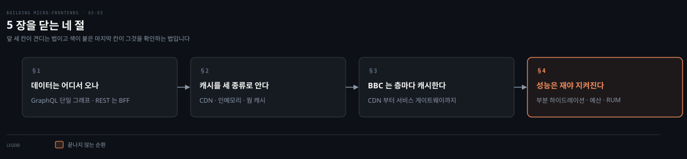
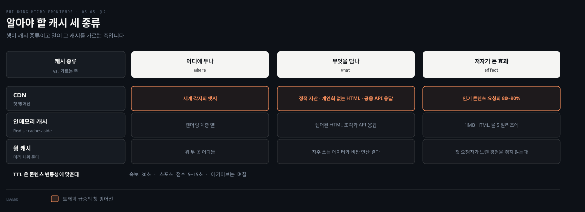
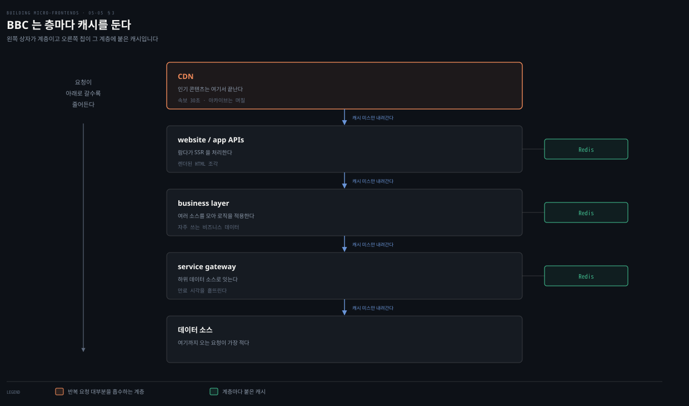
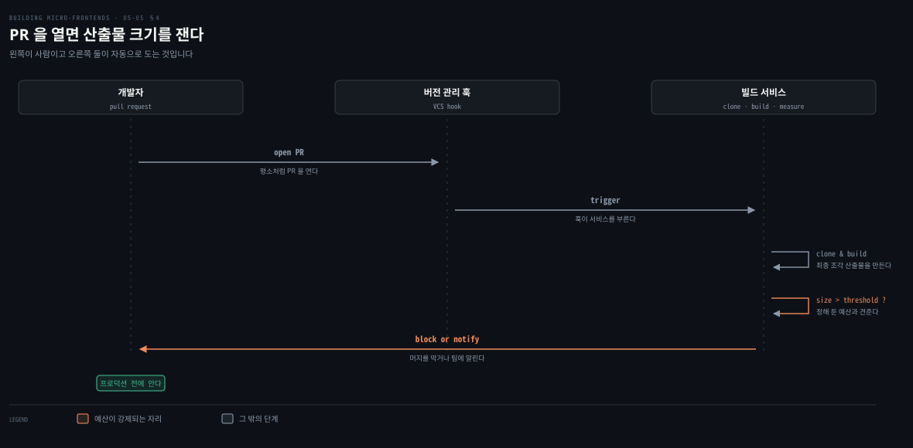

# API와 캐시와 성능 — BBC가 견디는 법

---

> 조합 방식을 다 봤으니 남은 것은 그 아래입니다. 데이터가 어디서 오고 그것을 어떻게 캐시하며 그 결과를 어떻게 재는가입니다. BBC의 실제 배치가 그 셋을 한자리에서 보여 주고, 5장이 그것으로 닫힙니다.

## 핵심 요약

> 이 편 전체가 매달린 하나의 생각은 **SSR 조각이 트래픽을 견디는 힘은 렌더링이 아니라 계층마다 놓인 캐시에서 나온다**는 것입니다.
>
> 데이터 쪽에서 GraphQL은 애플리케이션 전체에 단일 통합 그래프를 두게 하고, REST를 쓰는 팀에는 BFF 패턴이 견고한 선택입니다.
>
> 다만 서브도메인 경계는 좀처럼 완벽하지 않습니다. 개인화 추천이나 프로모션 배너는 여러 도메인의 데이터를 요구합니다.
>
> 캐시는 세 종류를 압니다. CDN과 인메모리 캐시와 웜 캐시입니다. 5초짜리 TTL 하나만 걸어도 백엔드 부담이 크게 줍니다.
>
> BBC는 CDN부터 서비스 게이트웨이까지 계층마다 Redis를 붙이고, 만료 시각을 흩뜨려 몰림을 막습니다.
>
> 성능은 재야 지켜집니다. 부분 하이드레이션으로 자바스크립트를 줄이고, 예산을 파이프라인에 걸고, 실사용자 모니터링으로 이상치를 봅니다.


## 학습 목표

이 내용을 읽고 나면:

1. GraphQL과 BFF가 조각 아키텍처에서 각각 무엇을 해 주는지 설명할 수 있습니다.
2. 도메인 경계가 완벽하지 않다는 사실이 무엇을 요구하는지 말할 수 있습니다.
3. 캐시 세 종류를 구분하고 각각이 어디에 놓이는지 댈 수 있습니다.
4. BBC가 계층마다 캐시를 둔 배치와 만료 시각을 흩뜨리는 이유를 재현할 수 있습니다.
5. 성능을 지키는 네 가지 수단을 대고 각각이 무엇을 잡는지 짝지을 수 있습니다.

아래는 이 편의 절 넷을 읽는 순서로 이은 지도입니다. 앞 셋이 견디는 법이고 마지막이 그것을 확인하는 법입니다.




## 1. 데이터는 어디서 오나

> 서버에서 렌더한 조각을 생각할 때 API 전략을 빼놓을 수 없습니다. 데이터가 어디서 오고 팀이 그것을 어떻게 주고받도록 구성되는가입니다.

### 풀려는 문제

SSR 아키텍처에서는 **데이터를 설계하고 집계하고 캐시하는 방식이 UI를 조합하는 방식만큼 중요합니다.** 조합 계층이 아무리 잘 서 있어도 그 아래에서 데이터를 못 가져오면 화면이 늦습니다.

### GraphQL이 주는 것

GraphQL이 현대 조각 아키텍처에서 REST만큼 인기를 얻었습니다. 대부분의 회사는 여전히 REST API를 쓰는데 대개 역사적인 이유이고, GraphQL은 특히 풀스택과 프론트엔드 개발자에게 인정받고 있습니다. **필요한 데이터를 정확히 그만큼만 가져오는 유연성**이 화면 크기와 기기 유형을 지원하는 데 유용하기 때문입니다. 모바일 앱과 데스크톱 웹처럼 말입니다.

조각 환경에서 GraphQL의 주된 이점을 저자가 하나로 꼽습니다. 도메인마다 여러 엔드포인트로 GraphQL을 쪼개는 대신 **애플리케이션 전체에 단일 통합 그래프를 유지할 수 있다**는 것입니다. 이 통합된 접근이 데이터 계층을 단순하게 만듭니다. 백엔드 서비스가 독립적으로 진화하고, 프론트엔드 팀은 데이터 페칭 로직을 계속 갱신하지 않아도 됩니다.

### REST를 쓰는 팀에는 BFF

REST를 선호하는 팀에는 **backend for frontend 패턴**이 여전히 견고한 선택입니다. BFF를 쓰면 각 조각이 여러 도메인의 데이터를 집계하는 자기 맞춤 백엔드 서비스를 가질 수 있습니다. 그러면 조각의 사용자 인터페이스와 그 아래의 마이크로서비스 사이에 명확한 분리가 유지됩니다.

### 읽어내기 — 경계는 완벽하지 않다

저자가 여기서 이상론을 걷어냅니다. **시스템을 서브도메인으로 완벽하게 나눠 각각을 별개 팀에 배정하는 일은 좀처럼 간단하지 않습니다.**

이커머스를 예로 듭니다. 상품 목록과 장바구니와 사용자 프로필이 별개 영역처럼 보입니다. 그런데 **개인화 추천이나 프로모션 배너 같은 기능은 여러 도메인의 데이터를 함께 요구합니다.** 이 겹침 때문에 팀들이 협업하고 명확한 API 계약을 공유해야 하며, 그 과정에서 복잡도와 조율 난제가 생깁니다.

그래서 저자가 인정하고 넘어가라고 말하는 것이 있습니다. **이 경계가 완벽한 적은 드물고 어느 정도의 교차 도메인 의존은 불가피합니다.** 2장의 결정 프레임워크가 경계를 다시 보라고 계속 말했던 이유가 여기서 다시 확인됩니다.


## 2. 캐시를 세 종류로 안다

> 저자가 이 절의 제목을 "캐시를 두려워하지 말라"로 답니다. 5초짜리 TTL 하나가 무엇을 바꾸는지에서 시작합니다.



### 풀려는 문제

캐시는 겁먹을 일이 아니라고 저자가 먼저 말합니다. **5초짜리 짧은 TTL을 구현하는 것만으로도 트래픽 급증에서 백엔드 시스템의 부담이 극적으로 줍니다.**

인기 스포츠 이벤트나 속보가 수천 명을 동시에 사이트로 몰아넣을 때, 이 짧은 캐싱 창이 데이터베이스와 API가 압도되는 것을 막습니다.

### 세 종류

**CDN**은 전 세계 엣지 위치에 콘텐츠를 저장해 오리진 서버를 거치지 않고 사용자에게 곧바로 서빙합니다. 잘 캐시되는 것이 셋입니다. 이미지와 CSS와 자바스크립트 같은 정적 자산, 개인화가 필요 없는 전체 HTML 페이지, 그리고 사용자 사이에 공유될 수 있는 API 응답입니다.

저자가 CDN에 붙인 표현이 분명합니다. **트래픽 급증에 맞서는 첫 방어선이며 인기 콘텐츠 요청의 80~90%를 자주 처리합니다.** CDN을 제대로 활용해 초당 트랜잭션 수를 수만에서 수십으로 줄인 고객이 있었다고 덧붙입니다.

**인메모리 데이터베이스 캐시**는 Redis 같은 해법으로 마이크로초 단위 응답을 주어 SSR 시나리오에 알맞습니다. 조각 애플리케이션에서 가장 흔히 쓰이는 것이 cache-aside 패턴입니다. 애플리케이션이 백엔드를 조회하기 전에 캐시를 먼저 확인하고, 필요할 때 신선한 데이터로 캐시를 갱신합니다. **웹 페이지를 서빙하는 것 같은 읽기 중심 워크로드에 특히 잘 맞습니다.**

뉴스 사이트가 여러 페이지에서 "top stories" 컴포넌트를 렌더해야 한다고 해 봅니다. 사용자 요청마다 콘텐츠 서비스에 API를 반복해 부르는 대신 HTML 조각을 캐시합니다.

```javascript
async function getTopStoriesComponent(req, res) {
  // 먼저 Redis 에 있는지 본다
  const cachedHTML = await redisClient.get('top-stories-fragment');
  if (cachedHTML) {
    return cachedHTML;
  }

  // 없으면 콘텐츠 서비스를 부른다
  const stories = await contentService.getTopStories();
  const htmlFragment = renderToString(<TopStoriesComponent stories={stories} />);

  // 5분 TTL 로 Redis 에 넣는다
  await redisClient.set('top-stories-fragment', htmlFragment, 'EX', 300);

  return htmlFragment;
}
```

이 접근이 페이지 렌더 시간을 수백 밀리초에서 몇 밀리초로 줄일 수 있습니다. 저자가 자기 경험을 덧붙입니다. **1MB짜리 HTML을 모으는 데 5밀리초 정도의 조회 시간을 달성한 프로젝트가 있었다**는 것입니다.

**웜 캐시**는 첫 사용자 요청을 기다려 캐시를 채우는 대신 필요하기 전에 미리 데이터를 로드합니다. 첫 요청자가 나쁜 경험을 겪지 않게 하려는 것입니다. 방법이 셋입니다.

- 주기적인 작업이 자주 접근되는 데이터로 캐시를 채웁니다.
- 백그라운드 프로세스가 만료 전에 캐시 항목을 갱신합니다.
- 트래픽이 적은 시간에 비싼 연산을 미리 계산해 둡니다.


## 3. BBC는 층마다 캐시를 둔다

> QCon London 2025에서 BBC가 공유한 배치입니다. 앞 절의 세 종류가 실제 시스템에서 어떻게 함께 도는지 보여 줍니다.



### 풀려는 문제

주요 뉴스가 터지거나 큰 스포츠 경기가 끝나면 **BBC는 몇 분 안에 트래픽이 열 배로 뛰는 것을 봅니다.** 이 계층화된 캐싱 전략이 없으면 서버가 그 부하에 무너질 것입니다.

### 요청을 따라가 본다

누군가 최신 축구 점수나 속보를 보려 하면 그 요청이 먼저 **CDN**에 닿습니다. 주요 뉴스나 스포츠 이벤트처럼 인기 있는 콘텐츠라면 CDN이 이미 응답을 캐시해 두었을 가능성이 높아, BBC 내부 시스템을 하나도 건드리지 않고 곧바로 서빙합니다. **이 캐시가 반복 요청의 대부분을 흡수해, 고유하거나 캐시되지 않은 요청만 시스템 깊숙이 들어갑니다.**

여기서 콘텐츠 변동성에 따라 다른 TTL을 설정할 수 있습니다. 속보 페이지는 30초만 캐시하고 아카이브 콘텐츠는 며칠씩 캐시하는 식입니다. **그 짧은 30초의 창만으로도 트래픽 급증에서 오리진 부하가 극적으로 줍니다.**

CDN에 콘텐츠가 없으면, 곧 캐시 미스면 요청이 **website나 app APIs 계층**에 도달합니다. 여기서 람다 함수가 SSR을 처리합니다. 이 컴포넌트들이 각자 자기 Redis 캐시에 연결되어 렌더된 HTML 조각과 API 응답을 저장합니다. **렌더링 계층과 더 깊은 백엔드 서비스 사이의 완충**을 만드는 것입니다. 스포츠 점수나 날씨처럼 시시각각 바뀌면서 자주 접근되는 컴포넌트에는 5~15초의 짧은 TTL을 줄 수 있습니다.

**비즈니스 계층**은 여러 소스의 데이터를 집계하고 비즈니스 로직을 적용합니다. 확장성과 유연성을 위해 서버리스 함수를 쓰고, 여기에도 전용 Redis 캐시가 있어 자주 요청되는 비즈니스 데이터를 빠르게 서빙합니다. 반복 연산의 필요를 줄이고 백엔드 서비스를 급증에서 한 겹 더 보호합니다.

**서비스 게이트웨이**는 비즈니스 로직을 하위 데이터 소스에 잇습니다. 이 결정적인 계층도 자기 Redis 캐시를 두어 백엔드 시스템 호출을 최소화합니다.

### 캐시가 열어 주는 두 가지

이 배치가 캐시 말고 두 가지를 더 가능하게 합니다.

**서킷 브레이커**가 하나입니다. 비즈니스 계층의 캐싱 덕분에 백엔드 서비스가 느려지거나 응답하지 않을 때 시스템이 완전히 실패하는 대신 **약간 오래된 캐시 데이터를 서빙**할 수 있습니다. 완벽한 신선함보다 가용성을 우선하는 것입니다.

**만료 시각을 흩뜨리는 것**이 다른 하나입니다. BBC가 서비스 게이트웨이 계층에서 이것을 통합 모범 사례로 구현합니다. 모든 캐시 항목이 동시에 만료되면 백엔드로 요청이 한꺼번에 몰리는 **thundering herd**가 생길 수 있습니다. 그래서 항목마다 약간씩 무작위화된 TTL을 줘 부하를 고르게 분산합니다.

### 읽어내기 — 5초가 실패와 성공을 가른다

저자가 이 사례를 닫는 문장이 구체적입니다. **자주 바뀌지 않는 데이터에 5~10초짜리 짧은 캐시를 거는 것만으로도, 피크 트래픽에서 매끄러운 경험과 시스템 실패를 가르는 차이가 됩니다.**

예가 선명합니다. 잉글랜드가 월드컵 경기에서 득점하면 수백만 사용자가 동시에 BBC Sport를 확인할 수 있습니다. **이 짧은 캐싱 창이 하위 콘텐츠 시스템이 수백만 개의 동일한 요청을 받지 않게 합니다.**


## 4. 성능은 재야 지켜진다

> 성능이 조직이 SSR을 고르는 핵심 이유입니다. 그런데 저자는 HTML을 빨리 전달하는 것으로 끝이 아니라고 말합니다.



### 풀려는 문제

빠르고 상호작용 가능한 웹 경험으로 가는 여정은 HTML을 빨리 전달하는 데서 끝나지 않습니다. **그다음에 무슨 일이 일어나는지가 남습니다.** 자바스크립트가 어떻게 그리고 언제 로드되는지, 얼마나 실행되는지, 그리고 사용자가 여러 기기와 망 조건에서 실제로 어떻게 경험하는지입니다.

### 자바스크립트를 줄인다

가장 효과적인 전략 하나가 **부분 하이드레이션이나 재개**입니다. 페이지 전체를 하이드레이트하는 대신 UI에서 상호작용이 필요한 부분만 클라이언트에서 살아나게 합니다.

저자의 예가 구체적입니다. 뉴스 홈 페이지가 기사 콘텐츠와 내비게이션은 즉시 렌더하되, **댓글 섹션이나 라이브 점수 위젯은 사용자가 스크롤해서 화면에 들어올 때만 하이드레이트**합니다. Preact와 Astro와 Qwik이 이 방향을 이끌고 있어, 정적 콘텐츠는 즉시 전달하고 하이드레이션이 필요 없는 부분은 미루거나 아예 건너뛰게 해 줍니다. **초기 로드에서 실행돼야 할 자바스크립트 양이 크게 줄고**, 이것이 느린 기기나 망을 쓰는 사용자에게 특히 중요합니다.

### 예산을 파이프라인에 건다

이 최적화가 실제로 동작하는지 확인하려면 성능을 지속적이고 객관적으로 측정해야 합니다. **Lighthouse**가 그 도구입니다. 개발 내내, 그리고 CI/CD 파이프라인의 일부로 Lighthouse 감사를 돌리면 LCP와 FCP와 TTI 같은 핵심 지표를 추적할 수 있습니다.

여기에 **조각마다 성능 예산을 설정**합니다. 최대 자바스크립트 번들 크기나 목표 LCP 같은 것입니다. 그러면 새 기능이 번들을 예산 밖으로 밀거나 첫 페인트를 늦출 때 **프로덕션에 닿기 전에** 알 수 있습니다.

저자가 구현하기 쉽고 개발자 피드백 루프에 값지다고 한 기법이 하나 있습니다. **버전 관리 시스템이 주는 훅으로 최종 조각 산출물을 만드는 것**입니다. 개발자가 풀 리퀘스트를 열면 훅이 서비스를 트리거해 프로젝트를 클론하고 빌드한 뒤, 최종 산출물 크기가 지정한 임계를 넘는지 검사합니다. 넘으면 머지를 막거나 다른 방식으로 팀에 알릴 수 있습니다.

### 실사용자를 본다

합성 테스트만으로는 부족합니다. **프로덕션에서의 실제 관측성이 필수**입니다. 다양한 기기와 브라우저와 망 조건에서 애플리케이션이 실제 사용자에게 어떻게 동작하는지 봐야 합니다.

**실사용자 모니터링** 도구가 이 데이터를 포착합니다. 평균만이 아니라 **이상치까지** 보여 준다는 점이 중요합니다. 오래된 폰을 쓰거나 불안정한 연결에 있는 사용자들은 아주 다른 경험을 하고 있을 수 있습니다. 이 통찰이 있으면 가장 중요한 최적화를 골라 낼 수 있습니다. 모바일의 하이드레이션 속도를 개선하거나, 망이 느린 지역의 사용자에게 자바스크립트를 줄이는 일 같은 것입니다.

### 읽어내기 — 끝나지 않는 순환

저자가 이 절을 닫는 문장이 짧습니다. **성능 작업은 결코 "끝났다"가 되지 않습니다. 최적화하고 측정하고 관측하고 반복하는 순환입니다.**

SSR과 똑똑한 하이드레이션 전략과 지속적인 Lighthouse 검사와 견고한 관측성을 함께 쓰면, 조각이 빠른 초기 로드만이 아니라 모든 사용자에게 한결같이 좋은 경험을 전달하게 됩니다.

### 5장을 닫으며

저자가 장을 마무리하며 남기는 것이 조언에 가깝습니다.

가장 중요한 것에 초점을 두라고 말합니다. **사용자에게 빠르고 매끄러운 경험을 전달하면서 팀이 효율적이고 독립적으로 일하게 하는 것**입니다.

새 프레임워크나 아키텍처 패턴을 전부 좇아야 한다는 압박을 느끼지 말라고 덧붙입니다. 대신 팀의 강점과 프로젝트의 필요에 가장 맞는 도구와 전략을 고르라는 것입니다. Next.js 멀티 존을 실험하든 Astro 아일랜드를 쓰든 고전적인 HTML 조각 조합을 쓰든, **명확한 소유권과 신중한 경계와 정기적인 성능 점검이 어떤 기술 하나보다 훨씬 멀리 데려다줍니다.**

마지막이 실행에 관한 것입니다. 작게 시작하고 자주 재고 반복을 두려워하지 마십시오. 실사용자 데이터로 최적화를 이끌고, 팀이 무엇이 통했고 무엇이 통하지 않았는지 공유하게 하십시오. **무엇보다 팀 사이의 소통 통로를 열어 두어 조각들이 따로 자라지 않고 함께 자라게 하십시오.**


## 적용 관점

> 아래는 백엔드 개발자가 이미 가진 판단 기준과 이 절을 잇는 노트의 읽기입니다. 책이 백엔드 독자를 향해 쓴 대목이 아닙니다.

GraphQL 단일 그래프와 조각별 BFF는 같은 문제의 두 답입니다. 화면마다 필요한 데이터 모양이 다른데 백엔드는 도메인으로 나뉘어 있다는 문제입니다. 단일 그래프는 그 조립을 스키마에 맡기고 BFF는 조립기를 화면마다 둡니다. 어느 쪽이든 조립 지점이 하나 생긴다는 사실은 같습니다. 그것을 누가 소유하느냐가 실무의 쟁점이 됩니다.

경계가 완벽하지 않다는 저자의 인정은 실무에서 가장 유용한 대목입니다. 개인화 추천이 상품과 사용자와 주문 도메인을 모두 필요로 한다는 상황은 어느 시스템에나 있습니다. 그것을 새 서비스로 뽑을지, 기존 서비스에 넣을지, 조립만 BFF에서 할지가 남는 판단이고, 정답이 없으므로 계약을 명시하고 조율 비용을 인정하는 편이 낫습니다.

BBC의 계층별 Redis는 캐시를 한곳에 몰지 않고 각 계층 옆에 두는 배치입니다. 캐시 하나에 몰면 그것이 단일 실패 지점이 됩니다. 계층마다 두면 각 계층이 자기 하위를 보호합니다. 오래된 데이터로라도 응답하는 것이 실패보다 낫다는 판단은 서킷 브레이커의 폴백 그대로이고 저자도 그 이름을 씁니다.

만료 시각을 흩뜨리는 기법은 캐시 스탬피드를 막는 정석입니다. TTL에 지터를 주는 것이고, 배치 작업의 시작 시각을 흩뜨리던 것과 같은 발상입니다. 이 항목이 서비스 게이트웨이 계층에 붙어 있다는 점이 눈여겨볼 만합니다. 가장 아래, 곧 가장 비싼 호출 앞에서 몰림을 막습니다.

PR 훅으로 산출물 크기를 재는 기법은 정적 분석 게이트와 같은 자리입니다. 커버리지나 취약점 검사를 파이프라인에 걸어 임계 미달이면 머지를 막던 것을, 번들 크기에 적용한 것입니다. 프론트엔드에서 이 게이트가 특히 값진 이유는 번들 크기가 조용히 늘어나기 때문입니다. 의존성 하나를 추가할 때마다 아무도 알아채지 못한 채 몇십 킬로바이트가 붙습니다.


## 면접 대비

Q: 조각 아키텍처에서 GraphQL의 이점은 무엇인가요?

A: 애플리케이션 전체에 단일 통합 그래프를 유지할 수 있다는 점입니다. 도메인마다 GraphQL 엔드포인트를 쪼개지 않아도 되므로 데이터 계층이 단순해지고, 백엔드 서비스가 독립적으로 진화하면서도 프론트엔드 팀이 데이터 페칭 로직을 계속 고치지 않아도 됩니다. 필요한 데이터만 정확히 가져오는 유연성도 여러 화면 크기와 기기를 지원할 때 유용합니다. REST를 쓰는 팀에는 BFF 패턴이 대안입니다.

Q: SSR 조각에서 알아야 할 캐시 종류는 무엇인가요?

A: 셋입니다. CDN은 엣지에 콘텐츠를 두고 정적 자산과 개인화 없는 HTML과 공유 가능한 API 응답을 캐시하며, 인기 콘텐츠 요청의 80~90%를 처리하는 첫 방어선입니다. 인메모리 캐시는 Redis 같은 것으로 cache-aside 패턴을 써서 렌더된 HTML 조각과 API 응답을 담습니다. 웜 캐시는 첫 요청을 기다리지 않고 주기 작업이나 백그라운드 갱신이나 사전 계산으로 미리 채웁니다.

Q: BBC 아키텍처에서 만료 시각을 흩뜨리는 이유는 무엇인가요?

A: thundering herd를 막기 위해서입니다. 모든 캐시 항목이 동시에 만료되면 백엔드로 요청이 한꺼번에 몰립니다. 그래서 서비스 게이트웨이 계층에서 항목마다 약간씩 무작위화된 TTL을 줘 부하를 고르게 분산합니다. 같은 계층의 캐시가 열어 주는 다른 하나는 서킷 브레이커로, 백엔드가 느려지면 약간 오래된 데이터를 서빙해 완전 실패를 피합니다.

Q: 조각의 성능을 어떻게 지키나요?

A: 넷을 함께 씁니다. 부분 하이드레이션이나 재개로 초기에 실행할 자바스크립트를 줄입니다. Lighthouse를 CI/CD에 넣어 LCP와 FCP와 TTI를 추적하고, 조각마다 성능 예산을 정해 회귀를 조기에 잡습니다. 저자가 특히 권하는 기법은 PR을 열 때 버전 관리 훅이 빌드해 산출물 크기가 임계를 넘는지 검사하고 넘으면 머지를 막는 것입니다. 마지막으로 실사용자 모니터링으로 평균이 아니라 이상치를 봅니다.

### 요약 세 문장

1. 데이터 쪽에서 GraphQL은 단일 통합 그래프를, REST는 조각별 BFF를 주지만 도메인 경계는 어차피 완벽하지 않습니다.
2. SSR이 트래픽을 견디는 힘은 CDN과 인메모리와 웜 캐시가 계층마다 놓인 데서 나오고, BBC가 그 배치를 실제로 보여 줍니다.
3. 성능은 부분 하이드레이션으로 줄이고 파이프라인의 예산으로 지키며 실사용자 모니터링으로 확인하는, 끝나지 않는 순환입니다.


## 핵심 개념 체크리스트

- [ ] GraphQL 단일 그래프와 BFF가 각각 무엇을 단순하게 만드는지 말할 수 있는가?
- [ ] 도메인이 겹치는 기능의 예를 들고 그때 필요한 것을 댈 수 있는가?
- [ ] 캐시 세 종류와 각각이 담는 것을 짝지을 수 있는가?
- [ ] BBC의 계층 넷과 각 계층의 캐시를 순서대로 재현할 수 있는가?
- [ ] 서킷 브레이커와 만료 시각 흩뜨리기가 무엇을 막는지 구분할 수 있는가?
- [ ] 성능을 지키는 네 수단과 각각이 잡는 문제를 짝지을 수 있는가?


## 관련 문서

- [Next.js 멀티 존 — 존을 프록시로 잇는다](05-04.Next.js%20멀티%20존%20—%20존을%20프록시로%20잇는다.md) — 조합 방식을 다 훑고 온 앞 편
- [언제 서버에서 그릴 것인가](05-01.언제%20서버에서%20그릴%20것인가.md) — 캐시를 확장의 진짜 지렛대로 처음 지목한 자리
- [서버 사이드 — 조합을 오리진으로 옮긴다](03-08.서버%20사이드%20—%20조합을%20오리진으로%20옮긴다.md) — 캐시를 놓을 수 있는 네 자리를 층으로 편 도식
- [자동화 원칙 — 빠른 피드백이 먼저다](06-01.%EC%9E%90%EB%8F%99%ED%99%94%20%EC%9B%90%EC%B9%99%20%E2%80%94%20%EB%B9%A0%EB%A5%B8%20%ED%94%BC%EB%93%9C%EB%B0%B1%EC%9D%B4%20%EB%A8%BC%EC%A0%80%EB%8B%A4.md) — 조각을 다 만든 다음에 그것들을 굴리는 6장의 첫 편
- [Building Micro-Frontends 정독 인덱스](README.md) — 7장 이후의 진행 상태는 인덱스의 노트 표에서 봅니다


## 참고 자료

- 《Building Micro-Frontends, Second Edition》(Luca Mezzalira, O'Reilly, 2026) ISBN 978-1-098-17078-3
  - 다룬 범위: API Strategies · Types of Caches · The BBC Architecture · Performance · Summary
  - 이어서: 6장 Micro-Frontend Automation
- [QCon London 2025](https://qconlondon.com/) — BBC가 이 캐싱 배치를 공유한 행사
- [Lighthouse](https://developer.chrome.com/docs/lighthouse) — 저자가 성능 측정 도구로 지목한 것
