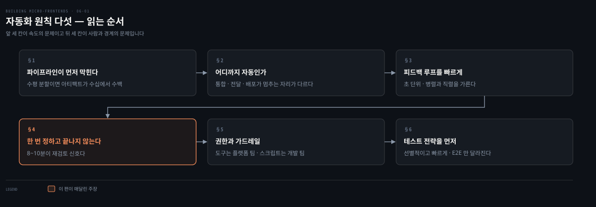
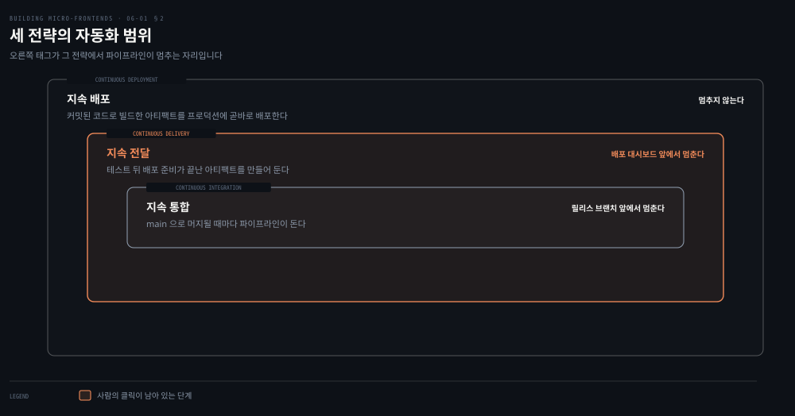
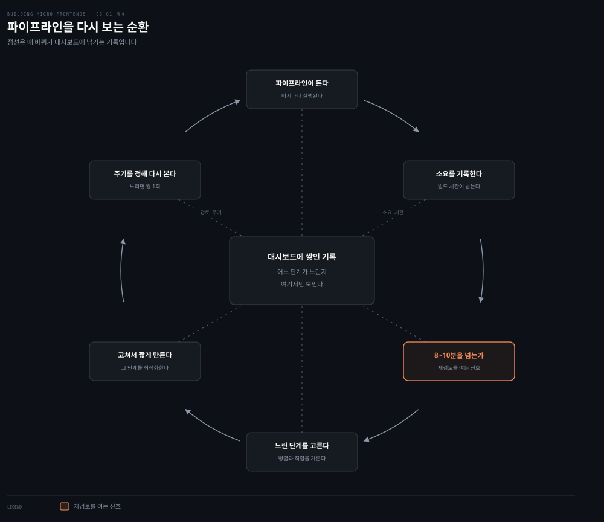
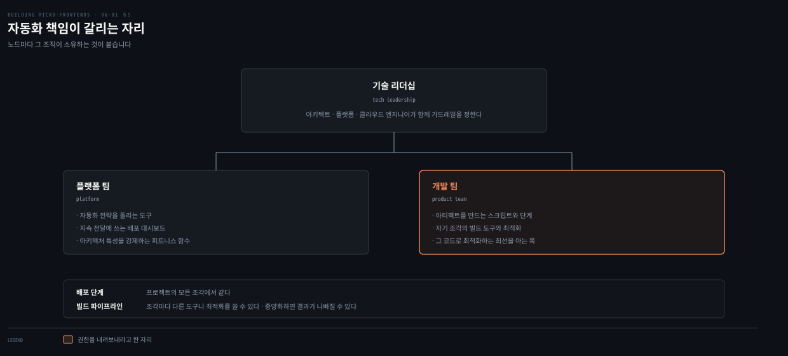

# 자동화 원칙 — 빠른 피드백이 먼저다

---

> 5장까지가 조각을 어떻게 합칠지의 이야기였다면 6장은 그 조각들을 어떻게 굴릴지의 이야기입니다. 이 편은 조각이 늘수록 파이프라인이 먼저 막힌다는 관찰에서 출발해, 저자가 든 자동화 원칙 다섯을 하나씩 따라갑니다.

## 핵심 요약

> 이 편이 매달린 하나의 문장은 **자동화가 한 번 정하고 끝나는 인프라가 아니라 제품 생애 주기 내내 고쳐 쓰는 대상**이라는 것입니다.
>
> 조각이 늘면 부담이 곱해집니다. 수평 분할이면 파이프라인이 다뤄야 할 아티팩트가 수십에서 수백 개까지 갑니다.
>
> 좋은 자동화가 주는 것은 둘입니다. 아티팩트를 언제든 똑같이 만들어 낼 수 있다는 확신과, 개발자에게 돌아가는 빠른 피드백입니다.
>
> 속도의 기준선이 있습니다. 피드백은 초 단위, 길어도 분 단위여야 하고 8분에서 10분을 넘으면 파이프라인을 다시 볼 때입니다.
>
> 권한은 내려보냅니다. CI/CD 도구는 플랫폼 팀의 책임이지만 아티팩트를 만드는 스크립트와 단계는 그 코드를 쓴 팀이 소유합니다.
>
> 가드레일은 자유를 줄이는 장치가 아닙니다. 표준으로 데려가되 그 안에서 팀이 실험하게 두고, 사업이 바뀌면 가드레일도 고치거나 걷어냅니다.

## 학습 목표

이 내용을 읽고 나면:

1. 마이크로 프론트엔드에서 자동화 투자가 더 급해지는 이유를 분할 방식과 엮어 설명할 수 있습니다.
2. 지속 통합과 지속 전달과 지속 배포를 자동화 범위로 가를 수 있습니다.
3. 피드백 루프의 속도 기준선과 재검토 신호가 되는 수치를 댈 수 있습니다.
4. 파이프라인 재검토 주기를 파이프라인의 건강 상태에 따라 나눠 말할 수 있습니다.
5. 플랫폼 팀과 개발 팀 사이에 자동화 책임이 어디서 갈리는지 짚을 수 있습니다.

아래는 이 편이 지나는 다섯 원칙을 읽는 순서로 이은 지도입니다. 각 칸의 절 번호가 본문에서 그것을 다루는 곳입니다.

## 1. 조각이 늘면 파이프라인이 먼저 막힌다

> 마이크로서비스가 준 유연함에는 값이 붙어 있었습니다. 그 값을 프론트엔드가 다시 치릅니다.

### 풀려는 문제

마이크로서비스는 아키텍처에 유연성과 확장성을 더했습니다. 트래픽에 맞춰 API를 수평으로 늘릴 수 있고, 모든 API에 같은 해법을 쓰는 대신 일에 맞는 패턴을 골라 쓸 수 있게 됐습니다.

그런데 저자가 곧바로 대가를 답니다. 마이크로서비스는 **인프라를 관리하는 복잡도를 올렸고, 빌드하고 배포하는 데 수많은 반복 작업을 요구합니다.**

그래서 이 아키텍처를 받아들인 회사는 CI 또는 CD 파이프라인에 상당한 시간과 노력을 들여야 합니다. 이것은 마이크로 프론트엔드에도 그대로 통합니다.

### 왜 프론트엔드에서 더 급한가

어떤 프로젝트에서는 조각이 관리하기 어려울 만큼 불어납니다. 2장의 결정 프레임워크가 갈랐던 그 선택이 여기서 부담의 크기를 정합니다.

- **수평 분할**을 고르면 자동화 파이프라인이 다뤄야 할 아티팩트가 수십, 심지어 수백 개에 이를 수 있습니다.
- **수직 분할**도 일이 필요하지만 SPA 자동화를 세우던 전통적 방식과 비슷합니다. 다른 점은 아티팩트가 하나가 아니라는 것과, 코드를 빌드하고 최적화하는 방식이 조각마다 다를 수 있다는 것입니다.

### 자동화가 돌려주는 두 가지

견고한 자동화 전략의 핵심 성질로 저자가 둘을 꼽습니다. **아티팩트의 재현 가능성에 대한 확신**과 **개발자를 향한 빠른 피드백 루프**입니다.

여기에 시점에 대한 단서가 붙습니다. 요즘처럼 사업 방향이 빨리 바뀌는 상황에서 CI/CD 파이프라인 개선은 프로젝트 시작 때만의 관심사가 아닙니다. **프로젝트 생애 주기 내내 이어지는 점진적 개선**입니다.

### 읽어내기 — 자동화를 건너뛰면 무엇이 먼저 무너지나

저자가 이 일을 건너뛸 때의 결과를 순서대로 적습니다. 프로젝트에 참여한 모든 팀의 전달 속도가 느려지고, 프로덕션 배포에 대한 팀의 확신이 떨어집니다.

더 나쁜 경우가 마지막에 옵니다. 프로젝트가 실패했을 때 **개발자와 사업 쪽이 함께 좌절합니다.** 자동화는 개발 편의의 문제가 아니라 프로젝트가 서 있는 바닥이라는 뜻입니다.

## 2. CI와 지속 전달과 지속 배포는 어디까지 자동인가

> 세 말이 자주 섞여 쓰입니다. 갈라 놓는 기준은 하나, 사람의 손이 어디까지 개입하느냐입니다.

### 풀려는 문제

저자가 이 세 전략을 깊이 다루는 것은 책의 범위 밖이라고 먼저 밝힙니다. 그럼에도 차이를 이해하는 일이 중요하다고 덧붙입니다. 어느 것을 목표로 두느냐에 따라 파이프라인의 마지막 단계가 달라지기 때문입니다.

### 세 전략

**지속 통합**은 main 브랜치로 머지될 때마다 자동화 파이프라인이 작동하는 전략입니다. 코드가 릴리스 브랜치로 머지되기 전에 코드베이스를 광범위하게 테스트합니다.

**지속 전달**은 CI의 확장입니다. 테스트를 마친 뒤 배포 준비가 끝난 아티팩트를 만들어 두고, 배포 대시보드에서 클릭 한 번으로 내보낼 수 있게 합니다.

**지속 배포**는 한 걸음 더 나갑니다. 버전 관리 시스템에 코드가 커밋된 뒤 빌드된 아티팩트를 **프로덕션에 곧바로 배포**합니다.

저자는 더 알고 싶은 독자에게 Jez Humble과 David Farley의 《Continuous Delivery》를 권합니다.

### 읽어내기 — 대시보드의 클릭 하나가 경계다

세 전략을 가르는 지점이 도식에서 한 자리로 좁혀집니다. 지속 전달과 지속 배포 사이에 있는 **사람의 클릭 하나**입니다.

이 클릭을 남길지 지울지가 조직의 성숙도를 드러냅니다. 그리고 이 결정이 뒤에서 다룰 가드레일과 이어집니다. 배포 대시보드를 어느 도구로 둘지가 저자가 든 가드레일의 예시 가운데 하나이기 때문입니다.

## 3. 피드백 루프를 빠르게

> 자동화 파이프라인이 하는 일은 결국 하나입니다. 개발자에게 판정을 돌려주는 것입니다.

### 풀려는 문제

견고한 파이프라인의 핵심 기능으로 저자가 실행 속도를 첫째로 듭니다. 모든 자동화 파이프라인은 개발자에게 피드백을 제공하며, **내가 쓴 코드가 코드베이스를 깨뜨렸는지를 빠르게 돌려받는 일이 확신의 바탕**이 됩니다.

### 초 단위, 길어도 분 단위

좋은 자동화는 자주 돌면서 **초 단위로, 길어야 분 단위로** 피드백을 줘야 합니다.

여기에 인과가 하나 붙습니다. 개발자가 꾸준히 피드백을 받아야 파이프라인 안의 테스트와 검사를 더 자주 돌리게 됩니다. 느린 파이프라인은 실행 횟수 자체를 줄여 버립니다.

### 병렬과 직렬을 가른다

그래서 **어느 단계가 병렬화될 수 있고 어느 단계가 직렬인지 분석하는 일이 중요합니다.** 둘 다 허용하는 기술 해법이 이상적입니다.

| 단계 성격 | 다루는 방법 |
|---|---|
| 병렬화할 수 있는 단계 | 단위 테스트가 대표적입니다. 수백, 수천 개가 다 통과하기를 기다리는 대신 작은 덩어리로 쪼개 나눠 돌립니다 |
| 병렬화할 수 없는 단계 | 병렬로 못 나누므로 그 단계 자체를 가능한 한 빠르게 최적화하는 방법을 알고 있어야 합니다 |

### 읽어내기 — 조각으로 나눈 것이 여기서 유리하게 돌아온다

저자가 이 절을 닫는 문장이 앞 장들과 이어집니다. 마이크로 프론트엔드로 일하는 것은 정의상 자동화 전략의 최적화를 단순하게 만든다는 것입니다.

이유가 짧습니다. **애플리케이션 전체를 더 작은 부분으로 나눴으므로 테스트하고 빌드할 코드가 그만큼 적습니다.** 그래서 CI의 모든 단계가 빨라야 정상입니다. 파이프라인이 느리다면 조각을 나눈 값을 못 받고 있다는 신호입니다.

## 4. 파이프라인은 한 번 정하고 끝나지 않는다

> 자동화 파이프라인은 한 번 정의해 두면 프로젝트가 끝날 때까지 그대로 남는 인프라가 아닙니다.

### 풀려는 문제

모든 자동화 파이프라인은 **검토되고 도전받고 개선되어야** 합니다. 빠른 파이프라인을 유지해야 개발자가 빠른 피드백 루프를 받기 때문입니다. 그런데 무엇을 고칠지 알려면 먼저 보여야 합니다.

### 보이게 만든다

꾸준히 개선하려면 파이프라인을 시각화해야 합니다. **대시보드가 아티팩트를 빌드하는 데 얼마나 걸리는지를 보여 주면** 파이프라인이 건강한지 아닌지가 팀에 분명해집니다. 잡이 실패했는지 성공했는지도 즉시 드러납니다.

### 8분에서 10분이 신호다

저자가 재검토를 시작할 임계를 수치로 못 박습니다. **파이프라인이 8분에서 10분을 넘게 걸리면 다시 보고 최적화 기회를 찾을 때**입니다.

주기도 파이프라인의 상태에 따라 나뉩니다.

- 파이프라인이 느리게 돌고 있다면 **한 달에 한 번** 전략을 검토합니다.
- 건강해진 뒤에는 **3개월에서 4개월마다** 봅니다.

### 읽어내기 — 개선을 멈추지 않는다

저자가 이 절을 닫는 요구가 분명합니다. 자동화 파이프라인을 정의한 뒤에 검토를 멈추지 말라는 것입니다. 더 나은 성능과 더 빠른 피드백 루프를 향해 계속 개선하면 그 시간과 노력이 빠르게 회수된다고 적습니다.

도식의 순환이 이 요구를 그린 것입니다. 가운데에 놓인 대시보드가 매 바퀴 소요 시간을 쌓고, 그 기록이 다음 바퀴에서 어느 단계를 고칠지 정합니다. **기록이 없으면 순환이 시작되지 않습니다.**

## 5. 권한을 내려보내고 가드레일을 두른다

> 저자가 과거 회사들에서 본 최악의 상태에서 이 원칙이 나옵니다. 자동화를 소수만 이해하고 소수만 건드리던 상태입니다.

### 풀려는 문제

저자가 일했던 여러 회사에서 자동화 전략은 유능한 개발자들의 손이 닿지 않는 곳에 있었습니다. **조직 안에서 전체 자동화 시스템을 이해하는 사람은 소수였고, 인프라를 바꾸거나 아티팩트를 만들어 배포할 수 있는 사람은 더 적었습니다.**

저자는 이것을 하나 이상의 팀이 있는 조직에서 일하는 개발자에게 최악의 악몽이라고 부릅니다. 개발자의 일은 코드를 쓰는 것만이 아니라, 자기가 다루는 아티팩트의 파이프라인을 세우고 바꾸는 일까지 포함해야 한다는 것입니다.

### 무엇을 팀에 넘기나

마이크로 프론트엔드에서 권한 이양이 특히 중요해지는 이유가 있습니다. 여러 스택을 동시에 유지할 때는 **모든 조각이 같은 빌드 파이프라인을 쓴다고 기대할 수 없기** 때문입니다.

경계가 이렇게 갈립니다.

- **배포 단계**는 프로젝트의 모든 조각에서 같습니다.
- **빌드 파이프라인**은 조각마다 다른 도구나 최적화를 쓸 수 있습니다. 이 결정을 중앙화하면 개발자가 자기 파이프라인을 관리할 때보다 결과가 나빠질 수 있습니다.
- **CI/CD 도구**는 플랫폼 팀의 책임입니다.
- **아티팩트를 만드는 스크립트와 단계**는 팀이 소유합니다. 자기가 쓴 코드로 최적화된 아티팩트를 만드는 최선의 방법을 아는 쪽이 그 팀이기 때문입니다.

저자가 여기에 단서를 답니다. 이것은 팀과 조직 사이에 사일로를 만드는 일이 아니라, **모두에게 더 나은 결과를 낳을 결정을 팀이 내리게 하는 일**입니다.

### 가드레일은 자유를 줄이지 않는다

가드레일은 기술 리더십이 아키텍트, 그리고 플랫폼이나 클라우드 엔지니어와 함께 정하는 경계입니다. 팀은 그 안에서 움직이며 조각을 만드는 데 가치를 더합니다.

저자가 든 가드레일의 예시가 셋입니다.

- 자동화 전략을 돌리는 데 쓰는 도구
- 지속 전달 전략에서 배포에 쓰는 대시보드
- 아키텍처 특성을 강제하는 피트니스 함수

**가드레일을 도입하는 일은 개발자의 자유를 줄이는 것이 아닙니다.** 회사의 표준을 쓰도록 안내하고 불필요한 복잡도로부터 가능한 한 보호하면서도, 그 경계 안에서 팀이 혁신하게 둡니다.

균형을 찾는 일이 중요하고, 모두가 가드레일의 "어떻게"가 아니라 **"왜"를 이해하게 만드는 일**이 그만큼 중요합니다. 대개 문서를 만드는 편이 이 지식을 팀과 신규 입사자에게 퍼뜨리는 데 도움이 됩니다.

그리고 가드레일도 고정된 것이 아닙니다. 사업이 진화하면 **수정되고 개선되고 때로는 제거되어야** 합니다.

### 공유 문화를 만든다

저자가 마지막으로 덧붙이는 것이 문화입니다. 팀이 아이디어와 개념 증명과 해법을 나눌 기회를 만들어 공유와 혁신의 문화를 북돋우라는 것입니다.

분산 환경에서 일할 때 이것이 특히 중요합니다. **원격 회의에는 커피 머신 앞에서 오가던 일상의 잡담이 없습니다.** 그런 대화를 나눌 가상의 자리를 만드는 일이 처음에는 과해 보여도, 사기를 유지하고 팀원 사이의 연결을 만드는 데 도움이 됩니다.

## 6. 테스트 전략을 먼저 정한다

> 다섯째 원칙입니다. 이 편에서는 자리만 잡아 두고, 본격적인 내용은 6장 뒷부분에서 다시 만납니다.

### 풀려는 문제

견고한 테스트 전략에 시간을 들이는 일이 중요해지는 조건이 있습니다. **여러 조각이 하나의 뷰에 기여하고 여러 팀이 협업해 최종 사용자 경험을 만들어 낼 때**입니다.

이때 뷰 사이의 전환이 꼼꼼히 테스트되고 프로덕션 배포 전에 제대로 작동하는지 확인하는 일이 결정적이 됩니다.

### 선별적이고 빠르게

그렇다고 테스트를 늘리라는 말이 아닙니다. 저자의 요구는 반대쪽입니다. 마이크로 프론트엔드 아키텍처의 E2E 테스트는 **선별적이고 빨라야 하며 결정적인 사용자 여정에 집중해야** 합니다.

피해야 할 것도 분명합니다. 피드백 루프를 느리게 만들고 개발자 생산성을 떨어뜨리는 **크고 깨지기 쉬운 테스트 묶음**입니다. 가장 중요한 상호작용을 겨냥하고 개별 조각에는 단위 테스트와 통합 테스트를 섞어 쓰면, 확신을 유지하면서도 테스트 과정을 효율적으로 유지할 수 있습니다.

### 단위와 통합은 달라지지 않는다

저자가 범위를 좁혀 줍니다. 단위 테스트와 통합 테스트는 여전히 중요하지만 **마이크로 프론트엔드가 이 수준에서 고유한 난제를 만들지는 않습니다.** 이 아키텍처에 맞춰 적응이 필요한 것은 E2E 테스트 쪽입니다.

이유가 소유 구조에 있습니다. 모든 팀이 애플리케이션의 일부를 소유하므로, 최종적으로 원하는 결과를 얻으려면 **애플리케이션의 결정적 경로가 광범위하게 덮여 있는지** 확인해야 합니다.

## 적용 관점

> 아래는 백엔드 개발자가 이미 가진 판단 기준과 이 절을 잇는 노트의 읽기입니다. 책이 백엔드 독자를 향해 쓴 대목이 아닙니다.

이 편의 원칙 다섯은 백엔드에서 마이크로서비스를 굴리며 이미 겪은 것과 거의 같습니다. 서비스가 늘면 파이프라인이 먼저 병목이 됩니다. 빌드가 느려지면 개발자가 테스트를 덜 돌리게 됩니다.

프론트엔드가 다른 점은 아티팩트 수의 규모입니다. 수평 분할이면 한 화면을 만드는 데 필요한 아티팩트만 수십 개가 됩니다. 그것이 전부 독립 배포되어야 합니다.

8분에서 10분이라는 임계는 익숙한 감각입니다. 테스트가 그 시간을 넘기면 개발자가 로컬에서 돌리기를 포기하고 파이프라인에 떠넘기기 시작합니다. 그때부터 피드백이 배포 뒤로 밀립니다. 저자가 대시보드를 먼저 요구하는 이유도 같습니다. 재 보지 않으면 어느 단계가 느린지 논쟁만 오갑니다.

플랫폼 팀이 도구를 갖고 개발 팀이 스크립트를 갖는 경계도 낯설지 않습니다. 사내 표준 젠킨스나 공용 러너를 플랫폼 조직이 유지하고, 각 서비스의 빌드 스크립트는 그 서비스 팀이 고치던 구조와 같습니다. 다만 프론트엔드 쪽이 하나 더 갈라집니다. 조각마다 프레임워크가 다를 수 있어서 빌드 파이프라인을 하나로 통일하려는 시도 자체가 값을 못 냅니다.

가드레일의 "왜"를 이해시키라는 요구는 사내 규칙을 만들 때마다 걸리던 지점입니다. 근거 없이 금지만 적힌 규칙은 우회 방법을 먼저 낳습니다. 저자가 문서화를 붙여 둔 것도 그래서입니다.

## 면접 대비

Q: 마이크로 프론트엔드에서 자동화 투자가 더 급해지는 이유는 무엇인가요?

A: 다뤄야 할 아티팩트의 수 때문입니다. 수평 분할을 고르면 자동화 파이프라인이 관리할 아티팩트가 수십에서 수백 개까지 갈 수 있습니다. 수직 분할은 SPA 자동화와 비슷하지만 아티팩트가 하나가 아니고 조각마다 빌드와 최적화 방식이 다를 수 있습니다. 저자는 견고한 자동화가 주는 것을 아티팩트 재현 가능성에 대한 확신과 빠른 피드백 루프 둘로 정리합니다.

Q: 지속 통합과 지속 전달과 지속 배포는 어떻게 다른가요?

A: 자동화가 어디서 멈추느냐가 다릅니다. 지속 통합은 main 브랜치로 머지될 때마다 파이프라인이 돌아 릴리스 브랜치로 머지되기 전에 코드베이스를 광범위하게 테스트합니다. 지속 전달은 그 확장으로, 테스트 뒤 배포 준비가 끝난 아티팩트를 만들어 두고 대시보드에서 클릭 한 번으로 내보냅니다. 지속 배포는 커밋된 코드로 빌드한 아티팩트를 프로덕션에 곧바로 배포합니다.

Q: 파이프라인이 얼마나 걸리면 손봐야 하나요?

A: 저자는 8분에서 10분을 넘으면 다시 보고 최적화 기회를 찾을 때라고 적습니다. 좋은 자동화의 기준선은 초 단위이고 길어야 분 단위입니다. 재검토 주기는 상태에 따라 나뉩니다. 파이프라인이 느리면 한 달에 한 번, 건강해진 뒤에는 3개월에서 4개월마다 봅니다.

Q: 자동화 책임을 플랫폼 팀과 개발 팀 사이에서 어떻게 가르나요?

A: CI/CD 도구는 플랫폼 팀의 책임이고, 아티팩트를 만드는 스크립트와 단계는 그 코드를 쓴 팀이 소유합니다. 배포 단계는 모든 조각에서 같지만 빌드 파이프라인은 조각마다 다른 도구나 최적화를 쓸 수 있기 때문입니다. 저자는 이 결정을 중앙화하면 결과가 더 나빠질 수 있다고 적습니다.

### 요약 세 문장

1. 조각이 늘면 파이프라인이 먼저 병목이 되며, 수평 분할에서는 아티팩트가 수십에서 수백 개까지 갑니다.
2. 피드백은 초 단위에서 분 단위여야 하고 8분에서 10분을 넘으면 재검토 신호이며, 검토 주기는 파이프라인의 건강 상태가 정합니다.
3. 도구는 플랫폼 팀이, 빌드 스크립트는 개발 팀이 가지며 가드레일은 자유를 줄이는 것이 아니라 표준으로 데려가는 안내입니다.

## 핵심 개념 체크리스트

- [ ] 수평 분할과 수직 분할이 자동화 부담을 어떻게 다르게 만드는지 말할 수 있는가?
- [ ] 견고한 자동화가 주는 두 가지를 댈 수 있는가?
- [ ] 세 전략을 자동화 범위로 갈라 각각의 마지막 단계를 짚을 수 있는가?
- [ ] 피드백 속도의 기준선과 재검토 임계 수치를 재현할 수 있는가?
- [ ] 파이프라인 상태에 따른 두 검토 주기를 구분할 수 있는가?
- [ ] 플랫폼 팀과 개발 팀의 책임 경계를 네 항목으로 나눌 수 있는가?
- [ ] 가드레일의 예시 셋과 가드레일이 고정되지 않는 이유를 말할 수 있는가?

## 관련 문서

- [API와 캐시와 성능 — BBC가 견디는 법](05-05.API와%20캐시와%20성능%20—%20BBC가%20견디는%20법.md) — 5장을 닫으며 성능을 재는 이야기로 끝난 자리
- [개발자 경험 — 마찰을 어디서 없앨 것인가](06-02.개발자%20경험%20—%20마찰을%20어디서%20없앨%20것인가.md) — 이 편의 원칙을 개발자가 실제로 겪는 마찰로 옮기는 다음 편
- [결정 프레임워크를 실제 프로젝트에 넣는다](04-01.결정%20프레임워크를%20실제%20프로젝트에%20넣는다.md) — 수평과 수직을 가른 결정이 여기서 자동화 부담으로 돌아옵니다
- [Building Micro-Frontends 정독 인덱스](README.md) — 6장의 진행 상태는 인덱스의 노트 표에서 봅니다

## 참고 자료

- 《Building Micro-Frontends, Second Edition》(Luca Mezzalira, O'Reilly, 2026) ISBN 978-1-098-17078-3
  - 다룬 범위: Automation Principles · Keep the Feedback Loop Fast · Iterate Often · Empower Your Teams · Define Your Guardrails · Define Your Test Strategy
  - 이어서: Developer Experience · Version Control
- 《Continuous Delivery》(Jez Humble, David Farley) — 저자가 세 전략의 차이를 더 알고 싶은 독자에게 권한 책
