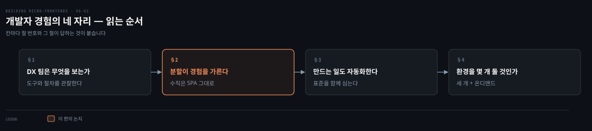
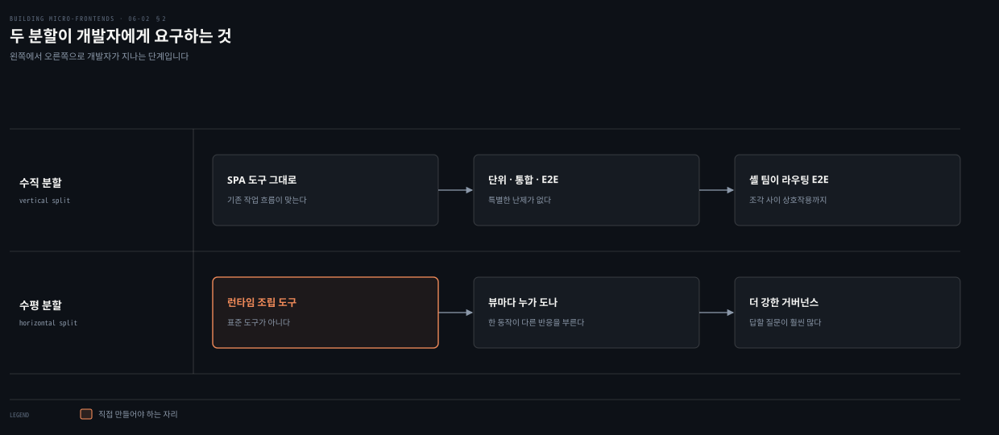
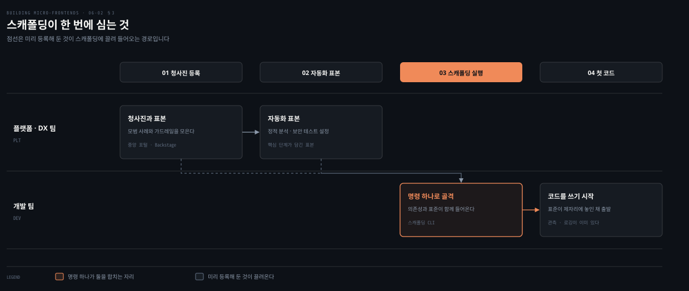
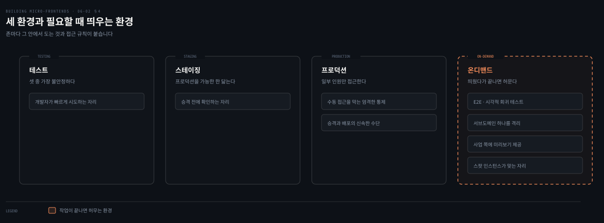

# 개발자 경험 — 마찰을 어디서 없앨 것인가

---

> 앞 편이 자동화의 원칙을 세웠다면 이 편은 그 원칙이 개발자의 하루에 닿는 자리를 봅니다. 조각을 격리해서도 전체 안에서도 테스트할 수 있어야 하고, 새 조각을 만드는 일 자체도 자동화 대상이 됩니다.

## 핵심 요약

> 이 편이 매달린 하나의 생각은 **개발자 경험이 도구의 문제가 아니라 분할 방식의 결과**라는 것입니다.

수직 분할은 팀 경계와 자연스럽게 맞아떨어져 SPA를 만들던 경험과 거의 같습니다. 기존 도구와 작업 흐름이 그대로 통합니다. 수평 분할은 다릅니다. 런타임에 페이지를 조립해 보는 도구가 필요한데 그것이 표준 도구로 존재하지 않아 많은 회사가 직접 만들어 왔습니다.

조각이 늘면 조각을 만드는 일도 자동화 대상이 되어 스캐폴딩 도구는 의존성만 넣는 것이 아니라 회사의 표준을 함께 심습니다. 환경은 테스트와 스테이징과 프로덕션 셋이 기본이고 여기에 필요할 때 띄웠다 지우는 온디맨드 환경이 붙습니다. 다만 자체 제작 도구에는 값이 붙습니다. 유지 비용과 신규 입사자 온보딩 비용을 함께 계산한 뒤에 고르라고 저자가 말합니다.

## 학습 목표

이 내용을 읽고 나면:

1. DX 팀이 관찰하고 개선하는 대상이 무엇인지 설명할 수 있습니다.
2. 수직 분할과 수평 분할이 개발자 경험을 어떻게 다르게 만드는지 가를 수 있습니다.
3. 애플리케이션 셸을 소유한 팀이 맡아야 할 테스트가 무엇인지 말할 수 있습니다.
4. 스캐폴딩 도구와 중앙 포털이 각각 무엇을 해결하는지 구분할 수 있습니다.
5. 온디맨드 환경이 주는 이점 셋과 그것을 싸게 만드는 인프라 선택을 짝지을 수 있습니다.

아래는 이 편이 지나는 네 자리를 개발자가 겪는 순서로 이은 지도입니다. 각 칸의 절 번호가 본문에서 그것을 다루는 곳입니다.

## 1. DX 팀은 무엇을 보는가

> 전담 팀을 두지 못하는 회사가 많습니다. 저자는 그래도 이 일을 맡을 사람이 필요하다고 말합니다.

### 풀려는 문제

모든 회사가 전담 DX 팀을 감당할 수는 없습니다. 저자의 답은 조직도가 아니라 역할입니다. **여러 팀의 구성원이 필요할 때 주기적으로 모이는 가상의 팀이라도 값이 있습니다.**

그 팀이 하는 일은 도구를 만들고 조각으로 일하는 경험을 개선하는 것이며, 새 기능을 개발할 때 생기는 마찰을 미리 막는 것입니다.

### 무엇을 관찰하나

DX는 대개 개발자가 일을 해내는 방식을 연구하고 분석하고 개선하는 데 전담하는 팀을 가리킵니다. 구체적으로는 **개발자가 일상 업무를 해내려고 어떤 도구와 절차를 쓰는지 관찰**하고, 조직 전체의 개발 생애 주기를 개선하도록 돕습니다.

목표 하나가 분명합니다. 여러 환경에 걸쳐 아티팩트를 빌드하고 테스트하고 배포하는 과정을 단순하게 만드는 일입니다. 동시에 전달 속도를 높이고, **가드레일을 자동화할 때 개발자의 피드백 루프를 빠르게 만드는 도구**를 제공합니다.

### 보장해야 할 것

이 단계에서 분명해진 사실이 하나 있습니다. 모든 팀이 코드베이스 전체가 아니라 **애플리케이션의 일부를 책임진다**는 것입니다.

그래서 마찰 없는 경험이 필요합니다. 개발자가 자기가 맡은 부분을 빌드하고 테스트하고 디버깅하는 데 편안함을 느껴야 합니다. 여기에 조건이 하나 붙습니다.

**조각을 격리해서도, 그리고 웹 애플리케이션 전체 안에서도 테스트하는 매끄러운 경험을 보장해야 합니다.** 어떤 아키텍처를 쓰든 조각 사이에는 늘 접점이 있기 때문입니다.

덤으로 하나가 더 있습니다. 프로젝트 생애 주기 도중에 새롭거나 다른 도구를 받아들일 가능성을 닫지 않는 **확장 가능한 경험**입니다.

### 읽어내기 — 자체 제작에는 두 가지 값이 붙는다

많은 회사가 자기 프로젝트 곁에서 유지하는 종단 간 해법을 만들어, 기존 도구가 남긴 빈틈을 메워 왔습니다. 조직에 완벽한 DX를 만드는 좋은 방법처럼 보입니다.

저자가 그 자리에서 제동을 겁니다. **사업은 정적이지 않고 기술 커뮤니티도 그렇지 않습니다.** 그래서 계산에 넣어야 할 것이 둘입니다.

- 맞춤 DX를 **유지하는 비용**
- 신규 입사자를 **온보딩하는 비용**

회사 규모나 프로젝트 성격에 따라 자체 제작이 여전히 옳은 결정일 수 있습니다. 다만 저자는 사내 해법을 짓기로 확정하기 전에 **모든 선택지를 분석해 보라**고 권합니다.

## 2. 수평이냐 수직이냐가 개발자 경험을 가른다

> 2장에서 내린 그 결정이 여기서 개발자의 하루로 돌아옵니다. 저자는 이 결정이 DX에 상당한 영향을 준다고 못 박습니다.

### 풀려는 문제

수직 분할과 수평 분할 사이의 결정은 **DX에 상당한 영향을 줍니다.** 갈리는 지점이 처음부터 분명합니다.

- **수직 분할**은 팀 경계와 자연스럽게 맞아떨어져 소유권과 자율성이 뚜렷해집니다.
- **수평 분할**은 기술 계층이나 공유 관심사로 나뉘므로, 의존성 혼란과 통합 난제를 막으려면 **더 강한 거버넌스와 조율**이 필요합니다.

### 수직 분할 — SPA를 만들던 경험 그대로

수직 분할에서 조각은 한 팀이 소유하는 단일 HTML 페이지나 SPA로 나타납니다. 그래서 **전통적인 SPA 개발과 거의 같은 DX**가 됩니다. SPA에 쓸 수 있는 모든 도구와 작업 흐름이 이 경우 개발자에게 그대로 맞습니다.

추가로 만들고 싶어지는 도구가 하나 있습니다. 애플리케이션 셸이 수직 조각을 로드하는 구조라면, **특정 환경에 올라가 있는 셸 버전을 대상으로 자기 조각을 테스트하는 스크립트나 도구**입니다. 최신 버전이나 특정 버전과 잘 맞는지 확인하려는 것입니다.

테스트 단계도 일반 SPA와 비슷합니다. 단위와 통합과 E2E를 특별한 난제 없이 세울 수 있습니다. 각 팀이 자기 조각과 조각 사이의 전환을 테스트하며, 다음 조각이 완전히 로드되는지를 확인하는 식입니다.

그런데 하나가 남습니다. **모든 조각이 애플리케이션 셸 안에서 닿을 수 있고 로드되는지**도 확인해야 합니다. 저자가 잘 통하는 것을 봤다고 말하는 해법이 이것입니다.

> **애플리케이션 셸을 소유한 팀이 조각 사이 라우팅의 E2E 테스트를 수행합니다.** 그러면 그 팀이 모든 조각에 걸친 상호작용을 테스트하게 됩니다.

### 수평 분할 — 런타임 조립을 보여 주는 도구가 필요하다

수평 분할은 고려할 것이 다릅니다. 한 팀이 하나 이상의 뷰에 속한 여러 조각을 소유할 때, **그 뷰 안에서 런타임에 페이지를 조립해 보며 테스트하는 도구**를 제공해야 합니다.

그 도구가 개발자에게 보여 줘야 할 것이 셋입니다.

- 일어날 수 있는 의존성 충돌
- 다른 팀이 개발한 조각과의 통신
- 전체 그림

문제는 여기서 시작합니다. **이것들은 표준 도구가 아닙니다.** 많은 회사가 이 난제를 풀려고 맞춤 도구를 개발해야 했습니다. 어떤 도구가 맞는지는 환경과 맥락에 따라 달라지므로, 한 회사에서 통한 것이 다른 회사에서 통하지 않을 수 있습니다.

고른 프레임워크에 딸린 해법이 통할 때도 있습니다. 다만 저자의 관찰은 반대쪽으로 기웁니다. 대개는 **마찰 없는 경험을 주려고 도구를 손봐야** 합니다.

### 읽어내기 — 답해야 할 질문의 개수가 다르다

수평 분할의 또 다른 난제가 테스트 전략입니다. 뷰마다 어느 팀이 E2E 테스트를 돌릴지 정해야 하고, **한 조각에서 일어난 동작이 다른 조각의 반응을 부를 수 있으므로** 통합 테스트가 구체적으로 어떻게 작동할지도 정해야 합니다.

푸는 방법이 없지는 않습니다. 다만 저자가 덧붙이는 단서가 무겁습니다. 그 뒤에 있는 거버넌스가 결코 간단하지 않다는 것입니다.

저자가 이 절을 닫는 문장이 이 편의 논지입니다. 조각을 쓸 때 DX가 늘 매끄럽지는 않으며, **수평 분할이 특히 어려운 이유는 답해야 할 질문이 훨씬 많고 도구를 계속 최신으로 유지해야 하기 때문**입니다.

## 3. 새 조각을 만드는 일도 자동화한다

> DX는 개발 도구만의 이야기가 아닙니다. 새 조각이 어떻게 태어나는지도 그 안에 있습니다.

### 풀려는 문제

조각이 많아지고 새로 만들 일이 늘수록, 이 과정을 빠르게 만들고 자동화하는 일이 **필수에 가까워집니다.**

### 스캐폴딩 도구가 함께 넣는 것

조각을 스캐폴딩하는 명령줄 도구를 만들면 구현만 덮는 것이 아닙니다. 코드를 쓰기 시작할 의존성을 팀에 주면서, 동시에 **회사 안의 모범 사례와 가드레일을 모아서 함께 제공**합니다.

저자가 든 예가 구체적입니다. 관측이나 로깅에 특정 라이브러리를 쓰고 있다면 그 라이브러리를 스캐폴딩에 넣습니다. 그러면 조각을 만드는 속도가 빨라지고, **회사의 표준이 제자리에 놓인 채 바로 쓸 수 있는 상태**가 보장됩니다.

### 중앙 포털이라는 대안

최근 몇 년 사이 더 힘을 얻은 대안이 있습니다. 개발자가 조각과 다른 자원의 청사진을 꺼내 갈 수 있는 **중앙 포털**입니다.

Spotify의 Backstage 같은 오픈 소스 도구가 청사진과 문서를 한 플랫폼에 모읍니다. 개발자에게 일상의 필요를 한자리에서 해결하는 목적지를 주어, 위키와 저장소와 다른 내부 시스템에 흩어진 자원을 찾아다닐 필요를 없앱니다.

저자는 많은 회사가 분산 시스템에 이 전략을 성공적으로 적용하는 것을 봤다고 적습니다. 조각도 그 안에 들어갑니다.

### 자동화 전략의 표본도 같이 준다

기본으로 함께 제공하면 좋은 것이 하나 더 있습니다. 조각을 빌드하는 데 필요한 핵심 단계가 모두 담긴 **자동화 전략의 표본**입니다.

정적 분석과 보안 테스트를 자동화 전략 안에서 돌리기로 정했다고 해 보겠습니다. 모든 조각에 그것을 자동으로 설정하는 방법의 표본을 제공하면 개발자 생산성이 올라가고 신규 입사자가 빨리 따라옵니다.

이 스캐폴딩은 **현장에 있는 개발자들과 협업해 유지해야** 합니다. 난제와 해법을 직접 배우는 쪽이 그들이기 때문입니다. 표본은 새 기능이나 프로젝트를 개발하는 도중에 생긴 새 관행과 구체적 변경을 팀에 전달하는 통로도 됩니다.

## 4. 환경을 몇 개나 둘 것인가

> 마지막 DX 고려사항입니다. 회사의 환경 전략 안에서 팀이 일할 수 있게 하는 문제입니다.

### 풀려는 문제

중형에서 대형 조직에 가장 흔히 쓰이는 전략은 **테스트와 스테이징과 프로덕션의 조합**입니다. 셋의 성격이 다릅니다.

| 환경 | 성격 |
|---|---|
| 테스트 | 셋 중 가장 불안정한 경우가 많습니다. 개발자가 빠르게 시도해 보는 데 쓰이기 때문입니다 |
| 스테이징 | 그래서 이쪽은 프로덕션을 가능한 한 닮아야 합니다 |
| 프로덕션 | 일부 인원만 접근할 수 있어야 합니다 |

프로덕션에는 DX 팀이 할 일이 둘 더 붙습니다. **수동 접근을 막는 엄격한 통제**를 만드는 일과, 아티팩트를 프로덕션으로 승격하거나 배포하는 **신속한 수단**을 제공하는 일입니다.

### 필요할 때 띄웠다 지운다

고전적인 환경 전략에 붙는 흥미로운 변주가 있습니다. 테스트 목적으로 시스템의 일부만 띄웠다가 작업이 끝나면 **허무는 방식**입니다. E2E 테스트나 시각적 회귀 테스트가 그 예입니다.

이 온디맨드 환경 전략이 회사에 좋은 보탬이 되는 이유가 있습니다. 조각만이 아니라 **마이크로서비스까지 함께 지원**해 종단 간 흐름을 격리해서 테스트하게 해 주기 때문입니다.

이 접근이 여는 것이 하나 더 있습니다. **비즈니스 서브도메인 하나를 통째로 격리해 E2E 테스트를 수행**하는 일입니다. 필요한 마이크로서비스만 배포하고 온디맨드 환경을 여러 개 돌리면 상당한 비용을 아낄 수 있습니다.

### 사업 쪽에 미리 보여 준다

온디맨드 환경의 또 다른 기능이 미리보기입니다. 사업 쪽이나 제품 책임자에게 **실험이나 특정 기능의 미리보기를 제공**할 수 있습니다.

여기에 비용을 낮추는 인프라 선택이 붙습니다. 요즘 AWS 같은 클라우드 제공자가 **스팟 인스턴스**로 상당한 비용 절감을 제공합니다. 남는 용량을 제한된 시간 동안 활용하기 때문에 표준 상품보다 비용 효율이 좋은 중간 지대의 접근입니다. 저자는 스팟 인스턴스가 온디맨드 환경에 완벽하게 맞는다고 적습니다.

## 적용 관점

> 아래는 백엔드 개발자가 이미 가진 판단 기준과 이 절을 잇는 노트의 읽기입니다. 책이 백엔드 독자를 향해 쓴 대목이 아닙니다.

전담 DX 팀 대신 가상 팀이라도 두라는 말은 사내 플랫폼 조직을 세울 때의 현실과 같습니다. 인원을 새로 못 뽑아도 각 팀에서 한 명씩 모여 공통 빌드 스크립트와 템플릿을 관리하던 방식이 이미 그 형태입니다.

스캐폴딩 도구가 관측 라이브러리까지 심는다는 대목은 익숙합니다. 서비스 템플릿에 로깅과 트레이싱 의존성을 미리 박아 두던 것과 같습니다. 새 서비스가 늘어날 때 표준을 지키게 하는 가장 싼 방법이 문서가 아니라 템플릿이었기 때문입니다.

온디맨드 환경은 백엔드에서 먼저 겪은 문제입니다. 통합 테스트를 위해 의존 서비스를 전부 띄우면 비용과 시간이 감당이 안 되니, 필요한 서비스만 골라 띄우고 끝나면 지우는 방식으로 갔습니다. 저자가 서브도메인 단위 격리를 강조하는 이유도 같습니다. 경계가 뚜렷해야 무엇만 띄울지가 정해집니다.

수평 분할의 도구가 표준으로 존재하지 않는다는 진술이 이 편에서 가장 무겁습니다. 백엔드는 컨테이너와 서비스 메시가 표준화되며 도구가 따라왔지만, 런타임에 화면을 조립해 보는 일에는 아직 그런 층이 없습니다. 그래서 수평 분할의 값에 도구 제작 비용이 포함됩니다.

## 면접 대비

Q: DX 팀은 무엇을 관찰하고 무엇을 목표로 하나요?

A: 개발자가 일상 업무를 해내려고 어떤 도구와 절차를 쓰는지 관찰합니다. 목표는 여러 환경에 걸쳐 아티팩트를 빌드하고 테스트하고 배포하는 과정을 단순하게 만드는 것입니다. 동시에 전달 속도를 높이고 가드레일을 자동화할 때 개발자의 피드백 루프를 빠르게 만드는 도구를 제공합니다. 전담 팀이 없으면 여러 팀 구성원이 주기적으로 모이는 가상 팀도 값이 있다고 저자가 적습니다.

Q: 수직 분할과 수평 분할은 개발자 경험을 어떻게 다르게 만드나요?

A: 수직 분할은 조각이 한 팀이 소유하는 HTML 페이지나 SPA라서 전통적 SPA 개발과 비슷한 경험이 되고, 기존 도구와 작업 흐름이 그대로 맞습니다. 수평 분할은 뷰 안에서 런타임에 페이지를 조립해 보는 도구가 필요한데 그것이 표준 도구가 아니라, 많은 회사가 맞춤 도구를 만들어야 했습니다. 그 도구는 의존성 충돌과 다른 팀 조각과의 통신과 전체 그림을 보여 줘야 합니다.

Q: 조각 사이 라우팅의 E2E 테스트는 누가 맡나요?

A: 저자가 잘 통하는 것을 봤다고 말하는 해법은 애플리케이션 셸을 소유한 팀이 맡는 것입니다. 각 팀은 자기 조각과 조각 사이의 전환을 테스트하지만, 모든 조각이 셸 안에서 닿을 수 있고 로드되는지는 셸 팀이 확인합니다. 그러면 그 팀이 모든 조각에 걸친 상호작용을 테스트하게 됩니다.

Q: 온디맨드 환경은 무엇을 주나요?

A: 셋입니다. 시스템의 일부만 띄워 E2E나 시각적 회귀 테스트를 하고 끝나면 허뭅니다. 비즈니스 서브도메인 하나를 격리해 필요한 마이크로서비스만 배포하고 여러 환경을 돌려 비용을 아낍니다. 사업 쪽이나 제품 책임자에게 실험이나 기능의 미리보기를 제공합니다. 저자는 남는 용량을 제한된 시간 동안 쓰는 스팟 인스턴스가 여기에 완벽히 맞는다고 적습니다.

### 요약 세 문장

1. 개발자 경험은 도구의 문제가 아니라 분할 방식의 결과이며, 수평 분할은 표준 도구가 없어 제작 비용이 값에 포함됩니다.
2. 조각이 늘면 조각을 만드는 일도 자동화 대상이 되고, 스캐폴딩은 의존성과 함께 회사의 표준을 심습니다.
3. 환경은 테스트와 스테이징과 프로덕션 셋이 기본이며, 필요할 때 띄웠다 지우는 환경이 격리 테스트와 미리보기를 함께 엽니다.

## 핵심 개념 체크리스트

- [ ] 전담 DX 팀이 없을 때 저자가 제시한 대안을 말할 수 있는가?
- [ ] 조각을 테스트해야 하는 두 상황을 댈 수 있는가?
- [ ] 수직 분할에서 추가로 만들고 싶어지는 도구가 무엇인지 재현할 수 있는가?
- [ ] 수평 분할의 도구가 보여 줘야 할 셋을 말할 수 있는가?
- [ ] 스캐폴딩 도구와 중앙 포털이 각각 해결하는 것을 구분할 수 있는가?
- [ ] 세 환경의 성격과 프로덕션에 붙는 두 통제를 짝지을 수 있는가?
- [ ] 온디맨드 환경의 이점 셋과 그것을 싸게 만드는 인프라를 댈 수 있는가?

## 관련 문서

- [자동화 원칙 — 빠른 피드백이 먼저다](06-01.자동화%20원칙%20—%20빠른%20피드백이%20먼저다.md) — 이 편의 마찰이 어느 원칙에서 나왔는지의 출처
- [모노레포 — 한 저장소가 주는 것과 받는 값](06-03.모노레포%20—%20한%20저장소가%20주는%20것과%20받는%20값.md) — 도구 다음에 정할 것인 저장소 전략
- [한 화면을 여럿이 나눌 때의 값](03-04.수평%20분할%20—%20한%20화면을%20여럿이%20나눌%20때의%20값.md) — 수평 분할이 요구하는 거버넌스의 앞선 설명
- [Building Micro-Frontends 정독 인덱스](README.md) — 6장의 진행 상태는 인덱스의 노트 표에서 봅니다

## 참고 자료

- 《Building Micro-Frontends, Second Edition》(Luca Mezzalira, O'Reilly, 2026) ISBN 978-1-098-17078-3
  - 다룬 범위: Developer Experience · Horizontal Versus Vertical Split · Frictionless Micro-Frontend Blueprints · Environments Strategies
  - 이어서: Version Control · Monorepo
- [Backstage](https://backstage.io/) — 저자가 청사진과 문서를 모으는 중앙 포털의 예로 든 오픈 소스 도구
