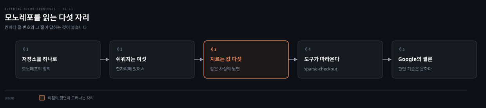
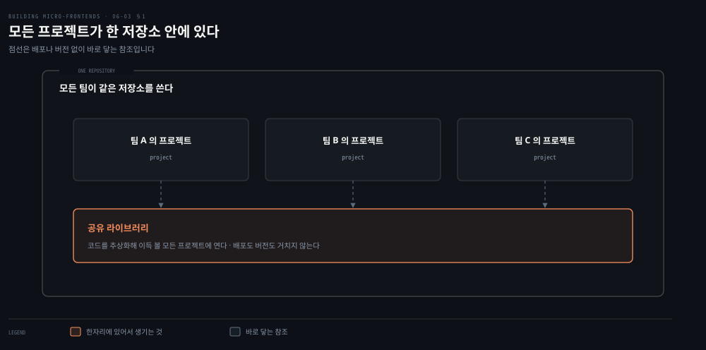
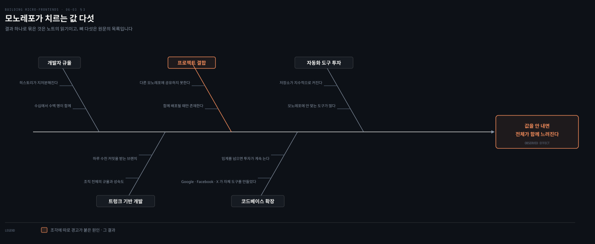

# 모노레포 — 한 저장소가 주는 것과 받는 값

---

> 자동화 전략을 설계할 때 반드시 거쳐야 할 단계가 버전 관리와 브랜치 전략을 고르는 일입니다. 이 편은 그중 한쪽인 모노레포를 따라가며, 저자가 든 이점 여섯과 값 다섯을 하나씩 봅니다.

## 핵심 요약

> 이 편이 매달린 문장은 **모노레포의 이점과 값이 같은 성질에서 나온다**는 것입니다. 코드가 한자리에 있어서 쉬워지는 것과 어려워지는 것이 같은 뿌리를 가집니다.
>
> 쉬워지는 것은 여섯입니다. 코드 재사용과 팀 사이 협업과 응집된 코드베이스와 의존성 관리와 대규모 리팩터링과 신규 입사자 온보딩입니다.
>
> 치르는 값은 다섯입니다. 자동화 도구에 대한 상시 투자와 코드베이스 증가에 따른 도구 확장, 프로젝트 사이의 결합, 트렁크 기반 개발이라는 제약, 그리고 개발자의 규율입니다.
>
> 브랜치 전략에는 선택지가 없습니다. 모노레포에서 말이 되는 유일한 전략이 트렁크 기반 개발입니다.
>
> 조각을 다룰 때 특히 조심할 것이 하나 있습니다. 조각을 너무 많이 결합하면 **독립 배포되는 아티팩트라는 성질 자체를 잃습니다.**
>
> Git도 이 방향을 따라오고 있습니다. 2020년 초 sparse-checkout이 들어오면서 저장소의 일부만 클론하는 길이 열렸습니다.

## 학습 목표

이 내용을 읽고 나면:

1. 모노레포가 쉽게 만드는 여섯 가지를 대고 각각의 근거를 말할 수 있습니다.
2. 모노레포가 치르는 값 다섯을 대고 그것이 어느 이점의 뒷면인지 짚을 수 있습니다.
3. 트렁크 기반 개발이 모노레포에서 유일한 선택인 이유를 설명할 수 있습니다.
4. 조각을 모노레포에 둘 때 잃을 수 있는 성질이 무엇인지 말할 수 있습니다.
5. Git의 sparse-checkout이 어느 난제를 겨냥한 기능인지 짚을 수 있습니다.

아래는 이 편이 지나는 네 자리를 읽는 순서로 이은 지도입니다. 각 칸의 절 번호가 본문에서 그것을 다루는 곳입니다.

## 1. 저장소를 하나로 둘 것인가

> 자동화 전략을 설계하려면 그 앞에 정해야 할 것이 있습니다. 코드가 어디에 놓이는가입니다.

### 풀려는 문제

자동화 전략을 설계하기 시작할 때 반드시 거쳐야 할 단계가 있습니다. **버전 관리와 브랜치 전략을 고르는 일**입니다.

Mercurial 같은 유효한 대안이 있지만 Git이 가장 널리 쓰이는 버전 관리 시스템입니다. 저자는 예시에서 Git을 기준으로 삼되, 모든 접근이 Mercurial에도 그대로 적용된다고 밝힙니다.

### 두 갈래와 그 사이

버전 관리로 일한다는 것은 저장소를 어떻게 둘지 정한다는 뜻입니다. 논쟁은 대개 **모노레포와 폴리레포** 사이에서 벌어집니다. 폴리레포는 멀티레포라고도 부릅니다.

저자가 여기에 단서를 답니다. 두 접근 모두에 이점과 함정이 있으며, **하나를 고르는 대신 프로젝트 안에서 둘을 함께 쓸 수도 있습니다.** 맥락에 맞는 기법을 그 자리에 쓰라는 것입니다.

### 모노레포의 정의

모노레포는 **모든 팀이 같은 저장소를 쓴다**는 개념 위에 서 있습니다. 그래서 모든 프로젝트가 함께 놓입니다.

이 한 문장이 이 편의 이점 여섯과 값 다섯을 모두 낳습니다. 같은 자리에 있어서 쉬워지는 일과, 같은 자리에 있어서 서로를 붙잡는 일이 함께 따라옵니다.

## 2. 모노레포가 쉽게 만드는 여섯

> 저자가 든 이점 여섯입니다. 읽어 보면 여섯이 전부 "한자리에 있다"는 사실 하나에서 갈라져 나옵니다.

### 풀려는 문제

저장소를 나누면 그 사이를 잇는 일이 전부 명시적인 작업이 됩니다. 라이브러리를 꺼내 쓰려면 배포하고 버전을 올려야 하고, 남의 코드를 보려면 어디 있는지부터 찾아야 합니다. 모노레포는 그 일들을 없애는 데서 값을 냅니다.

### 여섯 가지

| 이점 | 저자가 든 근거 |
|---|---|
| 코드 재사용 | 라이브러리 공유가 자연스러워집니다. 프로젝트 코드베이스가 같은 저장소에 있으므로 새 프로젝트를 만들고 코드 일부를 추상화해 이득을 볼 모든 프로젝트에 열어 줄 수 있습니다 |
| 팀 사이의 쉬운 협업 | 발견 가능성에 마찰이 없어 팀이 프로젝트를 넘나들며 기여할 수 있습니다. 추상적인 논의를 여는 대신 **특정 클래스나 코드 줄을 짚어** 유지보수 담당 팀과 소통합니다 |
| 응집된 코드베이스와 적은 기술 부채 | 모든 팀이 최신 의존성 버전을 따라가게 만듭니다. 깨는 변경이 생기면 프로젝트가 깨지고 리팩터링이 필요해집니다. 모노레포는 팀이 코드베이스를 계속 리팩터링하게 만들어 코드 품질을 올리고 기술 부채를 줄입니다 |
| 단순해지는 의존성 관리 | 여러 프로젝트가 쓰는 의존성이 중앙에 모여, 프로젝트마다 매번 내려받을 필요가 없습니다. 다음 메이저 릴리스로 올릴 때는 그 라이브러리를 쓰는 모든 팀이 함께 코드베이스를 갱신해야 합니다 |
| 대규모 코드 리팩터링 | 모든 프로젝트가 같은 저장소에 있으므로 한꺼번에 리팩터링하기가 쉽습니다. 팀이 조율하거나, 전체 코드베이스의 상위 그림을 가진 기술 리더와 함께 일하게 됩니다 |
| 신규 입사자 온보딩 | 새 직원이 다른 저장소의 코드 표본을 빠르게 찾을 수 있습니다. 다른 접근에서 착안을 얻어 코드베이스 안에서 빠르게 형태를 잡을 수도 있습니다 |

### 읽어내기 — 의존성 갱신은 이점이자 강제다

표의 넷째 줄에 이 편의 성격이 드러납니다. 라이브러리를 올릴 때 **모든 팀이 함께 갱신해야 한다**는 것이 이점으로 적혀 있습니다.

다른 경우라면 한 팀이 쌓아 뒀을 기술 부채가 줄어들기 때문입니다. 저자도 곧바로 대가를 답니다. 라이브러리 갱신에는 **약간의 조율 부담**이 들고, 분산 팀이나 대규모 조직에서 특히 그렇습니다.

## 3. 그 대신 치르는 값 다섯

> 저자가 이점 뒤에 곧바로 붙이는 목록입니다. 다섯이 하나의 결과로 모입니다.

### 풀려는 문제

이점이 분명한데도 저자가 모노레포를 기본값으로 권하지 않습니다. 값이 따라오기 때문입니다. 그 값이 어디서 나타나는지가 이 절의 문제입니다.

### 다섯 가지

**자동화 도구에 대한 상시 투자**가 첫째입니다. 특히 대규모 조직에서 그렇습니다. 오픈 소스 도구가 많지만 모두가 모노레포에 맞지는 않습니다. 같은 프로젝트에서 시간이 지나 **모노레포가 지수적으로 커지기 시작하면** 더 그렇습니다.

**코드베이스가 커질 때의 도구 확장**이 둘째입니다. 자동화 파이프라인이 코드베이스와 함께 확장되어야 합니다. Google과 Facebook과 X의 여러 보고가 같은 것을 말합니다. **일정 임계를 넘으면 성능 좋은 자동화 파이프라인에 드는 투자가 계속 늘어, 여러 팀이 그 일만 전담하는 지점**에 이릅니다. 앞의 세 회사가 모두 자기 버전의 빌드 도구를 만들어 오픈 소스로 공개한 것이 그 결과입니다.

**프로젝트끼리의 결합**이 셋째입니다. 모든 프로젝트에 접근하기 쉽고 라이브러리와 의존성을 공유하는 일이 잦으므로, **함께 배포될 때만 존재할 수 있는 강하게 결합된 프로젝트**가 될 위험이 있습니다. 그러면 코드베이스가 다른 모노레포에 있는 여러 고객사 프로젝트에 조각을 공유하지 못하게 될 수 있습니다.

**트렁크 기반 개발**이 넷째입니다. 모노레포에서 말이 되는 유일한 브랜치 전략입니다. 모든 개발자가 트렁크라 부르는 같은 브랜치에 커밋한다는 전제에 서 있습니다.

모든 프로젝트가 한 저장소에 있으므로 메인 트렁크 브랜치는 **하루에 수천 건의 커밋**을 받을 수 있습니다. 그래서 하루치 기능을 통째로 개발한 뒤 병합하는 대신 **작은 단위로 자주 커밋하는 일**이 중요해집니다. 이 기법은 다른 브랜치 전략에서 흔한 "머지 지옥"을 피하게 해 줍니다. 저자는 트렁크 기반 개발의 열렬한 지지자라고 밝히면서도, 좋은 결과를 내려면 **조직 전체의 규율과 성숙도**가 필요하다고 덧붙입니다.

**개발자의 규율**이 다섯째입니다. 건강한 코드베이스를 유지하려면 규율 있는 개발자가 있어야 합니다. 수십, 수백 명이 같은 저장소에서 일하면 Git 히스토리와 코드베이스가 빠르게 지저분해질 수 있습니다. 모든 팀에 시니어 개발자를 두는 일은 거의 불가능하고, **그 지식이나 규율의 부족이 저장소 품질을 해치면 그 영향이 한 프로젝트에서 모노레포 안 여러 프로젝트로 번집니다.**

### 읽어내기 — 조각이 잃을 수 있는 성질

Lerna 같은 도구가 같은 저장소 안의 여러 프로젝트를 관리하는 데 도움을 줍니다. 필요하면 패키지 전반의 의존성을 함께 설치하고 끌어올리며, 새 버전이 준비되면 패키지를 배포할 수도 있습니다.

그럼에도 저자가 조각에 대해 남기는 경고가 이 편에서 가장 무겁습니다. 모노레포의 주된 강점 하나가 코드 공유 능력인데 그것이 코드베이스 품질 유지에 상당한 헌신을 요구합니다. 그래서 이렇게 못 박습니다.

> **조각을 너무 많이 결합하지 않도록 조심해야 합니다. 독립적으로 배포 가능한 아티팩트라는 조각의 본성을 잃을 위험이 있기 때문입니다.**

앞 장들이 세운 정의가 여기서 시험받습니다. 조각을 조각이게 만드는 것은 기술이 아니라 독립 배포 가능성이었습니다. 저장소를 합치는 결정이 그 성질을 조용히 지울 수 있습니다.

## 4. 도구가 따라오고 있다

> 모노레포의 난제 가운데 하나는 Git 자신이 풀고 있습니다.

### 풀려는 문제

저장소가 커지면 명령 하나가 느려집니다. Git은 사용자가 큰 저장소에서 히스토리나 상태 조회 같은 명령을 부를 때의 **동작 시간을 줄이는 데 투자하기 시작**했습니다.

모노레포가 인기를 얻으면서 Git이 적극적으로 작업해 온 것이 하나 더 있습니다. **전체 히스토리와 프로젝트 폴더 전부를 클론하지 않고, 사용자가 자기 기기로 가져올 것을 걸러 내는 기능**입니다.

### sparse-checkout

2020년 초 Git이 `sparse-checkout` 명령을 도입했습니다. **버전 2.25 이상**에서 쓸 수 있으며, 모든 파일과 히스토리 대신 **저장소의 일부만 클론**하게 합니다.

빠른 자동화 파이프라인을 돌리려고 클론해야 할 데이터의 양이 줄어듭니다. 저자는 이것이 모노레포 채택의 주요 난제 하나를 정면으로 다룬다고 적습니다.

### 읽어내기 — CI가 먼저 이득을 본다

저자가 이 개선의 수혜자를 명시합니다. **CI/CD**입니다.

앞 절에서 본 값 다섯 가운데 첫째와 둘째가 자동화 도구에 관한 것이었습니다. 파이프라인이 매번 전체 저장소를 클론해야 한다면 그 부담은 저장소 크기에 비례해 커집니다. sparse-checkout은 그 비례를 끊는 자리에 놓입니다.

## 5. Google이 스스로 내린 결론

> 모노레포를 쓰는 대표 조직이 남긴 논문의 결론입니다. 저자가 인용을 그대로 옮깁니다.

### 풀려는 문제

모노레포 접근을 쓴다는 것은 셋을 함께 약속하는 일입니다.

- 도구에 대한 투자
- 팀 전반에 세우고 전파하는 규율
- 코드베이스 개선에 대한 상시 투자

그렇다면 어떤 조직에 맞는가라는 질문이 남습니다.

### 인용

Google과 Meta 같은 대규모 조직이 모노레포를 쓰고 있으며, 그 조직들에서는 이 패러다임을 유지하는 투자가 지속 가능합니다. 모노레포에 관한 가장 유명한 논문 하나를 Google의 Rachel Potvin과 Josh Levenberg가 썼습니다. 결론 문단에서 두 사람이 이렇게 적습니다.

> 여러 해에 걸쳐 중앙 저장소를 계속 확장하는 데 필요한 투자가 커지면서, Google 리더십은 모놀리식 모델에서 벗어나는 편이 나을지를 이따금 검토했습니다. 그럼에도 필요한 노력에 비해 이점이 컸기에 Google은 중앙 저장소를 유지하는 쪽을 거듭 선택했습니다.
>
> 소스 코드 관리의 모놀리식 모델은 모두를 위한 것이 아닙니다. 개방적이고 협력적인 문화를 가진 Google 같은 조직에 가장 잘 맞습니다. **코드베이스의 큰 부분이 비공개이거나 그룹 사이에 감춰진 조직에서는 잘 작동하지 않을 것입니다.**

### 읽어내기 — 판단 기준이 기술이 아니다

인용의 마지막 문장이 판단 기준을 문화로 옮깁니다. 도구의 성능이나 저장소 크기가 아니라 **코드가 조직 안에서 열려 있는가**입니다.

저자가 앞에서 든 값 다섯 가운데 셋이 사람과 규율에 관한 것이었던 이유가 여기서 드러납니다. 모노레포는 도구로 지탱되는 구조가 아니라 **문화로 지탱되는 구조**입니다. 그 문화가 없는 조직에서는 도구를 아무리 좋게 만들어도 서지 않습니다.

## 적용 관점

> 아래는 백엔드 개발자가 이미 가진 판단 기준과 이 절을 잇는 노트의 읽기입니다. 책이 백엔드 독자를 향해 쓴 대목이 아닙니다.

모노레포 논쟁은 백엔드에서 먼저 겪은 것과 같은 모양입니다. 공통 모듈을 사내 저장소에 배포해 버전으로 잇느냐, 아니면 한 저장소에 두고 함께 빌드하느냐의 선택이었습니다. 저자가 든 이점 여섯 가운데 다섯이 "찾기 쉽고 고치기 쉽다"로 요약되는데, 이것은 멀티 모듈 프로젝트에서 이미 익숙한 감각입니다.

값 쪽이 더 실감납니다. 한 저장소에 모듈이 쌓이면 빌드 시간이 전체 개발자에게 곱해집니다. 저자가 Google과 Facebook이 자기 빌드 도구를 만들어야 했다고 적은 대목이 그 임계를 보여 줍니다. 그 규모가 아니라면 기성 도구로 버티는 편이 낫다는 판단이 따라옵니다.

트렁크 기반 개발이 유일한 선택이라는 진술은 브랜치 전략을 정할 때 그대로 옮겨 옵니다. 저장소 하나에 팀이 여럿이면 장수 브랜치가 곧 병합 비용이 됩니다. 릴리스 브랜치를 오래 끌던 관행이 있는 조직이라면 저장소 결정보다 이 관행의 전환이 더 큰 일입니다.

조각을 너무 결합하면 독립 배포 가능성을 잃는다는 경고는 서비스 경계에서 겪던 것과 같습니다. 공통 모듈이 커질수록 서비스가 함께 배포되고, 어느 순간 마이크로서비스라 부르기 어려워집니다. 프론트엔드에서는 그 결합이 빌드 산출물 하나로 굳어 더 눈에 띄지 않게 진행됩니다.

## 면접 대비

Q: 모노레포가 기술 부채를 줄인다는 주장의 근거는 무엇인가요?

A: 모든 팀이 최신 의존성 버전을 따라가게 만들기 때문입니다. 깨는 변경이 생기면 프로젝트가 깨지고 리팩터링이 필요해지므로, 모노레포는 팀이 코드베이스를 계속 리팩터링하게 만듭니다. 그 과정에서 코드 품질이 올라가고 부채가 줄어듭니다. 다만 라이브러리를 메이저 버전으로 올릴 때는 그 라이브러리를 쓰는 모든 팀이 함께 갱신해야 하고, 여기에 조율 부담이 붙습니다.

Q: 모노레포에서 브랜치 전략은 왜 선택지가 없나요?

A: 모노레포에서 말이 되는 유일한 전략이 트렁크 기반 개발이기 때문입니다. 모든 개발자가 트렁크라 부르는 같은 브랜치에 커밋한다는 전제에 서 있습니다. 모든 프로젝트가 한 저장소에 있어 메인 트렁크가 하루에 수천 건의 커밋을 받을 수 있으므로, 하루치 기능을 통째로 병합하는 대신 작은 단위로 자주 커밋해야 머지 지옥을 피합니다. 저자는 이 전략이 조직 전체의 규율과 성숙도를 요구한다고 덧붙입니다.

Q: 조각을 모노레포에 둘 때 무엇을 조심해야 하나요?

A: 조각을 너무 많이 결합하지 않는 일입니다. 모노레포의 강점인 코드 공유가 쉬운 만큼 프로젝트가 강하게 결합되어 함께 배포될 때만 존재할 수 있게 될 위험이 있습니다. 저자는 그렇게 되면 독립적으로 배포 가능한 아티팩트라는 조각의 본성을 잃는다고 경고합니다. 다른 모노레포에 있는 고객사 프로젝트에 조각을 공유하지 못하게 되는 것도 같은 결과입니다.

Q: sparse-checkout은 어떤 난제를 겨냥한 기능인가요?

A: 클론해야 할 데이터의 양입니다. 2020년 초 Git이 도입했고 버전 2.25 이상에서 쓸 수 있으며, 모든 파일과 히스토리 대신 저장소의 일부만 클론합니다. 빠른 자동화 파이프라인을 돌리려고 가져와야 할 데이터가 줄어들어, 모노레포 채택의 주요 난제 하나를 다룹니다. 저자는 이 개선이 CI/CD에 특히 이득이 된다고 적습니다.

### 요약 세 문장

1. 모노레포의 이점 여섯과 값 다섯은 "모든 프로젝트가 한자리에 있다"는 같은 사실에서 갈라져 나옵니다.
2. 브랜치 전략은 트렁크 기반 개발 하나뿐이며, 그것은 도구가 아니라 조직 전체의 규율과 성숙도를 요구합니다.
3. 조각을 지나치게 결합하면 독립 배포 가능성을 잃고, Google의 논문은 이 모델이 코드가 열려 있는 문화에서만 선다고 적습니다.

## 핵심 개념 체크리스트

- [ ] 모노레포의 정의 한 문장에서 이점과 값이 어떻게 갈라지는지 말할 수 있는가?
- [ ] 이점 여섯 가운데 넷 이상을 근거와 함께 댈 수 있는가?
- [ ] 값 다섯을 대고 그중 셋이 사람과 규율의 문제임을 짚을 수 있는가?
- [ ] 트렁크 기반 개발이 유일한 선택인 이유와 그것이 요구하는 것을 말할 수 있는가?
- [ ] 조각을 결합할 때 잃는 성질이 무엇인지 재현할 수 있는가?
- [ ] sparse-checkout의 도입 시점과 최소 Git 버전을 댈 수 있는가?
- [ ] Google 논문이 이 모델에 맞는 조직을 무엇으로 갈랐는지 말할 수 있는가?

## 관련 문서

- [개발자 경험 — 마찰을 어디서 없앨 것인가](06-02.개발자%20경험%20—%20마찰을%20어디서%20없앨%20것인가.md) — 저장소를 정하기 전에 본 개발자 쪽 마찰
- [폴리레포와 CI — 나눈 뒤에 누가 소유하나](06-04.폴리레포와%20CI%20—%20나눈%20뒤에%20누가%20소유하나.md) — 반대쪽 전략과 두 전략을 섞는 길
- [모놀리스에서 분산 프론트엔드까지](01-01.모놀리스에서%20분산%20프론트엔드까지.md) — 독립 배포 가능성이 조각의 정의였던 자리
- [Building Micro-Frontends 정독 인덱스](README.md) — 6장의 진행 상태는 인덱스의 노트 표에서 봅니다

## 참고 자료

- 《Building Micro-Frontends, Second Edition》(Luca Mezzalira, O'Reilly, 2026) ISBN 978-1-098-17078-3
  - 다룬 범위: Version Control · Monorepo · SPARSE-CHECKOUT
  - 이어서: Polyrepo · A Possible Future for a Version Control System
- [Why Google Stores Billions of Lines of Code in a Single Repository](https://cacm.acm.org/magazines/2016/7/204032-why-google-stores-billions-of-lines-of-code-in-a-single-repository/fulltext) — 저자가 결론 문단을 인용한 Rachel Potvin과 Josh Levenberg의 논문
- [git sparse-checkout](https://git-scm.com/docs/git-sparse-checkout) — 2020년 초 도입된 명령의 공식 문서
