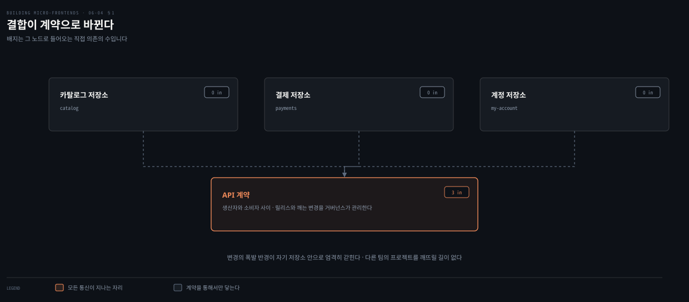
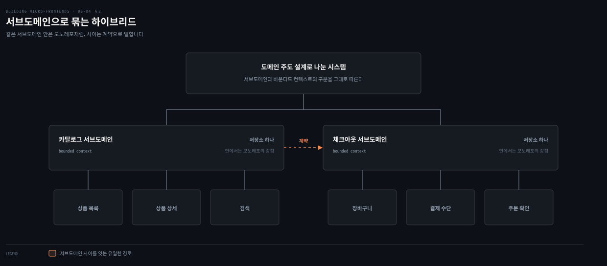
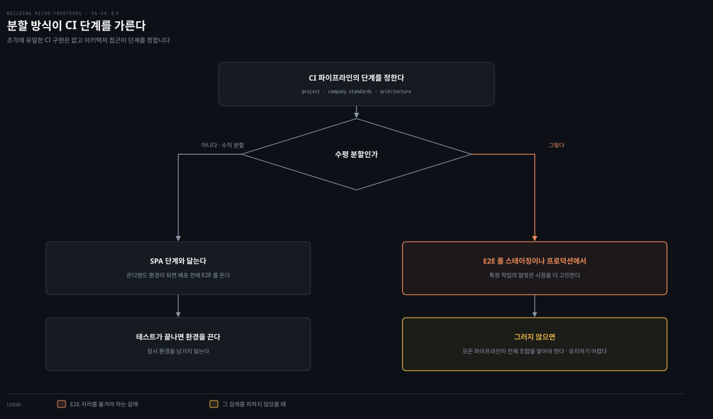

# 폴리레포와 CI — 나눈 뒤에 누가 소유하나

---

> 앞 편이 저장소를 하나로 두는 쪽을 봤다면 이 편은 반대쪽을 봅니다. 그리고 저자가 둘 사이에서 제안하는 세 번째 길과, 저장소를 정한 뒤 곧바로 따라오는 CI 소유권 문제까지 이어집니다.

## 핵심 요약

> 이 편이 매달린 하나의 생각은 **저장소를 나누면 결합이 계약으로 바뀐다**는 것입니다.

이득도 부담도 그 전환에서 나옵니다. 폴리레포가 주는 것은 다섯입니다. 프로젝트마다 다른 브랜치 전략, 다른 팀을 막지 않는 폭발 반경, 계약을 생각하게 만드는 강제, 세밀한 접근 통제, 그리고 적은 도구 투자입니다. 못 주는 것은 넷입니다. 프로젝트 발견의 어려움과 코드 중복과 이름 규약의 난립, 그리고 모범 사례가 모든 저장소에 도달하기까지 걸리는 시간입니다.

완벽한 해법은 없습니다. 저자는 둘의 함정을 줄이는 **하이브리드**를 제안하며 그 묶는 기준으로 서브도메인과 바운디드 컨텍스트를 듭니다. 저장소를 정하면 다음 질문이 따라옵니다. CI를 누가 소유하는가이며, 저자의 답은 **CI 기계의 외부 수호자가 아니라 개발 팀**입니다. 다만 CI 구현에 정답은 없어서 수직 분할이면 SPA 단계와 닮고 수평 분할이면 E2E를 언제 어디서 돌릴지가 갈립니다.

## 학습 목표

이 내용을 읽고 나면:

1. 폴리레포가 주는 다섯과 못 주는 넷을 대고 각각의 근거를 말할 수 있습니다.
2. 수직 분할과 수평 분할 중 어느 쪽이 폴리레포에 유리한지 이유와 함께 설명할 수 있습니다.
3. 하이브리드 접근이 무엇을 기준으로 저장소를 묶는지 짚을 수 있습니다.
4. CI 소유권이 개발 팀으로 옮겨 온 배경과 그 경계를 말할 수 있습니다.
5. 분할 방식에 따라 E2E 테스트를 돌리는 자리가 어떻게 갈리는지 구분할 수 있습니다.

아래는 이 편이 지나는 네 자리를 읽는 순서로 이은 지도입니다. 각 칸의 절 번호가 본문에서 그것을 다루는 곳입니다.

## 1. 저장소를 나누면 무엇이 생기나

> 모노레포의 반대쪽입니다. 모든 애플리케이션이 자기 저장소에서 삽니다.

### 풀려는 문제

모노레포 전략의 반대가 폴리레포이며 멀티레포라고도 부릅니다. 정의가 한 줄입니다. **모든 애플리케이션이 자기 저장소에서 삽니다.**

앞 편에서 본 모노레포의 값 다섯 가운데 셋이 "한자리에 있어서" 생긴 것이었습니다. 저장소를 나누면 그 셋이 사라집니다. 대신 다른 것이 들어옵니다.

### 다섯 가지 이점

| 이점 | 저자가 든 근거 |
|---|---|
| 프로젝트마다 다른 브랜치 전략 | 모노레포에서는 트렁크 기반 개발을 써야 했지만, 폴리레포에서는 그 프로젝트에 맞는 전략을 씁니다. 릴리스 주기가 다른 레거시 프로젝트 하나에만 Git flow를 쓰는 식입니다 |
| 다른 팀을 막지 않음 | 변경의 폭발 반경이 자기 프로젝트 안으로 엄격히 갇힙니다. 다른 팀의 프로젝트를 깨뜨리거나 나쁜 영향을 줄 가능성이 없습니다. 그들이 다른 저장소에 살기 때문입니다 |
| 계약을 생각하게 만듦 | 프로젝트 사이 통신이 API로 정의되어야 합니다. 모든 팀이 생산자와 소비자 사이의 계약을 식별하고, 미래 릴리스와 깨는 변경을 관리할 거버넌스를 만들어야 합니다 |
| 세밀한 접근 통제 | 대규모 조직은 외주 인력과 일할 가능성이 크고, 그들은 자기가 책임진 저장소만 봐야 합니다. 폴리레포는 역할을 도입하고 팀이나 부서마다 필요한 접근 수준을 정하기에 알맞은 전략입니다 |
| 적은 도구 투자 | 조각 저장소의 크기가 제한적이라 CircleCI나 Drone CI 같은 관리형 해법으로 충분합니다. 커밋하는 개발자가 적어 저장소가 모노레포만큼 빠르게 커지지 않습니다 |

마지막 줄에 조건이 하나 붙습니다. 인프라를 코드로 관리하거나 팀 사이에 재사용할 수 있는 명령줄 스크립트로 CI/CD를 자동화하면, **초기 투자와 유지 부담이 특히 더 적어집니다.**

### 읽어내기 — 세 번째 이점이 나머지의 값이다

목록의 셋째 줄이 이 전략의 성격을 드러냅니다. 계약을 생각하게 "만든다"는 것은 이점이면서 동시에 강제입니다.

같은 저장소였다면 다른 팀의 클래스를 직접 참조하면 끝날 일이, 나뉜 뒤에는 API를 정의하고 버전을 관리하고 깨는 변경을 협의하는 일이 됩니다. 저자가 이것을 이점 칸에 놓은 이유가 있습니다. **그 명시적인 계약이 조각을 독립 배포 가능한 상태로 유지해 주기** 때문입니다.

## 2. 폴리레포가 못 주는 넷

> 저장소가 늘어나면 잃는 것이 생깁니다. 넷이 하나의 원인으로 모입니다.

### 풀려는 문제

폴리레포의 위험을 저자가 한 단어로 정리합니다. **저장소의 난립**입니다. 조각을 쓰고 마이크로서비스까지 함께 쓰면 버전 관리 시스템 안의 저장소 수가 크게 불어날 수 있습니다.

### 넷

**프로젝트 발견의 어려움**이 첫째입니다. 본성상 모든 프로젝트가 자기 저장소에 있으므로 다른 프로젝트를 발견하기가 더 어렵습니다. 모든 개발자가 다른 프로젝트를 쉽게 찾게 하는 **탄탄한 이름 규약**이 이 문제를 줄여 줍니다. 그럼에도 신규 입사자나 여러 접근을 비교하려는 개발자가 참고할 프로젝트를 찾기 어렵게 만드는 것은 분명합니다.

**코드 중복**이 둘째입니다. 한 팀이 표준화를 위해 만든 라이브러리를 기술 부서가 모를 수 있습니다. 로깅이나 관측 연동처럼 **여러 조각에 걸쳐 쓰여야 할 라이브러리**가 자주 있는데, 좋은 거버넌스가 없으면 폴리레포는 코드 공유를 돕지 않습니다.

저자가 이 일을 맡기에 알맞은 자리를 짚습니다. **아키텍트와 기술 리더**입니다. 여러 팀과 일하며 시스템이 어떻게 돌아가고 무엇을 필요로 하는지 상위 그림을 가진 쪽이기 때문입니다.

**이름 규약**이 셋째입니다. 저자는 폴리레포 환경에서 특정 규약 없이 이름이 난립하는 것을 자주 봤다고 적습니다. 그러면 **무엇이 어디에 있는지 추적하는 문제가 빠르게 커집니다.**

**모범 사례 유지**가 넷째입니다. 모노레포에서는 유지하고 통제할 저장소가 하나뿐입니다. 폴리레포에서는 새로 정한 모범 사례가 모든 저장소에 도달하기까지 **시간이 걸릴 수 있습니다.** 효율적인 소통과 절차가 이 문제를 줄이지만, 개발 도중에 발견하면 팀의 처리량이 떨어지므로 미리 생각해 둬야 합니다.

### 읽어내기 — 수직 분할이 폴리레포에 유리하다

저자가 조각과 폴리레포의 궁합을 한 문장으로 가릅니다. **수직 분할 프로젝트가 수평 분할 프로젝트보다 폴리레포에서 겪는 문제가 훨씬 적습니다.** 수평 분할에서는 애플리케이션이 서로 다른 여러 부분으로 조합되기 때문입니다.

폴리레포가 조각 맥락에서 여는 것이 하나 더 있습니다. **레거시 프로젝트와 다른 접근을 쓰는 일**입니다. 레거시 플랫폼에 이미 자리 잡은 모범 사례를 건드리지 않으면서, 조각 쪽에만 새 도구나 라이브러리를 도입할 수 있습니다.

저자가 이 절을 닫으며 투자할 곳을 지정합니다. 폴리레포를 쓰기로 했다면 초기 투자를 어디에 둘지 알아야 하며, 그것은 **거버넌스와 팀 사이의 소통 흐름**이어야 합니다.

## 3. 둘을 섞는 길

> 저자는 완벽한 해법이 없다고 먼저 인정합니다. 그리고 세 번째 길을 제안합니다.

### 풀려는 문제

버전 관리 시스템에서 어떤 길을 택하든 완벽한 해법이 되지는 않습니다. **주어진 맥락에서 가장 잘 통하는 해법일 뿐이며 언제나 트레이드오프**입니다.

그렇다면 두 접근의 함정을 줄이면서 이점을 살리는 길이 있는가라는 질문이 남습니다.

### 무엇을 기준으로 묶나

저자가 제안하는 하이브리드의 묶는 기준이 도메인입니다. 조각과 마이크로서비스는 **도메인 주도 설계로 설계되어야** 하므로, 서브도메인과 바운디드 컨텍스트의 구분을 따라 특정 서브도메인에 속한 모든 프로젝트를 한 저장소에 묶습니다.

그러면 두 가지가 동시에 일어납니다.

- 서로 다른 바운디드 컨텍스트를 책임지는 팀들 사이에서는 **협업이 강제되고 계약으로 일하게** 됩니다.
- 같은 서브도메인에서 일하는 모든 팀은 **모노레포의 강점을 그대로 누립니다.**

### 읽어내기 — 값을 함께 적어 둔다

저자가 이 제안에 붙인 단서가 정직합니다. 이 접근이 **새로운 관행과 새로 쓰거나 만들 도구와 새 난제를 낳을 수 있다**는 것입니다.

그럼에도 마이크로 아키텍처에서 탐색해 볼 만한 해법이라고 적습니다. 앞 두 절의 목록을 나란히 두고 보면 이 제안의 자리가 분명해집니다. 저장소 경계를 **팀이 아니라 도메인 경계에 맞추면**, 협업이 필요한 범위 안에서는 모노레포처럼 일하고 그 밖에서는 계약으로 일하게 됩니다.

## 4. CI를 누가 소유하나

> 버전 관리 전략을 정한 다음에 오는 질문입니다. 저자의 답이 조직 쪽을 향합니다.

### 풀려는 문제

버전 관리 전략을 식별한 뒤에는 CI 방식을 생각해야 합니다. 저자가 여기서 관찰 하나를 먼저 둡니다. 회사마다 다른 CI 구현이 가장 성공적이고 효과적이었던 경우는 **CI 기계의 외부 수호자가 아니라 개발 팀이 관리할 때**였다는 것입니다.

### 무엇이 바뀌었나

지난 몇 년 사이 많은 것이 달라졌습니다. 프론트엔드 개발자를 포함한 개발자들이 **자기 코드를 돌리는 데 필요한 인프라와 도구를 더 알아야** 하게 됐습니다. 신뢰할 수 있고 빠른 파이프라인에서 애플리케이션 코드를 빌드하는 일이 실제로 그들의 업무이기 때문입니다.

과거의 모습을 저자가 적어 둡니다. CI가 회사의 다른 팀에 위임되어 개발자가 파이프라인에서 아무것도 바꿀 수 없던 상황입니다. 그 결과 개발자는 자동화 파이프라인을 **바꿀 수 없지만 배포에는 필요한 닫힌 시스템**으로 대했습니다.

최근에는 조직 전반에 퍼진 DevOps 문화 덕분에 이런 상황이 드물어지고 있습니다. DevOps는 조직이 애플리케이션과 서비스를 빠르게 전달하는 능력을 높이는 **문화적 철학과 관행과 도구의 결합**입니다. 이 모델에서 개발과 운영 팀은 더 이상 분리되지 않고, 때로는 한 팀으로 합쳐져 개발과 테스트부터 배포와 운영까지 전체 생애 주기를 넘나들며 일합니다.

### 경계는 남는다

권한이 내려간다는 말이 무제한을 뜻하지는 않습니다. 저자가 곧바로 선을 긋습니다. **개발자가 CI에서 하고 싶은 것을 다 해도 된다는 뜻이 아닙니다.** 다만 피드백 루프의 속도가 주로 개발자에게 달려 있으므로 그들에게 걸린 몫이 있어야 합니다.

기술 리더십 팀이 할 일도 남습니다. 아키텍트와 플랫폼 팀과 DX와 기술 리더와 엔지니어와 관리자가 **팀이 움직일 지침과 도구를 제공**하고, 그 경계 안에서 유연함을 허용합니다.

조각 아키텍처에서 CI가 더 중요해지는 이유가 하나입니다. **신뢰성 있게 빌드하고 배포해야 할 독립 아티팩트의 수**입니다.

### 도구가 갈려도 괜찮은 이유

조각마다 다른 도구를 쓸 수 있다는 말이 과해 보일 수 있습니다. 저자의 관찰은 반대입니다. 실제로는 **비슷한 일을 하는 소수의 도구로 수렴**하며, 이 접근이 도구와 접근의 건강한 비교를 가능하게 해 팀이 모범 사례를 만들어 가게 합니다.

저자가 든 장면이 구체적입니다. 복도를 지나다 엔지니어들이 Rollup 같은 빌드 도구가 특정 시나리오에서 Webpack에 없는 기능이나 성능 이점을 가진다는 이야기를 나누는 것을 여러 번 들었다는 것입니다. 그는 이것을 **샌드박스가 아니라 실제 시나리오에서 검증된 도구 사이의 훌륭한 대면**이라고 부릅니다.

### 분할 방식이 단계를 가른다

저자가 마지막으로 못 박는 것이 있습니다. **조각에 유일한 CI 구현은 없습니다.** 프로젝트와 회사 표준과 아키텍처 접근에 많이 달려 있습니다.

- **수직 분할**로 구현하면 CI 파이프라인의 모든 단계가 일반 SPA 단계와 닮습니다. 자동화 전략이 온디맨드 환경 생성을 허용한다면 배포 전에 E2E 테스트를 할 수 있고, 테스트가 끝나면 환경을 끕니다.
- **수평 분할**은 특정 작업을 수행할 알맞은 시점을 더 고민해야 합니다. E2E 테스트는 **스테이징이나 프로덕션에서** 수행해야 합니다.

그러지 않으면 어떻게 되는지도 적혀 있습니다. 모든 개별 파이프라인이 애플리케이션 전체의 조합을 알아야 하고, 조각마다 최신 버전을 가져와 임시 환경에 올려야 합니다. 저자는 이것을 **유지하고 발전시키기 어려운 해법**이라고 부릅니다.

## 적용 관점

> 아래는 백엔드 개발자가 이미 가진 판단 기준과 이 절을 잇는 노트의 읽기입니다. 책이 백엔드 독자를 향해 쓴 대목이 아닙니다.

폴리레포의 이점 목록은 서비스마다 저장소를 나눠 온 관행 그대로입니다. 폭발 반경이 자기 저장소 안에 갇힌다는 점과 접근 권한을 저장소 단위로 자를 수 있다는 점이 실제로 저장소를 나누게 만든 이유였습니다. 외주 인력이 자기 저장소만 보게 한다는 대목도 사내에서 겪는 그대로입니다.

코드 중복 문제도 익숙합니다. 공통 로깅 라이브러리를 만들어 두고도 다른 팀이 모른 채 비슷한 것을 또 만드는 일이 반복됐습니다. 저자가 이 일을 아키텍트와 기술 리더에게 맡기는 이유가 분명합니다. 여러 팀을 가로질러 보는 자리가 그곳뿐입니다.

하이브리드 제안은 바운디드 컨텍스트를 저장소 경계로 삼자는 말입니다. 서비스를 나눌 때 이미 쓰던 기준을 저장소에도 그대로 적용하는 것이라, 도메인 경계가 명확한 조직이라면 추가 설계 없이 바로 옮길 수 있습니다. 반대로 경계가 흐린 조직에서는 이 제안이 새 문제를 하나 더 얹습니다.

CI 소유권 이야기는 DevOps 전환기에 겪은 것과 같습니다. 젠킨스를 인프라 팀이 잠가 두던 시절에는 빌드가 깨져도 손을 못 댔고, 파이프라인을 코드로 옮기고 나서야 개발자가 고칠 수 있게 됐습니다. 프론트엔드가 다른 점은 아티팩트 수입니다. 서비스 수십 개가 아니라 조각 수백 개가 각자 파이프라인을 갖게 되므로, 소유권을 안 내려보내면 병목이 한 팀에 몰립니다.

## 면접 대비

Q: 폴리레포에서 계약을 생각하게 된다는 말은 무슨 뜻인가요?

A: 프로젝트 사이 통신이 API로 정의되어야 한다는 뜻입니다. 저장소가 나뉘면 다른 팀의 코드를 직접 참조할 수 없으므로, 모든 팀이 생산자와 소비자 사이의 계약을 식별하고 미래 릴리스와 깨는 변경을 관리할 거버넌스를 만들어야 합니다. 저자는 이것을 이점으로 분류합니다. 명시적인 계약이 조각을 독립 배포 가능한 상태로 유지하기 때문입니다.

Q: 폴리레포의 위험은 무엇이고 초기 투자는 어디에 해야 하나요?

A: 저장소의 난립입니다. 조각에 마이크로서비스까지 더하면 저장소 수가 크게 불어납니다. 발견이 어려워지고 코드가 중복되며 이름 규약이 난립하고, 새 모범 사례가 모든 저장소에 도달하기까지 시간이 걸립니다. 저자는 폴리레포를 택한다면 초기 투자를 거버넌스와 팀 사이의 소통 흐름에 두라고 적습니다.

Q: 하이브리드 저장소 전략은 무엇을 기준으로 묶나요?

A: 서브도메인과 바운디드 컨텍스트입니다. 조각과 마이크로서비스가 도메인 주도 설계로 설계되어야 하므로 그 구분을 따라, 특정 서브도메인에 속한 모든 프로젝트를 한 저장소에 묶습니다. 그러면 다른 바운디드 컨텍스트를 맡은 팀 사이에서는 계약으로 일하고, 같은 서브도메인 안에서는 모노레포의 강점을 누립니다. 저자는 새 관행과 새 도구와 새 난제가 따라올 수 있다는 단서를 함께 답니다.

Q: 분할 방식에 따라 E2E 테스트를 도는 자리가 어떻게 달라지나요?

A: 수직 분할이면 CI의 모든 단계가 일반 SPA와 닮고, 온디맨드 환경을 만들 수 있다면 배포 전에 E2E를 돌린 뒤 환경을 끕니다. 수평 분할이면 E2E를 스테이징이나 프로덕션에서 수행해야 합니다. 그러지 않으면 모든 파이프라인이 애플리케이션 전체 조합을 알고 조각마다 최신 버전을 가져와 임시 환경에 올려야 하는데, 저자는 이것을 유지하고 발전시키기 어려운 해법이라고 적습니다.

### 요약 세 문장

1. 저장소를 나누면 결합이 계약으로 바뀌며, 폴리레포의 이점 다섯과 한계 넷이 모두 그 전환에서 나옵니다.
2. 완벽한 해법은 없으므로 저자는 서브도메인과 바운디드 컨텍스트로 묶는 하이브리드를 세 번째 길로 제안합니다.
3. CI는 외부 수호자가 아니라 개발 팀이 소유해야 하며, 분할 방식이 E2E를 돌릴 자리를 갈라 놓습니다.

## 핵심 개념 체크리스트

- [ ] 폴리레포의 정의 한 줄에서 이점 다섯이 어떻게 갈라지는지 말할 수 있는가?
- [ ] 이점 다섯 가운데 셋 이상을 근거와 함께 댈 수 있는가?
- [ ] 한계 넷을 대고 그것들이 모이는 하나의 위험을 짚을 수 있는가?
- [ ] 수직 분할이 폴리레포에 유리한 이유를 말할 수 있는가?
- [ ] 하이브리드가 저장소를 묶는 기준과 그 대가를 재현할 수 있는가?
- [ ] CI 소유권이 개발 팀으로 가되 남는 경계가 무엇인지 구분할 수 있는가?
- [ ] 수평 분할에서 E2E를 스테이징이나 프로덕션에서 도는 이유를 설명할 수 있는가?

## 관련 문서

- [모노레포 — 한 저장소가 주는 것과 받는 값](06-03.모노레포%20—%20한%20저장소가%20주는%20것과%20받는%20값.md) — 반대쪽 전략과 그 이점 여섯 · 값 다섯
- [E2E 테스트 — 경계를 넘는 시나리오는 누구 것인가](06-05.E2E%20테스트%20—%20경계를%20넘는%20시나리오는%20누구%20것인가.md) — 이 편이 자리만 잡아 둔 테스트 문제의 본론
- [경계를 어디에 긋고 어떻게 확인하는가](02-02.경계를%20어디에%20긋고%20어떻게%20확인하는가.md) — 하이브리드가 기준으로 삼는 바운디드 컨텍스트의 앞선 설명
- [Building Micro-Frontends 정독 인덱스](README.md) — 6장의 진행 상태는 인덱스의 노트 표에서 봅니다

## 참고 자료

- 《Building Micro-Frontends, Second Edition》(Luca Mezzalira, O'Reilly, 2026) ISBN 978-1-098-17078-3
  - 다룬 범위: Polyrepo · A Possible Future for a Version Control System · Continuous Integration Strategies · ABOUT DEVOPS
  - 이어서: Testing Micro-Frontends · End-to-End Testing
