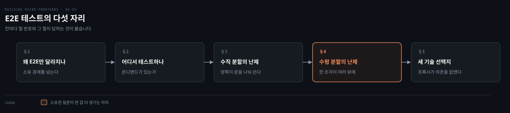
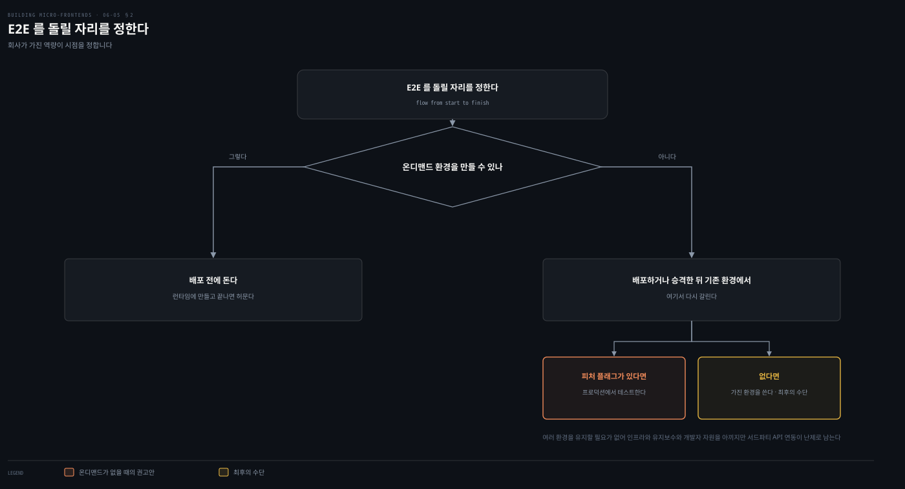
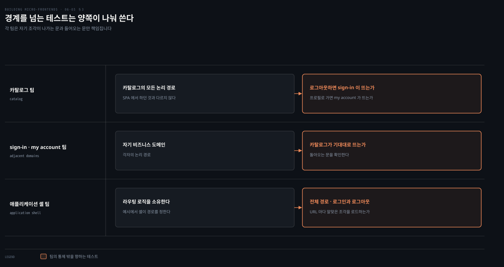
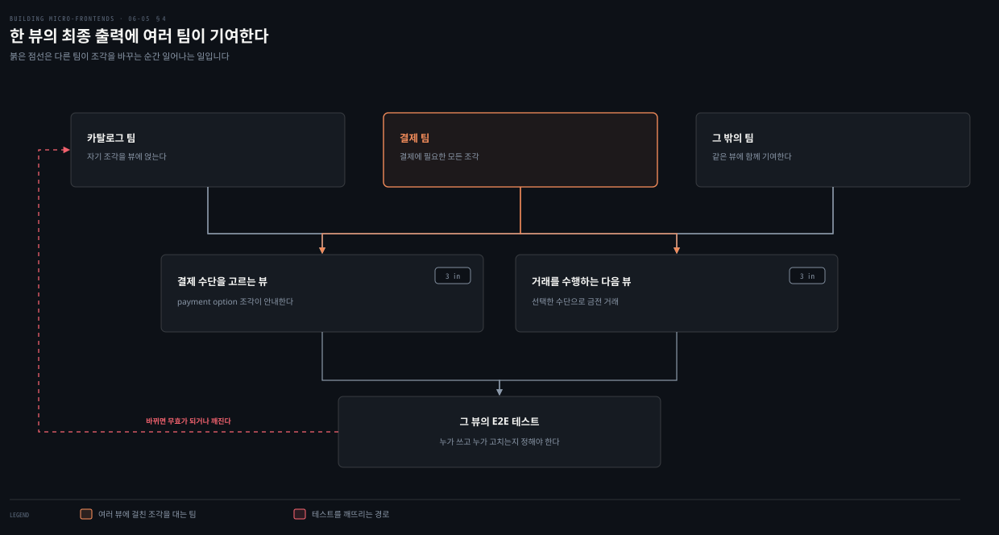
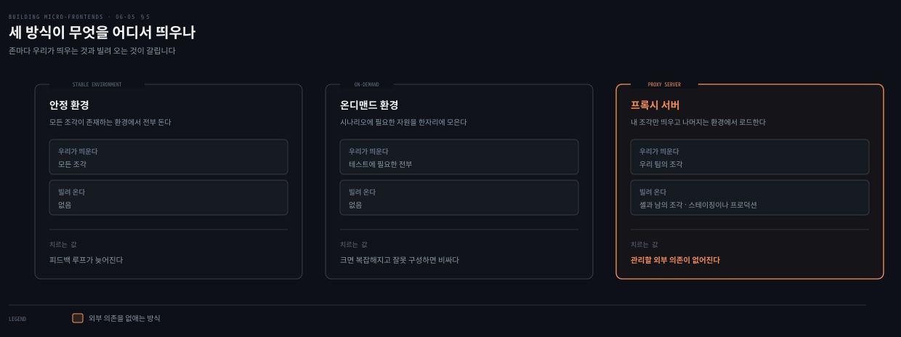

# E2E 테스트 — 경계를 넘는 시나리오는 누구 것인가

---

> 조각을 쓴다고 프론트엔드 테스트 관행이 바뀌지는 않습니다. 달라지는 것은 하나, E2E 테스트입니다. 이 편은 그 하나가 왜 달라지는지와 누가 무엇을 맡아야 하는지를 따라갑니다.

## 핵심 요약

> 이 편이 매달린 질문은 **경계를 넘는 시나리오를 누가 테스트하는가**입니다. 조각을 나누는 순간 이 질문에 답이 없어집니다.
>
> 단위 테스트와 통합 테스트는 달라지지 않습니다. 조각이 이 수준에서 고유한 난제를 만들지 않기 때문입니다.
>
> 어디서 돌릴지가 먼저입니다. 온디맨드 환경을 만들 수 있으면 배포 전에, 없으면 배포 뒤 기존 환경에서 돌리며 그때는 **피처 플래그를 낀 프로덕션 테스트**가 권고안입니다.
>
> 수직 분할에서는 팀이 자기 도메인 경계를 넘는 테스트를 씁니다. 카탈로그 팀이 로그아웃 뒤 다른 조각이 제대로 뜨는지까지 확인하는 식입니다.
>
> 수평 분할에서는 질문이 하나 더 생깁니다. 조각 하나가 여러 뷰에 걸쳐 있을 때 **그 팀이 모든 뷰의 시나리오를 다 맡는가**입니다.
>
> 기술 선택지는 셋입니다. 안정 환경과 온디맨드 환경과 프록시 서버이며, 셋 중 프록시가 외부 의존을 없앱니다.


## 학습 목표

이 내용을 읽고 나면:

1. 조각 아키텍처에서 E2E 테스트만 달라지는 이유를 설명할 수 있습니다.
2. 온디맨드 환경 유무에 따라 E2E를 돌리는 시점이 어떻게 갈리는지 말할 수 있습니다.
3. 수직 분할에서 도메인 경계를 넘는 테스트를 누가 쓰는지 재현할 수 있습니다.
4. 수평 분할에서 생기는 소유권 질문과 유지보수 부담을 짚을 수 있습니다.
5. E2E 구현의 세 선택지를 비교하고 각각이 무엇을 미루거나 없애는지 말할 수 있습니다.

아래는 이 편이 지나는 다섯 자리를 읽는 순서로 이은 지도입니다. 각 칸의 절 번호가 본문에서 그것을 다루는 곳입니다.




## 1. 왜 E2E만 달라지나

> 저자가 범위를 먼저 좁힙니다. 테스트 전략 전반을 다루지 않고 표준 접근과 달라지는 지점만 봅니다.

### 풀려는 문제

저자는 단위 테스트와 통합 테스트와 E2E 테스트 같은 여러 테스트 전략을 이 책에서 다루지 않겠다고 밝힙니다. 대신 **어떤 프론트엔드 아키텍처에서든 해 오던 표준 접근과 달라지는 지점**만 다룹니다.

테스트 전략 자체를 더 알고 싶은 독자에게는 Kent Beck과 Robert C. Martin의 자료를 권합니다. 특히 Beck의 《Test-Driven Development》와 Martin의 《Clean Code》입니다.

### 달라지는 하나

조각으로 일한다고 해서 프론트엔드 테스트 관행을 바꾸는 것은 아닙니다. 다만 **E2E 테스트를 수행할 때 CI 파이프라인에 추가 복잡도**를 만듭니다.

단위 테스트와 통합 테스트는 다른 프론트엔드 아키텍처와 비교해 달라지지 않습니다. 그래서 저자는 E2E 테스트에 집중합니다. **조각을 테스트하는 데서 가장 큰 난제**이기 때문입니다.

### 읽어내기 — 왜 이 하나만 걸리는가

이유가 앞 편들에서 이미 나왔습니다. 단위와 통합 테스트는 조각 하나 안에서 끝납니다. 조각을 나눈 경계가 그 테스트의 바깥에 있습니다.

E2E는 정의상 그 경계를 넘습니다. 애플리케이션의 처음부터 끝까지가 대상이므로 **여러 팀이 소유한 조각을 한 번에 지나가야** 합니다. 소유가 나뉜 곳에서 하나의 테스트가 걸치면, 그 테스트를 누가 쓰고 누가 고치는지가 곧바로 문제가 됩니다.


## 2. 어디서 테스트할 것인가

> E2E를 돌릴 자리는 회사가 가진 역량이 정합니다. 저자가 두 갈래와 각각의 권고를 답니다.



### 풀려는 문제

E2E 테스트는 애플리케이션의 흐름이 처음부터 끝까지 기대대로 동작하는지 확인합니다. **시스템 의존성을 식별하고 여러 컴포넌트와 시스템 사이에서 데이터 무결성이 유지되는지**를 보려고 수행합니다.

그렇다면 이 테스트를 언제 어디서 돌릴 것인가가 남습니다.

### 두 갈래

**온디맨드 환경을 만들 수 있다면** 프로덕션에 아티팩트를 배포하기 전에 수행합니다. 런타임에 환경을 만들어 테스트하고, 끝나면 그 환경을 허뭅니다.

**그 역량이 사내에 없다면** 새 아티팩트를 배포하거나 승격한 뒤 기존 환경에서 E2E를 수행해야 합니다. 이때 저자의 권고가 분명합니다.

> 애플리케이션이 **피처 플래그를 구현했다면 프로덕션에서 테스트하는 쪽**을 받아들이십시오. 기능을 켜고 끌 수 있고 일부 사용자에게만 테스트 접근을 허용할 수 있습니다.

### 프로덕션에서 테스트한다는 것

이 선택에는 고유한 난제가 따라옵니다. 특히 시스템이 **서드파티 API와 연동할 때** 그렇습니다.

그럼에도 아끼는 것이 큽니다. 여러 환경을 동시에 설정하고 유지할 필요가 없으므로 **환경 인프라와 유지보수와 개발자 자원에서 많은 비용**을 절약합니다.

저자가 여기에 단서를 답니다. 모든 회사나 프로젝트가 이 관행에 맞지는 않으므로, **가지고 있는 환경을 쓰는 것은 최후의 수단**으로 여겨야 합니다. 새 프로젝트를 시작하거나 기존 프로젝트를 손볼 수 있다면 피처 플래그 도입을 고려하라고 권합니다. 사용자 앞에서 버그가 날 위험을 줄이는 목적만이 아니라 **테스트 목적**으로도 그렇습니다.

### 읽어내기 — 복잡도를 줄이는 것은 도구가 아니다

저자가 이 절을 닫으며 완화 수단을 적습니다. 조각이 가져온 복잡도의 일부는 **팀 사이의 효과적인 조율과 테스트 과정을 감독하는 견고한 거버넌스**로 줄일 수 있다는 것입니다.

이 편 전체가 이 문장 위에서 굴러갑니다. 뒤에 나올 두 절의 난제도 기술로 풀리지 않습니다. 누가 무엇을 맡는지 정하는 일이 먼저입니다.


## 3. 수직 분할 — 도메인 경계를 넘는 시나리오

> 한 팀이 비즈니스 서브도메인 전체를 책임집니다. 그 안은 SPA와 다르지 않은데, 밖으로 나가는 순간이 문제입니다.



### 풀려는 문제

수직 분할로 일하면 한 팀이 애플리케이션의 **비즈니스 서브도메인 하나를 통째로** 책임집니다. 이 경우 서브도메인 안의 모든 논리 경로를 테스트하는 일은 SPA에서 하던 것과 크게 다르지 않습니다.

난제는 **팀의 통제 밖에 있는 사용 사례를 테스트해야 할 때** 생깁니다.

### 카탈로그 팀의 예

카탈로그 팀이 카탈로그에 관련된 모든 시나리오를 테스트할 책임을 집니다. 그런데 일부 시나리오가 카탈로그 팀이 통제하지 않는 영역과 얽힙니다.

- 사용자가 애플리케이션에서 **로그아웃**하면 "sign-in" 조각으로 리디렉트되어야 합니다.
- 사용자가 프로필에서 무언가를 바꾸려 하면 "my account" 조각으로 리디렉트되어야 합니다.

이 시나리오에서 카탈로그 팀은 **자기 도메인 경계를 넘는 테스트를 쓰고, 알맞은 조각이 제대로 로드되는지 확인할 책임**을 집니다.

반대 방향도 같습니다. "sign-in"과 "my account" 조각을 책임지는 팀들도 자기 비즈니스 도메인을 테스트하면서, **카탈로그가 사용자 기대대로 로드되는지** 확인해야 합니다.

### 셸 팀이 맡는 것

또 다른 난제가 딥링크 요청이나 여러 라우팅 시나리오에서 애플리케이션이 제대로 동작하는지 확인하는 일입니다. 라우팅 전략을 어떻게 설계했느냐에 달렸는데, 저자는 **라우팅 로직이 애플리케이션 셸에 있는 경우**를 예로 듭니다.

이 경우 애플리케이션 셸 팀이 이 테스트들을 책임져야 합니다. 확인할 것이 셋입니다.

- 애플리케이션의 전체 경로가 제대로 로드되는지
- 로그인이나 로그아웃 같은 핵심 동작이 기대대로 작동하는지
- 사용자가 특정 URL을 요청했을 때 셸이 알맞은 조각을 로드할 수 있는지

### 읽어내기 — 경계를 넘는 테스트는 중복으로 짜인다

이 절의 구조를 보면 같은 전환을 양쪽 팀이 각자 테스트합니다. 카탈로그 팀이 "로그아웃하면 sign-in이 뜨는가"를 보고, sign-in 팀이 "여기서 카탈로그로 돌아가는가"를 봅니다.

이것은 낭비가 아니라 소유의 결과입니다. **각 팀은 자기 조각이 나가는 문과 들어오는 문만 책임집니다.** 그 문 너머의 내부 동작은 상대 팀의 몫입니다. 다음 절에서 이 구조가 수평 분할을 만나면 무엇이 무너지는지가 나옵니다.


## 4. 수평 분할 — 한 조각이 여러 뷰에 있을 때

> 같은 원리가 그대로 통하는데 복잡도가 한 겹 더 올라갑니다. 저자가 질문 하나로 그 겹을 드러냅니다.



### 풀려는 문제

수평 분할 아키텍처는 질문을 하나 낳습니다. **최종 결과물의 E2E 테스트를 누가 책임지는가**입니다.

기술적으로는 수직 분할에서 논의한 것이 그대로 통합니다. 다만 관리해야 할 복잡도가 한 겹 새로 생깁니다. 저자가 그 겹을 질문 형태로 적습니다.

> 한 팀이 **여러 뷰에 걸친 조각**을 책임진다면, 그 팀은 자기 조각이 존재하는 모든 시나리오의 E2E 테스트를 책임지는가?

### 결제 팀의 예

결제 팀이 프로젝트 안에서 결제에 필요한 모든 조각을 제공할 책임을 집니다. 수평 분할이므로 그 조각들이 **여러 뷰에 걸쳐 존재**합니다.

그중 "payment option" 조각이 사용자를 결제 수단 선택으로 안내하고, 체크아웃 준비가 되면 결제를 완료하게 합니다. 그래서 결제 팀이 책임지는 것이 이렇습니다.

- 사용자가 결제 수단을 고르고 체크아웃을 완료할 수 있는지
- 선택한 결제 수단으로 금전 거래를 수행하는 데 필요한 인터페이스가 **다음 뷰에서** 나타나는지

결제 팀이 이 시나리오의 E2E 테스트를 수행할 수는 있습니다. 다만 조건이 붙습니다. 필요한 모든 E2E 테스트를 분석해 알맞은 팀에 배정하려면 **상당한 조율과 거버넌스**가 필요합니다. 노력의 중복을 피하기 위해서인데, 그 중복은 장기적으로 유지하기가 더 어렵습니다.

### 유지보수가 더 어려워지는 이유

E2E 테스트가 유지하기 복잡해지는 이유가 하나 더 있습니다. **여러 팀이 한 뷰의 최종 출력에 기여**하기 때문입니다.

그래서 일이 이렇게 벌어집니다. **다른 팀이 자기 조각을 바꾸는 순간 일부 테스트가 무효가 되거나 깨질 수 있습니다.**

저자가 결론을 조심스럽게 냅니다. 수평 분할에서 E2E 테스트를 못 한다는 뜻이 아닙니다. 다만 **구현하기 전에 더 나은 조직화와 더 많은 고려**가 필요하다는 것입니다.


## 5. 세 가지 기술 선택지

> 수평이든 수직이든 E2E를 실제로 구현하는 방법은 셋입니다. 저자가 셋의 대가를 각각 답니다.



### 풀려는 문제

수평 분할이든 수직 분할이든 E2E 테스트를 기술적으로 성공시키려면 주요 선택지가 셋입니다. 셋이 각각 다른 것을 미루거나 없앱니다.

### 셋

**안정 환경**이 첫째입니다. 모든 조각이 존재하는 안정된 환경에서 모든 E2E 테스트를 돌립니다. 대가가 분명합니다. 새 조각이 종단 간으로 기대대로 동작하는지에 대한 **피드백 루프가 늦어집니다.**

**온디맨드 환경**이 둘째입니다. 시나리오 테스트에 필요한 모든 자원을 한자리에 모읍니다. 다만 대규모 애플리케이션에서는 복잡해질 수 있고, **수평 분할 아키텍처에서 특히** 그렇습니다. 제대로 구성되지 않으면 비용도 많이 들 수 있습니다.

**프록시 서버**가 셋째입니다. 자기가 책임지는 조각의 E2E 테스트를 수행하되, 테스트에 얽힌 애플리케이션의 다른 부분이 필요하면 **스테이징이나 프로덕션 환경에서 필요한 부분만 로드**합니다. 우리 팀이 개발하지 않은 조각과 애플리케이션 셸이 그 대상입니다.

### 프록시가 없애는 것

셋째 선택지가 주는 것을 저자가 둘로 적습니다.

- 불안정한 버전이나 온디맨드 환경 생성을 위한 최적화의 **위험을 줄입니다.**
- E2E 테스트를 책임진 팀이 **관리할 외부 의존이 없어집니다.**

그러면서도 자기 조각의 품질을 보장하는 데 필요한 모든 시나리오를 테스트할 수 있습니다.

Webpack도 다른 여러 빌드 도구처럼 프록시 서버를 설정할 수 있습니다. 특정 URL에서 정적 파일 같은 외부 자원을 가져오거나 특정 환경의 API를 소비하게 합니다. CI 파이프라인 도중에 E2E를 돌리려는 시나리오에서 쓸모가 있습니다.

```javascript
// webpack.config.js
{
    devServer: {
        proxy: {
          '/catalog-mfe': {
                target: 'https://other-server.example.com',
                secure: false
            }
        }
    }
}

// 여러 진입점을 한꺼번에 넘길 때
proxy: [
    {
        context: ['/catalog-mfe/**', '/myaccount-mfe/**'],
        target: 'https://other-server.example.com',
        secure: false
    }
]
```

### 테스트를 병렬로 돌린다

자동화 파이프라인 도구가 허용한다면 테스트를 순차가 아니라 **병렬로** 돌릴 수 있습니다. 한꺼번에 많은 테스트를 돌릴 때 결과가 빨라지고, 합리적인 단위로 나눠 묶을 수도 있습니다.

저자가 든 예가 구체적입니다. 단위 테스트 천 개를 돌려야 한다면 **여러 기계나 컨테이너로 나누어** 시간을 아낍니다. 이 기법은 CI 파이프라인의 다른 단계에도 적용할 수 있습니다.

개발 팀이 설정을 조금만 더하면 코드를 테스트하는 시간을 아끼고 확신을 더 일찍 얻습니다. 저자가 덧붙이는 습관이 하나 있습니다. **잘 통하는 도구도 개선될 수 있고 시스템은 시간이 지나며 진화하므로**, 도구와 대안을 주기적으로 분석하라는 것입니다.


## 적용 관점

> 아래는 백엔드 개발자가 이미 가진 판단 기준과 이 절을 잇는 노트의 읽기입니다. 책이 백엔드 독자를 향해 쓴 대목이 아닙니다.

E2E만 달라진다는 진술은 마이크로서비스에서 겪은 것과 같습니다. 단위 테스트와 서비스 단위 통합 테스트는 서비스를 나눠도 그대로였고, 무너진 것은 여러 서비스를 관통하는 시나리오 테스트였습니다. 소유가 나뉜 지점에서 테스트가 걸치면 누가 고칠지가 정해지지 않는다는 것도 같습니다.

프록시 선택지는 낯익은 해법입니다. 내 서비스만 로컬에서 띄우고 나머지 의존은 개발 환경으로 넘기던 방식과 같습니다. 저자가 이 방식의 이점으로 "관리할 외부 의존이 없어진다"를 든 것도 같은 이유입니다. 다른 팀의 배포 상태에 내 테스트가 끌려가지 않습니다.

피처 플래그를 낀 프로덕션 테스트는 백엔드에서 카나리와 함께 쓰던 것입니다. 다만 프론트엔드 쪽이 하나 더 조심스럽습니다. 잘못 노출되면 사용자가 화면에서 곧바로 보게 됩니다. 저자가 서드파티 API 연동을 난제로 따로 든 대목도 실제로 가장 자주 걸리는 지점입니다.

수평 분할에서 다른 팀의 변경이 내 테스트를 깨뜨린다는 대목이 이 편에서 가장 무겁습니다. 공유 스키마를 바꿨을 때 소비자 테스트가 깨지던 것과 같은 구조인데, 백엔드에는 계약 테스트라는 도구가 있습니다. 프론트엔드 조각 사이에는 그만큼 자리 잡은 층이 아직 없어서, 저자가 거버넌스를 반복해 요구하는 이유가 됩니다.


## 면접 대비

Q: 조각 아키텍처에서 왜 E2E 테스트만 달라지나요?

A: 단위 테스트와 통합 테스트는 조각 하나 안에서 끝나 다른 프론트엔드 아키텍처와 달라지지 않습니다. E2E는 애플리케이션의 처음부터 끝까지가 대상이라 여러 팀이 소유한 조각을 한 번에 지나갑니다. 그래서 CI 파이프라인에 추가 복잡도를 만들고, 저자는 이것을 조각을 테스트하는 데서 가장 큰 난제로 꼽습니다.

Q: 온디맨드 환경이 없으면 E2E를 어떻게 돌리나요?

A: 새 아티팩트를 배포하거나 승격한 뒤 기존 환경에서 돌립니다. 이때 저자의 권고는 애플리케이션이 피처 플래그를 구현했다면 프로덕션에서 테스트하라는 것입니다. 기능을 켜고 끌 수 있고 일부 사용자에게만 접근을 허용할 수 있기 때문입니다. 서드파티 API 연동이 난제로 남지만 여러 환경을 유지할 필요가 없어 인프라와 유지보수와 개발자 자원을 아낍니다.

Q: 수직 분할에서 도메인 경계를 넘는 시나리오는 누가 테스트하나요?

A: 양쪽 팀이 각자 자기 쪽 문을 테스트합니다. 카탈로그 팀은 로그아웃했을 때 sign-in 조각이 제대로 로드되는지까지 확인하고, sign-in과 my account 팀은 자기 도메인을 테스트하면서 카탈로그가 기대대로 로드되는지 확인합니다. 라우팅 로직이 애플리케이션 셸에 있다면 딥링크와 전체 경로와 핵심 동작은 셸 팀이 책임집니다.

Q: E2E 구현의 세 선택지는 각각 무엇을 대가로 치르나요?

A: 안정 환경은 모든 조각이 있는 곳에서 돌리므로 피드백 루프가 늦어집니다. 온디맨드 환경은 필요한 자원을 모으지만 대규모 애플리케이션과 수평 분할에서 복잡해지고, 제대로 구성하지 않으면 비용이 많이 듭니다. 프록시 서버는 내 조각만 띄우고 나머지는 스테이징이나 프로덕션에서 로드해, 불안정한 버전의 위험을 줄이고 관리할 외부 의존을 없앱니다.

### 요약 세 문장

1. 조각을 나눠도 단위와 통합 테스트는 그대로이고, 소유 경계를 넘는 E2E 하나만 달라집니다.
2. 수직 분할에서는 양쪽 팀이 자기 쪽 문을 나눠 테스트하고, 수평 분할에서는 한 조각이 여러 뷰에 걸쳐 소유권 질문이 하나 더 생깁니다.
3. 구현 선택지 셋 가운데 프록시 서버가 관리할 외부 의존을 없애며, 이 편의 난제는 도구가 아니라 조율과 거버넌스로 줄어듭니다.


## 핵심 개념 체크리스트

- [ ] 단위와 통합 테스트가 달라지지 않는 이유를 소유 경계로 설명할 수 있는가?
- [ ] 온디맨드 환경 유무에 따라 E2E 시점이 어떻게 갈리는지 말할 수 있는가?
- [ ] 프로덕션 테스트의 전제 조건과 그 난제를 짝지을 수 있는가?
- [ ] 카탈로그 팀이 경계를 넘어 테스트하는 두 시나리오를 재현할 수 있는가?
- [ ] 셸 팀이 확인해야 할 셋을 댈 수 있는가?
- [ ] 수평 분할에서 E2E가 깨지는 순간이 언제인지 말할 수 있는가?
- [ ] 세 선택지를 대고 각각이 미루거나 없애는 것을 구분할 수 있는가?


## 관련 문서

- [폴리레포와 CI — 나눈 뒤에 누가 소유하나](06-04.폴리레포와%20CI%20—%20나눈%20뒤에%20누가%20소유하나.md) — 분할 방식이 E2E 자리를 가른다고 예고한 자리
- [피트니스 함수와 관측 — 6장을 닫으며](06-06.피트니스%20함수와%20관측%20—%206장을%20닫으며.md) — 기능이 아니라 아키텍처 특성을 테스트하는 다음 편
- [개발자 경험 — 마찰을 어디서 없앨 것인가](06-02.개발자%20경험%20—%20마찰을%20어디서%20없앨%20것인가.md) — 셸 팀이 라우팅 E2E를 맡는 해법이 처음 나온 곳
- [Building Micro-Frontends 정독 인덱스](README.md) — 6장의 진행 상태는 인덱스의 노트 표에서 봅니다


## 참고 자료

- 《Building Micro-Frontends, Second Edition》(Luca Mezzalira, O'Reilly, 2026) ISBN 978-1-098-17078-3
  - 다룬 범위: Testing Micro-Frontends · End-to-End Testing · Vertical-Split · Horizontal-Split Challenges · Testing Technical Recommendations
  - 이어서: Fitness Functions · Micro-Frontend-Specific Operations
- [webpack DevServer proxy](https://webpack.js.org/configuration/dev-server/#devserverproxy) — 저자가 프록시 설정 예제의 출처로 든 공식 문서
- 《Test-Driven Development》(Kent Beck) · 《Clean Code》(Robert C. Martin) — 저자가 테스트 전략 자체를 익히려는 독자에게 권한 두 책
