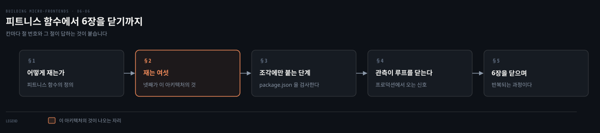
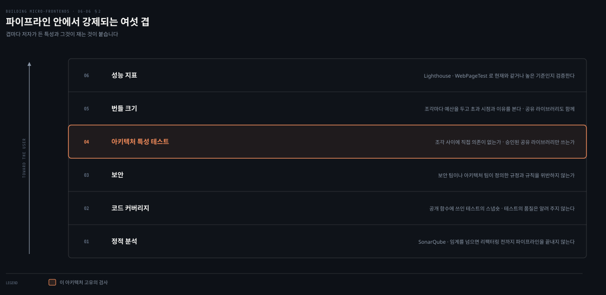
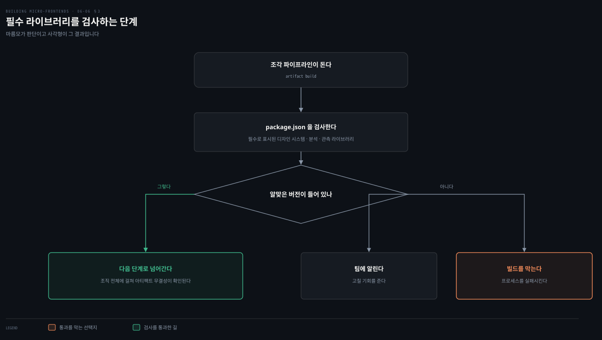
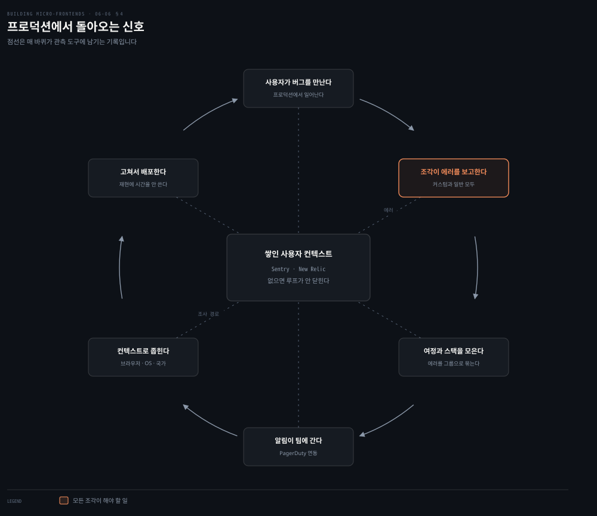

# 피트니스 함수와 관측 — 6장을 닫으며

---

> 앞 편까지가 기능이 제대로 도는지 보는 이야기였다면 이 편은 아키텍처가 제대로 서 있는지 보는 이야기입니다. 그리고 프로덕션에서 돌아오는 신호로 6장을 닫습니다.

## 핵심 요약

> 이 편이 매달린 문장은 **아키텍처 결정도 기능처럼 자동으로 검사될 수 있다**는 것입니다. 그 검사를 피트니스 함수라 부릅니다.
>
> 정의는 인용에서 옵니다. 피트니스 함수는 어떤 **아키텍처 특성에 대한 객관적인 무결성 평가**를 제공합니다.
>
> 재는 대상은 여섯입니다. 번들 크기와 성능 지표와 정적 분석과 아키텍처 특성 테스트와 코드 커버리지와 보안입니다.
>
> 넷째가 이 아키텍처의 핵심입니다. **조각 사이에 직접 의존이 없는지, 승인된 공유 라이브러리만 쓰는지**를 자동 검사로 굳힙니다.
>
> 조각에만 붙는 파이프라인 단계도 있습니다. 필수 라이브러리가 알맞은 버전으로 들어 있는지 `package.json`을 검사해 통과시키거나 빌드를 막습니다.
>
> 마지막이 관측입니다. **프로덕션에서 도는 코드가 피드백 루프를 닫는 자리**이며, 저자는 이것을 있으면 좋은 기능이 아니라 필수로 둡니다.

## 학습 목표

이 내용을 읽고 나면:

1. 피트니스 함수의 정의를 인용 그대로 재현하고 그것이 무엇을 위한 장치인지 설명할 수 있습니다.
2. 저자가 든 아키텍처 특성 여섯을 대고 각각이 무엇을 재는지 말할 수 있습니다.
3. 아키텍처 특성 테스트가 조각 사이에서 무엇을 검증하는지 구체적으로 짚을 수 있습니다.
4. 조각 파이프라인에만 붙는 추가 단계 둘을 재현할 수 있습니다.
5. 관측 도구가 수집하는 것과 그것이 디버깅 시간을 줄이는 이유를 말할 수 있습니다.

아래는 이 편이 지나는 네 자리를 읽는 순서로 이은 지도입니다. 각 칸의 절 번호가 본문에서 그것을 다루는 곳입니다.

## 1. 아키텍처 결정을 어떻게 재는가

> 여러 모듈이 한 플랫폼을 이루는 분산 시스템에서, 아키텍처 팀에게 남는 문제가 하나 있습니다.

### 풀려는 문제

분산 시스템에는 고유한 복잡도가 있습니다. 그래서 아키텍처 팀에게 필요한 것이 둘입니다.

- 자기들이 내린 **아키텍처 결정의 영향을 측정**할 방법
- 그 결정이 **모든 팀에게 지켜지는지** 확인할 방법

팀이 한자리에 모여 있든 흩어져 있든 이 필요는 같습니다. 문제는 아키텍처 결정이 코드처럼 컴파일되지 않는다는 데 있습니다. 지켜지지 않아도 곧바로 드러나지 않습니다.

### 인용된 정의

《Building Evolutionary Architecture》에서 Neal Ford와 Rebecca Parsons와 Patrick Kua가 CI 안에서 아키텍처 특성을 테스트하는 방법을 다룹니다. 세 사람이 피트니스 함수를 이렇게 정의합니다.

> 피트니스 함수는 **어떤 아키텍처 특성에 대한 객관적인 무결성 평가**를 제공합니다.

### 이미 하고 있던 일

저자가 곧바로 잇는 관찰이 있습니다. 자동화 파이프라인 안에 정의된 여러 단계가 **이미 아키텍처 특성을 평가하는 데 쓰이고** 있다는 것입니다.

- 순환 복잡도 형태의 **정적 분석**
- 조각 사례에서의 **번들 크기**

번들 크기를 평가하는 피트니스 함수는 언제 좋은 생각이 되는가도 적혀 있습니다. **사용자가 내려받는 데이터의 크기가 그 조각 아키텍처의 핵심 특성일 때**입니다.

그래서 아키텍처 팀이 자동화 전략 안에 피트니스 함수를 도입할 수 있습니다. 조각 애플리케이션이 가져야 할 **합의된 결과와 트레이드오프를 보장**하기 위해서입니다.

## 2. 재는 여섯

> 조각 프로젝트의 자동화 파이프라인을 설계할 때 주의할 아키텍처 특성으로 저자가 여섯을 듭니다.

### 풀려는 문제

여섯이 하나의 목적을 공유합니다. 아키텍트와 기술 리더가 **모든 팀을 쫓아다니거나 기능 개발에 끼지 않고도** 핵심 아키텍처 특성을 강제하는 것입니다.

### 여섯 가지

**번들 크기**가 첫째입니다. 조각마다 예산 크기를 배정하고 이 예산이 초과될 때와 그 이유를 분석합니다. 공유 라이브러리의 경우, 조각과 함께 빌드된 것만이 아니라 **공유되는 모든 라이브러리의 크기**를 함께 검토합니다.

**성능 지표**가 둘째입니다. Lighthouse와 WebPageTest 같은 도구가 애플리케이션의 새 버전이 현재 버전과 **같거나 더 높은 기준**을 갖는지 검증하게 해 줍니다.

**정적 분석**이 셋째입니다. 자바스크립트 생태계에 정적 분석 도구가 많고 SonarQube가 가장 널리 알려져 있습니다. 자동화 파이프라인 안에서 돌리면 프로젝트의 **순환 복잡도** 같은 통찰을 줍니다. 순환 복잡도 임계를 정해 두고 그것을 넘으면 **코드가 리팩터링될 때까지 파이프라인을 끝내지 않는 방식**으로 높은 코드 품질 기준을 강제할 수도 있습니다.

**아키텍처 특성 테스트**가 넷째입니다. 이 아키텍처에서 기능만 테스트하는 것으로는 충분하지 않습니다. 코드베이스가 진화하는 동안 **시스템의 구조적 경계와 아키텍처 결정이 지켜지는지** 보장하는 일이 그만큼 중요합니다.

이 테스트가 하는 일은 그 결정들을 CI 파이프라인의 **자동 검사로 성문화**하는 것입니다. 의도한 아키텍처와 구현이 맞는지에 대해 빠르고 객관적인 피드백을 줍니다. 구체적으로 검증할 수 있는 것이 이렇습니다.

- 조각 사이의 경계가 뚜렷하게 유지되는가. 예를 들어 **조각 사이에 직접 의존이 없는지**, 또는 **승인된 공유 라이브러리만 쓰이는지**
- 모듈성과 격리와 관심사 분리에 관한 아키텍처 규칙이 지켜지는가

이 접근이 막는 것이 셋입니다. 원치 않는 결합과 **아키텍처 표류**와 기술 부채이며, 팀이 커지거나 더 분산될수록 그렇습니다. 결국 아키텍트와 기술 리더가 **모든 풀 리퀘스트를 세세히 관리하지 않고도** 표준을 강제하고 시스템의 진화를 이끌게 해 줍니다.

**코드 커버리지**가 다섯째입니다. 코드베이스가 광범위하게 테스트되는지 확인합니다. 다만 저자가 한계를 함께 답니다. 이 지표는 **테스트의 품질을 알려 주지 않습니다.** 공개 함수에 대해 작성된 테스트의 스냅숏일 뿐입니다.

**보안**이 여섯째입니다. 코드가 보안 팀이나 아키텍처 팀이 정의한 규정이나 규칙을 위반하지 않게 합니다.

### 읽어내기 — 넷째가 이 아키텍처의 것이다

여섯 가운데 다섯은 어떤 프론트엔드 프로젝트에도 붙일 수 있습니다. 넷째만 다릅니다.

"조각 사이에 직접 의존이 없는지"는 앞 장들이 세운 정의를 그대로 검사로 옮긴 것입니다. 3장에서 양방향 공유가 계층을 평탄하게 만든다고 했고, 앞 편에서 모노레포가 조각을 결합해 독립 배포 가능성을 지울 수 있다고 했습니다. **그 경고들을 사람이 기억하는 대신 파이프라인이 기억하게 만드는 장치**가 아키텍처 특성 테스트입니다.

분산 아키텍처에서 이 지표들이 근본이 되는 이유도 여기 있습니다. 아키텍트와 기술 리더가 개발된 제품의 품질과 **기술 부채가 어디에 있는지**를 파악하는 통로가 됩니다.

## 3. 조각에만 붙는 파이프라인 단계

> 조각 파이프라인은 전통적인 프론트엔드 파이프라인보다 단계가 몇 개 더 필요할 수 있습니다.

### 풀려는 문제

첫째로 언급할 만한 것이 있습니다. 아키텍처 팀이 **모든 프론트엔드 아티팩트에 필수라고 표시한 라이브러리**를 각 조각이 실제로 통합하고 있는지 확인하는 일입니다.

### 필수 라이브러리 검사

디자인 시스템을 개발했고 모든 아티팩트가 최신 메이저 버전을 담기를 바란다고 해 보겠습니다. CI 파이프라인에 단계를 하나 둡니다.

`package.json` 파일을 검증해 디자인 시스템 라이브러리가 **알맞은 버전을 담고 있는지** 확인합니다. 그렇지 않으면 팀에 알리거나, 나아가 **빌드를 막고 프로세스를 실패**시킵니다.

같은 접근을 다른 내부 라이브러리에도 적용할 수 있습니다. 분석과 관측 연동이 그 예입니다. 저자가 이 단계를 권하는 근거가 조각의 성질입니다. **모듈로 나뉜 성질을 감안하면** 어떤 아키텍처 스타일을 고르든 이 추가 단계가 권장되며, 조직 전체에 걸쳐 아티팩트의 무결성을 보장합니다.

### 컴파일 시점 렌더

또 하나의 접근이 있습니다. 주로 **수직 분할 아키텍처에서** 쓸 수 있는데, 사용자가 페이지를 요청하는 런타임 대신 **컴파일 시점에 서버 사이드 렌더**를 수행하는 것입니다.

하는 이유가 둘입니다.

- 컴퓨팅 자원과 비용을 아낍니다. 자주 바뀌지 않는 데이터와 사용자 인터페이스를 합쳐야 할 때가 그 경우입니다.
- 인라인 CSS와 약간의 자바스크립트까지 담아 **고도로 최적화되고 빠르게 로드되는 페이지**를 제공합니다.

조각 아티팩트가 HTML 페이지를 진입점으로 하는 SPA로 만들어질 때 할 수 있는 일도 있습니다. 최소한의 CSS와 HTML 노드를 인라인한 **페이지 골격**을 생성해 페이지가 어떻게 보일지 암시하는 것입니다. 나머지 자원을 로드하는 동안 사용자에게 즉각적인 피드백을 줍니다.

저자가 여기에 단서를 답니다. 이것이 조직이 평가할 이유의 전부는 아닙니다. **조직마다 자기 함정과 요구가 다르기** 때문입니다. 다만 자동화 파이프라인을 설계할 때 생각해 볼 만한 접근이라고 적습니다.

## 4. 관측이 루프를 닫는다

> 6장의 마지막 조각입니다. 앞의 모든 검사는 배포 전의 이야기였습니다.

### 풀려는 문제

성공적인 조각 아키텍처에서 마지막으로 고려할 것이 조각의 관측 가능성입니다. 저자가 그 역할을 한 문장으로 못 박습니다.

**관측 가능성은 코드가 프로덕션 환경에서 돌 때 피드백 루프를 닫습니다.** 그렇지 않으면 한창 바쁜 시간대에 일어나는 사고에 빠르게 반응할 수 없습니다.

### 무엇을 수집하나

최근 몇 년 사이 프론트엔드 생태계에도 관측 도구가 여럿 등장했습니다. Sentry와 New Relic과 LogRocket이 그 예입니다. 이 도구들은 **사용자가 버그를 만나기 전의 여정을 식별**하게 해 줍니다. 그 버그가 사용자의 행동 완료를 막을 수도 있고 아닐 수도 있습니다.

모든 조각이 **커스텀 에러와 일반 에러를 함께 보고**해야 라이브 이슈가 생겼을 때 가시성이 생깁니다. 도구가 하는 일이 셋입니다.

- 사용자 여정을 회수합니다.
- 예외의 자바스크립트 **스택 트레이스**를 수집합니다.
- 에러를 그룹으로 **묶습니다.**

대시보드에서 에러나 경고 유형마다 알림을 설정할 수 있고, PagerDuty 같은 알림 시스템과 연동할 수도 있습니다.

### 왜 일찍 정해야 하나

저자가 시점을 강조합니다. 관측 가능성은 **과정의 이른 단계에서** 생각해 둬야 합니다. 개발자의 피드백 루프를 닫는 데 근본적인 역할을 하기 때문이며, **같은 뷰를 이루는 여러 조각을 다룰 때** 더 그렇습니다.

이 도구들이 주는 것이 디버깅의 출발점입니다. 코드베이스의 어느 부분이 영향을 받았는지 이해하게 해 주고, 브라우저와 운영체제와 국가 같은 **사용자 컨텍스트 정보**를 제공해 팀을 빠르게 해결로 이끕니다.

그 정보가 스택 트레이스와 결합되면 결과가 이렇습니다. 개발자가 **자기 기기나 테스트 환경에서 버그를 재현하려고 몇 시간을 쓰지 않고도** 문제를 풀 명확한 조사 경로를 얻습니다.

### 읽어내기 — 6장의 첫 문장으로 돌아온다

이 편의 도식이 원이 된 이유가 있습니다. 6장은 개발자에게 돌아가는 빠른 피드백에서 출발했습니다. 그 피드백의 마지막 구간이 프로덕션입니다.

배포 전 검사는 우리가 예상한 실패만 잡습니다. **예상하지 못한 실패는 사용자만 겪고, 관측 없이는 그 사실조차 늦게 알게 됩니다.** 저자가 관측을 있으면 좋은 기능이 아니라 릴리스 전략의 일부로 두라고 말하는 이유입니다.

## 5. 6장을 닫으며

> 저자가 직접 정리한 요약과, 다음 장으로 넘기는 문장입니다.

### 풀려는 문제

6장은 넓은 범위를 지났습니다. 자동화 원칙에서 출발해 개발자 경험과 버전 관리와 CI 전략과 테스트와 피트니스 함수와 관측까지 왔습니다. 저자가 그 흐름을 스스로 되짚습니다.

### 저자의 요약

먼저 자동화 파이프라인으로 이루려는 원칙을 정의했습니다. **빠른 피드백**과 기술과 회사의 진화에 따른 **상시 검토**에 초점을 두었습니다.

다음이 DX였습니다. 여기에 저자가 붙이는 인과가 날카롭습니다. 마찰 없는 경험을 제공하지 못하면 개발자가 **시스템을 우회하려 하거나 꼭 필요할 때만 쓰게** 되고, 잘 설계된 CI/CD 파이프라인의 이점이 줄어듭니다.

그다음이 자동화 전략의 구현이었습니다. 단위와 통합과 E2E 테스트, 번들 크기 검사, 피트니스 함수를 비롯한 모범 사례가 여기 들어갑니다. 이것들이 **개발자를 알맞은 소프트웨어 품질 수준으로 안내**합니다.

### 핵심 메시지

저자가 6장의 핵심을 한 문장으로 남깁니다.

> **자동화는 한 번의 행동이 아니라 제품의 생애 주기와 함께 검토되고 개선되어야 하는 반복적인 과정입니다.**

다룰 수 있었을 주제가 더 있지만, 이 관행들을 자동화 전략에 넣으면 좋은 상태에 있게 되며 사업과 기술의 필요에 따라 언제든 확장하고 진화시킬 수 있다고 덧붙입니다.

### 다음 장

다음 장에서 다룰 것을 저자가 예고합니다. **조각의 배포와 발견 가능성**입니다. 분산 시스템에서 여러 독립 팀이 하는 배포의 위험을 낮추는 또 하나의 핵심 측면입니다.

## 적용 관점

> 아래는 백엔드 개발자가 이미 가진 판단 기준과 이 절을 잇는 노트의 읽기입니다. 책이 백엔드 독자를 향해 쓴 대목이 아닙니다.

아키텍처 특성 테스트는 ArchUnit으로 하던 일과 같습니다. 계층 사이 의존 방향을 룰로 적어 두고 빌드에서 깨뜨리면 실패시키던 방식입니다. 저자가 "모든 풀 리퀘스트를 세세히 관리하지 않고도"라고 적은 대목이 그 도구를 쓰는 이유 그대로입니다. 리뷰어의 기억에 맡기면 규칙은 조용히 무너집니다.

조각 사이에 직접 의존이 없는지 검사한다는 항목은 패키지 사이 의존 룰과 같은 모양입니다. 다른 점은 검사 대상이 컴파일 타임 import만이 아니라는 것입니다. 런타임에 조각을 불러오는 구조라 빌드 산출물과 설정까지 봐야 합니다.

`package.json`의 필수 라이브러리 버전을 검사해 빌드를 막는 단계는 사내 BOM이나 부모 POM으로 버전을 고정하던 것과 목적이 같습니다. 저장소가 나뉘어 부모를 강제할 수 없을 때 파이프라인 검사가 그 자리를 대신합니다. 앞 편의 폴리레포 한계에서 "모범 사례가 모든 저장소에 도달하는 데 시간이 걸린다"고 했던 문제의 실무 답이기도 합니다.

관측이 루프를 닫는다는 진술은 APM을 붙이던 이유 그대로입니다. 프론트엔드가 다른 점은 실행 환경이 사용자 기기라는 것입니다. 브라우저와 운영체제와 국가를 함께 수집해야 재현이 가능해집니다. 서버 로그처럼 우리 손안의 환경에서 다시 돌려 볼 수가 없기 때문입니다.

## 면접 대비

Q: 피트니스 함수란 무엇인가요?

A: 《Building Evolutionary Architecture》에서 Neal Ford와 Rebecca Parsons와 Patrick Kua가 정의한 대로, 어떤 아키텍처 특성에 대한 객관적인 무결성 평가를 제공하는 검사입니다. 분산 시스템에서 아키텍처 팀이 자기 결정의 영향을 측정하고 그 결정이 모든 팀에게 지켜지는지 확인할 방법이 필요하기 때문에 씁니다. 파이프라인의 정적 분석이나 번들 크기 검사가 이미 이 역할을 하고 있습니다.

Q: 조각 프로젝트에서 재야 할 아키텍처 특성 여섯은 무엇인가요?

A: 번들 크기와 성능 지표와 정적 분석과 아키텍처 특성 테스트와 코드 커버리지와 보안입니다. 번들 크기는 조각마다 예산을 두고 초과 시점과 이유를 봅니다. 성능은 Lighthouse와 WebPageTest로 새 버전이 현재와 같거나 높은 기준인지 검증합니다. 정적 분석은 SonarQube 같은 도구로 순환 복잡도를 보고 임계를 넘으면 파이프라인을 막을 수 있습니다. 코드 커버리지는 테스트 품질이 아니라 스냅숏일 뿐이라는 한계가 함께 적혀 있습니다.

Q: 아키텍처 특성 테스트는 조각 사이에서 무엇을 검증하나요?

A: 조각 사이의 경계가 뚜렷하게 유지되는지입니다. 조각 사이에 직접 의존이 없는지, 승인된 공유 라이브러리만 쓰이는지가 구체적인 예입니다. 모듈성과 격리와 관심사 분리에 관한 규칙도 대상입니다. 이렇게 하면 원치 않는 결합과 아키텍처 표류와 기술 부채를 막고, 아키텍트가 모든 풀 리퀘스트를 세세히 관리하지 않고도 표준을 강제할 수 있습니다.

Q: 관측 도구는 무엇을 수집하고 그것이 왜 시간을 아끼나요?

A: 사용자 여정을 회수하고 예외의 자바스크립트 스택 트레이스를 수집하며 에러를 그룹으로 묶습니다. Sentry와 New Relic과 LogRocket이 예이고 PagerDuty 같은 알림 시스템과 연동할 수 있습니다. 브라우저와 운영체제와 국가 같은 사용자 컨텍스트가 스택 트레이스와 결합되면, 개발자가 자기 기기나 테스트 환경에서 버그를 재현하려고 몇 시간을 쓰지 않고도 조사 경로를 얻습니다.

### 요약 세 문장

1. 피트니스 함수는 아키텍처 특성에 대한 객관적 무결성 평가이며, 파이프라인이 사람의 기억을 대신해 결정을 강제합니다.
2. 여섯 특성 가운데 아키텍처 특성 테스트가 이 아키텍처의 것이며, 조각 사이의 직접 의존과 승인되지 않은 공유를 잡습니다.
3. 관측은 프로덕션에서 피드백 루프를 닫는 자리이고, 6장의 결론은 자동화가 한 번의 행동이 아니라 반복 과정이라는 것입니다.

## 핵심 개념 체크리스트

- [ ] 피트니스 함수의 정의를 인용 그대로 말할 수 있는가?
- [ ] 여섯 특성을 대고 각각이 무엇을 재는지 짝지을 수 있는가?
- [ ] 아키텍처 특성 테스트가 검증하는 두 예를 재현할 수 있는가?
- [ ] 코드 커버리지에 저자가 붙인 한계를 말할 수 있는가?
- [ ] 필수 라이브러리 검사 단계가 실패했을 때의 두 선택지를 댈 수 있는가?
- [ ] 컴파일 시점 렌더를 하는 두 이유를 구분할 수 있는가?
- [ ] 관측 도구가 하는 셋과 함께 수집하는 사용자 컨텍스트를 말할 수 있는가?

## 관련 문서

- [E2E 테스트 — 경계를 넘는 시나리오는 누구 것인가](06-05.E2E%20테스트%20—%20경계를%20넘는%20시나리오는%20누구%20것인가.md) — 기능을 테스트하던 앞 편
- [자동화 원칙 — 빠른 피드백이 먼저다](06-01.자동화%20원칙%20—%20빠른%20피드백이%20먼저다.md) — 6장이 출발한 자리이자 이 편의 루프가 닫히는 지점
- [Module Federation — 호스트와 리모트로 잇는다](03-05.Module%20Federation%20—%20호스트와%20리모트로%20잇는다.md) — 양방향 공유가 계층을 평탄하게 만든다고 경고한 자리
- [Building Micro-Frontends 정독 인덱스](README.md) — 다음 장인 배포와 발견 가능성의 진행 상태는 인덱스의 노트 표에서 봅니다

## 참고 자료

- 《Building Micro-Frontends, Second Edition》(Luca Mezzalira, O'Reilly, 2026) ISBN 978-1-098-17078-3
  - 다룬 범위: Fitness Functions · Micro-Frontend-Specific Operations · Observability · Summary
  - 이어서: 7장 Discover and Deploy Micro-Frontends
- 《Building Evolutionary Architecture》(Neal Ford, Rebecca Parsons, Patrick Kua) — 저자가 피트니스 함수의 정의를 인용한 책
- [Lighthouse](https://developer.chrome.com/docs/lighthouse/overview) — 저자가 성능 지표 검증 도구로 든 것
