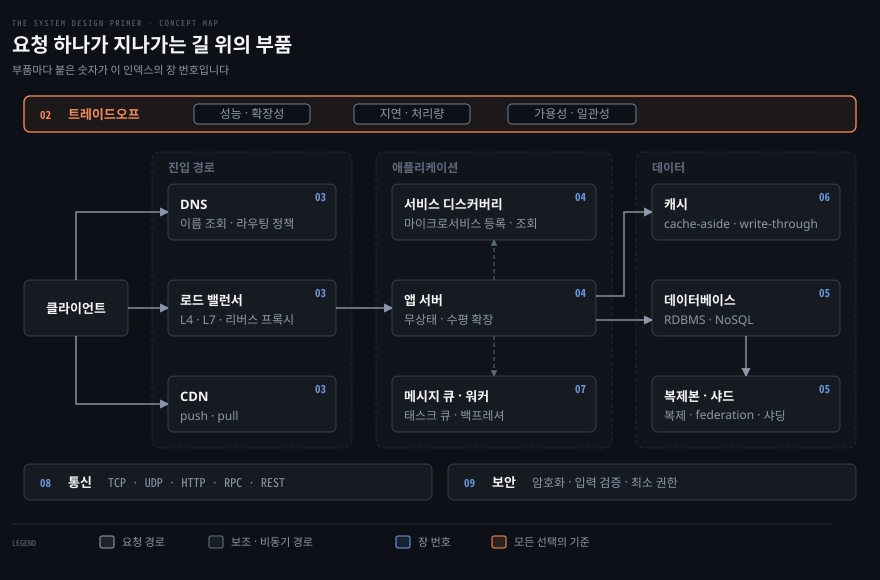
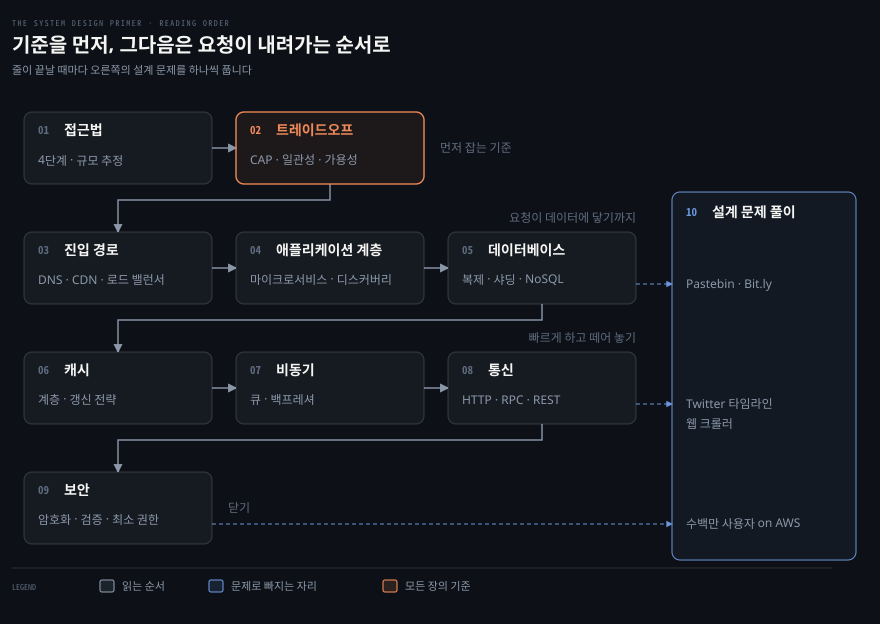

# The System Design Primer — 정독 인덱스
---

> Donne Martin 의 GitHub 저장소 [The System Design Primer](https://github.com/donnemartin/system-design-primer/blob/ae9bbd7b02d90b9866215de185217d33f39ab733/README.md) 를 장 단위로 따라 읽는 인덱스입니다. 대규모 시스템을 이루는 부품을 하나씩 배우고, 그 부품으로 설계 문제를 푸는 연습까지 갑니다.

## primer 가 가르치는 큰 그림 — 요청 하나가 지나가는 길 위의 부품

> 사용자 요청 하나가 클라이언트에서 데이터까지 가는 길에 부품이 차례로 놓입니다. primer 는 그 부품을 앞에서부터 하나씩 설명합니다.

서버 한 대로 시작한 서비스가 사용자 수백만 명을 받으려면 무엇을 덧붙여야 할까요? primer 는 이 질문에 답하려고 만든 오픈소스 학습 자료입니다. 여기저기 흩어진 확장성 자료를 한 문서로 모았으며 커뮤니티가 계속 고쳐 나갑니다. 시스템 설계 면접 준비를 겨냥해 만든 자료입니다. 그래도 부품 하나하나의 설명은 면접과 상관없이 백엔드 설계의 기초 어휘가 됩니다.

배우는 것은 세 갈래입니다.

- 설계 질문을 푸는 절차 (01장)
- 위 그림의 부품 각각과 그 부품을 재는 기준 (02~09장)
- 부품을 조립하는 연습 (10장)

부품 설명은 모두 같은 틀을 씁니다. 무엇인지 설명한 다음 종류를 나누고 단점을 따로 적습니다. 그래서 primer 를 끝까지 읽으면 부품의 목록뿐 아니라 부품마다 무엇을 대가로 치르는지가 같이 남습니다.

그림의 위아래 띠는 특정 부품이 아닌 장입니다. 02장 트레이드오프는 모든 부품의 장단점을 재는 기준이고, 08장 통신과 09장 보안은 부품 사이의 모든 화살표에 걸립니다. 출처는 커밋 `ae9bbd7` 로 고정했으며 장 구분은 이 커밋의 헤딩 순서를 주제별로 묶은 것입니다.

## 장별로 배우는 것 — 문제에서 해결로

> 장마다 어떤 문제가 생겨서 그 부품이 필요해지는지를 먼저 적고, primer 가 내놓는 해결을 키워드 표로 정리했습니다.

각 장 끝의 참고는 이 저장소의 다른 정독 노트에서 같은 주제를 다룬 편입니다. primer 는 설명이 짧은 편이라, 더 깊이 들어가고 싶을 때 여는 곁가지로 보면 됩니다. 나중에 이 폴더에 본문을 쓰면 다른 book 폴더처럼 `{장}-{절}.{제목}.md` 로 평면에 둡니다.

### 01장 · 접근법 — 막연한 설계 질문을 4단계와 어림셈으로 좁힌다

"트위터를 설계해 보라"는 질문에는 정답이 없고, 어디서부터 말해야 할지도 정해져 있지 않습니다. 요구사항을 확인하지 않고 그림부터 그리면 엉뚱한 시스템을 설계하게 됩니다.

primer 는 이 막연함을 네 단계로 자르고, 규모는 외워 둔 수치로 어림셈합니다. 어느 부품이 병목일지를 계산 전에 짐작하게 해 주는 것이 이 장의 수치 표입니다.

| 키워드 | 무엇인가 | 대가 · 쓰는 자리 |
|---|---|---|
| 유스케이스 · 제약 · 가정 | 1단계. 누가 무엇을 얼마나 쓰는지 질문으로 확정 | 건너뛰면 엉뚱한 시스템을 설계 |
| High level design | 2단계. 핵심 부품과 연결을 큰 그림으로 | 세부로 내려가기 전 합의용 |
| Core components | 3단계. 핵심 부품의 API · 스키마 · 알고리즘 설계 | 문제마다 깊이 들어갈 부품이 다름 |
| Scale the design | 4단계. 병목을 찾아 로드 밸런서 · 캐시 · 샤딩을 덧붙임 | 덧붙일 때마다 02장의 트레이드오프를 설명 |
| Back-of-the-envelope | QPS · 저장 용량 · 대역폭 어림셈 | 정밀도보다 자릿수 |
| Powers of two | 2^10 은 1 KB, 2^20 은 1 MB, 2^30 은 1 GB 로 이어지는 단위 표 | 용량 추정의 기본 단위 |
| Latency numbers | 메모리 참조 · SSD · 디스크 탐색 · 데이터센터 왕복 · 대륙 간 왕복의 자릿수 | 디스크와 네트워크가 메모리보다 몇 자릿수 느린지가 설계 방향을 정함 |

참고 문서

- [Alex Xu · 면접 4단계 프레임워크](../system-design/%EC%8B%9C%EC%8A%A4%ED%85%9C%20%EC%84%A4%EA%B3%84%20%EB%A9%B4%EC%A0%91%204%EB%8B%A8%EA%B3%84%20%ED%94%84%EB%A0%88%EC%9E%84%EC%9B%8C%ED%81%AC.md)
- [Alex Xu · 개략적 규모 추정](../system-design/%EA%B0%9C%EB%9E%B5%EC%A0%81%20%EA%B7%9C%EB%AA%A8%20%EC%B6%94%EC%A0%95.md)

### 02장 · 트레이드오프 — 다 가질 수 없을 때 무엇을 내줄지 정한다

시스템 설계에는 공짜가 없습니다. 한 사용자에게는 빠른데 부하가 몰리면 느려지는 시스템이 있고, 네트워크가 끊겼을 때 응답을 멈출지 낡은 값이라도 돌려줄지 골라야 하는 순간이 옵니다.

이 장은 그 선택지에 이름을 붙입니다. 뒤의 모든 장이 이 축 위에서 장단점을 따지므로 가장 먼저 잡아 둡니다.

| 키워드 | 무엇인가 | 대가 · 쓰는 자리 |
|---|---|---|
| Performance vs scalability | 성능 문제는 한 사용자에게도 느린 것, 확장성 문제는 부하가 몰릴 때만 느린 것 | 자원을 더한 만큼 성능이 늘면 확장 가능한 시스템 |
| Latency vs throughput | 지연은 작업 하나에 걸리는 시간, 처리량은 단위 시간당 작업 수 | 허용 가능한 지연 안에서 처리량을 최대로 |
| CAP theorem | 일관성 · 가용성 · 분할 내성 가운데 둘만 보장 | 네트워크는 끊기므로 실제 선택은 C 와 A 사이 |
| CP | 분할 시 응답을 포기하고 일관성을 지킴 | 원자적 읽기 · 쓰기가 필요한 업무 |
| AP | 분할 시 낡은 값이라도 응답 | 결과적 일관성을 허용하는 업무 |
| Weak consistency | 쓰기 뒤 읽기가 그 값을 볼 수도 못 볼 수도 있음 | memcached · VoIP · 실시간 게임 |
| Eventual consistency | 쓰기 뒤 읽기가 결국에는 그 값을 봄. 비동기 복제 | DNS · 메일. 고가용 시스템 |
| Strong consistency | 쓰기 뒤 읽기가 반드시 그 값을 봄. 동기 복제 | 파일 시스템 · RDBMS. 트랜잭션이 필요한 곳 |
| Active-passive fail-over | heartbeat 가 끊기면 대기 서버가 IP 를 넘겨받음 | hot · cold 대기에 따라 중단 시간이 갈림 |
| Active-active fail-over | 두 서버가 함께 트래픽을 받음 | DNS 나 애플리케이션이 두 서버를 모두 알아야 함 |
| Fail-over 의 대가 | 하드웨어와 복잡도 증가 | 복제 전에 active 가 죽으면 데이터 유실 |
| Availability in numbers | 99.9% 는 연 8시간 45분, 99.99% 는 연 52분 중단 | 나인 하나마다 허용 중단이 10분의 1 |
| 직렬 · 병렬 가용성 | 직렬은 곱, 병렬은 1 − (1 − A)(1 − B) | 99.9% 둘을 직렬로 이으면 99.8%, 병렬이면 99.9999% |

참고 문서

- [DDIA 02-02 성능](../../../05_data/book/designing-data-intensive-applications/02-02.%EC%84%B1%EB%8A%A5%20%E2%80%94%20%EC%9D%91%EB%8B%B5%20%EC%8B%9C%EA%B0%84%EA%B3%BC%20%EC%B2%98%EB%A6%AC%EB%9F%89.md)
- [DDIA 02-04 확장성](../../../05_data/book/designing-data-intensive-applications/02-04.%ED%99%95%EC%9E%A5%EC%84%B1.md)
- [DDIA 10-02 선형성의 비용과 CAP](../../../05_data/book/designing-data-intensive-applications/10-02.%EC%84%A0%ED%98%95%EC%84%B1%EC%9D%98%20%EB%B9%84%EC%9A%A9%EA%B3%BC%20CAP.md)
- [DDIA 06-02 노드 장애 처리](../../../05_data/book/designing-data-intensive-applications/06-02.%EB%85%B8%EB%93%9C%20%EC%9E%A5%EC%95%A0%20%EC%B2%98%EB%A6%AC%EC%99%80%20%EB%B3%B5%EC%A0%9C%20%EB%A1%9C%EA%B7%B8.md)

### 03장 · 진입 경로 — 서버 한 대에 몰리는 요청을 DNS·CDN·로드 밸런서로 나눈다

사용자가 늘면 서버 한 대가 모든 요청을 받을 수 없습니다. 먼 나라의 사용자는 이미지 하나를 받는 데도 대륙을 건너야 하고, 서버가 죽으면 서비스 전체가 멈춥니다.

요청이 앱 서버에 닿기 전에 거치는 부품 넷이 이 문제를 나눠 맡습니다. 부품마다 단점 절이 따로 있어서 대가도 같이 배웁니다.

| 키워드 | 무엇인가 | 대가 · 쓰는 자리 |
|---|---|---|
| DNS | 도메인 이름을 IP 로 바꾸는 계층형 조회. NS · MX · A · CNAME 레코드 | 하위 서버의 캐시가 TTL 동안 낡을 수 있음 |
| DNS 라우팅 정책 | weighted round robin · latency-based · geolocation-based | 조회 지연 추가, DDoS 의 표적 |
| CDN | 정적 콘텐츠를 사용자와 가까운 서버에서 제공 | 트래픽에 따라 비용이 커짐. URL 을 CDN 으로 바꿔야 함 |
| Push CDN | 서버에서 바뀔 때마다 CDN 에 직접 올림 | 트래픽이 적거나 자주 안 바뀌는 사이트 |
| Pull CDN | 첫 요청 때 원본에서 가져와 TTL 동안 캐시 | 트래픽이 많은 사이트. 첫 요청이 느림 |
| Load balancer | 요청을 여러 서버로 분산. random · least loaded · round robin · session | 자체가 단일 장애점이 되므로 이중화가 필요 |
| Layer 4 | 전송 계층의 IP · 포트만 보고 NAT 으로 전달 | 빠르지만 내용 기반 분기는 불가 |
| Layer 7 | 헤더 · 메시지 · 쿠키를 읽고 분기 | 유연하지만 연결을 종료하고 다시 여는 비용 |
| Horizontal scaling | 값싼 서버를 여러 대로 늘림 | 서버는 무상태여야 하고 세션은 DB 나 캐시로 |
| SSL termination | 앞단에서 복호화해 뒤 서버의 부담과 인증서 설치를 줄임 | 로드 밸런서와 리버스 프록시 공통 |
| Session persistence | 쿠키로 같은 클라이언트를 같은 서버로 | 무상태 설계가 안 된 앱을 위한 임시방편 |
| Reverse proxy | 내부 서비스를 하나의 공개 인터페이스 뒤에 숨기는 웹 서버. 압축 · 캐싱 · 정적 콘텐츠 제공 | 서버가 한 대여도 쓸모가 있다는 점이 로드 밸런서와 다름. 단일 장애점 |

참고 문서

- [cntd 02-03 DNS](../../../02_os/book/cntd_computer-networking-top-down/02-03.%EB%A9%94%EC%9D%BC%EA%B3%BC%20%EC%9D%B4%EB%A6%84%EC%9D%80%20%EC%96%B4%EB%96%BB%EA%B2%8C%20%EC%B0%BE%EC%95%84%EA%B0%80%EB%8A%94%EA%B0%80.md)
- [cntd 02-04 CDN](../../../02_os/book/cntd_computer-networking-top-down/02-04.%EC%98%81%EC%83%81%EC%9D%80%20%EC%96%B4%EB%96%BB%EA%B2%8C%20%EB%81%8A%EA%B8%B0%EC%A7%80%20%EC%95%8A%EB%8A%94%EA%B0%80.md)
- [Networking and Kubernetes 05-02 Service 5유형](../../../08_cloud/book/networking-and-kubernetes/05-02.Service%205%EC%9C%A0%ED%98%95%20%E2%80%94%20ClusterIP%EC%97%90%EC%84%9C%20LoadBalancer%EA%B9%8C%EC%A7%80.md)
- [Alex Xu · 0부터 수백만 사용자까지](../system-design/0%EB%B6%80%ED%84%B0%20%EC%88%98%EB%B0%B1%EB%A7%8C%20%EC%82%AC%EC%9A%A9%EC%9E%90%EA%B9%8C%EC%A7%80%20%ED%99%95%EC%9E%A5.md)

### 04장 · 애플리케이션 계층 — 웹 계층과 떼어 내 따로 키운다

웹 서버와 비즈니스 로직이 한 덩어리면 둘 중 하나만 바빠도 전체를 같이 늘려야 합니다. 기능 하나를 고치려 해도 전체를 다시 배포해야 합니다.

primer 는 웹 계층과 애플리케이션 계층을 떼어 각각 확장하는 구조를 보여 줍니다. 이 분리를 끝까지 밀면 마이크로서비스가 됩니다.

| 키워드 | 무엇인가 | 대가 · 쓰는 자리 |
|---|---|---|
| Application layer 분리 | 웹 서버와 애플리케이션 서버를 나눠 각각 확장 | 새 API 를 추가해도 웹 서버를 늘릴 필요가 없음 |
| Single responsibility | 작고 자율적인 서비스가 함께 동작 | 작은 팀이 독립적으로 계획하고 배포 |
| Worker | 애플리케이션 계층에서 비동기 작업을 맡는 프로세스 | 07장의 큐와 짝 |
| Microservices | 독립 배포되는 작은 서비스의 모음. 서비스마다 고유 프로세스와 경량 통신 | 배포 · 운영 · 아키텍처 복잡도 증가 |
| Service discovery | Consul · etcd · ZooKeeper 가 서비스 이름 · 주소 · 포트를 등록하고 조회 | health check 로 서비스 상태를 확인 |

참고 문서

- [Kubernetes Patterns 13-01 Service Discovery](../../../08_cloud/book/kubernetes-patterns/13-01.Service%20Discovery%20%E2%80%94%20%EA%B3%A0%EC%A0%95%20%EC%97%94%EB%93%9C%ED%8F%AC%EC%9D%B8%ED%8A%B8%EB%A1%9C%20%EB%8F%99%EC%A0%81%20Pod%EB%A5%BC%20%EC%B0%BE%EA%B8%B0.md)
- [Kubernetes Up and Running 07-01 Service Discovery](../../../08_cloud/book/kubernetes-up-and-running/07-01.Service%20Discovery%20%E2%80%94%20DNS%EA%B0%80%20%EB%AA%BB%20%ED%95%98%EB%8A%94%20%EC%9D%BC%EA%B3%BC%20%EB%B0%94%EA%B9%A5%EC%9D%84%20%EC%9E%87%EB%8A%94%20%EB%B2%95.md)

### 05장 · 데이터베이스 — 읽기는 복제로, 쓰기는 federation 과 샤딩으로 나눈다

앱 서버는 무상태로 만들면 몇 대든 늘릴 수 있지만 데이터베이스는 그렇게 되지 않습니다. 상태를 들고 있어서 복사본끼리 어긋날 수 있고, 데이터가 한 대의 디스크와 메모리를 넘어서는 날이 옵니다.

RDBMS 를 키우는 기법을 비용이 낮은 순서로 배우고, 그다음에 NoSQL 네 갈래와 선택 기준을 배웁니다.

| 키워드 | 무엇인가 | 대가 · 쓰는 자리 |
|---|---|---|
| ACID | 원자성 · 일관성 · 격리성 · 지속성 | RDBMS 트랜잭션의 네 속성 |
| Master-slave replication | master 가 읽기 · 쓰기, slave 는 읽기만 | master 가 죽으면 승격 로직이 필요 |
| Master-master replication | 두 master 가 모두 쓰기를 받고 서로 동기화 | 충돌 해소가 필요. 일관성이 느슨해지거나 쓰기 지연이 늘어남 |
| 복제의 대가 | 복제 전에 master 가 죽으면 유실 | 읽기 replica 가 늘수록 복제 지연과 쓰기 재생 부담 증가 |
| Federation | 기능별로 DB 를 가름. forums · users · products | DB 를 가로지르는 조인이 어려움. 거대한 테이블에는 효과 없음 |
| Sharding | 같은 테이블의 데이터를 여러 DB 에 나눔 | 쏠림과 리밸런싱. consistent hashing 으로 이동량을 줄임 |
| Denormalization | 쓰기를 희생해 읽기를 앞당김. 중복 사본으로 조인을 피함 | 중복 데이터의 일관성 유지 비용. 쓰기가 많으면 오히려 손해 |
| SQL tuning | 벤치마크와 프로파일링, 스키마 조정, 인덱스, 비싼 조인 회피, 파티션, 쿼리 캐시 | 한 대에서 뽑을 수 있는 만큼 먼저 뽑는 단계 |
| BASE | Basically available · Soft state · Eventual consistency | NoSQL 이 ACID 대신 고르는 속성. CAP 의 AP 쪽 |
| Key-value store | 해시 테이블 추상화. O(1) 읽기 · 쓰기 | Redis · memcached. 단순 모델과 캐시 계층 |
| Document store | 값이 문서인 key-value. 문서 내부 구조로 질의 | MongoDB · CouchDB. 자주 바뀌는 스키마 |
| Wide column store | column family 와 row key 로 묶은 중첩 맵 | Bigtable · HBase · Cassandra. 아주 큰 데이터셋 |
| Graph database | 노드와 관계가 1급. 다대다 관계에 최적 | Neo4j. 소셜 네트워크처럼 관계가 복잡한 모델 |
| SQL or NoSQL | 구조화된 데이터 · 조인 · 트랜잭션이면 SQL, 유연한 스키마 · 대용량 · 높은 처리량이면 NoSQL | 클릭스트림 로그 · 리더보드 · 장바구니 · hot 테이블이 NoSQL 에 맞는 예 |

참고 문서

- [DDIA 06-01 복제 개요와 단일 리더](../../../05_data/book/designing-data-intensive-applications/06-01.%EB%B3%B5%EC%A0%9C%20%EA%B0%9C%EC%9A%94%EC%99%80%20%EB%8B%A8%EC%9D%BC%20%EB%A6%AC%EB%8D%94.md)
- [DDIA 06-04 다중 리더 복제](../../../05_data/book/designing-data-intensive-applications/06-04.%EB%8B%A4%EC%A4%91%20%EB%A6%AC%EB%8D%94%20%EB%B3%B5%EC%A0%9C.md)
- [DDIA 07-01 샤딩 개요](../../../05_data/book/designing-data-intensive-applications/07-01.%EC%83%A4%EB%94%A9%20%EA%B0%9C%EC%9A%94%EC%99%80%20%ED%82%A4%20%EB%B2%94%EC%9C%84%20%EC%83%A4%EB%94%A9.md)
- [DDIA 03-02 정규화·비정규화·조인](../../../05_data/book/designing-data-intensive-applications/03-02.%EC%A0%95%EA%B7%9C%ED%99%94%C2%B7%EB%B9%84%EC%A0%95%EA%B7%9C%ED%99%94%C2%B7%EC%A1%B0%EC%9D%B8.md)
- [Alex Xu · 키-값 저장소 설계](../system-design/%ED%82%A4-%EA%B0%92%20%EC%A0%80%EC%9E%A5%EC%86%8C%20%EC%84%A4%EA%B3%84.md)

### 06장 · 캐시 — 같은 읽기를 반복하지 않고, 언제 갱신할지를 정한다

인기 있는 데이터는 같은 쿼리로 수없이 다시 읽힙니다. 그때마다 DB 까지 내려가면 DB 가 먼저 포화되고 응답도 느려집니다.

캐시는 어느 계층에나 둘 수 있습니다. 어려운 쪽은 넣는 일이 아니라 갱신하는 일이어서, primer 는 갱신 전략 넷을 코드와 함께 비교합니다.

| 키워드 | 무엇인가 | 대가 · 쓰는 자리 |
|---|---|---|
| Client · CDN · Web server caching | 브라우저, CDN, 리버스 프록시가 각자 응답을 캐시 | 요청이 앱 서버에 닿기 전에 끝남 |
| Database caching | DB 가 기본으로 가진 캐시 설정을 워크로드에 맞게 조정 | 기본 설정만으로는 부족할 수 있음 |
| Application caching | memcached · Redis 같은 인메모리 저장소를 앱과 DB 사이에 | RAM 이 한정되어 LRU 같은 제거 정책이 필요 |
| Query level 캐싱 | 쿼리를 해시한 키로 결과를 저장 | 셀 하나가 바뀌면 관련 쿼리를 모두 지워야 함 |
| Object level 캐싱 | 앱이 조립한 객체를 통째로 저장 | 바뀐 객체만 지우면 되고 비동기 조립도 가능 |
| Cache-aside | 앱이 캐시를 먼저 보고, 없으면 DB 에서 읽어 채움 | miss 때 세 번 왕복. TTL 없으면 낡은 값이 남음 |
| Write-through | 앱은 캐시에만 쓰고 캐시가 DB 에 동기로 기록 | 쓰기가 느림. 읽히지 않을 데이터도 캐시에 쌓임 |
| Write-behind | 캐시에 쓰고 DB 기록은 비동기로 | 캐시가 먼저 죽으면 유실. 구현이 가장 복잡 |
| Refresh-ahead | 최근 접근한 항목을 만료 전에 미리 갱신 | 예측이 빗나가면 안 쓰느니만 못함 |
| Cache invalidation | 캐시와 원본의 일관성을 맞추는 일 | 캐시 전체의 공통 대가 |

참고 문서

- [Alex Xu · 0부터 수백만 사용자까지 (캐시 절)](../system-design/0%EB%B6%80%ED%84%B0%20%EC%88%98%EB%B0%B1%EB%A7%8C%20%EC%82%AC%EC%9A%A9%EC%9E%90%EA%B9%8C%EC%A7%80%20%ED%99%95%EC%9E%A5.md)
- [Alex Xu · 뉴스 피드 시스템 설계 (5계층 캐시)](../system-design/%EB%89%B4%EC%8A%A4%20%ED%94%BC%EB%93%9C%20%EC%8B%9C%EC%8A%A4%ED%85%9C%20%EC%84%A4%EA%B3%84.md)

### 07장 · 비동기 — 오래 걸리는 일을 요청 경로에서 빼내고, 밀릴 때는 거절한다

이미지 변환이나 메일 발송처럼 오래 걸리는 일을 요청 안에서 처리하면 사용자가 그 시간을 그대로 기다립니다. 트래픽이 몰리는 순간에는 기다리는 요청이 쌓여 서버가 함께 쓰러집니다.

메시지 큐에 일을 넣고 바로 응답한 뒤 워커가 뒤에서 처리하는 구조를 배웁니다. 큐가 넘칠 때의 대처까지가 한 묶음입니다.

| 키워드 | 무엇인가 | 대가 · 쓰는 자리 |
|---|---|---|
| Message queue | 메시지를 받아 보관하고 전달. 앱이 작업을 넣고 워커가 꺼내 처리 | Redis 는 유실 가능, RabbitMQ 는 AMQP 와 노드 운영, SQS 는 지연과 중복 전달 |
| Task queue | 작업과 데이터를 받아 실행하고 결과를 전달. 스케줄링 지원 | Celery. 연산이 무거운 백그라운드 작업 |
| Back pressure | 큐 크기를 제한해 처리량과 응답 시간을 지킴 | 넘치는 요청에는 503. 클라이언트는 exponential backoff 로 재시도 |
| 미리 해 두기 | 비싼 계산을 요청 전에 주기적으로 끝내 둠 | 비동기의 또 다른 형태 |
| 비동기의 대가 | 큐가 지연과 복잡도를 더함 | 값싼 계산이나 실시간 흐름은 동기 처리가 나음 |

참고 문서

- [DDIA 12-01 메시지 브로커와 로그 기반 브로커](../../../05_data/book/designing-data-intensive-applications/12-01.%EC%8A%A4%ED%8A%B8%EB%A6%BC%20%EC%A0%84%EC%86%A1%20%E2%80%94%20%EB%A9%94%EC%8B%9C%EC%A7%80%20%EB%B8%8C%EB%A1%9C%EC%BB%A4%EC%99%80%20%EB%A1%9C%EA%B7%B8%20%EA%B8%B0%EB%B0%98%20%EB%B8%8C%EB%A1%9C%EC%BB%A4.md)
- [DDIA 02-02 성능 (과부하와 백프레셔)](../../../05_data/book/designing-data-intensive-applications/02-02.%EC%84%B1%EB%8A%A5%20%E2%80%94%20%EC%9D%91%EB%8B%B5%20%EC%8B%9C%EA%B0%84%EA%B3%BC%20%EC%B2%98%EB%A6%AC%EB%9F%89.md)
- [Alex Xu · 알림 시스템 설계](../system-design/%EC%95%8C%EB%A6%BC%20%EC%8B%9C%EC%8A%A4%ED%85%9C%20%EC%84%A4%EA%B3%84.md)

### 08장 · 통신 — 부품 사이를 무엇으로 이을지 고른다

부품을 나눌수록 부품 사이의 대화가 늘어납니다. 전송이 보장되어야 하는지, 지연이 더 중요한지, 외부에 공개할 API 인지에 따라 맞는 프로토콜이 달라집니다.

아래에서 위로 올라가며 배웁니다. 전송 계층의 두 프로토콜에서 시작해 HTTP 를 거쳐 서비스 사이 호출 방식 둘로 끝납니다.

| 키워드 | 무엇인가 | 대가 · 쓰는 자리 |
|---|---|---|
| HTTP | 요청 · 응답 방식의 응용 계층 프로토콜. verb 와 resource 로 구성 | TCP · UDP 위에서 동작 |
| Idempotent · safe · cacheable | GET · PUT · DELETE 는 멱등, POST · PATCH 는 아님 | 재시도해도 되는 요청인지가 여기서 갈림 |
| TCP | 연결 지향. handshake, 순서 번호, 확인 응답, 흐름 · 혼잡 제어 | 지연이 큼. 연결이 많으면 메모리 부담이라 connection pool 을 씀 |
| UDP | 비연결 데이터그램. 순서와 도착을 보장하지 않음 | VoIP · 화상 · 게임처럼 늦은 데이터가 쓸모없는 곳. DHCP |
| RPC | 원격 프로시저를 로컬 호출처럼 부름. Protobuf · Thrift · Avro | 클라이언트가 구현에 강하게 묶임. 내부 통신에서 성능을 위해 선택 |
| REST | 자원을 URI 로 식별하고 verb 로 조작하는 무상태 스타일. HATEOAS 포함 네 가지 성질 | 자원 계층에 안 맞는 동작은 표현이 어색함. 공개 API 에 흔함 |
| RPC vs REST | RPC 는 동작을, REST 는 데이터를 노출 | 같은 작업을 두 방식으로 적은 비교표가 실려 있음 |

참고 문서

- [cntd 02-02 HTTP](../../../02_os/book/cntd_computer-networking-top-down/02-02.%EC%9B%B9%EC%9D%80%20%EC%96%B4%EB%96%BB%EA%B2%8C%20%EC%A3%BC%EA%B3%A0%EB%B0%9B%EB%8A%94%EA%B0%80.md)
- [cntd 03-01 TCP 와 UDP](../../../02_os/book/cntd_computer-networking-top-down/03-01.%ED%8A%B8%EB%9E%9C%EC%8A%A4%ED%8F%AC%ED%8A%B8%EB%8A%94%20%EB%AC%B4%EC%97%87%EC%9D%84%20%EB%8D%94%ED%95%98%EB%8A%94%EA%B0%80.md)
- [DDIA 05-04 데이터플로우 · DB·REST·RPC](../../../05_data/book/designing-data-intensive-applications/05-04.%EB%8D%B0%EC%9D%B4%ED%84%B0%ED%94%8C%EB%A1%9C%EC%9A%B0%20%E2%80%94%20DB%C2%B7REST%C2%B7RPC.md)

### 09장 · 보안 — 설계 단계에서 빠뜨리지 않을 최소한의 네 가지

확장만 생각한 설계는 부품이 늘어난 만큼 공격면도 넓어집니다. 면접에서도 실무에서도 보안을 한 번도 언급하지 않은 설계는 미완성으로 읽힙니다.

primer 의 보안 절은 짧고, 저자도 보강이 필요하다고 적어 두었습니다. 그래도 기본 넷은 분명합니다.

| 키워드 | 무엇인가 | 대가 · 쓰는 자리 |
|---|---|---|
| Encrypt in transit and at rest | 전송 구간과 저장소 양쪽 암호화 | TLS 와 디스크 · 필드 암호화 |
| Input sanitization | 사용자에게 노출된 모든 입력을 검증 | XSS 와 SQL injection 방어 |
| Parameterized queries | 쿼리와 값을 분리해 전달 | SQL injection 의 직접 방어 |
| Least privilege | 일에 필요한 최소 권한만 부여 | 침해됐을 때의 피해 범위를 줄임 |

참고 문서

- [Container Security 14-01 OWASP Top 10](../../../08_cloud/book/container-security/14-01.%EC%BB%A8%ED%85%8C%EC%9D%B4%EB%84%88%EC%99%80%20OWASP%20Top%2010%20%E2%80%94%20%EC%9B%B9%20%EB%A6%AC%EC%8A%A4%ED%81%AC%EB%A5%BC%20%EC%BB%A8%ED%85%8C%EC%9D%B4%EB%84%88%20%EB%8C%80%EC%9D%91%EC%9C%BC%EB%A1%9C%20%EC%9E%87%EB%8B%A4.md)
- [Container Security 11-01 TLS](../../../08_cloud/book/container-security/11-01.TLS%EB%A1%9C%20%EC%BB%B4%ED%8F%AC%EB%84%8C%ED%8A%B8%20%EC%95%88%EC%A0%84%ED%95%98%EA%B2%8C%20%EC%97%B0%EA%B2%B0%ED%95%98%EA%B8%B0%20%E2%80%94%20%ED%82%A4%C2%B7%EC%9D%B8%EC%A6%9D%EC%84%9C%C2%B7CA%EC%9D%98%20%EC%97%AD%ED%95%A0.md)

### 10장 · 설계 문제 풀이 — 배운 부품을 4단계로 조립해 본다

부품을 하나씩 아는 것과 빈 화이트보드 앞에서 조립하는 것은 다른 능력입니다. 어느 부품을 언제 꺼낼지는 문제를 풀어 봐야 몸에 붙습니다.

시스템 설계 여덟 문제가 풀이와 함께 실려 있습니다. 풀이는 모두 01장의 4단계를 그대로 따르므로 같은 틀을 여덟 번 반복해 익히게 됩니다. 아래 표의 문제별 요점은 README 가 아니라 저장소의 `solutions/` 풀이 문서에서 가져온 것입니다.

| 키워드 | 무엇인가 | 대가 · 쓰는 자리 |
|---|---|---|
| Pastebin · Bit.ly | 짧은 URL 생성과 조회, 만료, 조회 통계 | 해시와 Base 62, 읽기 위주 캐시 |
| Twitter timeline and search | 홈 타임라인 fan-out 과 검색 | 쓰기 시점 fan-out 과 읽기 시점 조립 사이의 선택 |
| Web crawler | 링크 수집, 중복 제거, 역색인 생성 | 수집 대기열과 페이지 시그니처 |
| Mint.com | 계좌 연동과 거래 분류, 예산 알림 | 배치 집계와 비동기 처리 |
| Social network 자료구조 | 사용자 그래프에서 최단 경로 탐색 | 그래프가 여러 서버에 샤딩된 상태의 BFS |
| 검색엔진용 key-value store | 인기 질의 결과 캐시 | LRU 와 캐시 갱신 전략 |
| Amazon sales ranking | 카테고리별 판매 순위 집계 | 로그 기반 배치 집계 |
| Scaling on AWS | 한 대에서 수백만 사용자까지 단계적 확장 | 03~07장의 부품을 순서대로 덧붙이는 종합편 |
| Object-oriented design 문제 | hash map · LRU cache · call center · deck of cards · parking lot · chat server | 시스템이 아니라 클래스 설계 |
| Real world architectures | MapReduce · Bigtable · Dynamo · Kafka 등 논문과 회사별 아키텍처 글 | 부품이 실제로 조립된 모습을 읽는 목록 |

참고 문서

- [Alex Xu · URL 단축기 설계](../system-design/URL%20%EB%8B%A8%EC%B6%95%EA%B8%B0%20%EC%84%A4%EA%B3%84.md)
- [Alex Xu · 뉴스 피드 시스템 설계](../system-design/%EB%89%B4%EC%8A%A4%20%ED%94%BC%EB%93%9C%20%EC%8B%9C%EC%8A%A4%ED%85%9C%20%EC%84%A4%EA%B3%84.md)
- [Alex Xu · 웹 크롤러 설계](../system-design/%EC%9B%B9%20%ED%81%AC%EB%A1%A4%EB%9F%AC%20%EC%84%A4%EA%B3%84.md)
- [DDIA 02-01 사례 연구 · 홈 타임라인](../../../05_data/book/designing-data-intensive-applications/02-01.%EC%82%AC%EB%A1%80%20%EC%97%B0%EA%B5%AC%20%E2%80%94%20%EC%86%8C%EC%85%9C%20%EB%84%A4%ED%8A%B8%EC%9B%8C%ED%81%AC%20%ED%99%88%20%ED%83%80%EC%9E%84%EB%9D%BC%EC%9D%B8.md)

## 읽는 순서 — 기준을 먼저 잡고 요청이 내려가는 순서로

> 01장과 02장으로 기준을 잡은 뒤, 요청이 데이터에 닿는 순서로 내려가고 옆으로 넓힙니다. 줄이 끝날 때마다 10장의 문제를 하나씩 풉니다.

primer 가 권하는 순서도 같습니다. 트레이드오프를 먼저 읽고 DNS 부터 데이터베이스까지 요청 경로를 따라 내려갑니다. 이 순서로 읽으면 각 부품이 앞 부품의 어떤 한계 때문에 필요해지는지가 끊기지 않고 이어집니다.

10장을 맨 뒤로 미루지 않는 데에는 이유가 있습니다. 부품 설명만 이어 읽으면 목록으로만 남기 쉬워서, 쓸 수 있는 부품이 모인 시점마다 문제를 하나 풀어 조립해 봅니다. 05장까지 읽으면 Pastebin 을 풀 수 있고, 08장까지 읽으면 Twitter 타임라인과 웹 크롤러를 풀 수 있습니다. 문제를 어느 줄 뒤에 둘지는 제가 부품 의존 관계를 보고 정한 것이며 primer 가 지정한 것은 아닙니다.
