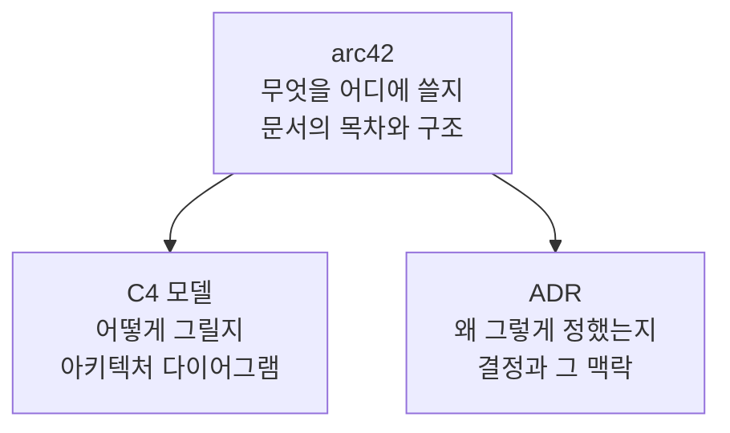

# 영상 요약 — 그림은 C4, 근거는 ADR, 구조는 arc42

---

> 아키텍처 문서를 어디서부터 써야 할지 막막할 때 기댈 수 있는 공개 기준 세 가지를 정리합니다. C4는 그림을, ADR은 결정의 근거를, arc42는 문서의 목차를 맡습니다. 셋은 경쟁하지 않고 각자 다른 빈칸을 메웁니다.

> 이 노트는 『The C4 Model』 정독을 시작하기 전에 자리를 잡아 둔 사전 노트입니다. 근거 자료가 책이 아니라 유튜브 영상 자막 한 편뿐입니다. 그마저 자동 생성 자막이라 고유명사가 심하게 깨져 있어 정정해 옮겼고, 정정표는 9절에 두었습니다. 영상이 사실처럼 말하지만 공식 문서로 확인하지 않은 주장은 본문에서 "영상은 ~라고 말합니다"로 적고 역시 9절에 검증 목록으로 모았습니다. 그래서 `status`를 `draft`로 둡니다.

## 1. 아키텍처 문서의 현실

> 문서가 아예 없거나, 있어도 읽히지 않거나, 시스템과 어긋난 채 남아 있는 세 상태로 갈립니다.

첫 번째는 문서 자체가 없는 경우입니다. 구조는 개발자들 머릿속에 있는데 밖으로 꺼내 놓은 것이 없습니다.

두 번째는 문서가 있어도 아무도 읽지 않는 경우입니다. 내용이 너무 단순해서 읽을 것이 없거나, 반대로 너무 장황해서 끝까지 읽히지 않습니다.

세 번째는 낡은 문서입니다. 한때 정확했지만 지금 돌아가는 시스템과 맞지 않아, 읽으면 오히려 잘못된 그림을 갖게 됩니다.

셋은 원인이 다릅니다. 첫 번째가 착수의 문제라면, 두 번째는 수준 조절의 문제이고, 세 번째는 갱신의 문제입니다. 뒤에서 볼 세 기준도 각각 겨냥하는 자리가 다릅니다.

## 2. AI 시대에 기록이 더 중요해진 이유

> 구현 속도가 빨라질수록 결정의 근거를 아는 사람이 줄어들기 때문입니다.

영상의 진단은 이렇습니다. AI로 구현 속도가 빨라질수록 시스템의 핵심 구조와 아키텍처적 결정의 근거를 아는 사람이 점점 줄어듭니다. 코드는 늘어나는데 그 코드가 왜 그 모양인지 아는 사람은 함께 늘지 않습니다.

핵심 문장은 하나입니다. 코드는 무엇을 만들었는지 설명하지만, 왜 그렇게 만들었는지는 설명하지 않습니다. 시간이 지나 시스템을 파악하거나 유지보수하거나 확장해야 할 때, 그 근거를 찾아볼 자리가 없습니다.

이 구분이 뒤의 세 기준을 가르는 축이기도 합니다. C4는 무엇을 만들었는지를 그림으로 보이고, ADR은 왜 그렇게 만들었는지를 글로 남깁니다.

## 3. 그림은 C4

> C4는 아키텍처 그림을 추상화 수준 네 단계로 나눠, 지도를 확대하듯 상세도를 높여 가라고 안내합니다.

네 레벨이 맡는 범위는 다음과 같습니다.

- **Level 1 System Context**: 시스템 하나를 덩어리로 두고 사용자·외부 시스템과의 관계를 그립니다.
- **Level 2 Container**: 그 덩어리를 배포 단위로 쪼갭니다. 애플리케이션과 데이터베이스, 메시지 브로커가 이 층에서 보입니다.
- **Level 3 Component**: 컨테이너 하나의 내부 구성요소를 그립니다.
- **Level 4 Code**: 클래스 수준의 구조를 그립니다.

영상은 공식 사이트가 이 단계를 지도에 빗대어 설명한다고 소개합니다. 추상화가 높은 곳에서 출발해 확대할수록 상세한 지도가 나오는 방식입니다.

실전 지침은 네 장을 다 그리라는 쪽이 아닙니다. 영상은 대부분의 시스템에서 Context와 Container 두 장이면 충분하다고 말합니다. Component와 Code는 필요할 때만 그리되, 손으로 그리지 말고 도구로 자동 생성하라고 덧붙입니다. 손으로 그린 하위 레벨 그림은 코드 변화를 따라가지 못해 곧 1절의 세 번째 상태, 즉 낡은 문서가 되기 때문입니다.

## 4. 근거는 ADR

> ADR은 설계 결정을 맥락과 함께 남겨, 나중에 같은 질문이 돌아왔을 때 근거를 재구성하게 합니다.

ADR은 Architecture Decision Record의 약자입니다. 영상은 상태·맥락·결정·결과 네 항목으로 결정 하나를 기록하는 템플릿을 제시하고, 왜 Kafka를 선택했는지를 그 형식으로 남긴 예시를 보여 줍니다.

이 저장소에는 ADR을 이미 다룬 문서가 있습니다. 기본 형식과 Spring Boot 프로젝트에서의 배치, 결정이 바뀌었을 때 이전 기록을 superseded 로 남기는 운영 방식까지 [01-04 ADR과 Spring Boot 아키텍처 의사결정](../../01_foundation/01-04.ADR%EA%B3%BC%20Spring%20Boot%20%EC%95%84%ED%82%A4%ED%85%8D%EC%B2%98%20%EC%9D%98%EC%82%AC%EA%B2%B0%EC%A0%95.md)이 다룹니다. 여기서 다시 설명하지 않고, 세 기준 안에서 ADR이 맡는 자리만 짚습니다.

ADR이 메우는 빈칸은 2절의 "왜"입니다. C4 그림은 결과물의 구조를 보여 주지만 그 구조를 고른 이유까지 담지는 못합니다. 이유가 사라지면 나중에 같은 논의를 처음부터 다시 하게 됩니다.

## 5. 구조는 arc42

> arc42는 아키텍처 문서의 목차 열두 개를 템플릿으로 제공합니다. 전부 채우는 것이 목적은 아닙니다.

arc42는 아키텍처 문서를 어떤 목차로 구성할지 막막할 때 참조하는 템플릿입니다. 열두 개 섹션으로 이루어져 있고, 섹션마다 무엇을 적어야 하는지 설명과 예시가 함께 붙습니다.

영상은 열두 개를 다 채울 필요가 없다는 점을 강조합니다. arc42의 FAQ 자체가 전체를 작성할 필요는 없고 시스템의 특성과 이해관계자의 상황을 보고 고르면 된다고 말한다는 것입니다. 다만 최소한으로 권장되는 다섯 개 정도는 두면 좋다고 안내한다고 덧붙입니다. 어느 다섯 개인지는 대본에 나오지 않아 이 노트에서도 특정하지 않습니다.

## 6. 세 기준은 경쟁하지 않습니다

> arc42가 목차를 잡고, 그 안에 C4의 그림과 ADR의 근거가 들어앉습니다.

셋은 서로를 대체하지 않습니다. 각자 다른 질문에 답하기 때문입니다.

- **arc42**: 무엇을 어디에 무슨 내용으로 남길지
- **C4 모델**: 아키텍처 다이어그램을 어떤 식으로 그릴지
- **ADR**: 설계 결정을 어떤 구조로 남길지

그래서 셋 중 하나를 고르는 문제가 아니라 조합하는 문제입니다. 문서의 뼈대는 arc42 목차가 잡습니다. 그림이 필요한 자리에는 C4 다이어그램이 들어가고 결정을 설명해야 하는 자리에는 ADR이 붙습니다.

## 7. 잘못 쓰면 이렇게 됩니다

> 세 기준을 완주해야 할 체크리스트로 읽으면 문서 작성 업무만 늘어납니다.

영상이 경계하는 오용은 세 가지입니다.

1. arc42의 열두 개 섹션을 빠짐없이 채우려 듭니다. 우리 시스템에 해당하지 않는 섹션까지 억지로 메우게 됩니다.
2. C4의 네 레벨을 모두 손으로 작도합니다. 하위 레벨일수록 코드 변화를 못 따라가 금방 낡습니다.
3. ADR을 결재 절차처럼 만듭니다. 결정 하나를 남기는 데 승인 단계가 붙으면 아무도 쓰지 않게 됩니다.

판별 기준은 한 문장으로 요약됩니다. 문서화 방법론을 도입했는데 문서 작성 업무만 늘었다면 잘못 도입한 것입니다. 세 기준은 채워야 할 양식이 아니라 막힐 때 꺼내 보는 참조 자료입니다.

## 8. 어디서 시작할까

> Context 다이어그램 한 장과 가벼운 ADR 한 건으로 시작하고, arc42는 정식 문서가 필요해질 때 필요한 섹션만 꺼냅니다.

영상이 제안하는 순서는 셋입니다.

1. C4의 Context 다이어그램을 한 장 그립니다. 시스템 하나와 그 바깥을 그리는 일이라, 가장 적은 노력으로 가장 큰 그림이 나옵니다.
2. 오늘 내린 설계 결정부터 ADR로 가볍게 남깁니다. 형식을 갖추는 것보다 결정과 맥락이 남는 쪽이 먼저입니다.
3. 아키텍처 문서를 정식으로 만들어야 할 때, arc42의 열두 개 섹션 중 우리 시스템에 필요한 것만 골라 씁니다.

한꺼번에 도입할 이유는 없습니다. 목표는 필요한 정보만 유지 가능한 수준으로 남기는 것이지, 복잡하고 화려한 문서를 만드는 것이 아닙니다.

## 9. 책 정독 때 대조할 것

> 이 노트는 영상 자막 한 편에만 기대고 있어, 아래 세 주장은 아직 1차 자료로 확인하지 않았습니다.

다음 세션에서 『The C4 Model』 정본을 읽을 때 쓸 체크리스트입니다. 영상이 사실처럼 말했지만 이번에 공식 문서로 확인하지 않은 항목만 모았습니다.

| # | 확인할 주장 | 확인할 1차 자료 |
|---|------------|----------------|
| 1 | arc42 FAQ가 최소 권장 섹션 다섯 개를 제시합니다. 어느 다섯 개인지는 대본에 없습니다 | arc42 공식 사이트 FAQ |
| 2 | C4 공식 사이트가 Component·Code 다이어그램은 도구로 자동 생성하라고 안내한다 | c4model.com |
| 3 | ADR 템플릿이 상태·맥락·결정·결과 네 항목이다 | Michael Nygard 원문, adr.github.io |

세 항목을 확인하고 나면 본문의 "영상은 ~라고 말합니다" 표현을 확인된 서술로 바꾸고 `status`를 올립니다.

### 자동 자막 오인식 정정표

원본 자막의 고유명사가 심하게 깨져 있어 아래와 같이 정정해 옮겼습니다. 원문을 다시 볼 때 참고합니다.

| 자막 표기 | 실제 |
|-----------|------|
| 시포 모델, 10 모델, 14 모델, C 모델 | C4 모델 |
| 아크2, 아크 42, 아크폴티 2 | arc42 |
| 점조 모델, 잠주해서 | 참조 모델, 참조해서 |
| 네피셜 | 뇌피셜 |
| 아키텍터적 | 아키텍처적 |

## 10. 관련 문서

- [01-04 ADR과 Spring Boot 아키텍처 의사결정](../../01_foundation/01-04.ADR%EA%B3%BC%20Spring%20Boot%20%EC%95%84%ED%82%A4%ED%85%8D%EC%B2%98%20%EC%9D%98%EC%82%AC%EA%B2%B0%EC%A0%95.md): ADR의 기본 형식과 Spring Boot 프로젝트에서의 배치
- [01-01 소프트웨어 아키텍처와 품질 속성](../../01_foundation/01-01.%EC%86%8C%ED%94%84%ED%8A%B8%EC%9B%A8%EC%96%B4%20%EC%95%84%ED%82%A4%ED%85%8D%EC%B2%98%EC%99%80%20%ED%92%88%EC%A7%88%20%EC%86%8D%EC%84%B1.md): 아키텍처가 지키는 제약과 품질 속성
- 원문 자막: `_src/` 폴더에 SRT 원본을 그대로 보관합니다.
