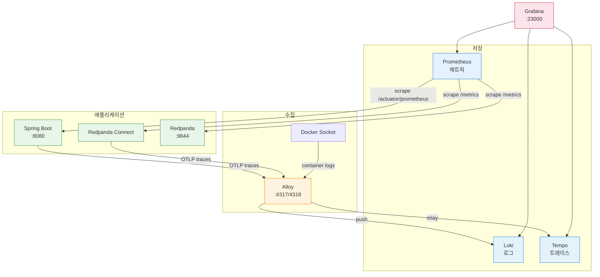

# 모니터링 가이드

---



| 서비스     | 포트                    | 메모리 | 역할                                   |
| ---------- | ----------------------- | ------ | -------------------------------------- |
| Grafana    | `localhost:23000`       | 256MB  | 대시보드 UI, 로그/트레이스/메트릭 탐색 |
| Loki       | 내부 3100               | 256MB  | 로그 저장/쿼리 (LogQL), 3일 보존       |
| Tempo      | 내부 3200               | 1GB    | 트레이스 저장/쿼리 (TraceQL), 3일 보존 |
| Alloy      | `localhost:24317-24318` | 192MB  | Docker 로그 수집 + OTLP 릴레이         |
| Prometheus | `localhost:29090`       | 256MB  | 메트릭 스크래핑, 15초 간격, 3일 보존   |

```yaml
# ============================================================================
# 모니터링 스택
# ============================================================================
# Grafana + Loki(Alloy) + Tempo + Prometheus
# 로그 수집, 분산 트레이싱, 메트릭 스크래핑을 통합한다.
#
# 사용법:
#   cd docker && docker compose -f docker-compose.monitoring.yml up -d
#
# 의존성:
#   playground-net 네트워크가 먼저 생성되어야 한다 (docker-compose.yml이 선행).
# ============================================================================

services:
  # --------------------------------------------------------------------------
  # Loki — 로그 저장소
  # --------------------------------------------------------------------------
  # Grafana Labs가 만든 로그 집계 시스템. Prometheus와 같은 라벨 기반 인덱싱을
  # 사용하여 로그 본문은 인덱싱하지 않고 라벨(container, job 등)만 인덱싱한다.
  # 이 덕분에 Elasticsearch 대비 스토리지/메모리를 크게 절약한다.
  #
  # 이 프로젝트에서의 역할:
  #   Alloy가 Docker 소켓으로 수집한 컨테이너 로그를 저장하고,
  #   Grafana에서 LogQL로 검색할 수 있게 한다.
  #
  # 쿼리 예시: {container="playground-connect"} |= "ERROR"
  # --------------------------------------------------------------------------
  loki:
    image: grafana/loki:3.4.2
    container_name: playground-loki
    command: -config.file=/etc/loki/config.yaml
    volumes:
      - ./monitoring/loki-config.yaml:/etc/loki/config.yaml:ro
      - loki-data:/loki                 # 로그 데이터 영속화
    healthcheck:
      test: ["CMD-SHELL", "wget -qO- http://localhost:3100/ready || exit 1"]
      interval: 10s
      timeout: 5s
      retries: 5
    deploy:
      resources:
        limits:
          memory: 256M

  # --------------------------------------------------------------------------
  # Tempo — 분산 트레이스 저장소
  # --------------------------------------------------------------------------
  # Grafana Labs가 만든 분산 트레이싱 백엔드. Jaeger/Zipkin과 같은 역할이지만
  # 오브젝트 스토리지(또는 로컬 파일시스템)에 트레이스를 저장하여 운영이 단순하다.
  # OTLP, Jaeger, Zipkin 프로토콜을 모두 수신할 수 있다.
  #
  # 이 프로젝트에서의 역할:
  #   Spring Boot(OTel Agent)와 Connect가 보낸 OTLP 트레이스를 저장하고,
  #   Grafana에서 TraceQL로 검색/워터폴 뷰를 제공한다.
  #
  # WAL(Write-Ahead Log): 수신된 트레이스를 먼저 WAL에 기록하고, 주기적으로
  # 블록으로 플러시한다. 재시작 시 WAL replay로 메모리를 많이 쓰므로 1GB 할당.
  # --------------------------------------------------------------------------
  tempo:
    image: grafana/tempo:2.7.1
    container_name: playground-tempo
    command: -config.file=/etc/tempo/config.yaml
    volumes:
      - ./monitoring/tempo-config.yaml:/etc/tempo/config.yaml:ro
      - tempo-data:/var/tempo            # WAL + 블록 데이터 영속화
    healthcheck:
      test: ["CMD-SHELL", "wget -qO- http://localhost:3200/ready || exit 1"]
      interval: 10s
      timeout: 5s
      retries: 5
    deploy:
      resources:
        limits:
          memory: 1G                     # 256MB/512MB에서 OOM 발생 → 1GB

  # --------------------------------------------------------------------------
  # Alloy — 통합 텔레메트리 수집기
  # --------------------------------------------------------------------------
  # Grafana Labs가 만든 OpenTelemetry Collector 기반 수집기.
  # 기존 Grafana Agent를 대체하며, 하나의 바이너리로 로그/트레이스/메트릭을
  # 수집·변환·전송할 수 있다. 설정은 HCL 유사 문법(.alloy 파일)을 사용한다.
  #
  # 이 프로젝트에서 Alloy가 하는 2가지 역할:
  #
  # 1) 로그 수집 (Docker Socket → Loki)
  #    Docker 소켓을 마운트하여 playground-* 컨테이너의 stdout/stderr를
  #    실시간 수집한다. Java 멀티라인 스택트레이스 조인도 처리한다.
  #    컨테이너가 파일 로깅을 지원하지 않아도 로그를 중앙 집중할 수 있는
  #    유일한 방법이다 (Connect 등은 stdout-only).
  #
  # 2) OTLP 릴레이 (애플리케이션 → Tempo)
  #    gRPC(:4317)와 HTTP(:4318)로 OTLP 트레이스를 수신하고,
  #    노이즈 스팬(outbox 폴링, DB 커넥션 체크, Prometheus 스크래핑)을
  #    필터링한 뒤 Tempo로 전달한다.
  #
  # 포트:
  #   24317 → 4317 (OTLP gRPC) — Spring Boot에서 트레이스 전송
  #   24318 → 4318 (OTLP HTTP) — Spring Boot/Connect에서 트레이스 전송
  #   24312 → 12345 (Alloy UI) — 파이프라인 상태 확인용 웹 UI
  # --------------------------------------------------------------------------
  alloy:
    image: grafana/alloy:v1.6.1
    container_name: playground-alloy
    command:
      - run
      - /etc/alloy/config.alloy
      - --server.http.listen-addr=0.0.0.0:12345
      - --stability.level=generally-available
    ports:
      - "${ALLOY_OTLP_GRPC_PORT:-24317}:4317"
      - "${ALLOY_OTLP_HTTP_PORT:-24318}:4318"
      - "${ALLOY_UI_PORT:-24312}:12345"
    volumes:
      - ./monitoring/alloy-config.alloy:/etc/alloy/config.alloy:ro
      - /var/run/docker.sock:/var/run/docker.sock:ro   # 컨테이너 로그 수집용
    depends_on:
      loki:
        condition: service_healthy
      tempo:
        condition: service_healthy
    deploy:
      resources:
        limits:
          memory: 192M

  # --------------------------------------------------------------------------
  # Prometheus — 메트릭 수집/저장
  # --------------------------------------------------------------------------
  # Pull 방식으로 타겟의 /metrics 엔드포인트를 주기적으로 스크래핑한다.
  # 시계열 데이터를 TSDB에 저장하고 PromQL로 쿼리한다.
  #
  # 스크래핑 대상 (prometheus.yml):
  #   - Spring Boot :8080/actuator/prometheus
  #   - Redpanda :9644/metrics
  #   - Connect :4195/metrics, :4198/metrics
  # --------------------------------------------------------------------------
  prometheus:
    image: prom/prometheus:v3.2.1
    container_name: playground-prometheus
    command:
      - --config.file=/etc/prometheus/prometheus.yml
      - --storage.tsdb.path=/prometheus
      - --storage.tsdb.retention.time=3d   # 3일 보존 (PoC용)
      - --web.enable-lifecycle             # /-/reload API 활성화
    ports:
      - "${PROMETHEUS_PORT:-29090}:9090"
    volumes:
      - ./monitoring/prometheus.yml:/etc/prometheus/prometheus.yml:ro
      - prometheus-data:/prometheus
    healthcheck:
      test: ["CMD-SHELL", "wget -qO- http://localhost:9090/-/ready || exit 1"]
      interval: 10s
      timeout: 5s
      retries: 5
    deploy:
      resources:
        limits:
          memory: 256M

  # --------------------------------------------------------------------------
  # Grafana — 통합 대시보드 UI
  # --------------------------------------------------------------------------
  # Loki(로그), Tempo(트레이스), Prometheus(메트릭)를 단일 UI에서 탐색한다.
  # 익명 Admin 접근 허용 (PoC용, 프로덕션에서는 인증 필수).
  #
  # provisioning으로 데이터소스 3개가 자동 등록된다.
  # 로그에서 traceId를 클릭하면 Tempo 트레이스로 점프하는 연결도 설정되어 있다.
  # --------------------------------------------------------------------------
  grafana:
    image: grafana/grafana:11.5.2
    container_name: playground-grafana
    ports:
      - "${GRAFANA_PORT:-23000}:3000"
    environment:
      GF_PATHS_PROVISIONING: /etc/grafana/provisioning
      GF_AUTH_ANONYMOUS_ENABLED: "true"          # PoC: 로그인 없이 접근
      GF_AUTH_ANONYMOUS_ORG_ROLE: Admin
      GF_AUTH_DISABLE_LOGIN_FORM: "true"
      GF_SERVER_ROOT_URL: "http://localhost:${GRAFANA_PORT:-23000}"
    volumes:
      - ./monitoring/grafana/provisioning:/etc/grafana/provisioning:ro
      - grafana-data:/var/lib/grafana
    depends_on:
      loki:
        condition: service_healthy
      tempo:
        condition: service_healthy
      prometheus:
        condition: service_healthy
    deploy:
      resources:
        limits:
          memory: 256M

volumes:
  loki-data:
  tempo-data:
  prometheus-data:
  grafana-data:

networks:
  default:
    name: playground-net
    external: true

```

## Loki - 로그 집계 시스템

Loki는 Grafana Labs가 만든 로그 집계 시스템입니다. "Prometheus처럼 동작하는 로그 시스템"이라고 불립니다. ELK와 동일한 역할을 하지만 설계 철학이 다릅니다. Loki는 ELK와 달리 라벨만 인덱싱하고 로그 본문은 압축 저장해서 `{container="playground-connect"}`처럼 라벨로 스트림을 선택한 뒤, 필요하면 `|= "ERROR"` 같은 필터로 본문을 순차 검색한다. 인덱스가 작아서 256MB 메모리로도 충분히 돌아간다.

Loki에 들어오는 로그의 라벨 구조 예시는 다음과 같다.

```bash
{container="playground-connect", compose_project="docker", compose_service="connect"}
{container="playground-redpanda", compose_project="docker", compose_service="redpanda"}
```

- Loki 자체는 로그를 수집하지 않습니다. 로그를 밀어넣어 주는 클라이언트(Alloy, Promtail)가 필요합니다.

### Loki와 `docker logs`의 차이

|               | `docker logs`                      | Loki (Grafana)                         |
| ------------- | ---------------------------------- | -------------------------------------- |
| 검색          | `grep`으로 텍스트 매칭             | LogQL로 라벨+패턴 필터링               |
| 시간 범위     | `--since`/`--until` 수준           | 초 단위 정밀 시간 범위                 |
| 여러 컨테이너 | 컨테이너마다 개별 실행             | `{container=~"playground.*"}`로 한번에 |
| 트레이스 연결 | 불가                               | traceId 클릭 → Tempo 점프              |
| 보존          | Docker 재시작 시 소멸 가능         | 3일 보존 (설정 가능)                   |
| 호스트 파일   | macOS Docker Desktop에서 접근 불가 | Grafana 웹 UI로 접근                   |


## Alloy - 통합 텔레메트리 수집기

Alloy는 Grafana Labs가 만든 OpenTelemetry Collector 기반의 통합 수집기다. 기존 Grafana Agent(promtail, agent 등 여러 바이너리)를 하나로 통합한 것이다.

```yaml
# --------------------------------------------------------------------------
# Alloy — 통합 텔레메트리 수집기
# --------------------------------------------------------------------------
# Grafana Labs가 만든 OpenTelemetry Collector 기반 수집기.
# 기존 Grafana Agent를 대체하며, 하나의 바이너리로 로그/트레이스/메트릭을
# 수집·변환·전송할 수 있다. 설정은 HCL 유사 문법(.alloy 파일)을 사용한다.
#
# 이 프로젝트에서 Alloy가 하는 2가지 역할:
#
# 1) 로그 수집 (Docker Socket → Loki)
#    Docker 소켓을 마운트하여 playground-* 컨테이너의 stdout/stderr를
#    실시간 수집한다. Java 멀티라인 스택트레이스 조인도 처리한다.
#    컨테이너가 파일 로깅을 지원하지 않아도 로그를 중앙 집중할 수 있는
#    유일한 방법이다 (Connect 등은 stdout-only).
#
# 2) OTLP 릴레이 (애플리케이션 → Tempo)
#    gRPC(:4317)와 HTTP(:4318)로 OTLP 트레이스를 수신하고,
#    노이즈 스팬(outbox 폴링, DB 커넥션 체크, Prometheus 스크래핑)을
#    필터링한 뒤 Tempo로 전달한다.
#
# 포트:
#   24317 → 4317 (OTLP gRPC) — Spring Boot에서 트레이스 전송
#   24318 → 4318 (OTLP HTTP) — Spring Boot/Connect에서 트레이스 전송
#   24312 → 12345 (Alloy UI) — 파이프라인 상태 확인용 웹 UI
# --------------------------------------------------------------------------
alloy:
  image: grafana/alloy:v1.6.1
  container_name: playground-alloy
  command:
    - run
    - /etc/alloy/config.alloy
    - --server.http.listen-addr=0.0.0.0:12345
    - --stability.level=generally-available
  ports:
    - "${ALLOY_OTLP_GRPC_PORT:-24317}:4317"
    - "${ALLOY_OTLP_HTTP_PORT:-24318}:4318"
    - "${ALLOY_UI_PORT:-24312}:12345"
  volumes:
    - ./monitoring/alloy-config.alloy:/etc/alloy/config.alloy:ro
    - /var/run/docker.sock:/var/run/docker.sock:ro   # 컨테이너 로그 수집용
  depends_on:
    loki:
      condition: service_healthy
    tempo:
      condition: service_healthy
  deploy:
    resources:
      limits:
        memory: 192M
```

### 왜 Alloy를 쓰는가? 

- Docker 컨테이너는 stdout/stderr로만 로그를 출력한다. Redpanda Connect처럼 파일 로깅 옵션이 없는 애플리케이션도 많다. 
- Alloy가 Docker 소켓(`/var/run/docker.sock`)을 마운트하여 모든 컨테이너의 stdout을 실시간으로 읽고 Loki에 전송한다. 이것이 Docker 환경에서 로그를 중앙 수집하는 표준적인 방법이다.

Alloy는 이 프로젝트에서 2가지 역할을 한다.

```bash
[Docker Socket] → discovery.docker → loki.source.docker → loki.process → loki.write → [Loki]
[OTLP 수신]    → otelcol.receiver.otlp → otelcol.processor.filter → otelcol.exporter.otlphttp → [Tempo]
```

1. **로그 수집**: Docker 소켓 → playground-* 컨테이너 로그 수집 → Loki 전송
2. **OTLP 릴레이**: Spring Boot/Connect가 보낸 트레이스를 수신 → 노이즈 필터링 → Tempo 전송

# 데이터 흐름별 설정

---

## 로그(Deploy -> Alloy -> Loki)

Alloy가 Docker 소켓(`/var/run/docker.sock`)을 통해 `playground-*` 컨테이너의 로그를 자동 수집하여 Loki로 전송한다. 별도 설정 없이 컨테이너가 기동되면 로그가 쌓인다.

```groovy
// ============================================================================
// Grafana Alloy - 통합 수집기 예제
// ============================================================================
// 이 설정은 크게 2가지 역할을 한다.
// 1. Docker 컨테이너 로그를 읽어서 Loki로 보낸다.
// 2. OTLP 트레이스를 받아서 Tempo로 보낸다.
// ============================================================================


// ----------------------------------------------------------------------------
// 1) Docker 로그 수집 대상 찾기
// ----------------------------------------------------------------------------
// discovery.docker:
// Docker 소켓에 연결해서 "어떤 컨테이너들이 있는지" 찾는 컴포넌트
discovery.docker "containers" {
  // Docker Engine API에 붙기 위한 소켓 경로
  host = "unix:///var/run/docker.sock"
}


// ----------------------------------------------------------------------------
// 2) 찾은 컨테이너 중 필요한 것만 필터링
// ----------------------------------------------------------------------------
// discovery.relabel:
// 찾은 대상(targets)에 대해 필터링/라벨 추가/라벨 변경을 수행
discovery.relabel "playground_only" {
  // 입력값:
  // discovery.docker "containers"가 찾은 컨테이너 목록을 그대로 받는다.
  targets = discovery.docker.containers.targets

  rule {
    // Docker 메타데이터 중 컨테이너 이름을 본다.
    source_labels = ["__meta_docker_container_name"]

    // 이름이 /playground- 로 시작하는 컨테이너만 유지
    // 예: /playground-api, /playground-db
    regex = "/playground-.*"

    // keep = 조건에 맞는 것만 남김
    action = "keep"
  }

  rule {
    // GitLab 컨테이너는 로그량이 너무 많아서 별도로 제외
    source_labels = ["__meta_docker_container_name"]
    regex         = "/playground-gitlab"
    action        = "drop"
  }

  rule {
    // 정규식 /(.*)/ 으로 전체 이름을 캡처해서
    source_labels = ["__meta_docker_container_name"]
    regex         = "/(.*)"

    // container 라벨에 저장
    // 결과적으로 container="playground-api" 같은 라벨이 생긴다.
    target_label = "container"
  }
}


// ----------------------------------------------------------------------------
// 3) Docker 로그 실제 수집
// ----------------------------------------------------------------------------
// loki.source.docker:
// 위에서 필터링한 컨테이너들의 로그를 Docker 소켓에서 읽는다.
loki.source.docker "containers" {
  host = "unix:///var/run/docker.sock"

  // 어떤 컨테이너 로그를 읽을지 지정
  targets = discovery.relabel.playground_only.output

  // 읽은 로그를 다음 단계(loki.process.multiline)로 전달
  forward_to = [loki.process.multiline.receiver]
}


// ----------------------------------------------------------------------------
// 4) 멀티라인 로그 처리
// ----------------------------------------------------------------------------
// loki.process:
// 로그 라인을 가공하는 단계
loki.process "multiline" {
  stage.multiline {
    // 새 로그 이벤트의 시작 줄 패턴
    // 이 패턴과 맞지 않는 다음 줄들은 이전 로그에 붙는다.
    //
    // 예:
    // 2026-03-11 ...          -> 새 로그 시작
    // [main] INFO ...         -> 새 로그 시작
    // ts=...                  -> 새 로그 시작
    // level=info ...          -> 새 로그 시작
    //
    // 따라서 Java stacktrace의
    //   at ...
    //   Caused by: ...
    // 같은 줄들은 이전 로그에 합쳐진다.
    firstline = "^\\d{4}-\\d{2}-\\d{2}|^\\[|^ts=|^level="

    // 다음 줄을 기다리는 최대 시간
    // 3초 동안 새 firstline이 안 오면 현재 멀티라인 로그를 확정
    max_wait_time = "3s"

    // 한 이벤트로 합칠 최대 줄 수
    max_lines = 128
  }

  // 가공이 끝난 로그를 Loki writer로 전달
  forward_to = [loki.write.default.receiver]
}


// ----------------------------------------------------------------------------
// 5) Loki로 로그 전송
// ----------------------------------------------------------------------------
// loki.write:
// 최종적으로 Loki HTTP API로 로그를 보낸다.
loki.write "default" {
  endpoint {
    // Loki push API 주소
    url = "http://loki:3100/loki/api/v1/push"
  }
}


// ----------------------------------------------------------------------------
// 6) OTLP 트레이스 수신
// ----------------------------------------------------------------------------
// otelcol.receiver.otlp:
// OpenTelemetry OTLP 데이터를 받는 리시버
otelcol.receiver.otlp "default" {
  grpc {
    // OTLP gRPC 포트
    endpoint = "0.0.0.0:4317"
  }

  http {
    // OTLP HTTP 포트
    endpoint = "0.0.0.0:4318"
  }

  output {
    // 받은 traces를 다음 필터 프로세서로 전달
    traces = [otelcol.processor.filter.noise.input]
  }
}


// ----------------------------------------------------------------------------
// 7) 불필요한 span 제거
// ----------------------------------------------------------------------------
// otelcol.processor.filter:
// 특정 조건의 span을 드롭해서 트레이스 노이즈를 줄임
otelcol.processor.filter "noise" {
  // 조건식 오류가 있어도 파이프라인 전체를 죽이지 않고 무시
  error_mode = "ignore"

  traces {
    // span 배열:
    // 아래 조건 중 하나라도 맞으면 해당 span을 필터링한다.
    span = [
      // outbox_event SELECT 쿼리 span 제거
      "IsMatch(name, \"SELECT playground.outbox_event.*\")",

      // outbox_event UPDATE 쿼리 span 제거
      "IsMatch(name, \"UPDATE playground.outbox_event.*\")",

      // 이름이 playground 인 span 제거
      // 보통 DB 커넥션/풀 관련 노이즈성 span을 의도
      "name == \"playground\"",

      // Prometheus scrape 요청 span 제거
      "name == \"GET /actuator/prometheus\"",
    ]
  }

  output {
    // 필터 후 남은 traces를 Tempo exporter로 전달
    traces = [otelcol.exporter.otlphttp.tempo.input]
  }
}


// ----------------------------------------------------------------------------
// 8) Tempo로 트레이스 전송
// ----------------------------------------------------------------------------
// otelcol.exporter.otlphttp:
// OTLP/HTTP 방식으로 Tempo에 트레이스를 보낸다.
otelcol.exporter.otlphttp "tempo" {
  client {
    // Tempo OTLP HTTP endpoint
    endpoint = "http://tempo:4318"
  }
}
```

// Alloy 입문 치트시트  //  // 1. 기본 형태  //    컴포넌트종류 "이름" { 설정 }  //  // 2. 예시  //    discovery.docker "containers" { host = "unix:///var/run/docker.sock" }  //  // 3. "종류"는 역할이다.  //    discovery.* = 대상 찾기  //    loki.* = 로그 처리  //    otelcol.* = OpenTelemetry 데이터 처리  //  // 4. "이름"은 내가 붙이는 식별자다.  //    같은 종류 컴포넌트를 여러 개 만들 때 구분용으로 쓴다.  //  // 5. key = value 로 설정한다.  //    문자열은 "..." , 리스트는 [ ... ] 형태를 쓴다.  //  // 6. 하위블록으로 세부 설정을 묶는다.  //    endpoint { url = "..." }  //    grpc { endpoint = "0.0.0.0:4317" }  //  // 7. 다른 컴포넌트 결과를 참조할 수 있다.  //    targets = discovery.docker.containers.targets  //  // 8. 파이프라인처럼 연결한다.  //    forward_to = [loki.process.multiline.receiver]  //  // 9. OTel 계열은 output 블록에서 신호별로 연결한다.  //    output { traces = [otelcol.processor.filter.noise.input] }  //  // 10. rule / stage 같은 반복 블록으로  //     필터 규칙이나 처리 단계를 여러 개 선언할 수 있다.

