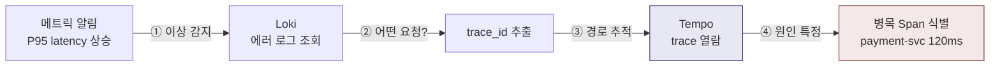
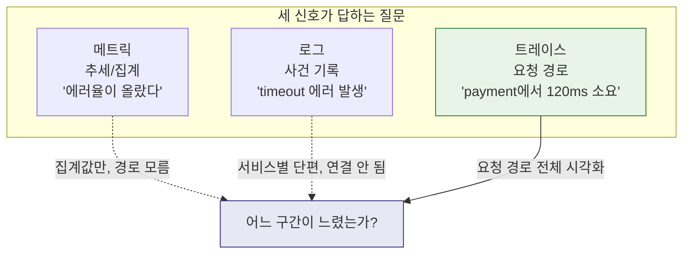
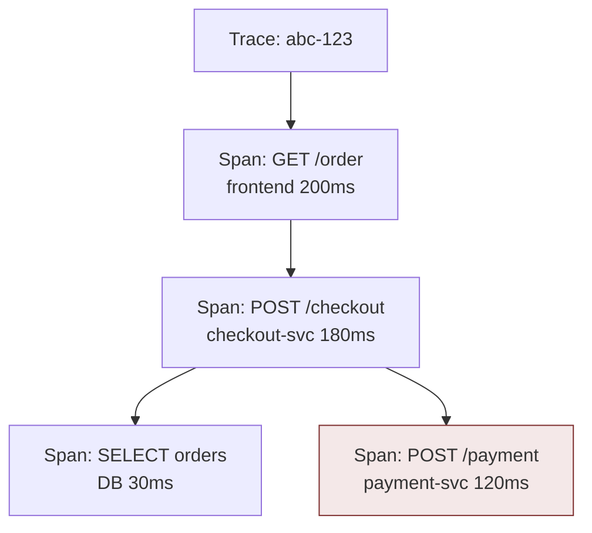
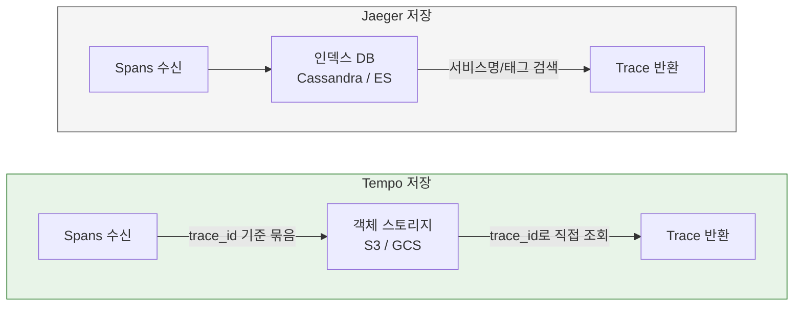
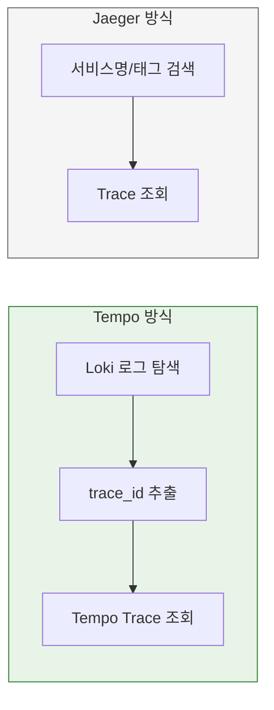

# Grafana Tempo

---

> Grafana Tempo는 분산 트레이스 저장 및 조회 백엔드다. 애플리케이션이 생성한 span들을 trace 단위로 저장하고, 운영자가 요청 흐름을 따라가며 병목과 에러의 원인을 분석할 수 있게 한다.

Tempo의 핵심 설계 철학은 한 문장이다. "trace 검색을 trace 백엔드 혼자 책임지지 않고, Observability 스택 전체가 협력한다."

- Jaeger 같은 전통적 trace 백엔드는 span 속성을 자체 인덱싱해서 독립적으로 검색을 지원한다.
- Tempo는 이 접근이 아닌 "**로그나 메트릭에서 trace_id를 찾아 Tempo로 건너가는**" 탐색 흐름을 전제한다. 인덱싱을 하지 않으므로 저장 비용이 낮고 운영이 단순하지만 LGTM 스택을 안 쓰게 되면 탐색이 제한적이다.

## LGMT 스택에서 Tempo



주문 서비스가 느려졌다고 가정해보자.

- 메트릭: P95 latency가 200ms에서 2s로 상승했다는 알람이 온다.
- 로그: Loki에서 해당 시간대의 에러를 조회하면 "payment-svc timeout" 로그가 보인다.
- 트레이스: 로그에서 trace_id를 클릭해 Tempo에서 열면, payment-svc 외부 API 호출이 전체 요청 시간의 70%를 차지한다.

메트릭이 "어딘가 이상하다"를 알려주고, 로그가 "무슨 일인지"를 설명하고, 트레이스가 "정확히 어디서"를 보여주는 구조다.

## 로그와 메트릭만으로는 부족한 순간

메트릭은 추세를 보여 준다. "지난 5분간 에러율이 3%에서 15% 올랐다"는 사실은 메트릭이 잘 알려준다. 로그는 사건을 기록하고 "checkout 서비스에서 timeout 에러가 발생했다"는 사실은 로그가 잘 알려준다.

그런데 분산 시스템에서 진짜 어려운 질문은 이것들이다.

- 어느 서비스 호출이 느렸는가?
- 전체 요청 시간 중 DB 쿼리가 얼마를 차지했는가?
- 어디서 retry가 반복되었는가?
- 에러가 발생한 서비스는 어디이고, 그 에러를 유발한 upstream은 어디인가?

이 질문에 답하려면 **하나의 요청이 여러 서비스를 거치면서 남긴 흔적**을 이어 붙여야 한다. 메트릭은 집계된 숫자이므로 개별 요청 경로를 보여 주지 못하고, 로그는 서비스별로 흩어져 있으므로 하나의 요청 흐름으로 엮기 어렵다.



## 핵심 개념(Span, Trace, Attributes)

### Span

Span은 하나의 작업 단위를 표현한다. HTTP 요청 처리 / DB 쿼리 실행 / 외부 API 호출 같은 개별 동작이 각각 하나의 span이 된다.

모든 Span에는 시작 시간, 종료 시간, 상태(OK/ERROR), 부모 spanID가 포함된다. 부모-자식 관계가 있기 때문에 "이 HTTP 요청 안에서 어떤 DB 쿼리가 실행됐고 얼마나 걸렸는가"를 정확히 추적할 수 있다.

### Trace

Trace는 하나의 요청이 여러 서비스를 거치면서 만들어진 span들의 집합이다. 모든 span이 같은 `trace_id`를 공유하므로, 분산된 서비스들의 동작을 하나의 요청 흐름으로 묶어 볼 수 있다.



### Attributes

Span에 붙는 키-값 속성이다. 속성이 풍부할수록 탐색이 쉬워진다.

| 종류     | 예시                                            | 용도                    |
| -------- | ----------------------------------------------- | ----------------------- |
| HTTP     | `http.method`, `http.status_code`, `http.route` | 요청 종류와 결과 필터링 |
| DB       | `db.system`, `db.statement`                     | 느린 쿼리 식별          |
| Resource | `service.name`, `deployment.environment`        | 서비스/환경별 필터      |

## 내부 구조

### 저장 전략(인덱싱 없는 trace 저장)

Tempo가 Jaeger와 결정적으로 다른 점은 span 속성을 인덱싱하지 않는다는 것이다.



- Jaeger는 카산드라/엘라스틱서치에 span을 저장하면서 서비스명, 태그, 시간 등을 인덱싱한다. 덕분에 "checkout 서비스에 최근 에러 trace 조회"와 같은 독립적 검색이 가능하지만, 인덱스 유지 비용이 크다.
- Tempo는 trace를 객체 스토리지에 저장한다. 인덱스 없이 trace_id를 키로 조회하는 방식이며 인덱싱 비용이 없으므로 저장 단가가 낮고, 객체 스토리지의 내구성과 확장성을 그대로 활용할 수 있다.

### TraceQL(인덱스 없이도 탐색하는 방법)

"인덱스가 없으면 trace_id를 모를 때 어떻게 찾는가?"에 대한 질문에 대해서 Tempo 2.0부터 GA로 제공되는 **TraceQL**이 이 문제를 해결한다.

```bash
# HTTP 500 에러 발생 및 1초 이상 걸린 trace 조회
{ span.http.status_code >= 500 && duration > 1s }

# checkout 서비스에서 postgreSQL 쿼리가 200ms이상 걸린 경우
{ resource.service.name = "checkout" && span.db.system = "postgresql" && duration > 200ms }
```

## Jaeger와의 비교

| 항목        | Jaeger                         | Tempo                          |
| ----------- | ------------------------------ | ------------------------------ |
| 인덱싱      | span 속성을 인덱싱             | 인덱싱 없이 trace_id + TraceQL |
| 저장소      | Cassandra, Elasticsearch 등    | 객체 스토리지 (S3, GCS)        |
| 운영 복잡도 | 인덱스 DB 관리 필요            | 객체 스토리지만으로 운영       |
| 독립 검색   | 서비스명/태그로 바로 검색 가능 | Loki/메트릭 연동 탐색 전제     |
| UI          | Jaeger UI (독립)               | Grafana Explore 내장           |
| 비용        | 인덱스 + 저장소 비용           | 객체 스토리지 비용만           |



- Jaeger의 강점은 독립적 검색이다. trace 백엔드만으로도 서비스명이나 태그로 trace를 찾을 수 있다. 대신 그만큼 인덱스 DB 운영이 필요해 비용이 크다.
- Tempo의 강점은 비용과 단순함이다. 객체 스토리지에 trace를 던져 놓기만 하면 되므로 운영 부담이 적다. 대신 Loki와 같이 사용되지 않으면 탐색 경험이 제한된다.

## Tempo 2.10 업데이트 (2026년 3월)

v2.10.3 기준(2026-03-17 릴리스)의 주요 변경 사항이다.

- **Parquet 기본 스토리지**: 열 지향(columnar) 포맷으로 TraceQL 쿼리 성능이 향상된다. 특정 span 속성만 읽을 수 있어 I/O가 줄어든다.
- **Microservices 모드가 프로덕션 기본값**: Distributor, Ingester, Querier, Compactor, Query Frontend를 독립적으로 스케일링할 수 있다.
- **OTel 기반 수신 계층**: Distributor가 OTel Collector의 receiver 레이어를 내장하여 OTLP, Jaeger, Zipkin 프로토콜을 동시에 수신한다.
- **OpenTelemetry 업스트림 기여**: Tempo의 eBPF 계측 코드가 OTel 프로젝트에 기증되었다.

## 배포 모드 비교

| 모드 | 구성 | 적합한 환경 | Helm 차트 |
|------|------|------------|----------|
| Monolithic | 단일 Pod | 개발/테스트, 소규모 | `grafana/tempo` |
| Distributed | 컴포넌트별 Deployment | 프로덕션 | `grafana/tempo-distributed` |

Monolithic 모드는 단일 바이너리로 Distributor, Ingester, Querier, Compactor를 모두 실행한다. 학습과 소규모 환경에 적합하다.

Distributed 모드는 각 컴포넌트를 독립 Deployment로 분리한다. 컴포넌트별 리소스 할당과 replica 수를 독립적으로 조정할 수 있으므로 프로덕션 환경에 권장된다.

각 컴포넌트의 역할은 다음과 같다:

- **Distributor**: span을 수신하고 trace_id 해싱으로 Ingester에 라우팅한다.
- **Ingester**: span을 Parquet 블록으로 구성하여 Object Storage에 플러시한다.
- **Querier**: Object Storage와 Ingester에서 트레이스를 조회한다.
- **Compactor**: 블록을 병합하고 중복을 제거하며 retention을 적용한다.
- **Query Frontend**: 쿼리를 분할(sharding)하고 병렬 처리를 조율한다.

## K8s Helm 배포

Monolithic 모드는 학습과 개발 환경에 적합하다. 단일 Helm 차트로 빠르게 배포할 수 있다:

```bash
helm repo add grafana https://grafana.github.io/helm-charts
helm install tempo grafana/tempo -n monitoring --create-namespace
```

Distributed 모드는 프로덕션 환경에 권장된다:

```bash
helm install tempo grafana/tempo-distributed -n monitoring --create-namespace
```

Monolithic 모드에서 로컬 스토리지를 사용하는 주요 `values.yaml` 설정이다:

```yaml
tempo:
  storage:
    trace:
      backend: local
      local:
        path: /var/tempo/traces
  receivers:
    otlp:
      protocols:
        grpc:
          endpoint: "0.0.0.0:4317"
        http:
          endpoint: "0.0.0.0:4318"
  metrics_generator:
    enabled: true
    storage:
      path: /var/tempo/wal
    remote_write:
      - url: http://mimir:9009/api/v1/push  # Service Graph + Span Metrics → Mimir
persistence:
  enabled: true
  size: 10Gi
```

Distributed 모드에서 S3/MinIO를 사용하는 주요 `values.yaml` 설정이다:

```yaml
storage:
  trace:
    backend: s3
    s3:
      bucket: tempo-traces
      endpoint: minio.monitoring.svc:9000
      access_key: minioadmin
      secret_key: minioadmin
      insecure: true
distributor:
  replicas: 2
ingester:
  replicas: 3
querier:
  replicas: 2
```

배포 후 정상 동작을 검증하는 방법은 다음과 같다:

```bash
kubectl port-forward svc/tempo 3200:3200 -n monitoring
curl http://localhost:3200/ready
# 응답: ready

# 또는 Grafana에서 Tempo data source 추가 후 Explore에서 TraceQL 실행
```

## Service Graph와 Span Metrics

Tempo는 수신한 트레이스에서 두 가지 Prometheus 메트릭을 자동 생성한다.

**Service Graph 메트릭**은 서비스 간 호출 관계를 메트릭으로 표현한다. Grafana의 Node Graph 패널에서 서비스 토폴로지를 시각화할 수 있다:

- `traces_service_graph_request_total`: 서비스 간 요청 수
- `traces_service_graph_request_failed_total`: 실패한 요청 수
- `traces_service_graph_request_server_seconds`: 서버 측 응답 시간

**Span Metrics**는 개별 span 속성을 기반으로 집계 메트릭을 생성한다:

- `traces_spanmetrics_latency`: span 지속 시간 히스토그램
- `traces_spanmetrics_calls_total`: span 수

이 메트릭들은 `metrics_generator`가 생성하여 Prometheus/Mimir로 `remote_write`한다. Grafana에서 메트릭 대시보드와 트레이스를 Exemplar로 연결할 수 있다.

## Docker 참고

Docker로 Tempo를 실행할 때는 로컬 파일시스템에 저장하므로 Object Storage 없이도 동작한다:

```bash
docker run -v ./tempo-config.yaml:/etc/tempo/config.yaml \
  -p 3200:3200 -p 4317:4317 -p 4318:4318 \
  grafana/tempo -config.file=/etc/tempo/config.yaml
```

K8s와의 차이점은 로컬 파일시스템 저장, Object Storage 없이 동작, 단일 인스턴스라는 점이다. Docker Compose 환경은 `01-1. 모니터링.md`를 참조한다.
