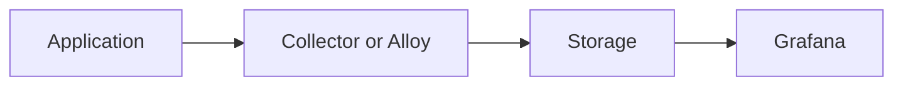
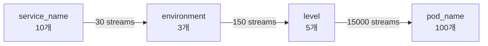
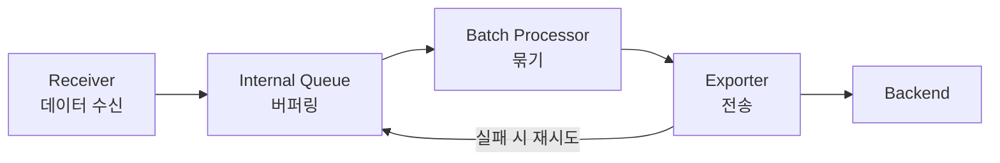

# Operations and Troubleshooting

---

> Observability 장애는 종종 "Grafana에 안 보인다"로 보고됩니다. 하지만 이것은 증상일 뿐 원인이 아닙니다.
>
> 원인은 크게 네 계층 중 하나에 있습니다.
>
> 1. **Application**: 신호를 아예 안 보냄
> 2. **Collection**: Alloy나 collector가 못 받거나 버림
> 3. **Storage**: Loki나 Tempo가 적재 실패
> 4. **Visualization**: Grafana 데이터소스나 탐색 설정 문제

## 로그가 안 보일 때 체크리스트

### Step 1. 애플리케이션 로그가 실제로 발생했는가

- 컨테이너 stdout/stderr에 로그가 있는가
- 애플리케이션 로그 레벨이 너무 높게 설정되지 않았는가

### Step 2. 수집기가 로그를 받았는가

- Alloy 또는 collector receiver 상태 확인
- ingest volume이 정상인가
- drop/filter 규칙이 과도하지 않은가

### Step 3. Loki 적재가 성공했는가

- exporter 에러가 없는가
- auth, tenant, endpoint 설정이 맞는가
- 라벨 폭발로 인한 처리 문제는 없는가

### Step 4. Grafana에서 조회 축이 맞는가

- 시간 범위가 맞는가
- 서비스명 라벨이 실제 값과 일치하는가
- datasource가 올바른가

## 트레이스가 안 보일 때 체크리스트

### Step 1. trace가 생성되는가

- SDK instrumentation이 적용되어 있는가
- 샘플링이 0%가 아닌가

### Step 2. OTLP export가 되는가

- endpoint가 맞는가
- `4317` 또는 `4318` 연결이 되는가

### Step 3. collector나 Alloy에서 드롭되는가

- tail sampling 정책이 너무 공격적인가
- batch queue가 가득 차지 않았는가

### Step 4. Tempo 적재가 성공하는가

- exporter 실패율
- backend 상태
- tenant나 auth 설정

## 비용이 갑자기 늘 때 의심할 것

비용 급증의 근본 원인은 대부분 "데이터 볼륨"이 아니라 "인덱스 또는 처리 복잡도"에 있습니다.

### Loki 비용 증가

Loki 비용의 핵심 변수는 **스트림 수**입니다. 라벨 조합 하나가 스트림 하나를 만들기 때문에, 라벨이 하나 추가될 때마다 스트림 수가 곱으로 늘어날 수 있습니다.

- 위 예시에서 `pod_name`을 라벨로 올리는 순간 스트림 수가 150에서 15,000으로 100배 증가합니다. `request_id`나 `user_id`를 라벨로 넣으면 이보다 훨씬 심각해집니다.

- **진단**: Loki의 `/loki/api/v1/series` 엔드포인트로 활성 스트림 수를 확인합니다.

### Tempo 비용 증가

Tempo 비용은 **저장되는 span 수**에 비례합니다. 샘플링률이 올라가거나, 앱 내부에서 불필요한 span을 과다 생성하면 저장량이 급증합니다. 예를 들어 루프 안에서 매 반복마다 span을 만들거나, 헬스체크 요청마다 trace를 생성하면 비용이 빠르게 늘어납니다.

- **진단**: Collector의 `otelcol_exporter_sent_spans` 메트릭으로 초당 span export 수를 모니터링합니다.

### Alloy 비용 증가

Alloy 자체의 CPU/메모리 비용은 파이프라인 복잡도에 비례합니다. 같은 데이터를 여러 목적지로 복제(fan-out)하거나, 복잡한 relabel/transform 규칙을 적용하면 리소스 사용이 늘어납니다.

## 백프레셔와 큐를 보는 이유

Collector는 단순 중계기가 아니라 **버퍼가 있는 처리 파이프라인**입니다. 이 구조를 이해하지 않으면 "앱은 보냈는데 데이터가 없다"는 상황을 진단할 수 없습니다.

### Collector 내부 흐름

정상 상태에서는 데이터가 receiver → queue → batch → exporter → backend로 흘러갑니다. 하지만 backend가 느려지거나 네트워크가 불안정하면 exporter가 실패하고, 재시도가 쌓이면서 queue가 차오릅니다.

### Queue가 가득 차면 무슨 일이 생기나

Queue 용량을 초과하면 **새로 들어오는 데이터가 드롭**됩니다. 이것이 백프레셔(backpressure)입니다. 앱 입장에서는 정상적으로 export했지만, collector 내부에서 데이터가 사라지는 것입니다.

| 상태 | receiver | queue   | exporter  | 결과                 |
| ---- | -------- | ------- | --------- | -------------------- |
| 정상 | 수신 중  | 여유    | 성공      | 데이터 정상 전달     |
| 지연 | 수신 중  | 차오름  | 재시도 중 | 일시 지연, 복구 가능 |
| 포화 | 수신 중  | 가득 참 | 실패      | **데이터 드롭**      |

### 모니터링 포인트

운영자는 다음 메트릭을 지속적으로 확인해야 합니다.

- **`otelcol_receiver_accepted_spans`**: receiver가 실제로 받은 span 수
- **`otelcol_exporter_send_failed_spans`**: exporter 전송 실패 수
- **`otelcol_exporter_queue_size`**: 현재 queue에 대기 중인 데이터
- **`otelcol_processor_dropped_spans`**: processor에서 드롭된 span 수