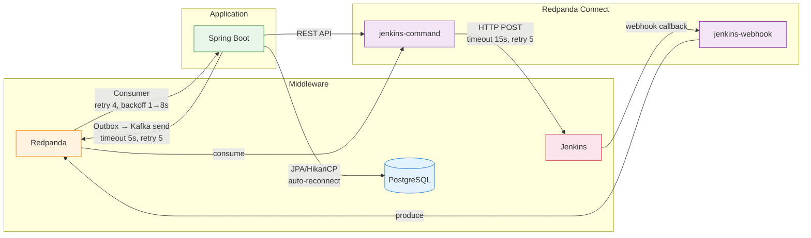

# 장애 시나리오와 복구 절차

---

> 이 문서는 Redpanda Playground의 **Application ↔ Redpanda ↔ Connect ↔ Middleware** 통신 경로에서 발생할 수 있는 장애 시나리오와 복구 절차를 다룬다.

### 타임아웃/재시도 요약

| 컴포넌트                          | 소스                                            | 타임아웃        | 재시도                | 백오프           | 실패 시 동작         |
| --------------------------------- | ----------------------------------------------- | --------------- | --------------------- | ---------------- | -------------------- |
| OutboxPoller                      | `app/.../outbox/OutboxPoller.java`              | 5s (Kafka send) | 5회                   | increment count  | DEAD 마킹            |
| PipelineEventConsumer             | `app/.../event/PipelineEventConsumer.java`      | -               | 4회 (@RetryableTopic) | 1s→2s→4s→8s      | DLT (-dlt)           |
| KafkaErrorConfig                  | `common-kafka/.../config/KafkaErrorConfig.java` | -               | 3회 (7s total)        | 1s→2s→4s         | DLQ (Topics.DLQ)     |
| WebhookEventConsumer              | `app/.../webhook/WebhookEventConsumer.java`     | -               | 4회                   | 1s→2s→4s→8s      | DLT, null fallback   |
| JenkinsAdapter                    | `app/.../adapter/JenkinsAdapter.java`           | ~30s (default)  | 0                     | -                | null 반환            |
| ConnectStreamsClient              | `app/.../client/ConnectStreamsClient.java`      | default         | 0                     | -                | false 반환           |
| ConnectorRestoreListener          | `app/.../service/ConnectorRestoreListener.java` | -               | 5회                   | 2s→4s→8s→16s→32s | ERROR 로그 후 포기   |
| WebhookTimeoutChecker             | `app/.../engine/WebhookTimeoutChecker.java`     | 5분             | -                     | 30s 폴링         | FAILED + SAGA 보상   |
| PipelineEngine.resumeAfterWebhook | `app/.../engine/PipelineEngine.java`            | -               | -                     | -                | CAS 실패 시 skip     |
| jenkins-command.yaml              | `docker/connect/jenkins-command.yaml`           | 15s (HTTP)      | 5회                   | 2s→30s           | DLQ (playground.dlq) |
| jenkins-webhook.yaml              | `docker/connect/jenkins-webhook.yaml`           | 5s (input)      | 5회                   | 500ms→10s        | -                    |

- **비재시도 예외** (KafkaErrorConfig): `IllegalArgumentException`, `AvroSerializationException` — Avro poison pill은 재시도 없이 DLT 직행.

## Producer 경로: Outbox → Redpanda