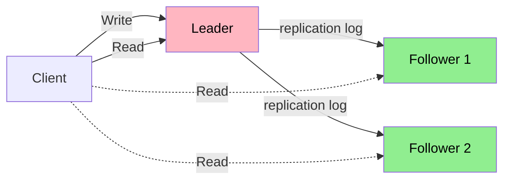

# 복제

---

> 같은 데이터를 여러 머신에 복사해 둔다. 복제의 목적은 네 가지다 — 고가용성(한 노드가 죽어도 서비스 지속), 내구성(여러 디스크에 분산), 지연 시간 감소(사용자 가까운 서버), 읽기 처리량 확장(여러 복제본 분산). 단순해 보이는 이 발상에서 단일 리더·다중 리더·리더리스 세 갈래의 트레이드오프, 비동기 복제의 일관성 문제, 충돌 해결까지 분산 시스템의 핵심 결정이 모두 펼쳐진다.


## 복제의 목적과 백업과의 차이

> 복제는 *현재* 데이터의 사본을 실시간으로 유지한다. 백업은 *과거 시점* 의 스냅샷을 보관한다. 둘은 같은 디스크에 있어도 서로 다른 문제를 푼다.

복제의 가치는 한 노드 장애 시에도 다른 노드가 즉시 서비스를 받쳐 준다는 점이다. 백업은 사람의 실수(실수로 DROP TABLE) 나 데이터 손상(랜섬웨어) 같은 자리에서 빛난다. 운영 환경에는 둘 다 필요하다. 복제만으로는 사람이 일으킨 사고를 막지 못하고, 백업만으로는 분 단위 가용성을 못 준다.

복제 토폴로지의 첫 결정은 "쓰기를 어디로 보내는가" 다. 답에 따라 세 갈래가 갈라진다. 단일 리더 — 한 노드만 쓰기를 받는다. 다중 리더 — 여러 노드가 쓰기를 받고 서로 동기화한다. 리더리스 — 모든 노드가 동등하게 읽기·쓰기를 받는다.


## 단일 리더 복제 — 가장 흔한 답

> PostgreSQL·MySQL·MongoDB·Kafka 의 기본 복제 모델이다. 운영 코드 베이스 대부분이 이 위에서 동작한다.

흐름은 단순하다. 클라이언트의 모든 쓰기가 리더로 간다. 리더는 변경을 자기 디스크에 쓰고, 동시에 변경 로그(WAL 또는 logical replication stream) 를 팔로워들에게 보낸다. 팔로워는 같은 변경을 자기 디스크에 적용한다. 읽기는 리더 또는 팔로워 어느 쪽에서나 가능하다.



운영 결정은 **동기 복제와 비동기 복제** 사이에 있다. 동기 복제는 리더가 *적어도 하나의* 팔로워가 변경을 받았다는 응답을 기다린 뒤 클라이언트에게 OK 한다. 데이터 손실은 거의 없지만 팔로워가 느리거나 죽으면 쓰기 자체가 막힌다. 비동기 복제는 리더가 자기 디스크에 쓰고 즉시 응답하며 팔로워 동기화는 백그라운드에서 따라간다. 처리량과 가용성이 좋지만 리더가 직후 죽으면 아직 복제 안 된 변경이 사라진다.

PostgreSQL 의 `synchronous_commit = on` 같은 설정이 이 결정의 직접 표현이다. 운영에서는 보통 **준동기(semi-synchronous)** 를 쓴다. 한 팔로워만 동기 복제를 받게 하고 나머지는 비동기로 두는 절충이다.

리더 장애 시 새 리더 선출이 운영의 가장 까다로운 부분이다. 자동 페일오버는 데이터 손실 위험(아직 복제 안 된 변경이 사라지거나 두 노드가 동시에 리더가 되는 split brain) 이 있어, 일부 운영 팀은 수동 개입을 선호한다. 페일오버 메커니즘 자체가 가장 자주 깨지는 부품이라는 데이터도 있다.


## 복제 지연 — 비동기의 함정

> 비동기 복제에는 본질적으로 **복제 지연(replication lag)** 이 따라붙는다. 그 지연이 사용자에게 보이는 세 가지 이상 현상이 있다.

**Read-your-writes 위반** 은 사용자가 자기 변경을 자기 화면에서 못 보는 상황이다. 댓글을 작성한 직후 페이지를 새로 고쳤는데 댓글이 안 보인다. 답은 **Read-your-writes consistency** 보장이다. 자기가 방금 쓴 데이터를 읽을 때만 리더에서 읽거나, 사용자별 timestamp 를 들고 다니면서 그보다 최신 복제본에서만 읽는다.

**Monotonic read 위반** 은 같은 사용자가 같은 데이터를 두 번 읽었을 때 시간을 거꾸로 가는 상황이다. 첫 번째 요청은 최신 복제본을 보고, 두 번째 요청은 우연히 더 느린 복제본으로 라우팅되어 옛 데이터를 본다. 답은 **Monotonic reads** — 한 사용자의 모든 읽기를 같은 복제본 또는 일관된 timestamp 위에 묶는다.

**Consistent prefix read 위반** 은 인과 순서가 뒤집혀 보이는 상황이다. "질문 → 답변" 순서로 발생한 두 메시지가 다른 순서로 보인다. 같은 샤드 안에서는 자연스럽게 보장되지만 여러 샤드가 얽힐 때 깨진다. 답은 **인과적 일관성(causal consistency)** ([`./01-06.일관성과 합의.md`](./01-06.일관성과%20합의.md) 참고).

세 가지 모두 "결국 일관 됨(eventually consistent)" 이라는 약한 약속만 가진 시스템에서 사용자에게 보이는 자연스러운 결함들이다. 강한 일관성을 원하면 합의 알고리즘([`./01-06.일관성과 합의.md`](./01-06.일관성과%20합의.md)) 까지 가야 한다.


## 다중 리더 복제

> 여러 노드가 동시에 쓰기를 받고 서로 비동기로 동기화한다. 다지역 배포·오프라인 우선 앱 같은 자리에서 답이 된다.

다중 리더의 핵심 사용처는 세 가지다. **다지역 클러스터** — 각 지역에 리더를 둬 사용자가 가까운 리더에 쓰기를 보내고 지역 간 비동기 복제를 받는다. **오프라인 작동** — 모바일 앱의 로컬 DB 가 자체 리더 역할을 하다가 온라인이 되면 서버와 동기화한다. **협업 편집** — Google Docs 같은 자리에서 각 클라이언트가 자기 사본을 편집하고 충돌은 사후 해결한다.

가장 어려운 부분은 **충돌 해결** 이다. 두 리더가 같은 행을 동시에 다르게 수정하면 누가 이기는가.

| 전략 | 동작 | 한계 |
|------|------|------|
| Last Write Wins(LWW) | 타임스탬프 큰 쪽이 이김 | 시계 동기화 가정, 변경 손실 |
| 충돌을 사용자에게 위임 | 두 버전 보여 주고 사람이 선택 | 사용자 경험 저하 |
| CRDT(Conflict-free Replicated Data Types) | 자료구조 자체가 충돌 흡수 | 적용 가능한 자료구조 제한 |
| OT(Operational Transformation) | 작업 순서를 변환해 결과 일치 | 구현 복잡 (Google Docs) |

LWW 가 가장 흔하지만 변경 손실 위험이 분명하다. 두 사용자의 쓰기 중 한쪽이 통째로 사라진다. CRDT 는 카운터·집합·문서 같은 특정 자료구조 위에서 충돌이 *결과적으로 같아지도록* 설계한다. 분산 카운터의 GCounter, 협업 편집의 RGA·Yjs 같은 라이브러리가 운영 도구다.


## 리더리스 복제 — Cassandra·DynamoDB 패턴

> 모든 노드가 동등하다. 클라이언트가 여러 노드에 동시에 쓰고, 다수가 OK 하면 성공으로 본다.

쓰기는 N 개 노드 중 W 개 응답을 받으면 끝나고, 읽기는 R 개 노드의 응답을 비교해 가장 최신 값을 고른다. **w + r > n** 공식이 핵심 보장이다. 쓰기와 읽기가 적어도 한 노드에서 겹치면 항상 최신 값이 보인다.

```
쿼럼 예시 (n=3):
W=2, R=2 → w+r=4 > 3 ✓ (강한 일관성)
W=1, R=1 → w+r=2 ≤ 3 ✗ (옛 값 가능)
W=3, R=1 → 강한 일관성 + 빠른 읽기, 쓰기 가용성 낮음
W=1, R=3 → 강한 일관성 + 빠른 쓰기, 읽기 가용성 낮음
```

이 모델의 가치는 *어떤 노드 집합* 이 살아 있어도 시스템이 동작한다는 점이다. 노드 N 개 중 N-W 개가 죽어도 쓰기가 가능하고, N-R 개가 죽어도 읽기가 가능하다. 단일 리더 모델의 페일오버 복잡도가 사라진다.

함정도 있다. **읽기 시 복구(read repair)** 와 **anti-entropy** 가 쿼럼 위에서 추가로 동작해야 한다. 읽기 시 복제본 간 차이를 발견하면 옛 노드를 갱신하고, 백그라운드 anti-entropy 프로세스가 주기적으로 모든 노드를 비교해 누락된 변경을 채운다.

쿼럼이 강한 일관성을 보장하지 못하는 함정도 있다 — **sloppy quorum** 이다. 정상 쿼럼 노드들이 일시 unreachable 일 때 다른 노드가 임시로 쿼럼에 참여한다. 가용성은 좋아지지만 w+r>n 공식이 깨진다. Cassandra 의 LOCAL_QUORUM 같은 설정으로 운영자가 명시적으로 골라야 한다.


## 동시 쓰기 감지 — Version Vector

> 두 쓰기가 인과적으로 무관할 때 어느 한쪽이 단순히 "옛날" 이라고 단정하지 못한다. 그 사실을 감지하는 도구가 버전 벡터다.

각 노드가 자기 카운터를 들고, 쓰기마다 카운터를 증가시킨다. 클라이언트는 마지막으로 본 버전 벡터를 들고 다니다가, 새 쓰기 시 그 벡터를 함께 보낸다. 서버는 두 버전 벡터를 비교해 한쪽이 다른 쪽보다 *모든 차원에서* 크면 인과 관계, 그렇지 않으면 동시 쓰기로 판정한다.

```
A 가 본 버전: {node1: 3, node2: 5}
B 가 본 버전: {node1: 4, node2: 5}  → A 보다 새로움 (인과)

A 가 본 버전: {node1: 3, node2: 5}
B 가 본 버전: {node1: 3, node2: 6}  → 동시 (인과 무관) → 충돌
```

이 감지가 들어가야 LWW 가 아닌 진짜 충돌 해결을 적용할 수 있다. DynamoDB·Riak 의 핵심 메커니즘이다.


## 면접 대비 체크리스트

1. 복제와 백업의 차이가 운영에 어떤 결과 차이를 가져오는가? 둘 다 필요한 이유는?
2. 단일 리더·다중 리더·리더리스 세 갈래의 적합 자리는?
3. 동기 복제와 비동기 복제의 트레이드오프, 그리고 준동기가 절충점이 되는 이유는?
4. 복제 지연이 사용자에게 보이는 세 가지 이상(read-your-writes·monotonic reads·consistent prefix) 을 한 시나리오씩 댈 수 있는가?
5. 다중 리더 복제의 충돌 해결 네 가지(LWW·사용자 위임·CRDT·OT) 가 각각 어디에 어울리는가?
6. 쿼럼 공식 `w + r > n` 이 보장하는 것과 보장하지 않는 것은? Sloppy quorum 의 함정은?
7. Read repair 와 anti-entropy 가 쿼럼 위에서 어떤 역할을 하는가?
8. Version Vector 가 LWW 와 다르게 *감지* 만 하고 *해결* 은 하지 않는 이유는?


## 관련 문서

- [`./README.md`](./README.md) — 04_distributed 진입
- [`./01-04.샤딩.md`](./01-04.샤딩.md) — 복제와 샤딩의 결합
- [`./01-06.일관성과 합의.md`](./01-06.일관성과%20합의.md) — 강한 일관성과 합의 알고리즘
- [`../06_data/fundamentals/01-04.트랜잭션과 격리 수준.md`](../06_data/fundamentals/01-04.트랜잭션과%20격리%20수준.md) — 단일 노드 트랜잭션의 일관성 모델
