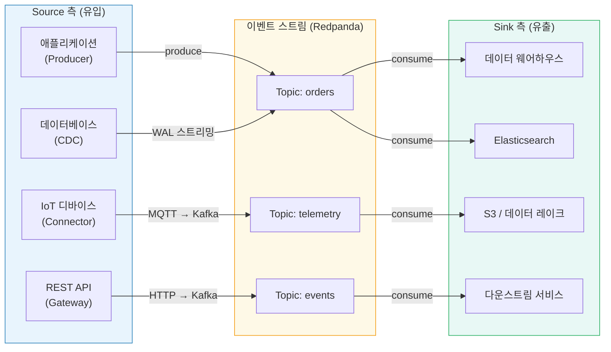
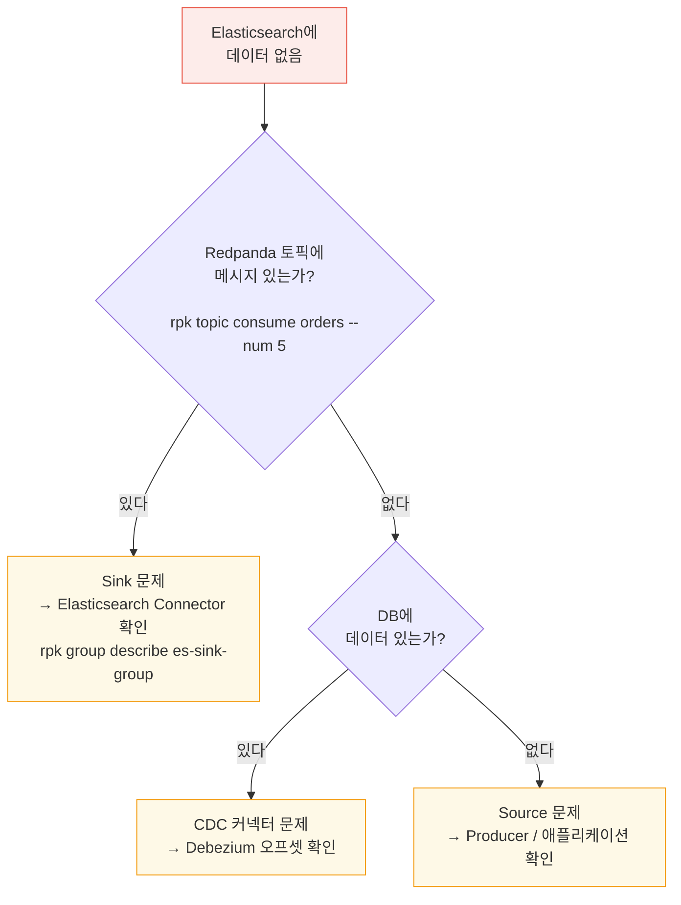
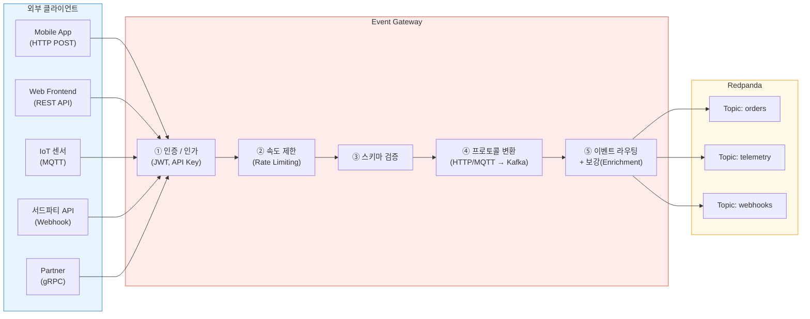
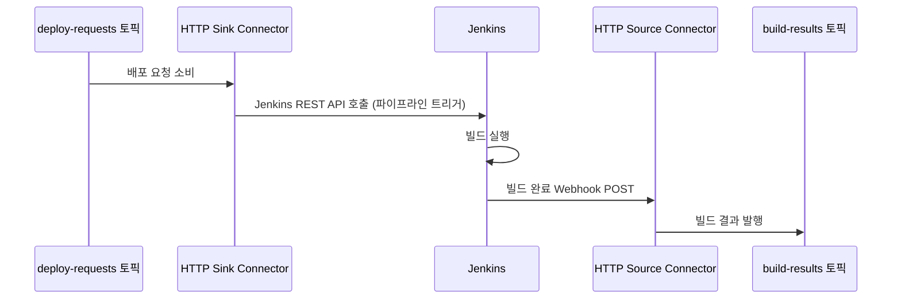
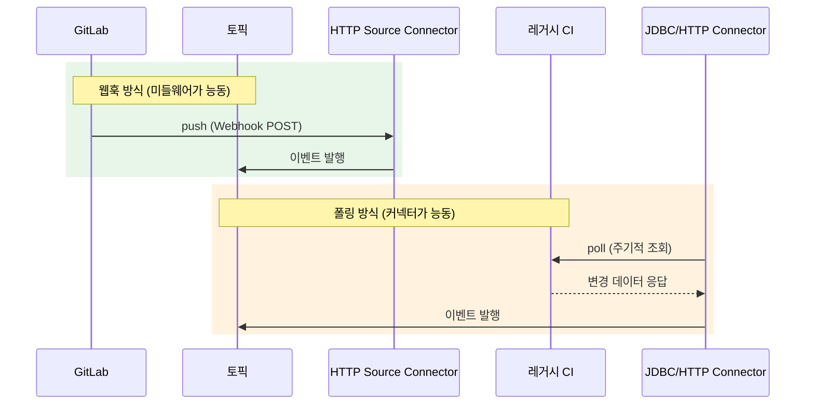
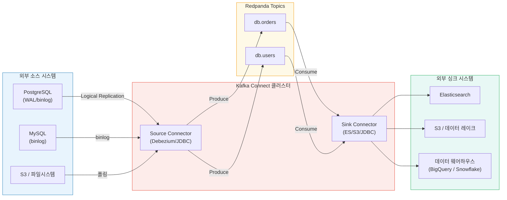

# 이벤트 소스 vs 싱크 - 대칭구조

---

> 이벤트 스트림(이벤트 브로커 토픽)은 데이터의 중간 허브입니다. 데이터가 이 허브로 흘러들어오는 경로가 Event Source이고, 처리된 데이터가 최종 목적지로 빠져나가는 경로가 Event Sink입니다. 



## Source와 Sink - 용어 정의

모든 데이터 파이프라인에는 2가지 역할이 존재합니다.

- Source: 데이터가 이벤트 스트림으로 흘러들어오는 출발점입니다. DB, API, IoT 센서 등 이벤트를 생산하는 모든 시스템을 의미합니다.
- Sink: 이벤트 스트림에서 데이터가 빠져나가는 도착점입니다. 데이터 웨어하우스, 엘라스틱서치 등 이벤트를 소비하여 최종적으로 활용/저장 하는 시스템을 의미합니다.

## Source와 Sink를 명시적으로 구분해야하는가?

이를 구분하지 않으면 이벤트 흐름 설계가 암묵적이 된다. "누가 이 토픽에 쓰는가?", "이 데이터는 결국 어디에 도달하는가?"라는 질문에 답하지 못하면 시스템을 이해하거나 장애를 진단하기 어려워진다. Source/Sink를 명시적으로 설계하면 데이터 계보가 명확해지고, 각 경계에서 스키마 검증, 인증, 모니터링을 체계적으로 적용할 수 있다.

예를들어 "엘라스틱 서치에서 주문 데이터가 안보인다"라는 장애가 발생하면 Source/Sink가 명확할 때 빠르게 디버깅이 가능하다.



- Source와 Sink를 별도의 모니터링하면 각 경계에서 메트릭을 독립적으로 관찰 할 수 있어 장애 위치를 토픽 단위로 격리할 수 있습니다.


# Event Gateway

---

> Kafka 클라이언트 라이브러리를 사용할 수 없는 시스템은 어떻게 이벤트를 발행해야하는가? (언어 제약 / 방화벽 / 클라이언트 라이브러리 관련 이슈)
>  -> ***Event GateWay는 이 복잡성을 한 곳에서 흡수하는 표준화된 진입점입니다.***



Event Gateway가 담당하는 책임은 단순히 프로토콜 변환에 그치지 않습니다. 외부에서 들어오는 모든 요청이 거쳐야 하는 일종의 세관이 됩니다.

| 책임                         | 설명                                                         |
| ---------------------------- | ------------------------------------------------------------ |
| **인증/인가**                | JWT, API Key 검증. 클라이언트가 어느 토픽에 발행 가능한지 제어 |
| **속도 제한(Rate Limiting)** | 과도한 트래픽으로 브로커가 과부하되는 것을 방지              |
| **스키마 검증**              | 잘못된 형식의 메시지가 토픽에 유입되는 것을 사전 차단        |
| **프로토콜 변환**            | HTTP/MQTT/gRPC → Kafka 프로토콜 변환                         |
| **이벤트 보강(Enrichment)**  | 클라이언트 메타데이터(IP, 타임스탬프, 버전) 추가             |

## Redpanda HTTP Proxy(PandaProxy)

Redpanda는 내장 HTTP Proxy인 PandaProxy를 제공합니다. 별도 게이트웨이 서버 없이도 REST API로 이벤트를 발행/소비할 수 있어, 빠른 통합과 디버깅에 유리합니다.

```bash
# Pandaproxy 기본 포트: 8082
# 메시지 발행
curl -s -X POST \
  "http://localhost:8082/topics/orders" \
  -H "Content-Type: application/vnd.kafka.json.v2+json" \
  -d '{
    "records": [
      {
        "key": "ord-123",
        "value": {
          "orderId": "ord-123",
          "customerId": "cust-456",
          "total": 59900
        }
      }
    ]
  }'

# Consumer Group 생성 후 메시지 소비
curl -s -X POST \
  "http://localhost:8082/consumers/my-group" \
  -H "Content-Type: application/vnd.kafka.v2+json" \
  -d '{"name": "consumer1", "format": "json", "auto.offset.reset": "earliest"}'

curl -s -X GET \
  "http://localhost:8082/consumers/my-group/instances/consumer1/records" \
  -H "Accept: application/vnd.kafka.json.v2+json"
```

- PandaProxy는 간단한 시나리오에 충분하지만, 인증과 속도 제한 같은 고급 기능이 필요하면 별도 API Gateway나 커스텀 서비스를 구성하는 것이 좋습니다.
- Spring Boot로 직접 구현하면 다음과 같이 됩니다.

```java
@RestController
@RequestMapping("/events")
@RequiredArgsConstructor
public class EventGatewayController {

    private final KafkaTemplate<String, Object> kafkaTemplate;
    private final SchemaValidator schemaValidator;
    private final RateLimiter rateLimiter;

    @PostMapping("/orders")
    public ResponseEntity<Void> publishOrderEvent(
            @RequestHeader("X-Api-Key") String apiKey,
            @RequestBody Map<String, Object> payload) {

        // 1. 인증 — API Key 검증
        if (!isValidApiKey(apiKey)) {
            return ResponseEntity.status(HttpStatus.UNAUTHORIZED).build();
        }

        // 2. 속도 제한
        if (!rateLimiter.tryAcquire(apiKey)) {
            return ResponseEntity.status(HttpStatus.TOO_MANY_REQUESTS).build();
        }

        // 3. 스키마 검증 — 필수 필드 존재 여부 확인
        if (!schemaValidator.validate("order-created-v1", payload)) {
            return ResponseEntity.badRequest().build();
        }

        // 4. 이벤트 보강 — 서버 측 메타데이터 추가
        payload.put("receivedAt", Instant.now().toEpochMilli());
        payload.put("sourceIp", getClientIp());

        // 5. Redpanda로 발행
        String orderId = (String) payload.get("orderId");
        kafkaTemplate.send("orders", orderId, payload);

        return ResponseEntity.accepted().build();
    }
}
```

# Source / Sink 커넥터

---

> 커넥터는 외부 시스템과 이벤트 스트림(토픽) 사이의 데이터 이동을 담당하는 미리 만들어진 컴포넌트 입니다. 직접 Producer/Consumer 코드를 작성하는 대신, 커넥터 설정 파일(JSON, YAML)로 등록하면 데이터가 자동으로 흘러갑니다.

## 커넥터란 무엇인가?

커넥터는 역할에 따라 2가지 종류로 나뉩니다.

1. Source Connector: 외부 시스템(DB, 파일, API)에서 데이터를 읽어 토픽으로 발행합니다.
2. Sink Connector: 토픽의 데이터를 읽어 외부 시스템(Elasticsearch, S3)등에 사용합니다.

Jenkins를 예로 들어서 설명합니다.




- 직접 코드를 짜면 웹훅을 받는 API 서버 및 KafkaProducer를 모두 구현해야 하지만, 커넥터를 쓰면 HTTP Sink Connector가 토픽의 메시지를 Jenkins API로 전달하고 HTTP Source Connector가 빌드 완료 웹훅을 받아 토픽에 발행한다.
- 코드를 작성하지 않고 Sink/Source Connector를 설정만으로 구성할 수 있게됩니다.

### 웹훅이 없는 미들웨어는?

만약 레거시 미들웨어, 폐쇄망 CI/CD인 경우에는 커넥터는 반대로 미들웨어 쪽을 능동적으로 조회합니다.



| 방식            | 동작                                                         | 적합 사례                               |
| --------------- | ------------------------------------------------------------ | --------------------------------------- |
| **DB 폴링**     | 미들웨어가 상태를 DB에 기록 → JDBC Source Connector가 주기적 SELECT | 빌드 결과가 DB에 저장되는 레거시 시스템 |
| **API 폴링**    | 미들웨어의 REST API를 주기적으로 호출 → 변경분만 토픽에 발행 | Jenkins REST API, SonarQube API 등      |
| **로그 테일링** | 미들웨어가 남기는 로그 파일을 `file` input으로 실시간 감시   | 로그만 남기는 배치 시스템               |

- 웹훅은 실시간성이 좋지만 미들웨어의 지원이 필요합니다.
- 폴링은 미들웨어 수정 없이 도입 가능하지만 폴링 간격만큼 지연이 생깁니다.

## 커넥터 프레임워크 존재 이유

> KafkaTemplate로 직접 보내면 되는데 왜 커넥터를 쓰는가?라는 질문은 자연스럽습니다.
>
> 작은 시스템에서는 직접 코드를 짜는것이 더 간단하지만, 서비스가 각자 다른 미들웨어에 보내게 되면 그만큼의 연동 코드가 필요해집니다. 이를 설정 파일로 대체해서 로직 반복을 줄이는 것이 목표입니다.



> 커넥터가 필요한 이유, 정량적 이점, 실전 기업 사례는 [01-02.커넥터가 필요한 이유와 실전 사례](./01-02.커넥터가%20필요한%20이유와%20실전%20사례.md)에서 상세히 다룹니다.

Kafka Connect의 가치는 이미 검증된 커넥터를 재사용할 수 있다는 점입니다. JDBC Source Connector로 Oracle, MySQL, PostgreSQL등 수십 종의 DB를 지원합니다.

| 유형       | 커넥터                             | 설명                                                         |
| ---------- | ---------------------------------- | ------------------------------------------------------------ |
| **Source** | Debezium (PostgreSQL/MySQL/Oracle) | DB WAL/binlog → Redpanda (CDC)                               |
| **Source** | JDBC Source                        | DB 테이블 폴링 → Redpanda                                    |
| **Source** | HTTP Source                        | 웹훅 수신 → Redpanda (Jenkins/GitLab 빌드 이벤트 등)         |
| **Source** | Kafka MirrorMaker 2                | 클러스터 간 토픽 복제                                        |
| **Sink**   | HTTP Sink                          | Redpanda → 외부 REST API 호출 (Jenkins 파이프라인 트리거 등) |
| **Sink**   | MinIO (S3 호환) Sink               | Redpanda → MinIO/S3 (파케이/AVRO/JSON)                       |
| **Sink**   | Elasticsearch Sink                 | Redpanda → Elasticsearch                                     |
| **Sink**   | JDBC Sink                          | Redpanda → 관계형 DB                                         |
| **Sink**   | BigQuery Sink                      | Redpanda → Google BigQuery                                   |

## Redpanda Connect (다른 철학)

Redpanda Connect는 Redpanda가 제공하는 내장 데이터 파이프라인 도구입니다. Kafka Connect와 달리 단일 바이너리로 실행되며, YAML 설정만으로 복잡한 파이프라인을 구성할 수 있습니다.

| 기준              | Kafka Connect                        | Redpanda Connect           |
| ----------------- | ------------------------------------ | -------------------------- |
| **배포 방식**     | JVM 워커 클러스터 (분산 모드)        | 단일 Go 바이너리           |
| **설정 방식**     | REST API로 JSON 설정                 | YAML 파일                  |
| **확장성**        | 워커 추가로 수평 확장                | 프로세스 복제              |
| **커넥터 생태계** | 풍부함 (Confluent Hub, 1000+ 커넥터) | 성장 중 (주요 시스템 지원) |
| **운영 부담**     | 높음 (ZooKeeper 또는 KRaft 필요)     | 낮음 (의존성 없음)         |
| **변환(SMT)**     | Single Message Transforms 지원       | Bloblang 매핑 언어         |
| **적합 사례**     | 엔터프라이즈, 다수 커넥터 관리       | 소규모~중규모, 빠른 구성   |

