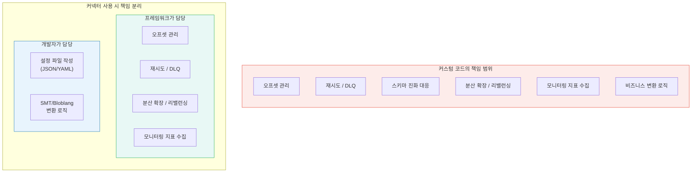
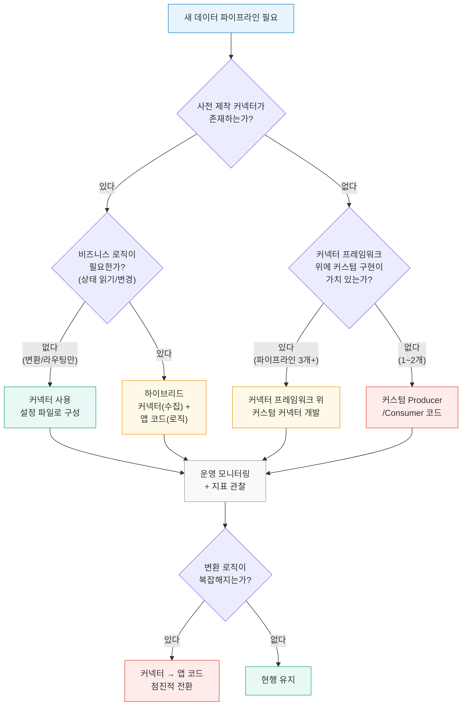

# 커넥터가 필요한 이유와 실전 사례
---
> 커스텀 코드 대신 커넥터를 선택해야 하는 이유, 정량적 이점, 그리고 실제 기업들이 커넥터 도입으로 얻은 변화를 다룹니다.

## 1. 커스텀 코드 vs 커넥터 — 무엇이 다른가

DB에서 Kafka 토픽으로 데이터를 옮기는 파이프라인을 직접 구현한다고 가정합니다. Producer 코드를 작성하는 것 자체는 간단하지만, 프로덕션 수준의 파이프라인이 되려면 그 외에 해결해야 할 문제가 상당합니다.

직접 구현할 경우 개발자가 책임져야 하는 영역은 다음과 같습니다:

- 오프셋 관리: 어디까지 읽었는지 기록하고, 장애 복구 시 정확한 지점부터 재개해야 합니다.
- 재시도와 에러 처리: 네트워크 장애, 브로커 장애, 직렬화 실패 등 각각에 대한 재시도 로직과 Dead Letter Queue를 구현해야 합니다.
- 스키마 진화: 소스 시스템의 테이블 구조가 변경되면 Producer 코드도 함께 수정해야 합니다.
- 분산 확장: 처리량이 늘어나면 워커를 추가하고 파티셔닝을 관리하는 로직이 필요합니다.
- 모니터링: 지연(lag), 처리량(throughput), 에러율 등 운영 지표를 직접 수집하고 대시보드를 구성해야 합니다.

커넥터는 이 모든 문제를 프레임워크 레벨에서 이미 해결해 놓은 컴포넌트입니다. 개발자는 "어디서 읽고, 어디로 보낼 것인가"만 설정 파일로 선언하면 나머지는 프레임워크가 처리합니다.



### 1-1. 같은 파이프라인, 다른 구현

PostgreSQL의 `orders` 테이블을 Kafka 토픽으로 스트리밍하는 파이프라인을 두 가지 방식으로 비교합니다.

커스텀 코드로 구현하면 다음과 같은 코드가 필요합니다:

```java
@Component
@RequiredArgsConstructor
public class OrderCdcProducer {

    private final KafkaTemplate<String, String> kafkaTemplate;
    private final JdbcTemplate jdbcTemplate;
    private final OffsetStore offsetStore;      // 직접 구현 필요
    private final ObjectMapper objectMapper;

    @Scheduled(fixedDelay = 1000)
    public void pollAndPublish() {
        long lastOffset = offsetStore.getLastOffset("orders");

        List<Map<String, Object>> rows = jdbcTemplate.queryForList(
                "SELECT * FROM orders WHERE id > ? ORDER BY id LIMIT 500"
                , lastOffset
        );

        for (Map<String, Object> row : rows) {
            try {
                String key = String.valueOf(row.get("id"));
                String value = objectMapper.writeValueAsString(row);
                kafkaTemplate.send("db.orders", key, value).get();
                offsetStore.updateOffset("orders", (Long) row.get("id"));
            } catch (Exception e) {
                // 재시도? DLQ? 스킵? — 직접 결정해야 함
                log.error("Failed to publish order {}", row.get("id"), e);
            }
        }
    }
}
```

같은 파이프라인을 Debezium Source Connector로 구현하면 설정 파일 하나로 끝납니다:

```json
{
  "name": "orders-cdc",
  "config": {
    "connector.class": "io.debezium.connector.postgresql.PostgresConnector",
    "database.hostname": "postgres",
    "database.port": "5432",
    "database.user": "cdc_user",
    "database.password": "${env:PG_PASSWORD}",
    "database.dbname": "shop",
    "table.include.list": "public.orders",
    "topic.prefix": "db",
    "plugin.name": "pgoutput",
    "slot.name": "orders_slot"
  }
}
```

커스텀 코드는 폴링 기반이라 변경 감지에 지연이 있고, 삭제(DELETE)를 감지하지 못합니다. Debezium은 PostgreSQL WAL을 직접 읽으므로 INSERT, UPDATE, DELETE를 밀리초 단위로 캡처하며, 오프셋 관리와 재시도를 프레임워크가 처리합니다.

## 2. 커넥터의 장점

### 2-1. 개발 시간 단축

Forrester의 2023년 Total Economic Impact 분석에 따르면, Confluent Cloud 도입 기업은 자체 관리 Apache Kafka 대비 **250만 달러 이상**을 절감했고, 투자 대비 **257% ROI**를 달성했습니다. 개발 및 운영 비용 절감이 140만 달러, 인프라 비용 절감이 110만 달러에 달했으며 투자 회수 기간은 6개월 미만이었습니다.

커넥터 하나를 도입하면 오프셋 관리, 재시도, 모니터링 등을 직접 구현하지 않아도 됩니다. 시스템이 10개, 20개로 늘어날수록 절감 효과는 선형이 아니라 누적적으로 증가합니다.

### 2-2. 운영 부담 감소

커넥터 프레임워크는 다음 운영 기능을 기본 제공합니다:

- 오프셋 자동 관리: 장애 복구 시 마지막 처리 지점부터 재개합니다.
- 분산 확장: Kafka Connect는 워커 추가만으로 수평 확장되고, Redpanda Connect는 프로세스 복제로 확장됩니다.
- 무중단 설정 변경: REST API를 통해 커넥터를 일시정지, 재개, 설정 변경할 수 있습니다.
- 내장 모니터링: JMX(Kafka Connect) 또는 Prometheus 엔드포인트(Redpanda Connect)로 지표를 즉시 수집합니다.

### 2-3. 비개발자도 파이프라인 구성 가능

Stéphane Maarek는 Kafka API 비교 글에서 커넥터를 "no-code/low-code 프레임워크"로 정의합니다. 설정 파일(JSON/YAML)만 작성하면 Elasticsearch, Snowflake, PostgreSQL, BigQuery 등 주요 시스템과의 연동이 가능합니다. 데이터 엔지니어가 코드를 작성하지 않고도 파이프라인을 구성할 수 있다는 점은 팀 전체의 생산성을 높입니다.

### 2-4. 스키마 진화가 프레임워크 레벨에서 지원

Debezium 같은 CDC 커넥터는 소스 DB의 스키마 변경(컬럼 추가, 타입 변경 등)을 자동으로 감지하여 토픽 메시지에 반영합니다. Schema Registry와 결합하면 호환성 검증까지 자동으로 수행됩니다. 커스텀 코드로 이를 구현하려면 스키마 변경 감지, 직렬화 코드 업데이트, 하위 호환성 검증을 모두 직접 처리해야 합니다.

### 2-5. 에코시스템 성숙도

2026년 3월 기준, 두 생태계의 규모는 다음과 같습니다:

- Confluent Marketplace(구 Confluent Hub)에는 200개 이상의 프로덕션 커넥터가 등록되어 있으며, 이 중 80개 이상이 완전 관리형(Fully Managed)입니다.
- Redpanda Connect는 300개 이상의 커넥터를 단일 바이너리(128MB)에 내장하고 있으며, 대부분이 Apache 2.0 라이선스입니다.
- Debezium은 3.4 버전까지 출시되었고, CDC 분야의 사실상 표준으로 자리잡았습니다.

## 3. 커넥터의 한계

커넥터가 만능은 아닙니다. 다음 상황에서는 커스텀 코드가 더 적합합니다.

### 3-1. 사전 제작 커넥터가 없는 시스템

레거시 시스템이나 사내 자체 개발 미들웨어에는 맞는 커넥터가 없을 수 있습니다. 이 경우 Kafka Connect는 `SourceConnector`/`SinkConnector` 인터페이스를 직접 구현해야 하고, Redpanda Connect는 커스텀 플러그인을 Go로 작성해야 합니다. 커넥터 프레임워크의 이점(오프셋 관리, 분산)은 여전히 활용할 수 있지만, 개발 비용이 발생합니다.

### 3-2. 복잡한 비즈니스 로직

"주문 이벤트를 받아서 재고를 확인하고, 부족하면 취소 이벤트를 발행한다"처럼 **상태를 읽고 변경하는** 로직은 커넥터의 영역이 아닙니다. 커넥터는 데이터를 변환하고 라우팅하는 인프라 접착제이지, 비즈니스 의사결정을 내리는 도구가 아닙니다.

### 3-3. JVM 기반 운영 부담 (Kafka Connect)

Kafka Connect는 JVM 위에서 동작하므로 힙 튜닝, GC 모니터링, 플러그인 JAR 관리 등 Java 운영 지식이 필요합니다. 분산 모드에서는 워커 클러스터를 별도로 관리해야 합니다. Redpanda Connect는 Go 단일 바이너리로 이 부담을 줄이지만, 분산 모드 자체를 지원하지 않는 트레이드오프가 있습니다.

### 3-4. 변환 로직이 복잡해지면 가독성이 하락

Kafka Connect의 SMT(Single Message Transform)는 단순 필드 매핑에는 적합하지만, 조건 분기가 3단 이상으로 깊어지면 JSON 설정이 읽기 어려워집니다. Redpanda Connect의 Bloblang은 더 유연하지만, 결국 DSL의 한계가 있어 복잡한 변환은 애플리케이션 코드가 나은 경우가 있습니다.

### 3-5. 프레임워크 자체의 학습 곡선

커넥터를 처음 접하는 팀은 Kafka Connect의 워커/태스크/컨버터 개념, Redpanda Connect의 Input/Pipeline/Output/Buffer 구조를 이해하는 데 시간이 필요합니다. 파이프라인이 1~2개뿐이라면 커스텀 코드가 더 빠를 수 있습니다.

## 4. 실전 사례 — Redpanda

### 4-1. ShareChat (MAU 4억+, 인도 최대 소셜 미디어)

ShareChat은 인도 최대의 소셜 미디어 플랫폼으로, ShareChat 앱(MAU 1.8억)과 Moj 플랫폼(소비자 3억)을 운영합니다. 기업가치 50억 달러 규모입니다.

기존에는 Google Pub/Sub를 사용했지만, Redpanda Cloud BYOC로 전환한 결과 이벤트 스트리밍 클라우드 인프라 비용을 **70% 절감**하여 연간 수백만 달러를 아꼈습니다. 40대 미만의 노드로 초당 약 500만 메시지를 처리하며, 99.95% 이상의 가동률을 유지합니다.

ShareChat의 기술 리더는 Redpanda Connect(당시 Benthos)에 대해 이렇게 평가했습니다:

> "우리는 단순한 상태 비저장 처리부터 변환 작업까지 다양한 유스케이스에 Benthos를 사용해왔습니다. 수직·수평 확장이 쉽고, **인프라 셋업이 거의 필요 없다**는 점이 인상적입니다."

참고로 Redpanda Connect의 알려진 최대 배포 규모는 2×25Gbps NIC를 통한 **50Gbps** 처리량이며, 최소 배포는 100 밀리코어와 10MiB 메모리로도 운영이 가능합니다.

### 4-2. Zafin (핀테크/코어뱅킹)

캐나다 핀테크 기업 Zafin은 은행의 상품·가격 관리 플랫폼인 Zafin IO를 운영합니다. 글로벌 은행 고객 기준으로 하루 3억 건 이상의 이벤트(1TB+ 데이터)를 처리합니다.

기존에는 Confluent/Kafka 브로커 80대(리전당 브로커 5대 + ZooKeeper 5대)를 운영했는데, 한 브로커의 장애가 전체 80대로 전파되어 수 시간 동안 완전히 중단되는 사고가 발생했습니다. 장애 허용을 위해 설계한 아키텍처가 오히려 연쇄 장애를 일으킨 것입니다.

Redpanda로 전환한 결과, 프로덕션 브로커 5대와 DR용 5대로 동일한 워크로드를 처리합니다. 코드 변경 없이 Kafka API 호환성만으로 마이그레이션이 완료되었습니다.

> "Redpanda는 그냥 동작합니다. 코드를 변경할 필요가 없었고, 갑자기 운영이 단순해졌습니다." — Shahir Daya, Zafin CTO

### 4-3. Lacework (클라우드 보안)

클라우드 보안 플랫폼 Lacework는 플랫폼의 모든 기능이 실시간 데이터 흐름에 의존합니다. 2021년 12월 Redpanda 도입 이후 CPU 풋프린트가 **1,200% 이상** 성장했지만 안정적으로 운영되고 있습니다.

핵심 지표는 다음과 같습니다:

- 피크 처리량: **14.5GB/초**
- 확장성: 기존 대비 **10배 증가**
- 스토리지 비용: Tiered Storage로 **30% 이상 절감**
- 데이터 변동성: 시간대별 10배 스파이크가 일상적

> "벤치마킹 도중 기존 도구의 한계에 먼저 도달했지만, Redpanda는 땀도 안 흘리고 있었습니다." — Chip Turner, Lacework 엔지니어링 디렉터

### 4-4. Poolside (AI/ML)

AI 파운데이션 모델 기업 Poolside는 소프트웨어 엔지니어링 에이전트를 개발합니다. LLM 학습에서 데이터 파이프라인 속도는 경쟁력과 직결됩니다.

Redpanda BYOC(AWS) 도입으로 ML 학습 작업 시간이 **수 주에서 1일**로 단축되었습니다. 데이터가 Poolside VPC 내에 머물러 GDPR 준수와 데이터 주권이 보장됩니다.

> "실수는 자주 발생하는데, 코드의 버그를 찾는 데 5일이 걸리면 경쟁에서 2주 뒤처집니다." — Poolside 엔지니어링

2025년 10월에는 Redpanda Connect의 300개 이상 엔터프라이즈 데이터 소스 연결을 활용하는 에이전틱 파트너십을 발표했습니다.

## 5. 실전 사례 — Kafka Connect

### 5-1. CrowdStrike (사이버보안)

사이버보안 기업 CrowdStrike는 하루 **1조 건 이상**의 보안 이벤트를 수집합니다. 최대 클러스터는 600대 이상의 브로커로 구성되며, 피크 시 초당 1,500만 건 이상의 이벤트를 처리합니다.

단일 토픽의 확장 한계를 극복하기 위해 **샤딩** 전략을 도입했습니다. 샤드는 active(읽기/쓰기), read-only(읽기만), inactive(무시) 세 가지 상태로 관리되며, 토픽 단위가 아닌 샤드 단위로 무한 수평 확장이 가능합니다. Consumer 오토스케일링에는 **KEDA의 Prometheus 스케일러**를 사용하여, consumer lag 메트릭 기반으로 Kubernetes Pod를 자동으로 조절합니다.

### 5-2. Audacy (미디어, 청취자 2억)

미국 오디오 스트리밍 기업 Audacy는 2억 명의 청취자에게 개인화 콘텐츠와 동적 광고를 실시간으로 제공합니다. Confluent Cloud와 커넥터 도입 후 개발 속도가 **40% 이상** 향상되었습니다.

구체적인 성과는 다음과 같습니다:

- 라이브 스트리밍 지연: 90초 → 30초로 단축
- 화면 레이아웃, 메타데이터 갱신이 준실시간으로 전환
- "Tap to Record" 기능이 일정보다 앞당겨 출시

> "Confluent 기반 데이터 백플레인으로 개발 속도가 40% 이상 빨라졌습니다." — Vitaly Shoykhet, Audacy SVP of Engineering

### 5-3. SecurityScorecard (보안 평가)

보안 등급 평가 기업 SecurityScorecard는 Confluent의 완전 관리형 S3 커넥터를 도입하여 커스텀 커넥터 유지보수 코드를 제거하고, **FTE 2명**의 엔지니어링 리소스를 확보했습니다. Amazon MSK 대비 연간 약 12.5만 달러를 절감했고, 전체 운영 비용은 **48.3% 감소**했습니다.

확보된 엔지니어링 리소스로 Attack Surface Intelligence(ASI) 모듈과 Automated Vendor Detection(AVD) 플랫폼 등 신규 제품을 개발할 수 있었습니다. 이전 벤더 대비 총 200만 달러 이상의 스트리밍 인프라 비용을 절감했습니다.

## 6. 커넥터 에코시스템 현황 (2026년 3월 기준)

### 6-1. Confluent Marketplace

Confluent Hub이 Confluent Marketplace로 리브랜딩되었습니다. 커넥터, 파트너 통합, 검증된 엔터프라이즈 솔루션을 한 곳에서 발견하고 배포할 수 있는 마켓플레이스로 진화했습니다. 200개 이상의 프로덕션 커넥터가 등록되어 있으며, 완전 관리형 커넥터는 99.99% 가동률 SLA를 제공합니다. 처리량 상위 커넥터는 Amazon S3, Snowflake, Google Cloud Storage, BigQuery Sink입니다.

### 6-2. Redpanda Connect

Redpanda가 2024년 5월 Benthos를 인수하면서 탄생했습니다. 300개 이상의 커넥터가 128MB 단일 바이너리에 내장되어 있고, Kafka Connect 대비 **컴퓨팅 리소스가 3배 적게** 소요됩니다. 워커 조율, 태스크 리밸런싱, 별도 설정 파일 관리 없이 YAML 선언만으로 파이프라인을 구성합니다. 엔터프라이즈 커넥터(Snowflake PUT, Splunk 등)를 제외한 대부분이 Apache 2.0 라이선스입니다.

### 6-3. Debezium

CDC 분야의 사실상 표준인 Debezium은 3.4 버전(2026년 3월)까지 출시되었습니다. 3.x 시리즈의 주요 변화는 다음과 같습니다:

- Java 17+ 필수(서버 컴포넌트는 Java 21+)
- WASM 변환 지원(TinyGo/Chicory)
- AI 모듈 추가(벡터 임베딩, Milvus/InstructLab 싱크)
- CockroachDB, PostgreSQL 18 지원 추가
- 커뮤니티 기여자 100명 이상(3.1 기준 168개 이슈 해결)

핀테크와 IoT 분야에서 CDC 도입이 2025년 기준 45% 증가했으며, 로그 기반 CDC는 동기화에서 99.9% 가동률을 달성하고 수동 ETL 작업을 70% 감소시킵니다.

### 6-4. Kafka 4.0 — ZooKeeper 제거

Apache Kafka 4.0이 2025년 3월에 출시되면서 14년간 사용된 ZooKeeper 의존성이 완전히 제거되었습니다. KRaft 모드에서는 메타데이터가 Kafka 클러스터 내부의 컨트롤러 노드에서 복제 로그로 관리됩니다. 이는 커넥터 운영에도 영향을 미칩니다. 별도의 3~5노드 ZooKeeper 앙상블을 관리할 필요가 없어져 Kafka Connect 클러스터의 배포 토폴로지가 단순해졌습니다.

마이그레이션 경로는 Kafka 3.9(ZooKeeper 지원 마지막 버전)로 업그레이드 → KRaft 마이그레이션 → 4.0 업그레이드 순서입니다.

## 7. 의사결정 프레임워크 — 커넥터 vs 커스텀 코드

"커넥터로 시작하고, 한계에 부딪히면 커스텀으로 전환"이 실용적인 전략입니다. 커넥터로 80%의 파이프라인을 빠르게 구성하고, 나머지 20%의 복잡한 비즈니스 로직만 애플리케이션 코드로 처리하면 전체 개발 비용과 운영 부담을 최소화할 수 있습니다.



의사결정 시 고려해야 할 핵심 기준은 다음과 같습니다:

| 기준 | 커넥터 유리 | 커스텀 코드 유리 |
|------|------------|----------------|
| 사전 제작 커넥터 | 존재함 | 존재하지 않음 |
| 비즈니스 로직 | 없음 (변환/라우팅만) | 상태 읽기/변경 필요 |
| 파이프라인 수 | 3개 이상 | 1~2개 |
| 팀 운영 역량 | 인프라 운영팀 존재 | 소규모 팀, 풀스택 |
| 확장 계획 | 시스템 연동 증가 예상 | 단일 연동으로 충분 |

## Sources

Redpanda 사례 연구:

- [ShareChat — Redpanda Cloud BYOC로 클라우드 비용 70% 절감](https://www.redpanda.com/case-study/sharechat)
- [Zafin — 코어뱅킹 실시간 이벤트 처리](https://www.redpanda.com/case-study/zafin)
- [Lacework — 피크 14.5GB/s 클라우드 보안 데이터 처리](https://www.redpanda.com/case-study/lacework)
- [Poolside — ML 학습 시간 수 주 → 1일 단축](https://www.redpanda.com/case-study/poolside)
- [Redpanda Connect — 300+ 커넥터 단일 바이너리](https://www.redpanda.com/connect)

Kafka/Confluent 사례 연구:

- [CrowdStrike — 일 1조 이벤트, 샤딩 기반 수평 확장](https://www.crowdstrike.com/en-us/blog/how-we-improved-scale-and-reliability-by-sharding-kafka/)
- [Audacy — 개발 속도 40%+ 향상, 실시간 개인화](https://www.confluent.io/customers/audacy/)
- [SecurityScorecard — 관리형 커넥터로 FTE 2명 확보](https://www.confluent.io/customers/securityscorecard/)
- [Forrester TEI — Confluent Cloud 257% ROI](https://www.confluent.io/resources/report/forrester-economic-impact-confluent-cloud/)

에코시스템:

- [Confluent Marketplace (200+ 커넥터)](https://www.confluent.io/hub/)
- [Debezium 3.4 릴리스](https://debezium.io/releases/)
- [Apache Kafka 4.0 — KRaft 전용](https://kafka.apache.org/40/getting-started/upgrade/)
- [Stéphane Maarek — The Kafka API Battle](https://medium.com/@stephane.maarek/the-kafka-api-battle-producer-vs-consumer-vs-kafka-connect-vs-kafka-streams-vs-ksql-ef584274c1e)
