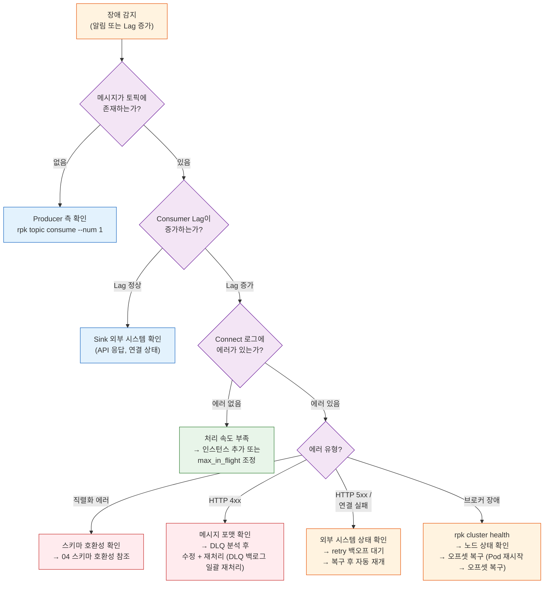
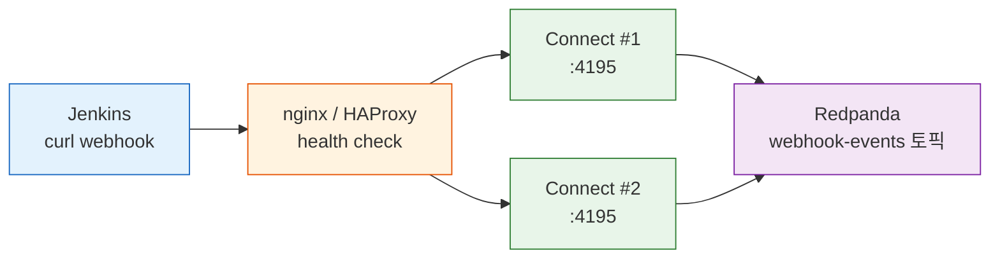
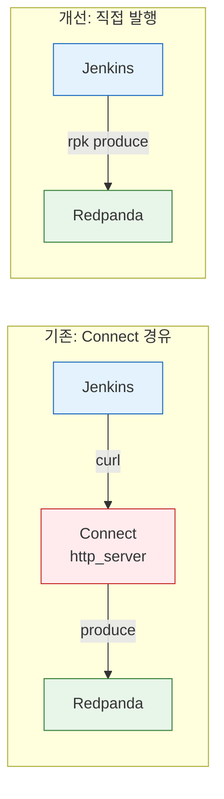

# 장애 복구와 고가용성

---

> 이 문서는 그 다음 단계, 즉 '장애가 발생했을 때 어떻게 복구하는가'와 '장애를 미리 방지하기 위한 고가용성 구성'을 다룬다. 에러 감지와 로깅이 문제를 인식하는 단계라면, 이 문서는 인식 이후 어떻게 행동할지를 다루는 단계다. 03-01과 함께 읽어야 전체 에러 처리 흐름이 완성된다.

## 학습 목표

- 커넥터 장애 유형별 복구 절차(런북)를 실행할 수 있다
- dedupe 프로세서의 at-least-once 보장 파괴 메커니즘을 이해하고 대안을 선택할 수 있다
- Connect의 HTTP→Kafka at-most-once 갭을 이해하고 고가용성 구성을 설계할 수 있다

## 커넥터 장애 복구 런북

이 섹션은 프로덕션에서 자주 발생하는 장애 시나리오별 복구 절차를 정리한 런북(Runbook)이다. 각 시나리오는 "증상 → 진단 → 조치" 순서로 구성되어 있다.

### Pod 재시작 → 오프셋 복구

이 장애를 방치하면, Pod가 재시작된 뒤 오프셋이 올바르게 이어지는지 확인하지 않으면, 전체 토픽을 처음부터 재처리하거나 메시지를 건너뛸 수 있다.

Kafka Consumer(rpk connect 포함)가 재시작되면 마지막으로 커밋한 오프셋부터 다시 읽는다. 이것이 at-least-once 보장의 기본 동작이다. 확인해야 할 것은 "재시작 전후로 오프셋이 정상적으로 이어지는가"이다.

**진단 절차:**

```bash
# 1. 재시작 전 — 현재 오프셋 기록
rpk group describe http-sink-group

# 출력 예시:
# GROUP           TOPIC              PARTITION  CURRENT-OFFSET  LOG-END-OFFSET  LAG
# http-sink-group api-sink-requests  0          1523            1530            7
# http-sink-group api-sink-requests  1          2041            2041            0

# 2. Pod 재시작 후 — 오프셋 비교
rpk group describe http-sink-group

# 기대: CURRENT-OFFSET이 재시작 전 값과 같거나 약간 작음 (미커밋분)
# 이상: CURRENT-OFFSET이 0 또는 LOG-END-OFFSET으로 점프 → auto.offset.reset 설정 확인
```

`CURRENT-OFFSET`이 재시작 전보다 작아졌다면 일부 메시지가 중복 처리될 수 있다. 이는 at-least-once의 정상 동작이며, Sink 측에서 멱등성을 보장하면 문제가 되지 않는다. 0으로 리셋된 경우에는 Consumer Group ID가 변경되었거나, 오프셋 보존 기간(`offsets.retention.minutes`, 기본 7일)이 초과된 것이다.

### Consumer Group 오프셋 리셋

이 장애를 방치하면, 장애 복구나 데이터 재처리를 위해 오프셋을 수동 리셋해야 할 때, 절차를 모르면 전체 토픽을 처음부터 재처리하는 사고가 발생한다.

`rpk group seek` 명령어로 Consumer Group의 오프셋을 원하는 위치로 이동할 수 있다.

> 오프셋 리셋은 메시지 중복 처리를 유발할 수 있으므로, Sink 측 멱등성이 보장되는 상태에서만 실행해야 한다.

```bash
# 컨슈머 중지 후 실행 (활성 컨슈머가 있으면 리셋 불가)

# 가장 처음부터 재처리
rpk group seek http-sink-group --to earliest

# 특정 시각 이후부터 재처리 (ISO 8601)
rpk group seek http-sink-group --to 2026-03-09T10:00:00+09:00

# 특정 파티션의 특정 오프셋으로 이동
rpk group seek http-sink-group \
  --topics api-sink-requests \
  --partitions 0:1500,1:2000
```

리셋 후 컨슈머를 재시작하면 지정한 위치부터 다시 메시지를 읽기 시작한다. `rpk group describe`로 리셋 결과를 확인한 뒤 재시작하는 것이 안전하다.

### 브로커 장애 → 무한 재시도 + 백프레셔

이 장애를 방치하면, 브로커가 장시간 불가용할 때 파이프라인이 에러를 뱉으며 죽는 것보다, 브로커 복구까지 점진적으로 대기하는 것이 낫다.

브로커가 장시간 불가용하면 커넥터 파이프라인이 메시지를 발행할 수 없다. rpk connect의 `retry` output은 자체적으로 백프레셔를 제공하므로, `max_retries: 0`(무한)과 `max_interval`을 조합하면 브로커가 복구될 때까지 점진적으로 대기하는 동작을 구성할 수 있다.

```yaml
output:
  retry:
    max_retries: 0  # 무한 재시도
    backoff:
      initial_interval: 500ms
      max_interval: 60s   # 최대 1분 간격
      max_elapsed_time: 0  # 시간 제한 없음
    output:
      kafka_franz:
        seed_brokers: ["localhost:19092"]
        topic: "target-topic"
```

이 설정은 브로커가 다운되면 500ms → 1s → 2s → ... → 60s 간격으로 재시도하며, 브로커가 복구되면 자동으로 정상 처리를 재개한다. 파이프라인이 중단되지 않고 자연스럽게 복구되므로, rpk connect에서는 별도 Circuit Breaker 라이브러리가 필요하지 않다.

단, 무한 재시도는 **브로커 장애**처럼 "기다리면 복구되는" 상황에 적합하다. 외부 API 호출에서는 `max_retries`를 유한하게 설정하고, 초과 시 DLQ로 보내는 것이 올바르다. 상황에 따라 재시도 전략을 달리 적용해야 한다.

### DLQ 백로그 일괄 재처리

이 장애를 방치하면, DLQ에 수십~수백 건이 쌓였을 때 하나씩 `rpk topic produce`하는 것은 비현실적이다.

DLQ 메시지가 수십~수백 건 쌓였을 때 하나씩 `rpk topic produce`하는 것은 비현실적이다. rpk connect 파이프라인을 일회성으로 실행하여 DLQ → 원본 토픽으로 일괄 재발행할 수 있다.

> rpk 명령어로 **단건** 재발행하는 절차는 04-operations §3 "에러 핸들링과 Dead Letter Queue" (별도 문서 미작성)에서 다루었다. 여기서는 **일괄 재처리** 파이프라인을 다룬다.

```yaml
# dlq-reprocess.yaml — 일회성 실행 파이프라인
input:
  kafka_franz:
    seed_brokers: ["localhost:19092"]
    topics: ["dlq-api-sink"]
    consumer_group: "dlq-reprocess"
    start_from_oldest: true

pipeline:
  processors:
    # DLQ 헤더에서 에러 정보 로깅
    - log:
        message: "DLQ 메시지 재처리"
        level: INFO
        fields_mapping: |
          root.original_topic = meta("kafka_topic")
          root.original_offset = meta("kafka_offset")
          root.error_header = meta("__connect.errors.exception.message").or("N/A")

    # 필요 시 메시지 변환 (스키마 변경, 필드 수정 등)
    # - mapping: |
    #     root = this
    #     root.fixed_field = "corrected_value"

output:
  kafka_franz:
    seed_brokers: ["localhost:19092"]
    topic: "api-sink-requests"  # 원본 토픽
```

실행 방법:

```bash
# 일회성 실행 — 모든 DLQ 메시지를 소비하면 자동 종료되지 않으므로
# 메시지 수를 확인 후 실행하고, 처리 완료 후 Ctrl+C로 중단
rpk topic describe dlq-api-sink --print-watermarks  # 메시지 수 확인
rpk connect run dlq-reprocess.yaml                   # 파이프라인 실행
rpk group describe dlq-reprocess                     # 처리 진행 확인
```

재처리 전 원본 에러 원인이 해결되었는지 반드시 확인해야 한다. 외부 API 스키마가 변경되어 400 에러가 발생한 경우라면, 메시지 포맷을 수정하는 `mapping` 프로세서를 추가하거나, Sink 서비스를 수정한 뒤 재처리해야 한다.

### 복구 의사결정 흐름도

장애가 발생했을 때 어떤 순서로 진단하고 조치할지를 흐름도로 정리했다.



이 흐름도는 04-operations §4.4 "트러블슈팅 흐름도" (별도 문서 미작성)의 일반적인 진단 흐름을 확장한 것이다. 04에서는 "메시지가 있는가 → Lag이 있는가 → 로그를 봐라"까지 다루었다면, 이 문서는 "로그에서 에러를 발견한 뒤 에러 유형별로 어떻게 조치하는가"를 다룬다.


## dedupe 프로세서의 at-least-once 보장 파괴 경고

dedupe 프로세서로 중복을 제거하는 것은 직관적으로 올바른 것 같지만, 실제로는 at-least-once 보장을 파괴한다. 왜 직관이 틀리는지 메커니즘을 이해해야 한다.

`dedupe` 프로세서는 distributed cache(Redis 등)에 메시지 시그니처를 저장하여 중복 메시지를 제거한다. 직관적으로 "중복 제거 = 데이터 품질 향상"처럼 보이지만, 공식 문서는 다음과 같이 경고한다.

> *"Performing deduplication on a stream using a distributed cache voids any at-least-once guarantees that it previously had"*

at-least-once가 파괴되는 메커니즘은 다음과 같다. `dedupe` 프로세서가 메시지 시그니처를 캐시에 기록한 뒤, Output이 실패하면 rpk connect는 해당 메시지를 재처리 대상으로 표시한다. 그런데 재시작 후 같은 메시지가 다시 들어오면, 캐시에 이미 기록된 시그니처와 일치하므로 `dedupe`가 이를 "중복"으로 판단하여 건너뛴다. 결과적으로 메시지가 Output에 단 한 번도 도달하지 못한 채 유실된다.

공식 문서 원문:

> *"This is because the cache will preserve message signatures even if the message fails to leave the Redpanda Connect pipeline, which would cause message loss in the event of an outage at the output sink followed by a restart"*

정리하면, `dedupe`는 "Output 성공 후 중복 재처리 방지"가 아니라 "캐시 등록 후 중복 방지"로 동작하기 때문에, Output 실패 + 재시작 조합에서 메시지 유실이 발생한다. Pod 재시작 → 오프셋 복구에서 확인한 at-least-once 재처리 흐름과 정면으로 충돌하는 지점이다.

**결론: `dedupe` 프로세서를 중복 제거의 유일한 수단으로 사용하지 말 것.** 커넥터의 `dedupe`는 보조 필터로만 활용하고, 실제 중복 제거는 업무 레벨 멱등성으로 설계해야 한다.

| 방법 | 구현 예시 | 특징 |
|------|-----------|------|
| Idempotency Key | `INSERT ... ON CONFLICT DO NOTHING` | DB 레벨 보장 |
| Upsert | `MERGE INTO`, `REPLACE INTO` | 최신 값으로 덮어쓰기 |
| Unique Constraint | DB 유니크 인덱스 | 스키마 레벨 강제 |
| 이벤트 ID 검사 | 처리 전 `processed_events` 테이블 조회 | 세밀한 제어 가능 |

업무 레벨 멱등성 설계에 대한 상세 내용은 Spring Boot 구현 관점에서 다룬 [`04_ConsistencyPattern/04-05.Inbox.md`](../05_ConsistencyPattern/01-05.Inbox.md)를 참조한다.

### 멱등성 키 선택 — 복합 키 vs 범용 키

이벤트 ID 검사 방식에서 어떤 값을 멱등성 키로 쓸지에 따라 커버 범위가 달라진다.

**복합 키 `(correlationId, eventType)`**: correlationId는 하나의 비즈니스 흐름(예: 파이프라인 실행 1회)을 관통하는 추적 ID이므로, 같은 흐름에서 여러 이벤트 타입이 발생할 때 eventType을 합쳐야 구분된다. 문제는 **같은 타입의 이벤트가 한 흐름에서 여러 번 발생하면** (예: STEP_CHANGED가 스텝마다 발생) 첫 번째 이후가 전부 중복으로 무시된다는 점이다. 이를 해결하려면 stepOrder 같은 추가 컬럼을 계속 붙여야 하므로 키 설계가 이벤트 구조에 종속된다.

**범용 키 `eventId`(Outbox PK)**: Transactional Outbox 패턴에서 발행하는 모든 메시지는 outbox 테이블의 auto-increment PK를 가진다. 이 값을 CloudEvents `ce_id` 헤더로 전달하면 컨슈머는 이벤트 구조를 몰라도 단일 컬럼으로 중복 검사가 가능하다. 이벤트 타입이 반복되든, 새로운 이벤트가 추가되든 멱등성 로직을 수정할 필요가 없다.

```sql
-- 범용 키 테이블
CREATE TABLE processed_event (
    event_id VARCHAR(100) NOT NULL PRIMARY KEY,
    processed_at TIMESTAMP NOT NULL DEFAULT NOW()
);

-- 컨슈머 멱등성 검사
SELECT EXISTS(SELECT 1 FROM processed_event WHERE event_id = #{eventId});
INSERT INTO processed_event (event_id, processed_at) VALUES (#{eventId}, NOW())
ON CONFLICT (event_id) DO NOTHING;
```

- Outbox 패턴을 사용한다면 범용 키 방식이 단순하고 안전하다. 복합 키는 Outbox 없이 이벤트 ID가 보장되지 않는 환경에서의 차선책이다.


## Connect 고가용성과 Webhook 신뢰성

커넥터 장애 복구 런북까지는 메시지가 Connect에 정상 도달한 뒤의 에러 처리를 다뤘다. 이 섹션은 그 이전 단계, 즉 외부 시스템의 webhook이 Connect에 도달하지 못하는 상황을 다룬다. Break-and-Resume 패턴에서 Jenkins가 빌드 완료 후 Connect로 webhook을 보내는 구간이 대표적 사례다.

### HTTP→Kafka at-most-once 갭

Connect의 `http_server` input은 HTTP 요청을 수신하여 Kafka로 발행한다. 문제는 이 변환 과정이 **at-most-once**라는 점이다. HTTP 요청 수신 → Kafka 발행 사이에 Connect가 죽으면 메시지가 유실된다.

```
Jenkins curl → [HTTP 수신] → [Kafka 발행] → ack(200)
                    ↑              ↑
                    A              B
```

| 장애 시점 | 결과 | Jenkins 인지 |
|-----------|------|-------------|
| A 이전 (Connect 다운) | connection refused | curl 실패로 인지 가능 |
| A~B 사이 (수신 후 발행 전 죽음) | **메시지 유실** | 타임아웃으로 인지, 그러나 재전송해도 이미 수신된 줄 모름 |
| B 이후 (발행 성공, ack 전 죽음) | Kafka에는 존재, Jenkins는 실패로 인지 | curl 타임아웃 → 재전송 → 중복 가능 |

A~B 구간이 핵심이다. Connect는 WAL(Write-Ahead Log)이 없으므로 HTTP 수신과 Kafka 발행 사이의 원자성을 보장하지 못한다. `http_server`는 Kafka 발행 성공 후에 200을 반환하지만, 발행 직전에 프로세스가 죽으면 메시지가 사라진다.

### Connect 다중 인스턴스 + 로드밸런서

Connect는 stateless이므로 수평 확장이 단순하다. 여러 인스턴스를 띄우고 로드밸런서로 묶으면 단일 인스턴스 장애에 대한 가용성이 높아진다.



```yaml
# nginx.conf 예시
upstream connect {
    server connect-1:4195;
    server connect-2:4195;
}

server {
    listen 4195;
    location /webhook {
        proxy_pass http://connect;
        proxy_next_upstream error timeout http_502;  # 실패 시 다음 인스턴스로
    }
}
```

`proxy_next_upstream`이 핵심이다. Connect #1이 502를 반환하거나 타임아웃되면 nginx가 자동으로 Connect #2로 재시도한다. Jenkins 입장에서는 단일 엔드포인트로 보인다.

**한계**: HTTP→Kafka at-most-once 갭의 A~B 구간 문제는 다중 인스턴스로 해결되지 않는다. 인스턴스가 요청을 수신한 뒤 Kafka 발행 전에 죽으면 nginx는 이미 해당 인스턴스에 요청을 전달했으므로 재라우팅이 불가능하다. 가용성은 높아지지만 at-most-once 갭은 여전하다.

### rpk 직접 발행 — Connect 우회

at-most-once 갭을 근본적으로 제거하려면 HTTP→Kafka 변환 레이어 자체를 없애면 된다. Jenkins가 Kafka에 직접 메시지를 발행하면 브로커 ack를 받는 순간 메시지 보존이 보장된다.



**Jenkins에 rpk 설치 방법:**

rpk는 의존성 없는 단일 바이너리(~30MB)다. Jenkins Agent 이미지에 추가하면 된다.

```dockerfile
# Jenkins Agent Dockerfile
RUN curl -LO https://github.com/redpanda-data/redpanda/releases/latest/download/rpk-linux-amd64.zip \
    && unzip rpk-linux-amd64.zip -d /usr/local/bin/ \
    && rm rpk-linux-amd64.zip
```

Docker Compose 환경에서는 Redpanda 컨테이너의 rpk를 직접 호출할 수도 있다.

```groovy
// Jenkinsfile — rpk 직접 발행
post {
    always {
        script {
            def result = currentBuild.result ?: 'SUCCESS'
            def payload = """{"executionId":"${params.EXECUTION_ID}","stepOrder":${params.STEP_ORDER},"result":"${result}"}"""

            // 방법 1: Jenkins Agent에 rpk 설치된 경우
            sh "echo '${payload}' | rpk topic produce webhook-events --brokers redpanda:9092"

            // 방법 2: Docker Compose에서 Redpanda 컨테이너의 rpk 사용
            // sh "docker exec redpanda rpk topic produce webhook-events <<< '${payload}'"
        }
    }
}
```

rpk produce는 브로커로부터 ack를 받아야 성공으로 반환한다. 브로커가 다운되면 즉시 에러가 나므로 Jenkins의 `retry` 블록으로 처리할 수 있다.

**트레이드오프:**

| 항목 | Connect 경유 | rpk 직접 발행 |
|------|-------------|--------------|
| 전달 보장 | at-most-once (HTTP→Kafka 갭) | at-least-once (브로커 ack) |
| 장애 포인트 | Jenkins → Connect → Redpanda (3개) | Jenkins → Redpanda (2개) |
| Jenkins 의존성 | curl만 필요 | rpk 바이너리 설치 필요 |
| 메시지 변환 | Connect 파이프라인에서 Bloblang 변환 가능 | Jenkinsfile에서 직접 JSON 구성 |
| 운영 복잡도 | Connect 설정/모니터링 필요 | 줄어듦 (Connect 불필요) |

단순 webhook 전달 용도라면 rpk 직접 발행이 낫다. 메시지 변환, 라우팅, 필터링이 필요하면 Connect가 여전히 유용하다.

### Connect 장애 시 기록과 진단

Connect가 죽는 경우 유형별로 남는 기록이 다르다.

| 장애 유형 | Connect 로그 | Jenkins 로그 | Kafka | 진단 방법 |
|-----------|-------------|-------------|-------|----------|
| 수신 전 다운 | 없음 (프로세스 없음) | `curl: connection refused` | 없음 | Jenkins 빌드 로그 확인 |
| 수신 후 발행 전 죽음 | 비정상 종료 로그 (SIGKILL이면 없음) | `curl: timeout` | 없음 | Container 재시작 이력 (`docker inspect`, `kubectl describe pod`) |
| 발행 후 ack 전 죽음 | 비정상 종료 로그 | `curl: timeout` | **메시지 존재** | `rpk topic consume webhook-events --num 1` |

**Docker 환경에서 Connect 재시작 이력 확인:**

```bash
# 재시작 횟수와 마지막 종료 시각
docker inspect --format='{{.RestartCount}} {{.State.FinishedAt}}' redpanda-connect

# OOMKill 여부 (메모리 부족으로 죽은 경우)
docker inspect --format='{{.State.OOMKilled}}' redpanda-connect

# 최근 로그 (죽기 직전)
docker logs --tail 50 redpanda-connect
```

**Kubernetes 환경:**

```bash
# Pod 재시작 횟수
kubectl get pod -l app=rpk-connect -o jsonpath='{.items[*].status.containerStatuses[*].restartCount}'

# 마지막 종료 사유
kubectl describe pod rpk-connect-0 | grep -A5 "Last State"
```

03-01의 Alloy + Loki 파이프라인이 구성되어 있다면, Connect 종료 직전 로그가 Loki에 남아 있을 수 있다. SIGKILL이 아닌 정상 종료(SIGTERM)라면 rpk connect가 graceful shutdown 로그를 남긴다.

### Playground 프로젝트에서의 적용

현재 redpanda-playground 프로젝트의 파이프라인은 Jenkins 빌드/배포 완료 시 Connect 경유로 webhook을 수신한다. 이 구간에서 위 문제가 실제로 발생할 수 있다.

**현재 구조와 보호 장치:**

```
Jenkins → curl → Redpanda Connect(http_server) → webhook-events 토픽
                                                         ↓
                              WebhookEventConsumer → PipelineEngine.resumeAfterWebhook()
```

- **WebhookTimeoutChecker**: 5분 이상 WAITING_WEBHOOK 상태인 스텝을 자동 FAILED 처리 → SAGA 보상 실행. webhook이 유실되어도 데이터 정합성은 유지된다.
- **CAS(Compare-And-Swap)**: `resumeAfterWebhook()`과 타임아웃 체커가 동시에 실행될 때 `updateStatusIfCurrent`로 중복 처리를 방지한다. 늦게 도착한 webhook은 무시된다.

**개선 방향:**

현재 학습 환경에서는 WebhookTimeoutChecker가 충분한 안전망이지만, 프로덕션 적용 시 다음 순서로 강화할 수 있다.

1. **Jenkins curl 재시도** (즉시 적용 가능): Jenkinsfile의 `post` 블록에 `--retry 3 --retry-delay 5` 추가. Connect 일시 다운을 커버한다.
2. **rpk 직접 발행으로 전환** (rpk 직접 발행 — Connect 우회 참조): Connect 의존성을 제거하여 at-least-once를 보장한다. Jenkins Agent에 rpk 바이너리만 추가하면 된다.
3. **Connect 다중 인스턴스** (Connect 다중 인스턴스 + 로드밸런서 참조): rpk 전환이 어려운 환경에서 가용성을 높이는 차선책이다.


## 핵심 요약

| 주제 | rpk connect 구현 | 섹션 |
|------|-----------------|------|
| 오프셋 복구 | `rpk group describe` + at-least-once 검증 | Pod 재시작 → 오프셋 복구 |
| 오프셋 리셋 | `rpk group seek` (earliest / timestamp / partition) | Consumer Group 오프셋 리셋 |
| 브로커 장애 | `retry` + `max_interval` (내장 백프레셔) | 브로커 장애 → 무한 재시도 + 백프레셔 |
| DLQ 일괄 재처리 | 별도 rpk connect 파이프라인 | DLQ 백로그 일괄 재처리 |
| dedupe 경고 | at-least-once 파괴 — 업무 레벨 멱등성 필수 | dedupe 프로세서의 at-least-once 보장 파괴 경고 |
| HTTP→Kafka 갭 | at-most-once (WAL 없음, A~B 구간 유실 가능) | HTTP→Kafka at-most-once 갭 |
| Connect HA | 다중 인스턴스 + nginx proxy_next_upstream | Connect 다중 인스턴스 + 로드밸런서 |
| rpk 직접 발행 | Connect 우회, 브로커 ack로 at-least-once 보장 | rpk 직접 발행 — Connect 우회 |
| Connect 장애 진단 | 장애 유형별 로그 위치와 docker inspect 확인 | Connect 장애 시 기록과 진단 |

**기억할 것**:
1. 장애 복구는 절차가 정해져 있을 때만 빠르게 실행할 수 있다 — 런북이 필요한 이유다
2. dedupe 프로세서는 at-least-once를 파괴한다 — 중복 제거는 업무 레벨 멱등성으로 설계해야 한다
3. Connect의 HTTP→Kafka 변환은 at-most-once다 — 수신과 발행 사이에 원자성이 없다
4. rpk 직접 발행은 중간 레이어를 제거하여 at-least-once를 보장한다

## 참고 자료

- [03-01.에러 핸들링과 로그 수집](./03-01.에러%20핸들링과%20로그%20수집.md) — errored()/error(), HTTP 분기, 구조화 로깅
- [02-redpanda-connect.md §3 — Output Wrapper](./02-02.Redpanda%20Connect%20문법.md)
- 04-operations §3 — DLQ 개념과 rpk 재처리 (별도 문서 미작성)
- 04-operations §4 — 모니터링과 트러블슈팅 (별도 문서 미작성)
- [04_ConsistencyPattern/04-05.Inbox.md](../05_ConsistencyPattern/01-05.Inbox.md) — 업무 레벨 멱등성
- [Redpanda Connect — Dedupe Processor](https://docs.redpanda.com/redpanda-connect/components/processors/dedupe/)
