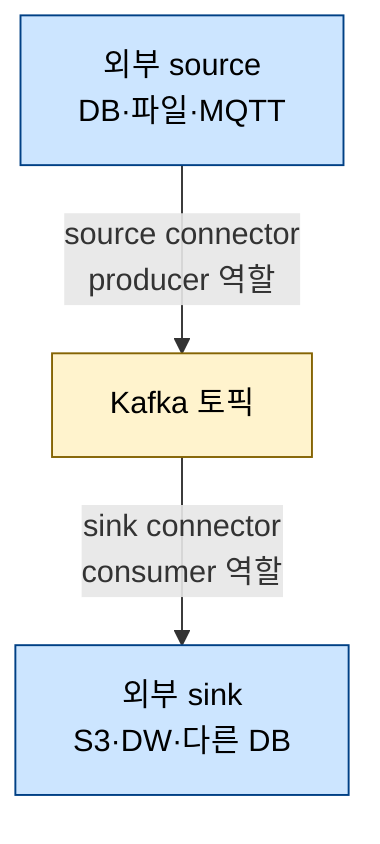
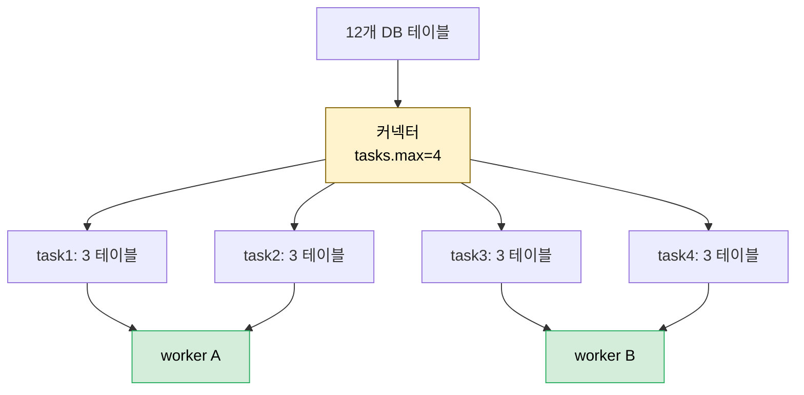

# Kafka Connect 아키텍처와 운영 모드


> [01-02.커넥터가 필요한 이유와 실전 사례](01-02.커넥터가%20필요한%20이유와%20실전%20사례.md)가 *왜 커넥터를 쓰는가*를 다뤘다면, 이 글은 Apache Kafka에 내장된 커넥터 프레임워크인 **Kafka Connect**가 *어떻게 구성되고 돌아가는가*를 다룹니다. DB나 파일 같은 외부 시스템과 Kafka를 잇는 producer·consumer를 매번 손으로 짜는 대신, Kafka Connect는 scalable·fault-tolerant한 표준 도구로 그 일을 대신합니다. 이 폴더의 02·03편이 다루는 Redpanda Connect와는 다른 도구이므로, 둘을 나란히 두고 차이를 보는 출발점이기도 합니다.


## 학습 목표

> Kafka Connect의 source/sink 모델과 Distributed/Standalone 운영 모드, worker·task 구조를 설명하고, 어떻게 스케일과 장애 복원이 이뤄지는지 말할 수 있는 것이 이 장의 목표입니다.

이 장을 다 읽고 다음 다섯 가지에 자신 있게 답할 수 있으면 학습이 완료됩니다.

1. source connector와 sink connector가 각각 Kafka의 producer·consumer 중 무엇에 해당하는지 설명할 수 있습니다.
2. Distributed Mode와 Standalone Mode를 언제 고르는지 구분할 수 있습니다.
3. worker와 task의 차이, 그리고 `group.id`가 무엇을 묶는지 설명할 수 있습니다.
4. Kafka Connect가 어디까지 읽었는지 추적하는 offset이 DB·파일에서 각각 무엇인지 말할 수 있습니다.
5. `tasks.max`가 어떻게 작업을 나누고 worker가 늘면 어떻게 재분배되는지 설명할 수 있습니다.


## 1. Kafka Connect란 무엇인가

> Kafka Connect는 외부 시스템과 Kafka 사이에서 데이터를 옮기는 표준 프레임워크입니다. 외부에서 읽어 Kafka로 보내는 source connector(producer 역할)와, Kafka에서 읽어 외부에 쓰는 sink connector(consumer 역할)로 나뉩니다.

회사에서 Kafka를 단독으로 쓰는 일은 드뭅니다. 대개 데이터베이스나 메시징 시스템 같은 다른 시스템을 Kafka에 연결하려 합니다. 정해진 DB 테이블의 데이터를 특정 토픽으로 옮기거나, 어떤 토픽의 데이터를 파일로 쓰는 식입니다. 이런 일을 producer·consumer로 직접 구현할 수도 있지만, 시간이 많이 들고 에러가 잦으며 스케일이 어렵습니다. 단순한 요구에도 고려할 특수 사례가 많기 때문입니다.

**Kafka Connect**는 이를 대신하는 프레임워크입니다. Apache Kafka의 일부이며 Kafka처럼 Apache 2.0 오픈소스입니다. 두 종류의 커넥터로 나뉩니다. **source connector**는 외부 시스템에서 데이터를 먼저 읽어 Kafka로 보내는, 본질적으로 Kafka로의 producer입니다. **sink connector**는 Kafka에서 데이터를 소비해 외부 시스템에 쓰는 consumer입니다.



목표는 데이터 이동을 위한 표준화된 도구입니다. Kafka처럼 scalable·fault-tolerant하고 correctness와 performance를 중시합니다. PostgreSQL·SQLite·MySQL 같은 DB, Amazon S3·Azure Blob Storage 같은 오브젝트 스토리지, MQTT·JMS 같은 메시징 프로토콜, Snowflake·Amazon Redshift 같은 데이터 웨어하우스까지 다양한 커넥터가 있습니다. 집필 시점에 Confluent Hub에만 약 200개가 등록돼 있고, 그 밖의 출처도 많습니다.

핵심 아이디어는 **partitioned stream**으로 표현할 수 있는 source·sink와 매끄럽게 통합하는 것입니다. 데이터를 여러 스트림으로 나눠 대량을 효율적으로 다룹니다. 각 스트림은 순서 같은 보장을 잃지 않도록 더 쪼개지 않는, 관련 데이터의 묶음입니다. Kafka에서는 토픽 파티션이 이 역할을 하고, DB에서는 개별 테이블을 하나의 데이터 스트림으로 봅니다.

긴 스트림에서 어디까지 읽었는지는 본 메시지를 일일이 기억하는 대신 **offset**으로 추적합니다. Kafka처럼 스트림 안의 위치를 씁니다. DB에서는 순차 ID나 행이 마지막으로 수정된 timestamp를, 파일에서는 마지막으로 읽은 줄이나 byte 위치를 offset으로 삼습니다.


## 2. Distributed Mode와 Standalone Mode

> Distributed Mode는 설정과 offset을 Kafka 토픽에 저장하고 같은 `group.id` worker들이 클러스터를 이뤄 부하를 나눕니다. Standalone Mode는 로컬에서 비저장으로 돌리는 테스트용이라 스케일과 offset 저장이 없습니다.

Kafka Connect의 이점을 온전히 누리려면 보통 **Distributed Mode**로 운영합니다. 이 모드에서는 모든 설정 데이터와 내부 offset을 Kafka 토픽에 저장합니다. 필요한 만큼 Connect 인스턴스를 띄우고, 같은 `group.id`를 가진 인스턴스들이 하나의 **Kafka Connect 클러스터**를 이룹니다. 이들은 9장에서 다룬 것과 같은 Kafka Rebalance Protocol로 서로 조정하며 부하를 나눕니다.

개발 환경이나 로컬 파일 접근이 필요한 특정 경우에는 이 이점을 포기하고 **Standalone Mode**로 돌리는 편이 낫습니다. 이 모드에서는 offset 같은 내부 데이터를 Kafka에 저장하지 않고 설정도 보관하지 않습니다. 로컬 머신에서 프로그램으로 실행하다 끝나면 멈춥니다. 개발 머신에서 테스트하기에 이상적이지만, 스케일이나 offset의 Kafka 저장은 제공하지 않습니다.

### 2.1 worker와 task

worker와 task는 Kafka Connect의 실행 단위입니다. **worker**는 Kafka Connect 클러스터의 일부로 도는 단일 프로세스로, 커넥터와 그 task를 관리합니다. **task**는 작업 단위입니다. source 파티션에서 데이터를 읽거나 대상에 쓰는 한 덩어리입니다. 각 task는 독립적으로 돌고 여러 worker에 분산되어 병렬 처리됩니다. worker들은 데이터가 효율적이고 fault-tolerant하며 scalable하게 처리되도록 서로 조정합니다.

Distributed Mode 설정은 `worker.properties` 파일로 시작합니다.

```properties
bootstrap.servers=localhost:9092
group.id=connect                              # 같은 값이면 한 클러스터
config.storage.topic=connect-config           # 커넥터 설정 저장
offset.storage.topic=connect-offset           # source 커넥터 offset 저장
status.storage.topic=connect-status           # 모니터링·task 상태 저장
key.converter=org.apache.kafka.connect.storage.StringConverter
value.converter=org.apache.kafka.connect.storage.StringConverter
plugin.path=/path/to/kafka/libs/              # 커넥터 플러그인 위치
```

`connect-distributed.sh worker.properties`로 시작하면 REST API가 기본 **포트 8083**에서 대기합니다. 저장 토픽이 없으면 Kafka Connect가 만들어 주는데, 권장 replication factor는 **3**입니다. 브로커가 3개 미만이면 Kafka Connect가 시작되지 않으므로, 테스트 환경에서는 `config.storage.replication.factor`(다른 토픽도 마찬가지)로 낮춥니다.


## 3. 스케일과 장애 복원

> 같은 `group.id` worker를 추가하면 클러스터가 커지고, 커넥터는 작업을 task로 쪼개 worker들에 분산합니다. worker가 죽거나 추가되면 consumer group처럼 Rebalance Protocol로 task를 재분배합니다.

Kafka Connect 클러스터는 같은 `group.id`로 Distributed Mode에서 도는 worker 하나 이상으로 구성됩니다. 이들은 consumer group의 consumer처럼 Kafka Rebalancing Protocol로 서로 조정합니다. worker가 죽거나 새 worker를 추가하면 남은 worker들이 task를 자기들끼리 재분배합니다. 한 클러스터에서 여러 커넥터를 동시에 돌릴 수 있어, 외부 DB에서 데이터를 읽으면서 동시에 다른 데이터를 제3의 시스템에 쓸 수 있습니다.



클러스터를 스케일하려면 같은 `group.id`로 worker를 더 추가하면 됩니다. 커넥터 자신이 작업을 독립적으로 도는 여러 task로 나눕니다. 예를 들어 12개 DB 테이블을 import하는데 `tasks.max`를 4로 두면, 각 task가 3개 테이블을 맡습니다. Kafka Connect는 이 task들을 여러 worker에 고르게 분산해 더 큰 데이터를 빠르게 Kafka로, Kafka에서 옮깁니다.

> **한계** — Kafka에 내장된 `FileStreamSource` 커넥터는 이 스케일·복원의 좋은 예가 아닙니다. 로컬 디스크 파일만 읽어 다른 worker에는 그 파일이 없기 때문입니다. 이 커넥터는 완성된 커넥터라기보다 proof of concept에 가까워 프로덕션에는 권장하지 않습니다(파일 통합은 FilePulse 같은 성숙한 커넥터를 씁니다).

`FileStreamSource`에는 학습용으로 알아 둘 동작이 하나 있습니다. Kafka Connect를 재시작해도 파일을 처음부터 다시 읽지 않고 *파일 안 위치를 기억*해 새 항목만 읽습니다. 다만 마지막으로 읽은 줄을 기억하는 방식이라, 파일의 *기존 데이터를 변경*해도 새 메시지가 생기지 않습니다. 이 커넥터는 *append된 데이터만* 감지합니다. 이미 만들어진 커넥터가 있으면 대개 그것을 쓰는 편이 낫고, 없더라도 데이터를 partitioned stream으로 표현할 수 있으면 producer·consumer로 재구현하기보다 커스텀 Connect 커넥터를 작성하길 권장합니다.


## 4. 실무 적용

> Kafka Connect는 Distributed Mode + RF 3을 기본으로 두고, 토픽 자동 생성과 offset 저장 토픽을 어떻게 관리할지 먼저 정합니다.

프로덕션에서는 Distributed Mode가 기본입니다. 저장 토픽 3종(config·offset·status)이 클러스터 상태를 들고 있으므로 RF 3을 지키고, 브로커가 3개 이상인지 먼저 확인합니다. 로컬 파일을 다뤄야 하는 일회성 작업이나 개발 검증에서만 Standalone을 씁니다.

`tasks.max`는 병렬화 상한일 뿐, 실제 task 수는 데이터 구조가 정합니다. 소스 토픽 파티션이 4개면 `tasks.max`를 10으로 올려도 task는 4개를 넘지 못합니다. 그래서 worker를 늘리기 전에 *소스가 몇 개의 독립 스트림으로 나뉘는지*(테이블 수, 파티션 수)를 먼저 셉니다.

이 폴더의 02·03편이 다루는 Redpanda Connect와 혼동하지 않도록 주의합니다. 둘 다 "커넥터"지만 Kafka Connect는 worker 클러스터 + REST API 8083 + Kafka 토픽 기반 상태 저장이고, Redpanda Connect는 Bloblang 매핑 기반의 다른 도구입니다. 어느 쪽을 고를지는 [01-02 §의사결정 프레임워크](01-02.커넥터가%20필요한%20이유와%20실전%20사례.md)를 따릅니다.


## 5. 면접 대비 Q&A

> Kafka Connect의 구조를 묻는 질문은 "worker와 task가 뭐가 다른가", "왜 RF 3인가" 같은 *운영 단위*를 파고듭니다.

### Q1. source connector와 sink connector는 각각 무엇에 해당하나요?

source connector는 외부 시스템에서 데이터를 읽어 Kafka로 보내는 *producer 역할*이고, sink connector는 Kafka에서 데이터를 소비해 외부 시스템에 쓰는 *consumer 역할*입니다. MirrorMaker는 예외로 Kafka에서 Kafka로 복제합니다.

### Q2. Distributed Mode와 Standalone Mode는 언제 고르나요?

Distributed Mode는 설정과 offset을 Kafka 토픽에 저장하고 같은 `group.id` worker들이 클러스터를 이뤄 스케일·장애 복원을 제공하므로 프로덕션 기본입니다. Standalone Mode는 로컬 파일 접근이 필요하거나 개발 머신에서 테스트할 때 쓰며, 비저장이라 스케일과 offset 저장이 없습니다.

### Q3. worker와 task의 차이는 무엇인가요?

worker는 클러스터의 일부로 도는 단일 프로세스로 커넥터와 task를 관리합니다. task는 작업 단위로, source 파티션을 읽거나 대상에 쓰는 한 덩어리입니다. 한 커넥터의 작업이 여러 task로 쪼개지고, 그 task들이 여러 worker에 분산됩니다.

### Q4. Kafka Connect는 어디까지 읽었는지 어떻게 기억하나요?

긴 스트림이라 본 메시지를 일일이 기억하지 않고 offset으로 추적합니다. Kafka는 토픽 offset, DB는 순차 ID나 수정 timestamp, 파일은 마지막으로 읽은 줄이나 byte 위치를 offset으로 삼습니다. source connector의 offset은 `offset.storage.topic`에 저장됩니다.

### Q5. `tasks.max`를 소스 파티션 수보다 크게 잡으면 어떻게 되나요?

실제 task 수는 커넥터나 데이터 구조(소스 토픽 파티션 수, 테이블 수)가 제한하므로 추가 병렬화가 일어나지 않습니다. 12개 테이블에 `tasks.max=4`면 task당 3개 테이블을 맡고, 파티션이 4개인데 10으로 잡아도 task는 4개를 넘지 못합니다.


## 관련 문서

> 이 글이 Kafka Connect *프레임워크 구조*라면, 커넥터 일반론과 다음 단계(REST API·실전)는 아래 문서가 맡습니다.

- [01-01. SourceSink](01-01.%20SourceSink%20.md) — Source·Sink의 기본 모델 (도구 무관 개념)
- [01-02.커넥터가 필요한 이유와 실전 사례](01-02.커넥터가%20필요한%20이유와%20실전%20사례.md) — 커넥터 vs 커스텀 코드 판단, Kafka Connect 실전 사례
- [04-02.Kafka Connect REST API·worker 설정·SMT](04-02.Kafka%20Connect%20REST%20API·worker%20설정·SMT.md) — 클러스터·커넥터를 REST로 관리하고 메시지를 변환하는 법
- [04-03.JDBC Source vs Debezium CDC 실전](04-03.JDBC%20Source%20vs%20Debezium%20CDC%20실전.md) — 실제 DB 커넥터로 데이터를 옮기는 두 방식
