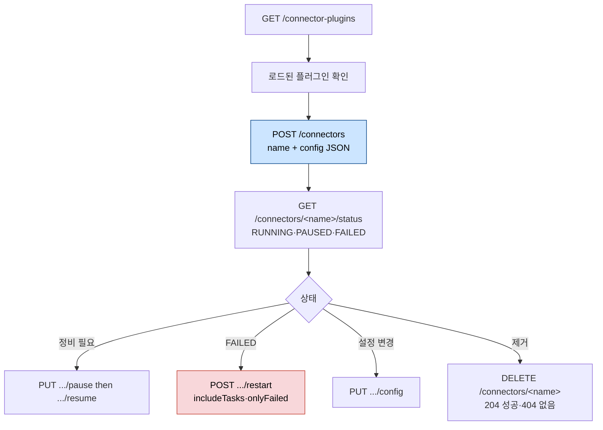
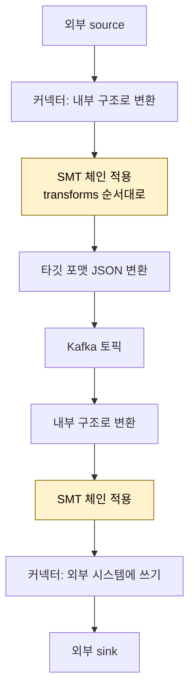

# Kafka Connect REST API·worker 설정·SMT


> [04-01.Kafka Connect 아키텍처와 운영 모드](04-01.Kafka%20Connect%20아키텍처와%20운영%20모드.md)가 Kafka Connect의 *구조*를 다뤘다면, 이 글은 그 클러스터와 커넥터를 *실제로 어떻게 설정하고 조작하는가*를 다룹니다. worker 전체에 걸리는 설정과 커넥터별 설정이 어떻게 갈리는지, REST API로 커넥터를 만들고 멈추고 재시작하는 법, 에러를 어디까지 견딜지, 그리고 메시지를 옮기는 도중 가볍게 바꾸는 SMT까지 운영의 손잡이를 정리합니다.


## 학습 목표

> worker config와 connect config의 차이, REST API로 커넥터를 관리하는 법, 에러 처리와 SMT 설정을 말할 수 있는 것이 이 장의 목표입니다.

이 장을 다 읽고 다음 다섯 가지에 자신 있게 답할 수 있으면 학습이 완료됩니다.

1. worker config와 connect config가 각각 무엇을 설정하는지 구분할 수 있습니다.
2. converter가 무엇을 하고 왜 프로덕션에서 JsonConverter·AvroConverter를 권장하는지 설명할 수 있습니다.
3. REST API로 커넥터를 생성·수정·pause·restart하는 흐름을 말할 수 있습니다.
4. `errors.tolerance`와 dead-letter queue가 에러를 어떻게 다루는지 설명할 수 있습니다.
5. SMT가 무엇이고 `ValueToKey`+`ExtractField`가 왜 함께 쓰이는지 설명할 수 있습니다.


## 1. worker 설정과 connect 설정

> Kafka Connect에는 worker 전체에 걸리는 worker config와 REST API로 주는 커넥터별 connect config 두 종류가 있습니다. worker config는 클러스터 식별·저장 토픽·converter·플러그인 경로 같은 공통 토대를 정합니다.

Kafka Connect의 설정은 두 종류입니다. **worker config**는 Kafka Connect가 도는 worker를 설정하며 그 worker의 모든 커넥터에 유효합니다. **connect config**는 REST API로 제공되어 worker 위에서 도는 실제 커넥터를 설정합니다. connect 설정은 내부 config 토픽을 통해 worker들에 분산됩니다.

`bootstrap.servers`는 Kafka 클러스터 주소입니다. `group.id`는 클러스터의 이름이자 식별자인데, 전통적인 consumer group과는 무관합니다(`connect.id`가 더 나은 이름이었을 것입니다). 같은 `group.id`를 쓰는 모든 worker가 한 클러스터에 속합니다.

저장 토픽 세 종류가 클러스터를 관리합니다. config 토픽(`config.storage.topic`)은 개별 커넥터 설정을, status 토픽(`status.storage.topic`)은 모니터링과 task 정보를, offset 토픽(`offset.storage.topic`)은 source 커넥터의 offset(예: DB 항목 ID)을 저장합니다.

메시지를 인코딩·디코딩하는 converter는 `key.converter`·`value.converter`로 정합니다. `StringConverter` 외에 Avro·Protobuf·JSON Schema·simple JSON·byte array용이 있고, Avro·Protobuf·JSON Schema는 Schema Registry가 필요합니다. converter를 커넥터 설정에 명시하길 권장하지만 worker 설정에도 여전히 필요하며, 프로덕션에서는 `StringConverter` 대신 `JsonConverter`나 `AvroConverter`를 기본 value converter로 권장합니다. `JsonConverter`의 `key/value.converter.schemas.enable`은 스키마를 매 메시지에 기록해 메시지가 verbose해지므로, Schema Registry를 쓰는 `AvroConverter`(`key/value.converter.schema.registry.url`)가 낫습니다.

`plugin.path`는 커넥터·converter·transformation 플러그인 위치이며 콤마로 여러 경로를 지정합니다.

### 1.1 알아 둘 worker 파라미터

worker에는 운영을 가르는 파라미터가 더 있습니다. `topic.creation.enable`(기본 enabled)은 토픽 자동 생성을 켜고 끕니다. 토픽을 IaC로 직접 관리하려면 끕니다. `exactly.once.source.support`(기본 disabled)는 source 커넥터의 exactly-once를 켭니다. 기존 클러스터에서 바꿀 때는 먼저 `preparing`으로, 그다음 `enabled`로 두는 중간 단계가 필요합니다.

`session.timeout.ms`는 worker가 inactive로 간주되는 시간입니다. 낮추면 다운타임이 줄지만 불필요한 rebalance가 늘 수 있습니다. `request.timeout.ms`는 응답 최대 대기 시간으로, 초과하면 잘못됐다고 보고 retry합니다. 너무 낮으면 불필요한 retry가 늘고 요청이 영영 성공으로 표시되지 않아 커넥터가 데이터를 처리하지 못할 수 있습니다. `offset.flush.interval.ms`·`offset.flush.timeout.ms`는 flush 빈도와 시간을 정합니다. 작은 메시지가 많으면 flush가 오래 걸리므로 더 자주 flush하거나 timeout을 늘립니다. 그러지 않으면 "Failed to flush, timed out..." 로그와 함께 endless loop에 빠질 수 있습니다.

커넥터 설정으로 클러스터 파라미터를 override할 수도 있습니다. `connector.client.config.override.policy`로 허용 범위를 정한 뒤, 커넥터 설정에서 `producer.override`·`consumer.override` 접두사로 조정합니다(예: `consumer.override.fetch.max.bytes`). 보안 측면에서는 config providers로 파라미터에 변수를 쓸 수 있습니다(`config.providers`에 alias 목록, `config.providers.<name>.class`로 클래스 참조). REST API의 포트·호스트·프로토콜은 `listeners`로 정하며 기본은 8083 HTTP입니다.


## 2. REST API로 클러스터·커넥터 조회

> Kafka Connect는 완전히 JSON 기반 REST API로 관리하며, 기본 인증·인가가 없습니다. 그래서 프로덕션에서는 사람의 접근을 막고 CI/CD로 커넥터를 관리해야 합니다.

Kafka Connect의 REST API는 기본적으로 인증·인가를 제공하지 않습니다. basic auth를 설정할 수 있지만 그러면 클러스터에 접근 가능한 누구나 모든 작업을 할 수 있습니다. 프로덕션에서는 사람이 이 API에 접근하지 않도록 하고 CI/CD 파이프라인으로 커넥터를 관리하길 권장합니다.

루트 URL(`GET /`)은 Kafka 버전·commit ID·연결된 `kafka_cluster_id`를 JSON으로 줍니다. API는 완전히 JSON 기반이라 요청도 응답도 JSON 객체입니다.



조회 엔드포인트는 다음과 같습니다. `GET /connector-plugins`는 로드된 플러그인(class·type·version)을 보여 줍니다. 필요한 플러그인이 없으면 커넥터 생성 시 에러와 설치된 플러그인 목록을 받습니다. `GET /connectors`는 실행 중 커넥터 목록을, `GET /connectors/<connector>`는 type·config·tasks를 줍니다(`?expand=info`로 전체). `GET /connectors/<name>/config`는 설정만, `GET /connectors/<connector>/status`는 커넥터와 각 task의 state(running·paused·failed)와 에러 설명을 줍니다(`?expand=status`로 전체). `GET /connectors/<connector>/topics`는 실제 사용 토픽을 보여 주고, `PUT .../topics/reset`으로 리셋할 수 있으나 운영 효과는 없습니다.


## 3. 커넥터 생성·수정·삭제

> 커넥터는 REST API로 만들고 바꾸고 지웁니다. POST로 생성, PUT으로 설정 변경, pause/resume으로 일시 정지, restart로 실패 복구합니다.

`DELETE /connectors/<connector>`는 성공 시 HTTP 204, 없으면 404를 줍니다. `POST /connectors`에 name과 config JSON을 보내면 커넥터가 생기고, 이미 있으면 에러가 납니다.

```json
{
  "name": "customers-source",
  "config": {
    "connector.class": "FileStreamSource",
    "tasks.max": "1",
    "file": "/tmp/customers.txt",
    "topic": "customers"
  }
}
```

설정은 `PUT /connectors/<connector>/config`로 바꿉니다(`connector.class`까지 포함한 config만 보냄). `PUT .../pause`로 멈추면 state가 PAUSED가 되는데, 연결한 외부 시스템을 정비할 때 커넥터가 실패하거나 불일치 상태의 데이터를 잘못 쓰는 위험을 막아 줍니다. `PUT .../resume`으로 재개합니다.

커넥터나 task는 실패할 수 있습니다. Kafka Connect가 retry로 대부분의 일시 에러를 보정하지만, 긴 네트워크 문제나 메시지 데이터 구조 문제에는 부족합니다. 문제를 해결한 뒤 `POST /connectors/<connector>/restart?includeTasks=true&onlyFailed=true`로 커넥터와 실패한 task를 함께 재시작합니다. `POST /connectors/<connector>/tasks/<taskId>/restart`로 개별 task만 재시작할 수도 있습니다.

### 3.1 일반 커넥터 설정

커넥터에서 가장 중요하면서도 자주 어려운 파라미터는 `name`입니다. 식별자이자 REST API 경로의 일부이고 유일한 메타데이터라, 커넥터가 많은 클러스터일수록 믿을 만한 명명 규칙이 중요합니다. `connector.class`는 커넥터 타입을 정합니다(예: `io.confluent.connect.jdbc.JdbcSourceConnector`, `io.debezium.connector.postgresql.PostgresConnector`). `tasks.max`는 작업을 쪼갤 최대 task 수이지만, 실제는 소스 토픽 파티션 수 등 데이터 구조가 제한합니다.

sink 커넥터는 `topics`(목록)나 `topic.regex`(정규식)로 소비할 토픽을 정합니다. 시간이 지나며 토픽이 바뀌면 정규식이 유용한데, 일관된 명명 규칙이 전제입니다. sink는 `connect`+커넥터명 접두사 consumer group이 기본이며 `consumer.group.id`로 override합니다(worker 설정에서 허용해야 함). `exactly.once.support`는 EOS를 required로 할지 requested(기본)로 할지 정합니다. required인데 클러스터가 미지원이면 커넥터가 실패합니다.


## 4. 에러 처리

> 기본은 에러 하나에 커넥터 전체가 실패합니다(fault tolerance 0). `errors.tolerance=all`로 faulty record를 건너뛰고, sink는 dead-letter queue로, 외부 접근 실패는 retry 파라미터로 다룹니다.

기본적으로 Kafka Connect는 에러를 만나면 커넥터를 실패시킵니다. 즉 fault tolerance가 0입니다. `errors.tolerance`를 `none`(기본)에서 `all`로 바꾸면 faulty record를 건너뜁니다. 이때 `errors.log.enable=true`를 함께 두길 권장하는데, 그러지 않으면 비허용 에러만 로깅되기 때문입니다. record를 건너뛰도록 설정했다면 alert·notification을 함께 두길 권장합니다.

`errors.log.include.messages`는 faulty record 자체를 에러 로그에 포함할지 정합니다(기본 off, 민감 데이터가 들어갈 수 있어서). sink 커넥터는 메시지를 dead-letter queue 토픽으로 보낼 수도 있는데, 먼저 `errors.deadletterqueue.topic.name`으로 설정해야 합니다.

처리 불가 record 외에 외부 시스템 접근 문제로도 커넥터가 실패합니다. 이때 `errors.retry.timeout`(retry 최대 시간 ms, 기본 0=retry 안 함)과 `errors.retry.delay.max.ms`(retry 간 최대 간격)로 retry를 설정합니다. JDBC 같은 특정 커넥터는 자체 retry 파라미터를 둡니다. DB 연결은 `connection.attempts`(시도 횟수)와 `connection.backoff.ms`(간격)로, 기본은 3회 10초 간격으로 시도한 뒤 실패합니다. DB 정비나 일시 네트워크 장애에는 기본 30초가 부족할 수 있어 더 넉넉히 주길 권장합니다. 커넥터가 한번 실패하면 수동 재시작이 필요하기 때문입니다. JDBC sink는 `max.retries`(기본 10)와 `retry.backoff.ms`(기본 3초)로 쓰기 실패를 재시도합니다.


## 5. SMT — Single Message Transformations

> SMT는 메시지를 옮기는 도중 필드를 rename·mask하거나 value를 key로 옮기는 가벼운 변환입니다. source·sink 양쪽에 쓰이지만 완전한 ETL 도구는 아니라, 복잡한 변환은 Kafka Streams로 넘깁니다.

데이터를 A에서 B로 옮기는 것만으로 부족할 때가 많습니다. SMT(Single Message Transformations)는 필드 rename, 데이터 mask, value를 key로 옮기기 같은 간단한 변환을 해 줍니다. source 커넥터에서는 외부에서 가져온 데이터를 내부 구조로 바꾼 뒤 SMT를 적용하고 타깃 포맷(JSON)으로 변환해 토픽에 씁니다. sink는 반대 방향으로, 토픽 포맷을 내부 구조로 바꾸고 SMT를 적용한 뒤 외부 시스템에 씁니다.



SMT는 남용하지 않습니다. 완전한 ETL 도구가 아니므로 복잡한 변환은 Kafka Streams 같은 스트림 처리 프레임워크를 씁니다. 설정은 REST API에 보내는 JSON에 둡니다. `transforms`에 실행할 변환 목록을 콤마로 적고(이름은 자유), 각 변환마다 최소한 Java 클래스명(`transforms.<name>.type`)과 추가 설정을 줍니다. 변환은 목록 순서대로 실행됩니다.

대표적인 SMT는 다음과 같습니다. `ReplaceField`는 필드를 rename하거나 drop합니다(`org.apache.kafka.connect.transforms.ReplaceField$Value`, `exclude`로 drop, `renames=foo:bar`). 많은 source 커넥터가 value만 두고 key를 안 두므로, `ValueToKey`로 value의 일부를 key로 옮깁니다. 다만 key가 `{field:value}` JSON 객체가 되므로, `ExtractField$Key`로 특정 필드만 뽑아 단순 string key로 만듭니다. 이 둘은 그래서 함께 쓰입니다. `MaskField`는 특정 필드를 null로 만들어 민감 정보가 외부로 나가지 않게 합니다. Debezium 같은 커넥터는 자체 SMT를 더합니다.


## 6. 실무 적용

> 프로덕션은 REST API를 사람이 직접 만지지 않고 CI/CD로 관리하며, converter는 JsonConverter·AvroConverter, 에러는 tolerance + dead-letter queue + 모니터링으로 묶습니다.

REST API는 인증이 없으므로 프로덕션에서는 사람의 직접 호출을 막고 커넥터 설정을 CI/CD로 버전 관리합니다. 커넥터 JSON을 git에 두고 파이프라인이 POST·PUT으로 적용하면, 누가 무엇을 바꿨는지 추적되고 잘못된 변경을 되돌리기 쉽습니다.

converter는 `StringConverter` 대신 `JsonConverter`나 `AvroConverter`를 기본으로 둡니다. 스키마 진화가 중요하면 Schema Registry를 쓰는 `AvroConverter`가 낫고, `schemas.enable=true`인 `JsonConverter`는 메시지가 verbose해지므로 피합니다.

에러 처리는 세 손잡이를 함께 잡습니다. `errors.tolerance=all`로 한 건의 나쁜 record가 전체를 멈추지 않게 하고, sink는 `errors.deadletterqueue.topic.name`으로 그 record를 따로 모으며, 건너뛴 record를 놓치지 않도록 alert를 답니다. JDBC 커넥터는 DB 정비를 견디도록 `connection.attempts`·`connection.backoff.ms`를 기본 30초보다 넉넉히 둡니다.


## 7. 면접 대비 Q&A

> Kafka Connect 운영 질문은 "왜 REST API에 사람 접근을 막나", "ValueToKey만 쓰면 왜 부족한가" 같은 *운영의 빈틈*을 파고듭니다.

### Q1. worker config와 connect config는 무엇이 다른가요?

worker config는 worker 프로세스 자체를 설정해 그 worker의 모든 커넥터에 유효하며, bootstrap.servers·group.id·저장 토픽·converter·plugin.path 같은 토대를 정합니다. connect config는 REST API로 주는 커넥터별 설정으로, 내부 config 토픽을 통해 worker들에 분산됩니다.

### Q2. 프로덕션에서 REST API를 사람이 직접 쓰지 말라는 이유는?

Kafka Connect REST API는 기본 인증·인가가 없어 접근 가능한 누구나 모든 작업을 할 수 있습니다. 그래서 사람의 직접 접근을 막고 CI/CD 파이프라인으로 커넥터를 관리해, 변경을 추적하고 되돌릴 수 있게 하길 권장합니다.

### Q3. `errors.tolerance=all`을 쓸 때 함께 챙길 것은?

`errors.log.enable=true`를 함께 켭니다. 그러지 않으면 비허용 에러만 로깅되어 건너뛴 record를 나중에 확인할 수 없습니다. sink면 `errors.deadletterqueue.topic.name`으로 나쁜 record를 따로 모으고, 건너뛰기가 조용히 데이터를 잃지 않도록 alert·notification을 둡니다.

### Q4. `ValueToKey`만 쓰면 왜 부족하고 `ExtractField`가 왜 함께 필요한가요?

`ValueToKey`는 value의 필드를 key로 옮기지만, key가 `{product_id: <ID>}` 같은 JSON 객체가 됩니다. 단순 string key가 필요하면 `ExtractField$Key`로 그 필드값만 뽑아야 해서 둘을 함께 씁니다.

### Q5. SMT로 하면 안 되는 일은 무엇인가요?

SMT는 rename·mask·value→key 이동 같은 *단일 메시지* 수준의 가벼운 변환만 합니다. 조인·집계처럼 여러 메시지를 다루는 복잡한 변환은 완전한 ETL이 아닌 SMT로 하면 안 되고, Kafka Streams 같은 스트림 처리 프레임워크를 씁니다.


## 관련 문서

> 이 글이 Kafka Connect *운영과 변환*이라면, 프레임워크 구조와 실제 DB 커넥터는 아래 문서가 맡습니다.

- [04-01.Kafka Connect 아키텍처와 운영 모드](04-01.Kafka%20Connect%20아키텍처와%20운영%20모드.md) — worker·task·Distributed Mode 구조 (이 글의 전제)
- [04-03.JDBC Source vs Debezium CDC 실전](04-03.JDBC%20Source%20vs%20Debezium%20CDC%20실전.md) — 여기서 배운 설정·SMT를 실제 DB 커넥터에 적용
- [01-02.커넥터가 필요한 이유와 실전 사례](01-02.커넥터가%20필요한%20이유와%20실전%20사례.md) — 커넥터 vs 커스텀 코드 판단 기준
