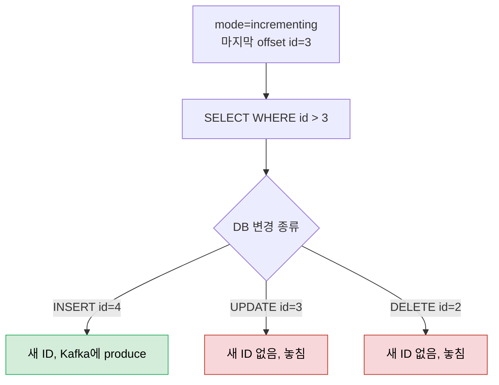
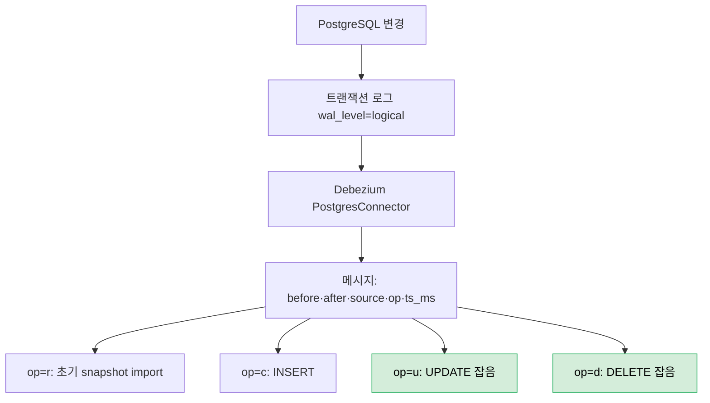

# JDBC Source vs Debezium CDC 실전


> [04-02.Kafka Connect REST API·worker 설정·SMT](04-02.Kafka%20Connect%20REST%20API·worker%20설정·SMT.md)에서 배운 커넥터 설정·SMT를 실제 데이터베이스에 적용합니다. DB의 변경을 Kafka로 가져오는 길은 두 가지입니다. 테이블을 주기적으로 query하는 JDBC Source Connector와, 트랜잭션 로그를 읽는 Debezium CDC Connector입니다. 둘 다 customers 테이블을 Kafka로 옮기지만, UPDATE·DELETE를 잡느냐에서 갈립니다. 이 차이를 알면 "왜 폴링으로는 충분하지 않은가"가 분명해집니다.


## 학습 목표

> JDBC Source Connector의 mode별 동작과 한계, Debezium CDC가 트랜잭션 로그로 그 한계를 어떻게 넘는지 설명할 수 있는 것이 이 장의 목표입니다.

이 장을 다 읽고 다음 다섯 가지에 자신 있게 답할 수 있으면 학습이 완료됩니다.

1. JDBC Source의 `topic.prefix`가 토픽명을 어떻게 만들고 왜 필요한지 설명할 수 있습니다.
2. `mode=incrementing`이 왜 UPDATE를 놓치는지 설명할 수 있습니다.
3. JDBC Source의 timestamp·bulk mode의 한계를 각각 말할 수 있습니다.
4. Debezium이 CDC를 위해 PostgreSQL에 무엇을 요구하는지(`wal_level`·REPLICATION) 설명할 수 있습니다.
5. Debezium 메시지의 `op` 값(c·u·d·r)이 각각 무엇을 뜻하는지 설명할 수 있습니다.


## 1. JDBC Source Connector — 테이블을 query해 가져오기

> JDBC Source Connector는 DB 테이블을 주기적으로 query해 Kafka로 옮깁니다. `connection.url`로 DB에 붙고, `table.whitelist`로 테이블을 고르며, `topic.prefix`+테이블명으로 토픽을 만듭니다.

지금까지 모든 고객이 DB에 저장돼 있었는데 이제 Kafka에서도 쓰고 싶다고 합시다. JDBC Source Connector로 `customers` 테이블을 `sqlite_customers` 토픽으로 옮깁니다. 커넥터 설정은 다음과 같습니다.

```json
{
  "name": "customers-jdbc-source-connector",
  "config": {
    "connector.class": "io.confluent.connect.jdbc.JdbcSourceConnector",
    "connection.url": "jdbc:sqlite:/path/to/customers.db",
    "value.converter": "org.apache.kafka.connect.json.JsonConverter",
    "value.converter.schemas.enable": false,
    "table.types": "TABLE",
    "table.whitelist": "customers",
    "topic.prefix": "sqlite_",
    "mode": "incrementing",
    "incrementing.column.name": "id",
    "batch.size": 1000
  }
}
```

`connection.url`은 세 가지를 담습니다. 연결 타입(`jdbc`), DB 타입(`sqlite`), DB 위치(파일 경로)입니다. worker의 value.converter를 `JsonConverter`로 override하고 `schemas.enable=false`로 단순 JSON을 씁니다. `table.types`는 query할 DB 객체 타입으로, 기본 `TABLE` 외에 `VIEW`도 있습니다(버전 업데이트의 뜻밖의 결과를 피하려 명시하는 편이 낫습니다). `table.whitelist`로 읽을 테이블을, 반대로 `table.blacklist`로 제외할 테이블을 정합니다.

토픽명은 `topic.prefix` 값과 테이블명을 합쳐 만듭니다. `sqlite_` + `customers` = `sqlite_customers`입니다. 이 파라미터는 두 가지를 합니다. 커넥터에 토픽을 쉽게 묶고, 테이블명과 우연히 같은 기존 토픽에 잘못 produce하는 것을 막습니다. Kafka Connect는 DB 항목을 JSON으로 자동 변환하며 컬럼명이 객체 key가 됩니다.


## 2. JDBC Source의 mode와 한계

> `mode=incrementing`은 새 ID만 가져와 UPDATE·DELETE를 놓칩니다. timestamp mode는 timestamp 컬럼이 없거나 동시 변경이 있으면 놓치고, 전체를 보장하는 bulk mode는 매번 전체 테이블을 다시 읽어 비효율적입니다.

Kafka Connect는 직전에 저장한 offset을 기준으로 새 레코드를 query합니다. `mode=incrementing`에 `incrementing.column.name=id`면, 마지막 처리 ID가 3일 때 `SELECT * FROM customers WHERE id > 3` 같은 query를 실행합니다. 그래서 **새 ID, 즉 완전히 새 항목이 들어올 때만** 메시지를 produce합니다. 새 행을 INSERT하면 Kafka에 나타나지만, 기존 행을 UPDATE하면 새 ID가 없으므로 아무 메시지도 생기지 않습니다.



대안으로 `mode=timestamp`에 `timestamp.column.name=lastupdated`를 두면 변경을 잡아 새 timestamp로 메시지를 씁니다. `timestamp+incrementing` 조합도 가능하며, 해당 컬럼들이 monotonically 증가해야 합니다. ID는 offset으로 쓰이므로 *엄격히 증가*해야 합니다. 삭제 후 ID를 재사용해 더 작은 ID가 들어오면 새 항목으로 인식하지 못하고, 삭제 자체도 새 ID를 만들지 않아 인식하지 못합니다.

timestamp mode에도 한계가 있습니다. 모든 테이블에 쓸 수 있는 timestamp 컬럼이 있는 것은 아닙니다(주소만 담은 테이블에서 도시를 옮기면 변경이 안 보입니다). 더 곤란한 것은 timestamp 컬럼이 있어도 모든 데이터를 보장하지 못한다는 점입니다. 같은 timestamp로 두 변경이 동시에 일어나면, Kafka Connect가 첫 항목을 읽은 뒤 그 timestamp까지 다 읽었다고 보고 두 번째를 놓칠 수 있습니다. timestamp 정밀도에 따라 확률이 오르내릴 뿐 0이 되지는 않습니다.

> **한계** — JDBC Source로 모든 변경을 잡는 유일한 방법은 bulk mode인데, 매번 전체 테이블을 Kafka로 다시 싣습니다. 비효율이 커서 권장하지 않습니다. 이 문제는 다음 절의 CDC 커넥터(Debezium)로 풉니다.


## 3. Debezium CDC Connector — 트랜잭션 로그를 읽기

> CDC는 데이터 자체가 아니라 *모든 변경*을 모니터합니다. 관계형 DB는 트랜잭션 로그를 읽으므로 INSERT·UPDATE·DELETE를 모두 잡습니다. PostgreSQL은 `wal_level=logical`과 REPLICATION 권한이 필요합니다.

CDC(change data capture)는 데이터 자체가 아니라 데이터 소스의 모든 변경을 모니터하는 개념입니다. 구현은 시스템마다 다른데, 관계형 DB는 모든 변경이 기록되는 트랜잭션 로그를 모니터합니다. PostgreSQL용 Debezium 커넥터를 준비하려면 `postgresql.conf`의 `wal_level`을 `logical`로 두고 서버를 재시작해야 합니다. 그러지 않으면 필요한 변경을 모니터할 수 없습니다. 그리고 CDC 커넥터에 필요한 권한을 위해 DB 사용자에게 **REPLICATION** 권한을 줍니다.

커넥터 설정은 JDBC Source와 비슷한 이름이 많습니다.

```json
{
  "name": "customers_debezium_connector",
  "config": {
    "connector.class": "io.debezium.connector.postgresql.PostgresConnector",
    "database.hostname": "localhost",
    "database.port": "5432",
    "database.user": "customers_user",
    "database.password": "supersecret",
    "database.dbname": "customers",
    "value.converter": "org.apache.kafka.connect.json.JsonConverter",
    "value.converter.schemas.enable": false,
    "plugin.name": "pgoutput",
    "publication.autocreate.mode": "filtered",
    "topic.prefix": "debezium",
    "table.include.list": "public.customers"
  }
}
```

테이블 화이트리스트가 JDBC의 `table.whitelist`와 달리 `table.include.list`라는 점, `plugin.name`(여기서는 `pgoutput`)과 `publication.autocreate.mode`가 새롭다는 점이 다릅니다. 둘은 PostgreSQL에서 데이터를 어떻게 추출할지 정합니다. 토픽명은 `topic.prefix` + `.` + `table.include.list` = `debezium.public.customers`입니다.


## 4. Debezium 메시지 구조와 JDBC와의 차이

> Debezium 메시지는 `before`·`after`·`source`·`op`·`ts_ms`로 변경을 설명합니다. `op`는 c(create)·u(update)·d(delete)·r(초기 snapshot)이며, JDBC Source와 달리 UPDATE를 잡는 것이 핵심 차이입니다.

Debezium은 각 메시지에 데이터의 출처를 설명하는 정보를 덧붙입니다. 가장 중요한 `after`는 변경된 행의 실제 데이터이고, `before`는 설정 시 행의 이전 데이터를 담습니다(보통 불필요). `source`는 데이터 출처와 기술 정보(version·connector·lsn·table·txId 등)를, `op`는 변경을 일으킨 연산을 나타냅니다. `op=c`는 create, `u`는 update, `d`는 delete이고, **`op=r`은 어떤 DB 연산이 아니라 Debezium의 초기 테이블 snapshot으로 import된 메시지**입니다. `ts_ms`는 연산 timestamp, `transaction`은 트랜잭션 안이었는지를 나타냅니다.



INSERT하면 `op=c` 메시지가, 처음 커넥터를 만들면 기존 행이 `op=r`로 들어옵니다. 그리고 JDBC Source와 결정적으로 다른 점이 있습니다. 기존 행을 UPDATE하면 Debezium은 `op=u` 메시지로 그 변경을 Kafka에 반영합니다. JDBC `mode=incrementing`이 UPDATE를 놓쳤던 자리를, 트랜잭션 로그를 읽는 CDC는 빠짐없이 잡습니다. 대개 전체 change entry가 아니라 변경된 데이터만 필요하므로, `ExtractNewRecordState` SMT로 `after` 값만 Kafka에 쓰게 합니다.

| 기준 | JDBC Source (incrementing) | Debezium CDC |
|------|---------------------------|--------------|
| 변경 감지 방식 | 테이블 주기 query (`WHERE id > N`) | 트랜잭션 로그 모니터 |
| INSERT | 잡음 | 잡음 (`op=c`) |
| UPDATE | **놓침** (새 ID 없음) | 잡음 (`op=u`) |
| DELETE | **놓침** | 잡음 (`op=d`) |
| DB 요구사항 | 증가 ID/timestamp 컬럼 | `wal_level=logical`·REPLICATION |
| 메시지 | 행 그대로 JSON | before/after/source/op 래핑 |

> **한계** — Debezium은 더 강력하지만 DB 설정(`wal_level`·REPLICATION 권한·publication)을 바꿔야 하고 운영 부담이 큽니다. 단순히 새 행만 늘어나는 append-only 성격의 테이블이라면 JDBC `incrementing`으로 충분할 수 있습니다. CDC를 Outbox 대안으로 보는 관점은 [05_ConsistencyPattern/04-01.CDC](../05_ConsistencyPattern/04-01.CDC.md)에서 더 깊게 다룹니다.


## 5. 실무 적용

> 새 행만 늘면 JDBC incrementing, UPDATE·DELETE까지 잡아야 하면 Debezium CDC를 씁니다. 어느 쪽이든 `topic.prefix`로 토픽 오염을 막고 converter를 명시합니다.

테이블이 append-only에 가깝고(로그·이벤트 적재) UPDATE·DELETE를 추적할 필요가 없으면 JDBC `mode=incrementing`이 단순하고 가볍습니다. 반면 고객·주문처럼 행이 *수정·삭제되는 엔티티*를 Kafka로 옮겨야 하면 JDBC는 변경을 놓치므로 Debezium CDC를 씁니다. bulk mode는 전체를 보장하지만 매번 전체 재적재라 거의 쓰지 않습니다.

어느 쪽이든 `topic.prefix`를 둬서 DB 테이블명과 우연히 같은 기존 토픽에 잘못 쓰는 사고를 막고, value.converter를 `JsonConverter`나 `AvroConverter`로 명시합니다. Debezium은 DB 설정 변경(`wal_level=logical` 재시작·REPLICATION 권한)이 선행되어야 하므로, DBA와 협의해 정비 창에서 적용하고 [04-02 §4 에러 처리](04-02.Kafka%20Connect%20REST%20API·worker%20설정·SMT.md)의 `connection.attempts`를 넉넉히 둡니다. 전체 change entry가 부담되면 `ExtractNewRecordState` SMT로 `after`만 남깁니다.


## 6. 면접 대비 Q&A

> JDBC vs CDC 질문은 "왜 폴링으로는 UPDATE를 못 잡나", "op=r은 무엇인가" 같은 *변경 감지의 빈틈*을 파고듭니다.

### Q1. `mode=incrementing`은 왜 UPDATE를 놓치나요?

증가하는 ID 컬럼을 offset으로 삼아 `SELECT WHERE id > 마지막ID`로 새 행만 query하기 때문입니다. UPDATE는 새 ID를 만들지 않으므로 query 조건에 걸리지 않아 놓칩니다. 같은 이유로 DELETE도, 삭제 후 작은 ID 재사용도 인식하지 못합니다.

### Q2. JDBC timestamp mode와 bulk mode의 한계는?

timestamp mode는 timestamp 컬럼이 없는 테이블에서는 쓸 수 없고, 같은 timestamp로 동시 변경이 일어나면 하나를 놓칠 수 있습니다(정밀도에 따라 확률만 다를 뿐 0은 아님). bulk mode는 모든 변경을 보장하지만 매번 전체 테이블을 다시 싣는 비효율 때문에 거의 쓰지 않습니다.

### Q3. Debezium이 PostgreSQL에 요구하는 것은?

`postgresql.conf`의 `wal_level`을 `logical`로 바꾸고 서버를 재시작해야 트랜잭션 로그(WAL)를 논리적으로 읽을 수 있습니다. 또 커넥터가 쓰는 DB 사용자에게 REPLICATION 권한을 줘야 합니다. PostgreSQL은 `plugin.name=pgoutput`으로 변경을 추출합니다.

### Q4. Debezium 메시지의 `op` 값은 각각 무엇인가요?

`c`는 create(INSERT), `u`는 update, `d`는 delete, `r`은 어떤 DB 연산이 아니라 커넥터가 처음 켜질 때 기존 행을 읽어 들이는 초기 snapshot입니다. `before`는 이전 데이터(설정 시), `after`는 변경된 데이터, `source`는 출처 정보입니다.

### Q5. JDBC Source와 Debezium CDC는 언제 각각 쓰나요?

새 행만 늘어나는 append-only 테이블이면 JDBC `incrementing`이 단순합니다. 행이 수정·삭제되는 엔티티를 정확히 옮겨야 하면, 폴링이 UPDATE·DELETE를 놓치므로 트랜잭션 로그를 읽는 Debezium CDC를 씁니다. 대신 Debezium은 DB 설정 변경과 운영 부담이 따릅니다.


## 관련 문서

> 이 글이 실제 DB 커넥터 적용이라면, 그 토대인 Connect 운영과 CDC 아키텍처는 아래 문서가 맡습니다.

- [04-02.Kafka Connect REST API·worker 설정·SMT](04-02.Kafka%20Connect%20REST%20API·worker%20설정·SMT.md) — 커넥터 설정·에러 처리·SMT(ExtractNewRecordState 등) 일반론
- [04-01.Kafka Connect 아키텍처와 운영 모드](04-01.Kafka%20Connect%20아키텍처와%20운영%20모드.md) — source connector·worker·task 구조
- [05_ConsistencyPattern/04-01.CDC](../05_ConsistencyPattern/04-01.CDC.md) — Debezium CDC를 Outbox 대안·이벤트 소스로 보는 일관성 패턴 관점
