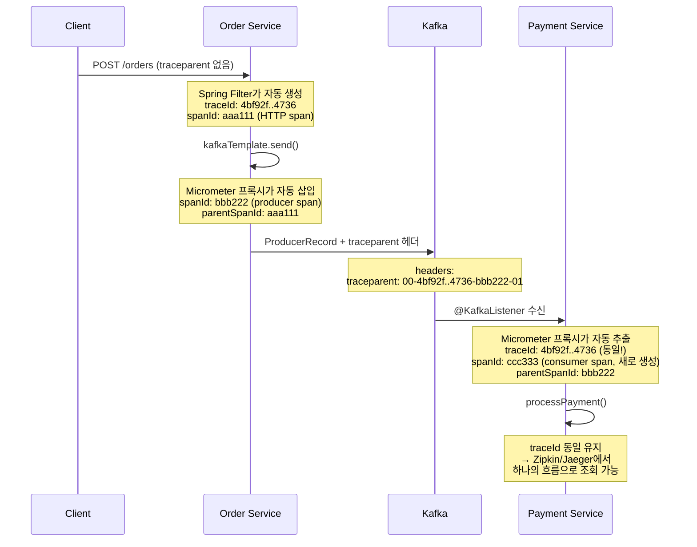
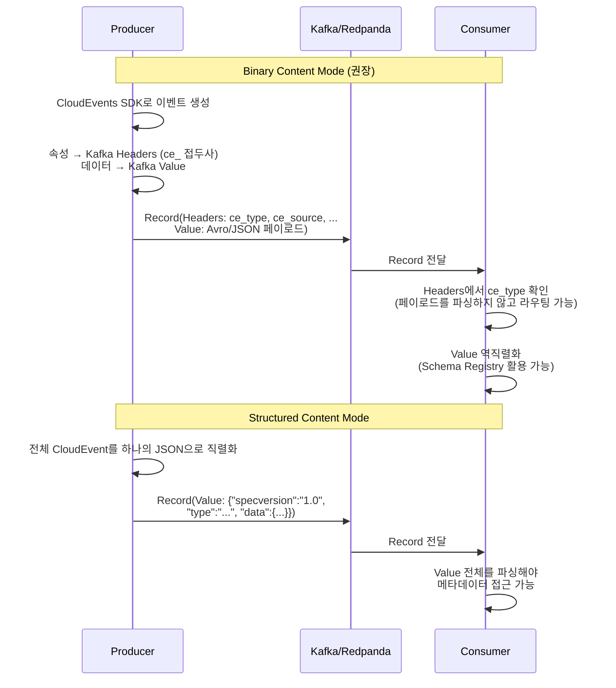

# Event Envelope

---

> Event Envelope는 메시지를 *메타데이터(헤더) + 페이로드*의 두 층으로 감싸는 패턴이다. 편지를 봉투(Envelope)에 넣는 것과 같은 개념으로, 봉투는 라우팅·추적 정보를, 페이로드는 비즈니스 데이터를 담는다. Kafka에서는 이 둘을 헤더와 value로 자연스럽게 갈라 둘 수 있다.


## 학습 목표

> Envelope의 위치 선택(헤더 vs 페이로드)이 *어떤 운영 이점*을 만드는지로 이해한다.

이 장을 다 읽고 다음 다섯 가지에 자신 있게 답할 수 있으면 학습이 완료된다.

1. Envelope과 Payload의 책임 분리가 왜 운영 관점에서 의미가 있는지 설명할 수 있다.
2. CloudEvents의 필수 속성 4개와 선택 속성을 구분해서 말할 수 있다.
3. Kafka Headers 단독·Avro Envelope·하이브리드 세 전략의 트레이드오프를 비교할 수 있다.
4. Micrometer Tracing이 traceparent 헤더를 어떻게 자동 주입·복원하는지 설명할 수 있다.
5. CloudEvents Kafka Protocol Binding의 Binary와 Structured 모드를 비교하고 권장안을 말할 수 있다.


## 1. Envelope 패턴 개요

```json
메시지 구조
├── 엔벨로프 (Envelope / Metadata)
│   ├── 이벤트 ID          (이 메시지를 고유하게 식별)
│   ├── 이벤트 타입         (무슨 일이 발생했는가)
│   ├── 소스              (어디서 발생했는가)
│   ├── 발생 시각           (언제 발생했는가)
│   ├── 스키마 참조         (페이로드 구조를 어디서 확인하는가)
│   └── 상관관계 ID         (관련된 다른 메시지와의 연결)
└── 페이로드 (Payload / Data)
    └── 비즈니스 데이터      (주문 정보, 결제 정보 등)
```

Envelope은 메시지를 라우팅하고 추적하는 데 필요한 메타데이터다. 미들웨어와 인프라 도구가 페이로드를 열어보지 않고도 메시지를 처리할 수 있게 해주며, 페이로드는 비즈니스 데이터 그 자체이자 Producer/Consumer 간의 계약이다.

### 1.1 API 설계와의 비교

REST API에서 OpenAPI(Swagger)로 API 규격을 정의하는 것처럼, 비동기 메시징에도 표준이 있다.

| **REST API 세계**      | **비동기 메시징 세계**        | **역할**        |
| ---------------------- | ----------------------------- | --------------- |
| HTTP 요청/응답         | 메시지 (이벤트/커맨드)        | 통신 단위       |
| OpenAPI (Swagger)      | **AsyncAPI**                  | API 명세 표준   |
| HTTP 헤더              | **CloudEvents** 속성          | 엔벨로프 표준   |
| JSON Schema / Protobuf | Avro / Protobuf / JSON Schema | 페이로드 스키마 |
| Swagger UI             | AsyncAPI Studio               | 문서 자동화     |
| Swagger Codegen        | AsyncAPI Generator            | 코드 자동 생성  |

핵심 차이점은 REST API는 동기이고 요청-응답이 명확한 반면, 메시징은 비동기이고 Producer와 Consumer가 서로를 모른다는 점이다.


## 2. CloudEvents

> CloudEvents는 CNCF가 정의한 이벤트 메타데이터 표준이다. 벤더 종속성 없이 이벤트 메타데이터를 표현하기 위한 공통 언어를 제공하는 것이 목표다.

CloudEvents는 이벤트 메타데이터의 HTTP 헤더 표준이라고 생각하면 좋다.

**도입 효과**

- **상호운용성**: 서로 다른 팀, 서로 다른 언어, 서로 다른 미들웨어가 같은 메타데이터 형식을 사용한다.
- **도구 생태계**: CloudEvents를 이해하는 모니터링, 트레이싱, 라우팅 도구를 활용할 수 있다.
- **SDK 지원**: Java, Go, Python, JavaScript, C#, Ruby, Rust 등 공식 SDK가 제공된다.
- **벤더 중립**: CNCF Graduated 프로젝트로 특정 벤더에 종속되지 않는다.

**도입하지 않아도 되는 경우**

- 단일 팀이 단일 미들웨어로 소수의 이벤트만 처리하는 경우.
- 이미 팀 내부 표준이 확립되어 있고 외부 시스템과 연동이 없는 경우.

### 2.1 CloudEvents 표준 예시

```json
{
  "specversion": "1.0",
  "id": "evt-20260211-001",
  "source": "/orders/order-service",
  "type": "com.example.order.created",
  "time": "2026-02-11T09:30:00Z",
  "datacontenttype": "application/json",
  "dataschema": "<https://schema.example.com/order/v1>",
  "subject": "order-12345",

  // payload
  "data": {
    "orderId": "order-12345",
    "customerId": "cust-789",
    "amount": 45000,
    "currency": "KRW"
  }
}
```

**필수 속성**

| **속성**      | **타입**      | **설명**                                             | **예시**                      |
| ------------- | ------------- | ---------------------------------------------------- | ----------------------------- |
| `id`          | String        | 이벤트 고유 식별자. `source + id` 조합이 유일해야 함 | `"A234-1234-1234"`            |
| `source`      | URI-reference | 이벤트가 발생한 컨텍스트 식별                        | `"/orders/order-service"`     |
| `specversion` | String        | CloudEvents 스펙 버전                                | `"1.0"`                       |
| `type`        | String        | 이벤트 타입. 라우팅과 정책 적용에 사용               | `"com.example.order.created"` |

**선택 속성**

| **속성**          | **타입**             | **설명**                        | **예시**                                  |
| ----------------- | -------------------- | ------------------------------- | ----------------------------------------- |
| `datacontenttype` | String (RFC 2046)    | 페이로드의 미디어 타입          | `"application/json"`                      |
| `dataschema`      | URI                  | 페이로드가 따르는 스키마 위치   | `"<https://schema.example.com/order/v1>"` |
| `subject`         | String               | 이벤트 주체(구독 필터링에 활용) | `"order-12345"`                           |
| `time`            | Timestamp (RFC 3339) | 이벤트 발생 시각                | `"2026-02-11T09:30:00Z"`                  |


## 3. 메타데이터 위치 선택(Kafka 헤더 vs Avro 페이로드)

> 세 가지 선택지가 있고, 실무 표준은 하이브리드다.

### 3.1 Kafka Record Headers만 사용

메타데이터 전부를 Kafka 헤더에 넣고, Avro 페이로드에는 순수 비즈니스 로직만 담는다.

```java
// 헤더: ce-type, ce-source, ce-id, trace-id
record.headers()
    .add("ce-type", "com.example.order.created".getBytes(UTF_8))
    .add("ce-source", "/order-service".getBytes(UTF_8));

// Avro 페이로드: OrderCreated — orderId, customerId, totalAmount만 포함
```

프로듀서마다 수동으로 헤더를 추가하면 누락이 발생한다. 자동 부착 방법은 두 가지가 있다.

| 방법                | Spring DI | 코드 변경   | 적합한 경우                |
| ------------------- | --------- | ----------- | -------------------------- |
| ProducerInterceptor | 불가      | 설정만      | 정적 헤더 (서비스명, 환경) |
| KafkaTemplate 래퍼  | 가능      | 래퍼 클래스 | 동적 헤더 (조건부 로직)    |

#### KafkaTemplate Wrapper bean(권장)

스프링에서 가장 권장되는 방법이다. KafkaTemplate를 감싸는 전용 빈을 만들어 모든 발행에 공통 헤더를 부착한다. Spring DI를 자유롭게 활용할 수 있고, 테스트에서 목킹이 쉽다.

```java
@Component
@RequiredArgsConstructor
public class EnvelopedKafkaTemplate<V> {

    private final KafkaTemplate<String, V> delegate;

    @Value("${spring.application.name}")
    private String serviceName;

    public CompletableFuture<SendResult<String, V>> send(String topic, String key, V value) {
        return send(topic, key, value, null);
    }

    public CompletableFuture<SendResult<String, V>> send(
            String topic, String key, V value, @Nullable String eventType) {

        ProducerRecord<String, V> record = new ProducerRecord<>(topic, key, value);
        Headers headers = record.headers();

        // 공통 헤더 자동 부착
        headers.add("ce-id", UUID.randomUUID().toString().getBytes(UTF_8));
        headers.add("ce-source", serviceName.getBytes(UTF_8));
        headers.add("ce-time", Instant.now().toString().getBytes(UTF_8));

        // 이벤트별 헤더 (호출자가 지정)
        if (eventType != null) {
            headers.add("ce-type", eventType.getBytes(UTF_8));
        }

        // 분산 추적: MDC에서 trace-id 전파
        String traceId = MDC.get("traceId");
        if (traceId != null) {
            headers.add("trace-id", traceId.getBytes(UTF_8));
        }

        return delegate.send(record);
    }
}
```

```java
// 사용측: 래퍼만 주입받아 사용
@Service
@RequiredArgsConstructor
public class OrderProducer {

    private final EnvelopedKafkaTemplate<OrderCreated> kafkaTemplate;

    public void publish(OrderCreated event) {
        kafkaTemplate.send(
            "orders",
            event.getOrderId(),
            event,
            "com.example.order.created"  // ce-type만 이벤트별로 지정
        );
        // ce-id, ce-source, ce-time, trace-id는 자동 부착
    }
}
```

#### KafkaTemplate.setProducerInterceptor()

KafkaTemplate에 직접 ProducerInterceptor를 설정할 수 있다.

```java
@Configuration
public class KafkaProducerConfig {

    @Bean
    public KafkaTemplate<String, Object> kafkaTemplate(
            ProducerFactory<String, Object> pf,
            CommonHeaderInterceptor interceptor) {

        KafkaTemplate<String, Object> template = new KafkaTemplate<>(pf);
        template.setProducerInterceptor(interceptor);  // Spring 빈으로 등록된 인터셉터
        return template;
    }
}
```

```java
@Component
public class CommonHeaderInterceptor implements ProducerInterceptor<String, Object> {

    @Value("${spring.application.name}")
    private String serviceName;

    /**
     * 메시지가 브로커로 전송되기 직전에 호출된다.
     * ProducerRecord를 수정하거나 새로 만들어 반환할 수 있다.
     * 여기서 공통 헤더를 부착한다.
     */
    @Override
    public ProducerRecord<String, Object> onSend(ProducerRecord<String, Object> record) {
        Headers headers = record.headers();
        addIfAbsent(headers, "ce-source", serviceName);
        addIfAbsent(headers, "ce-id", UUID.randomUUID().toString());
        addIfAbsent(headers, "ce-time", Instant.now().toString());

        String traceId = MDC.get("traceId");
        if (traceId != null) {
            addIfAbsent(headers, "trace-id", traceId);
        }
        return record;
    }

    /** 이미 같은 키가 있으면 덮어쓰지 않는다. Producer가 명시 설정한 헤더가 우선. */
    private void addIfAbsent(Headers headers, String key, String value) {
        if (headers.lastHeader(key) == null) {
            headers.add(key, value.getBytes(StandardCharsets.UTF_8));
        }
    }

    @Override public void onAcknowledgement(RecordMetadata m, Exception e) {}
    @Override public void close() {}
    @Override public void configure(Map<String, ?> configs) {}
}
```

MDC(Mapped Diagnostic Context)는 SLF4J/Logback이 제공하는 스레드 로컬 키-값 저장소다.

### 3.2 Avro 스키마에 Envelope 필드 포함

메타데이터를 Avro 스키마 자체에 포함시키는 방식이다. Schema Registry가 메타데이터 필드까지 관리하므로 타입 안전성이 보장되고 스키마 진화도 적용된다. 하지만 라우터가 메타데이터를 읽기 위해서는 Avro 역직렬화가 필수로 요구된다.

```json
{
  "type": "record",
  "name": "OrderEnvelope",
  "fields": [
    {"name": "eventId",   "type": "string"},
    {"name": "eventType", "type": "string"},
    {"name": "source",    "type": "string"},
    {"name": "timestamp", "type": {"type": "long", "logicalType": "timestamp-millis"}},
    {"name": "payload",   "type": "OrderCreated"}
  ]
}
```

### 3.3 하이브리드(실무 표준)

대부분의 실무 환경에서 채택하는 방식이다. 라우팅/인프라 메타데이터는 Kafka 헤더에, 비즈니스 메타데이터는 Avro 페이로드에 분리한다.

```bash
Kafka Record
├── Headers (라우팅/인프라 — 역직렬화 없이 접근 가능)
│   ├── ce-type: "com.example.order.created"     ← 라우터가 사용
│   ├── ce-source: "/order-service"              ← 모니터링이 사용
│   ├── ce-id: "550e8400-e29b-..."               ← 멱등성 검사
│   └── trace-id: "abc-def-ghi"                  ← 분산 추적
│
└── Value (Avro — Schema Registry 관리, 타입 안전)
    ├── orderId: "ORD-9001"
    ├── customerId: "CUST-123"
    ├── totalAmount: 49900
    └── createdAt: 1705312800000
```

Kafka는 메시지마다 헤더를 첨부할 수 있다. CloudEvents 메타데이터를 헤더에 넣으면 페이로드와 분리하여 검사할 수 있다.

```java
// Producer: CloudEvents 헤더 추가
ProducerRecord<String, OrderCreated> record = new ProducerRecord<>(
    "orders", orderId, orderCreatedEvent
);

record.headers()
    .add("ce-specversion", "1.0".getBytes())
    .add("ce-type", "com.example.order.created".getBytes())
    .add("ce-source", "https://order-service/orders".getBytes())
    .add("ce-id", UUID.randomUUID().toString().getBytes())
    .add("ce-time", Instant.now().toString().getBytes());

producer.send(record);
```

```java
// Consumer: 헤더만 검사하여 처리 여부 결정
ConsumerRecord<String, byte[]> record = ...; // 역직렬화 전

String eventType = new String(
    record.headers().lastHeader("ce-type").value()
);

if ("com.example.order.created".equals(eventType)) {
    // 페이로드를 이제 역직렬화하여 처리
    OrderCreated event = deserialize(record.value());
    processOrder(event);
} else {
    // 관심 없는 이벤트 타입은 역직렬화 비용 없이 스킵
    log.debug("Skipping event type: {}", eventType);
}
```


## 4. Micrometer Tracing(모니터링 - 제로코드)

Spring Boot 3.x 및 Micrometer Tracing 의존성만 추가하면 traceId와 spanId가 모든 Kafka 메시지 헤더에 자동 주입된다.

```groovy
// build.gradle
implementation 'io.micrometer:micrometer-tracing-bridge-brave'
implementation 'org.springframework.kafka:spring-kafka'  // 자동 계측 포함
```

- Spring Boot 자동설정이 KafkaTemplate와 @KafkaListener에 Tracing 프록시를 감싼다.
- Producer가 `send()`를 호출하면 프록시가 traceId/spanId를 추출하여 `traceparent`에 넣는다.
- Consumer에서는 `@KafkaListener` 진입 시 `traceparent` 헤더를 읽어 같은 trace context를 복원한다.




## 5. Kafka/Redpanda Protocol Binding

> 앞 섹션에서는 일반적 관례인 `ce-` 접두사(하이픈)를 사용했지만, 공식 Kafka 바인딩 스펙에서는 `ce_` 접두사(언더스코어)를 사용한다. Kafka 헤더 키에 하이픈이 허용되지만, CloudEvents Kafka Protocol Binding 명세는 `ce_`를 표준으로 정의한다.

CloudEvents를 Kafka에서 전송할 때 두 가지 모드가 있다.

### 5.1 Binary Content Mode(권장)

CloudEvents 속성을 Kafka 헤더에, 페이로드를 Kafka 메시지 value에 배치한다. 속성명 앞에 `ce_` 접두사를 붙인다.

```json
Kafka Record
├── Headers
│   ├── ce_specversion: "1.0"
│   ├── ce_id: "evt-20260211-001"
│   ├── ce_source: "/orders/order-service"
│   ├── ce_type: "com.example.order.created"
│   ├── ce_time: "2026-02-11T09:30:00Z"
│   └── content-type: "application/json"
└── Value
    └── {"orderId": "order-12345", "amount": 45000, ...}
```

### 5.2 Structured Content Mode

전체 CloudEvent(속성 + 데이터)를 하나의 JSON으로 직렬화하여 Kafka 메시지 value에 배치한다.

- Content-Type 헤더가 `application/cloudevents+json`으로 설정된다.
- 수신 측은 content-type 헤더를 보고 모드를 판별하며, `application/cloudevents`로 시작하면 Structured, 아니면 Binary다.

Binary를 권장하는 이유는, Kafka 도구가 메시지 value를 그대로 처리할 수 있고, 엔벨로프 오버헤드가 value에 포함되지 않아 페이로드 크기가 더 작기 때문이다. 또한 Schema Registry와의 통합이 자연스럽다.




## 6. 면접 대비 Q&A

> 면접에서 자주 나오는 형태로 5개. 답을 보지 않고 먼저 입으로 답해 본 뒤 비교한다.

### Q1. Envelope와 Payload를 분리하면 운영적으로 무엇이 좋아지는가?

라우팅·필터링·모니터링·트레이싱 도구가 페이로드를 *역직렬화하지 않고* 헤더만 보고 결정을 내릴 수 있다. 예를 들어 컨슈머가 `ce-type`이 관심 이벤트가 아니면 Avro 역직렬화를 생략하고 곧장 commit하는 식으로 비용을 줄인다. 또 mirroring·dead-letter 라우터 같은 인프라 측 도구가 도메인 모델을 모른 채로 운영될 수 있다. 페이로드는 도메인 계약이라 진화가 잦지만, 봉투의 메타데이터는 잘 안 바뀌기에 분리 자체가 운영 안정성을 높인다.

### Q2. CloudEvents 필수 속성 4개와 그 의미는?

`id`(이벤트 고유 식별, source와 합쳐 유일), `source`(어디서 발생했는가, URI-reference), `specversion`(스펙 버전, 현재 1.0), `type`(무슨 일이 발생했는가, 역도메인 표기법 권장). 이 4개만으로도 "어디서 / 어떤 사건이 / 어떤 식별자로 / 어느 스펙에 따라" 발생했는지가 결정되므로 라우팅·중복 제거의 기본 키가 만들어진다. `time`, `datacontenttype`, `dataschema`, `subject`는 선택이며 도구 친화성을 높이는 보조 속성이다.

### Q3. 헤더 단독·Avro Envelope·하이브리드 중 무엇을 골라야 하나?

대부분 하이브리드(라우팅 메타는 헤더, 비즈니스 메타는 Avro)가 옳다. 헤더 단독은 진화·타입 안전성이 약하고, Avro Envelope 단독은 모든 라우터가 Avro를 풀어야 해서 사이드카·미들웨어와의 결합이 강해진다. 하이브리드는 "역직렬화 없이 필요한 정보 vs 도메인 진화 정보"를 자연스럽게 가르고, Micrometer Tracing 같은 표준 도구가 이미 헤더 측 traceparent를 자동 처리한다.

### Q4. Micrometer Tracing이 traceparent를 어떻게 자동 전파하나?

Spring Boot 자동설정이 `KafkaTemplate`과 `@KafkaListener`에 Tracing 프록시를 감싼다. Producer 측 `send()` 직전에 프록시가 현재 컨텍스트의 traceId/spanId를 W3C `traceparent` 헤더로 직렬화해 넣는다. Consumer 측에서는 listener 진입 시 프록시가 `traceparent`를 추출해 새 span의 parent로 설정하면서 traceId를 유지한다. 그래서 HTTP → Kafka → Kafka로 이어지는 흐름이 하나의 trace로 묶여 Zipkin/Jaeger에서 단일 흐름으로 보인다.

### Q5. Binary와 Structured Content Mode 중 어느 쪽을 권장하나?

Binary다. 이유는 세 가지로, 첫째 Kafka 도구(Kafka Streams, KSQL 등)가 value를 그대로 처리할 수 있고, 둘째 엔벨로프 오버헤드가 value에 포함되지 않아 페이로드 크기가 작으며, 셋째 Schema Registry와 자연스럽게 통합된다(value는 순수 Avro/Protobuf). Structured는 외부 시스템과 단일 JSON으로 주고받아야 할 때나 HTTP↔Kafka 다리에서 1:1 매핑을 원할 때 한정해 사용한다.


## 7. 관련 문서

- [02-01.EIP Message Pattern](01-01.EIP%20Message%20Pattern.md) — Envelope의 이론적 기원과 Command/Event 의도 분류
- [02-02.Schema Registry](01-02.Schema%20Registry.md) — 페이로드 측 계약을 인프라 수준으로 강제
- [02-03.Avro](01-03.Avro.md) — Envelope이 감싸는 페이로드 직렬화
- [03-03.AsyncAPI 명세](../02_TopicDesign/02-03.AsyncAPI%20명세.md) — Envelope과 Payload를 명세로 노출하는 표준
- [03-04.한 토픽 다수 message 형태](01-07.한%20토픽%20다수%20message%20형태.md) — `ce-type` 헤더로 같은 토픽에서 라우팅


---

> **TPS 적용 사례** — `okestro/tps-gitlab2`
>
> - **모듈/위치**: `message-lib/src/main/java/org/okestro/tps/messaging/application/outbox/EventPublisher.java`, `tracing/CorrelationIdRecordInterceptor.java`
> - **요점**: `EventPublisher.publish(aggregateId, SpecificRecord, topic)` 시그니처가 envelope 직렬화 책임을 캡슐화한다. correlation ID·trace 헤더는 `CorrelationIdRecordInterceptor`가 발행 직전에 자동 부착해 envelope 메타데이터를 일관되게 채운다.
> - **상세**: [`spring/01-01.CloudEventsHeaderInterceptor`](01-09.CloudEventsHeaderInterceptor.md), [`spring/04-01.trace-id와 traceparent`](01-10.trace-id와%20traceparent.md).
