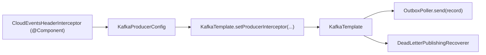

# CloudEventsHeaderInterceptor와 헤더 자동 부착 방식

---

> ⚠️ **현재 코드 상태와의 차이** — 본 문서는 `CloudEventsHeaderInterceptor`가 존재하던 시점의 자료다. 현재 `message-lib`에서는 같은 책임이 `CorrelationIdRecordInterceptor`(`org.okestro.tps.messaging.tracing` 패키지)로 이전됐고, ProducerInterceptor가 아니라 `RecordInterceptor` 형태로 동작한다. 헤더 부착 시점·접근 방식이 달라졌으니 코드를 직접 볼 때 클래스 이름과 위치를 본 문서 기준이 아닌 실제 저장소 기준으로 읽는다.

> 이 문서는 `CloudEventsHeaderInterceptor`가 실제로 무엇을 하는지, 왜 필요한지, 그리고 Spring Kafka에서 CloudEvents 헤더를 자동 부착하는 여러 방법 중 현재 코드가 어떤 방식을 택했는지를 정리한다.
>
> `CloudEventsHeaderInterceptor`는 Event Envelope의 공통 메타데이터를 Kafka 전송 직전에 자동 보강하는 Spring-managed ProducerInterceptor이고, 현재 프로젝트에서는 "발행자가 이벤트별 헤더를 넣고 인터셉터가 기본 헤더를 채우는" 역할 분담으로 쓰이고 있다.


## 1. 이 인터셉터는 왜 필요한가

> Event Envelope는 메시지를 다음 두 층으로 나눈다.
>
> - Envelope: `id`, `source`, `type`, `time`, trace 정보 같은 메타데이터
> - Payload: 실제 비즈니스 데이터

CloudEvents는 이 Envelope를 표준화한 규격이다. Kafka에서는 보통 Binary Content Mode를 사용하므로, 메타데이터를 Kafka 헤더에 넣고 페이로드는 순수 데이터로 유지한다.

문제는 프로듀서마다 헤더를 직접 붙이면 누락이 생긴다는 점이다.

- 어떤 프로듀서는 `ce_id`를 넣고
- 어떤 프로듀서는 `ce_source`를 빼먹고
- 어떤 프로듀서는 `trace-id`를 안 넣는 식

그래서 공통 헤더는 자동 부착하는 지점이 필요하다. `CloudEventsHeaderInterceptor`는 바로 그 역할을 맡는다.


## 2. 현재 인터셉터가 하는 일

> 현재 구현은 `ProducerInterceptor<String, byte[]>`를 구현한다.

Apache Kafka 공식 문서 기준으로 `ProducerInterceptor.onSend()`는 `KafkaProducer.send()` 호출 시점에 실행되며, **직렬화와 파티션 할당 전에 레코드를 가로채서 수정할 수 있다**.

현재 코드가 `onSend()`에서 넣는 값은 다음과 같다.

- `ce_specversion = 1.0`
- `ce_id = UUID`
- `ce_source = /{spring.application.name}`
- `ce_time = Instant.now()`
- `trace-id = MDC["traceId"]`가 있으면 추가

즉, 이 인터셉터는 "모든 메시지에 공통으로 들어가야 하는 기본 Envelope 헤더"를 자동으로 채우는 역할이다.

### 코드 특징

#### 1. `addIfAbsent()`를 쓴다

이미 같은 헤더가 있으면 덮어쓰지 않는다.

이 설계는 중요하다. 이유는 현재 프로젝트에서 `OutboxPoller`가 이벤트별 헤더를 직접 넣고 있기 때문이다.

- `OutboxPoller`가 넣는 값
  - `ce_specversion`
  - `ce_id`
  - `ce_source`
  - `ce_type`
  - `ce_correlationid`
- 인터셉터가 넣는 값
  - 기본값이 필요한 공통 헤더

즉, 발행자가 명시적으로 준 값이 우선이고, 인터셉터는 빠진 것만 보강한다.

#### 2. `ce_type`은 넣지 않는다

이건 의도된 설계다.

`ce_type`은 `"무슨 이벤트인가"`를 나타내는 값이라 이벤트별로 달라진다. 따라서 공통 인터셉터가 정할 수 없다. 현재 프로젝트에서는 `OutboxPoller`가 이벤트별로 넣는다.

#### 3. `onAcknowledgement()`, `close()`, `configure()`는 비어 있다

이 메서드들은 Kafka `ProducerInterceptor` 인터페이스의 일부다. 현재 구현은 헤더 부착만 목적이라 비워 둔 것이다.

- `onAcknowledgement()`
  - 전송 성공/실패 후 후처리에 사용 가능
  - 메트릭, 로깅, 실패 통계에 활용 가능
  
- `close()`
  - 리소스 정리 시 사용
  
- `configure()`
  - Kafka가 인터셉터를 직접 생성할 때 설정값 주입에 사용
  
  


## 3. 현재 프로젝트에서 이 인터셉터는 어떻게 연결되는가

> 현재 프로젝트는 **Spring이 관리하는 인터셉터를 `KafkaTemplate`에 직접 연결하는 방식**을 사용한다. 이 방식의 장점은 Spring DI를 그대로 쓸 수 있다는 점이다.



1. `CloudEventsHeaderInterceptor`는 Spring Bean이다.
2. `KafkaProducerConfig`가 이 빈을 주입받는다.
3. `KafkaTemplate.setProducerInterceptor(...)`로 템플릿에 연결한다.
4. 그 템플릿으로 보내는 모든 메시지에 인터셉터가 적용된다.

현재 코드도 실제로 다음 값을 Spring/애플리케이션 컨텍스트에서 받는다.

- `@Value("${spring.application.name:unknown}")`
- `MDC.get("traceId")`

이건 Kafka가 직접 생성하는 인터셉터보다 Spring Bean 방식이 더 자연스러운 이유다.


## 4. `OutboxPoller`와 역할 분담

> 현재 구조를 보면 헤더를 인터셉터가 전부 넣는 게 아니다. `OutboxPoller`는 이벤트별 헤더를 직접 넣는다. 그리고 인터셉터는 빠진 기본 헤더를 보강한다.

현재 구조는 다음처럼 이해하면 된다.

| 책임 | 담당 |
| --- | --- |
| 이벤트마다 달라지는 헤더 | 발행자 (`OutboxPoller` 등) |
| 모든 메시지에 공통인 기본 헤더 | `CloudEventsHeaderInterceptor` |

이 분리는 합리적이다.

- `ce_type`은 비즈니스 문맥이 알아야 한다.
- `ce_time`, 기본 `ce_id`, 기본 `ce_source`는 공통 인프라가 채워도 된다.


## 5. Spring Kafka에서 헤더 자동 부착하는 방법은 무엇이 있나

> CloudEvents 헤더를 자동 부착하는 방식은 크게 네 가지로 볼 수 있다.

### 방법 1. 발행 지점에서 `ProducerRecord` 헤더를 직접 추가

```java
ProducerRecord<String, byte[]> record = new ProducerRecord<>(topic, key, value);
record.headers().add("ce_type", eventType.getBytes(UTF_8));
record.headers().add("ce_source", serviceName.getBytes(UTF_8));
kafkaTemplate.send(record);
```

장점:

- 가장 단순하다.
- 어떤 헤더가 붙는지 호출부에서 명확하다.
- 이벤트별 헤더를 넣기 쉽다.

단점:

- 호출부마다 반복된다.
- 누락 가능성이 높다.
- 공통 정책이 흩어진다.

적합한 경우:

- 소수의 발행 지점만 있을 때
- 헤더가 거의 전부 이벤트별일 때

### 방법 2. `KafkaTemplate` 래퍼를 만들어 공통 헤더 부착

```java
@Component
public class EnvelopedKafkaTemplate {

    private final KafkaTemplate<String, byte[]> delegate;

    public CompletableFuture<SendResult<String, byte[]>> send(
            String topic, String key, byte[] payload, String eventType) {

        ProducerRecord<String, byte[]> record = new ProducerRecord<>(topic, key, payload);
        record.headers().add("ce_type", eventType.getBytes(StandardCharsets.UTF_8));
        record.headers().add("ce_time", Instant.now().toString().getBytes(StandardCharsets.UTF_8));
        return delegate.send(record);
    }
}
```

장점:

- Spring DI와 테스트가 쉽다.
- 인터셉터보다 비즈니스 문맥을 다루기 쉽다.
- 공통 헤더와 이벤트별 헤더를 한 API에서 함께 다룰 수 있다.

단점:

- 모든 호출부가 이 래퍼를 써야 한다.
- `KafkaTemplate`를 직접 쓰는 경로가 생기면 정책이 깨진다.

적합한 경우:

- 팀에서 발행 API를 강하게 통제할 수 있을 때
- 이벤트별 헤더 로직이 복잡할 때

### 방법 3. Kafka 네이티브 인터셉터 (`interceptor.classes`)

Kafka 프로듀서 설정의 `interceptor.classes`로 등록하는 방식이다.

```yaml
spring:
  kafka:
    producer:
      properties:
        interceptor.classes: com.example.CommonHeaderInterceptor
```

장점:

- Kafka producer 레벨에서 일괄 적용된다.
- Spring 외부에서도 동일 방식으로 재사용 가능하다.
- 여러 인터셉터를 체인으로 붙일 수 있다.

단점:

- 인터셉터 객체를 Kafka가 직접 생성한다.
- 일반적인 Spring DI가 바로 되지 않는다.
- 의존 빈 주입이 필요하면 `configure()`로 우회해야 한다.

적합한 경우:

- 인터셉터를 Spring에 강하게 묶고 싶지 않을 때
- 순수 Kafka 클라이언트 관점의 플러그인이 필요할 때

### 방법 4. Spring-managed `ProducerInterceptor`를 `KafkaTemplate.setProducerInterceptor()`로 연결(채택)

이게 현재 프로젝트가 선택한 방식이다.

```java
@Bean
public KafkaTemplate<String, byte[]> kafkaTemplate(
        ProducerFactory<String, byte[]> producerFactory,
        CloudEventsHeaderInterceptor interceptor) {

    KafkaTemplate<String, byte[]> template = new KafkaTemplate<>(producerFactory);
    template.setProducerInterceptor(interceptor);
    return template;
}
```

장점:

- 인터셉터를 Spring Bean으로 관리할 수 있다.
- `@Value`, 다른 빈 주입, 테스트 대체가 쉽다.
- Kafka native interceptor의 DI 문제를 피할 수 있다.

단점:

- 해당 `KafkaTemplate`로 보내는 메시지에만 적용된다.
- 다른 `KafkaTemplate` 또는 raw `Producer`를 쓰면 자동 적용되지 않는다.

적합한 경우:

- Spring Boot 애플리케이션 내부에서 공통 헤더를 붙일 때
- 인터셉터가 Spring 빈, 설정값, MDC 같은 컨텍스트를 써야 할 때


## 6. 현재 프로젝트에서 왜 이 방식이 적절한가

> 현재 프로젝트가 `setProducerInterceptor()`를 택한 이유는 꽤 합리적이다.

### 이유 1. Spring DI가 필요하다

현재 인터셉터는 `spring.application.name`을 사용한다. 이 값은 Spring Bean으로 관리할 때 가장 다루기 쉽다.

Kafka native `interceptor.classes` 방식으로도 가능은 하지만, Spring Bean 주입이 자연스럽지 않다.

### 이유 2. 헤더 부착 규칙이 "공통 기본값 보강"에 가깝다

현재 인터셉터는 이벤트별 로직을 하지 않는다. 빠진 공통 헤더만 넣는다.

이건 인터셉터 패턴에 잘 맞는다.

반대로 `ce_type`을 계산하거나 aggregate별 규칙을 나누는 비즈니스 로직까지 들어가면 인터셉터보다 래퍼/호출부가 더 낫다.

### 이유 3. DLQ 재발행에도 같은 정책을 적용할 수 있다

현재 `KafkaTemplate<String, byte[]>`는 정상 발행뿐 아니라 `DeadLetterPublishingRecoverer`에도 쓰인다.

즉 템플릿에 인터셉터를 달아 두면, 정상 발행과 DLT 재발행 모두 같은 기본 헤더 정책을 공유할 수 있다.


## 7. 현재 구현의 한계와 주의점

### 1. 모든 `KafkaTemplate`에 자동 적용되지는 않는다

이 인터셉터는 특정 `KafkaTemplate`에 붙는다. 다른 템플릿을 별도로 만들면 여기에 자동 적용되지 않는다.

### 2. 예외를 던져도 전송이 실패하지 않을 수 있다

Kafka 공식 문서상 `ProducerInterceptor`에서 발생한 예외는 잡혀서 로그만 남고 바깥으로 전파되지 않는다.

즉 인터셉터는 검증 실패로 전송 자체를 강제 차단하는 용도로는 부적합하다.

### 3. `trace-id`와 `traceparent`가 분리되어 있다

현재 인터셉터는 `trace-id`를 넣고, `OutboxPoller`는 별도로 `traceparent`를 넣는다.

이건 당장 문제는 아니지만, 장기적으로는 트레이싱 표준을 하나로 정리하는 편이 좋다.

### 4. `ce_id` 기본 생성 규칙이 항상 최선은 아니다

기본 UUID는 편리하지만, outbox event id나 도메인 이벤트 id를 그대로 CloudEvents `id`로 쓰고 싶다면 발행자가 명시적으로 넣어야 한다.

현재 구조는 그걸 허용한다는 점에서 괜찮지만, 팀 규칙은 따로 정해둘 필요가 있다.


## 8. 실무 추천

현재 프로젝트처럼 Spring Boot 내부에서 KafkaTemplate를 표준화해 쓰는 구조라면, **`KafkaTemplate.setProducerInterceptor()` + `addIfAbsent()` 조합은 좋은 선택**이다.

추천 기준은 다음과 같다.

| 상황 | 추천 방식 |
| --- | --- |
| 공통 기본 헤더만 자동 부착 | Spring-managed `ProducerInterceptor` |
| 이벤트별 헤더 조립이 복잡 | `KafkaTemplate` 래퍼 |
| 완전히 Kafka 표준 설정만 사용하고 싶음 | `interceptor.classes` |
| 발행 지점이 적고 단순함 | 호출부에서 직접 헤더 추가 |

현재 구현은 다음 분리에 가장 잘 맞는다.

- 인터셉터: `ce_time`, 기본 `ce_id`, 기본 `ce_source`, `trace-id`
- 발행자: `ce_type`, `ce_correlationid`, 도메인별 식별자


## 참고 자료

- Kafka `ProducerInterceptor` 공식 Javadoc  
  https://kafka.apache.org/41/javadoc/org/apache/kafka/clients/producer/ProducerInterceptor.html
- Spring Kafka `KafkaTemplate#setProducerInterceptor` Javadoc  
  https://docs.spring.io/spring-kafka/api/org/springframework/kafka/core/KafkaTemplate.html
- Spring Kafka Reference, Wiring Spring Beans into Producer/Consumer Interceptors  
  https://docs.spring.io/spring-kafka/docs/2.3.0.M3/reference/html/
