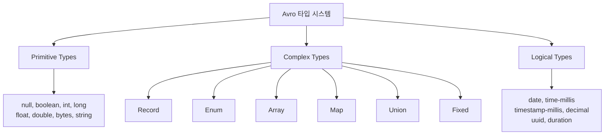

# Avro

---

> Kafka 브로커는 메시지를 바이트 배열로 저장한다. 어떤 내용을 보내든 검증하지 않고, 직렬화 포맷은 개발자가 직접 선택해야 한다. Avro는 그 빈자리를 스키마 기반 바이너리 직렬화로 메우는 도구이며, Schema Registry와 결합되면 *Confluent wire format*이라는 5바이트 헤더가 붙은 새로운 형식이 된다.


## 학습 목표

> Avro 바이너리·Confluent wire format·SpecificRecord 코드 생성 모델을 셋이 어떻게 맞물려 동작하는지로 이해한다.

이 장을 다 읽고 다음 다섯 가지에 자신 있게 답할 수 있으면 학습이 완료된다.

1. JSON 대비 Avro가 페이로드 크기·타입 강제·스키마 진화에서 어떤 차이를 만드는지 비교할 수 있다.
2. Avro 바이너리 인코딩이 필드명을 저장하지 않고도 역직렬화가 가능한 이유를 설명할 수 있다.
3. 순수 Avro 바이너리와 Confluent wire format의 차이, 그리고 후자가 멀티 서비스에서 필요한 이유를 설명할 수 있다.
4. AvroSerializer 같은 래퍼 클래스가 `KafkaAvroSerializer` 위에서 무엇을 추가하는지 설명할 수 있다.
5. Envelope 패턴과 Union 다형성 표현 중 어떤 상황에 어느 쪽을 골라야 하는지 판단할 수 있다.


## 1. Avro가 Kafka에 적합한 이유

Apache Avro는 스키마 기반 바이너리 직렬화 프레임워크다. Kafka 환경에 적합한 이유는 세 가지로 압축된다.

1. **스키마가 데이터와 분리된다**: 스키마를 Registry에 등록하고 메시지는 Schema ID만 포함한다. JSON처럼 매 메시지마다 필드명을 반복하지 않아 페이로드가 작다.
2. **스키마 진화가 자유롭다**: 필드 추가/삭제 시 기본값만 지정하면 이전/이후 버전의 스키마와 공존할 수 있다.
3. **코드 생성 지원**: `.avsc` 파일에서 Java/Python/Go 클래스를 자동 생성하여 타입 안전한 개발이 가능해진다.

### 1.1 JSON vs Avro

```bash
JSON (78 bytes, 텍스트):
{"orderId":"ORD-001","amount":15000.0,"currency":"KRW","createdAt":1718444400000}

Avro (약 25 bytes, 바이너리):
[0E]ORD-001[00 00 00 00 00 4E D4 40][06]KRW[80 C8 E4 F0 8F 63]
```

- JSON은 필드명이 매 메시지마다 반복된다.
- Avro는 필드명을 메시지에 포함하지 않고, 스키마에서 필드 순서와 타입이 정의되어 바이너리 데이터만 순서대로 읽으면 된다.

| **비교 항목** | **JSON**                       | **Avro**                              |
| ------------- | ------------------------------ | ------------------------------------- |
| 인코딩        | 텍스트 (UTF-8)                 | 바이너리                              |
| 필드명 포함   | 매 메시지마다 반복             | 스키마에만 존재                       |
| 페이로드 크기 | 큼 (필드명 + 따옴표 + 콜론)    | 작음 (데이터만)                       |
| 타입 강제     | 없음 (`"amount": "FREE"` 가능) | 있음 (스키마 위반 시 직렬화 실패)     |
| 스키마 진화   | 규칙 없음 (암묵적 계약)        | 명시적 규칙 (호환성 모드)             |
| 디버깅 편의성 | 높음 (사람이 읽기 쉬움)        | 낮음 (바이너리 → 도구 필요)           |
| Kafka 통합    | StringSerializer 사용          | KafkaAvroSerializer + Schema Registry |


## 2. 바이너리 인코딩 원리

> Avro 바이너리 인코딩은 필드명을 저장하지 않고, 스키마에 정의된 필드 순서대로 값만 연속으로 기록한다.

```json
// 스키마:
  fields: [orderId(string), amount(double), currency(string)]

// 메시지 (바이너리):
  [orderId 길이][orderId 데이터][amount 8바이트][currency 길이][currency 데이터]
  [0E]          [ORD-001]      [40 D4 4E...]   [06]           [KRW]

→ 필드명 없이 값만 순서대로 저장
→ Reader가 같은 스키마를 알고 있으므로 순서대로 읽으면 됨
```

Avro는 Java 리플렉션으로 필드 순서를 보지 않고, 스키마 파일의 필드 인덱스를 사용한다.

```java
// Avro가 자동 생성한 코드 (간략화)
public class Order extends SpecificRecordBase {
    // Java 필드 선언 순서는 무관
    private String currency;   // Java에서 첫 번째여도
    private String orderId;    // Java에서 두 번째여도
    private double amount;     // Java에서 세 번째여도

    @Override
    public Object get(int field) {
        switch (field) {
            case 0: return orderId;    // 스키마 순서 0번
            case 1: return amount;     // 스키마 순서 1번
            case 2: return currency;   // 스키마 순서 2번
        }
    }

    @Override
    public void put(int field, Object value) {
        switch (field) {
            case 0: orderId = (String) value; break;
            case 1: amount = (Double) value; break;
            case 2: currency = (String) value; break;
        }
    }
}
```


## 3. Confluent Wire Format과 직렬화 래퍼

> Avro 라이브러리가 생성하는 바이너리와 Confluent Schema Registry를 거친 바이너리는 형식이 다르다. 순수 Avro 바이너리는 필드 값만 연속으로 나열하지만, Confluent wire format은 앞에 5바이트 헤더를 붙여 어떤 스키마로 인코딩했는지 식별할 수 있게 한다.

```bash
# 순수 Avro 바이너리 (스키마 정보 없음):
[0E]ORD-001[00 00 00 00 00 4E D4 40][06]KRW

# Confluent Wire Format (schema ID 포함):
[0x00][0x00 0x00 0x00 0x05][0E]ORD-001[00 00 00 00 00 4E D4 40][06]KRW
  ↑         ↑                    ↑
magic    schema ID=5        순수 Avro 바이너리
```

이 차이가 중요한 이유는, Consumer가 역직렬화할 때 schema ID로 Registry에서 Writer Schema를 조회하여, 자신의 Reader Schema와 다를 경우에도 안전하게 필드를 매핑할 수 있기 때문이다.

### 3.1 Avro 라이브러리 직접 사용 vs 래퍼

순수 Avro 라이브러리만으로도 직렬화/역직렬화는 가능하다. 하지만 Schema Registry 연동이 빠지므로, 서비스 간 스키마 버전이 다를 때 대응할 수 없다.

```java
// 방법 1: Avro 라이브러리 직접 사용 (Schema Registry 없음)
DatumWriter<JenkinsBuildRequest> writer = new SpecificDatumWriter<>(schema);
ByteArrayOutputStream out = new ByteArrayOutputStream();
Encoder encoder = EncoderFactory.get().binaryEncoder(out, null);
writer.write(record, encoder);
encoder.flush();
byte[] bytes = out.toByteArray();
```

- 순수 Avro 바이너리. schema ID 없음.
- Consumer가 동일 스키마를 가지고 있어야만 역직렬화 가능.

```java
// 방법 2: Confluent KafkaAvroSerializer (Schema Registry 연동)
KafkaAvroSerializer serializer = new KafkaAvroSerializer();
serializer.configure(Map.of("schema.registry.url", "http://registry:8081"), false);

byte[] bytes = serializer.serialize("topic-name", record);
// → [0x00][schema ID][Avro 바이너리]. Registry에 스키마 자동 등록.
// → Consumer가 다른 버전 스키마를 가져도, schema ID로 Writer Schema를 조회하여 호환 가능.
```

방법 2를 한 번 더 감싼 것이 래퍼 클래스다. 래퍼가 추가하는 가치는 세 가지로, 첫째 설정 초기화를 캡슐화하고, 둘째 직렬화 실패를 도메인 예외로 변환하며, 셋째 디버깅용 JSON 변환을 제공한다.

```java
// 방법 3: AvroSerializer 래퍼 (방법 2를 감싼 편의 클래스)
@Component
public class AvroSerializer {
    private final KafkaAvroSerializer serializer;      // Confluent
    private final KafkaAvroDeserializer deserializer;   // Confluent

    public AvroSerializer(String schemaRegistryUrl) {
        // 설정 캡슐화: URL, auto.register, subject strategy 등
        Map<String, Object> config = Map.of(
            "schema.registry.url", schemaRegistryUrl,
            "auto.register.schemas", true,
            "value.subject.name.strategy",
                "io.confluent.kafka.serializers.subject.RecordNameStrategy"
        );
        this.serializer = new KafkaAvroSerializer();
        this.serializer.configure(config, false);
    }

    public byte[] serialize(SpecificRecord record) {
        try {
            return serializer.serialize(null, record);
        } catch (Exception e) {
            // 도메인 예외로 변환 → KafkaErrorConfig에서 비재시도 분류
            throw new AvroSerializationException("Failed to serialize: " + record.getClass(), e);
        }
    }

    // 디버깅용 JSON 변환
    public String toJson(SpecificRecord record) { ... }
}
```

### 3.2 공통 모듈로 스키마를 공유해도 Registry가 필요한 이유

"스키마를 공통 모듈에 넣으면 모든 서비스가 같은 스키마를 가지니까 Registry가 필요 없지 않은가?"라는 의문이 생길 수 있다. 핵심은 공통 모듈의 **버전이 서비스마다 다른 시점**이 반드시 존재한다는 점이다.

```
core-messaging v1.0.0 → JenkinsBuildRequest (필드 4개)
core-messaging v1.1.0 → JenkinsBuildRequest (필드 5개, timeout 추가)

pipeline-api: core-messaging v1.1.0 사용 (Producer, v2 스키마)
scheduler:    core-messaging v1.0.0 사용 (Consumer, v1 스키마)
```

이 상황에서 순수 Avro 바이너리로 통신하면 scheduler가 timeout 필드를 인식하지 못해 바이트 경계가 어긋난다. Confluent wire format이라면 scheduler가 schema ID로 Writer Schema(v2)를 조회하고, 자신의 Reader Schema(v1)와 비교하여 timeout 필드를 건너뛰고 나머지를 정상 역직렬화할 수 있다.

### 3.3 실전 적용: message-lib

TPS message-lib에서 Avro 직렬화가 적용되는 전체 흐름은 다음과 같다.

```bash
# 1. .avsc 정의
   core-messaging/src/main/avro/JenkinsBuildRequest.avsc

# 2. Gradle 빌드 시 Java 클래스 자동 생성
   → build/generated-main-avro-java/.../JenkinsBuildRequest.java
   → SpecificRecord 구현체 (Builder 패턴, get/put 메서드)

# 3. Producer (JenkinsAvroBuildController)
   JenkinsBuildRequest request = JenkinsBuildRequest.newBuilder()
       .setJobName("TF-TEST/outbox-echo-test-2")
       .setMessage("hello").setEnv("dev").build();
   byte[] payload = avroSerializer.serialize(request);
   # → Schema Registry에 스키마 등록 + Confluent wire format 바이너리 생성

# 4. 아웃박스 저장
   eventPublisher.publish("JENKINS_BUILD_AVRO", jobName, eventType, payload, topic, correlationId);
   → outbox_event.payload 컬럼에 바이너리 저장

# 5. OutboxPoller
   → PENDING 이벤트를 tps.jenkins.build 토픽으로 발행 (바이너리 그대로)

# 6. Consumer (JenkinsAvroBuildConsumer)
   JenkinsBuildRequest request = avroSerializer.deserialize(record.value(), schema);
   → schema ID 추출 → Registry에서 Writer Schema 조회 → 역직렬화
   → jenkinsClient.triggerBuildWithParameters(request.getJobName(), params)
```

`KafkaErrorConfig`에서 `AvroSerializationException`을 비재시도 예외로 등록한 이유는, 스키마가 호환되지 않는 메시지는 재시도해도 같은 에러가 반복되기 때문이다. 잘못된 바이너리가 무한 재시도되어 Consumer를 블로킹하는 것을 방지하고, 즉시 DLQ로 라우팅하여 운영자가 원인을 파악할 수 있게 한다.


## 4. 문법

Avro 스키마는 JSON 형식으로 작성하며 확장자는 `.avsc`다.

```json
{
  "type": "record",
  "name": "Order",
  "namespace": "com.example.avro",
  "doc": "주문 이벤트를 나타내는 레코드",
  "fields": [
    {"name": "orderId", "type": "string", "doc": "주문 고유 식별자"},
    {"name": "amount", "type": "double", "doc": "주문 금액"},
    {"name": "currency", "type": "string", "default": "KRW", "doc": "통화 코드"},
    {"name": "createdAt", "type": "long", "logicalType": "timestamp-millis", "doc": "주문 생성 시각"}
  ]
}
```

### 4.1 Record 속성

| **속성**    | **필수** | **설명**                                       |
| ----------- | -------- | ---------------------------------------------- |
| `type`      | O        | 항상 `"record"`                                |
| `name`      | O        | 레코드 이름 (Java 클래스명이 됨)               |
| `namespace` |          | Java 패키지 경로 (예: `com.example.avro`)      |
| `doc`       |          | 문서화 문자열                                  |
| `aliases`   |          | 이전 이름 목록 (스키마 진화 시 이름 변경 지원) |
| `fields`    | O        | 필드 배열                                      |

### 4.2 Field 속성

| **속성**  | **필수** | **설명**                                        |
| --------- | -------- | ----------------------------------------------- |
| `name`    | O        | 필드 이름 (camelCase 권장)                      |
| `type`    | O        | 데이터 타입 (primitive, complex, union 등)      |
| `default` |          | 기본값. 스키마 진화 시 필수적 역할              |
| `doc`     |          | 필드 설명                                       |
| `order`   |          | 정렬 순서 (`ascending`, `descending`, `ignore`) |
| `aliases` |          | 이전 필드명 목록                                |


## 5. 데이터 타입



Avro가 생성하는 SpecificRecord는 내부적으로 인덱스 기반 접근자(`get(int)/put(int, Object)`)로 데이터에 접근한다.


## 6. 예시 패턴

### 6.1 Envelope 패턴(메타데이터 분리 + 파일 간 타입 참조)

이벤트 공통 메타데이터를 별도 `.avsc` 파일로 분리하고 각 이벤트에서 참조하게 할 수 있다.

```json
src/main/avro/
├── common/
│   ├── EventType.avsc          # 공용 Enum
│   └── EventMetadata.avsc      # 공용 Envelope Record
└── order/
    ├── OrderCreated.avsc       # common/ 타입 참조
    └── OrderCancelled.avsc     # common/ 타입 참조
// common/EventType.avsc
{
  "type": "enum",
  "name": "EventType",
  "namespace": "com.example.avro.common",
  "symbols": ["ORDER_CREATED", "ORDER_CANCELLED", "ORDER_SHIPPED", "PAYMENT_COMPLETED"],
  "default": "ORDER_CREATED",
  "doc": "도메인 이벤트 타입. 새 심볼 추가 시 반드시 default 유지"
}
// common/EventMetadata.avsc
{
  "type": "record",
  "name": "EventMetadata",
  "namespace": "com.example.avro.common",
  "doc": "모든 이벤트에 공통으로 포함되는 메타데이터",
  "fields": [
    {"name": "eventId", "type": {"type": "string", "logicalType": "uuid"}},
    {"name": "eventType", "type": "com.example.avro.common.EventType"},
    {"name": "source", "type": "string", "default": "unknown"},
    {"name": "timestamp", "type": {"type": "long", "logicalType": "timestamp-millis"}},
    {"name": "correlationId", "type": ["null", "string"], "default": null}
  ]
}
```

#### 이벤트에서 파일 참조

```json
// order/OrderCreated.avsc
{
  "type": "record",
  "name": "OrderCreated",
  "namespace": "com.example.avro.order",
  "fields": [
    {"name": "metadata", "type": "com.example.avro.common.EventMetadata"},
    {"name": "orderId", "type": "string"},
    {"name": "customerId", "type": "string"},
    {"name": "amount", "type": "double", "default": 0.0},
    {"name": "currency", "type": "string", "default": "KRW"}
  ]
}
// order/OrderCancelled.avsc
{
  "type": "record",
  "name": "OrderCancelled",
  "namespace": "com.example.avro.order",
  "fields": [
    {"name": "metadata", "type": "com.example.avro.common.EventMetadata"},
    {"name": "orderId", "type": "string"},
    {"name": "reason", "type": "string", "default": ""},
    {"name": "cancelledBy", "type": ["null", "string"], "default": null}
  ]
}
```

EventMetadata를 참조하면 그 안의 EventType enum도 자동으로 따라온다.

```java
OrderCreated event = OrderCreated.newBuilder()
    .setMetadata(EventMetadata.newBuilder()
        .setEventId(UUID.randomUUID().toString())
        .setEventType(EventType.ORDER_CREATED)  // enum 타입 강제
        .setSource("order-service")
        .setTimestamp(Instant.now().toEpochMilli())
        .build())
    .setOrderId("ORD-001")
    .setCustomerId("CUST-001")
    .setAmount(15000.0)
    .build();
```

### 6.2 Union으로 다형성 표현

하나의 토픽에 여러 이벤트 타입을 보낼 때, Union으로 다형성을 구현할 수 있다.

```json
{
  "type": "record",
  "name": "OrderEvent",
  "namespace": "com.example.avro",
  "fields": [
    {"name": "orderId", "type": "string"},
    {
      "name": "event",
      "type": [
        {
          "type": "record",
          "name": "OrderCreated",
          "fields": [
            {"name": "amount", "type": "double"},
            {"name": "customerId", "type": "string"}
          ]
        },
        {
          "type": "record",
          "name": "OrderCancelled",
          "fields": [
            {"name": "reason", "type": "string"},
            {"name": "cancelledAt", "type": {"type": "long", "logicalType": "timestamp-millis"}}
          ]
        }
      ]
    }
  ]
}
```

하나의 `.avsc` 파일에 3개의 Record가 인라인으로 정의되어 있지만, Avro 코드 생성기는 인라인 Record라도 별도 Java 클래스로 모두 생성한다.

```java
build/generated-main-avro-java/com/example/avro/
├── OrderEvent.java        # 최상위 Record
├── OrderCreated.java      # Union 안의 Record → 별도 클래스로 추출
└── OrderCancelled.java    # Union 안의 Record → 별도 클래스로 추출
```

Union 필드의 타입은 Object가 되므로, 소비 시 `instanceof` 분기가 필수다.

```java
// 생성
OrderEvent event = OrderEvent.newBuilder()
    .setOrderId("ORD-001")
    .setEvent(OrderCreated.newBuilder()
        .setAmount(15000.0)
        .setCustomerId("CUST-001")
        .build())
    .build();

// 소비 — instanceof로 타입 분기
Object payload = event.getEvent();
if (payload instanceof OrderCreated created) {
    System.out.println("주문 생성: " + created.getAmount());
} else if (payload instanceof OrderCancelled cancelled) {
    System.out.println("주문 취소: " + cancelled.getReason());
}
```


## 7. 면접 대비 Q&A

> 면접에서 자주 나오는 형태로 5개. 답을 보지 않고 먼저 입으로 답해 본 뒤 비교한다.

### Q1. Avro 바이너리는 어떻게 필드명 없이 역직렬화되나?

스키마가 필드 *순서*와 *타입*을 모두 정의하기 때문이다. 직렬화기는 스키마 순서대로 길이 헤더(varint) + 값만 연속해서 기록하고, 역직렬화기는 같은 스키마를 가지고 같은 순서로 읽는다. Java 필드 선언 순서나 리플렉션과는 무관하고, Avro가 생성한 `get(int)/put(int)` 인덱스 메서드가 스키마 순서와 매핑돼 있다. 그래서 스키마가 어긋나면 바이트 경계가 깨져 잘못된 값으로 디코딩되거나 예외가 난다.

### Q2. 순수 Avro 바이너리와 Confluent wire format의 차이는?

순수 Avro 바이너리는 필드 값만 연속이고 스키마 정보가 전혀 없다. Confluent wire format은 앞에 `0x00` magic byte + 4바이트 big-endian schema ID를 붙여 어떤 스키마로 인코딩했는지 운반한다. 후자가 있어야 Consumer가 schema ID로 Writer Schema를 조회해 자신의 Reader Schema와 매칭할 수 있다. 멀티 서비스에서 배포 시점이 다르면 후자가 사실상 강제된다.

### Q3. KafkaAvroSerializer를 한 번 더 감싼 래퍼가 필요한 이유는?

세 가지를 추가한다. 첫째, Schema Registry URL·subject strategy·auto.register 같은 설정을 한 곳에 캡슐화해 각 서비스가 직접 설정하지 않게 한다. 둘째, Confluent의 일반 예외를 도메인 예외(`AvroSerializationException`)로 변환해 에러 핸들러가 재시도/비재시도를 분기할 수 있게 한다. 셋째, 디버깅용 JSON 변환을 제공해 바이너리를 사람이 읽을 수 있는 형태로 로그에 남긴다. 결과적으로 호출부는 `serialize(record)` 한 줄로 안전한 직렬화를 보장받는다.

### Q4. SpecificRecord 코드 생성을 안 쓰고 GenericRecord로 가는 선택지는 언제 의미가 있나?

스키마가 *런타임에 결정되는* 경우다. 예를 들어 표준화 게이트웨이가 임의의 외부 소스에서 들어온 스키마를 그때그때 처리해야 하면 SpecificRecord 클래스를 빌드 시점에 생성할 수 없다. 이때는 GenericRecord로 필드명 기반 접근(`get("orderId")`)을 쓰고 타입 안전성을 일부 포기한다. 반대로 스키마가 빌드 시점에 알려져 있고 도메인 코드에서 강타입을 쓰고 싶으면 SpecificRecord가 압도적으로 유리하다.

### Q5. Envelope 패턴과 Union 다형성 표현 중 어느 쪽을 골라야 하나?

이벤트들의 *공통 메타데이터*가 많고 *공통 토픽*에서 같이 처리되어야 한다면 Envelope이 깔끔하다. 메타데이터 스키마 하나만 진화시키면 모든 이벤트가 따라가고, 컨슈머는 `event.getMetadata()`로 공통 필드를 일관되게 본다. 반대로 토픽 하나에 *완전히 다른 본문 구조* 이벤트가 섞이는 경우는 Union이 자연스럽다. 단 Union은 `instanceof` 분기가 강제되고, Schema Registry의 subject 전략(TopicRecordNameStrategy)과 조합해 호환성을 관리해야 한다는 부담이 있다.


## 8. 관련 문서

- [01-01.EIP Message Pattern](01-01.EIP%20Message%20Pattern.md) — Avro 스키마가 코드 외부에서 메시지 의도를 명시하는 방법
- [01-02.Schema Registry](01-02.Schema%20Registry.md) — Confluent wire format의 schema ID를 운반하는 인프라
- [01-04.EventEnvelope 적용](01-04.EventEnvelope%20적용.md) — Envelope 패턴의 실전 구현
- [02-01.Avro 직렬화 예외처리 전략](02-01.Avro%20직렬화%20예외처리%20전략.md) — `AvroSerializationException`을 비재시도로 분류하는 이유
- [02-02.Avro 스키마 진화 패턴](02-02.Avro%20스키마%20진화%20패턴.md) — 필드 추가·삭제의 안전 규칙


---

> **TPS 적용 사례** — `okestro/tps-gitlab2`
>
> - **모듈/위치**: `message-lib/src/main/avro/operator/OperatorCommands.avdl`, `message-lib/src/main/avro/executor/ExecutorResults.avdl`, `message-lib/src/main/avro/executor/ExampleMessageAvro.avsc`
> - **요점**: `.avdl`(Avro IDL)로 도메인 메시지 스키마를 선언하고, Gradle Avro 플러그인이 `SpecificRecord` Java 클래스를 자동 생성한다. `EventPublisher`는 `SpecificRecord`를 받아 `KafkaAvroSerializer`로 Confluent wire format을 만든다.
> - **상세**: [`02-04.Avro Consumer 수신 패턴`](02-04.Avro%20Consumer%20수신%20패턴.md) — 앱 내부 Avro vs 외부 JSON 토픽 분리 전략.
