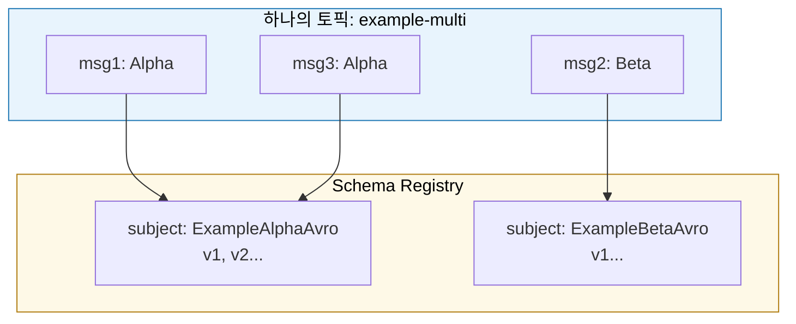
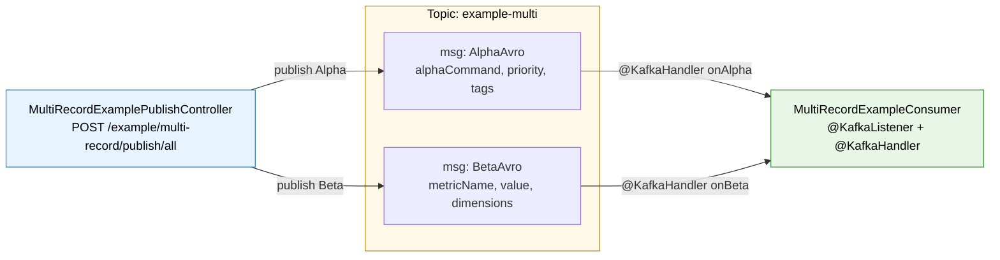

# 한 토픽에 여러 message 형태를 발행할 수 있는가?

---

> 03-01에서 "Fine-Grained vs Coarse-Grained"를 이야기했다. 이 글은 그 Coarse-Grained의 진짜 끝을 본다. 한 토픽에 의미가 다른 Avro record 두 개를 직접 부어 보고, 어떤 장치들이 그걸 가능하게 하는지, 그리고 어떤 함정이 같이 따라오는지 정리한다.

이 질문은 처음 들으면 두 가지 직관이 동시에 떠오른다. "토픽은 로그니까 무엇이든 들어가지 않을까?"와 "그래도 Consumer가 한 종류만 받도록 묶는 게 안전하지 않을까?"다. 둘 다 맞고, 둘 다 부족하다. 가능 여부는 직렬화 계층이 결정하고, 안전 여부는 컨슈머 계약이 결정하기 때문이다.


## 학습 목표

> *RecordNameStrategy 한 토픽 다중 record* 패턴이 가능한 메커니즘과 운영 함정을 동시에 이해한다.

이 장을 다 읽고 다음 다섯 가지에 자신 있게 답할 수 있으면 학습이 완료된다.

1. 단일 record + discriminator와 별개 record + RecordNameStrategy 두 접근의 진화 단위 차이를 설명할 수 있다.
2. RecordNameStrategy로 한 토픽에 여러 record가 공존할 수 있는 이유를 wire format과 subject 단위로 설명할 수 있다.
3. class-level `@KafkaListener` + `@KafkaHandler` dispatch와 `instanceof` 분기 dispatch를 비교할 수 있다.
4. `@RetryableTopic`이 옵션 A·B·C 각각과 어떻게 결합되는지/안 되는지 설명할 수 있다.
5. 다섯 가지 운영 함정(alien record 침투, retry 결합, SR 오염, 그룹 격리, deserializer 설정)을 말할 수 있다.


## 두 가지 접근의 분기점

> 같은 "여러 message 형태"라는 표현이 두 가지 완전히 다른 설계를 가린다. 이걸 먼저 구분해야 한다.

같은 토픽에 여러 의미의 메시지를 보내는 방법은 크게 두 갈래다.

| 접근 | 스키마 모양 | 분기 방법 | 진화 단위 |
|------|------------|----------|---------|
| **단일 record + discriminator 필드** | 한 record 안에 `eventType` enum 등으로 표현 | Consumer가 enum switch | 한 record 전체가 같이 진화 |
| **별개 record N개 + RecordNameStrategy** | 서로 다른 fullname의 Avro record | Consumer가 payload 런타임 타입으로 dispatch | record 별로 독립 진화 |

- 전자가 Kafka 사례에서 흔히 보이는 패턴이다. `OrderStatusChanged` 한 record 안에 `status` 필드가 `CREATED / PAID / SHIPPED`로 분기되는 식이다.
- 후자는 "사실은 다른 메시지인데 같은 토픽에 묶고 싶다"라는 운영 요구에서 출발한다. 후자 쪽이 이 글의 주제다.

왜 후자가 가능한지 한 줄로 답하면, Confluent wire format이 메시지 앞에 schema id 4바이트를 박아 두고 Schema Registry의 subject 이름 전략을 `RecordNameStrategy`로 두면 record 별로 subject가 갈라지기 때문이다.

이 두 장치가 없으면 같은 토픽에 두 종류 스키마를 부었을 때 컨슈머 쪽에서 바이트가 어긋나거나 subject가 충돌해 등록이 거부된다.


## Subject Name Strategy를 다시 보기

> Schema Registry가 스키마를 묶는 단위는 "토픽"이 아니라 "subject"다. subject 전략이 바뀌면 토픽-스키마 관계가 바뀐다.

### TopicNameStrategy

기본 전략은 `TopicNameStrategy`다. 토픽 이름에 `-value` 또는 `-key`를 붙여 subject를 만든다.

- 같은 토픽에 다른 fullname의 record를 보내면 한 subject 아래 호환되지 않는 두 스키마가 올라오려고 시도되며, 호환성 모드가 BACKWARD면 두 번째 등록이 거부된다. 이 전략에서는 한 토픽이 한 스키마와 1:1로 묶이는 셈이다.

### RecordNameStrategy

`RecordNameStrategy`로 바꾸면 subject는 Avro record의 fullname(예: `org.okestro.tps.avro.executor.ExampleAlphaAvro`)이 된다.

- 토픽 이름이 subject에 들어가지 않으므로, 한 토픽에 여러 record가 공존해도 각자 자기 fullname 아래 독립 진화한다. `TopicRecordNameStrategy`는 두 키를 결합한 절충안이다.



- 위 그림이 핵심이다. 토픽 한 칸에 들어간 메시지들이 출처 record 별로 다른 subject로 흩어져 등록된다.
- 이게 메시지 발행을 막지 않는 이유는 producer가 직렬화할 때마다 자기 record fullname을 subject로 찾아 schema id를 박아 넣기 때문이고, consumer가 정상 deserialize하는 이유는 schema id로 다시 정확한 reader schema를 끌어오기 때문이다.


## Consumer 측 dispatch는 어떻게 되는가?

> Producer가 자유롭게 부어도, 받는 쪽이 한 종류만 가정하고 있으면 운영 장애가 난다. dispatch 계약이 분기를 분리한다.

`KafkaAvroDeserializer` + `specific.avro.reader=true` 조합이 켜져 있으면 deserializer는 wire format 안 schema id로 정확한 record 타입을 알아내 `SpecificRecord` 인스턴스를 만든다. 이 인스턴스의 런타임 클래스는 메시지에 따라 매번 다르다.

Spring Kafka는 두 가지 dispatch 모델을 지원한다.

### 1. class-level `@KafkaListener` + 메서드별 `@KafkaHandler`

컨테이너가 페이로드의 런타임 클래스에 맞는 메서드를 자동으로 찾아 호출한다.

```java
@Component
@KafkaListener(
        topics = "tps.v305p.executor.evt.example-multi"
        , groupId = "executor-multi-record-example"
)
public class MultiRecordExampleConsumer {

    @KafkaHandler
    public void onAlpha(ExampleAlphaAvro msg) { ... }

    @KafkaHandler
    public void onBeta(ExampleBetaAvro msg) { ... }

    @KafkaHandler(isDefault = true)
    public void onUnknown(Object payload) {
        log.warn("Unhandled type: {}", payload.getClass());
    }
}
```

### 2. 단일 메서드 + `instanceof` 분기

메서드 시그니처를 `Object` 또는 공통 인터페이스로 받아 본문에서 타입 검사를 한다.

```java
@KafkaListener(topics = "...", groupId = "...")
public void onMessage(SpecificRecord payload) {
    if (payload instanceof ExampleAlphaAvro alpha) { ... }
    else if (payload instanceof ExampleBetaAvro beta) { ... }
    else { log.warn("Unhandled: {}", payload.getClass()); }
}
```

- 두 모델은 외관이 닮았지만 운영에서는 다르게 동작한다. 특히 재시도 정책이 갈리는데, 이 부분은 뒤의 함정 절에서 다시 본다.


## 재시도와 DLT를 어떻게 붙일 것인가

> dispatch 모델을 정했다고 끝이 아니다. 운영에서 메시지가 실패할 때 Spring Kafka의 `@RetryableTopic`이 어떻게 결합되는지에 따라 컨슈머 구조가 한 번 더 갈린다.

`@RetryableTopic`은 메서드 어노테이션이다. Spring Kafka는 어노테이션이 붙은 메서드를 원본 토픽 컨슈머로 등록하고, 같은 페이로드 시그니처의 컨슈머를 자동 생성된 `-retry-0`, `-retry-1` ... `-dlt` 토픽 각각에 붙인다. `@DltHandler` 메서드는 `-dlt` 토픽 전용 핸들러가 된다.

```
원본 토픽 → exception → -retry-0 (delay 1s)
        → exception → -retry-1 (delay 2s)
        → exception → -dlt (영구 저장, @DltHandler 호출)
```

- 문제는 class-level `@KafkaListener` + 메서드별 `@KafkaHandler` 구조에서 발생한다. Spring Kafka는 "어느 `@KafkaHandler`에 `@RetryableTopic`을 적용해야 하는가"를 결정할 공식 경로가 없다.
- 그래서 retry/DLT를 유지하려면 dispatch 구조를 두 가지 형태 중 하나로 다시 짜야 한다.

### 옵션 A: 단일 메서드 + `instanceof` 분기 (단일 retry 정책)

dispatch를 메서드 안 분기로 옮기면 `@RetryableTopic`을 자연스럽게 붙일 수 있다. `@Payload`로 페이로드를 받고, `@Header`로 Kafka 메타데이터(key, topic, offset 등)를 풍부하게 받는다.

```java
@Slf4j
@Component
public class MultiRecordExampleConsumer {

    @RetryableTopic(
            attempts = "3"
            , backoff = @Backoff(delay = 1000, multiplier = 2.0)
            , topicSuffixingStrategy = TopicSuffixingStrategy.SUFFIX_WITH_INDEX_VALUE
            , kafkaTemplate = "retryKafkaTemplate"
    )
    @KafkaListener(
            topics = "#{T(...Topics).EXECUTOR_EVT_EXAMPLE_MULTI.getValue()}"
            , groupId = "executor-multi-record-example"
    )
    public void onMessage(
            @Payload SpecificRecord payload
            , @Header(KafkaHeaders.RECEIVED_KEY) String key
            , @Header(KafkaHeaders.RECEIVED_TOPIC) String topic
            , @Header(KafkaHeaders.OFFSET) long offset
    ) {
        if (payload instanceof ExampleAlphaAvro alpha) {
            handleAlpha(alpha, key, offset);
        } else if (payload instanceof ExampleBetaAvro beta) {
            handleBeta(beta, key, offset);
        } else {
            log.warn("[multi-record] unhandled type={} key={}", payload.getClass(), key);
        }
    }

    @DltHandler
    public void onDlt(
            ConsumerRecord<String, SpecificRecord> record
            , @Header(KafkaHeaders.DLT_EXCEPTION_FQCN) String exceptionClass
            , @Header(KafkaHeaders.DLT_EXCEPTION_MESSAGE) String exceptionMessage
    ) {
        log.error("[multi-record] DLT topic={}, key={}, payloadClass={}, exception={}: {}"
                , record.topic(), record.key()
                , record.value() == null ? "null" : record.value().getClass().getName()
                , exceptionClass, exceptionMessage);
    }
}
```

자동 생성되는 토픽 구성은 다음과 같다.

- `tps.v305p.executor.evt.example-multi` (원본)
- `tps.v305p.executor.evt.example-multi-retry-0` (1초 후 재시도)
- `tps.v305p.executor.evt.example-multi-retry-1` (2초 후 재시도)
- `tps.v305p.executor.evt.example-multi-dlt` (영구 저장)

이 옵션의 한계는 명확하다. Alpha만 3회 재시도하고 Beta는 5회 재시도하는 식의 **타입별 retry 정책 분리가 불가능**하다. `@RetryableTopic`의 `include`/`exclude`는 *예외 클래스* 기준이지 *payload 타입* 기준이 아니다.

### 옵션 B: 타입별 메서드 분리 (타입별 retry 정책)

타입마다 다른 retry/DLT가 필요하면 메서드 자체를 분리한다. 같은 토픽을 두 메서드가 같이 듣게 하면 **컨슈머 그룹 ID를 분리**해야 각 메서드가 모든 메시지를 받는다. 그리고 자기 타입이 아닌 레코드는 `RecordFilterStrategy`로 즉시 skip 한다.

```java
@Slf4j
@Component
public class MultiRecordExampleConsumer {

    @RetryableTopic(
            attempts = "3"
            , backoff = @Backoff(delay = 1000, multiplier = 2.0)
            , kafkaTemplate = "retryKafkaTemplate"
            , retryTopicSuffix = "-alpha-retry"
            , dltTopicSuffix = "-alpha-dlt"
    )
    @KafkaListener(
            topics = "#{T(...Topics).EXECUTOR_EVT_EXAMPLE_MULTI.getValue()}"
            , groupId = "executor-multi-example-alpha"
            , filter = "alphaOnlyFilter"
    )
    public void onAlpha(
            @Payload ExampleAlphaAvro message
            , @Header(KafkaHeaders.RECEIVED_KEY) String key
            , @Header(KafkaHeaders.OFFSET) long offset
    ) {
        log.info("[multi-record/alpha] alphaCommand={}, priority={}, key={}, offset={}"
                , message.getAlphaCommand(), message.getPriority(), key, offset);
    }

    @DltHandler
    public void onAlphaDlt(ConsumerRecord<String, ExampleAlphaAvro> record) {
        log.error("[multi-record/alpha] DLT key={} offset={}", record.key(), record.offset());
    }

    @RetryableTopic(
            attempts = "5"
            , backoff = @Backoff(delay = 500, multiplier = 1.5)
            , kafkaTemplate = "retryKafkaTemplate"
            , retryTopicSuffix = "-beta-retry"
            , dltTopicSuffix = "-beta-dlt"
    )
    @KafkaListener(
            topics = "#{T(...Topics).EXECUTOR_EVT_EXAMPLE_MULTI.getValue()}"
            , groupId = "executor-multi-example-beta"
            , filter = "betaOnlyFilter"
    )
    public void onBeta(
            @Payload ExampleBetaAvro message
            , @Header(KafkaHeaders.RECEIVED_KEY) String key
            , @Header(KafkaHeaders.OFFSET) long offset
    ) {
        log.info("[multi-record/beta] metricName={}, value={}, key={}, offset={}"
                , message.getMetricName(), message.getValue(), key, offset);
    }

    @DltHandler
    public void onBetaDlt(ConsumerRecord<String, ExampleBetaAvro> record) {
        log.error("[multi-record/beta] DLT key={} offset={}", record.key(), record.offset());
    }
}
```


별도 `@Configuration`에 RecordFilterStrategy 빈을 둔다. 핸들러가 자기 타입이 아닌 레코드를 받으면 skip 신호를 반환해 다음 메시지로 넘긴다.

```java
@Configuration
public class MultiRecordFilterConfig {

    @Bean("alphaOnlyFilter")
    public RecordFilterStrategy<String, Object> alphaOnlyFilter() {
        return record -> !(record.value() instanceof ExampleAlphaAvro);
    }

    @Bean("betaOnlyFilter")
    public RecordFilterStrategy<String, Object> betaOnlyFilter() {
        return record -> !(record.value() instanceof ExampleBetaAvro);
    }
}
```

자동 생성 토픽 (옵션 B):

- `tps.v305p.executor.evt.example-multi` (원본)
- `tps.v305p.executor.evt.example-multi-alpha-retry-0`, `-alpha-retry-1` (Alpha 재시도)
- `tps.v305p.executor.evt.example-multi-alpha-dlt` (Alpha DLT)
- `tps.v305p.executor.evt.example-multi-beta-retry-0` ... `-beta-retry-3` (Beta 5회 재시도)
- `tps.v305p.executor.evt.example-multi-beta-dlt` (Beta DLT)

`retryTopicSuffix`를 타입별로 분리하지 않으면 두 메서드가 같은 `-retry-0` 토픽을 공유해 재시도 흐름이 섞인다. suffix 분리가 옵션 B의 필수 조건이다.

### 두 옵션의 비교

| 측면 | 옵션 A (instanceof) | 옵션 B (타입별 메서드) |
|------|--------------------|----------------------|
| retry 정책 | 전 타입 동일 | 타입별 다른 attempts/backoff |
| DLT 분리 | 1개 (`-dlt`) | 타입별 (`-alpha-dlt`, `-beta-dlt`) |
| 컨슈머 그룹 | 1개 | 타입 수만큼 분리 (그룹 ID 충돌 시 메시지 분할) |
| 토픽 트래픽 | 1번 fetch | 그룹 수만큼 fetch (broker 부하 증가) |
| `@Payload` 활용 | `SpecificRecord` 추상 타입 | 구체 타입 그대로 |
| 코드 복잡도 | 낮음, 분기 본문에서 결정 | 중간, filter 빈과 그룹 ID 관리 추가 |
| 권장 상황 | 타입 간 retry 정책이 동일할 때 | Alpha는 빠른 재시도, Beta는 느린 재시도처럼 정책이 다를 때 |

### 어노테이션 활용 팁

두 옵션 모두 `@Payload`와 `@Header`를 적극 활용하면 로그·트레이싱·재처리 도구가 풍부해진다.

```java
public void onMessage(
        @Payload SpecificRecord payload
        , @Header(KafkaHeaders.RECEIVED_KEY) String key
        , @Header(KafkaHeaders.RECEIVED_TOPIC) String topic
        , @Header(KafkaHeaders.RECEIVED_PARTITION) int partition
        , @Header(KafkaHeaders.OFFSET) long offset
        , @Header(KafkaHeaders.RECEIVED_TIMESTAMP) long timestamp
        , @Header(name = "correlation-id", required = false) String correlationId
)
```

DLT 핸들러에서는 다음 헤더가 자동으로 채워진다.

| 헤더 | 의미 |
|------|------|
| `KafkaHeaders.DLT_ORIGINAL_TOPIC` | 원본 토픽 이름 |
| `KafkaHeaders.DLT_EXCEPTION_FQCN` | 마지막 예외의 클래스명 |
| `KafkaHeaders.DLT_EXCEPTION_MESSAGE` | 마지막 예외의 메시지 |
| `KafkaHeaders.DLT_EXCEPTION_STACKTRACE` | 마지막 예외의 스택 트레이스 |
| `KafkaHeaders.DLT_ORIGINAL_OFFSET` | 원본 메시지의 offset |

이 헤더들을 `@Header`로 받아 운영 알람과 재처리 도구에 그대로 흘려보내면 DLT 분석이 훨씬 단순해진다.


## 직접 만들어 본 PoC

> 학습은 직접 부어 보는 데서 온다. TPS 코드베이스에 별도 토픽을 하나 만들고, 별개 record 두 개를 동시에 넣는 컨트롤러와 컨슈머를 만들어 봤다.

기존 `Topics.EXECUTOR_EVT_EXAMPLE`은 단일 record(`ExampleMessageAvro`)와 1:1로 묶여 있어서 그 자리에 alien record를 부으면 기존 `ExampleMessageConsumer`가 deserialize 실패로 retry/DLT 폭주를 일으킨다. 그래서 `Topics.EXECUTOR_EVT_EXAMPLE_MULTI`라는 새 토픽을 만들고 그곳에만 두 개의 record(`ExampleAlphaAvro`, `ExampleBetaAvro`)를 발행한다.



- 두 record의 필드 모양은 의도적으로 다르게 잡았다. Alpha는 커맨드 모양(`alphaCommand`, `priority`, `tags`), Beta는 메트릭 모양(`metricName`, `value`, `sampledAtEpochMillis`, `dimensions`)이다.
- discriminator enum이 아니라 정말로 다른 record라는 점을 강조하기 위해서다. 둘 다 `correlationId` 필드를 공유해 트레이싱 도구가 같이 따라올 수 있게 했다.

### 왜 dispatch 모델을 옵션 C로 선택했는가

> 위에서 옵션 A(단일 메서드 + `instanceof`)와 옵션 B(타입별 메서드 + 그룹/필터 분리)를 살펴봤다. PoC는 그 둘 어디에도 속하지 않는 옵션 C, 즉 class-level `@KafkaListener` + `@KafkaHandler` 다중 메서드를 골랐고, `@RetryableTopic`을 일부러 빼두었다. 그 판단의 근거를 정리한다.

옵션 비교에서 빠진 한 가지가 있었다. *옵션 C는 dispatch 자체가 가장 깔끔하지만 `@RetryableTopic`과 결합되지 않는다*는 점이다. PoC의 목적은 한 토픽에 여러 record를 부었을 때 **컨슈머 측 분기가 어떻게 깔끔해질 수 있는가**를 확인하는 것이었으므로, 분기를 흐리게 만드는 옵션 A를 피하고 그룹/필터 빈을 추가로 매니징해야 하는 옵션 B도 피했다. 운영 retry/DLT 토폴로지는 이 글이 다루지 않는 별도 문제로 미뤄두고, PoC는 **dispatch 명료성**에 집중한다.

| 측면 | 옵션 A (`instanceof`) | 옵션 B (타입별 메서드) | **옵션 C (`@KafkaHandler`, PoC)** |
|------|----------------------|----------------------|--------------------------------|
| dispatch 가독성 | 분기가 메서드 본문에 숨음 | 메서드별 분리 명확 | **메서드 시그니처가 dispatch 자체** |
| `@RetryableTopic` 결합 | 자연스러움 | 자연스러움(타입별 정책 가능) | **불가** (메서드 레벨이라 class-level dispatch와 충돌) |
| 컨슈머 그룹 | 1개 | 타입 수만큼 | 1개 |
| 추가 코드 | 없음 | filter 빈 + 그룹 ID 분리 | 없음 |
| PoC 적합도 | 보통 | 낮음(인프라 부담) | **높음**(보일러플레이트 0) |

옵션 C를 선택하면서 동시에 두 가지 가드를 의식적으로 받아들였다. 첫째, **기본 `ErrorHandler`(seek-to-current)** 로 떨어진 메시지는 무한 재시도 큐에 들어가지 않고 컨테이너가 같은 offset을 반복해서 시도한다. 운영 토픽이 아니라 PoC 토픽이므로 이 동작이 허용 범위에 들어간다. 둘째, `message-lib` 측 `RetryableTopicConfigurationGuardTest`가 "**retry 컨슈머는 `kafkaTemplate="retryKafkaTemplate"`을 명시해야 한다**"는 정책을 강제한다. 옵션 C는 `@RetryableTopic` 자체를 쓰지 않으므로 이 가드의 검사 대상에 들어가지 않는다. 즉 PoC가 운영 정책의 사각지대로 새지 않는다.

### 받을 때는 어떻게 동작하는가

> 한 토픽에 두 record가 섞여 들어올 때 컨테이너가 어떻게 정확한 메서드로 라우팅하는지의 흐름을 따라가 본다. 발행 측보다 받는 측이 더 많은 장치에 의존한다.

수신 흐름은 네 단계로 쪼개진다.

1. **wire format → schema id 추출**: 메시지 첫 5바이트(magic 1 + schema id 4)에서 schema id를 꺼낸다.
2. **schema id → reader schema**: Schema Registry에서 해당 id에 묶인 Avro 스키마를 받아온다.
3. **reader schema → `SpecificRecord` 인스턴스**: `KafkaAvroDeserializer`의 `specific.avro.reader=true`가 켜져 있으면 `ExampleAlphaAvro`/`ExampleBetaAvro`처럼 컴파일된 구체 클래스의 인스턴스를 만든다.
4. **인스턴스 런타임 클래스 → `@KafkaHandler` 메서드**: Spring Kafka의 `MessagingMessageListenerAdapter`가 페이로드 클래스에 일치하는 핸들러를 골라 호출한다.

3번이 끊기면 4번이 무력해진다. `specific.avro.reader=true`가 빠지면 deserializer가 `GenericRecord`만 만들고, `onAlpha(ExampleAlphaAvro)` 같은 시그니처가 절대 매칭되지 않아 모든 메시지가 `@KafkaHandler(isDefault=true)`로만 떨어진다. TPS에서는 `KafkaDefaultsEnvironmentPostProcessor`가 이 플래그를 부팅 시점에 강제 주입해 누락을 방지한다.

PoC 컨슈머의 실제 코드는 다음과 같다. dispatch 책임이 메서드 시그니처에만 있고 본문에는 분기 로직이 전혀 없다는 점이 옵션 C의 핵심이다.

```java
@Slf4j
@Component
@KafkaListener(
        topics = "#{T(...Topics).EXECUTOR_EVT_EXAMPLE_MULTI.getValue()}"
        , groupId = "${executor.example.multi-consumer-group:executor-multi-record-example}"
)
public class MultiRecordExampleConsumer {

    @KafkaHandler
    public void onAlpha(ExampleAlphaAvro message) {
        log.info("[multi-record] alpha received: alphaCommand={}, priority={}, tags={}, correlationId={}"
                , message.getAlphaCommand(), message.getPriority()
                , message.getTags(), message.getCorrelationId());
    }

    @KafkaHandler
    public void onBeta(ExampleBetaAvro message) {
        log.info("[multi-record] beta received: metricName={}, value={}, sampledAt={}, dimensions={}, correlationId={}"
                , message.getMetricName(), message.getValue()
                , message.getSampledAtEpochMillis(), message.getDimensions()
                , message.getCorrelationId());
    }

    @KafkaHandler(isDefault = true)
    public void onUnknown(Object payload) {
        log.warn("[multi-record] unhandled record type on topic: payloadClass={}"
                , payload == null ? "null" : payload.getClass().getName());
    }
}
```

핵심 설계 결정 세 가지를 짚어 둔다.

- **컨슈머 그룹 격리**: `executor-multi-record-example` 그룹을 기존 `executor-example`과 분리해 운영 컨슈머의 lag 통계에 PoC 트래픽이 섞이지 않게 했다. 운영 토픽과 별도 토픽을 쓰지만 컨슈머 그룹까지 격리하는 게 안전 마진이다.
- **`isDefault=true` 폴백**: 미래에 `ExampleGammaAvro` 같은 record가 등록되어도 메시지가 통째로 누락되지 않고 WARN 로그로 가시화된다. 이 폴백이 없으면 매칭 실패 시 컨테이너가 어떻게 반응할지 deserializer 설정에 따라 달라져 디버깅이 어려워진다.
- **retry/DLT 미적용**: 위 절에서 설명한 이유로 일부러 뺐다. 처리 실패 시 기본 `ErrorHandler`가 같은 offset을 반복 시도하므로, PoC 핸들러 본문은 의도적으로 단순한 로그만 남기게 두었다. 영구 부작용을 일으키지 않는 한 반복 시도가 데이터 손상으로 이어지지 않는다.

이 세 가지가 모이면 "한 토픽에 두 record가 섞여 들어오는 컨슈머"가 운영 정책의 일부를 포기하는 대신 **dispatch 명료성을 최대화한** 형태가 된다. 운영용으로 확장할 때 retry/DLT가 필요해지는 순간이 곧 옵션 A 또는 B로 재설계할 시점이다.

### 발행 측 코드

발행 측 코드는 단순하다. `EventPublisher.publish(key, record, topic)` 시그니처에 record 인스턴스를 그대로 넘기면 끝이다. 시그니처에 type 파라미터가 없는데 어떻게 구분되냐 하면, 답은 `SpecificRecord.getSchema().getFullName()`이 직렬화 단계에서 자동으로 사용되기 때문이다.

```java
@PostMapping("/publish/all")
@Transactional
public ResponseEntity<Map<String, Object>> publishAll(...) {
    String key = UUID.randomUUID().toString();
    publish(key, buildAlpha(...));
    publish(key, buildBeta(...));
    return ResponseEntity.ok(...);
}

private void publish(String key, SpecificRecord record) {
    eventPublisher.publish(key, record, Topics.EXECUTOR_EVT_EXAMPLE_MULTI.getValue());
}
```

- 엔드포인트를 `@Profile("local-docker")`로 묶어 둔 이유는 운영 경로와 분리하기 위해서다. PoC 컨트롤러가 클러스터에 노출되면 안 된다.


## 함정 다섯 가지

> 가능하다는 사실과 안전하다는 사실은 다르다. 막상 만들어 보면 다섯 곳에서 발이 걸린다.

첫째, **alien record를 기존 토픽에 그대로 부으면 기존 컨슈머가 죽는다**. `@Payload ExampleMessageAvro`로 타입을 고정한 컨슈머에 `ExampleAlphaAvro`가 도착하면 메시지 컨버터가 변환에 실패하고, `@RetryableTopic`이 걸려 있으면 retry 토픽과 DLT까지 메시지가 쌓인다. 새 record를 같은 토픽에 묶고 싶다면 컨슈머 쪽도 같이 멀티 타입으로 바꿔야 하고, 그렇지 않으면 별도 토픽으로 가는 게 안전하다.

둘째, **`@RetryableTopic`과 `@KafkaHandler`는 잘 어울리지 않는다**. `@RetryableTopic`은 메서드 레벨 어노테이션이고, class-level `@KafkaListener` + `@KafkaHandler` 다중 메서드 dispatch와 깔끔히 결합하지 않는다. 자동 재시도/DLT가 필요하다면 단일 메서드 + `instanceof` 분기 형태로 가야 한다. 대신 그 경우 핸들러 시그니처가 한 메서드로 합쳐져서 코드가 단순화되는 대신 가독성은 떨어진다.

셋째, **Schema Registry 오염을 조심해야 한다**. `auto.register.schemas=true`가 켜진 환경에서 dev iteration을 하면 변형 스키마가 자꾸 등록된다. 호환성 정책(BACKWARD 등)이 켜져 있으면 호환되는 변경만 등록되지만, 한 번 등록된 schema id는 사라지지 않는다. 호환이 깨질 만한 실험은 로컬 SR(`docker compose down -v`)에서만 한다.

넷째, **컨슈머 그룹 격리를 의식해야 한다**. 같은 토픽을 다른 컨슈머가 같이 듣는 구조라면 컨슈머 그룹 ID가 같아지지 않게 한다. 같은 그룹이면 파티션이 나뉘어 한쪽 컨슈머만 메시지를 받는다. 모든 컨슈머가 모든 메시지를 받아야 하면 그룹을 분리해야 한다.

다섯째, **deserializer 설정 누락이 무서운 침묵을 낳는다**. `specific.avro.reader=true`가 없으면 `KafkaAvroDeserializer`는 `GenericRecord`를 반환하고, `@KafkaHandler onAlpha(ExampleAlphaAvro msg)` 같은 시그니처는 절대 매칭되지 않는다. 메시지가 default 핸들러로만 떨어지면서 이유 없이 dispatch가 깨지는 모습으로 보인다. 설정 한 줄이 빠지면 디버깅 한나절이 사라진다.


## 단일 record + discriminator vs 별개 record N개

> "그래서 둘 중 뭘 써야 합니까?"가 결국 남는 질문이다. 답은 진화 축에 달려 있다.

| 측면 | 단일 record + enum 분기 | 별개 record N개 + RecordNameStrategy |
|------|------------------------|--------------------------------------|
| 스키마 진화 단위 | 한 record 전체가 같이 진화 | record 별로 독립 진화 |
| 필드 nullability 부담 | 변형마다 의미가 다른 필드가 nullable로 쌓임 | 변형 사이 필드 교차 없음 |
| Consumer dispatch | `switch(enum)`, 메서드 시그니처 한 종류 | `@KafkaHandler` 또는 `instanceof` 분기 |
| `@RetryableTopic` 적용 | 자연스러움 | 단일 메서드 + 분기로 우회 |
| 새 변형 추가 비용 | enum 값 추가 + switch case 추가 | 새 `.avsc` 파일 + 핸들러 추가 |
| 권장 상황 | 같은 도메인 이벤트의 라이프사이클 변형 (EXCN/CMPTN, CREATED/PAID/SHIPPED) | 의미가 본질적으로 다른 메시지를 운영 단순화 목적으로 한 토픽에 묶을 때 |

직관적인 가이드는 이렇다. "이 메시지들이 같은 aggregate의 시간순 라이프사이클인가?"라고 자문해서 답이 그렇다면 단일 record + discriminator가 자연스럽다. "사실은 별개 행위인데 운영상 한 토픽에 묶고 싶다"라면 별개 record + RecordNameStrategy 쪽이 코드 복잡도와 진화 자유도 양쪽에서 유리하다.

03-01의 분류로 다시 매핑하면 단일 record + discriminator는 **Fine-Grained 토픽 + 풍부한 enum**에 해당하고, 별개 record는 **Coarse-Grained 토픽 + RecordNameStrategy**에 해당한다. 03-01이 "토픽을 얼마나 쪼갤 것인가"를 다뤘다면 이 글은 "쪼개지 않은 토픽 안을 어떻게 다중 의미로 운영할 것인가"를 다룬다.


## 다시 처음 질문으로

> "한 토픽에 여러 message 형태를 발행할 수 있는가?"의 답은 "할 수 있지만, 직렬화 계층과 컨슈머 계약을 같이 봐야 한다"이다.

정확하게는 이렇게 다시 쓸 수 있다. Confluent wire format이 schema id로 record를 식별하기 때문에 직렬화 측에서는 충돌이 일어나지 않는다. Schema Registry의 subject 전략을 `RecordNameStrategy`로 바꾸면 한 토픽이 여러 record와 묶이는 게 등록 단계에서 막히지 않는다. 받는 쪽은 `KafkaAvroDeserializer` + `specific.avro.reader=true`로 정확한 `SpecificRecord` 인스턴스를 얻고, `@KafkaHandler` 다중 메서드 또는 `instanceof` 분기로 dispatch한다. 여기까지가 "할 수 있다"의 의미다.

그러나 운영에서 안전하려면 다른 조건이 또 붙는다. 기존 컨슈머의 단일 타입 가정을 깨면 안 되고, retry/DLT 토폴로지와 dispatch 모델이 호환되어야 하고, Schema Registry가 dev iteration으로 오염되지 않게 격리해야 한다. 가능 여부는 직렬화 계층이 결정하지만, 안전 여부는 컨슈머 계약과 운영 정책이 결정한다.

이 두 줄이 이 글의 결론이다.


## 면접 대비 Q&A

> 면접에서 자주 나오는 형태로 5개. 답을 보지 않고 먼저 입으로 답해 본 뒤 비교한다.

### Q1. 한 토픽에 두 종류 record를 부으려면 어떤 인프라 설정이 필요한가?

세 가지가 동시에 갖춰져야 한다. 첫째, Producer 측 Schema Registry subject 전략을 `RecordNameStrategy`(또는 `TopicRecordNameStrategy`)로 변경해 토픽이 아닌 record fullname으로 subject가 갈리게 한다. 둘째, Consumer 측 `KafkaAvroDeserializer`에 `specific.avro.reader=true`를 켜서 schema id에서 정확한 `SpecificRecord` 구체 클래스를 만들어 내게 한다. 셋째, dispatch는 `@KafkaHandler` 다중 메서드나 `instanceof` 분기로 페이로드 런타임 타입에 따라 분기시킨다. 세 가지 중 하나만 빠져도 wire format이 깨지거나 dispatch가 무력해진다.

### Q2. 단일 record + discriminator와 별개 record 중 어느 쪽을 골라야 하나?

"이 메시지들이 같은 aggregate의 시간순 라이프사이클인가"를 자문한다. 같은 주문의 CREATED → PAID → SHIPPED처럼 *한 aggregate의 상태 전이*면 단일 record + enum discriminator가 자연스럽다. 진화 단위가 하나라 enum 추가만으로 새 변형이 들어온다. 반대로 *본질적으로 다른 행위*인데 운영상 같은 토픽에 묶고 싶으면 별개 record + RecordNameStrategy다. 진화 단위가 record별로 갈려 한쪽 진화가 다른 쪽에 영향을 주지 않는다.

### Q3. `@KafkaHandler` 다중 메서드 방식이 가장 깔끔한데 왜 운영에서는 옵션 A·B를 권하나?

`@RetryableTopic`이 메서드 레벨 어노테이션이라 class-level dispatch와 결합되지 않기 때문이다. `@KafkaHandler` 여러 개에 `@RetryableTopic`을 각각 붙여도 Spring Kafka는 어느 메서드를 원본·retry·dlt 컨슈머로 묶을지 결정하지 못한다. 그래서 운영 retry/DLT가 필요하면 옵션 A(단일 메서드 + `instanceof`)나 옵션 B(타입별 메서드 + 그룹/필터 분리) 둘 중 하나를 택해야 한다. dispatch 명료성과 retry 토폴로지 중 하나는 양보해야 하는 트레이드오프다.

### Q4. 옵션 B에서 컨슈머 그룹을 분리해야 하는 이유는?

같은 컨슈머 그룹이면 파티션이 두 메서드 사이에서 나뉘어 *한쪽만 모든 메시지를 받는* 상태가 된다. Alpha와 Beta 메시지가 무작위로 어느 한 메서드에만 떨어지므로 dispatch 자체가 망가진다. 그룹을 `executor-multi-alpha`와 `executor-multi-beta`로 분리하면 두 메서드가 같은 토픽을 *각자 독립적으로* 소비해 모든 메시지가 양쪽 모두에 도달한다. 대신 fetch 트래픽이 두 배가 되므로 브로커 부하가 늘어난다.

### Q5. alien record를 기존 토픽에 그냥 부으면 왜 위험한가?

기존 Consumer가 `@Payload ExampleMessageAvro` 같이 특정 타입을 고정해 두면, alien record가 도착할 때 메시지 컨버터가 변환에 실패한다. 그 자체로도 운영 장애지만, `@RetryableTopic`이 같이 걸려 있으면 같은 메시지가 retry 토픽과 DLT까지 줄줄이 쌓여 *Schema Registry·retry 토픽 양쪽이 한꺼번에 오염*된다. 새 record를 같은 토픽에 묶고 싶다면 컨슈머도 함께 멀티 타입으로 바꿔 *동시 배포*하거나, 별도 토픽을 새로 만들고 점진적으로 이관하는 게 안전하다.


## 관련 문서

- [02-02.Schema Registry](01-02.Schema%20Registry.md) — Confluent wire format과 subject 전략의 근거
- [02-03.Avro](01-03.Avro.md) — `SpecificRecord` 자동 생성과 RecordNameStrategy 활용
- [02-06.Avro 스키마 진화 패턴](01-06.Avro%20스키마%20진화%20패턴.md) — record 별 독립 진화가 가능해지는 이유
- [03-01.토픽 디자인](../03_TopicDesign/01-01.토픽%20디자인.md) — Fine-Grained vs Coarse-Grained의 분기점


---

> **TPS 적용 사례** — `okestro/tps-gitlab2`
>
> - **모듈/위치**: `message-lib/src/main/avro/executor/ExampleAlphaAvro.avsc`, `ExampleBetaAvro.avsc`, `topic/Topics.java`(EXECUTOR_EVT_EXAMPLE_MULTI), `executor/engine/src/main/java/org/okestro/tps/example/MultiRecordExamplePublishController.java`, `MultiRecordExampleConsumer.java`
> - **요점**: 운영 경로의 `EXECUTOR_EVT_EXAMPLE`은 단일 record와 1:1 결합 상태로 보존하고, 별개 record 두 개를 같이 부어 보기 위해 새 토픽 `tps.v305p.executor.evt.example-multi`를 신설했습니다. `EventPublisher.publish(key, record, topic)`은 type 파라미터를 받지 않으며 record fullname으로 자동 식별합니다. 컨슈머는 class-level `@KafkaListener` + 메서드별 `@KafkaHandler` 두 개와 `isDefault=true` 폴백을 두었고, `@RetryableTopic`은 호환성 문제로 빼고 기본 `ErrorHandler`로 운영합니다. `AvroSerializer.java`의 `RecordNameStrategy` 설정과 `KafkaDefaultsEnvironmentPostProcessor.java`의 `specific.avro.reader=true` 설정이 이 패턴을 가능하게 만드는 두 축입니다.
> - **상세**: 컨트롤러는 `@Profile("local-docker")`로 운영 환경에서 비활성화하며, 컨슈머 그룹은 `executor-multi-record-example`로 기존 `executor-example`과 격리합니다. `/example/multi-record/publish/all` 한 번 호출이 동일 트랜잭션 안에서 Alpha+Beta를 outbox에 기록해 둘이 같은 메시지 흐름으로 발행됨을 확인할 수 있습니다.
