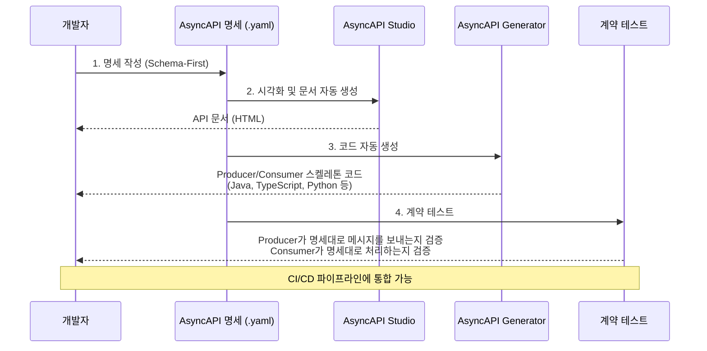

# AsyncAPI 명세

---

> AsyncAPI는 이벤트 기반 API를 기술하기 위한 명세 표준이다. 채널(토픽/큐), 메시지 스키마, 프로토콜 바인딩을 정의해 "이 토픽에 어떤 메시지가 오는가?"라는 질문에 대한 Single Source of Truth를 제공한다.


## 학습 목표

> AsyncAPI를 *왜 쓰고 어떻게 도구화하는지*로 이해한다.

이 장을 다 읽고 다음 다섯 가지에 자신 있게 답할 수 있으면 학습이 완료된다.

1. AsyncAPI가 해결하는 문제(토픽별 SSOT)를 설명할 수 있다.
2. AsyncAPI 3.x의 핵심 섹션(`channels`, `operations`, `components.messages`)을 구분할 수 있다.
3. AsyncAPI Studio·Generator·CLI·Microcks·SpringWolf 각각의 역할을 설명할 수 있다.
4. Swagger(OpenAPI) 도구 생태계와 SpringWolf의 매핑을 설명할 수 있다.
5. AsyncAPI 명세 변경을 CI에서 어떤 게이트로 잡을 수 있는지 설명할 수 있다.


## 1. 명세 예시

```yaml
asyncapi: '3.0.0'
info:
  title: 주문 서비스 API
  version: '1.0.0'
  description: 주문 관련 이벤트를 발행하는 서비스

channels:
  orderCreated:
    address: 'orders.created'
    messages:
      orderCreatedMessage:
        $ref: '#/components/messages/OrderCreated'

  orderCancelled:
    address: 'orders.cancelled'
    messages:
      orderCancelledMessage:
        $ref: '#/components/messages/OrderCancelled'

operations:
  publishOrderCreated:
    action: send
    channel:
      $ref: '#/channels/orderCreated'
    summary: 주문 생성 이벤트 발행

  publishOrderCancelled:
    action: send
    channel:
      $ref: '#/channels/orderCancelled'
    summary: 주문 취소 이벤트 발행

components:
  messages:
    OrderCreated:
      payload:
        type: object
        properties:
          orderId:
            type: string
          customerId:
            type: string
          amount:
            type: number
          currency:
            type: string
            default: KRW
        required:
          - orderId
          - customerId
          - amount

    OrderCancelled:
      payload:
        type: object
        properties:
          orderId:
            type: string
          reason:
            type: string
        required:
          - orderId
```

`channels`는 토픽 주소를, `operations`는 *그 채널을 통해 무엇을 하는가*(send/receive)를, `components.messages`는 *어떤 메시지가 흐르는가*(payload 스키마)를 정의한다. 3.x에서 `operations`가 별도 섹션으로 분리되어 동일 채널을 send/receive 양쪽에서 재사용하기 쉬워졌다.


## 2. 도구 생태계



- **AsyncAPI Studio**: 브라우저 기반 편집기와 실시간 미리보기를 제공한다.
- **AsyncAPI Generator**: 명세서에서 코드, 문서, 다이어그램을 자동 생성한다.
- **AsyncAPI CLI**: 명세 검증, 번들링, 변환을 수행한다.
- **Microcks**: AsyncAPI 명세 기반 mock 서버와 계약 테스트를 제공한다.
- **SpringWolf**: Spring Boot 어노테이션에서 AsyncAPI 문서를 자동 생성한다.


## 3. SpringWolf

Swagger가 `@RestController`에서 OpenAPI 문서를 자동 생성하듯, SpringWolf는 `@KafkaListener` 같은 리스너 어노테이션에서 AsyncAPI 문서를 자동 생성한다.

| Swagger (REST)                  | SpringWolf (Event-Driven)                      | 역할                        |
| ------------------------------- | ---------------------------------------------- | --------------------------- |
| `springdoc-openapi`             | `springwolf-kafka`                             | 자동 문서 생성 라이브러리   |
| `@RestController` 자동 감지     | `@KafkaListener` 자동 감지                     | Consumer 문서화             |
| `@Operation`                    | `@AsyncPublisher` / `@AsyncListener`           | 추가 메타데이터 어노테이션  |
| `@Schema`                       | 페이로드 클래스에서 자동 추출                  | 메시지 스키마 문서화        |
| Swagger UI (`/swagger-ui.html`) | SpringWolf UI (`/springwolf/asyncapi-ui.html`) | 웹 UI                       |
| "Try it out" 버튼               | "Publish" 버튼                                 | 브라우저에서 직접 호출/발행 |
| OpenAPI 3.x JSON                | AsyncAPI 3.x JSON                              | 출력 스펙                   |


## 4. 면접 대비 Q&A

> 면접에서 자주 나오는 형태로 5개. 답을 보지 않고 먼저 입으로 답해 본 뒤 비교한다.

### Q1. AsyncAPI가 해결하는 핵심 문제는?

"이 토픽에 어떤 메시지가 흐르는가"에 대한 Single Source of Truth 부재다. 메시징 환경은 Producer와 Consumer가 서로의 코드를 모르는 채로 동작하므로, 토픽 계약을 *코드 밖*에 명문화하지 않으면 Consumer가 추측으로 파싱하거나 메시지를 받아본 후에야 계약을 알게 된다. AsyncAPI 명세 파일을 두면 채널·메시지·바인딩이 한곳에 모이고, 코드 생성·문서화·계약 테스트가 그 위에서 자동화된다.

### Q2. AsyncAPI 3.0이 2.x와 비교해 무엇이 달라졌나?

`operations`가 `channels`에서 분리됐다. 2.x에서는 채널 안에 `publish`/`subscribe`를 직접 적었는데, 그게 "이 채널 입장에서의 동작"이라 누가 publisher고 누가 subscriber인지 헷갈리는 문제가 있었다. 3.x는 `channels`에 *주소와 메시지*만 두고, `operations`에서 `action: send|receive`로 *애플리케이션 관점*의 동작을 따로 선언한다. 같은 채널을 send/receive 양쪽에서 재사용하기 쉬워졌다.

### Q3. SpringWolf가 Swagger와 같은 방향성을 가지는 이유는?

둘 다 "코드에 박힌 라우팅 메타데이터를 외부 명세로 자동 추출"하는 패턴이다. Swagger는 `@RestController`/`@RequestMapping`을, SpringWolf는 `@KafkaListener`/`@AsyncPublisher`를 스캔해 명세를 만든다. 결과적으로 "코드를 진실로 두고 문서는 자동 생성"되므로 명세 drift가 줄어든다. 단점은 *발행 측에서 명세부터 설계하는 schema-first* 방식을 따르기 어렵다는 점인데, 그 경우는 정적 `.yaml` 파일을 SSOT로 두고 코드 생성을 거꾸로 돌리는 방식과 병행한다.

### Q4. AsyncAPI 명세 변경을 CI에서 어떻게 게이트하나?

세 단계가 일반적이다. 첫째 `asyncapi validate`로 문법 검증, 둘째 이전 버전과의 diff를 PR 코멘트로 자동 첨부, 셋째 Microcks 같은 mock 서버로 *명세 기반 계약 테스트*를 돌려 Producer/Consumer가 명세대로 동작하는지 검증한다. Avro와 결합돼 있다면 Schema Registry 호환성 검사도 같이 돌린다. 명세 변경이 곧 사고 영역이므로, 게이트가 없으면 추적 자체가 어려워진다.

### Q5. Microcks 같은 mock 서버가 AsyncAPI에서 갖는 의미는?

OpenAPI 환경에서 Postman/WireMock이 하던 역할을 대체한다. Producer를 아직 안 만든 상태에서 Consumer를 만들고 싶을 때, Microcks가 AsyncAPI 명세를 읽어 mock 메시지를 토픽에 흘려준다. 거꾸로 Consumer가 없을 때 Producer가 보낸 메시지의 형식을 검증한다. Pact 같은 contract test의 분산 메시징 버전이라 생각하면 쉽다.


## 5. 관련 문서

- [02-04.EventEnvelope 적용](../01_MessageContract/01-04.EventEnvelope%20적용.md) — AsyncAPI에서 CloudEvents 헤더를 명세하는 방법
- [03-01.토픽 디자인](02-01.토픽%20디자인.md) — AsyncAPI `channels`가 가리키는 토픽의 명명 규칙
- [03-02.토픽 파이프라인](02-02.토픽%20파이프라인.md) — operations 그래프로 표현되는 파이프라인
- [03-04.한 토픽 다수 message 형태](../01_MessageContract/01-07.한%20토픽%20다수%20message%20형태.md) — 한 채널에 여러 message 정의를 묶는 패턴
