# Consumer Group 프로토콜

---

> 토픽의 발행과 소비 기본 구조부터 Consumer Group의 내부 동작 원리까지 다룬다. Producer/Consumer 기본 흐름, Group Coordinator와 파티션 할당, 리밸런스 프로토콜과 성능 최적화를 한 줄에 꿴다.


## 학습 목표

> Consumer Group이 *파티션 분배·오프셋·할당 전략*으로 어떻게 병렬 소비를 만들어 내는지 이해한다.

이 장을 다 읽고 다음 다섯 가지에 자신 있게 답할 수 있으면 학습이 완료된다.

1. 같은 `group.id`와 다른 `group.id`가 만드는 부하 분산·Fan-out 패턴 차이를 설명할 수 있다.
2. Group Coordinator가 어떻게 결정되고 어떤 책임을 지는지 설명할 수 있다.
3. JoinGroup/SyncGroup 프로토콜에서 Group Leader가 할당을 결정하는 이유를 설명할 수 있다.
4. Range·Round Robin·Sticky Assignor의 트레이드오프(코로케이션, 병렬성, 상태 보존)를 비교할 수 있다.
5. 신규 group의 `auto.offset.reset` 정책(`latest`/`earliest`/`none`)을 운영적 의사결정으로 설명할 수 있다.


## 1. 토픽의 발행과 소비 — 기본 구조

> Consumer Group을 이해하려면, 그 이전 단계인 "메시지가 어떻게 토픽에 들어가고, 어떻게 읽히는가"를 먼저 알아야 한다. 이 섹션은 단일 Producer와 단일 Consumer 사이의 원초적인 흐름을 다룬다.

### 토픽, 파티션, 오프셋

**토픽(Topic)**은 메시지의 논리적 채널이다. "orders", "payments"처럼 비즈니스 의미를 담는 이름을 붙인다. 하지만 토픽 자체는 추상적인 개념이고, 실제 메시지가 저장되는 물리적 단위는 **파티션(Partition)**이다.

하나의 토픽은 1개 이상의 파티션으로 나뉘며, 각 파티션은 **순서가 보장되는 추가 전용(append-only) 로그**다. 파티션 내의 각 메시지에는 0부터 시작하는 **오프셋(Offset)** 번호가 부여된다. 오프셋은 파티션 내에서만 유일하며, 한 번 기록되면 변경되지 않는다.

```bash
# Topic: orders (3 partitions)

Partition 0:  [msg0] [msg1] [msg2] [msg3] [msg4]  → offset 0~4
Partition 1:  [msg0] [msg1] [msg2]                → offset 0~2
Partition 2:  [msg0] [msg1] [msg2] [msg3]         → offset 0~3
```

- 파티션이 여러 개인 이유는 **병렬성** 때문이다. 파티션 하나는 디스크 하나, CPU 코어 하나의 처리량에 묶이지만, 파티션을 늘리면 여러 브로커에 분산시켜 전체 처리량을 선형으로 확장할 수 있다.
- 브로커/파티션/복제의 아키텍처 상세는 [04-01.메시지 큐 아키텍처](./03-01.메시지%20큐%20아키텍처.md)를 참조한다.

### Producer: 메시지 발행

Producer는 레코드를 토픽에 발행한다. 레코드는 **키(Key)**, **값(Value)**, **타임스탬프**, **헤더**로 구성된다. 이 중 키가 파티션 결정에 핵심 역할을 한다.

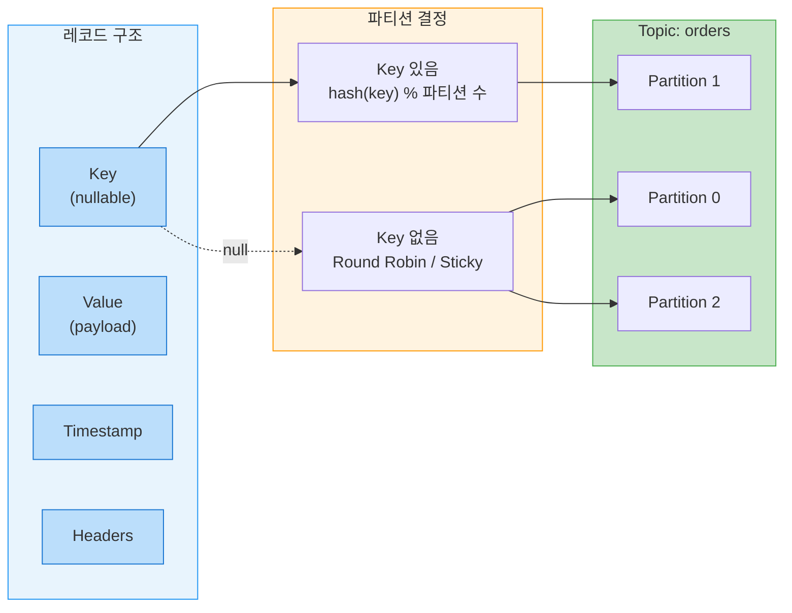

파티션 결정 규칙은 다음과 같다.

- **키가 있는 경우**: `hash(key) % 파티션 수`로 파티션이 결정된다.
  - 같은 키를 가진 메시지는 항상 같은 파티션에 들어가므로, 파티션 내에서 **키 단위의 순서가 보장**된다.
  - 예를 들어 `orderId=A-001`인 주문의 생성/수정/취소 이벤트는 모두 같은 파티션에 순서대로 기록된다.

- **키가 없는 경우**: Round Robin 또는 Sticky Partitioner를 통해 파티션에 균등 분배된다.
  - 순서 보장이 필요 없는 로그 수집 같은 시나리오에 적합하다.

- **명시적 지정**: Producer가 파티션 번호를 직접 지정할 수도 있지만, 일반적으로 키 기반 분배를 사용한다.

### Producer → Broker → Consumer 전체 흐름

메시지가 Producer에서 출발하여 Consumer에 도착하는 전체 경로다. 이 흐름은 모든 메시지 시스템의 뼈대이며, Consumer Group은 이 위에 얹히는 레이어다.

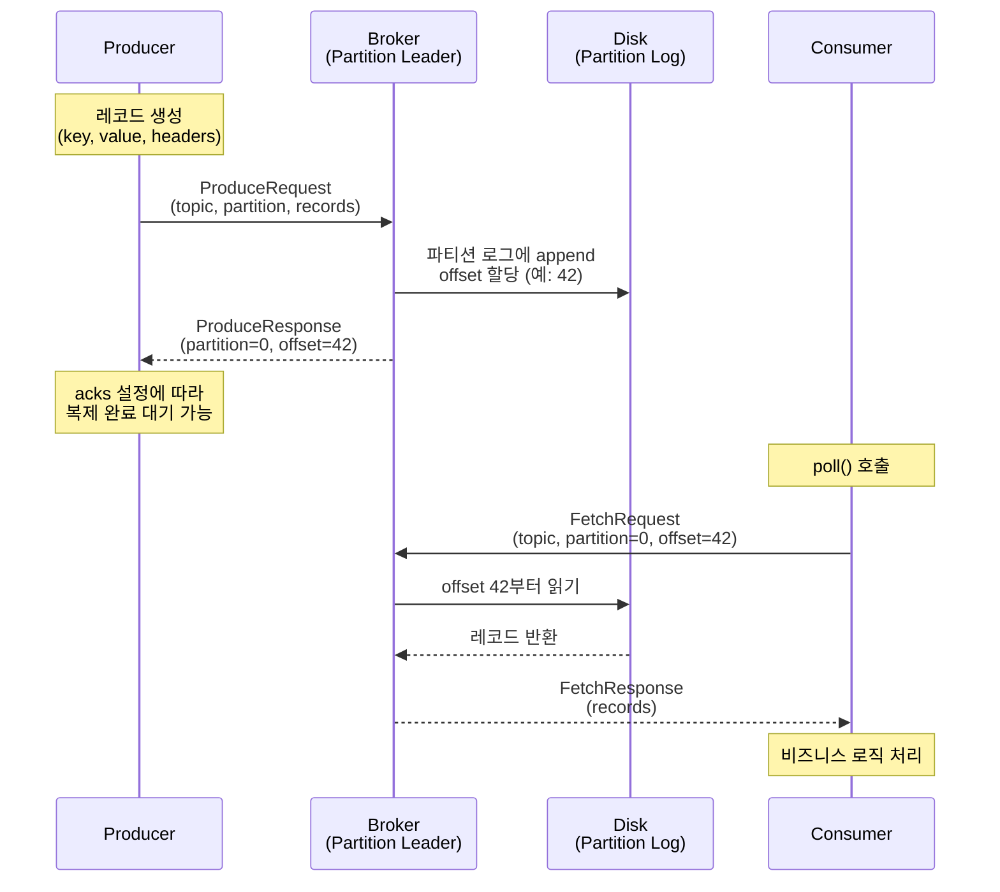

이 흐름에서 핵심적인 특징이 세 가지 있다.

- **Pull 모델**: Consumer가 브로커에서 메시지를 "가져가는" 방식이다. 브로커가 Consumer에게 "보내는" Push 모델이 아니다. Consumer가 자신의 처리 속도에 맞춰 `poll()`을 호출하므로, 느린 Consumer가 브로커에 배압(backpressure)을 가하지 않는다.
- **오프셋 기반 위치 추적**: Consumer는 "어디까지 읽었는가"를 오프셋으로 추적한다. 오프셋 42까지 처리했으면 다음 `poll()`에서 43부터 요청한다. 이 오프셋을 어딘가에 저장(commit)해야 재시작 시 이어서 읽을 수 있다.
- **브로커는 무상태(stateless)**: 브로커는 "누가 어디까지 읽었는지"를 능동적으로 추적하지 않는다. Consumer가 오프셋을 알려주면 해당 위치부터 데이터를 반환할 뿐이다. 오프셋 관리 책임은 Consumer(또는 Consumer Group) 측에 있다.


### 단일 Consumer의 한계

단일 Consumer가 토픽의 모든 파티션을 혼자 소비하는 구조는 가장 단순하지만, 처리량에 한계가 있다.

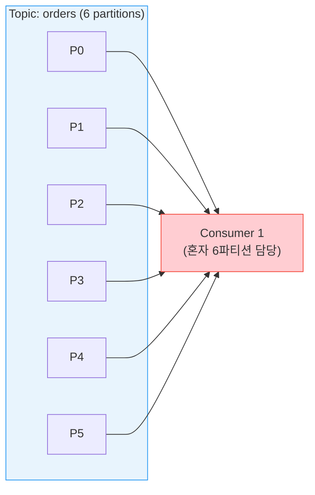

- 초당 60만 건의 메시지가 들어오는데 Consumer 하나의 처리 한계가 10만 건이라면, 메시지가 쌓이기만 하고 소비되지 못한다.
- Consumer를 더 띄우면 되지만, 여기서 문제가 생긴다.

### Consumer를 늘리면? — 두 가지 갈래

Consumer를 여러 개 띄울 때, "같은 메시지를 중복으로 읽을 것인가, 나눠서 읽을 것인가"에 따라 완전히 다른 패턴이 된다.

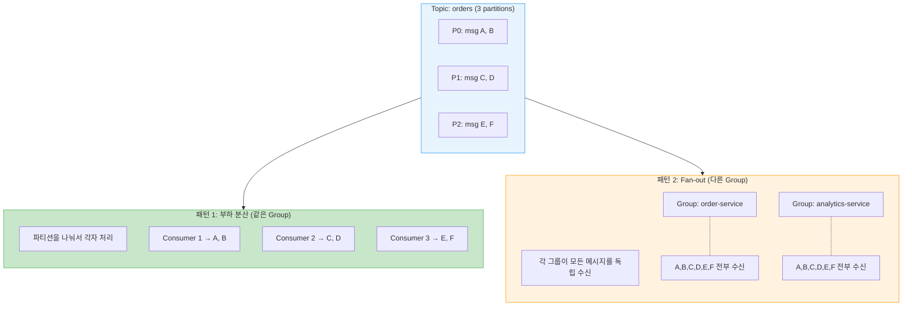

**패턴 1 — 부하 분산 (같은 Consumer Group)**

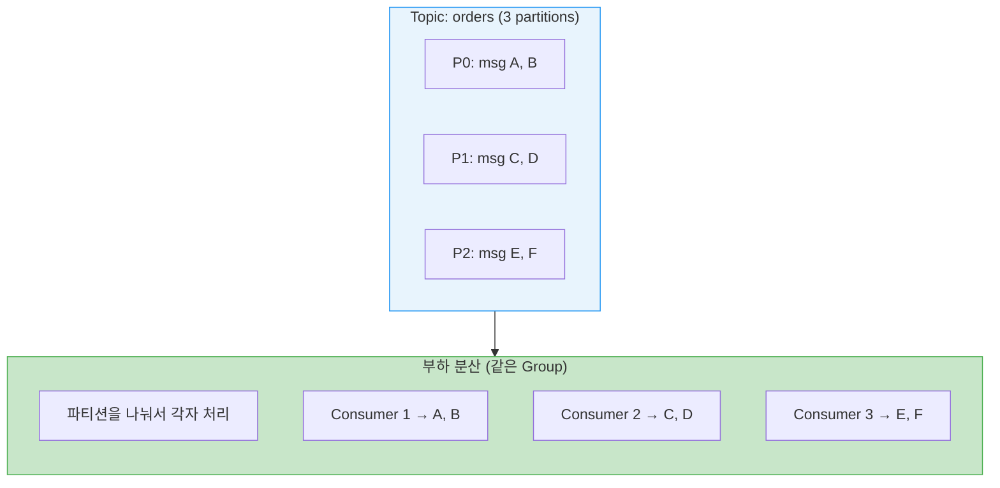

- `group.id`가 같은 Consumer들은 파티션을 배타적으로 나눠 갖는다.
- 각 메시지는 그룹 내 정확히 하나의 Consumer만 처리한다. 주문 서비스 인스턴스 3개가 각각 2개 파티션씩 담당하여 처리량을 3배로 늘리는 시나리오다.

**패턴 2 — Fan-out (다른 Consumer Group)**

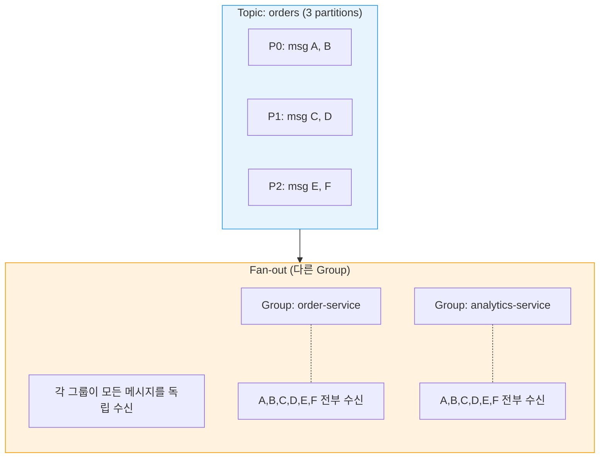

- `group.id`가 다른 Consumer들은 각각 토픽의 **모든 메시지**를 독립적으로 수신한다.
- 주문 이벤트를 주문 서비스는 "처리"하고, 분석 서비스는 "집계"하고, 알림 서비스는 "발송"하는 시나리오다. 각 그룹은 자체 오프셋을 관리하므로, 한 그룹이 느려도 다른 그룹에 영향을 주지 않는다.


이 두 패턴은 배타적이지 않고 조합된다. 실제 시스템에서는 하나의 토픽에 여러 Consumer Group이 구독하되, 각 그룹 안에서는 파티션을 분배하는 것이 일반적이다.

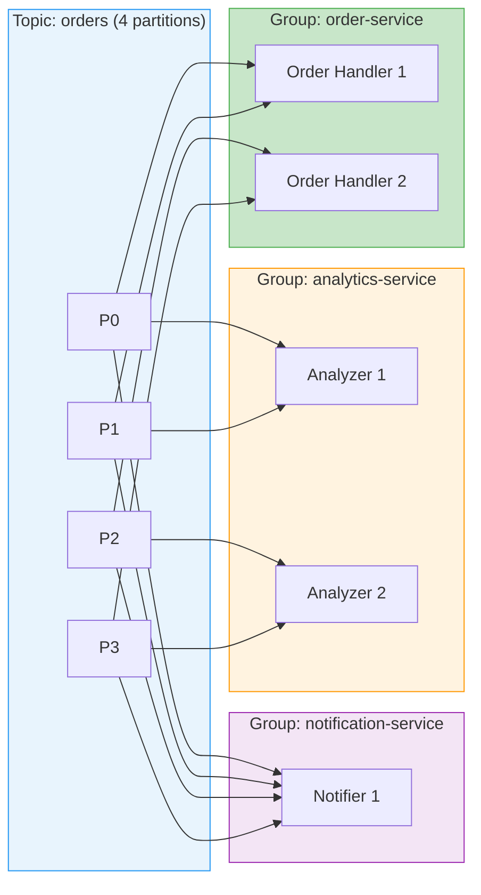

- 위 다이어그램에서 `order-service`와 `analytics-service`는 각각 2개 Consumer로 파티션을 나누어 병렬 처리하고, `notification-service`는 1개 Consumer가 전부 소비한다.
- **세 그룹 모두 같은 메시지를 독립적으로 수신**하지만, 그룹 내부에서는 파티션 단위로 작업을 분배한다.

이 "그룹 내 파티션 분배"를 관리하는 메커니즘이 바로 다음 섹션에서 다루는 **Consumer Group 프로토콜**이다.


## 2. Consumer Group이란

> Kafka/Redpanda에서 **Consumer Group**은 같은 토픽을 병렬로 소비하는 Consumer 인스턴스의 논리적 묶음이다. 부하를 Consumer 인스턴스들 사이에 균등하게 분배하는 핵심 메커니즘이다.

### 왜 필요한가

단일 Consumer로 초당 100만 건의 메시지를 처리할 수 없다면, Consumer를 늘려야 한다.

- 하지만 각 Consumer가 같은 메시지를 중복으로 읽으면 의미가 없다.
- Consumer Group은 **파티션을 Consumer에게 배타적으로 할당**하여, 각 메시지가 그룹 내에서 정확히 하나의 Consumer만 처리하도록 보장한다.

```bash
# Topic: orders (6 partitions)

Consumer Group "order-service" (3 instances):
  Consumer 1 → Partition 0, 1
  Consumer 2 → Partition 2, 3
  Consumer 3 → Partition 4, 5
```

- 하나의 파티션은 그룹 내 하나의 Consumer에만 할당된다.
- 따라서 Consumer 수가 파티션 수를 초과하면 초과분의 Consumer는 유휴 상태가 된다.

### 브로커별 파티션 분산과 Consumer의 Fetch 경로

파티션은 클러스터 내 여러 브로커에 분산 저장된다. Consumer는 **자신에게 할당된 파티션의 리더 브로커**에 직접 연결하여 메시지를 가져온다. 따라서 하나의 Consumer가 여러 브로커에 동시에 연결하는 것은 흔한 일이다.

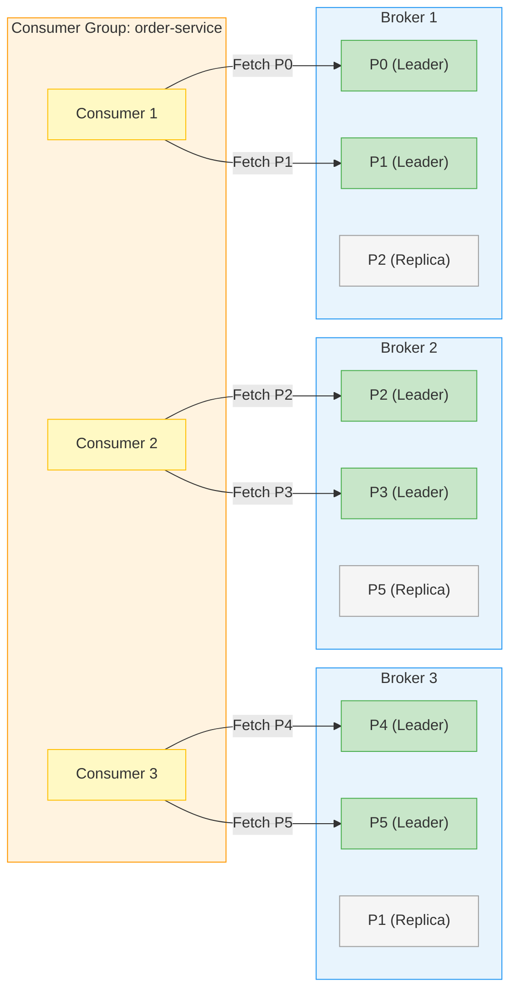

위 다이어그램에서 주목할 점은 다음과 같다.

- **Consumer는 Leader 파티션에만 Fetch 요청을 보낸다.** Replica는 내구성을 위한 복제본이며 Consumer가 직접 읽지 않는다(KIP-392 Follower Fetching을 활성화하지 않은 기본 설정 기준).
- **Consumer 1은 Broker 1에 두 번 연결한다.** P0과 P1 모두 Broker 1에 있기 때문이다. 반면 Consumer 2는 Broker 2 하나에만 연결하지만 두 파티션(P2, P3)을 소비한다.
- **브로커 수와 Consumer 수는 독립적이다.** 3개 브로커에 6개 파티션, 3개 Consumer라는 조합에서 각 Consumer는 자신이 담당하는 파티션이 어느 브로커에 있든 상관없이 해당 브로커에 연결한다.

### Consumer의 메시지 처리 흐름

단일 Consumer가 브로커로부터 메시지를 가져와 처리하는 과정은 poll-process-commit 루프로 동작한다.

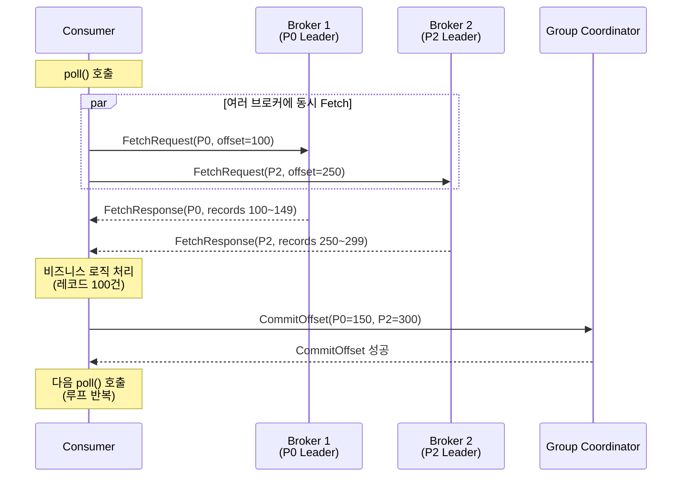

`poll()` 한 번의 호출로 **할당된 모든 파티션의 데이터를 한꺼번에 가져온다.** 내부적으로 Consumer 클라이언트는 각 파티션의 Leader 브로커에 병렬로 FetchRequest를 보내고, 응답을 모아서 하나의 `ConsumerRecords` 객체로 반환한다. 처리 완료 후 각 파티션의 다음 오프셋을 Coordinator에 커밋하면 한 사이클이 끝난다.

### 기본 설정

```java
Properties props = new Properties();
props.put("group.id", "order-service");          // Consumer Group 이름
props.put("bootstrap.servers", "localhost:9092");
props.put("key.deserializer", StringDeserializer.class);
props.put("value.deserializer", StringDeserializer.class);

KafkaConsumer<String, String> consumer = new KafkaConsumer<>(props);
consumer.subscribe(Arrays.asList("orders", "payments"));  // 토픽 구독
```

`group.id`가 같은 모든 Consumer 인스턴스가 하나의 Consumer Group을 형성한다.


## 3. Group Coordinator

> **Group Coordinator**는 Consumer Group의 멤버십과 파티션 할당을 관리하는 브로커 내부 컴포넌트다. 각 Consumer Group에는 하나의 Group Coordinator가 지정된다.

### Coordinator 결정 방법

Group Coordinator는 내부 토픽 `__consumer_offsets`의 파티션 리더에 의해 결정된다.

```
1. group.id를 해시하여 __consumer_offsets의 파티션 번호 결정
   partition = hash("order-service") % __consumer_offsets 파티션 수

2. 해당 파티션의 리더 브로커 = 이 그룹의 Group Coordinator
```

`__consumer_offsets` 토픽은 복제되므로, Coordinator가 장애를 겪어도 새 파티션 리더가 자동으로 Coordinator 역할을 이어받는다.

### 책임

| 책임                   | 설명                                                       |
| ---------------------- | ---------------------------------------------------------- |
| **멤버십 관리**        | Consumer의 JoinGroup/LeaveGroup 요청 처리                  |
| **리밸런스 조율**      | 멤버 변경 시 파티션 재할당 프로세스 주도                   |
| **오프셋 저장**        | Consumer의 CommitOffset 요청을 `__consumer_offsets`에 저장 |
| **Heartbeat 모니터링** | Consumer 생존 확인, 타임아웃 시 리밸런스 트리거            |


## 4. JoinGroup / SyncGroup 프로토콜

> Consumer Group이 시작되거나 리밸런스가 발생하면, **JoinGroup → SyncGroup** 2단계 프로토콜이 실행된다.

### 전체 흐름

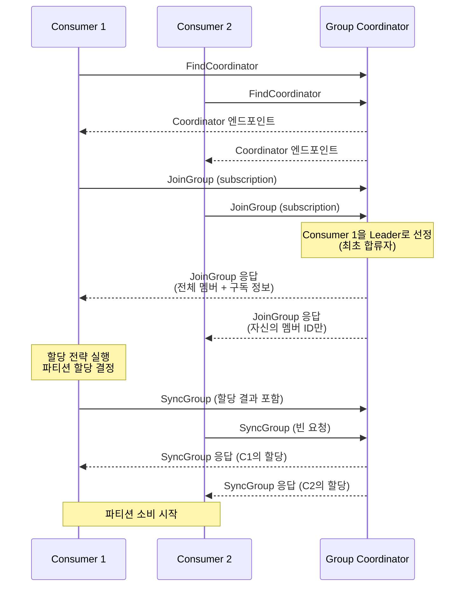

### 왜 Group Leader가 할당을 결정하는가?

Coordinator가 직접 할당할 수도 있지만, **할당 로직을 Consumer 측(플러그인)으로 분리**한 설계다. 이를 통해 애플리케이션이 자체 할당 전략(예: 특정 파티션을 특정 인스턴스에 고정)을 구현할 수 있다. Coordinator는 범용 프로토콜만 처리하고, 비즈니스 특화 할당은 Group Leader에 위임한다.


## 5. 파티션 할당 전략

> Group Leader가 사용하는 할당 전략(Assignor)은 플러그인 방식으로 교체 가능하다.

### Range Assignor

토픽별로 파티션을 Consumer에게 순서대로 분배한다.

```
Topic A: [P0, P1]    Topic B: [P0, P1]
Consumer 1, Consumer 2, Consumer 3

할당 결과:
  Consumer 1 → Topic A: P0, Topic B: P0
  Consumer 2 → Topic A: P1, Topic B: P1
  Consumer 3 → (유휴)
```

**핵심 장점: 코로케이션(Colocation)**. 같은 키를 공유하는 두 토픽에서 같은 파티션 번호가 같은 Consumer에 할당된다. 이를 통해 **로컬 조인(join)**이 가능하다. 예를 들어 `orders` 토픽의 P0과 `payments` 토픽의 P0이 같은 Consumer에 할당되면, 같은 `orderId` 키를 가진 레코드들을 네트워크 없이 로컬에서 조인할 수 있다.

**단점**: Consumer 수가 파티션 수보다 많으면 유휴 Consumer가 발생한다.

### Round Robin Assignor

토픽 경계를 무시하고, 모든 파티션을 Consumer에게 순환 분배한다.

```
모든 파티션: [A-P0, A-P1, B-P0, B-P1]
Consumer 1, Consumer 2, Consumer 3

할당 결과:
  Consumer 1 → A-P0, B-P1
  Consumer 2 → A-P1
  Consumer 3 → B-P0
```

**장점**: 모든 Consumer에게 작업이 분배되어 **병렬성이 극대화**된다.
**단점**: 코로케이션이 보장되지 않으므로 로컬 조인이 불가능하다.

### Sticky Assignor

Round Robin의 개선 버전으로, 리밸런스 시 **이전 할당을 최대한 유지**한다.

```
리밸런스 전:
  Consumer 1 → P0, P1
  Consumer 2 → P2, P3

Consumer 3 합류 후 (Sticky):
  Consumer 1 → P0, P1        (유지)
  Consumer 2 → P2             (P3만 해제)
  Consumer 3 → P3             (해제된 P3 받음)

Consumer 3 합류 후 (Round Robin이었다면):
  Consumer 1 → P0, P3        (P1 해제, P3 새로 받음)
  Consumer 2 → P1             (P2 해제, P1 새로 받음)
  Consumer 3 → P2             (P2 받음)
```

**왜 중요한가?** Kafka Streams처럼 파티션별 내부 상태(State Store)를 유지하는 애플리케이션에서, 파티션 재할당은 상태 재구축 비용을 의미한다. Sticky Assignor는 불필요한 파티션 이동을 최소화하여 이 비용을 줄인다.

### 전략 선택 가이드

| 전략            | 적합한 경우                               | 부적합한 경우                |
| --------------- | ----------------------------------------- | ---------------------------- |
| **Range**       | 토픽 간 키 기반 조인이 필요할 때          | 파티션 수 < Consumer 수      |
| **Round Robin** | 최대 병렬성이 필요하고 조인이 불필요할 때 | 상태 유지 애플리케이션       |
| **Sticky**      | Kafka Streams, 상태 유지 애플리케이션     | 특별한 할당 규칙이 필요할 때 |


## 6. 오프셋 추적

Consumer Group은 각 파티션에서 마지막으로 처리한 위치를 추적한다.

### 동작 방식

```
Consumer → Coordinator: CommitOffsetRequest(topic=orders, partition=0, offset=1001)
Coordinator → __consumer_offsets: 오프셋 저장

--- Consumer 재시작 ---

Consumer → Coordinator: OffsetFetchRequest(topic=orders, partition=0)
Coordinator → Consumer: offset=1001
Consumer: offset 1001부터 소비 재개
```

- `__consumer_offsets` 토픽은 **복제**되어 있으므로, Coordinator 장애 시에도 오프셋이 유실되지 않는다.
- Consumer 인스턴스가 최초 시작이고 저장된 오프셋이 없으면, `auto.offset.reset` 설정에 따라 **earliest**(처음부터) 또는 **latest**(최신부터) 소비를 시작한다.

### 신규 Consumer Group의 시작 오프셋

기존에 본 적 없는 `group.id`로 consumer가 처음 join하면 `__consumer_offsets`에 해당 group의 커밋 기록이 없다. 이때 broker는 `auto.offset.reset` 정책을 적용해 **첫 fetch 위치를 결정**한다. 이 동작은 *기존 group이 살아있든 죽었든 무관*하며, 오직 "이 group이 이 (topic, partition)에 대해 committed offset을 가지고 있는가"만 따진다.

| `auto.offset.reset` | 신규 group의 시작 위치 | 의미와 위험 |
|---------------------|------------------------|-------------|
| `latest` (기본) | 토픽의 HEAD(가장 최근 offset 이후) | 신규 group join 이후 발행분만 소비. 과거 누적분은 영구 미소비 — 운영 안전(중복 재처리 없음), 그러나 *기존 group을 rename 한 경우 그 직전 미커밋 메시지는 공백으로 사라짐* |
| `earliest` | 토픽의 TAIL(가장 오래된 보존 메시지부터) | 보존 기간 내 모든 메시지를 처음부터 재소비. 상태 재구성·재처리에 유리. 운영 토픽에 잘못 적용하면 *전체 재처리 폭주* |
| `none` | exception throw | committed offset 부재 자체를 오류로 취급. 명시적 운영(수동 seek 의무화)에서 사용 |

**핵심 오해 정정**

- "기존 group이 돌고 있는 위치에서 이어 받는다"는 동작은 **존재하지 않는다**. group은 서로 완전히 독립된 오프셋 공간을 가진다. 같은 토픽을 두 group이 구독하면 각자 자기 진도대로 소비한다.
- 동일 `group.id`로 인스턴스가 추가/재시작될 때만 기존 committed offset을 이어 받는다. *문자열 한 글자만 달라도 신규 group*이다 (`order-svc-v1` ≠ `order-svc-v2`).
- `group.id` 변경, 환경변수 fallback 변경, 프로필 차이로 인한 그룹명 변동은 모두 **신규 group 생성**과 동일하게 취급된다.

**운영 시 의사결정 기준**

- **이벤트 누락 ≪ 중복 처리**: `latest`. 결제·알림처럼 과거 분이 다시 발사되면 부작용이 크고 idempotency 보장이 없는 경우.
- **상태 재구성 필요**: `earliest`. KTable 구축, ES 재인덱싱, 보상 트랜잭션 백필 등 "토픽 = 진실의 원장"으로 다루는 경우.
- **명시적 시작점 지정**: `none` + 부팅 시 `consumer.seek(...)` 수동 호출. 운영 도구·재처리 잡에서 정확한 시작 timestamp/offset을 강제할 때.

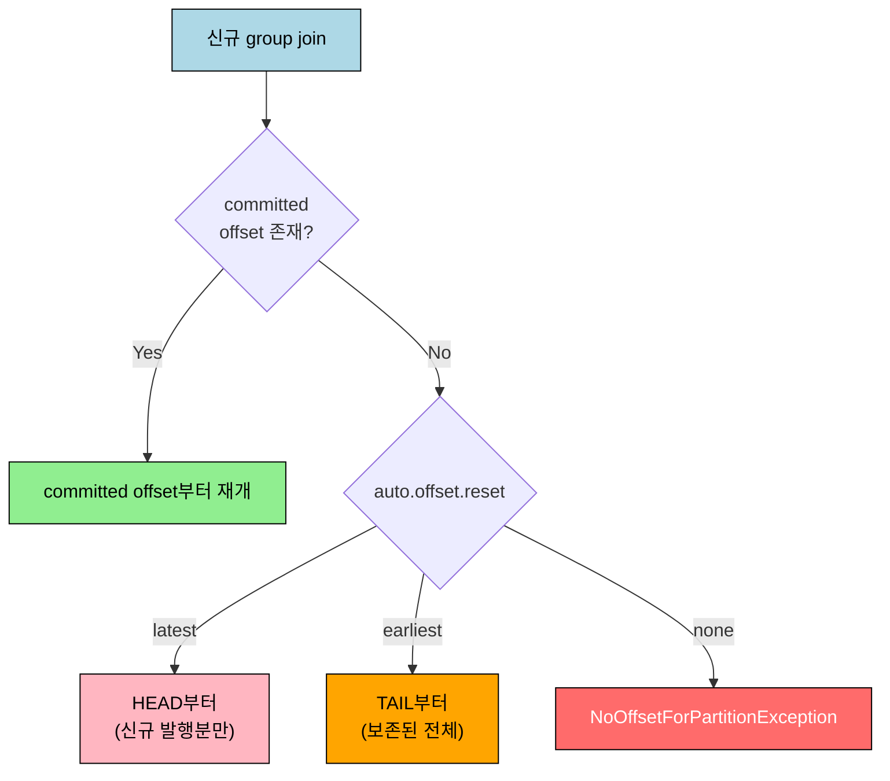

**자주 다치는 시나리오**

- *Group rename 배포*: 기존 group이 미커밋 메시지를 들고 있는 상태에서 새 group으로 갈아끼우고 `latest`로 부팅하면 그 갭은 영구 누락된다. 갈아끼우기 전에 기존 group의 lag을 0으로 만들거나, 일시적으로 `earliest`로 부팅 후 lag 따라잡고 `latest`로 되돌리는 두 가지 패턴이 있다.
- *partition 추가 후 첫 fetch*: 기존 group이라도 신규 partition에 대한 committed offset은 없어 그 partition만 `auto.offset.reset` 정책이 적용된다.

### 자동 vs 수동 커밋

| 방식          | 설정                       | 특징                                                         |
| ------------- | -------------------------- | ------------------------------------------------------------ |
| **자동 커밋** | `enable.auto.commit=true`  | 일정 간격(`auto.commit.interval.ms`, 기본 5초)마다 자동 커밋. 간편하지만 중복/유실 가능 |
| **수동 커밋** | `enable.auto.commit=false` | 애플리케이션이 처리 완료 후 명시적으로 `commitSync()` 또는 `commitAsync()` 호출 |

프로덕션에서는 **수동 커밋**이 권장된다. 메시지 처리가 완료된 후에만 오프셋을 커밋하여 데이터 유실을 방지한다.


## 7. 면접 대비 Q&A

> 면접에서 자주 나오는 형태로 5개. 답을 보지 않고 먼저 입으로 답해 본 뒤 비교한다.

### Q1. 같은 `group.id`와 다른 `group.id`가 만드는 패턴 차이는?

같은 group.id는 *부하 분산*이다. 그룹 내 Consumer들이 파티션을 배타적으로 나눠 가지므로, 각 메시지는 그룹 안에서 정확히 한 Consumer만 처리한다. 다른 group.id는 *Fan-out*이다. 각 그룹이 토픽의 모든 메시지를 독립적으로 수신하고, 그룹별 오프셋을 따로 관리한다. 그래서 하나의 토픽을 결제·분석·알림 그룹이 각자 구독하면, 그룹 내부에서는 분산, 그룹 사이에서는 복제가 자연스럽게 만들어진다.

### Q2. Group Coordinator는 어떻게 결정되고 장애 시 어떻게 복구되나?

`hash(group.id) % __consumer_offsets 파티션 수`로 결정된 파티션의 *Leader 브로커*가 그 그룹의 Coordinator가 된다. `__consumer_offsets`는 일반 토픽처럼 RF로 복제되므로, Coordinator 브로커가 죽으면 다른 ISR/Quorum 노드가 그 파티션의 Leader로 승격되면서 자동으로 Coordinator 역할을 이어받는다. Consumer 측에서는 `FindCoordinator` 요청을 다시 보내 새 Coordinator 엔드포인트를 받는 게 전부다.

### Q3. JoinGroup/SyncGroup에서 Group Leader가 할당을 결정하는 이유는?

할당 로직을 *서버에 가두지 않고* Consumer 측 플러그인으로 분리하기 위해서다. Coordinator는 멤버십·헤비트·오프셋 저장 같은 범용 프로토콜만 처리하고, "이 파티션을 누가 가질 것인가" 같은 비즈니스 특화 결정은 Group Leader가 자체 Assignor로 계산한다. 그래서 Range·Round Robin·Sticky 외에 도메인 특화 Assignor(예: 특정 키 범위를 특정 인스턴스에 고정)를 만들 수 있고, Coordinator 코드를 건드릴 필요가 없다.

### Q4. Sticky Assignor가 Range·Round Robin보다 운영적으로 유리한 경우는?

Kafka Streams처럼 *파티션별 State Store*를 유지하는 애플리케이션이다. 리밸런스 때 파티션이 다른 Consumer로 옮겨가면 새 호스트에서 State Store를 changelog 토픽으로부터 재구성해야 하고, 그 비용이 크다. Sticky는 *이전 할당을 최대한 유지*해 새로 추가/제거된 만큼만 재배분하므로 불필요한 상태 재구축이 줄어든다. 상태가 없는 단순 Consumer라면 Range/Round Robin과 큰 차이 없다.

### Q5. 신규 group을 `latest`로 부팅하는 게 안전한 도메인과 위험한 도메인은?

`latest`가 안전한 도메인은 *과거 누락이 운영적으로 허용되고, 중복/오발사가 큰 부작용을 만드는* 비-idempotent 도메인이다. CI/CD 빌드 명령, 알림, 결제처럼 옛 메시지가 다시 나가면 큰 문제다. 반대로 *토픽을 진실의 원장*으로 다루는 도메인 — KTable 구축, ES 재인덱싱, 보상 트랜잭션 백필 — 은 `earliest`가 옳다. 가장 위험한 시나리오는 group rename 배포에서 기존 group의 미커밋 메시지가 남은 채 새 group을 `latest`로 부팅하는 경우인데, 그 갭은 영구 누락된다. 미리 lag을 0으로 만들거나 일시적으로 `earliest`로 잡고 따라붙은 뒤 되돌린다.


## 8. 관련 문서

- [04-01.메시지 큐 아키텍처](03-01.메시지%20큐%20아키텍처.md) — 파티션·복제 추상 위에서 Consumer Group이 동작
- [04-04.리밸런스 프로토콜](03-04.리밸런스%20프로토콜.md) — JoinGroup/SyncGroup의 더 깊은 흐름
- [04-08.Exactly-once 의미론과 Consumer Idempotency](../04_ConsistencyPattern/04-09.Exactly-once%20의미론과%20Consumer%20Idempotency.md) — 오프셋 커밋과 처리 사이의 비대칭
- [05-05.Inbox](../04_ConsistencyPattern/04-05.Inbox.md) — Consumer 측 멱등성을 강제하는 짝 패턴


## 참고

- [Confluent: Consumer Group Protocol](https://developer.confluent.io/courses/architecture/consumer-group-protocol/)
- rpk 명령어: [05-core-features.md](./05-core-features.md)
- 트랜잭션과 오프셋: [12-transactions.md](./16-transactions.md)
- 리밸런스 프로토콜 심화: [04-04.리밸런스 프로토콜](./03-04.리밸런스%20프로토콜.md)

## 학습 정리

### 핵심 개념

1. **Consumer Group**: 파티션을 Consumer에 배타적으로 할당하여 병렬 소비를 가능하게 하는 메커니즘. 파티션 1개 = Consumer 1개
2. **Group Coordinator**: `__consumer_offsets` 파티션 리더가 담당. 멤버십, 오프셋, 리밸런스를 관리
3. **JoinGroup/SyncGroup**: 2단계 프로토콜. Group Leader가 할당을 결정하여 할당 전략을 플러그인화
4. **할당 전략**: Range(코로케이션/조인), Round Robin(최대 병렬성), Sticky(상태 보존)


---

> **TPS 적용 사례** — `okestro/tps-gitlab2`
>
> - **모듈/위치**: `message-lib/src/main/java/org/okestro/tps/messaging/config/KafkaJsonConsumerConfig.java`, operator `cicd/common/messaging/*ResultConsumer.java`
> - **요점**: 그룹 ID는 모듈 단위로 하나(예: `tps-dlq-handler`, operator의 result consumer 그룹)로 분리하여 명령/결과별 컨슈머 그룹이 다른 도메인의 메시지에 영향을 주지 않게 한다. `KafkaJsonConsumerConfig`가 외부 시스템(JSON 입력) 대응 별도 컨테이너 팩토리를 제공.
> - **상세**: [`spring/02-01.Avro Consumer 수신 패턴`](../01_MessageContract/01-08.Avro%20Consumer%20수신%20패턴.md) — JSON과 Avro consumer를 토픽별로 분리하는 이유.
>
> **신규 group 시작 정책 — `auto.offset.reset = latest`**
>
> - **공통 기본값 주입 지점**: `message-lib/src/main/java/org/okestro/tps/messaging/config/KafkaDefaultsEnvironmentPostProcessor.java` 의 `spring.kafka.consumer.auto-offset-reset = latest`. `EnvironmentPostProcessor` 라 모든 모듈·프로필 부팅 초기에 박힌다.
> - **executor 명시 재확인**: `executor/engine/src/main/resources/application.yml` 의 `auto-offset-reset: latest` (이중 안전장치).
> - **의도**: 신규 group이 등장해도 과거 누적분을 재처리하지 않는다. 비-idempotent 도메인(CI/CD 빌드·배포 명령, 알림)에서 재처리 폭주를 막기 위한 선택. 이력: `[IGMU-1039][message-lib] refactor: Kafka 기본 auto-offset-reset earliest→latest 변경`.
>
> **Consumer 멱등성 — Inbox 테이블**
>
> - 같은 메시지를 두 번 consume해도 결과가 한 번만 반영되도록 `TB_TRB_OX_002` (`(MSG_ID, CONSUMER_GROUP)` PK) 도입. 상세 의미론은 [`04-08.Exactly-once 의미론과 Consumer Idempotency`](../04_ConsistencyPattern/04-09.Exactly-once%20의미론과%20Consumer%20Idempotency.md), TPS 코드 측 계획은 `message-lib/docs/inbox-idempotency-plan.md`.
