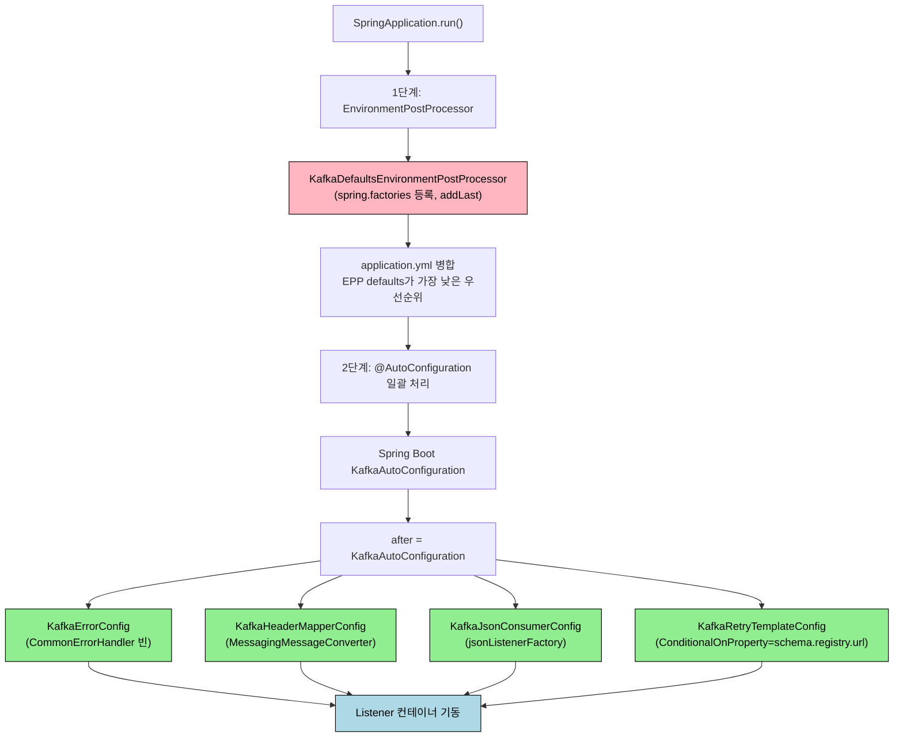
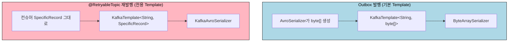
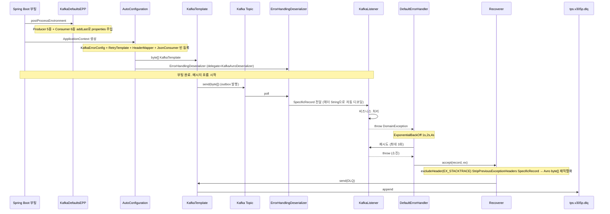

# message-lib config 5개 클래스 종합

---

> 이 문서는 TPS `message-lib`의 다섯 Kafka 설정 클래스를 한 호흡으로 학습하기 위한 가이드다. 한 줄 정의·전제 지식·소크라테스 질문·다이어그램 우선 설명·면접 Q&A·실습 과제까지 한 자리에 모았다. 코드를 외우는 것이 아니라 다섯 클래스가 *왜 다섯 개*인지 설명할 수 있게 되는 것이 목표다.


## 0. 학습 가이드

> 이 문서를 어떻게 읽으면 가장 효율적인가를 먼저 정한다. Phase 0~4 학습 패턴에 맞춰 진입점을 안내한다.

### 0-1. 한 줄 정의

`message-lib`의 다섯 config 클래스는 Spring Boot 부팅의 두 단계(EnvironmentPostProcessor / @AutoConfiguration)에 걸쳐 Kafka의 직렬화·에러 처리·재시도·헤더 디코딩·외부 JSON 토픽 격리를 각각 한 클래스씩 담당하는, *한 시스템의 다섯 레이어*다.

### 0-2. 전제 지식 (Phase 0)

이 문서를 무리 없이 읽으려면 다음 셋이 어렴풋이라도 잡혀 있어야 한다. 자신 없으면 괄호 안 문서를 먼저 본다.

1. Spring Boot 자동 설정과 빈 라이프사이클이 무엇인지 (`@AutoConfiguration`, `@ConditionalOnProperty`).
2. Kafka Producer/Consumer의 직렬화·역직렬화 구조와 Avro의 wire format (`../02-03.Avro`, `../02-05.Avro 직렬화 예외처리 전략`).
3. Kafka의 idempotent producer와 단일 파티션 EOS의 의미 (`../04-08.Exactly-once 의미론과 Consumer Idempotency`).

### 0-3. 학습 목표

이 문서를 다 읽고 다음 다섯 가지에 자신 있게 답할 수 있으면 학습이 완료된 것이다.

1. 다섯 클래스 중 한 개만 빠지면 시스템에 어떤 증상이 나타나는지 클래스별로 설명할 수 있다.
2. `EnvironmentPostProcessor` 패턴이 `@Configuration`과 무엇이 다르고, 왜 properties 기본값을 EPP로 까는지 한 문장으로 말할 수 있다.
3. Avro 컨슈머가 받은 `SpecificRecord`를 `@RetryableTopic`이 재발행할 때 왜 별도 `KafkaTemplate`이 필요한지 설명할 수 있다.
4. `ErrorHandlingDeserializer` 위임 패턴이 컨슈머 thread를 어떻게 보호하는지 설명할 수 있다.
5. Redpanda v25.3로 운영할 때 다섯 클래스 중 별도 점검이 필요한 자리 두 곳을 짚을 수 있다.

### 0-4. 진입 전 소크라테스 질문

본문에 들어가기 전 다음 세 질문을 스스로 던져 본다. 답이 안 나와도 좋다. §1~§9를 읽고 다시 돌아와 답해 본다.

1. 다섯 클래스 중 하나라도 `@Configuration`으로 합치면 어떤 문제가 생길까?
2. `KafkaTemplate`이 이미 하나 있는데 왜 `retryKafkaTemplate`이 또 필요할까?
3. 같은 애플리케이션이 Avro 토픽과 JSON 토픽을 동시에 소비하려면 무엇이 분리돼야 할까?


## 1. 왜 다섯 클래스를 한 장에 모았나

> 다섯 클래스가 등장하는 *시점*과 *역할*이 모두 다르다. 한 개씩 읽으면 "왜 이 자리에 있지?"가 풀리지 않는다. 다섯을 함께 봐야 한 시스템의 뼈대가 보인다.

부팅 시점에 환경 변수를 주입하는 `EnvironmentPostProcessor` 단계가 한 곳이고, `ApplicationContext` 생성 단계의 `@AutoConfiguration`이 다른 곳이며, 컨테이너 기동 후 첫 메시지가 들어오는 시점이 또 다른 곳이다. 단일 클래스만 읽으면 *왜 그 자리에서 그 일을 하는지* 추적이 끊긴다.

이 글이 답하는 질문 셋이다.

1. 다섯 클래스는 부팅 어느 단계에서 어떤 순서로 동작하는가.
2. 각 클래스가 *왜 별도 파일*이며 한 파일에 합치지 못한 이유는 무엇인가.
3. Redpanda v25.3(2026-04 기준)로 운영할 때 *Kafka와 다른 점*은 무엇이고 다섯 클래스 중 어디가 영향을 받는가.

`03-03`이 *예외 처리*만 통합했다면, 본 글은 *config 디렉토리 전체*를 통합한다. `KafkaErrorConfig` 라인별 정독은 [03-04](../04_ConsistencyPattern/04-13.KafkaErrorConfig%20DLT%20헤더%20폭증%20사고.md)에서 풀로 풀려 있고, 본 글 §5는 한 단락 요약만 둔다.


## 2. 기동 순서 한 장

> 다섯 클래스는 Spring Boot 부팅의 두 단계에 나뉜다. 첫 단계는 `ApplicationContext` 생성 *이전*의 `EnvironmentPostProcessor`, 두 번째 단계는 모든 `@AutoConfiguration`이 처리되는 ApplicationContext 생성 시점이다. 첫 단계가 한 개, 두 번째 단계가 네 개다.

다이어그램부터 보고 본문에서 차근차근 풀어 간다.



분홍 노드 한 개가 1단계, 초록 노드 네 개가 2단계다. 다섯 클래스의 *공간적 위치*가 한눈에 들어온다.

### 2-1. 1단계 — KafkaDefaultsEPP가 왜 먼저인가

`KafkaDefaultsEnvironmentPostProcessor`는 `META-INF/spring.factories`에 등록되어 ApplicationContext 생성 *전에* 실행된다. 왜 `@Configuration`이 아니라 EPP인가는 §3-1에서 자세히 다룬다. 핵심만 미리 짚으면, Spring Boot의 `KafkaAutoConfiguration`이 *properties 값을 읽어* 빈을 만들기 때문에 빈 생성 시점에는 이미 properties가 굳어 있다. 기본값을 깔려면 그 이전에 들어가야 한다.

### 2-2. 2단계 — 네 클래스가 @AutoConfiguration인 이유

나머지 네 클래스는 모두 `@AutoConfiguration`이며 `META-INF/spring/org.springframework.boot.autoconfigure.AutoConfiguration.imports`에 한 줄씩 등록된다. 셋은 `(after = KafkaAutoConfiguration.class)`로 Spring Boot 기본 설정 *뒤*에 동작하도록 순서를 잡았다. Spring Boot가 만든 `KafkaTemplate`·`ConsumerFactory` 빈을 받아 그 위에 본 라이브러리 정책을 얹기 위함이다.

`KafkaRetryTemplateConfig`만 추가로 `@ConditionalOnProperty(name = "spring.kafka.properties.schema.registry.url")`가 붙는다. Schema Registry가 설정된 환경에서만 활성화된다. 테스트 환경처럼 Avro를 쓰지 않는 경우 이 빈은 등록되지 않는다.


## 3. KafkaDefaultsEnvironmentPostProcessor — 기본값을 가장 아래에 깐다

> 다섯 클래스 중 가장 *광범위한* 클래스. Producer 5종, Consumer 6종, 도합 11개의 Spring Boot Kafka 프로퍼티 기본값을 라이브러리 사용 측에 강제하지 않고도 깔아둔다. 의존 모듈이 자기 `application.yml`에 같은 키를 선언하면 자연스럽게 오버라이드된다.

### 3-1. 왜 EPP 패턴인가 — @Configuration이 늦는 이유

Spring Boot의 `KafkaAutoConfiguration`은 `spring.kafka.*` 프로퍼티를 읽어 `KafkaProperties` 빈을 만들고, 그 빈의 값으로 `KafkaTemplate`·`ConsumerFactory`를 생성한다. *프로퍼티 → 빈*으로 향하는 흐름이 정해진 순서로 일어나며, 이 흐름은 `ApplicationContext` 생성 시점에 시작된다.

본 라이브러리가 `@Configuration` + `@Bean`으로 같은 일을 하려 하면, 의존 모듈마다 `@Import`나 `@EnableXxx`로 명시 활성화해야 한다. EPP는 그게 필요 없다. `spring.factories`에 한 줄만 등록하면 의존 모듈은 `message-lib`를 import한 것만으로 기본값을 자동으로 받는다.

또 다른 이유는 *디버깅 가능성*이다. 프로퍼티 형태로 주입하면 `/actuator/env`에 그대로 노출되고, application.yml에 손으로 적은 값처럼 보인다. 의존 모듈 개발자가 "어디서 온 값이지?"를 추적할 때 EPP가 등록한 PropertySource 이름(`kafkaMessagingDefaults`)까지 actuator로 확인 가능하다.

### 3-2. Producer 기본값 5종 — EOS 트리오가 박히는 자리

먼저 코드를 본다.

```java
// KafkaDefaultsEnvironmentPostProcessor.java
defaults.put("spring.kafka.producer.key-serializer", "org.apache.kafka.common.serialization.StringSerializer");
defaults.put("spring.kafka.producer.value-serializer", "org.apache.kafka.common.serialization.ByteArraySerializer");
defaults.put("spring.kafka.producer.acks", "all");
defaults.put("spring.kafka.producer.retries", "3");
defaults.put("spring.kafka.producer.properties.enable.idempotence", "true");
```

세 가지 키가 결정적이다. `acks=all` + `retries>0` + `enable.idempotence=true` 셋이 단일 파티션 단위 Exactly-once 발행의 조건이다. `04-08 §2`에서 다룬 EOS 트리오가 정확히 여기서 박힌다. 셋 중 하나라도 빠지면 브로커 재시도 시 같은 메시지가 두 번 들어가거나 ack 손실로 누락이 생긴다.

`value-serializer`가 `ByteArraySerializer`로 고정된 이유는 outbox 폴러가 *이미 Avro로 직렬화된 byte[]*를 폴 큐에서 꺼내 발행하기 때문이다. `KafkaTemplate`이 다시 직렬화하면 이중 인코딩이 된다. 직렬화는 outbox 적재 단계에서 `AvroSerializer`가 한 번만 수행한다 (`../02-05 §2-1`).

### 3-3. Consumer 기본값 6종 — ErrorHandlingDeserializer 위임 패턴

```java
// KafkaDefaultsEnvironmentPostProcessor.java
defaults.put("spring.kafka.consumer.key-deserializer",
        "org.springframework.kafka.support.serializer.ErrorHandlingDeserializer");
defaults.put("spring.kafka.consumer.value-deserializer",
        "org.springframework.kafka.support.serializer.ErrorHandlingDeserializer");
defaults.put("spring.kafka.consumer.properties.spring.deserializer.key.delegate.class",
        "org.apache.kafka.common.serialization.StringDeserializer");
defaults.put("spring.kafka.consumer.properties.spring.deserializer.value.delegate.class",
        "io.confluent.kafka.serializers.KafkaAvroDeserializer");
defaults.put("spring.kafka.consumer.auto-offset-reset", "latest");
defaults.put("spring.kafka.consumer.properties.specific.avro.reader", "true");
```

가장 중요한 두 줄이 `key-deserializer`/`value-deserializer`를 `ErrorHandlingDeserializer`로 *고정*하는 것이다. 실제 역직렬화는 `delegate.class`로 지정한 `KafkaAvroDeserializer`가 수행하지만, 그 호출을 `ErrorHandlingDeserializer`가 try/catch로 감싼다. 역직렬화 실패가 *컨슈머 thread를 죽이지 않고* `DeserializationException`을 헤더에 박아 listener까지 정상 흐름으로 전달한다 (`../02-05 §3-4`).

비유하자면 이 위임 패턴은 *식기 세척 라인 앞에 자동 잠금 밸브*를 다는 셈이다. 물(메시지)이 잘못된 모양으로 들어와도 라인 전체가 멈추지 않고, 잘못된 한 그릇만 옆 통(에러 헤더)으로 빠진다.

`specific.avro.reader=true`는 Confluent Avro deserializer에 *generated `SpecificRecord` 클래스로 역직렬화*하라는 지시다. 이 옵션이 없으면 `GenericRecord`로 디코딩되어 도메인 핸들러에서 다시 변환해야 한다.

### 3-4. addLast 등록과 오버라이드 우선순위

마지막으로 *어떻게 등록되는가*를 본다.

```java
// KafkaDefaultsEnvironmentPostProcessor.java
environment.getPropertySources().addLast(
        new MapPropertySource("kafkaMessagingDefaults", defaults)
);
```

`addLast`로 등록한다는 건 이 PropertySource가 *가장 낮은 우선순위*에 놓인다는 뜻이다. Spring Boot의 환경 변수, application.yml, 시스템 프로퍼티 등 어느 것이 같은 키를 정의해도 그쪽이 이긴다. 라이브러리 기본값은 *의존 모듈이 명시하지 않은 경우에만* 적용되며, 명시 시 자연스럽게 덮인다.

이 우선순위 설계는 "강요하지 않는 기본값"의 표준 패턴이다. EPP가 `addFirst`로 들어가면 의존 모듈이 자기 yaml로 바꿀 수 없게 되어 오히려 운영이 어려워진다.


## 4. 5개 클래스의 멘탈 모델

> 코드를 외우기 전에 멘탈 모델 한 그림을 머리에 박는다. 다섯 클래스가 어떤 *역할 분담*으로 모여 있는지 한 단락으로 잡는다.

다섯 클래스를 *건물의 다섯 층*으로 비유하면 다음과 같다. 1층은 `KafkaDefaultsEPP`로, 건물 전체의 *바닥*을 까는 properties 기본값이다. 의존 모듈이 자기 yaml로 덮지 않으면 이 기본값으로 동작한다. 2층은 `KafkaErrorConfig`로, 모든 `@KafkaListener`가 공유하는 *글로벌 에러 처리 시스템*이다. 3층은 `KafkaRetryTemplateConfig`로, `@RetryableTopic`이라는 *별도 엘리베이터*가 필요할 때만 쓰는 전용 Producer다. 4층은 `KafkaHeaderMapperConfig`로, listener에 들어오기 직전에 헤더 byte[]를 String으로 디코딩하는 *수문(水門)*이다. 5층은 `KafkaJsonConsumerConfig`로, Avro가 아닌 JSON 토픽을 위해 별도로 뚫어둔 *서비스 통로*다.

이 비유에서 가장 중요한 것은 *2층과 3층이 별개의 안전 시스템*이라는 점이다. 같은 건물 안에 있지만 화재경보가 따로 울린다. KafkaErrorConfig의 정책은 KafkaRetryTemplateConfig가 만든 `@RetryableTopic` 경로에 적용되지 않는다. 이 분기를 모르면 03-04 같은 사고가 난다.


## 5. KafkaErrorConfig — 글로벌 에러 핸들러 (요약)

> 본 클래스의 *라인 단위* 정독, `excludeHeader(EX_STACKTRACE)`/`setStripPreviousExceptionHeaders(true)`의 도입 배경, 실제 운영 사고 회고는 [03-04](../04_ConsistencyPattern/04-13.KafkaErrorConfig%20DLT%20헤더%20폭증%20사고.md)에서 풀로 다룬다. 여기서는 다섯 클래스 안에서의 *위치*만 짚는다.

`KafkaErrorConfig`는 시스템 전체에 `CommonErrorHandler` 빈 한 개를 등록한다. 모든 `@KafkaListener`가 이 빈을 공유하므로 *글로벌 에러 정책의 유일한 진입점*이다. 안에는 다음 네 부품이 들어 있다.

1. `DefaultErrorHandler`(재시도 + recoverer) — listener 예외를 잡아 재시도 카운터를 돌린다.
2. `DeadLetterPublishingRecoverer`(DLT 발행) — 재시도 소진 시 DLQ 토픽으로 메시지를 발행한다.
3. `ExponentialBackOff`(1초·2초·4초) — 재시도 간격을 지수로 늘린다.
4. `addNotRetryableExceptions`(재시도 분류) — 재시도 의미가 없는 예외를 분류해 즉시 DLQ로 보낸다.

다른 네 클래스와의 관계는 다음과 같다.

- `KafkaDefaultsEPP`의 EOS 트리오와 `ErrorHandlingDeserializer` 위임이 *전제 조건*이다. 둘 다 없으면 KafkaErrorConfig가 잡으려는 실패 자체가 다른 형태로 새어 나간다.
- `KafkaRetryTemplateConfig`의 `@RetryableTopic` 경로는 *별도의 내부 recoverer*를 갖는다. KafkaErrorConfig의 정책(`excludeHeader` 등)은 이 별도 인스턴스에 적용되지 않는다 — 03-04이 다루는 사고의 출발점이다.

비유하자면 KafkaErrorConfig는 *고속도로 진입로의 안전망*이고, `@RetryableTopic`은 *별도 톨게이트의 자체 안전망*이다. 둘이 한 시스템에 공존할 때 차이를 모르면 새는 자리가 생긴다.


## 6. KafkaRetryTemplateConfig — @RetryableTopic 전용 Producer

> 이 빈이 없는 환경에서 `@RetryableTopic`을 쓰면 `ClassCastException`이 난다. *Avro 컨슈머가 받은 `SpecificRecord`를 byte[] producer로 다시 보내는 미스매치*를 해결하는 전용 KafkaTemplate이다.

### 6-1. 왜 별도 KafkaTemplate인가 — Avro vs byte[] 미스매치

기본 `KafkaTemplate<String, byte[]>`는 outbox 발행을 위해 `ByteArraySerializer`로 묶여 있다 (§3-2). 한편 `@RetryableTopic`은 *컨슈머가 받은 원본 record value를 그대로 재발행*하는데, 컨슈머가 `KafkaAvroDeserializer` + `specific.avro.reader=true`로 동작해 value가 `SpecificRecord`다. byte[] 직렬화기에 Java 객체를 넘기면 `ClassCastException`이 난다.

다이어그램으로 보면 두 흐름이 한 producer를 공유할 수 없는 이유가 분명해진다.



핵심은 *기본 producer properties를 그대로 받되 직렬화기만 갈아 끼우는* 패턴이다. 코드로 보면 다음과 같다.

```java
// KafkaRetryTemplateConfig.java
@Bean
public ProducerFactory<String, SpecificRecord> retryAvroProducerFactory(KafkaProperties kafkaProperties) {
    Map<String, Object> props = new HashMap<>(kafkaProperties.buildProducerProperties(null));
    props.put(ProducerConfig.KEY_SERIALIZER_CLASS_CONFIG, StringSerializer.class);
    props.put(ProducerConfig.VALUE_SERIALIZER_CLASS_CONFIG, KafkaAvroSerializer.class);
    return new DefaultKafkaProducerFactory<>(props);
}
```

`kafkaProperties.buildProducerProperties(null)`로 Spring Boot가 만든 properties를 복사한 뒤, 두 직렬화기만 덮어쓴다. acks·retries·idempotence 같은 다른 설정은 그대로 살아 있다.

### 6-2. retryKafkaTemplate 빈과 @RetryableTopic 결합

```java
// KafkaRetryTemplateConfig.java
@Bean(RETRY_KAFKA_TEMPLATE_BEAN_NAME) // "retryKafkaTemplate"
public KafkaTemplate<String, SpecificRecord> retryKafkaTemplate(
        ProducerFactory<String, SpecificRecord> retryAvroProducerFactory
) {
    return new KafkaTemplate<>(retryAvroProducerFactory);
}
```

이 빈 이름을 컨슈머에서 명시 참조한다.

```java
// 컨슈머 측
@RetryableTopic(
        attempts = "3"
        , backoff = @Backoff(delay = 1000, multiplier = 2.0)
        , kafkaTemplate = "retryKafkaTemplate"
)
@KafkaListener(...)
public void onCommand(@Payload DeployCommandAvro command) { ... }
```

`kafkaTemplate` 속성을 빼면 Spring Kafka가 기본 KafkaTemplate(byte[] 짜리)을 쓰려고 시도해 위에서 본 ClassCastException이 발생한다. 본 시스템에서는 가드 테스트(`RetryableTopicConfigurationGuardTest`)가 이 속성 누락을 빌드 단계에서 잡아준다.

### 6-3. 활성 조건 — schema-registry.url이 없으면 빈도 없다

```java
// KafkaRetryTemplateConfig.java
@AutoConfiguration(after = KafkaAutoConfiguration.class)
@ConditionalOnProperty(name = "spring.kafka.properties.schema.registry.url")
public class KafkaRetryTemplateConfig { ... }
```

Schema Registry URL이 없는 환경에서는 이 빈 자체가 등록되지 않는다. 두 가지 의미가 있다.

첫째, *테스트 환경에서 자동 비활성*된다. Avro 없이 단순 String 메시지로 테스트하는 통합 테스트는 Registry URL이 없으므로 이 빈이 없어도 빌드가 깨지지 않는다.

둘째, *운영에서 Registry URL이 누락되면 부팅이 깨끗하게 실패*한다 — `@RetryableTopic` 컨슈머가 retryKafkaTemplate 빈을 못 찾기 때문이다. 환경 변수 누락이 컨슈머가 메시지를 *조용히* 흘려보내는 형태로 새지 않는다는 점이 안전한 설계다.


## 7. KafkaHeaderMapperConfig — 헤더 자동 디코딩

> Kafka 네이티브 헤더는 모두 `byte[]`다. `@Header(name="ce_id") String ceId` 형태로 컨슈머가 직접 받으려면 어딘가에서 `new String(bytes, UTF_8)`을 해줘야 한다. 본 빈이 그 일을 전역으로 한 번에 한다.

### 7-1. 왜 필요한가 — 보일러플레이트 제거

Kafka의 `RecordHeader` API는 헤더 값을 `byte[]`로 다룬다. CloudEvents 표준 헤더(`ce_id`, `ce_source`, `ce_type`)도 ASCII 문자열이지만 wire format에서는 byte[]로 흐른다. 본 빈이 없으면 listener에서 다음과 같이 받아야 한다.

```java
// 본 빈이 없을 때의 listener
@KafkaListener(...)
public void on(ConsumerRecord<String, EventAvro> record) {
    Header h = record.headers().lastHeader("ce_id");
    String ceId = h != null ? new String(h.value(), StandardCharsets.UTF_8) : null;
    ...
}
```

수십 개의 컨슈머가 같은 보일러플레이트를 반복하면, 한 줄을 고치고 싶을 때 모든 자리를 손대야 한다.

### 7-2. DefaultKafkaHeaderMapper와 addTrustedPackages

```java
// KafkaHeaderMapperConfig.java
@Bean
@ConditionalOnMissingBean(MessagingMessageConverter.class)
public MessagingMessageConverter messagingMessageConverter() {
    MessagingMessageConverter converter = new MessagingMessageConverter();
    DefaultKafkaHeaderMapper mapper = new DefaultKafkaHeaderMapper();
    mapper.addTrustedPackages("*");
    converter.setHeaderMapper(mapper);
    return converter;
}
```

빈이 등록되면 Spring Kafka가 listener에 메시지를 전달하기 *직전*에 모든 헤더 값을 String으로 변환한다(또는 매퍼가 인식하는 다른 타입으로). 그 결과 컨슈머는 다음과 같이 깔끔하게 받을 수 있다.

```java
// 본 빈이 등록됐을 때의 listener
@KafkaListener(...)
public void on(@Payload EventAvro event,
               @Header(name="ce_id", required=false) String ceId) { ... }
```

`addTrustedPackages("*")`는 보안 옵션이다. `DefaultKafkaHeaderMapper`는 헤더 값이 직렬화된 Java 객체일 경우 *역직렬화 대상 패키지*를 제한하는 트러스트 모델을 갖는데, CloudEvents 헤더처럼 단순 문자열만 다루는 본 시스템에서는 모든 패키지를 신뢰해도 안전하다. 외부에서 임의 객체가 헤더로 들어오는 시스템이라면 `*` 대신 신뢰 패키지를 명시해야 한다.

### 7-3. ConditionalOnMissingBean이 만든 안전한 기본값

`@ConditionalOnMissingBean`이 붙어 있어 의존 모듈이 자기 `MessagingMessageConverter`를 등록하면 본 빈은 등록되지 않는다. 한 줄짜리 빈이지만 의존 모듈이 *오버라이드 가능한 안전한 기본값* 형태다. 라이브러리 입장에서 "강요하지 않는다"는 §3-4의 `addLast` 패턴과 같은 철학이 빈 등록 자리에도 적용된 셈이다.


## 8. KafkaJsonConsumerConfig — 외부 JSON 토픽 격리

> 시스템 안에서 발행하는 메시지는 모두 Avro다. 그러나 외부 미들웨어(Jenkins, `rpk produce`, Redpanda Connect)가 *JSON*으로 직접 발행하는 토픽도 함께 소비해야 한다. 이 빈이 두 직렬화 정책을 한 애플리케이션 안에 공존시킨다.

### 8-1. 왜 필요한가 — 한 listener factory에 두 정책은 불가

§3-3에서 라이브러리 기본 `value-deserializer`가 `KafkaAvroDeserializer`로 고정되어 있음을 봤다. Avro 토픽은 이 기본값으로 처리되지만, 외부에서 들어오는 JSON 메시지에 같은 deserializer를 들이대면 *Confluent wire format magic byte*가 없어 즉시 실패한다.

문제는 같은 컨슈머 그룹/같은 listener factory 안에서 두 정책을 섞을 수 없다는 점이다. 한 토픽은 Avro, 다른 토픽은 JSON이라면 *listener factory를 분리*해야 한다.

### 8-2. jsonListenerFactory와 containerFactory 지정

```java
// KafkaJsonConsumerConfig.java
@Bean
public ConsumerFactory<String, byte[]> jsonConsumerFactory(KafkaProperties kafkaProperties) {
    Map<String, Object> props = kafkaProperties.buildConsumerProperties(null);
    props.put(ConsumerConfig.VALUE_DESERIALIZER_CLASS_CONFIG, ByteArrayDeserializer.class);
    return new DefaultKafkaConsumerFactory<>(props);
}

@Bean
public ConcurrentKafkaListenerContainerFactory<String, byte[]> jsonListenerFactory(
        ConsumerFactory<String, byte[]> jsonConsumerFactory
) {
    var factory = new ConcurrentKafkaListenerContainerFactory<String, byte[]>();
    factory.setConsumerFactory(jsonConsumerFactory);
    return factory;
}
```

JSON 토픽 컨슈머는 다음과 같이 명시 지정한다.

```java
@KafkaListener(
        topics = "tps.jenkins.build.external"
        , groupId = "jenkins-json-consumer"
        , containerFactory = "jsonListenerFactory"
)
public void onBuildEvent(ConsumerRecord<String, byte[]> record) {
    MyDto dto = objectMapper.readValue(record.value(), MyDto.class);
}
```

`containerFactory`를 명시하지 않은 컨슈머는 자동으로 기본(Avro) listener factory를 받는다. 즉 *기본은 Avro, 예외 케이스만 JSON*이라는 정책이 코드 한 줄(`containerFactory = "jsonListenerFactory"`)로 표현된다.

### 8-3. 왜 ByteArrayDeserializer인가 — DTO를 라이브러리에 박지 않는다

JSON 컨슈머의 `value-deserializer`로 Jackson의 `JsonDeserializer` 대신 `ByteArrayDeserializer`를 쓰는 이유는 *DTO 클래스를 라이브러리에 박지 않기* 위함이다. 라이브러리 자체는 외부 JSON 메시지의 스키마를 모르므로 byte[]로 그대로 전달하고, 의존 모듈이 자기 `ObjectMapper`로 디코딩한다. Avro 쪽이 `SpecificRecord` 자동 디코딩이라면, JSON 쪽은 *디코딩 자유도*를 의존 모듈에 넘긴 셈이다.


## 9. 다섯이 만나는 자리 — 동작 흐름 한 장

> 부팅부터 메시지가 발행되고, 다른 인스턴스가 받아 처리하고, 실패 시 DLQ로 가는 한 호흡을 다섯 클래스가 모두 등장하도록 그린다.



`@RetryableTopic` 경로는 위 흐름의 변형이다. `Handler`에서 `RC`로 가는 단계가 *RetryTopicConfigurer가 만든 별도 Recoverer + retryKafkaTemplate*으로 갈리고, DLQ도 단일 `tps.v305p.dlq`가 아닌 *원본 토픽명 + `-dlt` suffix*로 분기한다. 그 별도 Recoverer는 KafkaErrorConfig의 `excludeHeader` 설정과 무관해 헤더 누적 위험이 다르다 — 03-04 §4가 이 분기를 풀어 설명한다.


## 10. Redpanda v25.3 사용 기준 — 주의점

> 본 시스템은 Kafka API를 쓰지만 실제 브로커는 Redpanda v25.3이다 (305p 환경 기준). 다섯 클래스의 설정이 Redpanda에서 Kafka와 다르게 동작하거나 별도 확인이 필요한 부분을 정리한다.

### 10-1. Kafka 와이어 프로토콜 호환과 admin API 차이

Redpanda는 *Kafka API 호환*을 명시한다. Spring Kafka의 모든 producer/consumer API는 그대로 동작한다. 그러나 *관리(admin) API*는 Kafka의 모든 옵션을 100% 지원하지는 않으며, Redpanda 공식 문서에서 호환성 매트릭스를 별도 안내한다. 다섯 클래스에서 영향받는 자리는 다음 두 곳이다.

- `KafkaDefaultsEPP`의 `enable.idempotence=true` — Redpanda v25.3은 idempotent producer를 지원하므로 안전. transactional producer(`transactional.id`)는 v22.0+부터 지원되며 본 시스템은 transactional을 쓰지 않으므로 무관 (`../04-08 §2`).
- `TopicConfig`의 NewTopic 빈 일괄 등록 — Redpanda의 admin client는 토픽 생성을 정상 처리하지만, partition 카운트 변경(`createPartitions`)은 Spring KafkaAdmin 기본 동작이 *변경 안 함*이라 운영 영향 없음.

### 10-2. enable.idempotence와 단일 파티션 EOS

Confluent Kafka에서 `enable.idempotence=true`만으로는 *단일 파티션 EOS*만 보장한다. 다중 파티션 트랜잭션은 `transactional.id`가 추가로 필요하다. Redpanda도 이 모델을 그대로 따른다.

본 시스템은 outbox 폴러가 단일 메시지를 단일 파티션으로 보내므로 *idempotence만으로 충분*하다. 트랜잭션이 필요한 케이스(consume·produce를 한 트랜잭션에 묶는 Kafka Streams 패턴)는 본 라이브러리 범위 밖이며 `../04-08 §2`의 결론과 일치한다.

### 10-3. Schema Registry는 Redpanda에 내장

Redpanda는 v22.x부터 *Schema Registry를 브로커 프로세스에 내장*했다. 305p 환경에서도 `redpanda-0:8081`이 Schema Registry 엔드포인트로 동작한다. Confluent Schema Registry와 *API 호환*이지만 인증·권한 모델은 다소 다르다.

`KafkaRetryTemplateConfig`의 `@ConditionalOnProperty(name = "spring.kafka.properties.schema.registry.url")`는 이 URL을 그대로 본다. 환경마다 Schema Registry 위치가 다르므로 yaml에 명시해야 하며, 본 빈이 *조건부 등록*인 이유와 맞물린다.

### 10-4. 헤더 크기 한계와 max.request.size

Redpanda v25.3의 `max_message_size` 기본값은 Kafka와 동일하게 1MB이며, producer 측 `max.request.size`도 1MB가 기본이다. `KafkaHeaderMapperConfig`가 모든 헤더를 String으로 디코딩해 listener에 전달하지만, *발행 측 메시지 크기 한계는 헤더 + payload 합산*임을 기억한다. 03-04이 다루는 DLT 헤더 누적 사고는 이 한계를 돌파한 케이스이며, Redpanda든 Kafka든 동일한 제약이다.


## 11. 다음 단계 — 학습 검증과 운영 이식

> 본 문서는 *구조 정독*까지 다룬다. 검증과 이식은 분리된 문서로 이어진다.

본 문서를 다 읽었다면 다음 두 갈래로 나아간다. 어느 쪽을 먼저 가도 상관없지만, 학습 흐름상 검증(06-02)을 먼저 마치고 이식(06-03)으로 가는 편이 안전하다.

1. **[06-02.message-lib config 학습 검증](03-13.message-lib%20config%20학습%20검증.md)** — 면접 Q&A 10개와 빈 Spring Boot 프로젝트에서 직접 돌리는 실습 과제 3개. 본 문서의 학습 목표 다섯 가지(§0-3)에 답할 수 있는지 점검한다.
2. **[06-03.message-lib config 운영 이식 가이드](03-14.message-lib%20config%20운영%20이식%20가이드.md)** — 다른 프로젝트에 패턴을 옮길 때의 결정 체크리스트(브로커 종류·Schema Registry 유무·직렬화 형식·idempotence), PR 머지 전 코드 체크리스트, 운영 모니터링 항목.

세 문서가 함께 한 학습 단위다. 본 문서가 *왜 이렇게 생겼는가*에 답하고, 06-02가 *이해했는가*를 검증하며, 06-03이 *어떻게 옮겨 쓰는가*를 안내한다.


## 12. 정리

> 다섯 클래스를 한 문장으로 요약한다.

다섯 클래스는 한 시스템의 다섯 레이어다. EPP가 가장 아래에서 properties를 깔고, 그 위에 `KafkaErrorConfig`가 글로벌 에러 정책을 얹고, `KafkaRetryTemplateConfig`가 그 옆에 retry-topic 전용 path를 만들고, `KafkaHeaderMapperConfig`가 listener 진입 직전에 헤더를 디코딩하고, `KafkaJsonConsumerConfig`가 외부 JSON 토픽용 별도 통로를 연다. 다섯이 만나는 자리는 §9의 sequenceDiagram 한 장이 보여준다.

Redpanda v25.3에서 본 다섯 클래스는 모두 *그대로* 동작한다. 두 가지만 운영 환경마다 별도 검증이 필요하다 — Schema Registry URL의 yaml 명시 여부, idempotence 옵션이 의존 모듈에서 비활성화되지 않았는지. 두 항목의 점검 방법은 [06-03 §3](03-14.message-lib%20config%20운영%20이식%20가이드.md)에서 다룬다.


## 13. 관련 문서

- [03-01.Spring Kafka DLT와 Producer Config](../04_ConsistencyPattern/04-10.Spring%20Kafka%20DLT와%20Producer%20Config.md) — Producer 설정과 DLT 라우팅의 기본 모델
- [03-03.Kafka 예외 처리 통합](../04_ConsistencyPattern/04-12.Kafka%20예외%20처리%20통합.md) — 본 글이 *config 디렉토리 전체*라면, 03-03은 *예외 처리 측면만*
- [03-04.KafkaErrorConfig DLT 헤더 폭증 사고](../04_ConsistencyPattern/04-13.KafkaErrorConfig%20DLT%20헤더%20폭증%20사고.md) — KafkaErrorConfig 한 클래스의 라인 단위 정독과 사고 회고
- [05-01.Spring Kafka 운영 고급](03-09.Spring%20Kafka%20운영%20고급.md) — 운영 환경에서 추가로 챙기는 설정 모음
- [../02-05.Avro 직렬화 예외처리 전략](../01_MessageContract/01-05.Avro%20직렬화%20예외처리%20전략.md) — `ErrorHandlingDeserializer` 위임 패턴의 직렬화 측면
- [../04-08.Exactly-once 의미론과 Consumer Idempotency](../04_ConsistencyPattern/04-09.Exactly-once%20의미론과%20Consumer%20Idempotency.md) — EOS 트리오의 의미와 단일 파티션 EOS


## 14. 참고 자료

본 문서 본문에서 실제로 인용한 외부 문서만 정리한다.

- Spring Kafka Reference 3.1.x — `EnvironmentPostProcessor` 등록 패턴, `DefaultKafkaHeaderMapper` 트러스트 모델, `@RetryableTopic` `kafkaTemplate` 속성. 본 시스템은 spring-kafka 3.1.2를 사용한다 (`message-lib/build.gradle`).
- Confluent Schema Registry Documentation — Avro `SpecificRecord` 직렬화 wire format(magic byte + Schema ID)과 `specific.avro.reader=true` 옵션.
- Redpanda Documentation v25.3 — Kafka API 호환성, Schema Registry 내장 (port 8081).
- 본 저장소 내부: `../02-05.Avro 직렬화 예외처리 전략`, `../04-08.Exactly-once 의미론과 Consumer Idempotency`, `03-03.Kafka 예외 처리 통합`, `03-04.KafkaErrorConfig DLT 헤더 폭증 사고`.


---

> **TPS 적용 사례** — `okestro/tps-gitlab2`
>
> - **모듈/위치**: `message-lib/src/main/java/org/okestro/tps/messaging/config/` 디렉토리 전체 (`KafkaDefaultsEnvironmentPostProcessor`, `KafkaErrorConfig`, `KafkaHeaderMapperConfig`, `KafkaJsonConsumerConfig`, `KafkaRetryTemplateConfig`).
> - **등록 위치**: 4개 `@AutoConfiguration`은 `src/main/resources/META-INF/spring/org.springframework.boot.autoconfigure.AutoConfiguration.imports`에, `KafkaDefaultsEPP`는 `src/main/resources/META-INF/spring.factories`에 등록.
> - **운영 환경**: Redpanda v25.3 (305p 개발계 `redpanda-0.redpanda.trb-oss.svc:9093`), Spring Boot 3.2.3, spring-kafka 3.1.2.
> - **가드 테스트**: `RetryableTopicConfigurationGuardTest` — `@RetryableTopic(kafkaTemplate=)` 속성 누락을 빌드 단계에서 차단.
> - **상세 참조**: [03-04.KafkaErrorConfig DLT 헤더 폭증 사고](../04_ConsistencyPattern/04-13.KafkaErrorConfig%20DLT%20헤더%20폭증%20사고.md) (단일 클래스 회고), [03-03.Kafka 예외 처리 통합](../04_ConsistencyPattern/04-12.Kafka%20예외%20처리%20통합.md) (예외 처리 통합 가이드).
