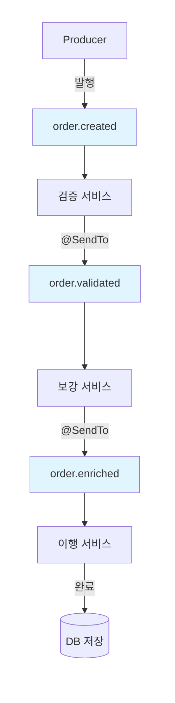
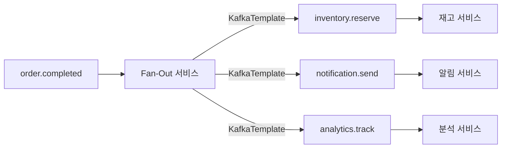
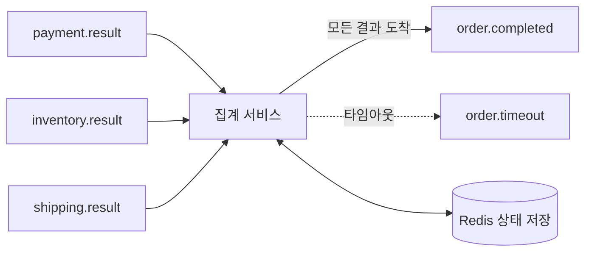
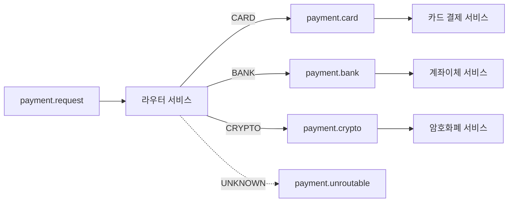
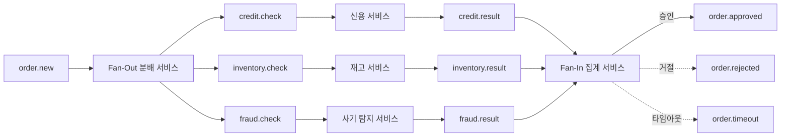
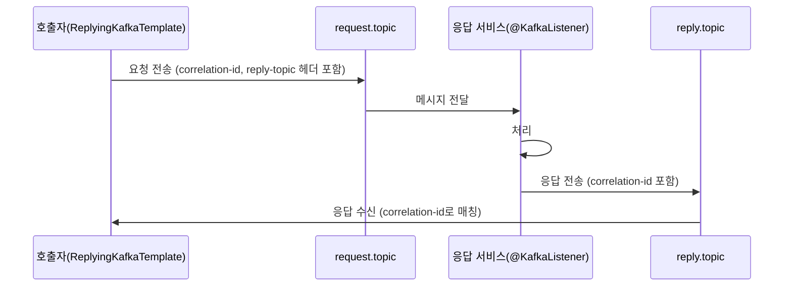

# 토픽 파이프라인

---

> 토픽 파이프라인은 메시지가 하나의 토픽에서 시작하여 여러 중간 토픽을 거치며 단계적으로 처리되는 아키텍처 패턴이다. 각 단계(Stage)는 독립적인 Consumer Group으로 구성되며, 입력 토픽에서 메시지를 소비하고 처리 결과를 출력 토픽에 발행한다.


## 학습 목표

> 파이프라인 다섯 패턴(Linear Chain·Fan-Out·Fan-In·Filter-Branch·Diamond)을 *왜·언제·어떤 비용으로* 쓰는지 이해한다.

이 장을 다 읽고 다음 다섯 가지에 자신 있게 답할 수 있으면 학습이 완료된다.

1. 토픽 파이프라인이 Simple Pub/Sub·Choreography SAGA와 어떻게 다른지 설명할 수 있다.
2. `@SendTo`의 내부 동작과 `KafkaTemplate.send()`와의 선택 기준을 설명할 수 있다.
3. 다섯 가지 파이프라인 패턴 각각의 적합 시점과 핵심 비용을 말할 수 있다.
4. Fan-In 패턴에 외부 상태 저장소가 왜 필수인지, TTL이 왜 같이 필요한지 설명할 수 있다.
5. ReplyingKafkaTemplate이 HTTP 대신 Kafka로 동기 호출을 만드는 합리적 시점을 설명할 수 있다.


## 1. 토픽 파이프라인이 왜 필요한가

단일 토픽에서 모든 처리를 수행하면 세 가지 한계에 부딪힌다.

1. 관심사 분리가 불가능하다.
2. 독립적 스케일링이 불가능하다.
3. 장애 격리가 어렵다.



각 서비스는 독립적인 Consumer Group이다. 각 중간 토픽은 버퍼 역할을 하며, 다음 단계가 자신의 속도로 처리할 수 있게 해준다.

### 1.1 파이프라인 vs Simple Pub/Sub vs Choreography SAGA

| **특징**      | **토픽 파이프라인**                 | **Simple Pub/Sub**    | **Choreography SAGA**                  |
| ------------- | ----------------------------------- | --------------------- | -------------------------------------- |
| 메시지 흐름   | 순차적 단계 (A→B→C)                 | 1:N 브로드캐스트      | 이벤트 기반 자율 반응                  |
| 목적          | 데이터 변환/가공                    | 이벤트 알림           | 분산 트랜잭션                          |
| 보상 트랜잭션 | 없음 (실패 시 DLQ)                  | 없음                  | 있음 (rollback 이벤트)                 |
| 적합 시점     | ETL, 다단계 검증, 데이터 파이프라인 | 알림, 로깅, 캐시 갱신 | 주문 처리, 결제 등 비즈니스 워크플로우 |
| 복잡도        | 중간                                | 낮음                  | 높음                                   |
| 상태 관리     | 각 단계 독립 (stateless 가능)       | 없음                  | 각 서비스가 상태 추적 필요             |


## 2. @SendTo 심화

> `@SendTo`는 `@KafkaListener`의 메서드 반환값을 자동으로 다른 토픽에 전송하는 선언적 메커니즘이다.

### 2.1 내부 동작 원리

1. `MessagingMessageConverter`: `@KafkaListener` 메서드가 값을 반환하면 Spring Kafka는 `MessagingMessageConverter`를 사용해 반환값을 Kafka `ProducerRecord`로 변환한다.
2. `ReplyTemplate`: 변환된 레코드는 `KafkaTemplate`(ReplyTemplate이라고도 부른다)을 통해 전송된다.
3. 헤더 전파: 원본 메시지의 `KafkaHeader.REPLY_TOPIC` 헤더가 있으면 해당 토픽으로 전송된다. 없으면 `@SendTo` 어노테이션에 지정된 토픽으로 전송된다.
4. `null` 반환은 전송하지 않는다.

```java
@Configuration
public class KafkaListenerConfig {

    @Bean
    public ConcurrentKafkaListenerContainerFactory<String, Object> kafkaListenerContainerFactory(
            ConsumerFactory<String, Object> consumerFactory,
            KafkaTemplate<String, Object> kafkaTemplate) {

        ConcurrentKafkaListenerContainerFactory<String, Object> factory =
            new ConcurrentKafkaListenerContainerFactory<>();
        factory.setConsumerFactory(consumerFactory);
        factory.setReplyTemplate(kafkaTemplate);  // @SendTo가 사용할 KafkaTemplate
        return factory;
    }
}
```

### 2.2 토픽 지정 방식

#### 정적 토픽명

```java
@KafkaListener(topics = "order.created", groupId = "validation-service")
@SendTo("order.validated")
public OrderValidatedEvent validate(OrderCreatedEvent event) {
    return validationService.validate(event);
}
```

#### Property Placeholder(환경별 토픽)

```java
@KafkaListener(topics = "${app.source-topic}", groupId = "validation-service")
@SendTo("${app.result-topic}")
public OrderValidatedEvent validate(OrderCreatedEvent event) {
    return validationService.validate(event);
}
```

`application.yml`에서 환경별로 다른 토픽명을 설정할 수 있다.

#### SpEL(Spring Expression Language)

```java
@KafkaListener(topics = "order.created", groupId = "validation-service")
@SendTo("!{@topicResolver.resolve(source.headers)}")
public OrderValidatedEvent validate(OrderCreatedEvent event) {
    return validationService.validate(event);
}
```

SpEL 표현식을 통해 동적 토픽 결정이 가능하다.

### 2.3 반환 타입별 동작

```java
@KafkaListener(topics = "order.created", groupId = "validation-service")
@SendTo("order.validated")
public Message<OrderValidatedEvent> validate(
        @Payload OrderCreatedEvent event,
        @Header("correlation-id") String correlationId) {

    OrderValidatedEvent validated = validationService.validate(event);

    return MessageBuilder.withPayload(validated)
            .setHeader(KafkaHeaders.KEY, event.getOrderId())
            .setHeader("correlation-id", correlationId)
            .build();
}
```

| **반환 타입**            | **동작**                             | **토픽 결정**                     |
| ------------------------ | ------------------------------------ | --------------------------------- |
| POJO                     | 자동 직렬화 후 @SendTo 토픽으로 전송 | @SendTo 값                        |
| `Message<T>`             | 헤더 포함 전송, 토픽 오버라이드 가능 | Message 헤더 우선, 없으면 @SendTo |
| `Collection<Message<T>>` | 각 Message별 토픽 분기 가능          | 각 Message 헤더                   |
| `null`                   | 전송하지 않음                        | -                                 |

### 2.4 에러 발생 시 동작

> `@KafkaListener` 메서드에서 예외가 발생하면 `@SendTo`는 실행되지 않는다. 대신 ErrorHandler가 호출된다.

```
정상: @KafkaListener 실행 → 반환값 → @SendTo → 다음 토픽
예외: @KafkaListener 실행 → 예외 발생 → ErrorHandler → (DLQ 또는 재시도)
```

### 2.5 @SendTo vs KafkaTemplate.send() 선택 기준

| **기준**          | **@SendTo**                  | **KafkaTemplate.send()**                   |
| ----------------- | ---------------------------- | ------------------------------------------ |
| 대상 토픽 수      | 단일 (또는 SpEL로 동적)      | 다중                                       |
| 흐름 제어         | 선언적 (어노테이션)          | 명시적 (코드)                              |
| 에러 처리         | ErrorHandler에 위임          | try-catch로 직접 제어                      |
| 헤더 커스터마이징 | Message 반환 시 가능         | 완전 제어                                  |
| 조건부 전송       | null 반환으로 스킵           | if문으로 분기                              |
| 적합 시점         | 1:1 순차 변환 (Linear Chain) | 1:N 분기, 조건부 라우팅, 복잡한 파이프라인 |


## 3. 토픽 파이프라인 아키텍처 패턴

### 3.1 패턴 1. Linear Chain(순차 변환)

메시지가 A→B→C 순서로 토픽을 거치며 단계적으로 처리된다.

```mermaid
flowchart LR
    T1[order.created] --> V[검증 서비스]
    V -->|@SendTo| T2[order.validated]
    T2 --> E[보강 서비스]
    E -->|@SendTo| T3[order.enriched]
    T3 --> F[이행 서비스]
    F --> Result[처리 완료]

    V -.->|실패| DLQ1[order.created.DLT]
    E -.->|실패| DLQ2[order.validated.DLT]
    F -.->|실패| DLQ3[order.enriched.DLT]
```

하나의 Consumer에서 검증·보강·변환을 모두 수행하면 코드가 비대해지고, 한 단계의 장애가 전체를 중단시킬 수 있다.

```java
// 1단계: 검증
@Component
@Slf4j
public class OrderValidationConsumer {

    private final OrderValidator validator;

    @KafkaListener(topics = "order.created", groupId = "validation-service")
    @SendTo("order.validated")
    public OrderValidatedEvent validate(OrderCreatedEvent event) {
        log.info("Validating order: {}", event.getOrderId());

        validator.validate(event);  // 실패 시 예외 → DLQ로

        return OrderValidatedEvent.builder()
                .orderId(event.getOrderId())
                .validatedAt(Instant.now())
                .items(event.getItems())
                .build();
    }
}

// 2단계: 보강 (외부 데이터 추가)
@Component
@Slf4j
public class OrderEnrichmentConsumer {

    private final CustomerService customerService;
    private final PricingService pricingService;

    @KafkaListener(topics = "order.validated", groupId = "enrichment-service")
    @SendTo("order.enriched")
    public OrderEnrichedEvent enrich(OrderValidatedEvent event) {
        log.info("Enriching order: {}", event.getOrderId());

        CustomerInfo customer = customerService.getCustomer(event.getCustomerId());
        PricingResult pricing = pricingService.calculate(event.getItems());

        return OrderEnrichedEvent.builder()
                .orderId(event.getOrderId())
                .customerName(customer.getName())
                .shippingAddress(customer.getAddress())
                .totalAmount(pricing.getTotal())
                .discount(pricing.getDiscount())
                .enrichedAt(Instant.now())
                .build();
    }
}

// 3단계: 이행
@Component
@Slf4j
public class OrderFulfillmentConsumer {

    private final FulfillmentService fulfillmentService;

    @KafkaListener(topics = "order.enriched", groupId = "fulfillment-service")
    public void fulfill(OrderEnrichedEvent event) {
        log.info("Fulfilling order: {}", event.getOrderId());
        fulfillmentService.process(event);
    }
}
```

#### 적합 시점과 트레이드오프

적합: ETL 파이프라인, 다단계 데이터 검증, 데이터 보강·이벤트 변환.

- 장점: 각 단계가 단일 책임을 가져 코드가 명확해지고, 독립적으로 스케일링·배포가 가능하다.
- 비용: 체인이 길어질수록 각 단계마다 직렬화/역직렬화가 발생하고, 브로커를 거치므로 네트워크 홉이 추가된다.

### 3.2 패턴 2. Fan-Out(1:N 브로드캐스트)

하나의 소스 토픽에서 발생한 이벤트를 N개의 다운스트림 토픽으로 분배한다. 동일한 이벤트를 서로 다른 관점에서 처리해야 할 때 사용한다.



```java
@Component
@RequiredArgsConstructor
@Slf4j
public class OrderCompletedFanOutConsumer {

    private final KafkaTemplate<String, Object> kafkaTemplate;

    @KafkaListener(topics = "order.completed", groupId = "fan-out-service")
    public void fanOut(OrderCompletedEvent event) {
        String orderId = event.getOrderId();
        log.info("Fan-out order completed: {}", orderId);

        kafkaTemplate.send("inventory.reserve", orderId,
                InventoryReserveEvent.builder()
                        .orderId(orderId)
                        .items(event.getItems())
                        .build());

        kafkaTemplate.send("notification.send", orderId,
                NotificationEvent.builder()
                        .orderId(orderId)
                        .customerId(event.getCustomerId())
                        .type(NotificationType.ORDER_COMPLETED)
                        .build());

        kafkaTemplate.send("analytics.track", orderId,
                AnalyticsEvent.builder()
                        .orderId(orderId)
                        .totalAmount(event.getTotalAmount())
                        .timestamp(Instant.now())
                        .build());
    }
}
```

#### 적합 시점과 트레이드오프

적합: 이벤트 알림, CQRS read model 갱신, 감사 로깅, 한 이벤트에 대한 다중 후속 처리.

- 장점: 소스 서비스와 다운스트림 서비스가 완전히 분리된다.
- 비용: 여러 토픽에 전송하므로 부분 실패 가능성이 있다. 원자적 전송이 필요하면 Kafka 트랜잭션이 필요하다.

#### 트랜잭션으로 원자적 Fan-Out(부분 실패 방지)

```java
@Transactional("kafkaTransactionManager")
@KafkaListener(topics = "order.completed", groupId = "fan-out-service")
public void fanOutTransactional(OrderCompletedEvent event) {
    String orderId = event.getOrderId();

    kafkaTemplate.send("inventory.reserve", orderId,
            InventoryReserveEvent.builder().orderId(orderId).items(event.getItems()).build());
    kafkaTemplate.send("notification.send", orderId,
            NotificationEvent.builder().orderId(orderId).customerId(event.getCustomerId()).build());
    kafkaTemplate.send("analytics.track", orderId,
            AnalyticsEvent.builder().orderId(orderId).totalAmount(event.getTotalAmount()).build());
    // 하나라도 실패하면 전체 롤백
}
```

### 3.3 패턴 3. Fan-In(N:1 집계/합류)

여러 소스 토픽의 메시지가 하나의 집계 지점으로 수렴한다. 병렬 처리 결과를 모아 최종 결정을 내릴 때 사용한다.



```java
@Component
@RequiredArgsConstructor
@Slf4j
public class OrderAggregatorConsumer {

    private final AggregationStore aggregationStore;  // Redis 기반
    private final KafkaTemplate<String, Object> kafkaTemplate;

    private static final Set<String> REQUIRED_TOPICS = Set.of(
            "payment.result", "inventory.result", "shipping.result");

    @KafkaListener(
            topics = {"payment.result", "inventory.result", "shipping.result"},
            groupId = "aggregator-service")
    public void aggregate(ConsumerRecord<String, Object> record) {
        String orderId = record.key();
        String sourceTopic = record.topic();

        log.info("Received partial result: orderId={}, topic={}", orderId, sourceTopic);

        aggregationStore.savePartialResult(orderId, sourceTopic, record.value());

        Set<String> receivedTopics = aggregationStore.getReceivedTopics(orderId);

        if (receivedTopics.containsAll(REQUIRED_TOPICS)) {
            log.info("All results received for order: {}", orderId);

            OrderAggregation result = aggregationStore.buildResult(orderId);
            kafkaTemplate.send("order.completed", orderId, result);
            aggregationStore.cleanup(orderId);
        }
    }
}

// AggregationStore 구현 (Redis 기반)
@Component
@RequiredArgsConstructor
public class RedisAggregationStore implements AggregationStore {

    private final RedisTemplate<String, Object> redisTemplate;
    private static final Duration TTL = Duration.ofMinutes(30);

    @Override
    public void savePartialResult(String orderId, String topic, Object result) {
        String key = "aggregation:" + orderId;
        redisTemplate.opsForHash().put(key, topic, result);
        redisTemplate.expire(key, TTL);  // TTL 설정: 부분 실패 시 자동 정리
    }

    @Override
    public Set<String> getReceivedTopics(String orderId) {
        String key = "aggregation:" + orderId;
        return redisTemplate.opsForHash().keys(key).stream()
                .map(Object::toString)
                .collect(Collectors.toSet());
    }

    @Override
    public OrderAggregation buildResult(String orderId) {
        String key = "aggregation:" + orderId;
        Map<Object, Object> entries = redisTemplate.opsForHash().entries(key);
        return OrderAggregation.from(entries);
    }

    @Override
    public void cleanup(String orderId) {
        redisTemplate.delete("aggregation:" + orderId);
    }
}
```

#### 적합 시점과 트레이드오프

적합: Scatter-Gather 패턴, 병렬 작업 완료 대기, 주문 집계, 다중 소스 데이터 결합.

- 장점: 병렬 처리로 전체 처리 시간을 단축할 수 있다. 각 브랜치가 독립적으로 동작하므로 한 브랜치 지연이 다른 브랜치에 영향을 주지 않는다.
- 비용: 외부 상태 저장소가 필수이며, 이 저장소 자체의 가용성을 관리해야 한다.

### 3.4 패턴 4. Filter-Branch(조건부 라우팅)

메시지의 내용을 검사하여 조건에 따라 다른 토픽으로 라우팅한다. Content-Based Router 패턴이라고도 하며, 하나의 입력 토픽에서 메시지 타입이나 속성에 따라 분기된다.



```java
@Component
@RequiredArgsConstructor
@Slf4j
public class PaymentRouterConsumer {

    private final KafkaTemplate<String, Object> kafkaTemplate;

    @KafkaListener(topics = "payment.request", groupId = "payment-router")
    public void route(PaymentRequestEvent event) {
        String orderId = event.getOrderId();

        String targetTopic = switch (event.getPaymentMethod()) {
            case CARD -> "payment.card";
            case BANK_TRANSFER -> "payment.bank";
            case CRYPTO -> "payment.crypto";
        };

        log.info("Routing payment: orderId={}, method={}, target={}",
                orderId, event.getPaymentMethod(), targetTopic);

        kafkaTemplate.send(targetTopic, orderId, event);
    }
}

// 라우팅 전략 인터페이스
public interface RoutingStrategy<T> {
    String resolveTargetTopic(T event);
    String fallbackTopic();
}

@Component
public class PaymentRoutingStrategy implements RoutingStrategy<PaymentRequestEvent> {

    private static final Map<PaymentMethod, String> TOPIC_MAP = Map.of(
            PaymentMethod.CARD, "payment.card",
            PaymentMethod.BANK_TRANSFER, "payment.bank",
            PaymentMethod.CRYPTO, "payment.crypto"
    );

    @Override
    public String resolveTargetTopic(PaymentRequestEvent event) {
        return TOPIC_MAP.getOrDefault(event.getPaymentMethod(), fallbackTopic());
    }

    @Override
    public String fallbackTopic() {
        return "payment.unroutable";
    }
}
```

#### 적합 시점과 트레이드오프

적합: Content-Based Routing, A/B 테스팅, 우선순위 큐, 메시지 타입별 분리.

- 장점: 다운스트림 Consumer가 자신의 타입만 처리하면 되므로 로직이 단순해진다.
- 비용: 라우터가 단일 장애점이 된다. 모든 메시지가 라우터를 거쳐야 하므로 라우터의 처리량이 전체 시스템의 병목이 될 수 있다.

### 3.5 패턴 5. Diamond(Fan-Out + Fan-In 결합)

메시지를 여러 브랜치로 분산(Fan-Out)하고, 각 결과를 다시 합류시키는 패턴이다.



```java
@Component
@RequiredArgsConstructor
@Slf4j
public class OrderCheckFanOutConsumer {

    private final KafkaTemplate<String, Object> kafkaTemplate;

    @KafkaListener(topics = "order.new", groupId = "order-check-fanout")
    public void distribute(OrderNewEvent event) {
        String orderId = event.getOrderId();
        String correlationId = UUID.randomUUID().toString();

        log.info("Distributing checks: orderId={}, correlationId={}", orderId, correlationId);

        Headers headers = new RecordHeaders();
        headers.add("correlation-id", correlationId.getBytes(StandardCharsets.UTF_8));

        kafkaTemplate.send(new ProducerRecord<>(
                "credit.check", null, orderId, toCreditCheckRequest(event), headers));

        kafkaTemplate.send(new ProducerRecord<>(
                "inventory.check", null, orderId, toInventoryCheckRequest(event), headers));

        kafkaTemplate.send(new ProducerRecord<>(
                "fraud.check", null, orderId, toFraudCheckRequest(event), headers));
    }
}

@Component
@RequiredArgsConstructor
@Slf4j
public class OrderDecisionAggregator {

    private final AggregationStore aggregationStore;
    private final KafkaTemplate<String, Object> kafkaTemplate;

    private static final Set<String> REQUIRED = Set.of(
            "credit.result", "inventory.result", "fraud.result");

    @KafkaListener(
            topics = {"credit.result", "inventory.result", "fraud.result"},
            groupId = "order-decision-aggregator")
    public void aggregate(ConsumerRecord<String, Object> record,
                          @Header("correlation-id") String correlationId) {

        String orderId = record.key();
        aggregationStore.savePartialResult(orderId, record.topic(), record.value());

        Set<String> received = aggregationStore.getReceivedTopics(orderId);
        if (!received.containsAll(REQUIRED)) {
            return;
        }

        OrderDecision decision = makeDecision(orderId);
        if (decision.isApproved()) {
            kafkaTemplate.send("order.approved", orderId, decision);
        } else {
            kafkaTemplate.send("order.rejected", orderId, decision);
        }

        aggregationStore.cleanup(orderId);
    }
}
```

#### 적합 시점과 트레이드오프

적합: 주문 승인/거절, 대출 심사, 다중 요소 인증, 병렬 검증이 필요한 모든 워크플로우.

- 장점: 병렬 처리로 전체 지연 시간을 최소화한다. 각 브랜치가 독립적으로 스케일링되며, 한 브랜치의 장애가 다른 브랜치에 영향을 주지 않는다.
- 비용: 다섯 가지 패턴 중 가장 복잡하다.

### 3.6 패턴 선택 가이드

| **상황**                         | **추천 패턴**                | **이유**                            |
| -------------------------------- | ---------------------------- | ----------------------------------- |
| 단계별 데이터 변환 (ETL, 검증)   | Linear Chain                 | 각 단계 독립 스케일링, 단일 책임    |
| 하나의 이벤트 → 여러 서비스 알림 | Fan-Out                      | 관심사 분리, 독립적 후속 처리       |
| 여러 결과를 모아 최종 결정       | Fan-In                       | 병렬 처리 후 합류                   |
| 메시지 타입별 다른 처리          | Filter-Branch                | 조건부 라우팅, Consumer 로직 단순화 |
| 병렬 검증 후 종합 판단           | Diamond                      | Fan-Out + Fan-In, 지연 시간 최소화  |
| 순차 변환 + 조건 분기            | Linear Chain + Filter-Branch | 패턴 조합                           |
| 이벤트 분배 + 결과 수집          | Fan-Out + Fan-In (Diamond)   | 패턴 조합                           |


## 4. ReplyingKafkaTemplate(Request-Reply 패턴)

> ReplyingKafkaTemplate은 Kafka 위에서 동기식 Request-Reply 패턴을 구현한다. 일반적으로 Kafka는 비동기 메시징에 사용되지만, 때로는 요청을 보내고 응답을 기다려야 할 때가 있다.

### 4.1 왜 HTTP가 아닌 Kafka로 Request-Reply를 하는가

Kafka 인프라가 있는 환경에서 추가적인 서비스 디스커버리나 로드 밸런서 없이 RPC를 수행할 수 있다. 다만 지연 시간이 HTTP보다 길고 처리량이 낮으므로 고빈도 호출에는 적합하지 않다.

이 기능이 필요한 이유는 "가끔 동기 응답이 필요한" 경계 지점이 존재하기 때문이다.

1. 기존 파이프라인 중간에 동기 검증이 끼어드는 경우.
2. 요청 유실이 허용되지 않는 동기 조회.
3. 호출자와 응답자가 서로의 존재를 몰라야 하는 경우.

### 4.2 동작 원리



1. 호출자가 `ReplyingKafkaTemplate`으로 요청을 전송한다. 이때 `KafkaHeaders.CORRELATION_ID`와 `KafkaHeaders.REPLY_TOPIC` 헤더가 자동으로 추가된다.
2. 응답 서비스가 요청을 처리하고 `@SendTo`로 응답을 전송한다.
3. 호출자의 Reply container가 응답 토픽을 구독하고 있다가 `CORRELATION_ID`로 요청/응답을 매칭한다.

### 4.3 구현

```java
@Configuration
public class ReplyingKafkaConfig {

    @Value("${app.reply-topic}")
    private String replyTopic;

    @Bean
    public ConcurrentMessageListenerContainer<String, OrderResponse> repliesContainer(
            ConsumerFactory<String, OrderResponse> consumerFactory) {

        ContainerProperties containerProperties = new ContainerProperties(replyTopic);
        containerProperties.setGroupId("order-reply-group");

        return new ConcurrentMessageListenerContainer<>(consumerFactory, containerProperties);
    }

    @Bean
    public ReplyingKafkaTemplate<String, OrderRequest, OrderResponse> replyingTemplate(
            ProducerFactory<String, OrderRequest> producerFactory,
            ConcurrentMessageListenerContainer<String, OrderResponse> repliesContainer) {

        ReplyingKafkaTemplate<String, OrderRequest, OrderResponse> template =
                new ReplyingKafkaTemplate<>(producerFactory, repliesContainer);

        template.setDefaultReplyTimeout(Duration.ofSeconds(10));
        return template;
    }
}

@Service
@RequiredArgsConstructor
@Slf4j
public class OrderQueryService {

    private final ReplyingKafkaTemplate<String, OrderRequest, OrderResponse> replyingTemplate;

    public OrderResponse queryOrder(String orderId) {
        OrderRequest request = new OrderRequest(orderId);

        ProducerRecord<String, OrderRequest> record =
                new ProducerRecord<>("order.request", orderId, request);

        try {
            RequestReplyFuture<String, OrderRequest, OrderResponse> future =
                    replyingTemplate.sendAndReceive(record);

            future.getSendFuture().get(5, TimeUnit.SECONDS);
            ConsumerRecord<String, OrderResponse> response = future.get(10, TimeUnit.SECONDS);
            return response.value();

        } catch (TimeoutException e) {
            log.error("Reply timeout for order: {}", orderId);
            throw new OrderQueryTimeoutException(orderId, e);
        } catch (InterruptedException e) {
            Thread.currentThread().interrupt();
            throw new OrderQueryException(orderId, e);
        } catch (ExecutionException e) {
            throw new OrderQueryException(orderId, e.getCause());
        }
    }
}

@Component
@RequiredArgsConstructor
@Slf4j
public class OrderRequestHandler {

    private final OrderRepository orderRepository;

    // @SendTo에 토픽을 명시하지 않으면, Spring Kafka가 수신 메시지의
    // KafkaHeaders.REPLY_TOPIC 헤더를 읽어 응답 대상 토픽을 자동 결정한다.
    @KafkaListener(topics = "order.request", groupId = "order-request-handler")
    @SendTo
    public OrderResponse handle(OrderRequest request) {
        return orderRepository.findById(request.getOrderId())
                .map(order -> OrderResponse.builder()
                        .orderId(order.getId())
                        .status(order.getStatus())
                        .totalAmount(order.getTotalAmount())
                        .build())
                .orElse(OrderResponse.notFound(request.getOrderId()));
    }
}
```

### 4.4 @SendTo vs ReplyingKafkaTemplate

| **기준**        | **@SendTo**                      | **ReplyingKafkaTemplate**          |
| --------------- | -------------------------------- | ---------------------------------- |
| 통신 방향       | Fire-and-forward (단방향)        | Request-Reply (양방향)             |
| 호출자 블로킹   | 없음                             | 있음 (응답 대기)                   |
| 용도            | 파이프라인 연결 (다음 단계 전달) | 동기식 조회/검증                   |
| correlation     | 불필요 (혹은 수동 전파)          | 자동 (KafkaHeaders.CORRELATION_ID) |
| 타임아웃 처리   | 해당 없음                        | 내장 (setDefaultReplyTimeout)      |
| 처리량          | 높음 (비동기)                    | 낮음 (동기 대기)                   |
| reply 토픽 관리 | 불필요                           | 필요 (전용 reply 토픽)             |


## 5. 면접 대비 Q&A

> 면접에서 자주 나오는 형태로 5개. 답을 보지 않고 먼저 입으로 답해 본 뒤 비교한다.

### Q1. 토픽 파이프라인과 Choreography SAGA의 결정적 차이는?

목적과 보상 트랜잭션 유무다. 파이프라인은 *데이터 변환·가공*이 목적이라 한 단계가 실패하면 DLQ로 격리하고 끝낸다. SAGA는 *분산 트랜잭션*이라 한 단계 실패가 *앞 단계의 보상(rollback) 이벤트 발행*을 트리거한다. 같은 토픽 체인으로 보여도 운영 상태 머신이 다르다. ETL이라면 파이프라인, 결제·재고·배송이 함께 묶인다면 SAGA다.

### Q2. `@SendTo`와 `KafkaTemplate.send()` 중 어느 쪽을 골라야 하나?

흐름이 *1:1 순차 변환*이면 `@SendTo`가 선언적이고 깔끔하다. 메서드 반환값 → 다음 토픽으로 자동 연결되고, null 반환이 곧 스킵을 의미한다. *1:N 분기, 조건부 라우팅, 헤더 풀 커스터마이징, Kafka 트랜잭션 묶음*이 필요하면 `KafkaTemplate.send()`가 옳다. 둘을 한 메서드에 섞으면 추적이 어려워지므로 한쪽으로 통일한다.

### Q3. Fan-In 패턴에 외부 상태 저장소가 반드시 필요한 이유는?

여러 토픽의 결과를 *같은 키로 모으는 동안* 어디엔가 부분 결과를 누적해야 하기 때문이다. 컨슈머 메모리에 두면 인스턴스가 죽거나 리밸런스가 일어났을 때 다 잃는다. Redis 같은 외부 저장소를 쓰고, 30분 같은 TTL을 같이 잡아 *부분 결과가 영영 안 들어오는* 경우(타임아웃)에도 자동으로 정리되게 한다. 키 충돌을 막기 위해 orderId 같은 비즈니스 키로 네임스페이스를 만든다.

### Q4. Filter-Branch 패턴의 라우터가 단일 장애점이 되는 걸 어떻게 완화하나?

세 가지를 결합한다. 첫째, 라우터를 *완전 stateless*로 두고 인스턴스를 수평 확장한다 — 같은 Consumer Group으로 묶으면 파티션 분배로 자연스럽게 부하 분산. 둘째, 라우팅 로직을 코드 상수가 아닌 *설정 파일/외부 룰 엔진*으로 빼서 라우터 재배포 없이 룰을 갱신한다. 셋째, fallback 토픽(`payment.unroutable`)을 두고 모르는 타입을 거기에 넣어 추적 가능하게 한다. 그래도 라우터가 병목이면 라우팅을 Producer 쪽에서 *토픽을 직접 골라 발행*하는 모델로 분산시킨다.

### Q5. ReplyingKafkaTemplate을 HTTP 대신 쓸 합리적인 시점은?

세 가지 조건 중 하나라도 강하면 검토할 만하다. 첫째, *Kafka 인프라가 이미 있고 HTTP 호출만을 위한 별도 LB·서비스 디스커버리를 도입하기 싫을 때*. 둘째, *요청 유실이 절대 허용되지 않을 때* — Kafka 토픽의 내구성을 그대로 활용한다. 셋째, *호출자·응답자가 서로의 호스트를 몰라야 할 때* — pub/sub 추상화가 그대로 유지된다. 단 ms 단위 저지연이 필요하거나 호출 빈도가 매우 높으면 여전히 HTTP/gRPC가 옳다.


## 6. 관련 문서

- [03-01.토픽 디자인](02-01.토픽%20디자인.md) — 파이프라인을 만드는 토픽 단위 설계
- [03-04.한 토픽 다수 message 형태](../02_MessageContract/01-07.한%20토픽%20다수%20message%20형태.md) — Filter-Branch 대안으로서의 RecordNameStrategy
- [05-01.Choreography Saga](../05_ConsistencyPattern/01-01.Choreography%20Saga.md) — 파이프라인과 SAGA의 경계
- [05-02.Orchestration Saga](../05_ConsistencyPattern/01-02.Orchestration%20Saga.md) — Diamond 패턴이 자연스럽게 진화하는 구조
- [06-01.Kafka Streams](../06_StreamProcessing/01-01.Kafka%20Streams.md) — Stateful 변환을 위한 도구


---

> **TPS 적용 사례** — `okestro/tps-gitlab2`
>
> - **모듈/위치**: operator `BuildJobExecutionPublishService` → executor → operator `BuildResultConsumer`/`DeployResultConsumer`/`TestResultConsumer`
> - **요점**: operator가 `OPERATOR_CMD_BUILD/TEST/DEPLOY` 명령 토픽으로 작업을 위임하면 executor가 `EXECUTOR_EVT_*_RESULT`로 결과를 회신하는 cmd/evt 분리 토픽 파이프라인. 같은 `pipelineId`(aggregateId)를 키로 사용해 단일 파티션 안에서 순서 보장.
> - **상세**: 토픽 enum은 `messaging/topic/Topics.java`의 7개 항목 참조.
