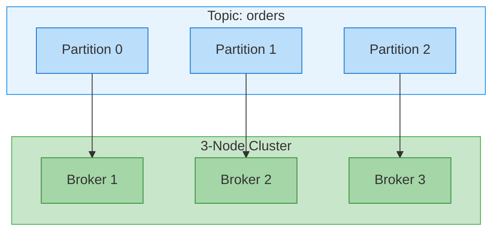
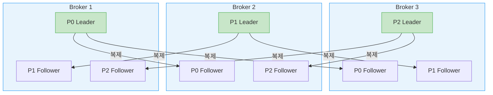
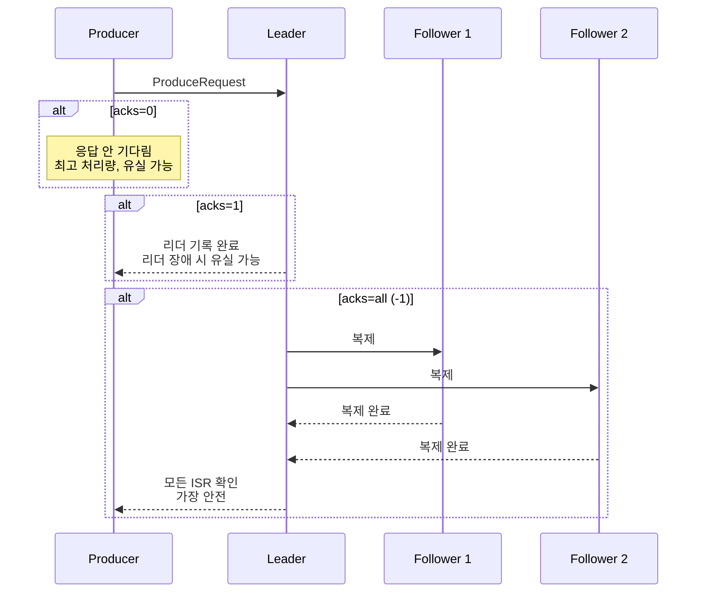

# 메시지 큐 아키텍처

---

> 분산 메시지 브로커의 공통 아키텍처에서 *브로커 구현체와 독립적인 개념*을 다룬다. 분산 커밋 로그, 파티셔닝, 복제·ISR, 그리고 그 위에서의 실무 설계 가이드를 한 줄로 꿰어 본다. Kafka와 Redpanda가 같은 추상을 어떻게 다르게 구현하는지도 마지막에 비교한다.


## 학습 목표

> 분산 메시지 브로커의 *공통 추상*을 이해해, Kafka든 Redpanda든 같은 결정 트리로 운영 설정을 고를 수 있다.

이 장을 다 읽고 다음 다섯 가지에 자신 있게 답할 수 있으면 학습이 완료된다.

1. 분산 커밋 로그가 Append-Only 구조에서 어떻게 성능을 얻는지 설명할 수 있다.
2. 파티션이 *병렬성·순서 보장·키 분배*를 동시에 만들어 내는 메커니즘을 설명할 수 있다.
3. `acks`와 `min.insync.replicas`의 조합이 RF=3 환경에서 어떤 안전성을 보장하는지 설명할 수 있다.
4. ISR과 Unclean Leader Election이 CAP의 어디에 서 있는지 설명할 수 있다.
5. 파티션 수·RF·노드 수를 어떤 기준으로 결정해야 하는지 트레이드오프 표로 말할 수 있다.


## 1. 분산 커밋 로그

> 분산 메시지 브로커의 핵심 자료구조는 **커밋 로그(Commit Log)**다. 전통적인 데이터베이스에서 WAL(Write-Ahead Log)과 테이블이 분리되어 있는 것과 달리, 메시지 브로커에서는 **로그 자체가 곧 데이터**다.

### 1.1 Append-Only 로그

모든 메시지는 시간 순서대로 로그 끝에 추가(Append)된다. 기존 메시지를 수정하거나 중간에 삽입하는 것은 불가능하다. 이 제약이 오히려 성능의 핵심 원천이 된다.

- **순차 I/O**: 디스크는 랜덤 읽기/쓰기보다 순차 접근에서 수십~수백 배 빠르다. Append-Only 로그는 항상 순차적으로 쓰므로 디스크 성능을 극대화한다.
- **불변성(Immutability)**: 한 번 기록된 메시지는 변경되지 않으므로, 동시 읽기에 Lock이 필요 없다.
- **재생 가능성(Replayability)**: Consumer는 오프셋을 되감아서 과거 메시지를 다시 읽을 수 있다. 이는 전통적인 메시지 큐(RabbitMQ 등)에서 메시지를 소비하면 사라지는 것과 근본적으로 다르다.

```
커밋 로그의 구조:

offset →  0    1    2    3    4    5    6    7
        [msg] [msg] [msg] [msg] [msg] [msg] [msg] [msg]
        ←── 과거 ───────────────────────── 최신 ──→
                                              ↑
                                          쓰기 위치 (항상 끝에 추가)
```

### 1.2 세그먼트 기반 관리

로그가 하나의 거대한 파일이라면 보존 정책(Retention) 적용이 어렵다. 따라서 로그는 여러 **세그먼트(Segment)** 파일로 분할된다.

- **Active Segment**: 현재 쓰기가 진행 중인 세그먼트. 하나의 파티션에 하나만 존재한다.
- **Closed Segment**: 크기 또는 시간 기준으로 닫힌 세그먼트. 삭제(Deletion)나 압축(Compaction) 대상이 된다.

```
파티션 디렉토리:
├── segment-000000.log    (Closed — 삭제/압축 대상)
├── segment-000000.index  (오프셋 인덱스)
├── segment-001024.log    (Closed)
├── segment-001024.index
├── segment-002048.log    (Active — 현재 쓰기 중)
└── segment-002048.index
```

세그먼트별로 **오프셋 인덱스**가 존재해 특정 오프셋을 빠르게 찾을 수 있다. 모든 오프셋을 인덱싱하지 않고 일정 간격만 기록하는 **Sparse Index** 방식을 사용하여 메모리를 절약한다.

### 1.3 보존 정책

메시지를 영원히 저장하면 디스크가 부족해진다. 보존 정책은 두 가지 방식으로 동작한다.

- **시간 기반 삭제**: `retention.ms` 설정으로 일정 시간이 지난 세그먼트를 삭제한다. 기본값은 7일이다.
- **크기 기반 삭제**: `retention.bytes` 설정으로 파티션의 총 크기가 임계치를 넘으면 오래된 세그먼트부터 삭제한다.
- **로그 압축(Compaction)**: 삭제 대신 각 키의 최신 값만 유지한다. Changelog 토픽(최종 상태만 중요한 경우)에 적합하다.


## 2. 파티셔닝과 병렬성

> 토픽은 1개 이상의 파티션으로 나뉘고, 파티션이 수평 확장·병렬 소비·순서 보장의 기본 단위가 된다. 순서는 토픽 전체가 아니라 파티션 내에서만 보장되며, 그 제약이 곧 병렬성을 가능하게 한다.

### 2.1 토픽과 파티션

**토픽(Topic)**은 메시지의 논리적 채널이며, 하나의 토픽은 1개 이상의 **파티션(Partition)**으로 분할된다. 파티션은 병렬 처리의 기본 단위다.



파티셔닝이 제공하는 핵심 이점은 세 가지다.

- **수평 확장**: 파티션을 여러 브로커에 분산하여 단일 노드의 디스크/네트워크 한계를 초과하는 처리량을 달성한다.
- **병렬 소비**: Consumer Group의 각 Consumer가 서로 다른 파티션을 담당하여 처리량을 선형으로 확장한다.
- **순서 보장 범위 제한**: 전체 토픽이 아닌 파티션 내에서만 순서가 보장된다. 이 제약이 병렬성을 가능하게 한다.

### 2.2 파티션 내 순서 보장

파티션은 메시지의 순서가 보장되는 최소 단위다. 같은 키를 가진 메시지는 `hash(key) % 파티션 수`에 의해 항상 같은 파티션에 기록되므로, **키 단위의 순서**가 보장된다.

```
Producer 전송 순서: A1, B1, A2, B2, A3

hash("A") % 3 = 0 → Partition 0: [A1] [A2] [A3]  (순서 보장)
hash("B") % 3 = 1 → Partition 1: [B1] [B2]       (순서 보장)

전체 토픽 레벨에서는? → A1과 B1 중 누가 먼저인지 보장 안 됨
```

- 이 특성 때문에 순서가 중요한 이벤트(주문의 생성→수정→취소 등)는 반드시 같은 키를 사용해야 한다.
- 직관적 비유로는 한 명의 배달원(= 한 파티션)이 피자·음료·디저트를 함께 들고 오면 도착 순서가 그대로 보장되지만, 다른 배달원(= 다른 파티션)이 따로 출발하면 누가 먼저 도착할지는 알 수 없는 것과 같다. "파티션 내 순서 보장"은 결국 "같은 키의 메시지는 같은 배달원이 옮긴다"는 약속이다.

### 2.3 브로커 간 파티션 분산

파티션은 클러스터 내 브로커에 **균등하게 분산**된다. 각 파티션에는 **리더(Leader)**와 **팔로워(Follower)**가 존재하며, 모든 읽기/쓰기는 리더를 통해 이루어진다.



리더가 장애를 겪으면, 팔로워 중 하나가 새 리더로 승격된다. 이 과정에서 클라이언트는 짧은 지연을 경험하지만 데이터는 유실되지 않는다(적절한 복제 설정 하에서).


## 3. 복제와 내구성

> Replication Factor가 파티션 복제본 수를, `acks`가 발행 성공 기준을, ISR이 동기화된 팔로워 집합을 정한다. 이 셋이 맞물려 노드 장애에도 데이터를 잃지 않는 내구성을 만든다.

### 3.1 Replication Factor

**Replication Factor(RF)**는 각 파티션의 복제본 수를 결정한다. RF=3이면 파티션의 데이터가 3개 브로커에 저장된다.

| RF | 허용 장애 노드 | Quorum | 저장 공간 | 적합 환경 |
|----|---------------|--------|----------|----------|
| 1 | 0개 | 1/1 | 1x | 개발/테스트 |
| 3 | 1개 | 2/3 | 3x | 일반 프로덕션 |
| 5 | 2개 | 3/5 | 5x | 고가용성 프로덕션 |

RF=1은 복제가 없으므로 노드 하나의 디스크 장애로 데이터가 영구 유실된다. **프로덕션에서는 RF=3이 표준**이다.

### 3.2 Producer의 acks 설정

Producer가 메시지를 보낼 때 "언제 성공으로 간주할 것인가"를 `acks` 설정으로 결정한다.



| acks | 동작 | 처리량 | 안전성 |
|------|------|--------|--------|
| `0` | 응답을 기다리지 않음 | 최고 | 최저 (유실 가능) |
| `1` | 리더 기록 후 응답 | 중간 | 중간 (리더 장애 시 유실) |
| `all` | 모든 ISR 확인 후 응답 | 최저 | 최고 |

프로덕션에서는 `acks=all`과 `min.insync.replicas=2`를 함께 사용하는 것이 표준이다.

### 3.3 ISR (In-Sync Replicas)

**ISR**은 리더와 충분히 동기화된 팔로워들의 집합이다. "충분히"의 기준은 `replica.lag.time.max.ms` 설정으로 결정된다. 팔로워가 이 시간 내에 리더의 최신 메시지를 복제하면 ISR에 포함되고, 그렇지 않으면 제외된다. 팔로워는 ZooKeeper와의 세션이 살아 있고(`zookeeper.session.timeout.ms` 내 heartbeat), 이 시간 내에 리더의 *가장 최근* 메시지까지 따라잡았을 때 in-sync다. 단지 메시지를 받기만 해서는 안 되고, 적어도 한 번은 lag이 0이어야 한다.

두 임계값은 2.5.0에서 함께 늘었다. `zookeeper.session.timeout.ms`는 6초에서 18초로, `replica.lag.time.max.ms`는 10초에서 30초로 올랐다. 네트워크 지연 분산이 큰 클라우드 환경에서 GC나 일시적 네트워크 변동으로 ISR이 in/out을 오가는 불필요한 flapping을 줄이기 위해서다. 다만 `replica.lag.time.max.ms`를 높이면 컨슈머 최대 지연도 늘어난다. 메시지가 모든 replica에 도달해 컨슈머가 소비할 수 있게 되기까지 최대 30초가 걸릴 수 있기 때문이다.

ISR의 목적은 **쓰기 성능과 데이터 안전성의 균형**이다. 모든 복제본을 기다리면 느린 노드 하나가 전체 쓰기를 지연시킨다. ISR만 기다리면 "현재 동기화된" 노드만 고려하므로 빠른 쓰기와 안전성을 동시에 달성할 수 있다. 약간 뒤처진 in-sync replica는 commit 전까지 모두 기다려야 하므로 producer·consumer를 느리게 하지만, 일단 out-of-sync로 빠지면 더는 기다리지 않아 성능 영향은 사라진다. 대신 ISR이 줄어든 만큼 실효 복제 계수가 낮아져 downtime·데이터 유실 위험이 커진다.

### 3.4 min.insync.replicas

`min.insync.replicas`는 쓰기가 성공하기 위한 **최소 ISR 크기**다. `acks=all`과 함께 사용하여 데이터 안전성을 강화한다.

```yaml
# 프로덕션 권장 설정
replication.factor: 3
min.insync.replicas: 2
acks: all
```

이 설정의 의미는 "최소 2개 노드가 메시지를 확인해야만 쓰기 성공"이다.

- **정상 (ISR=3)**: 리더 + 팔로워 2개 모두 응답. 정상 동작.
- **팔로워 1개 장애 (ISR=2)**: 리더 + 팔로워 1개 응답. 여전히 `min.insync.replicas=2` 만족.
- **팔로워 2개 장애 (ISR=1)**: 리더만 살아있음. `min.insync.replicas=2` 미만이므로 **모든 쓰기 실패**.

ISR이 `min.insync.replicas` 미만이 되면 브로커는 produce 요청을 거부하고, producer는 `NotEnoughReplicasException`을 받는다. 컨슈머는 기존 데이터를 계속 읽을 수 있으므로, 사실상 단일 in-sync replica가 **read-only** 상태가 된다. 이는 데이터가 produce·consume됐다가 unclean election으로 사라지는 상황을 막아 준다. 복구하려면 불가용 파티션 하나를 다시 살려(브로커 재시작) catch up시켜 in-sync로 만들어야 한다.

`min.insync.replicas`를 RF보다 1 작게 설정하는 것이 일반적이다. RF=3이면 `min.insync.replicas=2`로, 1개 노드 장애를 허용하면서 최소 2개 노드에 데이터가 있음을 보장한다. 여기서 주의할 점은, Kafka 신뢰성 보장상 데이터는 "모든 ISR에 쓰이면" committed인데 그 all이 1개뿐일 수 있다는 것이다. `min.insync.replicas`를 높이는 것은 그 "1개뿐인 ISR에 committed됐다가 그 replica가 사라지는" 위험을 막는 장치다.

### 3.5 Unclean Leader Election

모든 ISR 멤버가 장애를 겪으면, 동기화되지 않은 팔로워만 남는다. 이때 두 가지 선택지가 있다.

- **허용(가용성 우선)**: 동기화되지 않은 팔로워를 리더로 승격. 서비스는 복구되지만 **데이터 유실 가능**.
- **거부(일관성 우선)**: 리더 선출을 거부. ISR 멤버가 복구될 때까지 **서비스 중단**.

이 선택은 CAP 정리에서 Availability와 Consistency 사이의 트레이드오프다. 금융/의료 같은 데이터 정확성이 중요한 분야에서는 일관성을 우선하고, 로그 수집 같은 유실이 허용되는 시나리오에서는 가용성을 우선할 수 있다.


## 4. 실무 설계 가이드

> 파티션 수·복제 설정·디스크 영속화·노드 수를 어떤 기준으로 정하는지 트레이드오프로 정리한다. 앞 절의 개념을 실제 운영 값으로 떨어뜨리는 단계다.

### 4.1 파티션 수 계획

파티션 수는 병렬 처리 성능과 리소스 오버헤드 사이의 트레이드오프다.

**파티션이 너무 적을 때**: Consumer Group의 Consumer 수가 파티션 수를 초과하면 유휴 Consumer가 발생한다. 또한 단일 파티션에 트래픽이 집중되면 해당 브로커가 병목이 된다.

**파티션이 너무 많을 때**: 파티션마다 메타데이터 오버헤드가 발생한다. 리더 선출 시 수천 개의 파티션이 동시에 선출을 진행하면 "Election Storm"이 발생할 수 있다. 파일 디스크립터도 파티션 수에 비례하여 소모된다.

| 시나리오 | 권장 파티션 수 | 근거 |
|---------|-------------|------|
| 저처리량 토픽 (< 10MB/s) | 3~6개 | 최소한의 병렬성 확보 |
| 중간 처리량 (10~100MB/s) | 6~12개 | Consumer 병렬 처리와 부하 분산 |
| 고처리량 (> 100MB/s) | 12~30개 | 코어 수 고려, 과도하게 늘리지 않음 |
| 순서 보장 필요 | 1개 | 파티션 내에서만 순서 보장 가능 |

### 4.2 Replication Factor 설정

| RF | 허용 장애 | 저장 공간 | 적합 환경 |
|----|----------|----------|----------|
| 1 | 0개 노드 | 1x | 개발/테스트 (복제 없음) |
| 3 | 1개 노드 | 3x | 프로덕션 표준 |
| 5 | 2개 노드 | 5x | 높은 가용성 |

RF는 단순히 "허용 장애 수"만 보고 정할 것이 아니라 다섯 요소를 함께 본다. **가용성**(replica 1개면 단일 브로커 routine restart에도 파티션이 불가용해진다), **내구성**(replica가 1개뿐인데 디스크가 망가지면 전부 잃는다), **처리량**(replica마다 inter-broker 복제 트래픽이 배수로 는다. 10MBps produce면 replica 2개는 10MBps·3개는 20MBps·5개는 40MBps의 복제 트래픽이 생기므로 클러스터 용량 계획에 반영해야 한다), **e2e 지연**(레코드는 모든 ISR에 복제돼야 컨슈머가 볼 수 있으니 replica가 많을수록 느린 노드 하나에 걸릴 확률이 는다), **비용**(replica가 많을수록 스토리지·네트워크 비용이 는다)이다. 비핵심 데이터에 RF<3을 쓰는 가장 흔한 이유가 비용이다. 많은 스토리지가 이미 블록을 3번 복제하므로 RF=2로 줄여 비용을 아끼기도 하는데, 이때 가용성은 RF=3보다 떨어지지만 내구성은 스토리지 장치가 보장한다.

**replica 배치(`broker.rack`)**: Kafka는 한 파티션의 각 replica를 항상 서로 다른 브로커에 둔다. 그런데 그 브로커들이 모두 같은 rack에 있으면 top-of-rack 스위치가 오작동할 때 RF와 무관하게 파티션 가용성을 잃는다. 브로커마다 `broker.rack` 설정으로 rack 이름을 지정하면 Kafka가 replica를 여러 rack에 분산해 더 높은 가용성을 보장한다. 클라우드에서는 availability zone을 별도 rack으로 보는 것이 흔하다.

### 4.3 디스크 영속화(`flush.messages`·`flush.ms`)

Kafka는 메시지를 디스크에 영속화하지 않고도 ack한다. 디스크 flush 여부가 아니라 메시지를 받은 replica 수에 의존하기 때문이다. 세그먼트를 rotate할 때(기본 1GB)와 재시작 전에는 flush하지만, 그 외에는 Linux page cache가 꽉 차면 flush하도록 맡긴다. 서로 다른 rack·zone의 세 머신이 각각 복사본을 가진 편이 leader 디스크에 쓰는 것보다 안전하다고 보기 때문이다. 두 rack이 동시에 죽을 확률은 거의 없다. 더 자주 디스크에 영속화하고 싶으면 `flush.messages`(디스크 sync 안 된 최대 메시지 수)와 `flush.ms`(디스크 sync 빈도)로 제어할 수 있는데, fsync가 처리량에 주는 영향을 먼저 확인하는 편이 좋다.

### 4.4 노드 수 계획

**최소 3노드**가 Quorum을 위한 최소 요건이다. 2노드에서는 1노드 장애 시 과반수를 달성할 수 없어 쓰기가 중단된다.

| 노드 수 | 허용 장애 | 비고 |
|---------|----------|------|
| 3 | 1개 | 프로덕션 최소 |
| 5 | 2개 | 높은 가용성, 롤링 업그레이드 안전 |
| 7 | 3개 | 최상위 가용성, 대규모 클러스터 |

**홀수를 권장하는 이유**: 4노드 클러스터에서 RF=3이면 Quorum은 여전히 2/3다. 4번째 노드는 데이터 분산에는 도움이 되지만, 장애 허용 능력은 3노드와 동일하다. 5노드부터 2개 동시 장애를 허용하므로 의미 있는 가용성 향상이 된다.


## 5. 브로커별 구현 차이 요약

> 분산 커밋 로그라는 추상은 같아도 Kafka와 Redpanda의 내부 구현은 아키텍처·threading·복제 합의·I/O에서 갈린다. 같은 결정 트리를 쓰되 구현 차이가 어디서 드러나는지 표로 대조한다.

같은 개념이라도 브로커마다 내부 구현이 다르다. 아래 표는 주요 차이점을 요약한다.

| 영역 | Kafka | Redpanda |
|------|-------|----------|
| **아키텍처** | 다중 프로세스 (Broker + ZK/KRaft + SR + Proxy) | 단일 바이너리 |
| **Threading** | JVM Thread Pool + Shared Memory | Thread-per-Core + Shard-Nothing |
| **복제 합의** | ISR (동적 목록, 리더 관리) | Raft (수학적 Quorum) |
| **ISR 동작** | 리더가 ISR 목록을 동적으로 관리 | Quorum 응답만 카운트 (ISR은 호환성 표현) |
| **Unclean Election** | 설정으로 허용/거부 선택 | 구조적으로 방지 (Raft) |
| **I/O** | Buffered I/O + Page Cache | O_DIRECT + io_uring |
| **Tail Latency** | GC Pause 영향 (P99.9 수백 ms) | 예측 가능 (P99.9 수 ms) |
| **일관성 vs 가용성** | 설정으로 조정 | 일관성 우선 (고정) |


## 6. 운영 규모 감각

> 같은 디폴트 선택이 단일 노드부터 대규모 클러스터까지 같은 코드 형태로 확장된다는 점이 분산 커밋 로그 추상의 본질이다. ING 같은 실제 운영 통계로 그 규모 감각을 잡는다.

여기까지의 디폴트 선택(파티션 수, RF, acks, ISR)은 단일 노드 실험부터 대규모 분산 클러스터까지 같은 코드 형태로 확장된다는 점이 분산 커밋 로그 추상의 본질이다. 감각을 잡기 위한 사례로 ING(글로벌 은행)의 운영 통계가 자주 인용된다.

| 항목 | 규모 |
|------|------|
| 운영 기간 | 10년 이상 (2014~) |
| 처리량 | 초당 2M+ 메시지 발행, 월 +10% 성장 |
| 토픽 수 | 8,000+ |
| 사용 팀 | 1,000+ 개발팀이 동일 클러스터를 self-service로 공유 |

우리 규모에서 위 모든 패턴(self-service 토픽 관리, 다중 cluster federation 등)을 미리 도입할 필요는 없다. 다만 **본 문서에서 다룬 디폴트 선택이 같은 형태로 그 규모까지 변형 없이 확장된다**는 점은 학습 동기로 의미가 있고, 도입 단계마다 어디서 운영 비용이 누적되는지를 가늠하는 척도가 된다(참고: Tim van Baarsen & Kosta, *Spring for Apache Kafka — the advanced features*, Spring I/O — ING 운영 사례).


## 7. 면접 대비 Q&A

> 면접에서 자주 나오는 형태로 5개. 답을 보지 않고 먼저 입으로 답해 본 뒤 비교한다.

### Q1. Append-Only 로그가 왜 빠른가?

세 가지가 동시에 작동한다. 첫째, 디스크는 순차 I/O에서 랜덤 I/O보다 수십~수백 배 빠르고 Append-Only는 항상 순차다. 둘째, 한 번 쓴 메시지가 불변이라 동시 읽기에 Lock이 필요 없고 페이지 캐시 효율이 극대화된다. 셋째, 인덱스가 Sparse여서 메모리 사용이 적고 오프셋 탐색이 O(log n)로 끝난다. 결과적으로 단순한 데이터 구조가 더 빠른 시스템을 만든다.

### Q2. 파티션 내 순서 보장은 어떤 약속이고, 어디서 깨질 수 있는가?

"같은 키의 메시지는 같은 파티션에 기록되고, 그 안에서 produce 순서가 유지된다"는 약속이다. 깨질 수 있는 지점은 두 곳이다. 첫째, Producer 측 `enable.idempotence=false` + `retries>0` + `max.in.flight.requests.per.connection>1` 조합이면 재전송 순서가 어긋날 수 있다(EOS Producer로 막는다). 둘째, 파티션 수가 늘어나면 같은 키의 해시 결과 파티션이 바뀌어 *시간이 다른 메시지가 다른 파티션에 흩어진다*. 그래서 파티션 수 변경은 곧 순서 보장 정책 변경이다.

### Q3. `acks=all` + `min.insync.replicas=2` 조합이 RF=3에서 보장하는 것은?

"최소 2개 노드가 메시지를 받아야만 쓰기 성공으로 인정"이다. 1개 노드 장애까지는 ISR이 2개 이상 유지되어 쓰기가 그대로 흘러간다. 2개 노드 장애로 ISR이 1로 줄면 *쓰기 자체가 실패*해 부분 유실을 만들지 않는다. 가용성은 줄지만 *유실 가능성은 0에 가까워지는* 트레이드오프다. `min.insync.replicas=1`로 두면 같은 RF에서도 1개 노드 장애로 데이터 유실이 가능해진다.

### Q4. ISR이 Raft Quorum과 어떻게 다른가?

ISR은 *리더가 동적으로 관리하는 목록*이다. 팔로워가 `replica.lag.time.max.ms` 안에 따라잡으면 ISR에 들어오고, 그렇지 않으면 제외된다. Raft Quorum은 *합의 알고리즘이 강제하는 과반수*다. ISR은 유연하지만 Unclean Leader Election처럼 일관성을 포기하는 모드가 가능하고, Raft는 구조적으로 그 모드를 막는다. 같은 안전성 목표라도 Kafka는 *설정*으로, Redpanda는 *합의 알고리즘*으로 달성한다.

### Q5. 파티션 수를 결정할 때 무엇을 기준으로 잡아야 하나?

세 가지를 본다. 첫째 처리량 — 10MB/s 미만은 3~6, 100MB/s 미만은 6~12, 그 이상은 12~30개를 기준선으로 잡는다. 둘째 Consumer 수 — 파티션 수가 Consumer 수보다 작으면 유휴 Consumer가 생기고, 너무 크면 메타데이터·리밸런스 비용이 증가한다. 셋째 순서 요구 — 토픽 전체 순서가 필요하면 1개로 가야 하고, 키 단위면 키 카디널리티에 맞춰 *충분히 큰* 수로 잡는다. 파티션은 *나중에 늘리기 쉬워도, 줄이기는 어렵다*는 점이 결정 시 가장 큰 압박이다.


## 8. 관련 문서

- [01-02.리더 선출](01-02.리더%20선출.md) — Quorum 합의와 ZK/KRaft 비교
- [01-03.Consumer Group](01-03.Consumer%20Group.md) — 파티션-Consumer 매핑이 만드는 병렬성
- [01-04.리밸런스 프로토콜](01-04.리밸런스%20프로토콜.md) — Consumer 가입/탈퇴 시 파티션 재분배
- [02-01.Redpanda 아키텍처](02-01.Redpanda%20아키텍처.md) — 같은 추상의 다른 구현
- [03-04.Exactly-once 의미론과 Consumer Idempotency](../05_ConsistencyPattern/03-04.Exactly-once%20의미론과%20Consumer%20Idempotency.md) — Producer 멱등성과 트랜잭션
- [07-01.신뢰성 검증과 모니터링](07-01.신뢰성%20검증과%20모니터링.md) — 여기서 설정한 신뢰성이 실제로 지켜지는지 검증·모니터링하는 법


## 참고

- [Confluent: Kafka Architecture](https://developer.confluent.io/courses/architecture/)
- [Jay Kreps: The Log](https://engineering.linkedin.com/distributed-systems/log-what-every-software-engineer-should-know-about-real-time-datas-unifying)
- [Raft Consensus Algorithm](https://raft.github.io/raft.pdf)
