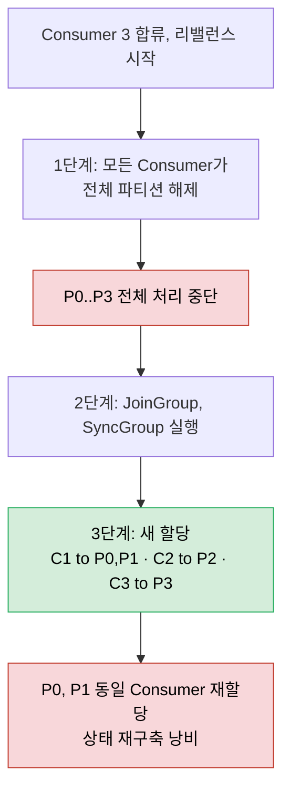
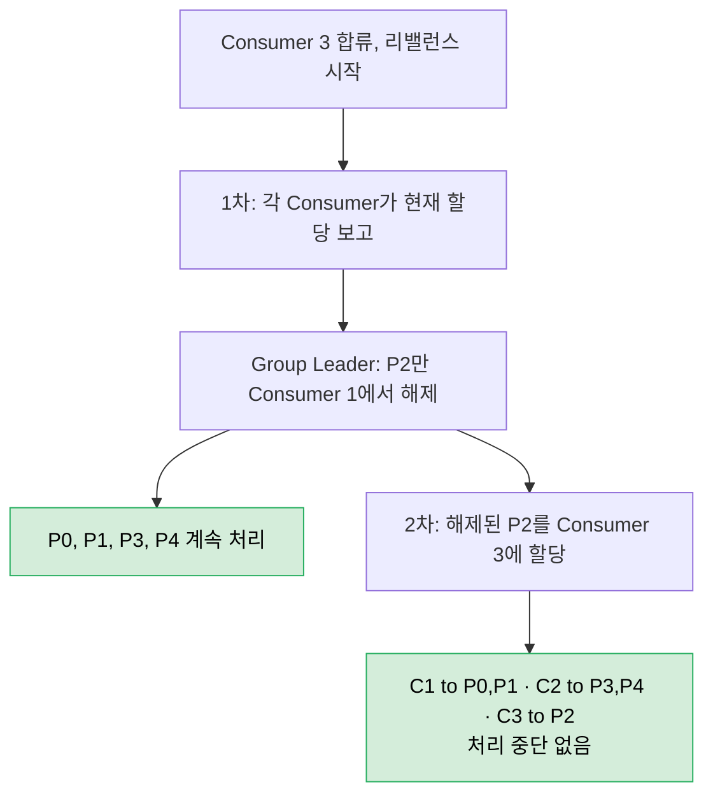

# 리밸런스 프로토콜

---

> 리밸런스는 Consumer 멤버 변경 시 *파티션을 누가 가질 것인가*를 재계산하는 과정이다. 이 과정에서 메시지 처리가 어디까지 멈추고, 무엇이 다시 시작되는가가 운영적 비용을 결정한다. Eager 프로토콜의 Stop-the-World 문제와 Cooperative Sticky가 그 비용을 어떻게 줄였는지, Static Membership이 어떻게 *불필요한* 리밸런스를 막는지 살핀다.

[인터랙티브 시각화](01-04-rebalance.html)에서 Eager 전체 해제·Cooperative 점진 해제·Static 재시작 회피의 세 흐름을 파티션 소유권 변화로 단계별로 따라갈 수 있다.


## 학습 목표

> 리밸런스의 *트리거·비용·완화 도구*를 이해해 운영에서 불필요한 리밸런스가 일어나지 않게 만든다.

이 장을 다 읽고 다음 다섯 가지에 자신 있게 답할 수 있으면 학습이 완료된다.

1. 리밸런스 트리거 네 가지(장애·합류·파티션 추가·토픽 매칭)를 말할 수 있다.
2. Eager Protocol의 Stop-the-World 문제와 Cooperative Sticky의 점진 리밸런스 차이를 설명할 수 있다.
3. Static Membership이 어떤 시나리오에서 리밸런스를 회피하는지 설명할 수 있다.
4. `session.timeout.ms`와 `max.poll.interval.ms`가 감지하는 *서로 다른 종류의 장애*를 구분할 수 있다.
5. 처리 시간별 권장 설정(빠른 처리·외부 API·배치)을 비교할 수 있다.


## 1. 리밸런스 트리거와 Stop-the-World

> 다음 상황에서 리밸런스가 발생한다.

| 트리거               | 설명                                          |
| -------------------- | --------------------------------------------- |
| **Consumer 장애**    | Heartbeat 타임아웃(`session.timeout.ms`) 초과 |
| **새 Consumer 합류** | 그룹에 새로운 Consumer 인스턴스 추가          |
| **파티션 추가**      | 구독 중인 토픽에 파티션이 추가됨              |
| **토픽 매칭**        | 와일드카드 구독 시 새 토픽이 패턴에 매칭      |

### 1.1 Stop-the-World 리밸런스의 문제

초기 리밸런스 프로토콜(Eager Protocol)은 **모든 Consumer가 모든 파티션을 해제한 후 재할당**하는 방식이었다.

```bash
# 리밸런스 전:
  Consumer 1 → P0, P1
  Consumer 2 → P2, P3

Consumer 3 합류 → 리밸런스 시작

1단계: 모든 Consumer가 파티션 해제
  Consumer 1 → (없음)  ← P0, P1 처리 중단!
  Consumer 2 → (없음)  ← P2, P3 처리 중단!

2단계: JoinGroup/SyncGroup 프로토콜 실행

3단계: 새 할당
  Consumer 1 → P0, P1  ← 상태 재구축 필요 (불필요!)
  Consumer 2 → P2
  Consumer 3 → P3

# 문제점:
  ❌ P0, P1은 같은 Consumer에 다시 할당됨 → 상태 재구축이 낭비
  ❌ 리밸런스 동안 모든 파티션의 처리가 중단됨
```

**두 가지 핵심 문제**

1. **불필요한 상태 재구축**: P0, P1은 Consumer 1에 다시 할당되지만, 상태를 이미 해제했으므로 처음부터 재구축해야 한다.
2. **전체 처리 중단**: 리밸런스 동안 모든 파티션의 메시지 처리가 멈춘다.




## 2. Cooperative Sticky Assignor (점진적 리밸런스)

> Cooperative Sticky Assignor는 **필요한 파티션만 해제하고, 나머지는 계속 처리**하는 점진적(Incremental) 리밸런스를 구현한다.

```bash
# 리밸런스 전:
  Consumer 1 → P0, P1, P2
  Consumer 2 → P3, P4

Consumer 3 합류 → 리밸런스 시작

1단계 (1차 리밸런스):
  Coordinator: "각 Consumer, 현재 할당을 보고하라"
  Consumer 1: "P0, P1, P2 보유 중"
  Consumer 2: "P3, P4 보유 중"

  Group Leader: "P2만 Consumer 1에서 해제"
  Consumer 1 → P0, P1      ← P0, P1은 계속 처리! ✅
  Consumer 2 → P3, P4      ← 계속 처리! ✅
  Consumer 3 → (대기)

2단계 (2차 리밸런스):
  Group Leader: "해제된 P2를 Consumer 3에 할당"
  Consumer 1 → P0, P1      ← 처리 중단 없음 ✅
  Consumer 2 → P3, P4      ← 처리 중단 없음 ✅
  Consumer 3 → P2           ← 새로 할당 ✅
```

**핵심 개선**: P0, P1, P3, P4의 처리가 **단 한 번도 중단되지 않았다**. P2만 잠시 해제되었다가 Consumer 3에 할당되었다.



### 2.1 Eager vs Cooperative 비교

| 기준          | Eager (Stop-the-World)  | Cooperative (Incremental) |
| ------------- | ----------------------- | ------------------------- |
| 파티션 해제   | **전체** 해제 후 재할당 | **필요한 것만** 해제      |
| 처리 중단     | 모든 파티션 중단        | 이동 대상 파티션만 중단   |
| 리밸런스 횟수 | 1회                     | 2회 (해제 → 재할당)       |
| 상태 재구축   | 불필요한 재구축 발생    | 최소화                    |
| 적합 환경     | 레거시 호환             | **프로덕션 권장**         |

### 2.2 설정 방법

```java
// Cooperative Sticky Assignor 활성화
props.put(
    "partition.assignment.strategy",
    "org.apache.kafka.clients.consumer.CooperativeStickyAssignor"
);
```


## 3. Static Group Membership

> 가장 흔한 리밸런스 원인은 **Consumer 인스턴스 재시작**(배포, 설정 변경 등)이다. Consumer가 종료되면 `LeaveGroup` 요청이 전송되어 즉시 리밸런스가 트리거되지만, 잠시 후 같은 인스턴스가 다시 돌아온다. 이 경우 리밸런스는 완전히 불필요하다.

### 3.1 해결: Static Membership

**Static Group Membership**은 각 Consumer에 고정된 `group.instance.id`를 할당하여, 재시작 시 리밸런스를 회피한다.

```java
props.put("group.instance.id", "consumer-host-1");  // 고정 ID
props.put("session.timeout.ms", "30000");            // 30초 이내 복귀 예상
```

**동작 방식**

1. Consumer가 종료되어도 **LeaveGroup 요청을 보내지 않는다**.
2. Coordinator는 `session.timeout.ms` 동안 해당 Consumer가 돌아올 것으로 기대하고 **리밸런스를 보류**한다.
3. Consumer가 타임아웃 내에 재시작하면, Coordinator는 **이전과 동일한 파티션 할당**을 반환한다.
4. 상태 재구축 없이 즉시 처리 재개.

```
Static Membership (group.instance.id="host-1"):

Consumer (host-1) 종료 → LeaveGroup 안 보냄
Coordinator: "host-1이 30초 내 돌아올 것으로 기대, 리밸런스 안 함"

15초 후 Consumer (host-1) 재시작
Consumer → Coordinator: JoinGroup (group.instance.id="host-1")
Coordinator: "host-1 돌아왔네, 같은 파티션 할당"
→ 리밸런스 없음, 상태 재구축 없음 ✅
```

### 3.2 적합한 사용 사례

| 사례                    | 적합 여부 | 이유                                        |
| ----------------------- | --------- | ------------------------------------------- |
| 롤링 배포               | 적합      | 인스턴스가 순차적으로 재시작, 빠르게 복귀   |
| 설정 변경 재시작        | 적합      | 같은 인스턴스가 같은 역할로 복귀            |
| 스케일 아웃/인          | 부적합    | 인스턴스 수 자체가 변경되므로 리밸런스 필요 |
| Kubernetes Pod 스케줄링 | 주의      | StatefulSet + 고정 ID 조합으로 활용 가능    |

### 3.3 Static Membership의 두 가지 함정

Static Membership에는 알아둬야 할 제약이 둘 있다. 첫째는 ID 충돌이다. 같은 `group.instance.id`로 두 Consumer가 그룹에 참여하면, 두 번째 Consumer는 "이미 이 ID를 가진 Consumer가 존재한다"는 에러를 받는다. static ID는 인스턴스를 고유하게 식별하는 값이므로, 배포 과정에서 옛 인스턴스가 완전히 죽기 전에 같은 ID로 새 인스턴스를 띄우면 충돌한다.

둘째는 재시작 중 처리 공백이다. static member가 종료되면 그 파티션은 `session.timeout.ms`가 지날 때까지 누구에게도 재할당되지 않는다. 그 동안 해당 파티션의 메시지는 처리되지 않고, Consumer가 마침내 재시작하면 그 사이 쌓인 메시지만큼 lag을 안고 출발한다. 그래서 static member를 쓰기 전에, 그 Consumer가 재시작 후 밀린 lag을 따라잡을 수 있는지 확신해야 한다. `session.timeout.ms`는 단순 재시작에 리밸런스가 나지 않을 만큼 높되, 진짜 다운타임에는 자동 재할당이 일어날 만큼 낮게 잡는 균형이 필요하다.


## 4. Consumer 핵심 설정

> Consumer의 안정성과 성능은 아래 파라미터에 의해 결정된다. 잘못 설정하면 불필요한 리밸런스가 반복되거나 장애 감지가 지연된다.

### 4.1 Heartbeat와 Session

| 파라미터                | 기본값       | 역할                                                         |
| ----------------------- | ------------ | ------------------------------------------------------------ |
| `session.timeout.ms`    | 45000 (45초) | 이 시간 안에 Heartbeat가 없으면 Coordinator가 Consumer를 죽은 것으로 판단하고 리밸런스 트리거 |
| `heartbeat.interval.ms` | 3000 (3초)   | Heartbeat 전송 간격. `session.timeout.ms`의 1/3 이하 권장    |

### 4.2 Poll과 처리

| 파라미터               | 기본값       | 역할                                                         |
| ---------------------- | ------------ | ------------------------------------------------------------ |
| `max.poll.interval.ms` | 300000 (5분) | `poll()` 호출 간격 최대 허용 시간. 초과하면 리밸런스         |
| `max.poll.records`     | 500          | `poll()` 한 번에 가져오는 최대 레코드 수                     |
| `fetch.min.bytes`      | 1            | 브로커가 응답 전 최소 데이터 크기. 높이면 배치 효율 증가, 지연 증가 |
| `fetch.max.wait.ms`    | 500          | `fetch.min.bytes` 미충족 시 최대 대기 시간                   |

### 4.3 session.timeout.ms vs max.poll.interval.ms

이 두 파라미터는 자주 혼동되지만 감지하는 장애 유형이 다르다.

- **session.timeout.ms**: **네트워크 레벨** 생존 확인. Heartbeat 스레드가 별도로 전송하므로, Consumer 프로세스 자체가 죽으면(`kill -9`) 이 타임아웃에 걸린다.
- **max.poll.interval.ms**: **애플리케이션 레벨** 처리 확인. 메시지 처리가 오래 걸려 `poll()`을 제때 호출하지 못하면 이 타임아웃에 걸린다.

```
시나리오: 메시지 하나를 처리하는 데 10분 걸리는 Consumer

session.timeout.ms = 45초  → Heartbeat 스레드는 별도이므로 문제 없음 ✅
max.poll.interval.ms = 5분 → poll() 간격이 10분 → 5분 초과 → 리밸런스 ❌

해결: max.poll.interval.ms를 늘리거나, max.poll.records를 줄여 배치 크기 축소
```

### 4.4 환경별 권장 설정

| 환경                      | session.timeout.ms | max.poll.interval.ms | max.poll.records |
| ------------------------- | ------------------ | -------------------- | ---------------- |
| 빠른 처리 (< 100ms/건)    | 10000              | 300000               | 500              |
| 느린 처리 (외부 API 호출) | 30000              | 600000               | 50~100           |
| Kafka Streams             | 10000              | 300000               | 500              |
| 배치 처리                 | 45000              | 900000               | 1000+            |


## 5. Rebalance Listener — 리밸런스 직전에 끼어들기

> Consumer는 파티션을 잃기 전에 마지막 offset을 커밋하거나 리소스를 정리해야 한다. `ConsumerRebalanceListener`를 `subscribe()`에 넘기면 그 시점에 직접 코드를 실행할 수 있다.

리밸런스가 일어나면 Consumer는 소유권을 잃기 전에 정리할 일이 생긴다. 곧 잃을 파티션의 마지막 처리 offset을 커밋해야 다음 owner가 어디서 시작할지 알고, 파일 핸들이나 DB 커넥션 같은 리소스도 닫아야 한다. Consumer API는 파티션이 추가·제거될 때 사용자 코드를 실행할 수 있도록, `subscribe()` 호출 시 `ConsumerRebalanceListener`를 받는다. 이 리스너에는 구현할 메서드가 셋 있다.

`onPartitionsAssigned(Collection<TopicPartition>)`는 파티션이 Consumer에 재할당된 후, 메시지 소비를 시작하기 전에 호출된다. 여기서 파티션과 함께 쓸 상태를 준비·로드하거나 필요하면 올바른 offset으로 seek한다. 여기서 하는 준비는 `max.poll.timeout.ms` 안에 반환되도록 보장해야 Consumer가 그룹에 성공적으로 합류한다.

`onPartitionsRevoked(Collection<TopicPartition>)`는 이전에 소유하던 파티션을 포기해야 할 때(리밸런스 또는 close) 호출된다. Eager 알고리즘에서는 리밸런스가 시작되기 전·소비를 멈춘 후에 호출되고, Cooperative 알고리즘에서는 리밸런스 끝에 포기할 파티션 부분집합에 대해서만 호출된다. *여기가 offset을 커밋하는 자리*다. 그래야 이 파티션을 다음에 받는 쪽이 시작점을 안다.

`onPartitionsLost(Collection<TopicPartition>)`는 Cooperative 알고리즘에서만, 그것도 파티션이 리밸런스에 의해 정상적으로 revoke되지 않고 다른 Consumer에 이미 할당된 예외적 경우에만 호출된다. 여기서는 그 파티션과 관련된 상태·리소스를 정리한다. 다만 새 owner가 이미 자기 상태를 저장했을 수 있으므로 충돌을 피하도록 신중해야 한다. 이 메서드를 구현하지 않으면 대신 `onPartitionsRevoked()`가 호출된다.

다음은 파티션을 잃기 전에 offset을 커밋하는 예다.

```java
// 리밸런스로 파티션을 잃기 전에 현재 offset을 동기 커밋
private Map<TopicPartition, OffsetAndMetadata> currentOffsets = new HashMap<>();

private class HandleRebalance implements ConsumerRebalanceListener {
    public void onPartitionsAssigned(Collection<TopicPartition> partitions) {
        // 새 파티션을 받을 때 할 일이 없으면 비워 둔다 — 바로 소비 시작
    }

    public void onPartitionsRevoked(Collection<TopicPartition> partitions) {
        // 잃기 직전 commitSync로 확실히 커밋 — 리밸런스가 이 커밋 후 진행된다
        consumer.commitSync(currentOffsets);
    }
}

// 가장 중요한 부분: subscribe에 리스너를 넘겨야 Consumer가 호출해 준다
consumer.subscribe(topics, new HandleRebalance());
```

여기서 `onPartitionsRevoked()`는 잃을 파티션뿐 아니라 전체 파티션의 offset을 커밋한다. 이미 처리된 이벤트의 offset이라 그렇게 해도 해가 없고, `commitSync()`를 써서 리밸런스가 진행되기 전에 커밋이 끝나도록 보장한다. 가장 중요한 것은 리스너를 `subscribe()`에 넘기는 일이다. 그래야 Consumer가 적절한 시점에 호출한다. 커밋 API 자체의 동작은 [01-05.오프셋 커밋 API](01-05.오프셋%20커밋%20API.md)에서 다룬다.


## 6. 면접 대비 Q&A

> 면접에서 자주 나오는 형태로 5개. 답을 보지 않고 먼저 입으로 답해 본 뒤 비교한다.

### Q1. Stop-the-World 리밸런스의 두 가지 핵심 비용은?

첫째, *불필요한 상태 재구축*. 리밸런스 후에도 같은 Consumer에 같은 파티션이 다시 할당되는 경우가 흔한데, Eager는 일단 모두 해제하므로 그 Consumer가 보유했던 State Store·로컬 캐시·offset 메모리를 처음부터 다시 만들어야 한다. 둘째, *전체 처리 중단*. 한 명의 Consumer가 합류·이탈했을 뿐인데 모든 파티션의 메시지 처리가 멈춘다. Cooperative Sticky는 이 두 비용을 *이동 대상 파티션*에만 한정시켜 운영 영향을 크게 줄인다.

### Q2. Cooperative Sticky의 "두 번의 리밸런스"가 오히려 좋은 이유는?

첫 번째 리밸런스에서는 *이동해야 할 파티션을 식별하고 해제만 한다*. 다른 파티션은 그대로 처리가 계속된다. 두 번째 리밸런스에서 해제된 파티션을 새 Consumer에 할당한다. 총 두 번이지만 *해제된 그 파티션에만* 처리 공백이 생기고, 다른 모든 파티션은 영향이 없다. Eager는 한 번의 리밸런스로 끝나지만 그 한 번에 모든 파티션이 멈춰서 결과적으로 더 비싸다.

### Q3. Static Membership을 켜면 절대 안 되는 경우는?

스케일 아웃/인이 잦거나 인스턴스 정체성이 자주 바뀌는 환경이다. 인스턴스가 사라지는 것이 *영구적*인데도 `LeaveGroup`을 안 보내므로 Coordinator가 `session.timeout.ms`만큼 헛되이 기다리고, 그 시간 동안 그 인스턴스의 파티션은 처리되지 않는다. 또 일시 장애·롱 GC가 잦은 환경에서는 `session.timeout.ms`를 크게 잡아야 하는데, 이 자체가 실제 장애 감지를 늦춘다. Static은 *동일 인스턴스가 빠르게 복귀하는* 시나리오(롤링 배포, 설정 변경 재시작)에만 가치 있다.

### Q4. `session.timeout.ms`와 `max.poll.interval.ms`를 모두 늘리면 안 되는 이유는?

`session.timeout.ms`는 *네트워크/프로세스 생존* 확인이고, `max.poll.interval.ms`는 *애플리케이션 처리 진행* 확인이다. 둘 다 크게 늘리면 *실제 장애 감지가 그만큼 늦어진다*. `kill -9`로 죽은 Consumer를 30초 만에 감지할 수 있는데 5분까지 늘리면 그 5분 동안 해당 파티션이 처리되지 않는다. 보통은 처리 시간에 맞춰 `max.poll.interval.ms`만 늘리고 `session.timeout.ms`는 짧게 유지하거나, `max.poll.records`를 줄여 배치당 처리 시간을 5분 안으로 묶는다.

### Q5. 외부 API 호출이 평균 5초인 Consumer에서 어떤 설정을 잡아야 하나?

배치당 처리 시간이 평균 5초 × `max.poll.records`만큼이라는 점이 출발점이다. `max.poll.records=50`이면 250초, `max.poll.records=100`이면 500초가 된다. 후자라면 `max.poll.interval.ms=600000`(10분)로 여유를 둬야 리밸런스를 안 부른다. `session.timeout.ms`는 별개라 30~45초로 두고 `heartbeat.interval.ms`는 그 1/3 정도. 더 안전한 패턴은 `max.poll.records`를 50~100으로 줄이고 Cooperative Sticky로 묶어 리밸런스 시에도 처리 공백을 최소화하는 것이다.


## 7. 관련 문서

- [인터랙티브 시각화](01-04-rebalance.html) — Eager·Cooperative·Static 세 시나리오를 파티션 소유권 변화로 단계별 재생
- [01-01.메시지 큐 아키텍처](01-01.메시지%20큐%20아키텍처.md) — 파티션 추상 위에서 리밸런스가 동작
- [01-03.Consumer Group](01-03.Consumer%20Group.md) — JoinGroup/SyncGroup의 기본 흐름
- [03-04.Exactly-once 의미론과 Consumer Idempotency](../05_ConsistencyPattern/03-04.Exactly-once%20의미론과%20Consumer%20Idempotency.md) — 리밸런스 중 오프셋 처리
- [01-01.Kafka Streams](../06_StreamProcessing/01-01.Kafka%20Streams.md) — State Store 재구축 비용이 가장 큰 환경


## 참고

- [Confluent: Consumer Group Protocol](https://developer.confluent.io/courses/architecture/consumer-group-protocol/)
- [KIP-429: Kafka Consumer Incremental Rebalance Protocol](https://cwiki.apache.org/confluence/display/KAFKA/KIP-429)
- [KIP-345: Static Membership](https://cwiki.apache.org/confluence/display/KAFKA/KIP-345)
