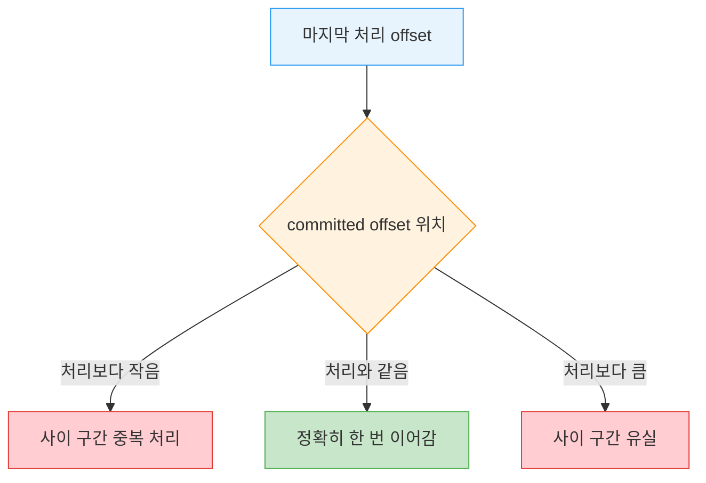
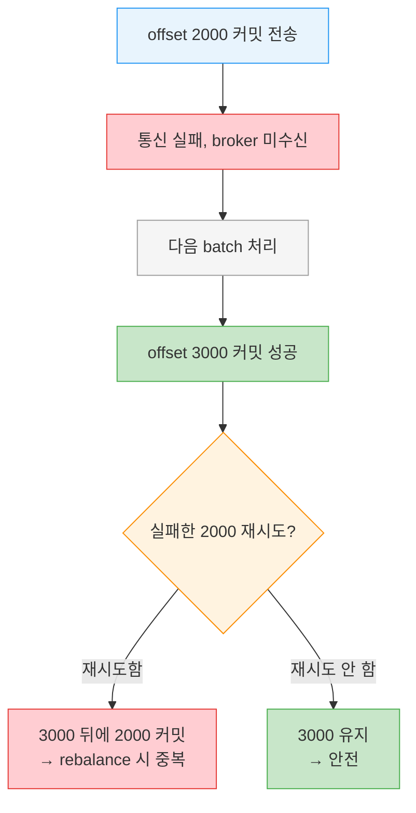

# 오프셋 커밋 API


> [01-03.Consumer Group](01-03.Consumer%20Group.md) §6이 오프셋이 *어디에* 저장되는지를 다뤘다면, 이 글은 그 오프셋을 *어떻게* 커밋하느냐를 다룹니다. 같은 "커밋"이라도 자동·동기·비동기 중 무엇을 고르느냐에 따라 중복·유실의 폭과 처리량이 달라집니다. Kafka가 JMS처럼 메시지마다 ack를 추적하지 않고 consumer가 직접 위치(offset)를 관리하기 때문에, 이 선택은 신뢰성의 핵심입니다.

[인터랙티브 시각화](01-05-offset-commit.html)에서 자동 커밋의 5초 빈틈·commitAsync 순서 경쟁·종료 직전 sync 커밋이 만드는 중복과 안전을 단계별로 따라갈 수 있습니다.


## 학습 목표

> offset 커밋이 중복·유실을 만드는 방향을 설명하고, 자동·commitSync·commitAsync·지정 offset 커밋의 trade-off를 골라 쓸 수 있는 것이 이 장의 목표입니다.

이 장을 다 읽고 다음 다섯 가지에 자신 있게 답할 수 있으면 학습이 완료됩니다.

1. committed offset이 처리 위치보다 작거나 클 때 각각 무엇이 일어나는지 설명할 수 있습니다.
2. 자동 커밋의 5초 윈도우가 만드는 중복을 설명할 수 있습니다.
3. commitSync와 commitAsync의 재시도 동작 차이와 그 이유를 말할 수 있습니다.
4. commitAsync의 순서 문제와 시퀀스 번호 가드를 설명할 수 있습니다.
5. batch 중간에 특정 offset을 커밋하는 방법과 그때 커밋할 값을 말할 수 있습니다.


## 1. 커밋은 중복과 유실을 가른다

> committed offset이 실제 처리 위치와 어긋나면, 작으면 중복·크면 유실이 생깁니다. 커밋 관리가 클라이언트 신뢰성에 직접 영향을 주는 이유입니다.

Kafka는 전통적 메시지 큐와 다르게 레코드를 개별로 커밋하지 않습니다. consumer는 파티션에서 *마지막으로 성공 처리한 메시지*를 커밋하고, 그 이전은 전부 성공했다고 암묵적으로 가정합니다. 커밋은 `__consumer_offsets` 토픽에 파티션별 위치를 기록하는 동작입니다(저장 메커니즘 상세는 [01-03 §6](01-03.Consumer%20Group.md)).

문제는 rebalance 때 드러납니다. consumer가 크래시하거나 새 consumer가 합류하면 파티션이 재배정되고, 새 owner는 마지막 committed offset부터 이어 읽습니다. 이때 committed offset과 실제 처리 위치가 어긋나 있으면 두 가지 사고가 납니다.

| 어긋남 | 결과 | 상황 |
|--------|------|------|
| committed < 마지막 처리 offset | 사이 메시지 **중복 처리** | 처리는 했는데 커밋 전에 크래시 |
| committed > 마지막 처리 offset | 사이 메시지 **유실** | 처리 전에 커밋이 앞서감 |

이 방향성을 그림으로 보면 커밋 시점을 왜 신중히 골라야 하는지가 분명해집니다.



> 💬 **비유**: offset 커밋은 책에 끼우는 책갈피와 같습니다. 읽은 곳보다 앞에 끼우면(committed < 처리) 다음에 펼 때 읽은 부분을 또 읽고, 읽은 곳보다 뒤에 끼우면(committed > 처리) 안 읽은 부분을 건너뜁니다. 이 비유는 "위치를 한 군데만 표시한다"까지 유효하지만, 책갈피는 한 권에 하나인 반면 consumer는 파티션마다 따로 offset을 들고 있다는 점에서 단순화된 것입니다.

이 글에서는 기본 동작을 가리킬 때 "마지막 offset을 커밋한다"고 적습니다. 정확히는 poll()이 반환한 마지막 offset보다 1 큰 값(다음에 읽을 위치)을 커밋하지만, 99%의 경우 이 구분은 중요하지 않습니다. 다만 특정 offset을 직접 다룰 때는 이 점을 기억해야 합니다(§5).


## 2. 자동 커밋 — 편하지만 5초의 빈틈

> `enable.auto.commit=true`면 poll 루프가 5초마다 자동 커밋합니다. 편하지만 크래시 시 마지막 커밋 이후 처리분이 중복됩니다.

가장 쉬운 커밋은 consumer에게 맡기는 것입니다. `enable.auto.commit=true`로 두면 5초마다(`auto.commit.interval.ms` 기본값) poll()이 받은 최신 offset을 커밋합니다. 다른 모든 것처럼 자동 커밋도 poll 루프가 구동합니다. poll할 때마다 consumer는 커밋할 시점인지 확인하고, 그렇다면 직전 poll이 반환한 offset을 커밋합니다.

편리함에는 대가가 따릅니다. 커밋 직후 3초 시점에 consumer가 크래시했다고 해봅니다. rebalance 후 생존 consumer는 크래시한 consumer의 파티션을 넘겨받아 마지막 committed offset부터 소비합니다. 그런데 그 offset은 3초 전 것이므로, 그 3초 동안 도착한 이벤트는 전부 두 번 처리됩니다. 커밋 간격을 줄여 윈도우를 좁힐 수는 있어도 중복을 완전히 없앨 수는 없습니다.

또 하나 주의할 점이 있습니다. 자동 커밋은 다음 poll에서 *직전 poll이 반환한* 마지막 offset을 커밋하는데, 실제로 어떤 이벤트가 처리됐는지는 모릅니다. 그래서 **poll()을 다시 호출하기 전에 직전 poll이 반환한 이벤트를 전부 처리하는 것이 필수**입니다(close()도 자동으로 커밋합니다). 보통은 문제없지만, 예외를 처리하거나 poll 루프를 중간에 빠져나갈 때 주의해야 합니다.


## 3. commitSync — 블록하고 재시도한다

> `enable.auto.commit=false` + `commitSync()`는 가장 단순·신뢰 높은 커밋입니다. broker 응답까지 블록하고, 복구 불가 에러 전까지 재시도합니다.

대부분의 개발자는 커밋 시점을 타이머가 아니라 애플리케이션 로직에 맞춰 직접 통제합니다. 누락 가능성을 없애고 rebalance 중복을 줄이기 위해서입니다. `enable.auto.commit=false`로 두면 앱이 명시적으로 선택한 시점에만 커밋됩니다.

가장 단순하고 신뢰할 수 있는 API가 `commitSync()`입니다. poll()이 반환한 최신 offset을 커밋하고, 커밋이 끝날 때까지 기다린 뒤 반환하며, 실패하면 예외를 던집니다. 다음은 batch를 다 처리한 뒤 커밋하는 코드입니다.

```java
// commitSync로 batch 처리 후 커밋
Duration timeout = Duration.ofMillis(100);

while (true) {
    ConsumerRecords<String, String> records = consumer.poll(timeout);
    for (ConsumerRecord<String, String> record : records) {
        // 여기서는 출력을 '처리 완료'로 간주 — 실제로는 변환·집계·저장 등
        System.out.printf("offset = %d, key = %s, value = %s%n",
            record.offset(), record.key(), record.value());
    }
    try {
        // batch를 다 처리한 뒤, 다음 poll 전에 마지막 offset 커밋
        consumer.commitSync();
    } catch (CommitFailedException e) {
        // 복구 불가 에러는 로깅 외에 할 수 있는 게 많지 않다
        log.error("commit failed", e);
    }
}
```

기억할 점은 `commitSync()`가 *poll()이 반환한 마지막 offset*을 커밋한다는 것입니다. 그래서 컬렉션의 레코드를 다 처리하기 전에 호출하면, 커밋은 됐지만 처리 안 된 메시지를 놓칠 위험이 있습니다. 반대로 처리 도중 크래시하면 최근 batch의 처음부터 rebalance 시점까지가 중복 처리됩니다. 어느 쪽이 나은지는 유스케이스가 정합니다. commitSync는 복구 불가 에러 전까지 커밋을 재시도하므로, 그런 에러가 나면 로깅 말고는 할 일이 없습니다.


## 4. commitAsync — 빠르지만 재시도하지 않는다

> `commitAsync()`는 응답을 안 기다려 처리량이 높지만, 재시도하지 않습니다. 늦게 도착한 재시도가 더 새 커밋을 덮어 중복을 만들 수 있기 때문입니다.

수동 커밋의 단점은 broker 응답까지 앱이 블록되어 처리량이 제한된다는 것입니다. 덜 자주 커밋하면 처리량은 오르지만 rebalance 시 중복이 늘어납니다. 다른 선택지가 `commitAsync()`입니다. broker 응답을 기다리지 않고 요청만 보낸 뒤 계속 진행합니다.

```java
// commitAsync로 응답을 기다리지 않고 커밋
Duration timeout = Duration.ofMillis(100);

while (true) {
    ConsumerRecords<String, String> records = consumer.poll(timeout);
    for (ConsumerRecord<String, String> record : records) {
        System.out.printf("offset = %d, key = %s, value = %s%n",
            record.offset(), record.key(), record.value());
    }
    // 마지막 offset을 커밋하고 응답을 기다리지 않는다
    consumer.commitAsync();
}
```

핵심 차이는 재시도입니다. commitSync는 성공하거나 복구 불가 실패를 만날 때까지 재시도하지만, **commitAsync는 재시도하지 않습니다**. 이유가 중요합니다. commitAsync가 응답을 받을 즈음이면 이미 더 늦은 커밋이 성공했을 수 있기 때문입니다.

offset 2000 커밋을 보냈는데 일시적 통신 문제로 broker가 요청을 못 받았다고 해봅니다. 그 사이 다음 batch를 처리해 offset 3000을 성공적으로 커밋했습니다. 만약 commitAsync가 실패한 2000 커밋을 지금 재시도하면, 이미 3000이 커밋된 뒤에 2000을 커밋해 버립니다. rebalance가 일어나면 이는 더 많은 중복을 부릅니다.



commitAsync는 broker 응답 시 트리거되는 콜백을 받을 수 있습니다. 보통은 커밋 에러를 로깅하거나 메트릭으로 세는 데 씁니다. 콜백을 재시도에 쓰려면 위 순서 문제를 인지해야 합니다.

```java
// commitAsync에 콜백을 넘겨 실패를 로깅
consumer.commitAsync(new OffsetCommitCallback() {
    @Override
    public void onComplete(Map<TopicPartition, OffsetAndMetadata> offsets, Exception e) {
        // 커밋이 실패하면 실패와 offset을 로깅한다 (재시도는 하지 않는다)
        if (e != null) {
            log.error("Commit failed for offsets {}", offsets, e);
        }
    }
});
```

### 4.1 콜백으로 안전하게 재시도하기

비동기 커밋을 재시도하면서 순서를 지키는 단순한 패턴은 단조 증가하는 시퀀스 번호입니다. 커밋할 때마다 번호를 올리고, 커밋 시점의 번호를 콜백에 함께 넘깁니다. 재시도를 보내기 전에 콜백이 받은 시퀀스 번호가 현재 인스턴스 변수와 같은지 확인합니다. 같으면 더 새 커밋이 없었다는 뜻이므로 재시도해도 안전합니다. 인스턴스 번호가 더 높으면 이미 더 새 커밋이 나갔으므로 재시도하지 않습니다.


## 5. 동기와 비동기를 함께 — 종료 직전엔 sync

> 평소엔 빠른 commitAsync를 쓰고, 종료·rebalance 직전 마지막 커밋만 commitSync로 확실히 성공시킵니다.

평소에 가끔 커밋이 실패해도 큰 문제가 아닙니다. 일시적이라면 다음 커밋이 재시도 역할을 해주기 때문입니다. 그러나 종료 직전이거나 rebalance 직전 마지막 커밋이라면, "다음 커밋"이 없으므로 반드시 성공시켜야 합니다. 그래서 흔한 패턴이 평소 `commitAsync()`와 종료 직전 `commitSync()`를 결합하는 것입니다.

```java
// 평소 async, 종료 직전 sync
Duration timeout = Duration.ofMillis(100);
try {
    while (!closing) {
        ConsumerRecords<String, String> records = consumer.poll(timeout);
        for (ConsumerRecord<String, String> record : records) {
            System.out.printf("offset = %d, key = %s, value = %s%n",
                record.offset(), record.key(), record.value());
        }
        // 평소엔 빠른 async — 한 번 실패해도 다음 커밋이 재시도가 된다
        consumer.commitAsync();
    }
    // 닫을 땐 '다음 커밋'이 없으니 sync로 성공/복구불가까지 재시도
    consumer.commitSync();
} catch (Exception e) {
    log.error("Unexpected error", e);
} finally {
    consumer.close();
}
```

rebalance 직전 커밋은 [01-04.리밸런스 프로토콜](01-04.리밸런스%20프로토콜.md)의 rebalance listener에서 다룹니다.


## 6. 지정 offset 커밋 — batch 중간에 커밋하기

> 큰 batch를 다 처리하기 전에 중간에서 커밋하려면, partition·offset 맵을 commitSync/commitAsync에 직접 넘깁니다. 이때 커밋값은 다음에 읽을 offset(처리한 것+1)입니다.

마지막 offset만 커밋하면 batch 처리를 끝낸 시점에만 커밋할 수 있습니다. 그런데 poll()이 큰 batch를 반환했고 중간에서 커밋하고 싶다면 어떻게 할까요? 그냥 `commitSync()`나 `commitAsync()`를 부르면 아직 처리 못 한 마지막 offset을 커밋해 버립니다.

다행히 Consumer API는 커밋할 partition과 offset의 맵을 인자로 받는 `commitSync()`·`commitAsync()`를 제공합니다. topic "customers"의 partition 3에서 마지막으로 받은 메시지의 offset이 5000이면, partition 3에 5001을 커밋합니다. consumer가 여러 파티션을 소비할 수 있으므로 전부 추적해야 하고, 이는 코드 복잡도를 올립니다.

```java
// 지정 offset 커밋 — 1000개마다 현재까지의 offset 커밋
private Map<TopicPartition, OffsetAndMetadata> currentOffsets = new HashMap<>();
int count = 0;
Duration timeout = Duration.ofMillis(100);

while (true) {
    ConsumerRecords<String, String> records = consumer.poll(timeout);
    for (ConsumerRecord<String, String> record : records) {
        System.out.printf("offset = %d, key = %s, value = %s%n",
            record.offset(), record.key(), record.value());
        // 커밋값은 '다음에 읽을' offset이므로 처리한 offset + 1
        currentOffsets.put(
            new TopicPartition(record.topic(), record.partition()),
            new OffsetAndMetadata(record.offset() + 1, "no metadata"));
        // 1000개마다 현재까지의 offset을 커밋 (시간·내용 기준도 가능)
        if (count % 1000 == 0) {
            consumer.commitAsync(currentOffsets, null);
        }
        count++;
    }
}
```

여기서 가장 중요한 점은 커밋하는 값이 **다음에 읽을 메시지의 offset**, 즉 처리한 offset에 1을 더한 값이라는 것입니다(§1에서 말한 기본 동작과 같은 이유입니다). 위 예는 `commitAsync()`를 콜백 없이 썼지만(두 번째 인자 null) `commitSync()`도 똑같이 유효합니다. 물론 지정 offset을 커밋할 때도 앞에서 본 에러 처리는 그대로 필요합니다.


## 7. 실무 적용

> 처리 보장 수준과 처리량 요구로 커밋 전략을 고릅니다. (이 절은 원문 §4.8의 API들을 선택 기준으로 재구성한 보조 설명입니다.)

커밋 전략 선택은 "이 메시지를 두 번 처리해도 되는가"와 "처리량이 얼마나 중요한가"로 좁혀집니다. 자동 커밋은 손이 가장 덜 가지만 5초 윈도우 중복을 받아들여야 하므로, 멱등 처리가 보장되거나 약간의 중복이 무방한 경우에 맞습니다. 정확한 처리 보장이 필요하면 수동 커밋으로 넘어가, 평소 commitAsync로 처리량을 지키고 종료 직전 commitSync로 마지막을 확실히 합니다.

상황별 선택을 정리하면 다음과 같습니다.

| 상황 | 전략 | 이유 |
|------|------|------|
| 약간의 중복 무방·멱등 처리 | 자동 커밋 | 가장 단순, 5초 윈도우 중복 허용 |
| 정확한 처리 보장·높은 처리량 | 평소 async + 종료 sync | 처리량과 마지막 안전 동시 확보 |
| 큰 batch 중간 진척 보존 | 지정 offset 커밋 | rebalance 시 재처리량 축소 |

> ⚠️ **주의**: 중복을 완전히 없애려는 시도는 커밋 전략만으로는 한계가 있습니다. rebalance 윈도우 안의 중복은 줄일 수는 있어도 제거할 수 없으므로, 소비 측 멱등성을 함께 설계해야 합니다(상세는 [03-04.Exactly-once 의미론과 Consumer Idempotency](../05_ConsistencyPattern/03-04.Exactly-once%20의미론과%20Consumer%20Idempotency.md)).


## 8. 면접 대비 Q&A

> 답을 보지 않고 먼저 입으로 답해 본 뒤 비교해 보면 좋습니다.

### Q1. committed offset이 처리 위치와 어긋나면 무엇이 일어나나요?

committed가 마지막 처리 offset보다 작으면 그 사이 메시지가 중복 처리되고, 크면 그 사이 메시지가 유실됩니다. 작은 경우는 처리는 했는데 커밋 전에 크래시한 상황, 큰 경우는 처리 전에 커밋이 앞서간 상황입니다. 그래서 커밋 시점 관리가 클라이언트 신뢰성에 직접 영향을 줍니다.

### Q2. 자동 커밋의 중복은 왜 생기나요?

`enable.auto.commit=true`면 5초마다 직전 poll이 반환한 offset을 커밋합니다. 커밋 직후 3초 시점에 크래시하면, rebalance 후 생존 consumer가 3초 전 committed offset부터 다시 읽어 그 3초 이벤트를 중복 처리합니다. 간격을 줄여 윈도우는 좁힐 수 있어도 중복을 완전히 없앨 수는 없습니다.

### Q3. commitSync와 commitAsync의 재시도 차이와 그 이유는?

commitSync는 성공하거나 복구 불가 실패 전까지 재시도하지만, commitAsync는 재시도하지 않습니다. 이유는 commitAsync가 응답을 받을 즈음 이미 더 늦은 커밋이 성공했을 수 있기 때문입니다. 실패한 옛 커밋을 재시도하면 더 새 커밋을 덮어 rebalance 시 중복을 부릅니다.

### Q4. commitAsync 콜백으로 안전하게 재시도하려면?

단조 증가 시퀀스 번호를 씁니다. 커밋마다 번호를 올리고 커밋 시점 번호를 콜백에 넘긴 뒤, 재시도 전 콜백 번호가 현재 인스턴스 번호와 같은지 확인합니다. 같으면 더 새 커밋이 없으니 안전하게 재시도하고, 인스턴스 번호가 더 높으면 이미 새 커밋이 나갔으므로 재시도하지 않습니다.

### Q5. batch 중간에 커밋할 때 커밋하는 값은 무엇인가요?

다음에 읽을 메시지의 offset, 즉 처리한 offset에 1을 더한 값입니다. partition·offset 맵을 만들어 `commitSync()`나 `commitAsync()`에 넘기며, 여러 파티션을 소비하면 전부 추적해야 합니다. partition 3의 마지막 처리 offset이 5000이면 5001을 커밋합니다.


## 9. 관련 문서

- [인터랙티브 시각화](01-05-offset-commit.html) — 자동 커밋 빈틈·commitAsync 순서 경쟁·async+sync 종료를 단계별로 재생
- [01-03.Consumer Group](01-03.Consumer%20Group.md) — `__consumer_offsets` 저장 메커니즘과 auto.offset.reset
- [01-04.리밸런스 프로토콜](01-04.리밸런스%20프로토콜.md) — rebalance listener에서 커밋하는 패턴
- [03-04.Exactly-once 의미론과 Consumer Idempotency](../05_ConsistencyPattern/03-04.Exactly-once%20의미론과%20Consumer%20Idempotency.md) — 커밋으로 못 막는 중복의 소비 측 방어
