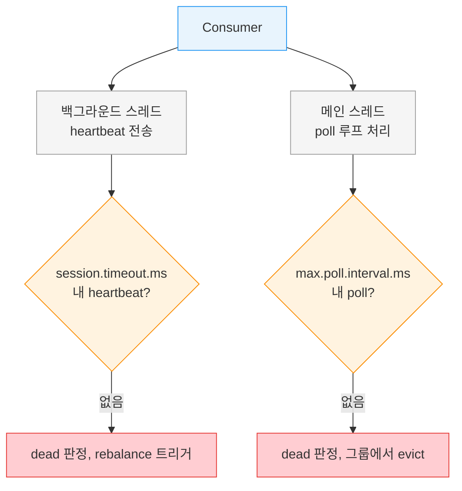
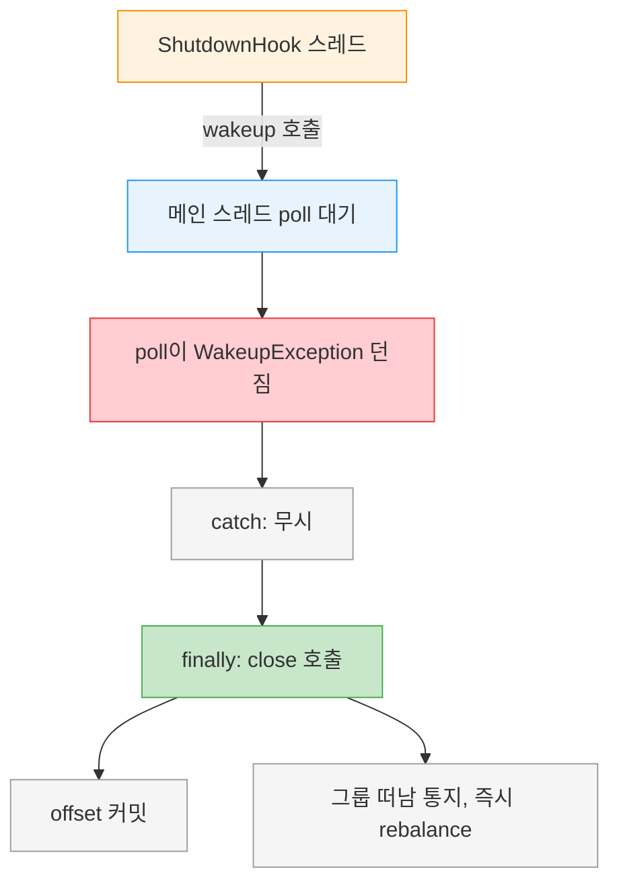

# Consumer poll 루프와 종료


> [01-03.Consumer Group](01-03.Consumer%20Group.md)이 poll의 *역할*을 시퀀스로 보여줬다면, 이 글은 그 poll을 감싸는 *루프*와 그 루프를 안전하게 빠져나가는 법을 다룹니다. consumer는 계속 poll해야 살아 있는 것으로 간주되는데, 그래서 한 스레드에 하나만 둬야 하고, 종료할 때도 함부로 멈출 수 없습니다. 무한 루프를 어떻게 시작하고, 중간에 어떤 offset부터 읽고, 어떻게 깔끔히 끝내는지가 이 장의 주제입니다.


## 학습 목표

> poll 루프가 데이터 외에 무엇을 처리하는지, consumer를 왜 1스레드 1개로 두는지, 그리고 wakeup으로 어떻게 깨끗이 종료하는지를 설명할 수 있는 것이 이 장의 목표입니다.

이 장을 다 읽고 다음 다섯 가지에 자신 있게 답할 수 있으면 학습이 완료됩니다.

1. poll()이 데이터 수신 외에 처리하는 일을 나열할 수 있습니다.
2. consumer가 dead로 판정되는 두 경로(heartbeat, max.poll.interval.ms)를 구분할 수 있습니다.
3. "1 consumer per thread" 규칙과 다중 consumer 실행 방법을 설명할 수 있습니다.
4. seek 계열 API로 특정 위치부터 읽는 방법을 말할 수 있습니다.
5. wakeup()으로 poll 루프를 안전하게 종료하는 절차를 설명할 수 있습니다.


## 1. poll 루프 — 계속 호출해야 산다

> Consumer API의 심장은 `poll(timeout)`을 도는 무한 루프입니다. poll을 멈추면 consumer는 dead로 간주되어 파티션을 빼앗깁니다.

Consumer API의 핵심은 서버에 더 많은 데이터를 요청하는 단순한 루프입니다. consumer 본문은 보통 다음처럼 생겼습니다.

```java
// poll 루프 — consumer는 장기 실행되며 계속 폴링한다
Duration timeout = Duration.ofMillis(100);

while (true) {
    // 버퍼에 데이터가 없으면 timeout만큼 블록, 있으면 즉시 반환
    ConsumerRecords<String, String> records = consumer.poll(timeout);

    for (ConsumerRecord<String, String> record : records) {
        // record는 topic·partition·offset·key·value를 담는다
        System.out.printf("topic = %s, partition = %d, offset = %d, key = %s, value = %s%n",
            record.topic(), record.partition(), record.offset(),
            record.key(), record.value());
        // 실제로는 여기서 데이터스토어에 저장하거나 집계한다
    }
}
```

이것은 무한 루프입니다. consumer는 보통 장기 실행 애플리케이션으로, 계속 Kafka에 더 많은 데이터를 폴링합니다(깨끗이 빠져나가는 법은 §5).

여기서 가장 중요한 사실이 있습니다. 상어가 계속 헤엄쳐야 죽지 않듯, consumer는 계속 Kafka를 poll해야 살아 있는 것으로 간주됩니다. poll을 멈추면 dead로 판정되어, 소비하던 파티션이 그룹 내 다른 consumer에게 넘어갑니다. poll()에 넘기는 파라미터는 timeout으로, 버퍼에 데이터가 없을 때 얼마나 블록할지를 정합니다. 0이거나 이미 레코드가 있으면 즉시 반환하고, 아니면 지정한 밀리초만큼 기다립니다.

> 💬 **비유**: poll 루프는 계속 헤엄쳐야 사는 상어와 같습니다(원문이 직접 드는 비유입니다). 멈추는 순간 죽은 것으로 간주되어 자리를 내줍니다. 이 비유는 "정지=죽음"이라는 긴박함까지 유효하지만, 상어는 정말 죽는 반면 consumer는 다시 poll을 시작하면 그룹에 재합류할 수 있다는 점에서 단순화된 것입니다.


## 2. poll은 데이터만 가져오지 않는다

> 첫 poll은 GroupCoordinator를 찾고 그룹에 합류해 파티션을 할당받습니다. rebalance와 리스너 콜백도 poll 안에서 돕니다. 그래서 consumer의 거의 모든 문제가 poll()의 예외로 표출됩니다.

poll 루프는 단순히 데이터를 가져오는 것보다 훨씬 많은 일을 합니다. 새 consumer로 처음 poll()을 호출하면, GroupCoordinator를 찾고, 그룹에 합류하고, 파티션 할당을 받는 책임을 poll이 집니다. rebalance가 트리거되면 그것도 관련 콜백을 포함해 poll 루프 안에서 처리됩니다.

이 설계의 함의가 중요합니다. consumer나 리스너 콜백에서 잘못될 수 있는 거의 모든 것이 poll()이 던지는 예외로 표출됩니다. 그래서 poll() 호출을 예외 관점에서 다루는 것이 consumer 디버깅의 출발점입니다.

여기에 한 가지 제약이 더 있습니다. poll()을 `max.poll.interval.ms`보다 오래 호출하지 않으면 consumer는 dead로 판정되어 그룹에서 쫓겨납니다(evict). 그러므로 poll 루프 안에서 예측 불가능한 시간 동안 블록될 수 있는 작업은 피해야 합니다. consumer가 dead로 판정되는 두 경로를 그림으로 정리하면 다음과 같습니다.



이 그림이 보여주는 핵심은 heartbeat와 poll이 *다른 스레드*에서 돈다는 것입니다. 메인 스레드가 무거운 처리로 막혀 있어도 백그라운드 heartbeat는 계속 나갈 수 있어, "살아 있다고 보고되는데 실제로는 레코드를 처리하지 못하는" 상황이 생깁니다. `max.poll.interval.ms`는 바로 이 경우를 잡는 fail-safe입니다(설정 상세는 [01-04.리밸런스 프로토콜](01-04.리밸런스%20프로토콜.md)).


## 3. 스레드 안전 — 1 consumer per thread

> 한 스레드에 같은 그룹의 consumer 여럿을 둘 수 없고, 여러 스레드가 한 consumer를 공유할 수도 없습니다. consumer 하나에 스레드 하나가 규칙입니다.

KafkaConsumer는 스레드 안전하지 않습니다. 한 스레드에서 같은 그룹에 속한 여러 consumer를 가질 수 없고, 여러 스레드가 같은 consumer를 안전하게 쓸 수도 없습니다. 규칙은 단순합니다. **consumer 하나당 스레드 하나**입니다.

한 애플리케이션에서 같은 그룹의 여러 consumer를 돌리려면 각각 자기 스레드에서 실행해야 합니다. consumer 로직을 자체 객체로 감싼 뒤 Java의 `ExecutorService`로 스레드별 consumer를 시작하는 방식이 유용합니다. 또 다른 패턴은 consumer 하나가 이벤트 큐를 채우고, 여러 worker 스레드가 그 큐에서 작업을 처리하는 것입니다.

### 3.1 poll(long)에서 poll(Duration)으로

구버전 Kafka의 `poll(long)` 시그니처는 deprecated되었고, 새 API는 `poll(Duration)`입니다. 인자 타입 변경 외에 블록 방식의 의미도 미묘하게 달라졌습니다. 원래의 `poll(long)`은 Kafka에서 필요한 메타데이터를 얻을 때까지, 그 시간이 timeout보다 길더라도 블록합니다. 새 `poll(Duration)`은 timeout 제약을 지키고 메타데이터를 기다리지 않습니다.

그래서 메타데이터를 강제로 가져오려고 `poll(0)`을 쓰던 흔한 핵은 `poll(Duration.ofMillis(0))`으로 그대로 바꿔서는 같은 동작을 얻지 못합니다. 대개 해법은 그 로직을 `rebalanceListener.onPartitionsAssigned()`에 두는 것입니다. 이 메서드는 할당된 파티션의 메타데이터를 확보한 뒤, 레코드가 도착하기 전에 호출되도록 보장됩니다(rebalance listener는 [01-04.리밸런스 프로토콜](01-04.리밸런스%20프로토콜.md)).


## 4. 특정 offset부터 읽기 — seek

> poll은 마지막 committed offset부터 읽지만, seek 계열 API로 처음·끝·특정 시각·특정 offset부터 시작할 수 있습니다.

지금까지 본 poll()은 각 파티션의 마지막 committed offset부터 소비를 시작해 순서대로 진행합니다. 그러나 때로는 다른 offset부터 읽고 싶을 때가 있습니다. Kafka는 다음 poll()이 다른 offset에서 시작하도록 하는 여러 메서드를 제공합니다.

- `seekToBeginning(Collection<TopicPartition>)`: 파티션 처음부터 모든 메시지를 읽습니다.
- `seekToEnd(Collection<TopicPartition>)`: 끝으로 건너뛰어 새 메시지만 읽습니다.
- `seek(TopicPartition, offset)`: 특정 offset으로 위치를 옮깁니다.

`seek()`은 다양하게 쓰입니다. 시간 민감한 애플리케이션이 뒤처질 때 몇 레코드 건너뛰거나, 파일에 데이터를 쓰는 consumer가 파일을 잃었을 때 특정 시점으로 되돌려 복구하는 식입니다. 특정 시각의 offset을 찾으려면 `offsetsForTimes()`로 timestamp에 해당하는 offset을 조회한 뒤 그 offset으로 seek합니다.

```java
// 1시간 전 시점의 offset으로 모든 파티션을 되돌린다
Long oneHourEarlier = Instant.now().atZone(ZoneId.systemDefault())
        .minusHours(1).toEpochSecond();

// 할당된 모든 파티션을 같은 timestamp에 매핑
Map<TopicPartition, Long> partitionTimestampMap = consumer.assignment().stream()
        .collect(Collectors.toMap(tp -> tp, tp -> oneHourEarlier));

// broker의 timestamp 인덱스로 그 시점의 offset 조회
Map<TopicPartition, OffsetAndTimestamp> offsetMap =
        consumer.offsetsForTimes(partitionTimestampMap);

// 각 파티션을 조회된 offset으로 이동 — 다음 poll부터 그 위치에서 소비
for (Map.Entry<TopicPartition, OffsetAndTimestamp> entry : offsetMap.entrySet()) {
    consumer.seek(entry.getKey(), entry.getValue().offset());
}
```

이 네이티브 seek API가 실제 재처리에 쓰이는 모습은 [01-02.Event Sourcing](../07_CQRS_EventSourcing/01-02.Event%20Sourcing.md)의 Event Replay에서, Spring Kafka의 `ConsumerSeekAware` 래퍼로 다루는 방식은 [03-02.Spring Kafka 운영 고급](03-02.Spring%20Kafka%20운영%20고급.md)에서 볼 수 있습니다.


## 5. 깨끗이 종료하기 — wakeup

> long poll 대기 중인 consumer를 즉시 종료하려면 다른 스레드가 `wakeup()`을 호출합니다. wakeup은 다른 스레드에서 안전하게 부를 수 있는 유일한 consumer 메서드이고, 종료 전 반드시 `close()`를 호출해야 합니다.

무한 루프를 어떻게 빠져나갈까요? consumer를 종료하기로 했고 long poll() 대기 중이라도 즉시 나가고 싶다면, 다른 스레드가 `consumer.wakeup()`을 호출해야 합니다. 메인 스레드에서 루프를 돌린다면 ShutdownHook에서 호출하면 됩니다.

`wakeup()`은 다른 스레드에서 안전하게 호출할 수 있는 유일한 consumer 메서드입니다. wakeup을 호출하면 poll()이 `WakeupException`과 함께 종료됩니다(poll 대기 중이 아니었다면 다음 poll() 호출 때 예외가 던져집니다). WakeupException은 따로 처리할 필요가 없지만, 스레드를 종료하기 전에 반드시 `consumer.close()`를 호출해야 합니다.

`close()`는 두 가지 일을 합니다. 필요하면 offset을 커밋하고, GroupCoordinator에 consumer가 그룹을 떠난다고 알립니다. 그러면 coordinator가 즉시 rebalance를 트리거해, 종료하는 consumer의 파티션이 다른 consumer에게 배정되기까지 session timeout을 기다릴 필요가 없습니다.

```java
// ShutdownHook에서 wakeup으로 poll 루프를 깨우고, finally에서 close
Runtime.getRuntime().addShutdownHook(new Thread() {
    public void run() {
        // ShutdownHook은 별도 스레드 — 안전한 동작은 wakeup뿐
        consumer.wakeup();
        try {
            mainThread.join();
        } catch (InterruptedException e) {
            e.printStackTrace();
        }
    }
});

Duration timeout = Duration.ofMillis(10000);  // 저처리량 토픽이면 긴 timeout이 CPU를 아낀다
try {
    while (true) {
        ConsumerRecords<String, String> records = consumer.poll(timeout);
        for (ConsumerRecord<String, String> record : records) {
            System.out.printf("offset = %d, key = %s, value = %s%n",
                record.offset(), record.key(), record.value());
        }
        consumer.commitSync();
    }
} catch (WakeupException e) {
    // 종료 신호이므로 무시 — 따로 처리할 필요 없다
} finally {
    // 종료 전 반드시 close: offset 커밋 + 그룹 떠남 통지로 즉시 rebalance
    consumer.close();
}
```

poll timeout을 길게(예: 10초) 주면 저처리량 토픽에서 CPU를 아낄 수 있습니다. broker에 새 데이터가 없는데 짧은 간격으로 계속 도는 것을 피하기 때문입니다. 반대로 루프가 충분히 짧다면 wakeup 없이 각 반복에서 atomic boolean을 확인하는 것만으로도 종료할 수 있습니다.

종료 신호가 두 스레드 사이에서 어떻게 전달되는지 그림으로 보면 다음과 같습니다.




## 6. 실무 적용

> poll timeout·종료 방식은 토픽 처리량과 종료 요구에 맞춰 고릅니다. (이 절은 원문 §4.6·4.11을 운영 선택으로 재구성한 보조 설명입니다.)

poll 루프 운영에서 자주 마주치는 결정은 두 가지입니다. 하나는 poll timeout 길이입니다. 저처리량 토픽이면 길게 줘 빈 루프의 CPU 낭비를 줄이고, 빠른 응답이 필요하면 짧게 줍니다. 다른 하나는 종료 방식입니다. 즉시 종료가 필요하면 wakeup + ShutdownHook 패턴을 쓰고, 약간의 지연을 견딜 수 있으면 atomic boolean 확인만으로 충분합니다.

가장 흔한 함정은 poll 루프 안에서 오래 걸리는 작업을 하는 것입니다. DB 호출이나 외부 API가 `max.poll.interval.ms`를 넘기면 consumer가 그룹에서 쫓겨나 rebalance가 일어납니다. 처리 시간이 길면 `max.poll.records`로 한 번에 가져오는 레코드 수를 줄여 한 루프 시간을 통제합니다(설정은 [01-04.리밸런스 프로토콜](01-04.리밸런스%20프로토콜.md)).

> ⚠️ **주의**: 종료 시 `close()`를 빠뜨리면 coordinator가 session timeout이 지날 때까지 그 consumer를 살아 있다고 여겨, 해당 파티션이 그동안 소비되지 않습니다. WakeupException을 잡았더라도 `finally`에서 반드시 `close()`를 호출해야 처리 공백이 짧아집니다.


## 7. 면접 대비 Q&A

> 답을 보지 않고 먼저 입으로 답해 본 뒤 비교해 보면 좋습니다.

### Q1. poll()이 데이터 수신 외에 하는 일은 무엇인가요?

첫 poll()은 GroupCoordinator를 찾고 그룹에 합류해 파티션 할당을 받습니다. rebalance가 트리거되면 관련 콜백을 포함해 poll 루프 안에서 처리합니다. 그래서 consumer나 리스너 콜백에서 잘못될 수 있는 거의 모든 것이 poll()의 예외로 표출됩니다.

### Q2. consumer가 dead로 판정되는 두 경로는?

하나는 heartbeat입니다. 백그라운드 스레드가 session.timeout.ms 내에 heartbeat를 못 보내면 dead로 판정됩니다. 다른 하나는 max.poll.interval.ms입니다. 메인 스레드가 그 시간 내에 poll()을 호출하지 않으면 evict됩니다. heartbeat는 백그라운드라 메인 스레드가 막혀도 나갈 수 있어, max.poll.interval.ms가 그 경우를 잡는 fail-safe입니다.

### Q3. 왜 consumer 하나에 스레드 하나인가요?

KafkaConsumer가 스레드 안전하지 않기 때문입니다. 한 스레드에 같은 그룹 consumer 여럿을 둘 수 없고, 여러 스레드가 한 consumer를 공유할 수도 없습니다. 같은 그룹의 여러 consumer를 한 앱에서 돌리려면 ExecutorService로 각자 스레드에서 실행하거나, consumer 하나가 큐를 채우고 worker 스레드가 처리하는 패턴을 씁니다.

### Q4. 특정 위치부터 읽으려면 어떤 API를 쓰나요?

seek 계열입니다. seekToBeginning은 처음부터, seekToEnd는 끝으로 건너뛰어 새 메시지만, seek(partition, offset)은 특정 offset으로 옮깁니다. 특정 시각부터 읽으려면 offsetsForTimes로 timestamp의 offset을 조회한 뒤 그 offset으로 seek합니다. 다음 poll부터 그 위치에서 소비합니다.

### Q5. consumer를 깨끗이 종료하는 절차는?

다른 스레드(보통 ShutdownHook)가 wakeup()을 호출합니다. wakeup은 다른 스레드에서 안전한 유일한 메서드로, poll()을 WakeupException으로 종료시킵니다. 그 예외는 무시해도 되지만 finally에서 반드시 close()를 호출해야 합니다. close()는 offset을 커밋하고 그룹 떠남을 알려 즉시 rebalance를 일으키므로, session timeout을 기다리지 않아 처리 공백이 짧아집니다.


## 8. 관련 문서

- [01-03.Consumer Group](01-03.Consumer%20Group.md) — poll-process-commit 루프의 역할과 Pull 모델
- [01-05.오프셋 커밋 API](01-05.오프셋%20커밋%20API.md) — 루프 안에서 커밋하는 commitSync·commitAsync
- [03-02.Spring Kafka 운영 고급](03-02.Spring%20Kafka%20운영%20고급.md) — Spring의 ConsumerSeekAware로 seek 다루기
